# 从数学到实现，全面回顾高斯过程中的函数最优化

选自 efavdb

**作者：**** Jonathan Landy**

**机器之心编译**

**参与：白悦、蒋思源**

> 高斯过程可以被认为是一种机器学习算法，它利用点与点之间同质性的度量作为核函数，以从输入的训练数据预测未知点的值。本文从理论推导和实现详细地介绍了高斯过程，并在后面提供了用它来近似求未知函数最优解的方法。

我们回顾了高斯过程（GP）拟合数据所需的数学和代码，最后得出一个常用应用的 demo——通过高斯过程搜索法快速实现函数最小化。下面的动图演示了这种方法的动态过程，其中红色的点是从红色曲线采样的样本。使用这些样本，我们试图利用 GP 尽快找到曲线的最小值。

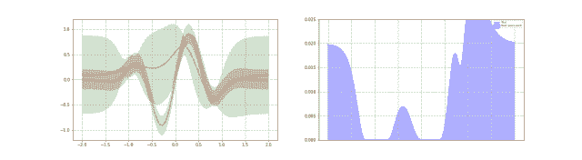

附录包含（i）高斯回归后验推导； (ii)SKLearn 的 GP 实现；(iii) GP 分类器的快速回顾。

**前言**

高斯过程（GP）是处理以下一般问题的一个工具：函数 f(x) 在 n 个点采样，并得到一组有噪声 [1] 的函数度量值 {f(xi)=y_i ± σ_i,i=1,…,n}。那么若给定这些可用的样本，且 f hat 为一些候选函数，我们是否就能估计出 f =f hat 的概率?

为了逐步明确上述问题，我们首先应用贝叶斯法则，

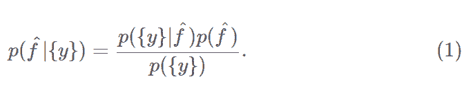

上式左边的数值是所求概率的简写，即给定样本函数值 {y} 的条件下 f=f hat 的概率。在上式的右边，分子中的第一项需要我们对测量过程中的误差来源做一些假设，分子中的第二项是先验概率，在这里我们必须采用最合理的假设。例如，我们将在下面看到先验概率有效地决定了 f 函数在给定平滑度的概率。

在 GP 方法中，右式中两个分子都服从多元正态/高斯分布。模型可以选择高斯的具体参数来达到良好的拟合度，但特征的正态族假设对于解决数学问题是必不可少的。采用这种方法，我们可以通过分析写出后验概率，然后用在一些应用和计算中。例如，我们使用这种方法来获得文中最开始处图片上的曲线，即通过拟合 GP 后验概率中随机抽样而得到曲线估计，在两个收缩点处被固定为相等的测量值。后验样本对于可视化和求蒙特卡洛的平均值都很有用。

在本文中，我们做的工作有：

（i）回顾计算上述后验概率所需的数学运算；

（ii）讨论数值评估，并使用 GP 来拟合一些实例数据；

（iii）回顾拟合的 GP 如何快速最小化成本函数，例如机器学习中的交叉验证分。

附录包括高斯过程回归推导，SKLearn 的 GP 实现和 GP 分类器的快速回顾。

我们的 GitHub 提供了简单的高斯过程示例：https://github.com/EFavDB/gaussian_processes

注意：为了理解这篇文章中的数学细节，应该熟悉多元正态分布。但如果主要对应用感兴趣，可以忽略这些细节。

**后验分析评估**

为了计算 (1) 式左边的值，我们要先计算右边的值。因为分母不依赖 f hat，我们只需要考虑分子中的项。这意味着分母必须是所有候选函数共有的归一化因子。在本节中，我们先将分子两项的估计公式写出来，然后考虑后验概率。

我们要做的第一个假设是，假如实际函数是 f hat，那么我们的测量值 y 关于 f hat 是独立的并且服从高斯分布。这个假设意味着方程 (1) 右边的第一项是：

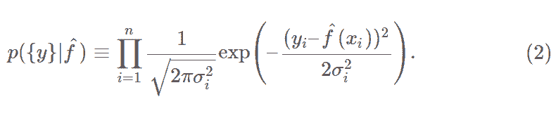

上式中的 y_i 是我们样本点的实际测量值，σ_i 方是它们的方差不确定度。

第二个假设是，假设先验概率 p（f hat）的公式。我们将注意力集中在一组数据点点 {x_i : i=1,…,N} 上，其中前 n 个点是已被抽样的点，剩下的（N-n）个点是其他位置的测试点，即我们用来估计 f 函数联合统计数据的点。接下来，简单地假设这些点服从 f 的多元正态分布，由协方差矩阵Σ来控制，由此得到


这里，我们简写 f_i≡f（x_i）。请注意，我们已经默认上面正态分布的均值是零。这是为了简便起见：如果非零均值合适，那么可以与均值相加分析，或者从原始 f 中减去非零均值使新的分布均值为零。

Σ的特殊形式是在 GP 建模时最需要建模者观察力和独创性的地方。对研究主题非常熟悉的研究者可以构建非常好且非常复杂的先验概率，而这种先验通常是各项求和的形式，其中每一项都在所讨论问题的数据基础上加入了一些物理相关的贡献。在这篇文章中，我们假设一个简单的公式，


注意，这个假设下，如果 x_i 和 x_j 很接近，那么指数近似等于 1。这确保了附近的点高度相关，从而使所有高概率函数变得平滑。当两测试点远离时，式 (4) 中的衰减速率由长度参数 l 控制。如果 l 很大（小），曲线将在一个很长（短）的距离上平滑。我们将在下一节中说明这些问题，并在下下节中解释如何从已有的样本数据中推断合适的长度参数。

现在，如果我们把式 (2) 和式 (3) 代入式 (1)，将得到后验概率 p(f1|{y}) 的表达式。这是一个指数函数，它的独立变量是 f_i 函数中的二次项。也可以说，与前验概率一样，后验概率服从多变量正态分布。通过简单计算，就可以得到这个分布均值和协方差的明确表达式：使用块（符号），其中 0 对应于采样点，1 对应于测试点，测试点的边缘分布是

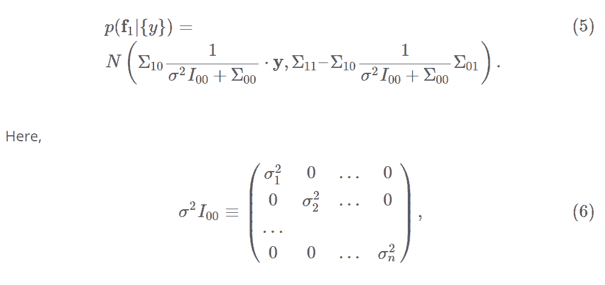

y 是测量值的向量，长度为 n,


方程 (5) 是高斯过程回归的一个主要结果——有了这个结果，我们就可以评估后验概率了。注意，在采样值 y 中所有点的均值是线性的，并且在测量值附近每个点处的方差减小。如果你有兴趣仔细推导这个结果，可以参考我们的附录，在那里有两个推导。但是，在接下来的正文中，我们仅简单地探讨这个公式的应用。

**后验概率的数值计算**

在本节中，我们将介绍式 (5) 的两个典型应用：（i）在测试点 x 处评估后验分布的均值和标准差，（ii）从后验概率中直接采样函数 f_hat。前者可以获得 f 函数在所有位置的置信区间，而后者可以用来实现可视化和从后验概率中获得一般的蒙特卡洛平均值。这两个概念都在这篇文章的标题图片中进行了说明：图片中，我们将 GP 拟合一个已有两个测量点的一维函数。蓝色阴影区域表示每个位置函数值的一个σ置信区间，彩色曲线是后验样本。

我们的 SimpleGP fitter 类的代码可以在 GitHub 上找到。我们将在下文中解释他是如何工作的，但如果对细节感兴趣应该仔细查阅代码。

**区间**

下面的代码对我们的 SimpleGP 类进行了初始化，定义了一些样本位置、样本值和不确定性，然后评估了一组测试点后验概率的均值和标准差。简而言之，这个过程如下：通过拟合评估了出现在式（5）中的逆矩阵

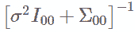

，并保留结果供以后使用，这可以避免在每个测试点中重新评估这个逆矩阵。接下来，通过调用区间，针对每个测试点再次评估式 (5)。

```py
# Initialize fitter -- set covariance parametersWIDTH_SCALE = 1.0LENGTH_SCALE = 1.0model = SimpleGP(WIDTH_SCALE, LENGTH_SCALE, noise=0)# Insert observed sample data here, fit sample_x = [-0.5, 2.5]sample_y = [.5, 0]sample_s = [0.01, 0.25]model.fit(sample_x, sample_y, sample_s)# Get the mean and std at each point in x_testtest_x = np.arange(-5, 5, .05)means, stds = model.interval(test_x)
```

在以上代码块中，WIDTH_SCALE 和 LENGTH_SCALE 用来指定协方差矩阵式（4）。前者对应于等式中的σ，后者对应于 l。增加 WIDTH_SCALE 对应于未知函数大小不确定度的增加，增加 LENGTH_SCALE 对应于增加我们期望的函数平滑程度。下图说明这些问题：这里，通过设置 WIDTH_SCALE = LENGTH_SCALE = 1 获得蓝色区间，通过设置 WIDTH_SCALE = 0.5 和 LENGTH_SCALE = 2 获得橙色区间。结果是橙色相对蓝色后验估计更加紧密平滑。在这两幅图中，实曲线表示后验分布均值，竖线表示一个σ置信区间。

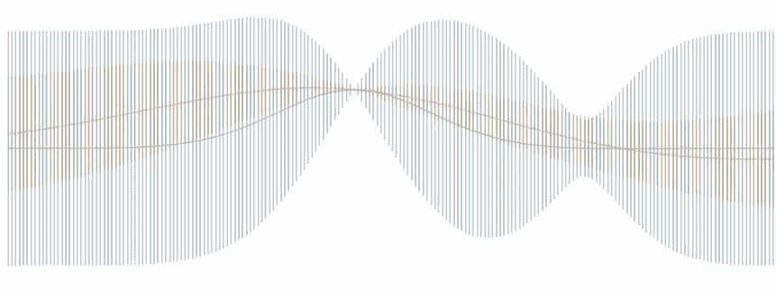

**后验采样**

为了从后验概率中采样实际函数，我们将再次简单地评估式 (5) 中的均值和协方差矩阵，这次是对我们所求采样函数的多个测试点进行。一旦我们有了这些测试点后验概率的均值和协方差矩阵，我们可以使用多元正态采样的外部库从 (5) 中抽取样本——为此，我们使用了 python 中的 numpy。下面代码的最后一步执行这些步骤。

```py
# Insert observed sample data here. sample_x = [-1.5, -0.5, 0.7, 1.4, 2.5, 3.0]sample_y = [1, 2, 2, .5, 0, 0.5]sample_s = [0.01, 0.25, 0.5, 0.01, 0.3, 0.01]# Initialize fitter -- set covariance parametersWIDTH_SCALE = 1.0LENGTH_SCALE = 1.0model = SimpleGP(WIDTH_SCALE, LENGTH_SCALE, noise=0)model.fit(sample_x, sample_y, sample_s)# Get the mean and std at each point in test_xtest_x = np.arange(-5, 5, .05)means, stds = model.interval(test_x)# Sample hereSAMPLES = 10samples = model.sample(test_x, SAMPLES)
```

注意在第 2-4 行中，我们添加了一些附加的函数样本点（为了好玩）。最后的区间和后验样本如下图所示。注意到在采样点附近，后验结果非常理想。然而，在图的左侧，一旦我们移动的距离≥1（即协方差矩阵 (4) 中的长度参数），后验就趋近于先验。

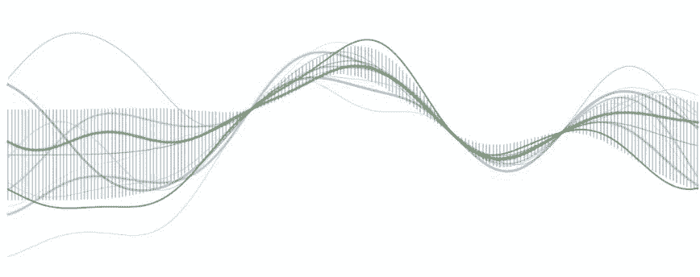

**选择协方差超参数**

之前，我们证明了我们的协方差的长度参数显着地影响后验概率的区间形状以及其中的样本。适当设置这些参数是使用 GP 的一个普遍难点。在这里，我们描述两种方法，可以巧妙地设置超参数，并给出一些采样数据。

**交叉验证**

交叉验证是设置超参数的标准方法。这需要将可用的样本数据分为训练集和验证集。训练集通过一系列超参数进行 GP 拟合，然后在已有的验证集上评估模型的准确性。然后，通过选择不同的超参数重复这个过程，选择可以使验证集表现最优的一组。

**边缘似然最大化**

通常情况下，人们倾向于将 GP 应用于评估样本有较高成本的情况。这意味着人们通常在只有少数样本可用的情况下使用 GP。这种情况下，随着训练点数量的增加，最优超参数可以快速变化，意味着通过交叉验证得到的最优选择可能远不如训练一个完整样本集得到的最优集合 [3]。

设置超参数的另一种常见方法是使边缘似然最大化。这就是说，我们试图最大化已关察样本的可能性，因而在可用超参数的基础上进行优化。具体来说，就是通过对未知的 f hat 进行积分来评估边缘似然 [4]。

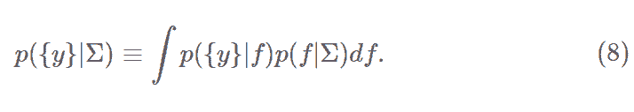

我们可以像附录中评估后验分布那样直接进行积分。但更快的方法是注意到 f 积分后，y 值服从如下的正态分布

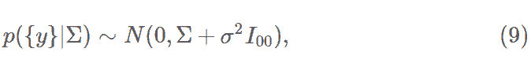

其中σ² * I_00 在式（6）中定义，由此得出，

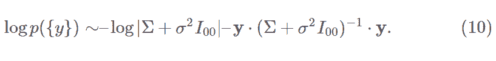

上面两项是矛盾的：第二项通过找出使指数最大的协方差矩阵来减小，最大化指数使数据过度拟合。然而，第一项与第二项相反，第一项是高斯积分的归一化因子，它随着衰减长度变短和对角线偏差降低而变大，相当于抑制复杂度的正则项。

实际中，为了使式 (10) 最大，通常利用梯度的解析表达式和梯度下降法，这是 SKLearn 采取的方法。模型的一个优点是能够优化 GP 的超参数。然而，式（10）不一定是凸的，通常存在多个局部最小值。为了获得一个好的最小值，可以尝试在一些优秀的初始点上进行初始化。或者可以在随机点重复初始化梯度下降，最后选择最优解。

**函数最小搜索和机器学习**

现在我们将介绍 GP 的一个常用的应用：快速地搜索函数最小值。在这个问题中，我们可以迭代获得函数的噪声样本，从而尽快识别函数的全局最小值。梯度下降可以应用于这种情况，但是如果函数不具备凸性，通常需要重复采样。为了减少所需的步骤/样本的数量，可以尝试应用更一般的探索式策略，即平衡「优化当前已知最小值的目标」与「寻找可能更小的新局部最小值的目标」。GP 后验为开发这样的策略的提供了一个天然的起点。

GP 搜索法的想法是在 GP 后验的基础上获得一个得分函数。这个得分函数用来对搜索给定点的信息进行编码，它可以对探索（explore）和利用（exploit）形成一种权衡。一旦每个点都进行评分，那么具有最大（或最小，最合适的）分数的点将会被采样。然后迭代重复该过程直到找到一个符合要求的解为止。我们将在下面讨论四种可能的选择，并给出一个例子。

**高斯置信下界（GLCB）**

GLCB 在每点的评分方式为

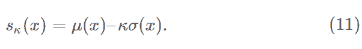

这里，μ和σ是函数在 x 处的均值和标准差的 GP 后验估计值，κ是控制参数。请注意，第一项μ（x）鼓励利用最可靠的局部最小值，并在它的周围执行搜索。类似地，第二项κσ鼓励在当前 GP 最不确定真实函数值的点上进行探索。

**改进的高斯概率（GPI）**

如果目前为止所看到的最小值是 y，则可以利用该点处的真实函数值小于 y 的概率来给每个点评分。也就是说，我们可以写为

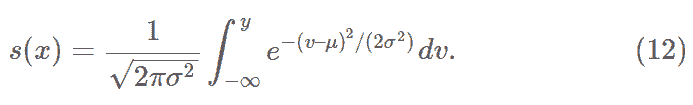

**高斯预期改进（EI）**

上式常见的变形叫做预期改进，定义为

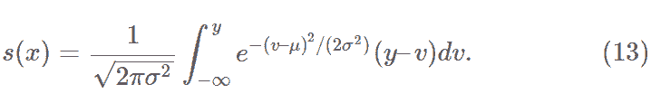

这个得分函数倾向于鼓励更多地去探索而不是改善概率，因为它更重视不确定性。

**概率最小值**

要得到的最终得分函数是问题中最小值的概率。获得这个分数的一个方法是进行多次后验采样。对于每个样本，首先标记它的全局最小值，然后采取多数投票方法来决定接下来的样本。

本文最开始处的动图展示了一个实际的 GP 搜索，使用 skopt[5] 在 python 中执行。左边的红色曲线是正在寻找全局最小值的（隐藏）曲线 f。红点是目前已经获得的样本，绿色阴影曲线是每个点的 GP 后验置信区间，该置信区间会随着更多样本的获得而逐渐改进。右边是通过在 GP 后验基础上分析得到的每点的预期改进（EI）得分函数——该例中用于指导搜索的得分函数。该过程用五个随机样本进行初始化，然后进行引导搜索。请注意，随着过程的演变，前几个样本集中利用已知的局部最小值。但经过几次迭代后，继续对这些位置采样的收益减小，探索中间点的需求占了上风——中间点是发现的实际全局最小值的点。

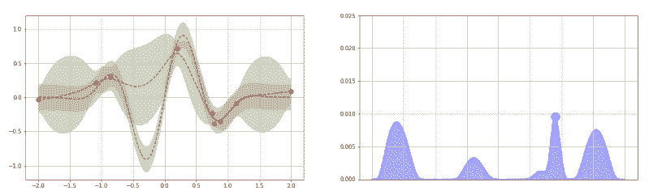

**讨论**

在这篇文章中，我们概括了大部分 GP 的数学运算：得到后验概率所需的数学，如何进行后验采样，最后讨论了如何实际应用后验概率。

总的来说，GP 代表了一个可以拟合任何函数的强大工具。实际中，使用这个工具的挑战主要在于合适超参数的选择，寻找合适的参数经常被困在局部最小，使拟合失效。不过，如果选择得当，GP 的应用可以提供一些有价值的性能提升。

附录中讨论了关于 GP 的其他话题。如果对更多的细节感兴趣，我们可以推荐 Rasmussen 和 Williams 的免费在线文本 [6]。

**附录 A：后验推导**

本附录中，我们提出后验推导（5）的两种方法。

**方法 1**

先平方，结合式（2）和式（3），简单地计算得出

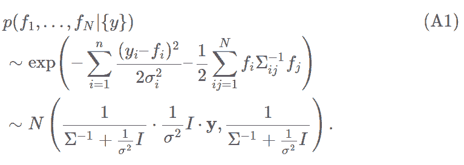

这里，(1/σ²) * I 在式（6）中被定义，但在样本集外的所有行中都为零。为了得到式（5），我们必须统一为正文中逆矩阵的分块结构。

首先，我们可以得出

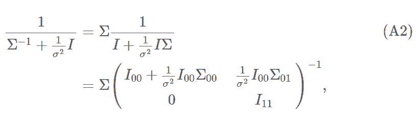

这里我们使用了分块表示法。为了计算上述的逆矩阵，我们将利用分块矩阵求逆公式，

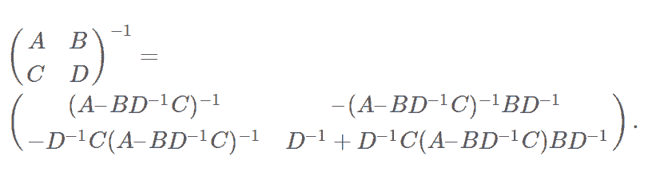

矩阵（A2）中块 C = 0、D = 1，这大大简化了上述过程。代入后得到

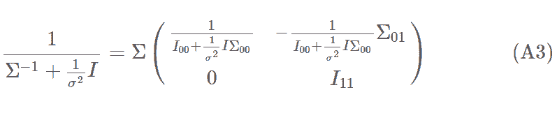

利用这个结果和（A1），我们可以得到测试集的平均值

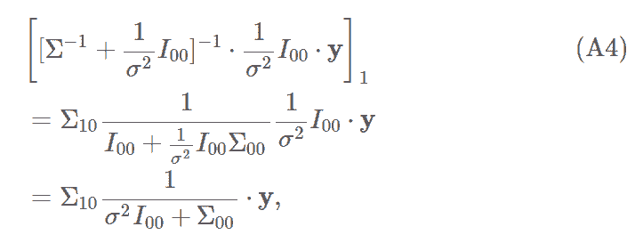

其中第二行的分子分母同时乘了 (1/σ²) * I_00 的逆。类似地，测试集的协方差由（A3）的右下块给出。得到，

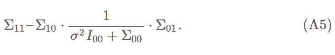

由（A4）和（A5）得出式（5）。

**方法 2**

在第二种方法中，我们考虑一组测试点 f_1 和一组观测样本 f_0 的联合分布，我们再次假设密度函数的均值为零。那么两者的联合概率密度是

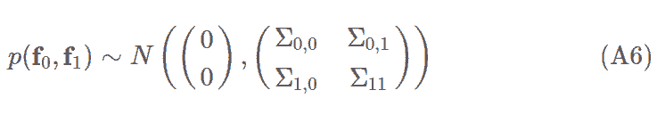

现在，我们利用结果

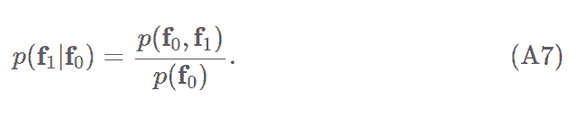

式（5）的得出需要利用上述两个表达式。主要的困难在于平方，类似于之前的推导，这可以通过分块矩阵求逆公式来完成。

**附录 B：SKLearn 实现和其他内核**

SKLearn 提供了包含 GaussianProcessRegressor 的类。使得可以在任何维度上进行拟合和采样——即它比我们的最小类更一般，因为它可以在多维上拟合特征向量。另外，SKLearn 类的拟合方法尝试为一组给定的数据找到一组最佳的超参数。如上所述，这是通过边缘似然的最大化来完成的。这里，我们提供一些关于这个类的基本注释和可以用来定义（3）中协方差矩阵Σ的内核函数，以及一段说明调用的简单代码。

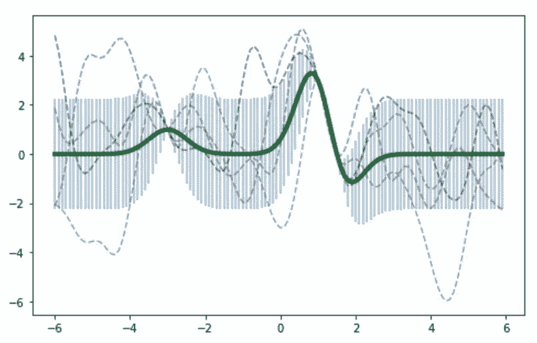

**预定义的核函数**

*   径向基函数（RBF）：这是默认值，相当于式（4）。RBF 由一个尺度参数 l 表征，多维情况下，可以是一个允许各向异性相关长度的向量。

*   White kernel：The White Kernel 用于噪声估计——文档建议用于估计全局噪声水平，但不是逐点。

*   Matern：这是一个广义的指数衰减，其中指数是分离距离的幂律。特殊限制包括 RBF 和绝对距离指数衰减。

*   有理二次方程：（1+（d / l）2）α。

*   Exp-Sine-Squared：它允许模拟周期性函数。类似于 RBF，但其距离是实际距离的正弦。存在周期性参数和「方差」——高斯抑制（Gaussian suppression）的尺度。

*   点积核函数：格式为 1 +xi⋅xj。它不是稳定的，就是说如果加入一个常量的平移，结果就会改变。如果把 N（0,1）的先验值放在系数上，将得到线性回归分析的结果。

*   核函数作为对象：可以支持核函数之间的二进制操作以创建更复杂的核函数，例如加法、乘法和指数（后者只是将初始核函数提升为幂）。你可以通过一些辅助函数来访问核函数中的所有参数，例如 kernel.get_params().kernel.hyperparameters 是所有超参数的列表。

**参数**

*   n_restarts_optimizer：重新拟合的次数，用于探索多个局部最小值，默认值是零。

*   alpha：这个可选参数允许每个测量都传递不确定性。

*   normalize_y：用来表示我们正在寻找的 y 的平均值不一定是零。

**调用示例**

下面的代码进行了一次简单拟合，结果是本文最开始展示的图片。

```py
from sklearn.gaussian_process.kernels import RBF, ConstantKernel as Cfrom sklearn.gaussian_process import GaussianProcessRegressorimport numpy as np# Build a modelkernel = C(1.0, (1e-3, 1e3)) * RBF(10, (0.5, 2))gp = GaussianProcessRegressor(kernel=kernel, n_restarts_optimizer=9)# Some dataxobs = np.array([[1], [1.5], [-3]])yobs = np.array([3, 0, 1])# Fit the model to the data (optimize hyper parameters)gp.fit(xobs, yobs)# Plot points and predictionsx_set = np.arange(-6, 6, 0.1)x_set = np.array([[i] for i in x_set])means, sigmas = gp.predict(x_set, return_std=True)plt.figure(figsize=(8, 5))plt.errorbar(x_set, means, yerr=sigmas, alpha=0.5)plt.plot(x_set, means, 'g', linewidth=4)colors = ['g', 'r', 'b', 'k']for c in colors: y_set = gp.sample_y(x_set, random_state=np.random.randint(1000)) plt.plot(x_set, y_set, c + '--', alpha=0.5)
```

关于 sklearn 实现的更多细节可以在这里找到：http://scikit-learn.org/stable/modules/generated/sklearn.gaussian_process.GaussianProcessRegressor.html

**附录 C：GP 分类器**

这里，我们说明通常 GP 如何被用来拟合二进制类型数据，响应变量 y 可以取 0 或 1 的数据。GP 分类器的数学运算不像 GP 回归那样清楚。因为 0/1 响应不是高斯分布的，意味着后验概率也不是。为了利用该程序，可以通过拉普拉斯（Laplace）近似正常地对后验概率近似。

首先写这样一个公式，表示在 x 处看到一个给定的 y 值的概率。具体如下，

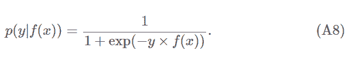

这个公式是 logistic 回归的一个正常非线性泛化。此外，f 的先验概率再次得到等式（3）。使用此式和（A8），我们可以得到 f 的后验概率

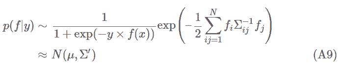

利用这个公式，可以很容易地从近似后验中获得置信区间和样本，类似于回归。

*原文链接：http://efavdb.com/gaussian-processes/*

****本文为机器之心编译，**转载请联系本公众号获得授权****。**

✄------------------------------------------------

**加入机器之心（全职记者/实习生）：hr@jiqizhixin.com**

**投稿或寻求报道：editor@jiqizhixin.com**

**广告&商务合作：bd@jiqizhixin.com**