# 深度 | 传说中的推土机距离基础，最优传输理论了解一下

选自 mindcodec

**作者：Luca Ambrogioni**

**机器之心编译**

**参与：高璇、思源**

> 随着 Wasserstein GAN 和 Sinkhorn 散度的成功，最优传输理论迅速成为机器学习研究的重要理论工具。最优传输广泛应用于生成模型、概率性自编码器、变分推断、强化学习和聚类等。换句话说，如果你是机器学习的研究人员，你需要对最优传输有所了解，否则可能会落于人后。在这一系列的文章中，作者将提供关于最优传输方法的介绍，而不依赖复杂的数学概念。

最优传输理论常以大量数学术语的形式出现，这会吓跑我们当中的非数学家，不过与现代机器学习研究最相关的最优传输的理论部分通常是很直观的。在第一篇文章中，作者将从确定性和概率性的角度阐述（Kantorovich）最优传输问题。可能很多读者都是被 Wasserstein GAN 吸引而来的，作者会在该系列的后续文章中介绍 Wasserstein GAN，同时本文将介绍对偶最优传输问题，并论证 Kantorovich-Rubinstein 的对偶性，这是对抗方法的理论基础。

**最优传输问题**

最优传输问题可以用一种非常直观的形式来表述。例如：电商有 N 个储存区域，同时 M 个订购电子书阅读器的客户。假设第 n 个存储区域 x_n 有 m_n 个阅读器，第 k 个客户 y_k 订购 h_k 个阅读器。传输代价 c(x,y) 是存储区域 y 与客户 x 之间的距离。最优传输问题就是要找到最合适的方式，将存储区域中的所有阅读器运送到订购它们的客户那里。传输地图Γ可以视为一个矩阵，矩阵的条目或元素Γ_nk 表示从第 n 个存储区域发送到第 k 个客户的电子阅读器数量。为了保持一致，离开第 n 个存储区域的所有阅读器总数必须等于在该区域中存储的阅读器总数，同时所有顾客收到的阅读器总和必须等于顾客订购的电子书阅读器的数量。这是传输问题的硬性约束条件，具体公式如下：

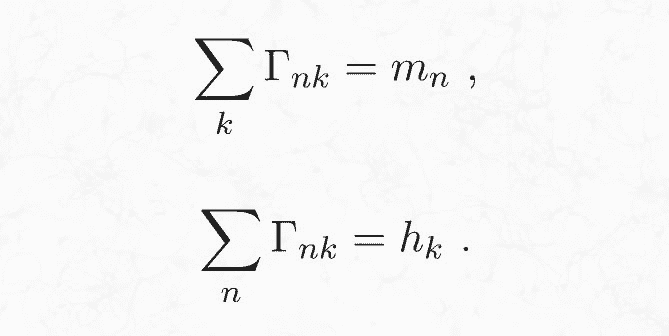

最后的约束条件是矩阵的元素必须为正值。在约束条件下使代价最小化的传输矩阵即为最优解 T hat。

在以上表达式中，我们假设从 x_n 到 y_k 运输 L 个阅读器的代价是运输一个阅读器的 L 倍。虽然这种假设在大多数实际传输问题中并不现实，因为传输代价并不会随着传输数量的增加而线性增加。但是使用线性增长简化这个问题可以得到一个高效有用的数学理论。

**概率性最优传输**

在机器学习和统计学中，用概率项重新定义最优传输问题是很有效的。考虑两个有限概率空间 (X,P) 和 (Y,Q)，其中 X 和 Y 是有限集合，P 和 Q 是分别给各自集合的元素分配概率的概率函数。P 和 Q 间的最优传输就是使下列损失函数最小化的条件概率函数γ(y|x)：

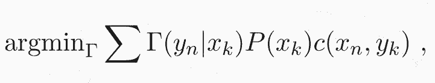

最小化上式需要服从以下的边缘约束：

这意味着联合概率Γ(y|x)P(x) 的边缘分布是 Q(y)。换句话说，Γ(y_n|x_k) 将分布 P(x) 传输为了 Q(y)。这种传输可以看做是一个将 x 作为输入，以概率γ(y|x) 将 y 作为输出的随机函数。所以问题就是找到将概率分布 P 转换为概率分布 Q 的随机传输，同时使期望传输代价最小化。可以看出，这个问题在形式上和我在前一节介绍的确定性问题相同。传输矩阵Γ_nk 由Γ(y_n|x_k)P(x_k) 给出。这可以保证自动满足第一个约束，但第二个约束仍然需要强制执行。

**连续型公式**

将概率性最优传输的定义延伸到连续型概率分布是十分简单的。可以用概率密度 p(x) 和 q(x) 替换概率分布 P(x) 和 Q(x)，再用积分求和来表达最优化过程：

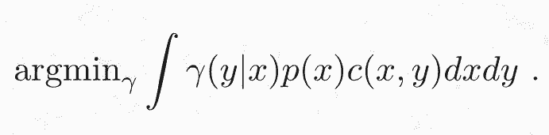

边缘化约束类似变为：

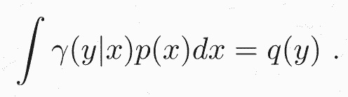

这种连续型最优传输问题会用一种稍微不同（在我看来不够主观）的形式引入。我会将联合密度γ(y|x)p(x) 表示为γ(x,y)。这个问题便可如下表示为：

加上两个边缘化约束得：

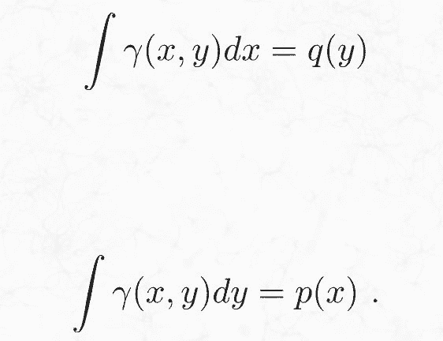

**最优传输散度**

在许多情况下，最感兴趣的不是最优传输路线。相反，我们感兴趣的是使用最优传输代价作为两个概率分布间的统计散度。统计学散度是一个函数，它以两个概率分布作为输入，输出一个非负数值，该函数当且仅当两个分布相同时输出为 0。统计学散度如 KL 散度被大量应用于统计和机器学习中，是测量两个概率分布差异的一种方式。统计学散度在统计机器学习的几个最活跃的领域中起着核心作用，例如生成模型和变分贝叶斯推断等。

**最优传输散度和 Wasserstein 距离**

最优传输散度定义为两个概率分布间的最优传输代价：

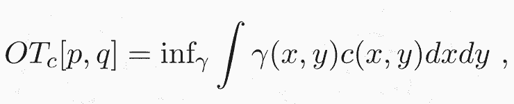

其中优化过程常受到边缘化约束。只要代价为非负，且对于所有 x 能保证 c(x,x) 代价为零，那该表达式就提供了有效散度。代价函数常常用欧氏距离平方来表示：

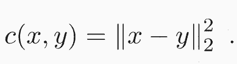

利用欧氏距离作为代价函数，我们就会得到著名的（平方）2-Wasserstein 距离：

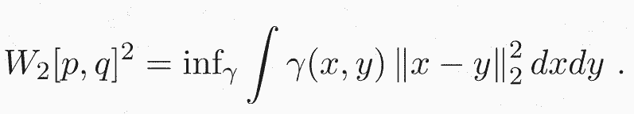

W_2[p,q]² 的平方根是概率分布间合适的度量函数，因为它遵从三角不等式。对于大多数机器学习应用程序来说，使用合适的度量函数（如 Wasserstein 距离）代替其他最优传输散度并不重要，但这些新型度量函数可以简化数学处理。

最后给定一个整数 k，则 k-Wasserstein 距离定义如下：

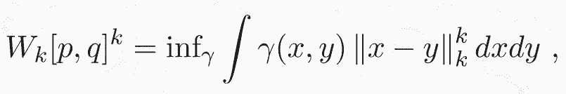

其中||·||_k 表示 L_k 范数。

**对偶问题和 Wasserstein GAN**

最优传输问题是线性规划问题的一个特例，因为要优化的函数和约束都是传输图的线性函数。线性规划背后的原理可以追溯到上世纪初，这是数学优化的基石之一。线性规划的一个最基本的结果是所有线性问题都存在对偶问题，且对偶解为原问题的解提供了上界。幸运的是，在最优传输的情况下，对偶问题的解不仅仅提供边界，而且确实与原始问题的解相同。此外，最优传输问题的对偶公式是对抗算法和 Wasserstein GAN 的出发点。最优传输散度的对偶公式如下所示：

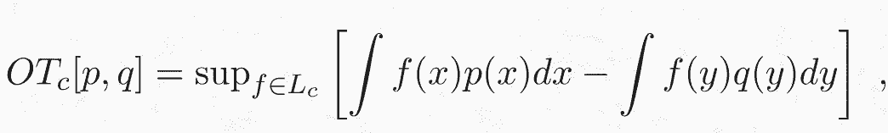

其中 L_c 是函数集合，且边界限制在 c 之内：

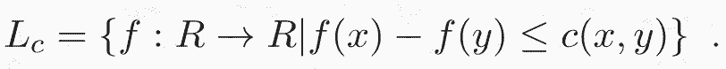

为什么这个表达式和我在前边章节里给出的原始表达式等价呢？我会在接下来的文章里证明这个结果，不过公式本身就很直观。如果 p 和 q 相等，那它们在任意函数 f 中的期望差都为零，因此散度将消失。假设 p 和 q 在某些地方不同，则需要通过找期望差最大的函数 f 来确定散度。换句话说，f 就像是特征检测器，可以最大限度地提取 p 和 q 的差异性特征。例如，假设 p 是纯净的天空，而 q 在天空中有一架飞机。在这种情况下，最优函数 f 将是飞机检测器。从这个例子中你可以看到 f 如何在 Wasserstein GAN 中起到鉴别器的作用。注意，如果 f 中没有任何限制，任何分布中的微小差异都可以任意放大，散度将变为正无穷。

**对偶性证明**

为了证明对偶性，我们需要将原问题中的有约束优化重新表示为无约束优化。思考下面的优化:

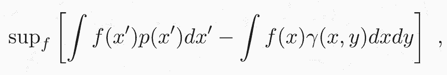

其中 f 可以是任意函数，减法左边的项表示 f 在 p 下的期望值，右边的项表示在边缘分布∫γ(x,y)dy 下的期望。如果满足 p 的边缘约束，则该表达式对于所有可能的 f 都为零，因为这两个项是相同的。然而，如果不满足约束，则对于两个边缘不同的值，可以将 x 的值 f 设为任意值，并且优化的结果将是无穷大。因此，将此形式的两项添加到优化问题的损失函数中，将不会在满足约束的情况下改变问题，但它将排除不满足约束的所有解。还要注意左边的项（∫f(x')p(x')dx'）可以移项到右边的期望积分里面，因为参数的期望积分就是常数本身：

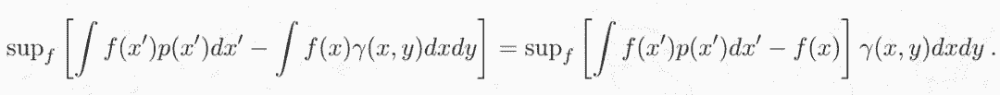

现在我们可以使用约束条件修正损失函数：

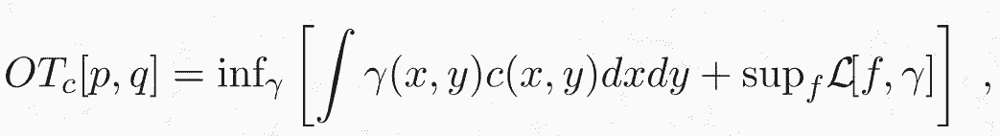

其中：

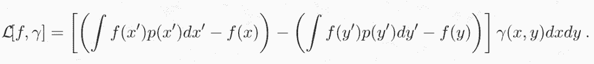

下一步要交换无穷大和上确界的顺序。这可以通过 sion 极小极大定理来实现，因为损失函数在 f 和γ中都是线性的：

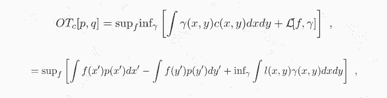

其中：

表达式右边 f 的最优化可以转为约束条件。事实上，如果对于所有 x 和 y 都有 l(x,y)≥0，那么下确界为零，这种情况会将全部概率密度分配到 x = y 的子空间。相反，如果有一个区域 l(x,y)< 0，代价则和该区域密度同样大。通过将这一项转化为约束条件，我们就得到了最优传输问题的对偶形式。

*原文链接：*

*https://www.mindcodec.com/an-intuitive-guide-to-optimal-transport-for-machine-learning/*

****本文为机器之心编译，**转载请联系本公众号获得授权****。**

✄------------------------------------------------

**加入机器之心（全职记者 / 实习生）：hr@jiqizhixin.com**

**投稿或寻求报道：**content**@jiqizhixin.com**

**广告 & 商务合作：bd@jiqizhixin.com**