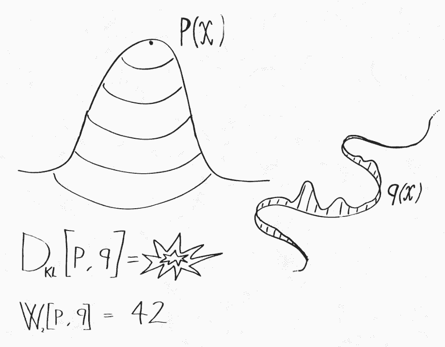

# 深度 | 最优传输理论你理解了，传说中的推土机距离重新了解一下

选自 mindcodec

**作者：Luca Ambrogioni**

**机器之心编译**

**参与：高璇、张倩、晓坤**

> 如果不解释 Wasserstein GAN (wGAN)，那关于机器学习的最优传输的介绍便不完整。在本系列的[第一篇文章](http://mp.weixin.qq.com/s?__biz=MzA3MzI4MjgzMw==&mid=2650749471&idx=3&sn=947d7b32baccb67964d76508f18317c5&chksm=871afe61b06d77776c21583bc987da42a3b56148d4b0aa2f2cdc916091b0eeaff75400787fe2&scene=21#wechat_redirect)中，作者通过原始形式和对偶形式解释了最优传输问题。作者将证明 Kantorovich-Rubinstein 对偶性作为上篇文章结尾，为 wGAN 提供了理论基础。在这篇文章中，作者将对 wGAN 背后的概念做一个直观解释，并讨论其动机和含义。

此外，作者使用的是一种更接近于原 Wasserstein 损失的新的正则化形式，而不是像 wGAN 论文中那样使用 weight clipping。读完这篇文章后，使用深度学习框架实现这种方法会相对容易些。

简单的 Chainer 实现链接如下：https://github.com/lucaambrogioni/wasserstein - gans -on- mnist。

让我们开始吧！

**使用 Wasserstein 散度的理由**

原 wGAN 论文开篇详细解释了 Wasserstein 度量相较其他常用统计散度的优势。虽然解释得很有技术性，但要传达的信息很简单：Wasserstein 度量可以用来比较完全不同的概率分布。这个不同是什么意思？最常见的例子是两个分布支撑集（函数的非零部分子集）不同，即它们分配零概率的集合组是不同的。假设 P(x) 是由概率密度定义的二维空间上的概率分布。在这个空间中，所有零体积的集合（例如单个点和曲线）在 p 下的概率为零。而 Q(x) 是一种更奇怪的分布，它将所有概率质量集中在一条曲线上。所有不包含该曲线的集合在 Q 下的概率为零，而对于一些具有零体积的集合，只要它们和该曲线有交集，那就会具有非零概率。具体可理解为下图：

这两个分布之间非常不同，很难比较。例如，为了计算它们的 KL 散度，我们需要计算所有点的密度比 p(x)/q(x)。但是对于外围空间，Q 甚至没有密度可言！然而，我们仍然可以使用在上一篇文章中介绍的最优传输形式将一个分布传输到另一个分布！两个分布之间的 Wasserstein 距离为：

让我们详细分析一下这个表达式。括号里的积分是在传输映射为γ(x_2|x_1) 的情况下，将曲线的点 x_1 传输到的外围空间的点 x_2 的平均成本。外边的积分是曲线上定义的分布 Q 下的期望成本平均值。我们可以通过以下四个步骤来总结：（1）从曲线α中选取一个点 x_1，（2）在概率为γ(x_2|x_1) 下从 x_1 到 x_2 传输一个粒子，（3）计算从 x_1 到 x_2 传输粒子的成本，（4）重复多次并求出成本的平均值。当然，为了确保将 Q 传输到目标分布 P，需要检查边缘约束是否满足：

这意味着从 Q 采样粒子后进行传输时，相当于直接从 P 采样粒子。注意，该过程并不关心分布 P 和 Q 是否具有相同的支撑集。因此，我们可以使用 Wasserstein 距离来比较这些极不相同的分布。

但这和实际应用相关吗？绝对相关。实际上，我们在概率机器学习中执行的大多数优化都涉及具有不同支撑集的分布。例如，通常假设自然图像的空间嵌在像素空间中的低维（超）表面中。如果这个假设成立，自然图像的分布就类似于我们奇怪的分布 Q。训练生成模型需要最小化模型与数据的真实分布间的散度。在这种情况下，使用 KL 散度并不是最佳的，因为它仅可以定义用密度表示的分布。这可能是变分自编码器在自然图像上比 GAN 表现差的原因之一。

**Wasserstein 距离的对偶表示**

这个变换理解起来比较困难，但我认为正确理解 wGAN 背后的机制非常重要。正如我在上一篇文章中所解释的，wGAN 的出发点是最优传输问题的对偶表示。(1-)Wasserstein 距离的对偶形式由下式表示：

其中 L 是 Lipschitz 连续函数的集合：

Wasserstein 距离的对偶表达具有非常直观的解释。函数 f 具有非线性特征映射，最大限度地增强了两个分布的样本之间的差异。例如，如果 p 和 q 分别是男性和女性面部图像的分布，则 f 将为具有男性特征的图像分配正值，并且随着输入逐渐接近超级男性的图像，这些值将变得越来越高。换句话说，最优特征映射 f 将在男性气质/女性气质谱上分配连续分数。Lipschitz 约束的作用是阻止 f 任意扩大这些差异。该约束保证了如果两个输入图像相似，则 f 的输出也相似。在前面的例子中，发型的微小差异不应该对男性/女性图谱产生巨大影响。如果没有这个约束，当 p 等于 q 和∞时结果将为零，否则通过适当的特征映射，任何微小的差异都可以被任意放大。

**Wasserstein GAN**

wGAN 背后的基本思想是最小化数据 p(x) 的采样分布与使用深度生成器合成的图像分布之间的 Wasserstein 距离。图像通过由权重φ参数化的深度生成模型 g 的潜变量 z 来获得。由此产生的损失具有以下形式：

其中 q(z) 是潜在空间上的分布。正如我们在上一节中看到的，对偶公式已经包含了非线性特征映射 f 形式的鉴别器的概念。但无法解析地获得最优的 f。不过我们可以使用深度网络对 f 进行参数化，并通过随机梯度下降来学习参数θ。这会导致极小-极大问题：

理论上，每当我们在生成器中进行优化时，鉴别器也要进行全面优化。在实践中我们同时更新φ和θ。简直完美！然后便可从最小化 Wasserstein 距离的抽象概念以及一些明显的近似中得到对抗性训练。

最后要做的是在我们的学习算法中强制执行 Lipschitz 约束。在原始的 GAN 论文中，如果权重大于预设常数，则要重新修正它们。在我看来，更规范的方法是放宽约束并为损失函数附加一个随机正则化项：

当满足约束时，该项为零，而当约束不满足时，该项为正值。原始严格约束通过将λ趋于无穷大来获得。在实践中，我们可以使用有限值λ来优化这个损失。

**Wasserstein GAN 真的最小化了最优传输散度吗？**

Wasserstein GAN 显然是一种非常有效的算法，它遵循一个简洁的理论原则。但它真的通过最小化生成器和数据分布之间的 Wasserstein 距离来实现吗？Wasserstein 距离的对偶形式关键取决于在所有可能的 Lipschitz 连续函数下使用最优非线性特征映射 f 这一事实。约束的使用造成了巨大差异。例如，如果我们使用相同的期望损失差异，但用值在-1 和 1 之间的连续函数替换 Lipschitz 函数，我们会得到总变异散度（total variation divergence）。

在训练 wGAN 时，我们实际上将 f 限制为某种具有固定架构的深度神经网络。这种约束极大地限制了唯一的 Lipschitz 约束，并且会导致完全不同的散度。从图像到实数的 Lipschitz 函数集的灵活性令人难以置信，且不会引起任何相关的归纳偏置。理论上最优的 f 可以检测人眼不可见的差异，并且不会特别侧重对于人类而言非常明显的差异。相反，深度卷积网络具有非常特殊的归纳偏置，这种偏置在某种程度上与人类视觉系统的偏置相匹配。因此，有可能 wGAN 的成功并非真的由于 Wasserstein 距离的数学特性，而是由于特征映射（鉴别器）的参数化所产生的偏置。

**好论文感想**

最初的 Wasserstein GAN 论文是一个完美的机器学习写作范例，所有机器学习研究人员都应该努力写作。论文的出发点是一个简单而优雅的数学思想，其灵感是对实际数据分布的观察。论文的算法很自然遵循了最优传输理论，其中对抗性方案从损失表示中自然涌现。最后，实验部分设计考究，结果最佳。重要的是，论文中没出现太大困难，我们大多数人通过初步的直觉和艰苦的工作实现了它。我觉得在我们的领域仍然有许多几乎唾手可得的成果，掌握它们的关键是像本篇论文一样去遵循优秀论文的思想和理论。

*原文地址：https://www.mindcodec.com/an-intuitive-guide-to-optimal-transport-part-ii-the-wasserstein-gan-made-easy/*

****本文为机器之心编译，**转载请联系本公众号获得授权****。**

✄------------------------------------------------

**加入机器之心（全职记者 / 实习生）：hr@jiqizhixin.com**

**投稿或寻求报道：**content**@jiqizhixin.com**

**广告 & 商务合作：bd@jiqizhixin.com**