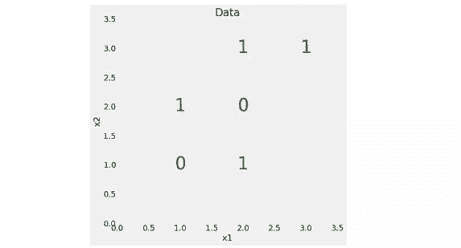

# 理解随机森林：基于 Python 的实现和解释

选自 enlight.nyc

****作者：********WILLIAM KOEHRSEN****

****机器之心编译****

**参与：Panda**

> 随机森林是一种强大的机器学习模型，得益于各种强大的库，现在人们可以很轻松地调用它，但并不是每一个会使用该模型的人都理解它的工作方式。数据科学家 William Koehrsen 用 Python 实现并解释了决策树和随机森林的工作过程。

**引言**

感谢 Scikit-Learn 这样的库，让我们现在可以非常轻松地使用 Python 实现任何机器学习算法。事实上操作起来很简单，我们往往无需了解任何有关模型内部工作方式的任何知识就能使用它。尽管我们并不需要理解所有细节，但了解一些有关模型训练和预测方式的思路仍然会有很大的帮助。这使得我们可以在模型表现不如预期时对模型进行诊断，或解释我们的模型做决策的方式——这能帮助我们说服他人使用我们的模型。

本文将介绍如何使用 Python 构建和使用随机森林。我们不只是简单地展示代码，而会尽力解释模型的工作方式。我们将从一个解决简单问题的单个决策树开始，然后逐渐深入，最终完成一个针对某个真实世界数据科学问题的随机森林。本文所涉及的完整代码可参阅这个 GitHub 上的 Jupyter Notebook：https://github.com/TryEnlight/Machine-Learning-Projects/blob/master/Random%20Forest%20Tutorial.ipynb

**理解决策树**

决策树是随机森林的构建模块，本身是一种相当直观的模型。我们可以将决策树看作是询问有关数据的问题的流程图，并最终导向一个预测类别（在回归任务上则是连续值）。这是一种可解释的模型，因为其决策方式类似于我们在现实生活中做法：我们询问一系列有关数据的问题，直到我们最终达成决策。

决策树的主要技术细节在于如何构建有关数据的问题。决策树的构建方式是构建能最大限度降低基尼不纯度（Gini Impurity）的问题。

我们稍后一点会谈到基尼不纯度，现在你只需要知道，这意味着决策树会尽力构建尽可能纯的节点，其中有很高比例的样本（数据点）都来自同一个类别。

基尼不纯度和决策树构建可能有些难以理解，所以首先我们构建一个决策树，然后我们通过一些简单的数学来进行解释。

**一个简单问题的决策树**

我们先从一个如下所示的非常简单的二元分类任务开始：



我们的数据仅有两个特征（预测变量）。这里共有 6 个数据点，2 种不同的标签。

尽管这个问题很简单，但却无法实现线性分割，也就是说我们不能在这些数据之间用一条直线将各个点划分到对应的类别。但是，我们可以画出一系列直线来分开这两个类别，这实际上就是决策树在构建系列问题时的做法。

为了创建决策树，并在数据上进行训练（拟合），我们可以使用 Scikit-Learn：

```py
from sklearn.tree import DecisionTreeClassifier
# Make a decision tree and train

tree = DecisionTreeClassifier(random_state=RSEED) 
tree.fit(X, y) 
```

这就是全部了！

在训练过程中，我们会向模型提供特征和标签，使其能够学习基于这些特征对数据点进行分类。我们没有针对这个简单问题的测试集，但在进行测试时，我们只向模型提供特征，然后让其给出对标签的预测。

我们可以在训练数据上测试模型的准确度：

```py
print(f'Model Accuracy: {tree.score(X, y)}')

Model Accuracy: 1.0 
```

可以看到正确率为 100%，这符合预期，因为我们在训练过程中已经提供过答案（y）。

**可视化决策树**

所以我们在构建决策树时究竟发生了什么？我发现最有帮助的理解决策树的方法是可视化，我们可以使用 Scikit-Learn 实用程序来做这件事（详情可参考 https://goo.gl/BYVyQJ 或 https://goo.gl/P98VjQ）。


这展现了上述决策树的整体结构。除叶节点（终端节点）之外的所有节点都有 5 部分：

1.  基于一个特征的值的有关数据的问题。每个问题的答案要么是 True，要么就是 False。数据点会根据该问题的答案在该决策树中移动。

2.  gini：节点的基尼不纯度。当沿着树向下移动时，平均加权的基尼不纯度必须降低。

3.  samples：节点中观察的数量。

4.  value：每一类别中样本的数量。比如，顶部节点中有 2 个样本属于类别 0，有 4 个样本属于类别 1。

5.  class：节点中大多数点的类别（持平时默认为 0）。在叶节点中，这是该节点中所有样本的预测结果。

叶节点没有问题，因为这些节点是得出最终预测结果的地方。要分类一个新的数据点，只需沿树向下，使用该数据点的特征来回答问题，直到到达一个叶节点即可，此处的类别即为该树的预测结果。你可以使用上述的点进行尝试或测试 Notebook 中不同的预测。

**基尼不纯度（Gini Impurity）**

现在我们应该去理解什么是基尼不纯度了。简单来说，基尼不纯度就是节点中随机选出的样本如果根据该节点的样本分布标注而因此标注不正确的概率。比如，在顶部（根）节点中，有 44.4% 的可能性将一个随机选择的数据点基于该节点的样本标签分布不正确地分类。

基尼不纯度是决策树决定用于分割节点（有关数据的问题）的特征值的方式。树会通过所有用于分割的特征来进行搜索，以最大化地降低不纯度。

基尼不纯度为 0 时最完美，因为这意味着随机选出的样本不可能被错误标注，只有当一个节点中的所有样本都属于同一类别时才会出现这种情况！在树的每一层级，加权的平均基尼不纯度都会降低，表明节点变得更纯（另一种分割节点的方法是使用信息增益，这是一个相关的概念）。

一个节点的基尼不纯度的公式为：


其中 p_i 是该节点中类别 i 中数据点的比例。我们来计算一下根（顶部）节点的基尼不纯度：


在这非常简单的数学运算中，一个非常强大的机器学习模型诞生了！

这是该决策树顶层的总基尼不纯度，因为这里仅有根节点。在这个决策树的第二层，最左边的节点的基尼不纯度为 0.5，这似乎表明不纯度增大了。但是，每一层应该降低的是基尼不纯度的加权平均。每个节点都会根据其样本占父节点样本的比例进行加权。所以整体而言，第二层的基尼不纯度为：


随着我们继续沿决策树向下，节点最终会越来越纯；在最后一层，每个节点的基尼不纯度都会达到 0.0，这说明每个节点都只包含单一类别的样本。这符合我们的预期，因为我们并没有限制决策树的深度，让其可以按需要创建足够多的层以能分类所有数据点。尽管我们的模型能正确分类所有的训练数据点，但这并不意味着它就是完美的，因为它与训练数据可能过拟合了。

**过拟合：森林比树更优的原因**

你可能会问为什么不直接使用一个决策树？这种分类器堪称完美，因为根本不会犯任何错误！但要记住一个重点：决策树只是不会在训练数据上犯错。

我们知道出现这种情况的原因是我们已经为其提供过答案。而机器学习模型的关键在于能很好地泛化用于测试数据。不幸的是，当我们不限制决策树的深度时，它往往都会与训练数据过拟合。

过拟合是指我们的模型有很高的方差并且本质上记忆了训练数据的情况。这意味着其在训练数据上表现非常好，甚至能达到完美的程度，但这样它将无法在测试数据上做出准确的预测，因为测试数据是不同的！我们想要的是既能在训练数据上表现优良，也能很好地分析测试数据的模型。为什么当我们不限制决策树的最大深度时会使其容易过拟合呢？因为此时决策树有不受限制的复杂度，这意味着它会不断生长，直到针对每个观察都有一个叶节点，从而完美地分类所有数据点。

要理解决策树高方差的原因，我们可以将其看作是一个人。想象一下，你必须分析明日苹果股票是否上涨，然后你决定去询问几位分析师。任何一位分析师都可能有很大的差异，并且非常依赖他们各自能获取的数据——一位分析师可能仅阅读支持苹果公司的新闻，因此她可能认为价格会上涨，而另一位分析师最近听朋友说苹果产品质量开始下降了，所以她认为应当下跌。这些分析师个体之间有很高的方差，因为他们的答案严重依赖于他们见过的数据。

我们也可以不询问单个分析师，而是综合大量专家的意见，并基于最常见的答案给出最终决策。因为每位分析师都会看到不同的数据，所以可以预期个体差异会很大，但整个集体的总体方差应该会减小。使用许多个体正是随机森林方法背后的本质思路：不是使用单个决策树，而是使用数百或数千个决策树来组成一个强大的模型。则该模型的最终预测结果即为集体中所有树的预测的平均。（过拟合问题也被称为「偏差-方差权衡」问题，是机器学习领域内一大基本研究主题。）

**随机森林**

随机森林是由许多决策树构成的模型。这不仅仅是森林，而且是随机的，这涉及到两个概念：

1.随机采样数据点

2.基于特征的子集分割节点

**随机采样**

随机森林的一大关键是每个树都在随机的数据点样本上进行训练。这些样本是可重复地抽取出来的（称为 bootstrapping），也就是说某些样本会多次用于单个树的训练（如果有需要，也可以禁止这种做法）。其思路是，通过在不同样本上训练每个树，尽管每个树依据训练数据的某个特定子集而可能有较高方差，但整体而言整个森林的方差会很低。这种在数据的不同子集上训练每个单个学习器然后再求预测结果的平均的流程被称为 bagging，这是 bootstrap aggregating 的缩写。

**特征的随机子集**

随机森林背后的另一个概念是：在每个决策树中，分割每个节点时都只会考虑所有特征中的一个子集。通常设定为 sqrt(n_features)，意思是在每个节点，决策树会基于一部分特征来考虑分割，这部分特征的数量为总特征数量的平方根。随机森林也可以在每个节点考虑所有特征来进行训练。（在 Scikit-Learn 随机森林实现中，这些选项是可调控的。）

如果你理解了单个决策树、bagging 决策树、特征的随机子集，那你就可以很好地理解随机森林的工作方式了。随机森林组合了数百或数千个决策树，并会在稍有不同的观察集上训练每个决策树（数据点是可重复地抽取出来的），并且会根据限定数量的特征分割每个树中的节点。随机森林的最终预测结果是每个单个树的预测结果的平均。

**随机森林实践**

非常类似于其它 Scikit-Learn 模型，通过 Python 使用随机森林仅需要几行代码。我们将会构建一个随机森林，但不是针对上述的简单问题。为了比较随机森林与单个决策树的能力，我们将使用一个真实数据集，并将其分成了训练集和测试集。

**数据集**

我们要解决的问题是一个二元分类任务。特征是个体的社会经济和生活方式属性，标签 0 表示健康状况差，标签 1 表示身体健康。该数据集是由美国疾病预防控制中心收集的，可在这里获取：https://www.kaggle.com/cdc/behavioral-risk-factor-surveillance-system。这是一个不平衡分类问题，因此准确度并不是合适的度量标准。我们将衡量曲线下受试者工作特性曲线（ROC AUC），该度量的取值范围为 0（最差）到 1（最好），随机猜测的分数为 0.5。我们还可以绘制 ROC 曲线来评估模型的表现。

引言提到的 Jupyter Notebook 包含了针对该任务的决策树和随机森林实现，但这里我们只关注随机森林。在读取了数据之后，我们可以用以下代码实例化并训练一个随机森林：

```py
from sklearn.ensemble import RandomForestClassifier

# Create the model with 100 trees

model = RandomForestClassifier(n_estimators=100, 
random_state=RSEED, 
max_features = 'sqrt', 
n_jobs=-1, verbose = 1)

# Fit on training data

model.fit(train, train_labels) 
```

经过几分钟的训练之后，可以通过以下代码让该模型基于测试数据进行预测：

```py
rf_predictions = model.predict(test) rf_probs = model.predict_proba(test)[:, 1] 
```

我们既有类别预测结果（predict），也有预测概率（predict_proba），都是计算 ROC AUC 所需的。有了测试预测结果之后，我们可以将它们与测试标签进行比较，以计算出 ROC AUC。

```py
from sklearn.metrics import roc_auc_score

# Calculate roc auc

roc_value = roc_auc_score(test_labels, rf_probs) 
```

**结果**

随机森林的最终 ROC AUC 结果是 0.87，而单个决策树的结果是 0.67。如果我们看看训练分数，可以看到这两个模型都得到了 1.0 的 ROC AUC，同样这符合预期，因为我们已经为这些模型提供过训练数据的答案并且没有限制最大深度。但是，尽管随机森林过拟合了，但比起单个决策树，它仍能远远更好地泛化到测试数据上。

检视模型内部，可以看到单个决策树的最大深度为 55，共有 12327 个节点。随机森林中决策树的平均深度为 46，平均节点数为 13396。即使随机森林的平均节点数更大，它也能更好地泛化！

我们还可以绘制单个决策树（上）和随机森林（下）的 ROC 曲线。曲线越靠近左上角，则模型越好：


可以看到随机森林明显优于单个决策树。

我们还可以使用另一种模型诊断方法，即绘制测试预测结果的混淆矩阵（详见 Jupyter Notebook）：


**特征重要度**

随机森林中的特征重要度是指在依据该特征分割的所有节点上基尼不纯度降低的总和。我们可以使用这一指标确定随机森林认为最重要的预测变量是什么。特征重要度可从训练后的随机森林中提取出来，并表示成 Pandas dataframe 的形式：

```py
import pandas as pd

fi = pd.DataFrame({'feature': list(train.columns), 
'importance': model.feature*importances*}). 
sort_values('importance', ascending = False)

fi.head()

feature importance 
tDIFFWALKt0.036200 
tQLACTLM2t0.030694 
tEMPLOY1t 0.024156 
tDIFFALONt0.022699 
tUSEEQUIPt0.016922 
tDECIDEt 0.016271 
t_LMTSCL1t0.013424 
tINCOME2t 0.011929 
tCHCCOPD1t0.011506 
t_BMI5t 0.011497 
```

我们还可以使用特征重要度来进行特征选择，即移除重要度为 0 或较低的特征。

**可视化森林中的树**

最后，我们可以可视化森林中的单个决策树。这时候我们就必须限定树的深度了，因为整个树非常大，难以转换成单张图像。我将最大深度设定为 6，得到了下面的图像。这仍然是一副很大的图！


**接下来的步骤**

下一步可以对随机森林进行优化，可以通过随机搜索和 Scikit-Learn 中的 RandomizedSearchCV 来做。

优化是指为给定数据集上的模型寻找最佳的超参数。数据集不同，最佳的超参数也会各有不同，所以我们必须分别在每个数据集上执行优化（也被称为模型调节）。我喜欢将模型调节看作是寻找机器学习算法的最佳设置。

引言中提到的 Jupyter Notebook 提供了一个用于随机森林的模型优化的随机搜索的实现。

**总结**

尽管我们无需理解机器学习模型内部的任何情况也能构建出强大的机器学习模型，但了解一些模型工作方式的相关知识将大有裨益。在本文中，我们不仅用 Python 构建和使用了一个随机森林，而且还对该模型进行了理解。

我们首先了解了单个决策树，这是随机森林的基本构建模块；然后我们看到了可以如何将数百或数千个决策树组合成一个集合模型。当这种集合模型与 bagging 和随机的特征采样一起使用时，就被称为随机森林。本文中涉及的关键概念有：

1.  决策树：基于有关特征值的问题的流程图进行决策的直观模型。因为过拟合训练数据而有很高的方差。

2.  基尼不纯度：决策树在分割每个节点时所要最小化的指标。表示从一个节点随机选出的一个样本依据该节点的样本分布而错误分类的概率。

3.  bootstrapping：可重复地采样随机观察集。随机森林用于训练每个决策树的方法。

4.  随机特征子集：在考虑如何分割决策树中的每个节点时，选择一个随机的特征集。

5.  随机森林：由数百或数千个使用 bootstrapping、随机特征子集和平均投票来做预测的决策树构成的集合模型。这是 bagging 集成的一个示例。

6.  偏差-方差权衡：机器学习领域内的一个基本问题，描述了高复杂度的模型和简单模型之间的权衡。高复杂度模型可以很好地学习训练数据，但代价是不能很好地泛化到测试数据（高方差）；而简单模型（高偏差）甚至无法学习训练数据。随机森林能在降低单个决策树的方差的同时准确地学习训练数据，从而在测试数据上得到更好的预测结果。

希望这篇文章能为你提供信心，帮助你理解随机森林并开始在你自己的项目中使用它。随机森林是一种强大的机器学习模型，但这不应该妨碍我们理解它的工作方式！我们对一个模型的了解越多，我们就能越好地使用它以及解释它做预测的方式，这样其他人才会信任它！现在行动起来，用随机森林解决一些问题吧。********

*原文链接：https://enlight.nyc/projects/random-forest/*

****本文为机器之心编译，**转载请联系本公众号获得授权****。**

✄------------------------------------------------

**加入机器之心（全职记者 / 实习生）：hr@jiqizhixin.com**

**投稿或寻求报道：**content**@jiqizhixin.com**

**广告 & 商务合作：bd@jiqizhixin.com**