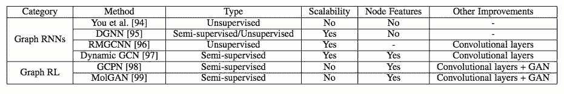

# 深度学习时代的图模型，清华发文综述图网络

选自 arXiv

****作者：张子威、崔鹏、朱文武****

**机器之心编译**

**参与：路、晓坤**

> 深度学习在多个领域中实现成功，如声学、图像和自然语言处理。但是，将深度学习应用于普遍存在的图数据仍然存在问题，这是由于图数据的独特特性。近期，该领域出现大量研究，极大地提升了图分析技术。清华大学朱文武等人综述了应用于图的不同深度学习方法。

他们将现有方法分为三个大类：半监督方法，包括图神经网络和图卷积网络；无监督方法，包括图自编码器；近期新的研究方法，包括图循环神经网络和图强化学习。然后按照这些方法的发展史对它们进行系统概述。该研究还分析了这些方法的区别，以及如何合成不同的架构。最后，该研究简单列举了这些方法的应用范围，并讨论了潜在方向。

**引言**

近十年，深度学习成为人工智能和机器学习这顶皇冠上的明珠，在声学、图像和自然语言处理领域展示了顶尖的性能。深度学习提取数据底层复杂模式的表达能力广受认可。但是，现实世界中普遍存在的图却是个难点，图表示对象及其关系，如社交网络、电商网络、生物网络和交通网络。图也被认为是包含丰富潜在价值的复杂结构。因此，如何利用深度学习方法进行图数据分析近年来吸引了大量的研究者关注。该问题并不寻常，因为将传统深度学习架构应用到图中存在多项挑战：

不规则领域：与图像不同，音频和文本具备清晰的网格结构，而图则属于不规则领域，这使得一些基础数学运算无法泛化至图。例如，为图数据定义的卷积和池化操作并不是直接的，而这些是卷积神经网络（CNN）中的基础操作。这通常被称为几何深度学习问题 [7]。

多变的结构和任务：图具备多样化的结构，因此比较复杂。例如，图可以是同质的也可以是异质的，可以是加权的也可以不加权，可以是有符号的也可以是无符号的。此外，图任务也有很多种，从节点问题（如节点分类和连接预测）到图问题（如图分类和图生成）不一而足。多变的结构和任务需要不同的模型架构来解决特定的问题。

可扩展性和并行化：在大数据时代，实际的图数据很容易扩展成数百万节点和边，如社交网络或电商网络。因此，如何设计可扩展模型（最好具备线性时间复杂度）成为关键的问题。此外，由于图中的节点和边是互连的，通常需要作为一个整体来建模，因此如何实施并行化计算是另一个关键问题。

跨学科：图通常与其他学科有关，如生物学、化学或社会科学。这种跨学科性质提供了机会，当然也有挑战：领域知识可用于解决特定问题，但集成领域知识可能使模型设计更难。例如，在生成分子图时，目标函数和化学约束通常是不可微的，因此无法轻松使用基于梯度的训练方法。

为了解决这些挑战，研究人员付出了大量努力，因此该领域有大量相关论文和方法的文献。之前研究采用的架构也是变化万千，从监督式方法到无监督方法，从卷积网络到递归网络都有。但是，几乎没有什么研究系统性概述这些方法之间的区别和联系。

本研究尝试通过对图深度学习方法的综述填补这一空白。如图 1 所示，该研究将现有方法分为三个大类：半监督方法、无监督方法和近期进展。具体来说，半监督方法包括图神经网络（GNN）和图卷积网络（GCN），无监督方法主要包括图自编码器（GAE），近期进展包括图循环神经网络和图强化学习。这些方法的主要区别如表 1 所示。大体上，GNN 和 GCN 是半监督方法，因为它们利用节点属性和节点标签端到端地训练模型参数，而 GAE 主要使用无监督方法学习表征。近期的先进方法使用其它独特的算法（不归属前两个类别）。除了这些高层次的区别外，在模型架构上也存在很大不同。本论文主要按照这些方法的发展史和如何解决图问题进行详细综述。本研究还分析了这些模型的区别，以及如何合成不同的架构。文章最后，简单概述了这些方法的应用和潜在方向。

*图 1：图深度学习方法分类。*

*表 1：图深度学习方法的主要区别。*

*表 2：常用符号表。*

**图神经网络（GNN）**

这部分介绍适用于图数据的最初半监督方法——图神经网络（GNN）。

GNN 的来源可以追溯到「前深度学习」时代。GNN 的思路很简单：为了编码图的结构信息，可以用低维状态向量 s_i（1 ≤ i ≤ N）表示每个节点 v_i。受递归神经网络的启发，这里采用状态的递归定义：

其中 F(·) 是待学习的参数函数。得到 s_i 以后，使用另一个参数函数 O(·) 获取最终输出：

对于图任务，这些研究建议添加一个对应整个图独特属性的特殊节点。为学习模型参数，可采用以下半监督方法：在使用雅各比方法迭代地求解 Eq. (1)，使之达到稳定点之后，使用 Almeida-Pineda 算法执行一个梯度下降步，以最小化任务特定的目标函数（例如回归任务的预测值和真值之间的平方误差）；然后，重复该过程直到收敛。

在 Eqs. (1)(2) 这两个简单公式的帮助下，GNN 扮演了两个重要角色。GNN 结合了处理图数据的一些早期方法，如递归神经网络和马尔可夫链。GNN 的理念也为未来研究提供了一些启发：未来我们会发现，一些当前最优的 GCN 实际上具备与 Eq. (1) 类似的公式，同时也遵循与近邻交换信息的框架。事实上，GNN 和 GCN 可以被统一成一个框架，GNN 等同于使用相同层到达稳定状态的 GCN。

尽管 GNN 理论上很重要，它也有一些缺陷。首先，要确保 Eq. (1) 有唯一解，F(·) 必须是「压缩映射」（contraction map），这严重限制了建模能力。其次，由于梯度下降步之间需要很多次迭代，GNN 的计算成本高昂。由于这些缺陷、算力的缺乏（那时候 GPU 并未广泛用于深度学习）以及缺乏研究兴趣，当时 GNN 并不为社区所熟知。

GNN 的一个重大改进是门控图-序列神经网络（Gated Graph Sequence Neural Network，GGS-NN）[26]。其作者将 Eq. (1) 的递归定义换成了门控循环单元（GRU）[27]，从而移除了对「压缩映射」的需求，并且该网络支持使用现代优化技术。Eq. (1) 被替换成：

GNN 及其扩展有很多应用。如 CommNet [29] 使用 GNN 学习 AI 系统中的多智能体沟通，它将每个智能体作为一个节点，并在执行动作前先与其他智能体进行多个时间步的沟通来更新智能体状态。Interaction Network (IN) [30] 使用 GNN 进行物理推理，它将对象表示为节点、将关系表示为边、使用伪时间作为模拟系统。VAIN [31] 引入了注意力机制来衡量不同的交互，从而改进了 CommNet 和 IN。关系网络 (RN) [32] 使用 GNN 作为关系推理模块，来增强其他神经网络，在视觉问答任务上取得了不错的结果。

**图卷积网络（GCN）**

*表 3：不同图卷积网络（GCN）的对比。*

**图自编码器（GAE）**

自编码器（AE）及其变体在无监督学习中得到广泛使用，它适合在没有监督信息的情况下学习图的节点表征。这部分首先介绍图自编码器，然后介绍图变分自编码器和其他改进版变体。

GAE 的主要特征见下表：

*表 4：不同图自编码器（GAE）的对比。*

**自编码器**

用于图的 AE 来源于稀疏自编码器（Sparse Autoencoder，SAE）。其基本思路是，将邻接矩阵或其变体作为节点的原始特征，从而将 AE 作为降维方法来学习低维节点表征。具体来说，SAE 使用以下 L2 重建损失：

实验证明 SAE 优于非深度学习基线模型。但是，由于其理论分析不正确，支持其有效性的底层机制尚未得到解释。

结构深度网络嵌入（Structure Deep Network Embedding，SDNE）[76] 解决了这个难题，它表明 Eq. (35) 中的 L2 重建损失对应二阶估计，即如果两个节点具备类似的近邻，则它们共享类似的隐藏表征。受表明一阶估计重要性的网络嵌入方法的启发，SDNE 修改了目标函数，添加了一个类似于拉普拉斯特征映射的项：

*图 7：SDNE 框架图。节点的一阶估计和二阶估计都使用深度自编码器来保存。*

受到其他研究的启发，DNGR [77] 将 Eq. (35) 中的转换矩阵 P 替换成随机 surfing 概率的正逐点互信息（PPMI）矩阵。这样，原始特征可以与图的随机游走概率关联起来。但是，构建这样的输入矩阵需要 O(N² ) 的时间复杂度，无法扩展到大规模图。

GC-MC [78] 进一步采取了不同的自编码器方法，它使用 [36] 中的 GCN 作为编码器：

解码器是简单的双线性函数：

DRNE [79] 没有重建邻接矩阵或其变体，而是提出另一种修改：使用 LSTM 聚合近邻信息，从而直接重建节点的低维向量。具体来说，DRNE 最小化以下目标函数：

与之前研究将节点映射到低维向量的做法不同，Graph2Gauss (G2G) [80] 提出将每个节点编码为高斯分布 h_i = N (M(i, :), diag (Σ(i, :)))，以捕获节点的不确定性。具体来说，作者将从节点属性到高斯分布均值和方差的深度映射作为编码器：

**变分自编码器**

与之前的自编码器不同，变分自编码器（VAE）是另一种将降维与生成模型结合的深度学习方法。VAE 首次在 [81] 中提出用于建模图数据，其解码器是一个简单的线性乘积：

至于均值和方差矩阵的编码器，作者采用 [36] 中的 GCN：

由于完整图需要重建，其时间复杂度为 O(N²)。

受 SDNE 和 G2G 的启发，DVNE [82] 提出另一个用于图数据的 VAE，它也将每个节点表示为高斯分布。但与之前使用 KL 散度作为度量的研究不同，DVNE 使用 Wasserstein 距离来保留节点相似度的传递性。与 SDNE 和 G2G 类似，DVNE 也在目标函数中保留一阶估计和二阶估计：

重建损失为：

*图 8：DVNE 框架图。DVNE 使用 VAE 将节点表示为高斯分布，并采用 Wasserstein 距离来保留节点相似度的传递性。*

**其他改进**

*图 9：ARGA/ARVGA 框架图。该方法向 GAE 添加了对抗训练机制。（图中的符号与本文主题略有不同，图中的 X 和 Z 分别对应 F^V and H。*

**近期进展**

下表展示了近期进展中多种方法的特征。

**图循环神经网络（Graph RNN）**

You et al. [94] 将 Graph RNN 应用到图生成问题中。他们使用两个 RNN，一个用于生成新节点，另一个自回归地为新添加的节点生成边。他们展示了这种分层 RNN 架构可以从输入图中高效学习，且时间复杂度也是可接受的。

动态图神经网络（Dynamic Graph Neural Network，DGNN）[95] 使用时间感知 LSTM [100] 来学习动态图中的节点表征。在建立新的边之后，DGNN 使用 LSTM 更新两个交互节点（interacting node）及其直接近邻的表征，即考虑一步传播效应（one-step propagation effect）。作者展示了时间感知 LSTM 可以很好地建模边结构的已建立顺序以及时间间隔，这反过来惠及大量图应用。

也可以将 Graph RNN 结合其他架构，如 GCN 或 GAE。例如，RMGCNN [96] 将 LSTM 应用于 GCN 的结果，以渐进地重建图（如图 10 所示）。该方法旨在解决图稀疏性问题。动态 GCN [97] 使用 LSTM 收集动态网络中不同时间片的 GCN 结果，旨在捕获时空图信息。

*图 10：RMGCNN 架构图。RMGCNN 将 LSTM 添加到 GCN 中，以渐进地重建图。*

**图强化学习**

GCPN [98] 使用强化学习执行目标导向的模块化图生成任务，以处理不可微目标和约束。具体来说，作者将图生成建模为马尔可夫决策过程，将生成模型作为在图生成环境中运行的强化学习智能体。GCPN 将类似智能体动作作为连接预测问题，使用领域特定奖励和对抗奖励，使用 GCN 来学习节点表征，从而通过策略梯度方法实现端到端地训练。实验结果证明 GCPN 在多种图生成问题上的有效性。

MolGAN [99] 采取了类似的思路，它使用强化学习来生成模块化图。不过它不是通过一系列动作来生成图，而是直接生成整个图，该方法比较适用于小分子。

**结论与讨论**

应用。除了标准的图推断任务（如节点分类或图分类）基于图的深度学习方法还被应用于大量学科，如建模社会影响力 [103]、推荐 [51], [78], [96]、化学 [37], [41], [50], [98], [99]、物理 [104], [105]、疾病预测或药物预测 [106]–[108]、自然语言处理 [109], [110]、计算机视觉 [111]–[114]、交通预测 [115], [116]、程序归纳 [117]，以及解决基于图的 NP 问题 [118], [119]。

还有一些值得讨论的方向：

不同类型的图。图数据的结构变化万千，现有方法无法处理所有结构。例如，大部分方法聚焦于同质图，很少有研究涉及异质图，尤其是包含不同模态的图。有符号网络（其负边表示节点之间的冲突）也有独特结构，对现有方法提出了挑战。表示两个以上对象之间复杂关系的超图（Hypergraph）也未得到完备研究。接下来重要的一步是涉特定的深度学习模型来处理这些不同类型的图。

动态图。大部分现有方法聚焦于静态图。然而，很多现实中的图是动态的，其节点、边和特征都会随着时间而改变。例如，在社交网络中，人们可能建立新的社交关系、删除旧的关系，其爱好和职位等特征都会随着时间改变。新用户可能会加入社交网络，老用户也可能离开。如何建模动态图不断变化的特征，支持逐渐更新的模型参数？这个问题仍然是个开放性问题。一些初步研究尝试使用 Graph RNN 架构解决该问题，结果令人鼓舞 [95], [97]。

可解释性。由于图通常与其他学科相关，解释图深度学习模型对于决策问题来说是关键。例如，在医疗问题中，可解释性在将计算机经验转换为临床使用中必不可少。但是，基于图的深度学习模型比其他黑箱模型更难解释，因为图中的节点和边高度关联。

复合性。如前所述，很多现有架构可以结合起来使用，例如将 GCN 作为 GAE 或 Graph RNN 中的一个层。除了涉及新的构造块以外，如何符合这些已有架构是一个有趣的未来研究方向。近期研究 Graph Networks [9] 跨出了第一步，它使用 GNN 和 GCN 的通用框架来解决关系推理问题。

总之，上述调查展示了基于图的深度学习是一个很有前景并发展迅速的领域，机会与挑战并存。研究基于图的深度学习为建模关系数据提供了关键的构造块，也是走向更好的机器学习和人工智能时代的重要一步。********

****本文为机器之心编译，**转载请联系本公众号获得授权****。**

✄------------------------------------------------

**加入机器之心（全职记者 / 实习生）：hr@jiqizhixin.com**

**投稿或寻求报道：**content**@jiqizhixin.com**

**广告 & 商务合作：bd@jiqizhixin.com**