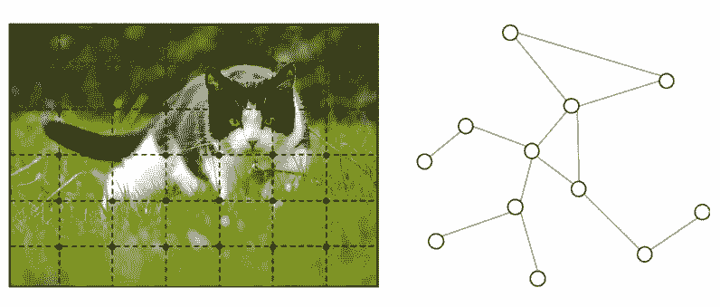
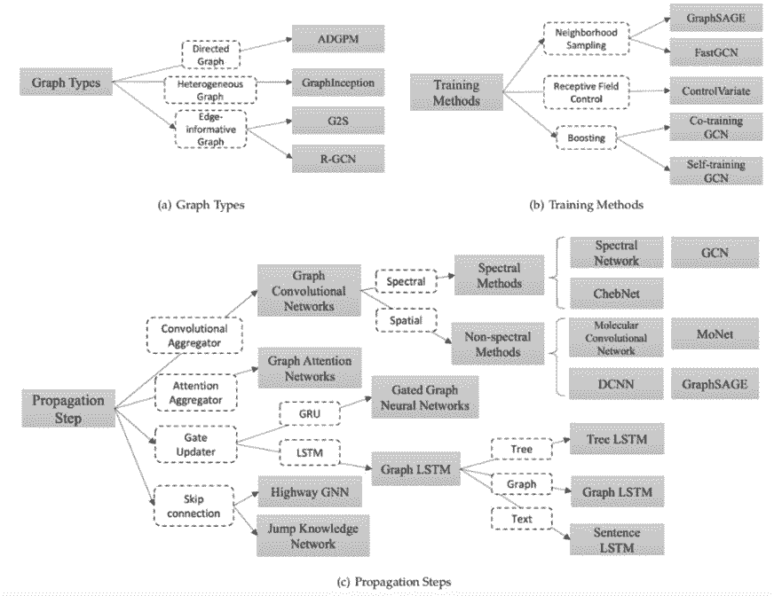
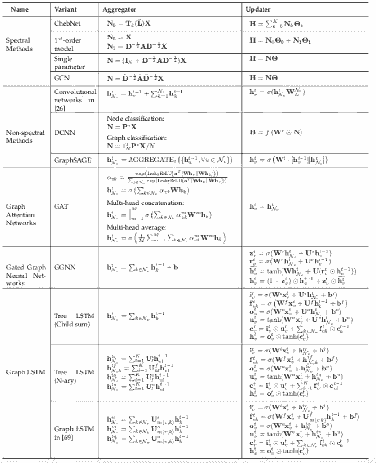
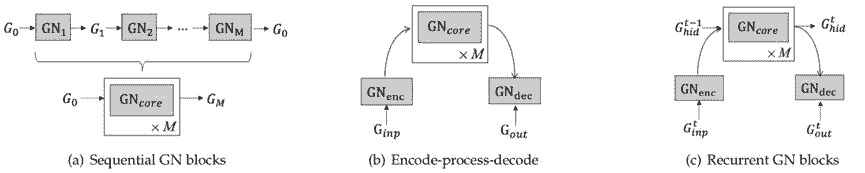
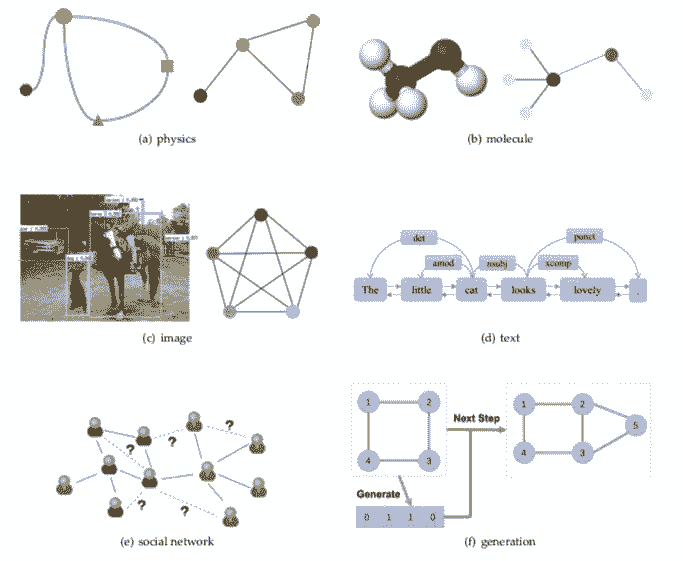
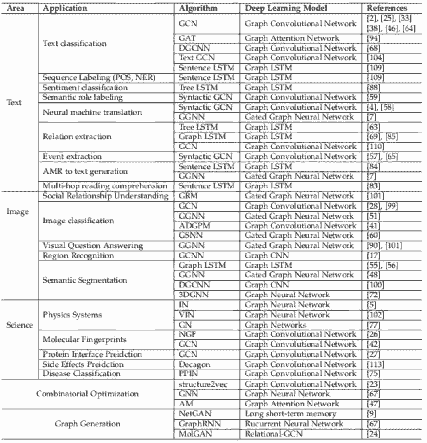

# 清华大学图神经网络综述：模型与应用

机器之心专栏

**作者：**** PaperWeekly**

> 近年来，图神经网络的研究成为深度学习领域的热点，机器之心曾介绍过清华大学[朱文武等人综述的图网络](http://mp.weixin.qq.com/s?__biz=MzA3MzI4MjgzMw==&mid=2650754422&idx=4&sn=0dc881487f362322a875b4ce06e645f7&chksm=871a8908b06d001ef7386ccc752827c20711877a4a23d6a8318978095dd241d118257c607b22&scene=21#wechat_redirect)。近日，清华大学孙茂松组在 arXiv 上发布预印版综述文章 Graph Neural Networks: A Review of Methods and Applications。

**该文总结了近年来图神经网络领域的经典模型与典型应用，并提出了四个开放性问题。**对于希望快速了解这一领域的读者，不妨先从这篇文章看起。 

除了这篇综述外，文章作者在 Github 中更新了该领域的参考文章列表（https://github.com/thunlp/GNNPapers），供各位读者参考查看。

## 引言

图是一种数据结构，它对一组对象（节点）及其关系（边）进行建模。近年来，由于图结构的强大表现力，用机器学习方法分析图的研究越来越受到重视。图神经网络（GNN）是一类基于深度学习的处理图域信息的方法。由于其较好的性能和可解释性，GNN 最近已成为一种广泛应用的图分析方法。

**GNN 的第一个动机源于卷积神经网络（CNN）。**CNN 的广泛应用带来了机器学习领域的突破并开启了深度学习的新时代。然而 CNN 只能在规则的 Euclidean 数据上运行，如图像（2 维网格）和文本（1 维序列）。如何将 CNN 应用于图结构这一非欧几里德空间，成为 GNN 模型重点解决的问题。

▲ 图 1. 左：图像（欧几里得空间） 右：图（非欧几里德空间）

**GNN 的另一个动机来自图嵌入（Graph Embedding），它学习图中节点、边或子图的低维向量空间表示。**DeepWalk、LINE、SDNE 等方法在网络表示学习领域取得了很大的成功。然而，这些方法在计算上较为复杂并且在大规模上的图上并不是最优的，GNN 旨在解决这些问题。

**这篇文章对图神经网络进行了广泛的总结，并做出了以下贡献：** 

*   文章详细介绍了图神经网络的经典模型。主要包括其原始模型，不同的变体和几个通用框架。

*   文章将图神经网络的应用系统地归类为结构化场景、非结构化场景和其他场景中，并介绍了不同场景中的主要应用。

*   本文为未来的研究提出四个未解决的问题。文章对每个问题进行了详细分析，并提出未来的研究方向。

## 模型

在模型这一部分中，文章首先介绍了最经典的图神经网络模型 GNN，具体阐述了 GNN 的模型与计算方式，然而 GNN 模型仍然存在一定的限制，比如较高的计算复杂度以及表示能力不足等等。

后续的很多工作致力于解决 GNN 存在的种种问题，在 2.2 一节中文章详细介绍了 GNN 的不同变体。具体来说，**文章分别介绍了适应于不同图类型、采用不同的信息传递方式以及采用了不同的训练方法的变体。**

▲ 图 2. 不同的 GNN 变体

在 2.2.1 节中，文章介绍了处理不同图类型的 GNN 变体，包括有向图、异质图和具有边信息的图。在 2.2.2 节中，**文章对于采用不同信息传递方式的变体进行了总结与概括。主要分为以下四个类别：**

**卷积。**Graph Convolutional Network（GCN）希望将卷积操作应用在图结构数据上，主要分为 Spectral Method 和 Spatial Method（Non-spectral Method）两类。Spectral Method 希望使用谱分解的方法，应用图的拉普拉斯矩阵分解进行节点的信息收集。Spatial Method 直接使用图的拓扑结构，根据图的邻居信息进行信息收集。

**注意力机制。**Graph Attention Network 致力于将注意力机制应用在图中的信息收集阶段。

**门机制。**这些变体将门机制应用于节点更新阶段。Gated graph neural network 将 GRU 机制应用于节点更新。很多工作致力于将 LSTM 应用于不同类型的图上，根据具体情境的不同，可以分为 Tree LSTM、Graph LSTM 和 Sentence LSTM 等。

**残差连接。**注意到堆叠多层图神经网络可能引起信息平滑的问题，很多工作将残差机制应用于图神经网络中，文中介绍了 Highway GNN 和 Jump Knowledge Network 两种不同的处理方式。

文章还对于不同的信息传递方式进行了公式化总结。简单来说，**信息传递函数主要包括信息收集（agggregation）和节点信息更新（update）两个部分**，在表格中列出了每种方法的不同配置。

▲ 表 1\. 采用不同消息传递函数的 GNN 变体总结

在 2.2.3 节中，文章介绍了 GNN 的不同训练方法。譬如 GraphSAGE 从附近的邻居收集信息，并且能够应用于 inductive learning 领域；FastGCN 使用了 importance sampling 的方法，使用采样替代使用节点所有的邻居信息，加快了训练过程。 

在 2.3 节中，文章介绍了近年来文献中提出的图神经网络通用框架 MPNN（Message Passing Neural Network）、NLNN（Non-local Neural Network）以及 Deepmind 的 GN（Graph Network）。

MPNN 将模型总结为信息传递阶段和节点更新阶段，概括了多种图神经网络和图卷积神经网络方法。NLNN 总结了很多种基于自注意力机制的方法。GN 提出了更加通用的模型，能够总结概括几乎所有文中提到的框架，并且拥有更加灵活的表示能力、易于配置的块内结构以及易于组合的多模块架构。

▲ 图 3. GN Block 组合成复杂网络结构

## 应用

**GNN 被应用在众多的领域，文章具体将应用分为了结构化场景、非结构化场景以及其他三个类别。**

在结构化场景中，GNN 被广泛应用在社交网络、推荐系统、物理系统、化学分子预测、知识图谱等领域。文章中主要介绍了其在物理、化学、生物和知识图谱中的部分应用。在非结构领域，文章主要介绍了在图像和文本中的应用。在其他领域，文章介绍了图生成模型以及使用 GNN 来解决组合优化问题的场景。

▲ 图 4\. GNN 的应用示例

▲ 表 2\. 文章介绍的应用总结

## 开放问题

文章最后提出了图神经网络领域的四个开放问题：

**1\. 浅层结构。**经验上使用更多参数的神经网络能够得到更好的实验效果，然而堆叠多层的 GNN 却会产生 over-smoothing 的问题。具体来说，堆叠层数越多，节点考虑的邻居个数也会越多，导致最终所有节点的表示会趋向于一致。

**2\. 动态图。**目前大部分方法关注于在静态图上的处理，对于如何处理节点信息和边信息随着时间步动态变化的图仍是一个开放问题。

**3\. 非结构化场景。**虽然很多工作应用于非结构化的场景（比如文本），然而并没有通用的方法用于处理非结构化的数据。

**4\. 扩展性。**虽然已经有一些方法尝试解决这个问题，将图神经网络的方法应用于大规模数据上仍然是一个开放性问题。

****本文为机器之心专栏，**转载请联系本公众号获得授权****。**

✄------------------------------------------------

**加入机器之心（全职记者 / 实习生）：hr@jiqizhixin.com**

**投稿或寻求报道：**content**@jiqizhixin.com**

**广告 & 商务合作：bd@jiqizhixin.com**