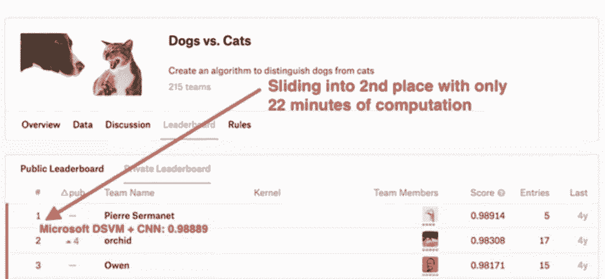
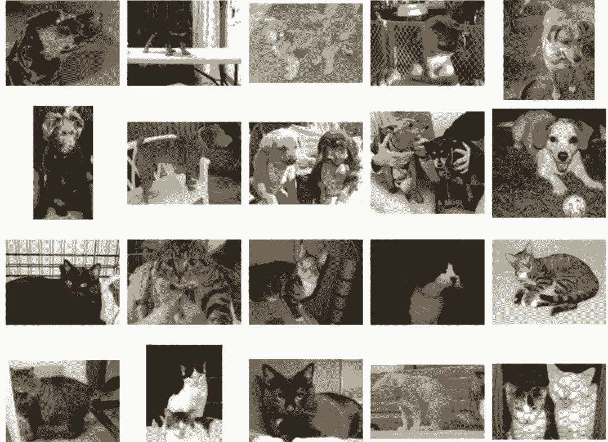
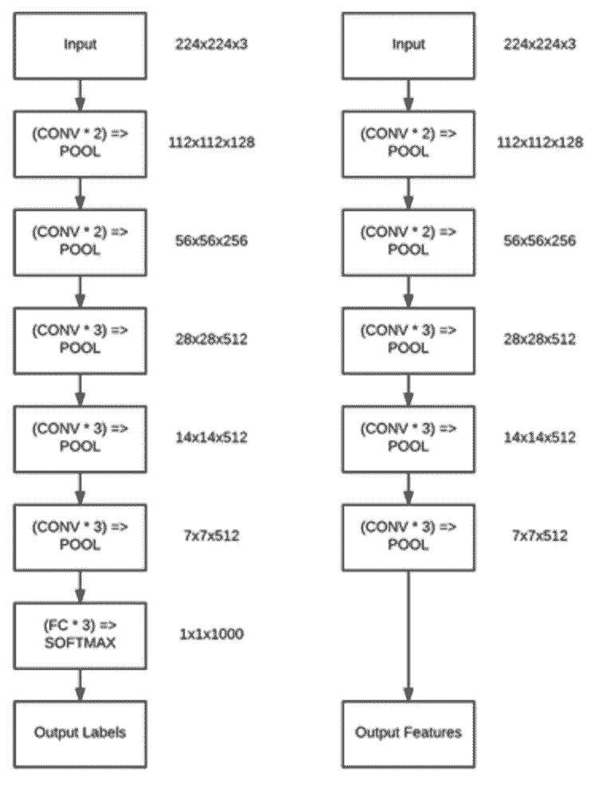
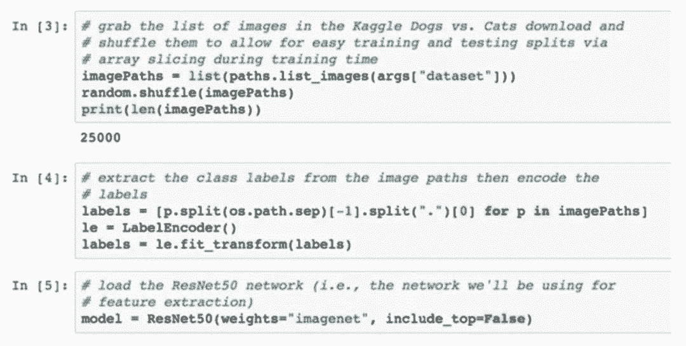
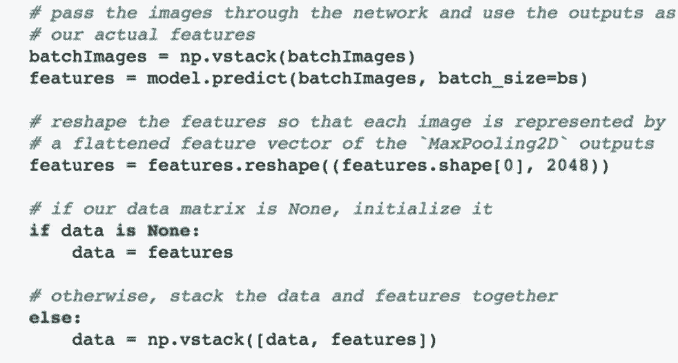
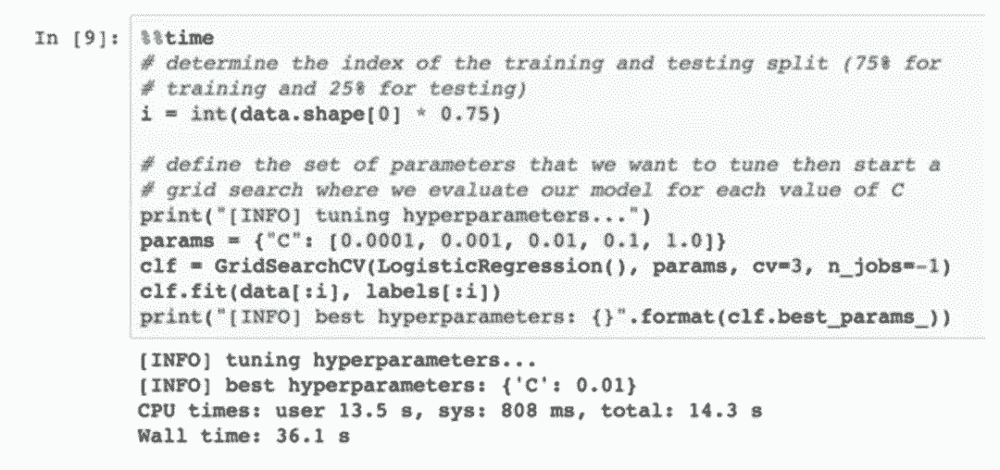
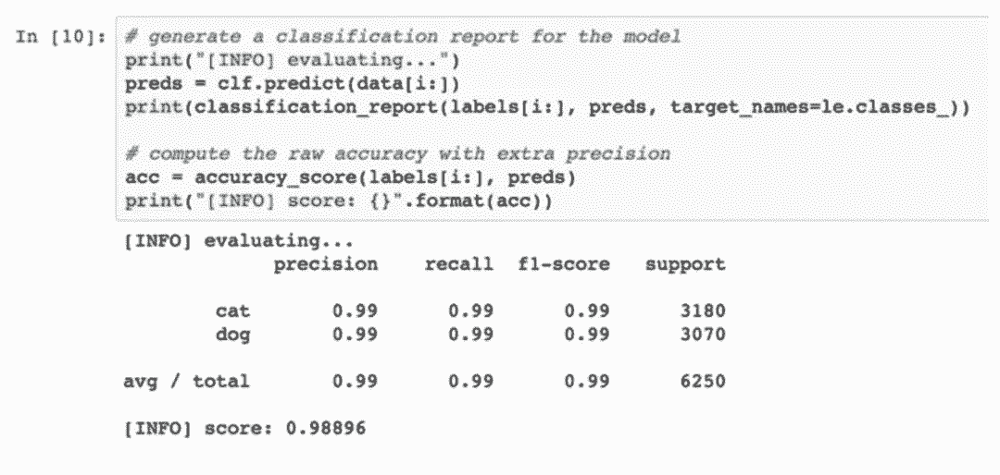
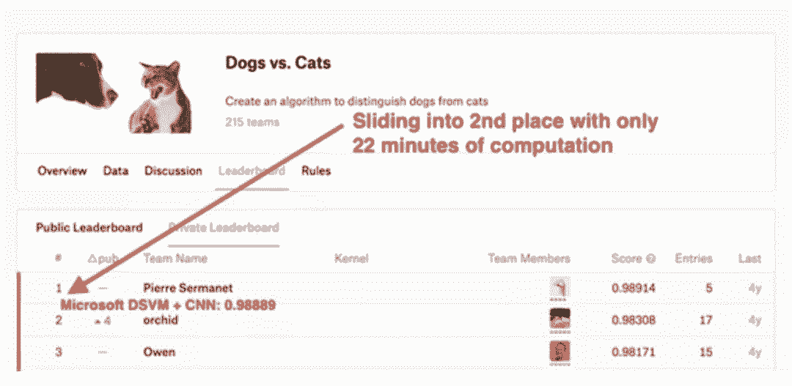

# 教程 | 22 分钟直冲 Kaggle 竞赛第二名！一文教你做到

选自微软机器学习博客

**机器之心编译**

**参与：陈韵竹、路雪**

> 本文介绍了如何使用微软 DVSM、利用迁移学习技术在 20 多分钟时间内达到 Kaggle 猫狗识别竞赛的第二名的性能。

**引言**

几周前，我写了一篇博客《deep learning and computer vision in the Microsoft Azure cloud》，简要介绍了微软的数据科学虚拟机（DVSM）。本文更偏重实际操作，缘起于 PyImageSearch 读者 Kostas 给我发来的一封邮件：

> 「你好，Adrian！我对 Kaggle 竞赛（特别是计算机视觉领域的 Kaggle 竞赛）很感兴趣。我在计算机视觉和机器学习/深度学习方面有一些经验，但经验尚不丰富。请问参加这个比赛值得吗？我有没有和其他选手竞争对抗的实力？」

Kostas，这是个好问题——我敢肯定，有类似疑问的不止你一个人。

让我来用一个故事回答你的问题吧：

当我第一次着手编写我的新书《Deep Learning for Computer Vision with Python》时，我的目标是写一本能同时面向新手、有经验的研究人员和从业者的书／自学项目。

那本书从神经网络和机器学习的基础出发，当你根据此书自学到最后时，你就能从零开始搭建最先进的网络模型了。

听起来这是个合乎逻辑的渐进式教育项目，能让你从入门到精通——说得通，对吧？

但是，这个过程中发生了一件很有意思的事情……

当你阅读了约 25% 的内容时，你已经可以像深度学习实践者那样，有足够的经验开始解决计算机视觉问题了。那些曾对你来说几乎不可能的问题现在也许变得不那么遥远——而且在某些情况下，你可以利用特定的技术解决这些问题。

其中有个很好的例子是 Kaggle 猫狗识别竞赛：

目标很简单：把输入图像分类为狗或猫。

这对我们来说非常容易——人脑可以轻松分辨出这两种家庭宠物的差异。

但是，对于计算机呢？这就没那么简单了。计算机能看到的只是一个 0 和 1 组成的巨大矩阵。我们如何学习这些图像中的模式，从而分辨猫和狗？

2014 年这个挑战赛发布时，受到了大家的广泛欢迎。这对于研究人员和工程师来说是个挑战。它获得了大量的关注，因为这个问题看起来非常容易。此外，谁不喜欢看这些可爱的小动物呢？

超过 200 支队伍参与了这场挑战，他们尝试了数百种算法及其变体，花费了数千小时的计算时间。

那么今天呢？如果使用从预训练的卷积神经网络中提取的特征，我们可以在这个挑战赛中获得第二名的好成绩。

而且，最棒的事情是，如果使用微软的 DSVM（预安装了所有必备的计算机视觉和深度学习库），我们可以在 22 分钟的时间内获得第二名！

代码地址：http://pyimg.co/5jhwg

让我们启动 Ubuntu DSVM 实例，计时开始！

**通过特征提取进行迁移学习**

通常，我们将卷积神经网络视为端到端的图像分类器：

1.  我们向网络输入图像

2.  图像经正向传播通过网络

3.  在网络的末端获得最终的分类概率

但是，并没有「规则」表明我们必须让图像在整个网络中正向传播。相反，我们可以在任意层（如激活层或池化层）终止传播过程，在这一位置提取网络的值，然后使用提取的值作为特征向量。

让我们用 Simonyan 和 Zisserman 提出的 VGG16 架构举个例子：

*上图左侧是原始的 VGG16 架构，它可以输出 1000 个 ImageNet 类别标签的概率。*

为了将网络变成特征提取器，我们可以在概念上「移除」网络的全连接层，返回最终池化层的输出（上图右侧）——该输出将作为我们的特征向量。

由于在 ImageNet 数据集上训练的 CNN 倾向于学习大量的鉴别滤波器，因此我们通常可以在未经训练的数据集上使用这些预训练的网络——我们把这个过程称为迁移学习。

我们可以将在 ImageNet 数据集上训练的 CNN 的知识进行迁移，将所学的知识编码为特征向量，然后基于这些特征向量训练一个简单的机器学习模型（如 Logistic 回归分类器、线性 SVM 等）。

**下载 Kaggle：Dogs vs. Cat 数据集**

为了了解整个工作流程，请确保已下载：

1.  我的 Jupyter Notebook：http://pyimg.co/5jhwg

2.  Kaggle Dogs vs. Cats 数据集：https://www.kaggle.com/c/dogs-vs-cats

为简洁起见，我们不会将测试集提交给评估服务器。只需下载「train.zip」文件即可。注意：如果你尝试使用「test1.zip」，我们将无法从文件路径中提取类别标签。请不要下载「test1.zip」。

在你下载「train.zip」之后，将其解压，然后你就会得到一个名为「train」的目录，其中有 25000 张关于猫和狗的 JPG 格式图像。

从这里开始，我们可以应用迁移学习了。

**DSVM 上的迁移学习**

为保证你能跟上进度，请确保你已下载与本文相关的 Jupyter Notebook。

第一个步骤是抓取 Kaggle Dogs vs. Cats 数据集中所有 25000 张图像的路径（见 cell 3）：

Dogs vs. Cats 数据集中文件的名称都诸如「cat.153-fs8.png」或「dog.4375-fs8.png」——由于类别标签已经写在了文件名中，所以我们可以很容易地提取它们（见 cell 4）。

为了执行特征提取，我们需要一个预训练的网络——ResNet50 是一个不错的选择（见 cell 5）。请注意，我们利用 include_top=False 忽略了全连接层，这让我们能够轻松执行特征提取。

在我们拥有所有的图像路径后，我们需要对它们逐一进行循环，并构建批量，使之通过网络，以执行特征提取。

本节不再赘述整个的循环（请参阅我们的 Jupyter Notebook，其中有完整的文档化代码），仅介绍其中最重要的代码片段：

我们使每个批量的图像在神经网络中传输，然后将最大池化层的输出作为我们的特征。我们将最大池化层的输出压缩成 2048-d 的特征向量。这些特征以数据矩阵的形式堆叠在一起，因此我们可以在这些特征上训练模型。

对于 25000 张图像，整个数据矩阵占用大约 204MB 的 RAM，即使是最小规模的机器也可以轻松管理。

整个特征提取过程使用 Ubuntu DSVM（不需要手动配置或搭建，节省了大量的时间），共耗时 22 分 48 秒。

基于我们提取的特征，我们使用 75% 的数据作为训练集，使用 25% 作为测试集，训练了一个 Logistic 回归分类器（网格搜索适当的参数）：

训练模型仅用时 36s。

**所以，我们是如何做到的？**

通过评估 Logistic 回归分类器，我们发现我们的模型在测试集上达到了 98.8896％的准确率：

该准确率足以在 Kaggle Dogs vs. Cat 竞赛中获得第二名：

不过，这种比较并不是完全公平，因为我们没有在 Kaggle 竞赛提供的测试集中评估（而是生成了我们自己的测试集）并将结果提交给评估服务器（因为这不在本入门教程的范围之内），但我认为你应该理解了我要表达的意思。在不到 25 分钟的计算时间内，我们可以使用：

1.  微软的 Ubuntu DSVM

2.  迁移学习/特征提取

建立一个模型，从而在这个挑战赛中达到具有强大竞争力的准确率。

请随意使用本文的代码，将其作为你自己深度学习项目的起点。

**下一步**

通过本文，你学习了如何应用微软的 DSVM 以及深度学习、卷积神经网络在 Kaggle Dogs vs. Cats 挑战赛中达到第二名的性能。

我们使用了迁移学习（具体来说是特征提取）技术获得了这个结果。

由于 DSVM 配备了所有你在启动、运行本项目所必需的计算机视觉和深度学习库，因此我们：

1.  不仅仅获得了第二名；

2.  同时还打破了计算时长的记录——用时仅 20 多分钟。

结合一些深度学习的知识和预配置的 Ubuntu DSVM 环境，我们可以快速、高效地实现这一结果。

如果你想了解更多关于 DSVM 的知识并建立你的首个实例，请点击以下链接：https://azure.microsoft.com/en-us/services/virtual-machines/data-science-virtual-machines/

如果你对深度学习的更多细节感兴趣，可以阅读我编写的书和自学教程《Deep Learning for Computer Vision with Python》——我个人已经检验了每个代码示例，保证它在 Ubuntu DSVM 中是开箱即用的。

*原文地址：https://blogs.technet.microsoft.com/machinelearning/2018/02/22/22-minutes-to-2nd-place-in-a-kaggle-competition-with-deep-learning-azure/*

****本文为机器之心编译，**转载请联系本公众号获得授权****。**

✄------------------------------------------------

**加入机器之心（全职记者/实习生）：hr@jiqizhixin.com**

**投稿或寻求报道：editor@jiqizhixin.com**

**广告&商务合作：bd@jiqizhixin.com**