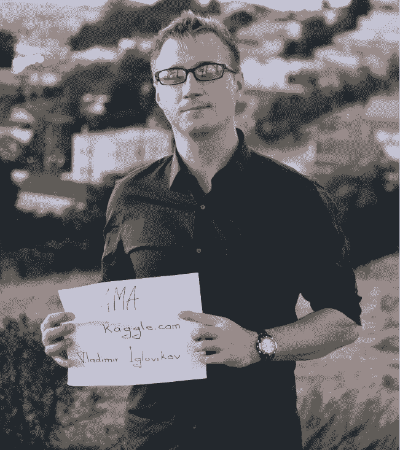
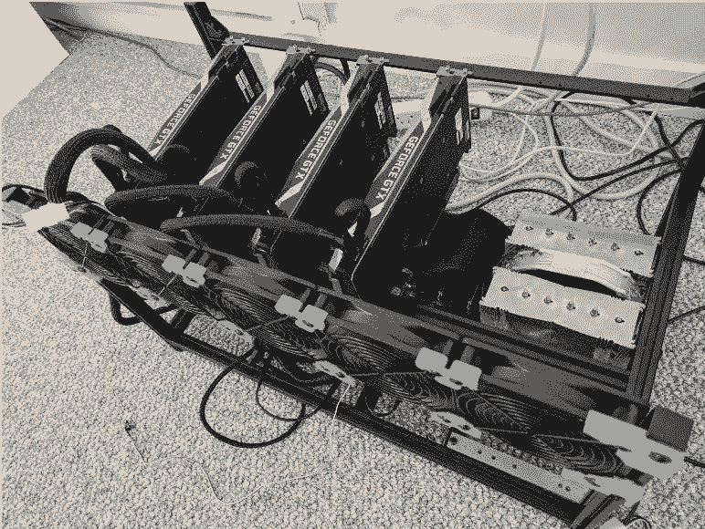
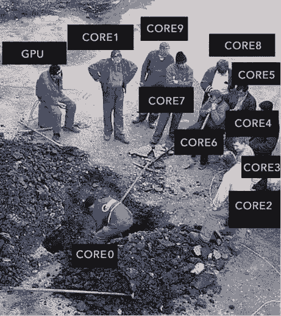
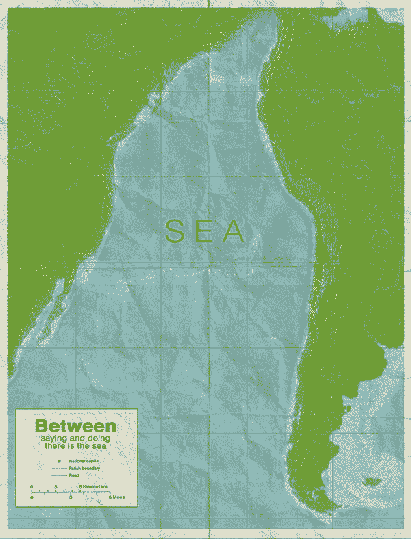

# Kaggle Grandmaster 是怎样炼成的

选自 Medium

**作者：Vladimir Iglovikov**

**机器之心编辑部**

> Vladimir I. Iglovikov 是一名 Kaggle 顶级大师（Grandmaster），曾获得过 Carvana 图像遮蔽挑战的冠军，以及 Dstl 卫星图像特征检测挑战的第三名。他曾在 UC Davis 获得过理论凝聚态物理学博士的学位，现在是一名 Lyft 的计算机视觉工程师，主要研究自动驾驶。

<mp-miniprogram class="miniprogram_element" data-miniprogram-appid="wxf424e2f3e2f94500" data-miniprogram-path="pages/technology/technology?id=b9a8d4e0-10a8-4733-aeae-601ad383d1b0&amp;from=weapp" data-miniprogram-nickname="机器之心 Synced" data-miniprogram-avatar="http://mmbiz.qpic.cn/mmbiz_png/f3g058loLBj0Pib4UhuCFagffSB1RHImwskFzvic6mSp2LDhuerbXxeqqv0b63wSt2Pas7MicNWIcia358rlnhiaVag/640?wx_fmt=png&amp;wxfrom=200" data-miniprogram-title="Kaggle" data-miniprogram-imageurl="http://mmbiz.qpic.cn/mmbiz_jpg/KmXPKA19gW8fr8YXm3t7ZKvTqyhibbcjSwxZhskTswNmq1TjAYbImZNlkl7QZCN9c86AOuSzEZNJAtMRskKxx5w/0?wx_fmt=jpeg"></mp-miniprogram>

最近，Vladimir 分享了自己成为 Kaggle 高手的经验。目前，Kaggle 注册用户数量已超 100 万，其中只有 124 人拥有 Grandmaster 头衔，如何成为全球排名前千分之一的数据科学家？让我们看看他是怎么说的。

我叫 Vladimir，本科毕业并获得理论物理学位后搬到了硅谷，从事数据科学相关的工作。我当前在 Lyft 公司的自动驾驶部门工作，研究与计算机视觉相关的应用。

过去几年来，我花了很多时间参加关于机器学习的比赛。这样做是因为，一方面我觉得它本身很好玩，而另一方面，我觉得这是一种非常高效的数据科学技能提升方法。当然，不是所有的比赛都很容易，我也不是在每场比赛中都能获得好成绩。但时不时地参加这些比赛，让我不断地提高了自己的相关技能，甚至最终获得了 Kaggle Grandmaster 的称号。

<mp-miniprogram class="miniprogram_element" data-miniprogram-appid="wxf424e2f3e2f94500" data-miniprogram-path="pages/technology/technology?id=1a0e9c5e-6502-4cd7-8683-6b5ca6c48be2&amp;from=weapp" data-miniprogram-nickname="机器之心 Synced" data-miniprogram-avatar="http://mmbiz.qpic.cn/mmbiz_png/f3g058loLBj0Pib4UhuCFagffSB1RHImwskFzvic6mSp2LDhuerbXxeqqv0b63wSt2Pas7MicNWIcia358rlnhiaVag/640?wx_fmt=png&amp;wxfrom=200" data-miniprogram-title="机器学习" data-miniprogram-imageurl="http://mmbiz.qpic.cn/mmbiz_jpg/KmXPKA19gW8fr8YXm3t7ZKvTqyhibbcjSwxZhskTswNmq1TjAYbImZNlkl7QZCN9c86AOuSzEZNJAtMRskKxx5w/0?wx_fmt=jpeg"></mp-miniprogram>

我要向 @Lasteg 表示感谢，是他提议我参加这期的 AMA（Ask Me Anything session）并在 Reddit、kaggle、science.d3.ru（in Russian）上收集问题。他收集有很多问题，我会尽我所能去回答，但没办法在本篇博客中解决所有问题。如果你的疑问未能在本文获得解答，可以在评论中留言。

以下是我（或我的团队）有幸跻身排行榜前列的一些深度学习挑战：

*   在 Ultrasound Nerve Segmentation 中获得第十名

*   在 Dstl Satellite Imagery Feature Detection 中获得第三名

*   在 Safe passage: Detecting and classifying vehicles in aerial imagery 中获得第二名

*   在 Kaggle: Planet: Understanding the Amazon from Space 中获得第七名

*   在 MICCAI 2017: Gastrointestinal Image ANAlysis (GIANA) 中获得第一名

*   在 MICCAI 2017: Robotic Instrument Segmentation 中获得第一名

*   在 Kaggle: Carvana Image Masking Challenge 中获得第一名

*   在 Kaggle: IEEE's Signal Processing Society—Camera Model Identification 中获得第九名

*   在 CVPR 2018 Deepglobe. Road Extraction. 中获得第二名

*   在 CVPR 2018 Deepglobe. Building Detection. 中获得第二名

*   在 CVPR 2018 Deepglobe. Land Cover Classification. 中获得第三名

*   在 MICCAI 2018: Gastrointestinal Image ANAlysis (GIANA) 中获得第三名

**Q：除了数据科学以外，您生活中喜欢做些什么？**

A：当然，我喜欢徒步旅行、攀岩。如果你早上去 Mission Cliffs 攀岩馆，见到我可以打个招呼。

我也喜欢跳舞，特别是 Bules Fusion。旧金山的 Misiion Fusion 和 South Bay Fusion 舞蹈产地是我经常去的。

旅行对我来说很重要。春天的时候我去了白俄罗斯、摩洛哥、约旦。九月，我在芬兰、德国、奥地利呆了三周。当然，2018 Burning Man 是今年最爽的活动。

**Q：你如何在工作的同时花很多时间做 kaggle 呢？**

A：对我来说，虽然没有薪酬，但参加 Kaggle 比赛是我的第二职业。我这么做理由很充足。活跃的 Kaggle 参与者追求领域的改变很常见。我也不例外。当我从学界转向业界时，我开始参加比赛。我需要一个高效的方法来尽快熟悉 ML 需要解决的问题，掌握那些工具，并将思维扩展机器学习的新领域。

后来，当我在 Bidgely 开始我的第一份工作之后，我参与的 Kaggle 赛事更多了。有段时间，我在研究信号处理任务，同时几乎将所有晚上的时间用来处理参加比赛用的表格数据。那段时间我的工作和生活有些失衡，但我获得的知识却是值得的。

再后来，我做好准备换工作以后，加入了 TrueAccord，在那里我做了很多传统的机器学习任务。但我不想停止对 Kaggle 的研究，所以我白天做的是传统机器学习，晚上和周末研究深度学习。也因此，工作和生活更加无法保持平衡。但我学到了很多东西，获得了很好的附加技能，成为了 Kaggle Master。当我加入 Lyft Level 5 时，我知道所有这些努力都没有白费，在这份工作里我将深度学习应用于自动驾驶问题上。

最终，我没有全职做 Kaggle，但我仍在积极地学习。工作中有很多有趣的计算机视觉问题，我正尝试在 Kaggle 没有涉足的领域里获得更多的知识。我仍然时不时地向各种比赛提交参赛作品，但这主要是为了更好地理解其他参赛者正面临的问题和挑战，这样做反过来有助于我从论坛分享的信息中获得很大的收益。

**Q：帮助你提高工作效率的日常惯例是什么？你如何安排一天的行程？**

A：首先，我不太确定自己是否高效，因为我总是在寻找新的办法优化工作方式。

需要解决的问题和需要参与的活动总是很多，但不是所有的都有用又好玩。所以我做什么事情都要优先考虑。有两本书对这个话题进行了精彩的讨论：《So Good They Can't Ignore You: Why Skills Trump Passion in the Quest for Work You Love》和《Deep Work: Rules for Focused Success in a Distracted World》。

工作日，我一般早上 6 点起床，然后去攀岩馆。这样做能帮助我保持身材并让我一天都保持清醒。之后，我开车去上班。我们的自动驾驶工程中心位于 Palo Alto，这对我来说有点忧桑，因为我更喜欢住在市区。开车很有趣，但通勤很烦。为了让通勤时间更有效率，我会在车里听有声读物。开车时当然没法专心听书，但在驾驶时听听这些文学、有关软技能和商业的书总是不错的。

我想好好把握工作和生活之间的平衡，但没有做到。当然，我花了很多时间和朋友参加不同的活动，而且很多活动是在旧金山。同时，我仍需要学习；我还要保持机器学习的状态，不能把目光局限在工作中遇到的问题上。所以我晚上有时候会阅读技术文献，或者为比赛、辅助项目和开源项目编写代码。

谈到开源项目，我想借此机会推广一个图像增强库，该库是由我和 Alexander Buslaev、Alex Parinov、Eugene Khvedchenia 一起基于我们有关视觉挑战赛的研究创建的。

如果不阐述细节的话，可能没法说清楚这个问题：

*   我更喜欢 Ubuntu+i3 的电脑，而不是 MacBook，因为这样能让我的效率提升 10%。

*   我很少用 Jupyter notebook，仅用于 EDA 和可视化。几乎所有的代码我都是在 PyCharm 上写的，然后用 flake8 检查，再传到 GitHub 上。很多 ML 问题都非常相似。找一个更好的代码库，而不是重复自己的代码，然后思考如何最好地重构。这样做虽然在开始时进展缓慢，但后面会加快你的进步。

*   我正在尝试编写单元测试。所有人都在讨论单元测试在数据科学中的重要性，但很少有人花时间去写。Alex Parinov 写了一个很好的文档（https://albumentations.readthedocs.io/en/latest/writing_tests.html），教你怎么从简单的测试做到复杂的测试。你可以尝试一下，然后再你的学术或 Kaggle ML 流程中添加更多测试。

*   目前，我正在试用模型版本化工具 DVC，我希望它能增加我的 ML 流程的复现率和代码的可重用率。

*   我很少用鼠标。因此我有时候需要在页面上写热键，然后尽可能多地使用它们。

*   我不使用社交网络。

*   我一天仅查收几次邮件。

*   我甚至会在早上列一个当日任务清单，然后解决它们。我使用 Trello 来做这个。

*   我不会把一天的时间分割得很乱。很多任务需要集中精力，而总是切换焦点没什么用。

以上大概就我的一些工作标准了。

**Q：你如何跟上这个领域的最新研究？**

A：「跟上」这个词对我也不太准确，机器学习领域近来很活跃，有关的论文数量、比赛、博客和书籍非常多，不可能全部浏览。实际上，当我遇到一些问题时，我会把注意力放在最新的研究上，并深入挖掘。解决完这个问题后，我再转向另一个问题。因此，我只对那些我亲身经历过的领域了解较深。同时，我对研究过的问题都有较深的专业知识，这个问题清单很长，而且还在持续增加。这个事实也让我确信，将自己编写并保存在私人存储库中的经验和代码将有助于我快速开始任何新的 ML 相关任务。

此外，这还意味着我对很多问题的处理方式都有大概的了解，这样我下次面对类似的问题时心里也有谱。

我还参加过像 NIPS、CVPR 这样的人工智能会议，在这些大会上展示的研究成果能够很好地代表我们当前的研究水平。

**Q：四五年前，在非机器学习领域拿到一个博士学位（如物理学）对雇主是有利的。但现在的情况好像变了，非机器学习领域的博士学位和机器学习的硕士学位相比，IT/ML 行业更愿意选后者担任机器学习工程师／开发者职位，至于研究岗我不太清楚。您获得了物理学博士学位，然后转到机器学习领域，我认为您的经历可能适合回答这个问题。**

**如果获得非机器学习博士想转到机器学习行业，您对此有何看法？这有助于获取企业内的研究职位吗？与机器学习相关硕士相比有优势吗？**

A：这个问题比较困难，我不知道答案。

物理学是一门伟大的学科。即使回到过去，可以在物理学和计算机科学之间进行选择，即使知道我最终会转到计算机科学领域，我仍然会选择物理学。

当然，主要原因是我对物理学和自然科学比较感兴趣。机器学习能够讲授浩翰多彩宇宙的运行原理吗？不能，但是物理学可以。不止如此。我的转型之路相对容易的原因之一是物理学，这门学科给予我的不仅是量子力学、相对论等知识，还有数学、统计学、编程技巧，这些技能有利于向其他领域的转换。

物理学教会你如何在严谨理论和实验之间以结构化的方式进行转换，这对机器学习从业者而言也是一项必备技能。另外，自学集合不可能学习物理学或高等数学。这点也是我的公司信条，即深度学习的下一个大突破将在我们明白如何将高等数学应用到机器学习中的时候出现。现在具备大一水平的数学知识在计算机视觉领域已经足够了。

所有这些都意味着目前数学不是拦路虎，这也是掌握了数学／物理学／化学和其他 STEM 学科的额外知识对于解决大部分商业问题几乎无用的原因，也是这些学科的毕业生转行的原因。他们拥有大量专门知识，有博士学位，在学界待了很多年，但无法得到有趣且高薪的工作。网络上到处是这种类型的博客文章。

另一方面，能写代码在各个地方都是必要的，这也是潜在雇主在了解数学的人和能写代码的人中间几乎总是选择后者的原因。

但我认为这种情况会改变的。不是现在，是未来的某个时间点。

你读的论文、你上的课可能与你在行业中所需的技能并不直接相关，注意到这一点很重要。这是对的，但无伤大雅。

通常，在业界作为数据科学家或软件开发者工作所需的技能可以通过自学学习，不能在大学里学到。人们在工业界学到的大部分事情可以通过在某家公司的全职工作来获取。

此外，找工作的同时还要写理论物理学论文、研究数据科学，这对我来说压力太大了。

当时，我并未掌握所有必备知识，我也不理解硅谷的运作和他们对我的期望。我基本上是一张白纸，我做的唯一一件事是不断地把简历投给不同的公司，不断地面试，从每次失败中学习，然后再继续，直到面试成功。

我记得有一次面试官问我毕业论文主题是什么，我当时在研究量子蒙特卡罗（Quantum Monte Carlo），我如实回答了这个问题，然后尽力解释它的意思以及我们为什么需要它。面试官看着我，问了一句话：「这项技术如何帮助我们提高客户参与度？」

我想说对于非计算机科学专业的人来说，最好的方法是参加计算机科学系内部的数据科学（DS）相关课程。业余时间学习 DS / ML。幸运的是，有很多资源。在自己院系中找到一个想使用机器学习解决自己问题的教授也是个好主意。申请技术公司的 ML 相关实习岗位，拿到实习岗位比获得全职工作容易一些。

实习后转为正式岗就很直接了。比如我的朋友胡文健，他和我同一个研究小组研究物理学，他先在 Facebook 实习，后来得到了 Facebook AI Research 的研究科学家职位。

不要高估专业、大学对找工作的影响。企业雇佣你时，主要是付钱让你解决他们面临的问题。你的学位和专业只是他们用来估计你能力的东西。如果你的简历中没有他们想看到的内容，那很难通过 HR 的简历筛选，对找工作很重要的人际关系网也会减弱，但这仍然不应该影响你决定自己学什么专业。

我的想法可能有点天真，但我觉得人们选择自己专业的标准，不应该是高薪，而是热情（passion）。

**Q：你觉得数据科学/ML 中有趣的问题是什么？我的硕士学位完成了一半，但我不知道以后要从事 ML 哪方面的工作。我和认为 Algo 创建与扩展是最好领域的人交谈过（对于 DS / ML 应用程序而言，更可能是库插件和 chug）。对此你有什么看法？或者关于职业灵活性的建议？**

A：我认为 DS/ML 中有趣的问题与当今主流相去甚远。研究主流问题的人太多。将 ML 应用于信用评分、推荐系统和零售等我都觉得很无聊。如果你用 DS/ML 来解决那些数学、物理、生物、化学、历史、考古、地理问题或者那些人们很少应用 ML 的问题，你可能会找到下一个属于你的 Purple Cow。

至于职业选择，与生物或物理不同，你在 DS/ML 中学到的技能很容易从一个领域转到另一个领域。当然，开发银行或对冲基金交易的算法和开发自动驾驶汽车不是一回事，但差别也没有那么大。只要你基础牢固，很快就能掌握必要的技能。

**Q：30 岁（有学习背景，但不是 Math/CS 方面）加入 ML 社区是否为时已晚？是否有可能赶上末班车？如果可以，你觉得最低要求是什么？**

A：当然不晚。90% 的 ML 只需要技术大学大一的数学知识，不需要超深的数学知识。DS 中使用最广泛的语言是 Python 和 R 语言，这两种语言比较高级，因此你可以从它们入手，而不是在技术细节方面死磕。

我建议参加一些 DS 的在线课程，然后研究一些 Kaggle 问题。当然，很多概念听起来都很新，但你只要保持自律和专注，慢慢就会懂了。

这儿有两个关于年龄的例子：

*   Kaggle Grandmaster Evgeny Patekha 40 岁才开始数据科学研究。

*   Kaggle Grandmaster Alexander Larko 55 岁才开始参加 Kaggle。

**Q：你认为技术领域的正规基础教育对获得数据科学和 Kaggle 比赛的成功是必要的吗？在你的工作经历中有没有遇到相反的例子？**

A：我只能说这些很有用，但并非必要。很多在 Kaggle 中获得成功的人并没有技术领域的基础教育背景。典型的例子就是 Mikel Bober-Irizar，他是一名 Kaggle Grandmaster，但还在念高中……

不过你要记住的另一件事是：你在 Kaggle 中学到的技能只是你将来在 ML 业界或学界所需技能的一小部分。而那些在 Kaggle 中无法学到的技能，基础教育可以为你提供。

不过话说回来，就算没有高中学历你也能擅长 Kaggle。

**Q：你用了多长时间学习数据科学/机器学习，才成为了 Kaggle 高手？**

A：我是在 2015 年 1 月决定转向数据科学的。在这之后，我开始在 Coursera 上学习线上课程。在当年 2 月底，我知道了 Kaggle 的存在并注册了自己的账号，两个月之后我获得了自己的第一个银牌。

**Q：使用家用台式机不用云服务在 Kaggle 比赛里能得高分吗？**

A：我不在比赛中使用云服务，但我家里有两台比较强力的计算机：一台有 4 块 GPU，另一台有两块。你可以在没有强大深度学习机器的情况下获得 Kaggle 比赛的好成绩，但是缺乏算力的限制会使你在单位时间内尝试思路的数量——而思路的数量和最终的结果密切相关。所以如果你以 24/7 的投入训练模型，你就需要投资购买一台好机器。

在几代更新之后，我的开发硬件最终变成了这样：一台 4GPU 的机器用于高负载，另一台双卡的机器用于原型设计。

仅有一台强大的计算机还是不够的，你需要学一些编程技巧，来利用它的算力。

*   我从 Keras 转到 PyTorch 的一个原因是当时后者的 DataLoader 更加强大。

*   我们看到 imgaug 太慢了，于是写了 albumentations，以利用 100% 的 CPU 算力，不过它没法充分利用 GPU。

*   如果想加速硬盘上 jpeg 图像的吞吐速度，我们不应该使用 PIL、skimageand 甚至 OpenCV，而是应该用 libjpeg-turbo 或 PyVips。

**其他**

**Q：对于从 Kaggle 竞赛开始数据科学家生涯的人，你对他们有什么建议吗？特别是那些首次参加竞赛的菜鸟，有什么最好的建议？**

A：有很多方式来参加 Kaggle 竞赛，但根据我的观察经验，获取所需知识的最高效方法是使用黑客的方法。

1.  观看一些包含 Python 编程基础和机器学习的在线课程。

2.  参加一个 Kaggle 竞赛。如果你可以写出一个从数据到提交的端到端流程，这很好。如果你是新手，这可能很难。在这种情况下，可以去论坛复制粘贴别人共享的 kernel。

3.  在你的计算机上运行，生成一个提交，在排行榜上获取名次。在这一阶段，操作系统、驱动程序、库版本、I/O 等问题可能会让你觉得很痛苦。你要尽快习惯。如果你不能理解 kernel 里写的什么，没关系，问题不大。

4.  调整一些参数，随便调也没关系，重新训练你的模型，提交预测。希望某些修改可以让你的排名提升。不要担心，很多人都是这么做的。他们都在做不同的调整，你不需要对相关知识或原理有深刻或直观的理解。

为了超越周围的调参侠，你要发展出一种直觉，并获取关于什么方案可行、什么方案不可行的基础知识，从而可以更加智能和高效地探索可能方法的相空间。在这一步，你需要将学习作为实验的一部分。从两个方向学习，首先是像 mlcourse.ai、CS231n、数学、统计学、如何写更好的代码等基础。一般来说，自主学习很难，但从长期来看，这很重要。其次你会在相关问题的论坛上看到很多新术语。记得注意这些术语。尝试激励自己在排行榜中取得更好成绩作为外部动力来学习新事物。但不要在学习和实验之间进行选择，同时做两件事。机器学习是一门应用科学。

在竞赛结束之后，虽然付出了很大的努力，但你也很可能在排行榜上取得很低的名次。这不奇怪。好好阅读论坛的内容，看看 winner 分享的解决方案，尝试找出比之前更好的解决方案。下一次当你看到相似的问题时，你的起点会高得多。

在多个竞赛中重复该过程，然后到达 top。更重要的是，你将对很多问题拥有好的解决方案，并且对于如何处理在竞赛中遇到的机器学习挑战能够发展良好的直觉。

**Q：作为物理学背景的人，当竞赛更多的是过拟合 vs 具体任务上的实际泛化效果时，你会觉得挫败吗？如果会，那你会怎么处理？**

A：通常，你需要过拟合数据和指标，以获取好的结果。这没什么问题。人们在 ImageNet 数据集上过拟合了很多年，训练过程中仍然会出现很多新知识。但是你需要理解指标和数据的细微之处，这是知识的来源。只要竞赛过程中能够得到新知识，那过拟合不会让我觉得很挫败。你可能注意到了，当你擅长一个问题的流程和想法时，这些可以作为你下一个问题的可靠基线模型，这表明了一定的泛化性。

**Q：你对 Kaggle 的数据泄露（如 Santander、Airship prediction 和 Google Analytics）有什么看法？在 Kaggle 比赛中使用泄露的数据是否合乎道德？**

A：我承认组织比赛很难，所以当发现数据泄露时，我不会指责组织者。而人们利用泄露的数据参加比赛，我也觉得 OK。我承认数据泄露阻碍了我参与一次挑战，但这主要是因为我无法轻易地把获得的知识扩展到其它挑战。我仍然认为 Kaggle 管理员需要创建一份可能会泄露的数据清单，并在比赛前检查数据以防止同样的事件一次又一次发生。我相信他们正在为此努力。

**Q：Kaggle 比赛对做一名 DL 工程师有多大用处？**

A：这很难说。Kaggle 在一些重要但非常狭窄的领域提升你的技能。这是一个非常重要的技能组合，对某些职位可能非常有用，但对另一些来说则帮助不大。而对我从事过的工作，尤其是现在从事的自动驾驶来说，Kaggle 技能是我从学界和其它知识来源中获取的有力加分项。

不过，要掌握 Kaggle 技能，光有扎实的基础并不够。很多东西你只能从业界学习。

虽然成为 Kaggle Master 对你的工作来说不是必需的，也并不代表你会在工作中做得很好。但我相信，如果你是 Kaggle Master，你的简历会更容易通过 HR 的筛选，然后有机会进入技术展示阶段。

**Q：成为 Kaggle Grandmaster 之后继续参加比赛还有什么用处？已经成为数据科学家之后继续前进的动力是什么？**

A：正如我前面所说的，我现在不再参加 Kaggle 比赛了，但我开始关注很多会议上出现的挑战赛。我的团队在 MICCAI 2017、CVPR 2018 和 MICCAI 2018 取得了不错的成绩。竞赛通常包括漂亮、干净的数据集，这些数据需要的清理工作最少，可以让你少关注数据，多关注数值技术。这是你在工作中通常没有的奢侈品，数据选择过程通常是创建实用流程的最重要的组成部分。

**Q：你对于本科生和研究生的学习和竞争力有什么看法？什么水平才能真正掌握数据科学？**

A：我甚至不知道是什么决定了数据科学。这个问题有很多回答的方式，但在这里我们的主题是 Kaggle Grandmaster，所以让我们把第一个里程碑设置为「Kaggle Master」。这是相对直接的标准，一旦你开始朝着这个方面努力，你就会对这一领域有更多的了解。

**Q：如果没有数学/计算机科学或其他一些高级计算课程教育背景，你在 Kaggle（或者更广泛地说是数据科学领域）上可以走多远？激情和求知欲能带你走多远？**

如果以目标为导向并且愿意学习，你可以在 Kaggle 或其他任何数据科学领域获得最高成绩。最艰难的是迈出第一步。Just do it！最好的时间是此时此刻，因为明天，通常意味着永不。

没有人问过我这个问题：在一场特定的比赛中，你是如何找到帮助你提高成绩的人的？我觉得这是一个目前在博客中还没有看到过的重要话题。

最常见的方法：一些朋友、同事对这个比赛很有热情，他们聊这个比赛，一起开会、讨论问题并组队。一些人想做些事情；但另外一些忙于其他活动。这种团队可以往前走一段，但走不远。

对于我以及其他一些参赛者来说更好的方式有以下几种：

1\. 写出你的流程或平台上分享的重构流程。

2\. 这个流程应该以适当的格式将输入数据映射到提交的文件中，并生成交叉验证分数。

3\. 验证交叉验证分数的改进与排行榜上的改进相关。

4\. 执行探索性数据分析，仔细浏览论坛，阅读论文、书籍和之前类似竞赛的解决方案。独立工作。

5\. 在某个时间点，比如竞赛截止前 2-4 周，你会陷入困境。什么想法都没法改进你的排名。你尝试了一切，这时你需要新的想法来源。

6\. 这时你可以看下排行榜，与排名接近的积极参赛者进行沟通。

7\. 首先，你的预测平均值会带来微小却重要的提升。其次，很可能你的方法有一点不同，分享试过或没试过的想法是有益的。第三，由于竞赛最初是个人单独参赛，因此所有参赛者都会看数据、写流程、将竞赛的重要性置于其他活动之上，以及受实时排行榜带来的游戏效应的刺激。

但更重要的是，人们倾向于高估自己愿意花在竞赛上的时间，低估获取稳定端到端流程之前要面临的问题。用排行榜来创建团队可以作为过滤器，确保你的潜在队友和你达成共识。

在一些竞赛中，领域知识对于性能结果非常重要。例如，表格数据（tabular data）和对应的特征工程或医学成像，你可以考虑和具备深厚领域知识的人组队，即使他／她没有强大的数据科学背景，不过这种情况比较稀少。

另一方面，业界组建团队的方式完全不同。使用 Kaggle 的方式在业界组队是不明智的。

在这里，我要感谢所有曾经与我组队的人，他们在比赛中教会了我很多：

Artem Sanakoeu, Alexander Buslaev, Sergey Mushinskiy, Evgeny Nizhibitsky, Konstantin Lopuhin, Alexey Noskov, Artur Kuzin, Ruslan Baikulov, Pavel Nesterov, Arseny Kravchenko, Eugene Babakhin, Dmitry Pranchuk, Artur Fattakhov, Ilya Kibardin, Liam Damewood, Alexey Shvets, Anton Dobrenkii, Selim Seferbekov, Alexandr Kalinin, Alexander Rakhlin.

下一次 Kaggle 比赛里见！****

*原文链接：https://medium.com/@iglovikov/ask-me-anything-session-with-a-kaggle-grandmaster-vladimir-i-iglovikov-942ad6a06acd*

****本文为机器之心编译，**转载请联系本公众号获得授权****。**

✄------------------------------------------------

**加入机器之心（全职记者 / 实习生）：hr@jiqizhixin.com**

**投稿或寻求报道：**content**@jiqizhixin.com**

**广告 & 商务合作：bd@jiqizhixin.com**