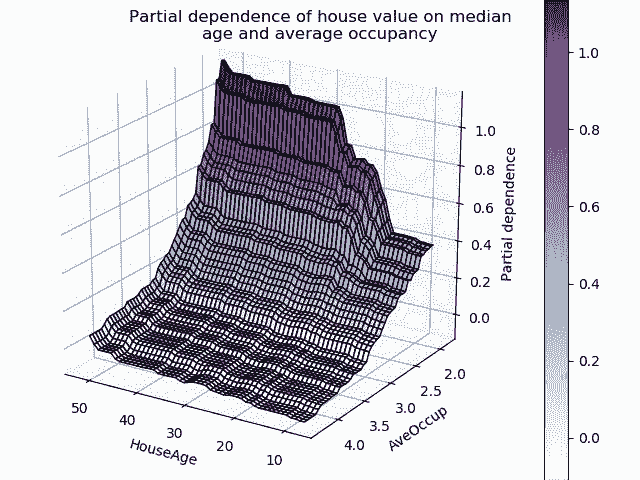
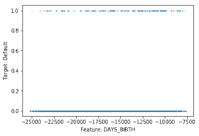
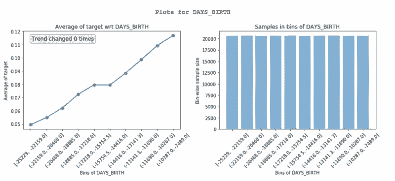
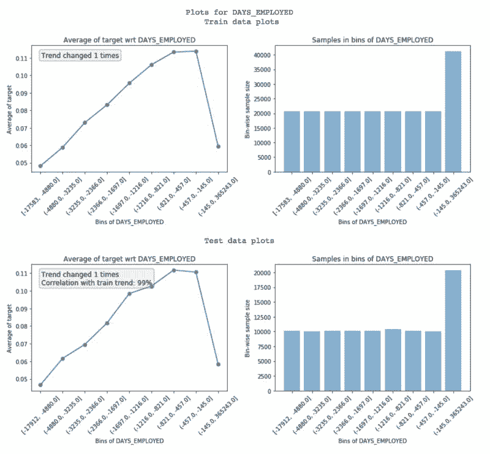
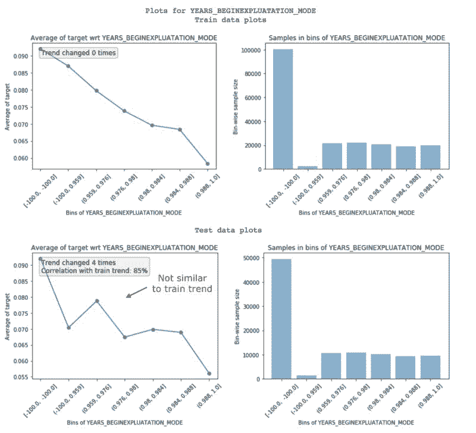
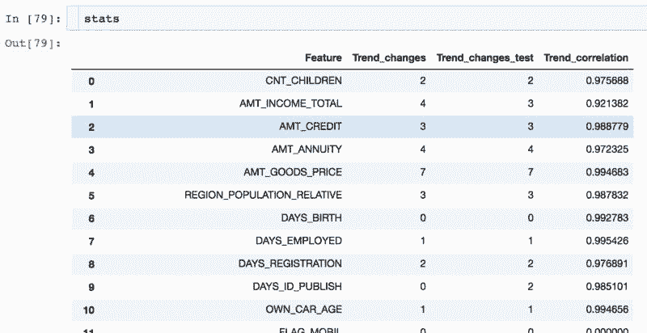
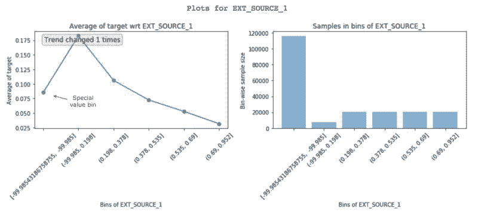
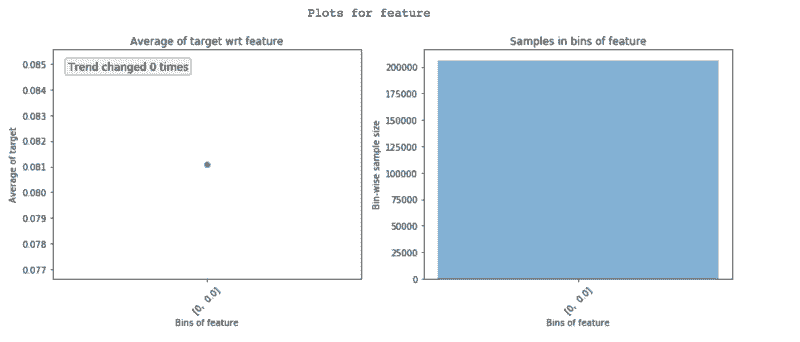
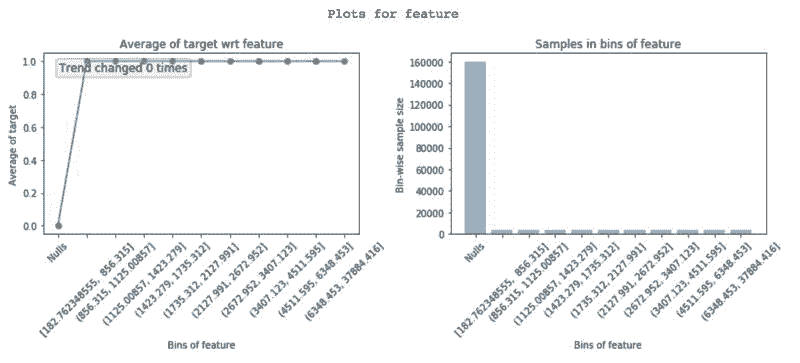

# 业界 | 如何达到 Kaggle 竞赛 top 2%？这里有一篇特征探索经验帖

选自 Towards Data Science

**作者：Abhay Pawar**

**机器之心编译**

**机器之心编辑部**

> 本文作者 Abhay Pawar 多次参加 Kaggle 竞赛，并在 Instacart Market Basket Analysis 竞赛中拿到 top 2% 的名次。他在多年竞赛中总结出了一套特征探索和构建更好机器学习模型的标准方式，本文将介绍这套方法。

在数值数据上构建任意监督学习模型的一个重要方面是理解特征。查看模型的部分依赖图可帮助理解任意特征对模型输出的影响。



*图源：http://scikit-learn.org/stable/auto_examples/ensemble/plot_partial_dependence.html*

但是，部分依赖图存在一个问题，即它们是使用训练好的模型创建的。如果我们可以从训练数据中直接创建部分依赖图，那么它将帮助我们更好地理解底层数据。事实上，它能够帮助你做好以下事情：

1.  特征理解

2.  识别带噪声的特征

3.  特征工程

4.  特征重要性

5.  特征 debug

6.  泄露检测和理解

7.  模型监控

为了使其更加易于使用，作者将这些技术封装进一个 Python 包 featexp 中，本文将介绍如何使用它进行特征探索。本文使用的是 Kaggle Home Credit Default Risk 竞赛的应用数据集。该竞赛的任务是使用给定数据预测违约者。

featexp：https://github.com/abhayspawar/featexp

**1\. 特征理解**



*特征散点图 vs. 无用的目标*

如果依赖变量（目标）是二元的，则散点图无效，因为所有点要么是 0 要么是 1。对于连续目标来说，数据点太多会造成难以理解目标 vs 特征趋势。featexp 创建了更好的图，可帮助解决该问题。我们来试一下！

```py
from featexp import get_univariate_plots

# Plots drawn for all features if nothing is passed in feature_list parameter.
get_univariate_plots(data=data_train, target_col='target', 
                     features_list=['DAYS_BIRTH'], bins=10)
```



*DAYS_BIRTH (age) 的特征 vs 目标图*

featexp 为数值特征创建了同等人口数量的 bin（x 轴），然后计算每个 bin 的目标平均值，再绘制出来（如上图左）。在我们的案例中，目标平均值是违约率。该图告诉我们年龄越大的客户违约率越低。这些图帮助我们理解特征表达的意义，及其对模型的影响。右图显示了每个 bin 中客户的数量。

**2\. 识别带噪声的特征**

带噪声的特征导致过拟合，识别它们并非易事。在 featexp 中，你可以输出一个测试集（或者验证集），对比训练／测试集中的特征趋势来确定带噪声的特征。

```py
get_univariate_plots(data=data_train, target_col='target', data_test=data_test, features_list=['DAYS_EMPLOYED'])
```



*训练和测试特征趋势对比。*

featexp 计算两个指标（如上图所示），来帮助测量噪声：

1.  趋势相关度（见测试图）：如果某个特征未体现目标在训练集和测试集中的同样趋势，它会导致过拟合，因为模型会学习一些在测试数据中并不使用的东西。趋势相关度有助于理解训练／测试趋势的相似度，如何利用训练和测试集的 bin 的平均目标值来计算趋势相关度。上图中的特征相关度为 99%，几乎没有噪声。

2.  趋势变化：趋势方向中突然和重复的变化可能表明有噪声。但是，此类趋势变化也会在 bin 的人口数量与其它特征不同时，导致其违约率无法与其它 bin 进行对比。

下图中的特征没有展现同样的趋势，因为趋势相关度为 85%。这两个指标可用于删除带噪声的特征。



*带噪声特征示例。*

当特征很多且相互关联时，删除低趋势相关度特征的效果很好。它会带来更少的过拟合，其它相关特征可以避免信息损失。同时需要注意不要删除太多重要特征，因为这可能导致性能下降。此外，你无法利用特征重要性来判断特征是否带噪声，因为重要的特征也会带噪声！

使用不同时间段的测试数据效果更好，因为你可以借此确定特征趋势是否一直如此。

featexp 中的 get_trend_stats() 函数返回展示趋势相关度的数据帧，并随着特征而改变。

```py
from featexp import get_trend_stats
stats = get_trend_stats(data=data_train, target_col='target', data_test=data_test)
```



*get_trend_stats() 返回的数据帧。*

下面我们就试着删除数据中低趋势相关度的特征，然后看结果是否有所改进。


*使用趋势相关度的不同特征选择的 AUC。*

我们可以看到，趋势相关度阈值越高，排行榜（LB）AUC 越高。不删除重要的特征进一步将 LB AUC 提高到 0.74。测试 AUC 的变化与 LB AUC 不同，这一点也很有趣。完整代码详见 featexp_demo notebook：https://github.com/abhayspawar/featexp/blob/master/featexp_demo.ipynb。

<mp-miniprogram class="miniprogram_element" data-miniprogram-appid="wxf424e2f3e2f94500" data-miniprogram-path="pages/technology/technology?id=d1095f57-1940-4e97-8738-8bcb7e4e2d17&amp;from=weapp" data-miniprogram-nickname="机器之心 Synced" data-miniprogram-avatar="http://mmbiz.qpic.cn/mmbiz_png/f3g058loLBj0Pib4UhuCFagffSB1RHImwskFzvic6mSp2LDhuerbXxeqqv0b63wSt2Pas7MicNWIcia358rlnhiaVag/640?wx_fmt=png&amp;wxfrom=200" data-miniprogram-title="特征选择" data-miniprogram-imageurl="http://mmbiz.qpic.cn/mmbiz_jpg/KmXPKA19gW8Nghe11aibnKh0BRAh5xnRYU38naEiao4zmWtYTACZOZ98fbzglCyQ1lm5OAicN41VjfZsWpp3kyTIw/0?wx_fmt=jpeg"></mp-miniprogram>

**3\. 特征工程**

<mp-miniprogram class="miniprogram_element" data-miniprogram-appid="wxf424e2f3e2f94500" data-miniprogram-path="pages/technology/technology?id=898dc2c6-690b-4c29-82b6-f79e7b71d329&amp;from=weapp" data-miniprogram-nickname="机器之心 Synced" data-miniprogram-avatar="http://mmbiz.qpic.cn/mmbiz_png/f3g058loLBj0Pib4UhuCFagffSB1RHImwskFzvic6mSp2LDhuerbXxeqqv0b63wSt2Pas7MicNWIcia358rlnhiaVag/640?wx_fmt=png&amp;wxfrom=200" data-miniprogram-title="特征工程" data-miniprogram-imageurl="http://mmbiz.qpic.cn/mmbiz_jpg/KmXPKA19gW8Nghe11aibnKh0BRAh5xnRYU38naEiao4zmWtYTACZOZ98fbzglCyQ1lm5OAicN41VjfZsWpp3kyTIw/0?wx_fmt=jpeg"></mp-miniprogram>

通过查看这些图所获取的见解可以帮助你创建更好的特征。更好地理解数据将带来更好的特征工程。此外，它还可以帮助你改善现有特征。下面我们来看另一个特征 EXT_SOURCE_1：



*EXT_SOURCE_1 的特征 vs. 目标图。*

具备高 EXT_SOURCE_1 的客户具备较低的违约率。但是，第一个 bin（违约率约 8%）没有遵循该特征趋势（向上升后下降）。它的负值是-99.985，而且人口数量较多。这可能表明这些是特殊的值，因此不遵循特征趋势。幸运的是，非线性模型在学习该关系方面不会有问题。而对于线性模型（如 logistic 回归），此类特殊值和空缺值应该采用类似样本的默认值进行估计，而不是特征平均值。

**4\. 特征重要性**

featexp 还可以帮助衡量特征重要性。DAYS_BIRTH 和 EXT_SOURCE_1 都具备很好的趋势。但是 EXT_SOURCE_1 的人口数量集中于特殊值 bin，这表明其重要性可能不如 DAYS_BIRTH。基于 XGBoost 模型的特征重要性，DAYS_BIRTH 的重要性高于 EXT_SOURCE_1。

**5\. 特征 debug**

查看 featexp 图可以帮助你捕捉复杂特征工程中的 bug：



*零变化特征仅显示单个 bin。*

检查一下特征的人数分布看起来是否正确。由于存在一些小 bug，我个人经常遭遇上述极端情况。

在看这些图之前，一定要假设特征趋势会是什么样子。如果特征趋势看起来不像你期望的那样，可能表示其中存在一些问题。坦率地说，这种假设趋势的过程使得构建 ML 模型更加有趣！

**6 泄露检测**

从目标到特征的数据泄露会导致过拟合。泄露特征具有很高的特征重要性，但很难理解为什么特征会发生泄露。查看下列 featexp 图可以帮助你理解。

下面的特征在「Null」bin 中违约率为 0%，在其它 bin 中为 100%。很明显，这是极端的泄露案例。该特征只有在客户违约时才有价值。根据特征是什么，这可能是因为 bug 或者该特征只为违约者填充（在这种情况下它会下降）。弄清楚特征泄露的原因可以加速 debug。



*理解特征为何泄露。*

**7 模型监控**

由于 featexp 计算两个数据集之间的趋势相关性，它可以很轻易地用于模型监控。每次模型被重新训练之后，就可以把新的训练数据与测试好的训练数据（通常从第一次构建模型开始训练数据）进行对比。趋势相关性能够帮助你监控特征信息与目标的关系是否发生任何变化。******

*原文链接：https://towardsdatascience.com/my-secret-sauce-to-be-in-top-2-of-a-kaggle-competition-57cff0677d3c*

****本文为机器之心编译，**转载请联系本公众号获得授权****。**

✄------------------------------------------------

**加入机器之心（全职记者 / 实习生）：hr@jiqizhixin.com**

**投稿或寻求报道：**content**@jiqizhixin.com**

**广告 & 商务合作：bd@jiqizhixin.com**