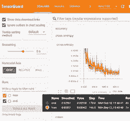
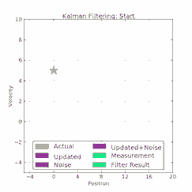
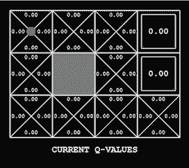

# 想要入坑机器学习？这是 MIT 在读博士的 AI 心得

选自 mit.edu

**作者：Tom Silver**

**机器之心编译**

> > 随着人工智能技术的火热，越来越多的年轻学者正准备投身其中，开启自己的研究之路。和所有其他学科一样，人工智能领域的新人总会遇到各种各样的难题，其中不仅有研究上的，也有生活方面的。MIT EECS 在读博士、前 Vicarious AI 员工 Tom Silver 近日的一篇文章或许对你有所帮助。
> 
> 我的一个朋友最近正要开始人工智能的研究，他问及我在 AI 领域近两年的研究中有哪些经验教训。本文就将介绍这两年来我所学到的经验。其内容涵盖日常生活到 AI 领域中的一些小技巧，希望这可以给你带来一些启发。
> 
> **开始**
> 
> **找到一个你感觉合适的人询问「傻问题」**
> 
> 最初，我非常害怕自己的同事，羞于向人提问，因为这可能会使我看起来非常缺乏基础知识。我花了好几个月才适应了环境，开始向同事提问，但一开始我的问题仍然非常谨慎。不过现在，我已有三四个关系较好的人了，我真希望当时能早点找到他们！我曾经淹没在谷歌搜索的条目中。现在，当我遇到一个问题后会直接询问他人，而不是自己想办法，最终陷入困惑。
> 
> **在不同的地方寻找研究灵感**
> 
> 决定做哪些工作是研究过程中最困难的一部分。对此，研究人员已经存在一些一般性的策略：
> 
> 1.  与不同领域的研究者交谈。问问他们对于哪些问题感兴趣，并试图用计算机专业的语言重述这些问题。询问他们是否有想要进行分析的数据集，哪些现有技术是解决问题的瓶颈。机器学习中很多最具影响力的工作都是计算机科学与生物/化学/物理学、社会科学或者纯数学之间的碰撞。例如 Matthew Johnson 等人在 NIPS 2016 的论文《Composing graphical models with neural networks for structured representations and fast inference》是受到一个小鼠行为数据集启发的结果；Justin Gilmer 等人在 ICML 2017 上的论文《Neural Message Passing for Quantum Chemistry》应用于量子化学。
>     
>     
> 2.  编写一个简单的基线来获得对问题的感受。例如，尝试编写一个有关控制倒立摆的详细校准代码（https://gym.openai.com/envs/Pendulum-v0/），或者试着看看能不能在自然语言数据集上推送一个词袋模型。我在编写基线时经常会遇到无法预料的情况——我的想法或代码里都有可能出现错误。在基线运行时，我通常会对问题有更深的理解，并产生出很多新的想法。
>     
>     
> 3.  扩展你喜欢的论文的实验部分。仔细阅读方法与结果，尝试找到问题的关键。首先尝试最简单的扩展，问问自己：论文中的方法是否适用，思考一下文中没有讨论的基线方法，以及它们可能会失败的原因。
>     
>     
> 
> **投资可视化工具和技能**
> 
> 在编写研究代码时我采用的策略是从创建可视化脚本入手。在编写完其余代码后，我会运行可视化脚本，以快速验证代码是否与我的心智模型匹配。更重要的是，良好的可视化经常会使我想法或代码中的 bug 更加明显、明了。这里还有一些自我激励的话要说：当我完成这个代码时，我会做一份漂亮的数据或视频给大家看！
> 
> 为手头的问题寻找合适的可视化方法可能非常棘手。如果要迭代优化模型（例如深度学习），从绘制损失函数曲线着手会比较好。此外还有许多用于可视化和解释神经网络（特别是卷积神经网络）学得权重的技术，例如导向反向传播。在强化学习和规划中，智能体在其环境中的行为是显而易见的，无论是雅达利游戏、机器人任务还是简单的 grid world（如 OpenAI Gym 中的环境）。根据设置，还可以可视化价值函数及其在训练过程中的变化（如下所示），或者可视化探索状态树。在处理图形模型过程中，当一维或二维变量在推断过程中发生变化时，对其分布进行可视化可以获得丰富的信息（如下所示）。估计每次可视化分析时必须在头脑中保存的信息量可以帮助检测可视化技术的有效性。如果可视化技术非常糟糕，你需要详尽地调用你编写的代码来生成它；反之，一个良好的可视化技术可以带来一个明显的结论。
> 
> 
> 
> *Tensorboard 是可视化 TensorFlow 深度学习模型的常用 GUI。*
> 
> 
> 
> *随着数据的积累绘制分布图可以大大降低 debug 图形模型的难度（来自 Wikimedia）。*
> 
> 
> 
> *用 Q-learning 学习的价值函数可以在它所表示的 grid world 上可视化（作者：Andy Zeng）。*
> 
> **确定研究人员和论文的基本动机**
> 
> 在相同的会议上发表文章、使用相同的技术术语、自称研究领域是人工智能的研究人员可能有截然相反的研究动机。一些人甚至建议为这个领域取不同的名字，以澄清问题（就像 [Michael Jordan 在最近一篇优秀的博客](http://mp.weixin.qq.com/s?__biz=MzA3MzI4MjgzMw==&mid=2650741123&idx=3&sn=37ed968a4afc6a26a3b42a86070582a8&chksm=871addfdb06d54eb02b5579761e80524c670ab6e20844130d6830166d83ae671bad73376976a&scene=21#wechat_redirect)文章中提到的那样）。他们的动机至少可分为三类：「数学」、「工程」和「认知」。
> 
> *   「数学」动机：智能系统有何基本属性和局限性？
>     
>     
> *   「工程」动机：如何开发能够更好地解决实际问题的智能系统？
>     
>     
> *   「认知」动机：怎样才能模仿人类和其他动物的自然智能？
>     
>     
> 
> 这些动机可以和谐共存，许多人工智能领域的有趣论文都是从多个角度出发。此外，单个研究人员的研究动机往往并不单一，这有助于实现人工智能领域的聚合。
> 
> 然而，动机也可能并不一致。我有一些朋友和同事，他们有明显的「工程」倾向，还有一些主要对「生物学」感兴趣。一篇论文表明，现有技术的巧妙结合足以在基准上超越现有技术水平，这将激起工程师们的兴趣，但认知科学家可能对此不感兴趣，甚至嗤之以鼻。但如果一篇论文阐释了生物可解释性（biological plausibility）或认知联系，这篇论文收到的反响可能截然相反，即使其结论只是理论性的或结果非常不起眼。
> 
> 优秀的论文和研究人员在一开始就会说明他们的动机，但根本动机往往藏地很深。我发现在动机不明显的情况下，对论文进行各个击破将会很有帮助。
> 
> **从科研社区中汲取营养**
> 
> **找论文**
> 
> AI 领域的论文可以在 arXiv 上找到和发布。现在的论文数量非常令人振奋。社区中的许多人降低了从噪声中分辨出信号的难度。Andrej Karpathy 开发了 arXiv sanity preserver，帮助分类、搜索和过滤特征。Miles Brundage 每晚都在推特上发布自己整理的 arXiv 论文列表。很多推特用户常常分享有趣的参考文章，我推荐大家在推特上关注自己喜欢的研究者。如果你喜欢用 Reddit，那么 r/MachineLearning（https://www.reddit.com/r/MachineLearning/）非常棒，不过文章更适合机器学习从业者而不是学界研究者。Jack Clark 发布每周社区 newsletter「Import AI (https://jack-clark.net/)」，Denny Britz 发布「The Wild Week in AI (https://www.getrevue.co/profile/wildml)」。
> 
> 查看会议论文集也很值得。三大会议是 NIPS、ICML、ICLR。其他会议还包括 AAAI、IJCAI、UAI。每个分支学科也有自己的会议。计算机视觉方面有 CVPR、ECCV、ICCV；自然语言方面，有 ACL、EMNLP、NAACL；机器人方面，有 CoRL（学习）、ICAPS（规划，包括但不限于机器人）、ICRA、IROS、RSS；对于更理论性的研究，有 AISTATS、COLT、KDD。会议是目前论文发表的主要渠道，但是也有一些期刊。JAIR 和 JMLR 是该领域最厉害的两种期刊。偶尔一些论文也会出现在科学期刊上，如 Nature 和 Science。
> 
> 寻找旧的论文同样重要，不过通常更难。那些「经典」论文通常出现在参考文献中，或者研究生课程的阅读书单。发现旧论文的另一种方式是从该领域的资深教授开始，寻找他们的早期作品，即他们的研究路径。同样也可以向这些教授发送邮件询问额外的参考（即使他们太忙没有回复也不要介意）。寻找不那么有名或被忽视的旧论文的一种持续方式是在 Google scholar 中搜索关键词。
> 
> **应该花费多长时间阅读论文？**
> 
> 关于阅读论文应该用的时间我听到过两种常见建议。一，刚开始的时候，阅读所有论文！人们通常说研究生的第一学期或第一年应该只阅读论文。第二，在最初的上升期之后，不要花费太多时间阅读论文！原因在于如果研究者不被之前的方法左右，更有可能创造性地提出和解决问题。
> 
> 我个人同意第一条建议，不同意第二条。我认为一个人应该尽可能多地阅读论文。「如果我不熟悉别人尝试过的方法，那我就能更好地想出新颖的更好方法。」——这种想法似乎不太可能，且傲慢。是的，新视角可能是一把钥匙，业余者解决长期挑战是因为他们超出常规的想法。但是职业研究者不能完全依赖运气来探索未被考虑过的解决方案。我们的大部分时间都用来缓慢且有方法地逐步解决问题。阅读相关论文是找出我们所处位置和下一步尝试方向的更高效方式。
> 
> 关于尽可能多地阅读论文，有一个重要的注意事项：消化论文内容和阅读论文一样重要。用一天时间学习几篇论文、认真做笔记、认真思考每一篇的内容和思路，比不断阅读论文要好一些。尽可能多地阅读论文。
> 
> **对话 >> 视频 > 论文 > 会议演讲**
> 
> 论文绝对是了解陌生研究思路的最易获取的资源。但是最高效的路径是什么呢？不同人的答案或许也不同。我认为，对话（和已经理解该思路的人对话）是目前最快、最有效的路径。如果这种方法不可行，那么相关视频也会提供很好的见解，比如论文作者受邀进行演讲。当演讲者面对的是现场观众时，他们可能更偏重清晰性而不是准确度。而在论文写作中，这种偏重是相反的，字数统计是关键，背景解释可能被当作作者不熟悉该领域的证据。最后，简短的会议演讲通常更正式，而不是合适的教育机会。当然，演讲结束后与演讲者进行对话交流是非常有价值的。
> 
> **小心炒作**
> 
> 成功的人工智能研究总会引起公众的关注，让更多的人进入这一领域，从而引出更多成功的 AI 研究。这一正循环在大部分情况下都是适用的，但其也有一个副作用就是炒作效应。新闻编辑总是希望获得更多点击率，科技公司则希望获得投资者的青睐，并多多招募新人，而研究者们往往会追求高引用量和更高质量的发表。在看到一篇文章或论文的标题时，请务必注意这些问题。
> 
> 在 NIPS 2017 的一个论文讨论活动中，数百名听众目睹了一位有名望的教授拿着麦克风（「我谨代表炒作警察」）劝告作者不要把单词「imagination」用在论文标题中。我对于这种公众对抗总是有着复杂的感受，而且我还恰好喜欢这篇论文。但这并不意味着我无法理解这位教授的挫败感。人工智能研究中最常见，最令人厌恶的宣传表现之一，就是用新术语重新命名旧概念。所以，小心那些流行语——主要根据实验及其结果来判断一篇论文。
> 
> **开始科研马拉松**
> 
> **树立可衡量的进展目标**
> 
> 之前搜寻研究项目时，我花费了大量时间进行头脑风暴。那时对我来说，头脑风暴就是把脑袋搁在桌子上，希望一些模糊的直觉可以变成具体的见解。结束了一天的「头脑风暴」，我常常感觉疲惫、灰心丧气。这是科研吗？我很疑惑。
> 
> 当然，没有导向科研进展的良方，在黑暗中瞎撞是（大部分）进展的一部分。但是，现在我发现树立一个可衡量的目标，然后计划工作，更加容易且易于实现。如果我不知道接下来要做什么，那么目标可以是：写下一个模糊的想法，但要尽可能详细；如果在写的过程中，觉得这个想法不好，那就写出排除该想法的理由（而不是完全废除这个想法，这样就失去了对进展的衡量）。在没有任何想法的时候，我们可以用读论文或与同事交流的方式取得进展。一天结束时，我的工作有了一些实实在在的东西。即使这些想法永远不会用到，但是我的斗志得到提升，也不再担心以后会在相同的想法上浪费时间。
> 
> **学会判断死胡同，并退回来**
> 
> 强大的研究者花费更多时间在好的想法上，因为他们在糟糕想法上所用的时间较少。能够识别好想法和坏想法似乎很大程度上是经验问题。然而，任何水平的研究者都会经常遇到下面的决策问题。我的研究思路有缺陷或无法产生结论，我应该尝试 A）继续挽救或支持这个思路，还是 B）完全抛弃这个思路呢？我个人非常后悔在本应该做 B）时却把时间浪费在 A）上。尤其是之前，我曾多次陷在死胡同中，而且时间很长。我之所以不愿意离开很大程度上是由于沉没成本误区：如果我退出这个「死胡同」，那我已经花费的时间不就白白浪费了吗？
> 
> 现在当我离开研究死胡同时还是会感到一些失望。不过我现在尝试使自己意识到后退也是一种进步。成本花费得值，不算沉没。如果我今天没有探索死胡同，那我可能明天还会遇到。死胡同并不是终点，它们是科研生活的一部分。希望我能坚持这种想法，如果不能，还有费曼的名言呢：我们尝试尽快证明自己是错误的，只有这样我们才能进步。（We are trying to prove ourselves wrong as quickly as possible, because only in that way can we find progress.）
> 
> **写！**
> 
> 我曾经偶然咨询过一位杰出的 AI 研究者早期职业生涯忠告。他的建议非常简单：写！写博客和论文，以及更重要的，写下一天当中自己的想法。我开始注意到积极地写下想法与只是想想带来的明显差别。
> 
> **身心健康是科研的先决条件**
> 
> 有一种错误的观点认为科研工作者都是废寝忘食，一心追寻科学发现。我之前以此为基准，常常为无法做到而感到内疚。现在我知道锻炼和精神放松是投资，而不是干扰。如果我每天睡 8 小时，工作 4 小时，我的效率比睡 4 小时、工作 8 小时要高得多，也就是说没有造成不好的影响。
> 
> 在解决一个困难的问题时中途停止是非常困难的。我仍然会一直研究一个问题，即使已经非常累了，即使没有进展也不休息。当停下来深呼吸时，我会非常高兴。我希望在科研生涯的下一个阶段能够继续内化这件事。
> 
> *原文链接：http://web.mit.edu/tslvr/www/lessons_two_years.html*
> 
> 蚂蚁金服举办首届金融科技领域算法类大赛——ATEC 蚂蚁开发者大赛人工智能大赛，点击「阅读原文」 进入大赛官网了解比赛信息，比赛报名请使用 PC 端浏览器打开官网。
> 
> 