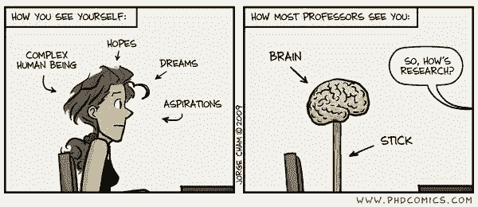

# 观点 | 机器学习博士生的基本素养：除了硬技能，还要学会与导师相处

选自 Medium

**作者：Krzysztof J. Geras**

****机器之心编译****

**参与：晓坤、王淑婷**

> > 本文是纽约大学助理教授 Krzysztof J. Geras 给他的机器学习博士生提的几个建议，重点强调了工作态度和沟通技巧，特别是和导师的相处。Krzysztof J. Geras 希望能和学生建立一种互相合作而不是上下级管理的研究关系。
> 
> 
> 
> 要做一个成功的机器学习领域博士生，必须得拥有但不限于编程、数学以及其他各种「硬」技能。还有很多其他因素也很重要，可惜我读博时没能早点明白。在准备给我的第一批博士生提建议的时候，我在想可以和他们分享什么样的建议，于是对这个话题进行了个人反思。以下是我的个人建议：
> 
> **努力工作，把事做完**——就这么简单。即使你有很多奇思妙想，但如果没有把它们付诸行动然后写下来，那就没什么卵用。完成高质量的研究是需要奉献精神滴！
> 
> **要有责任心。**你的成功或失败最终要由你自己负责，而不是你的导师、同事或者其他什么人。
> 
> **要来办公室干活**。完成博士学位是一件不容易的事，如果你不和其他处境相同的人交谈，那就更不容易了。待在家里的确很舒服，但这通常不是对的选择。
> 
> **不要羞于讨论自己的研究工作**。和其他人、教授、博士后以及同部门的其他博士生讨论你的工作。他们经常会提出一些很好的问题，让你重新思考项目的内容。不定期反思自己的工作是一件危险的事。
> 
> **注意细节。**调试机器学习代码非常困难。不要在这上面浪费时间。尽最大努力在第一时间把它弄好。多花一天时间重新编写代码，而不要花两周时间来调试，或者更糟——调试失败然后得出一个没用的好主意。同样的道理也适用于其他事情。质量很重要。
> 
> **保持专注。**一次完成多个优质项目是一件非常困难的事。不要把注意力分散到太多项目上。
> 
> **要有耐心。**成功完成一个研究项目需要大量时间和毅力。通常这并不等于实际完成一个研究项目，而是完成一些相关的项目。这是一项很大的工程，只有坚持下去才能完成。
> 
> **要谦虚。**保持谦逊，这只是一个开头。即使你是在全世界最好的大学，你也还未拿到博士学位。有很多比你更聪明的人都没能成功获取它。你必须努力工作几年才能成功获取。
> 
> **要友善，广交友。**学术界比外界看起来小得多，每个人都知道彼此。你肯定不想有一个不讲理或粗鲁的名声。保持礼貌和专业虽然不会让你的论文通过，但从长远来看这点很重要。那些在会议上与你交谈的人，也许某一天会是你求职或申请资助的评委。
> 
> **不要树敌**。除非你很幸运，否则你会遇到一个不太好相处的办公室职员，一个办不好事的行政人员和一个不爱搭理人的技术支持人员。作为一个博士生，你没有凌驾于任何人之上的任何权力。因此生气和与他人产生冲突解决不了任何事。光是获得博士学位就有很大压力，把难题的协商解决办法留给你的导师。
> 
> **不要不懂装懂。**知之为知之，不知为不知，是知也。当你不理解部分对话时，要告诉你的导师。没人要求你一开始就知道一切。然而，当你多次听到某事且没有要求解释之后，你应该了解所说的到底是什么。
> 
> **沟通清楚。**你的工作质量是最重要的，但即使是最好的研究，如果你没办法在论文或谈话里把它讲清，那它就有被忽视的危险。科学上的失败从来都不壮观。当没人关心一个科学家想说什么的时候，他就失败了。
> 
> **向导师报告进度**。在完成大部分工作之前，你可能倾向避免和导师交谈。如果你清楚地知道要做什么并且只需执行它的话就太好了，而不是对于自己该干什么茫然无措。你的导师可以帮助你。即使你不需要和他交谈，但也要让他知道你在做什么。这会让他更多地参与你的项目。
> 
> **教育你的导师**。你的导师并非无所不知，但他一定很聪明并且渴望学习。把你学到的教给他。如果你想得到很好的建议，你必须给他充分的背景知识来详细了解你在做的事。这包括以易于理解的方式向其展示你的实验结果。创建容易解释的表格和图片。你要让他们专注于内容而不是试图理解符号、轴标签等，才能利用他们的知识和经验。
> 
> **尊重导师的时间**。除非有很好的理由，否则会见导师时不要迟到。学术界的人通常都很忙。迟到 15 分钟并不 OK。如果你的导师可以在上午九点见你，那你也可以。不要以为导师会帮你修正代码、论文或海报中的错误，如果你自己没有在上面花足够的时间。会见导师时不要从日志文件中提取结果。好好利用和导师见面的时间，让你的研究受益。
> 
> **向导师提问。**给出建议很难。确保他关注并确实考虑过你的项目。向他提较难的问题。他们习惯如此，也可以接受，并且会很高兴看到你对自己的研究进行了深入思考。在和导师的讨论中，你要尽己所能成为一个合作伙伴。
> 
> **享受生活。**在几周而不是几年之内，一天工作 16 个小时是可能的（但不建议这么做）。尽量有效地一天工作 8 小时，留点时间给其他事还有你爱的人。如果感到疲惫或痛苦，你将没办法最好地完成工作。坚持一个时间表，你的健康和福祉将会长期得到改善。
> 
> 祝你好运！ 
> 
> *原文链接：**https://medium.com/@krzysztofgeras/a-personal-advice-on-how-to-be-a-successful-phd-student-in-machine-learning-279284e283c8*
> 
> ****本文为机器之心编译，**转载请联系本公众号获得授权****。**
> 
> ✄------------------------------------------------
> 
> **加入机器之心（全职记者 / 实习生）：hr@jiqizhixin.com**
> 
> **投稿或寻求报道：**content**@jiqizhixin.com**
> 
> **广告 & 商务合作：bd@jiqizhixin.com**