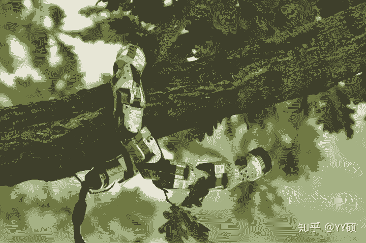

# 写在博士旅程之前——前大疆创新技术总监杨硕

机器之心转载

**作者：YY 硕**

> > 近日，大疆创新的 YY 硕（杨硕）在知乎上发表了一篇文章引起了大家极大的关注。此文介绍了作者本人去卡内基梅隆大学机器人学院攻读机械工程和机器人学的博士学位之前的心路历程。经授权，机器之心对此文进行了转载。
> 
> 在完成 RoboMaster 2018 总决赛和参与 Mavic 2 发布会后，我离开了在大疆创新的岗位，8 月 27 日开始在卡内基梅隆大学的机器人学院攻读机械工程和机器人学的博士学位。
> 
> 读博士这件事，想法一直都有。2015 年硕士毕业前去西雅图参加 ICRA2015，顺路跟着导师李泽湘到他年轻时的好基友沈向洋先生家做客。导师站在沈向洋先生的豪宅前开玩笑地说：「看一下以后奋斗的目标。」而逛了一圈，我印象最深的是他书房里最显眼的位置挂着的博士学位证书。Doctor of Philosophy in Robotics，这是这位人生赢家最让我羡慕的地方。2016 年，带领大疆的智能导航团队保障 Phantom 4 顺利发布以后，我觉得我已经清楚了解了多旋翼的控制和智能导航相关的技术，这个领域不再有开创性的研究问题需要被探索了，我就有了去读博士的想法，找一些更有挑战性的机器人学问题去探索。2016 年中我开始做大疆创新在我心中最牛逼最激动人心的新项目——RoboMaster，为此把读博士的梦想耽搁了两年。2018 年终于是个好时机让我开启人生的下一阶段了。
> 
> 这是一个非常疯狂的想法，但是我能够感受到内心的召唤，愿意为此突破一些障碍。比如后来每次有人和我谈起沈向洋作为华人圈最成功的高管的种种事迹的时候，我首先想到的总是我站在他的博士学位证书前感受到的羡慕和向往。比如在刷朋友圈的时候看到科技新闻，相比起成功融资、成功上市的企业家的新闻，我还是从心底更佩服那些在科研工作上做出成果的科学家的新闻。尤其是现在这个时代，机器人学的未来该何去何从，尚未有定论，亟待科学家们的探索，这是需要探索和梦想的年代。虽然我在公司里有一些进展顺利的项目，但是科学上的挑战不多，而且公司里面专心科研的机会非常少，还是要回到学术机构才能比较高效专心地展开工作。
> 
> 另外在大疆的树荫下待久了，容易滋生自己很牛逼的心态。因为导师和大疆的成功，我也狐假虎威地跟着老板们接触了一些以前只在新闻上看过的名人，也接待了很多学术界和工业界的传奇人物来参访大疆。但是这都不是我自己的能力所能达到的，我想靠自己的科研学术能力去让别人认可我。很多人年轻时都怀抱着改变世界的理想，我比较幸运的是已经和一些很厉害的人参与了一件改变世界的事情，因此对这个理想早已释怀。比起改变世界来说，做好自己更难。
> 
> 2016 年底抱着试一试的心态我开始了第一次申请。由于 RoboMaster 和公司其他项目繁重，我没考 TOEFL 和 GRE，只改了改简历、写了写文书申请了加州大学伯克利分校（加州大学伯克利分校可以不需要提交 TOEFL 和 GRE 成绩）。因为我的研究生导师在加州大学伯克利分校有很强的影响力，所以 2017 年 2 月我拿到录取通知，可以在 17 年秋季入学。
> 
> 和大疆的同事以及妻子商量以后，觉得 17 年不是一个去读博士的好时机，他们都以为我 16 年只是随便申申，所以并没有准备好。我的工作交接不出去给别人，老婆也没做好跟我一起去美国的准备。所以我和伯克利沟通了一下之后，把 offer 推迟到了 18 年再入学。
> 
> 在拿到伯克利的录取前后，我也受邀到卡内基梅隆大学的机器人学院介绍大疆的无人机技术和 RoboMaster 这个机器人教育项目。所以 2017 年的 3 月，我首先在卡内基梅隆大学机器人学院做了一次 seminar，然后去加州大学伯克利分校参加给博士学生组织的校园开放日。
> 
> 两个地方给我的感觉是截然不同的。3 月的加州伯克利阳光温暖和煦，四处充满着生机，加州大学伯克利分校作为世界科技中心的主要学术机构之一，人们都在兴奋地讨论人工智能、自动驾驶和区块链；而 3 月的宾州匹兹堡冷风刺骨，街道透出衰败的气息，卡内基梅隆大学作为锈带区复兴的唯一希望，人们显得更加谨小慎微。虽然有不少科技公司在匹兹堡开设分支办公室，但大部分卡内基梅隆大学的学生都会在毕业之后去硅谷，而加州大学伯克利分校的学生们已经在宇宙中心了，我想这让他们的学术科研以及生活的方方面面都有不同的思考。
> 
> 两相比较下来，我发现我更想去卡内基梅隆大学读博士。
> 
> 卡内基梅隆大学机器人学院的很多教授和学生非常热情地欢迎了我。他们知道我是做什么的，我在大疆的工作已经帮助到了很多机器人学院的人，甚至有人知道 DJI SDK 是我主导并架构的项目。在机器人学院负有盛名的 Field Robotics Center，遍地都是大疆 M100 和 M600 飞行器，至少三个科研和创业项目以大疆飞行器为核心。一个机器人学院的学生骄傲地给我展示了他的工作，他在 M100 上增加了激光雷达，通过调用 DJI SDK 中控制飞行器的 API，实现自动桥梁巡检，他说奥巴马离任总统之前来卡内基梅隆参观的时候也看过他的项目。在机器人学院的官网上，一台由 M100 改造的空中机器人和很多其他卡内基梅隆造出来的著名机器人被展示在了一起。
> 
> 而在另一边的加州大学伯克利分校，人们对我的态度不愠不火，很少有人听说过大疆这家公司。抛开多旋翼飞行器不说，我参观了很多伯克利的实验室，但是没有看到什么特别令人惊奇的机器人项目。
> 
> 他人的态度不应该作为做出选择的依据，既然我决定离开国内的人脉圈和大疆优越的环境去读博士，就应该做好从零开始的心理准备。我这样说，只是结合我的观察和感受，思考了这样一个问题：两个地方人的态度，反映了他们思维方式和做事方式的不同。
> 
> 加州大学伯克利分校的计算机专业和卡内基梅隆大学的计算机专业都很强，不分伯仲。两个学校的计算机专业对自己学校机器人方向的研究却有着不同的影响。在我看来，伯克利的计算机专业和硅谷周围偏软件互联网的环境吸收走了资源，一些本可以研究机器人的优秀人才都去做纯软件方面的科研工作了，工作的目的多半也是为了到硅谷创业。计算机科学非常契合人们对个人英雄主义的追求，一个人单枪匹马发明了一个算法或者一个软件工具解决了一个重要的计算机科学问题、开办了一家公司，这是非常常见的，而且很容易受到媒体和社会的关注。在伯克利参加校园开放日的时候，有一个 session 是教授们轮流上台讲自己的 research 来吸引学生，好几个教授在介绍的过程中都会说啊你看我这个工作已经创了业融了资，或者说啊我这个工作虽然充满了蛋疼的数学但也是能创业的……
> 
> 和计算机科学领域的研究不同，机器人是综合性学科，不能用计算机科学领域的思路去研究，鲜有人能单枪匹马做一个机器人出来，大家必须一起合作。后来沈向洋在他的一篇文章里也谈到了这一点：
> 
> > …… 麻省理工大学每个人都是一头虎，而卡内基梅隆大学出来的都是一群狼。我们很少单打独斗，都是一个团队一起做一个大项目，卡内基梅隆大学最出名的都是大项目。所以卡内基梅隆大学成功的地方是培养了很多大的 IT 公司 CTO 级别的人物，很多学生在工业界更加成功。
> 
> 做大项目就意味着成果不那么容易出，而且大家需要花很多时间进行工作的讨论和同步。另外机器人相关的大项目一定需要工程师和科学家的协作，由工程师制作基本的机器人平台，机器人科学家在上面进行科研探索。卡内基梅隆大学有非常完善的工程师和科学家协作的制度，甚至进行教学工作的教授就分研究型和工程型两类。机器人学院虽然架构在计算机学院下面，但是计算机学院并没有非常强势地把控机器人学院的研究方向，机器人学院在人类做机器人的历史上功名赫赫，能够持续地吸引优秀的人才。更重要的是，机器人学院跨学科交叉的制度吸收了很多 ECE 和 meche 的学生一起进行科研。
> 
> 因为卡内基梅隆大学的协作制度和做大项目的能力，他们和工业界的联系非常紧密。他们能很快把握工业界的动向，很快地把一些工业界的产品用到科研当中，比如大疆的 Matrice 飞行器。而加州大学伯克利分校则没有这样的协作机制，机器人项目也基本仅由最强势的 EECS 专业把控，很少能组织起背景丰富的交叉型团队。
> 
> 这么说并没有轻看伯克利的意思，相反我相信伯克利可以让精英更精英。我只是认为，机器人是狼群做的事情。独立去做研究的话，和辛湜、贾扬清这样优秀的伯克利学生比起来，我在工业界浅尝辄止的背景和编程能力，更像一匹狼，在伯克利应该是很难做出什么成绩的。所以我想再申请一次，去卡内基梅隆大学。
> 
> 另外，一些和学术不相关的东西也影响着我。匹兹堡作为上世纪美国工业重镇的历史总是让我时不时联系起我的家乡——中国的工业老城山西太原。太原和匹兹堡一样在国家发展的过程中有重要的地位；一样是受益于煤炭和钢铁；一样也在国家发展进入新阶段以后城市的发展出现了停滞。我能在匹兹堡的街道上嗅出一些在太原街上也有的气息，让我感觉很熟悉。
> 
> 4 月份我回太原的家里探亲，整理小时候看过的百科全书时随手翻了翻，在某一页赫然看到一个机器人被注明是卡耐基梅隆大学的机器人学院所研发。我这才惊讶地发觉，虽然现在完全不记得，但是可能十几年前当我立志想做一个科学家的时候，曾经被机器人学院所激励过。
> 
> 2017 年 4 月 11 日，王小波逝世 20 周年。我买了张佳玮非常推崇的《万寿寺》来看，又从前言里了解到，王小波曾在匹兹堡大学陪他的妻子读书，他当时的好朋友、也在匹兹堡大学学习的丁学良后来成为了香港科技大学的社会科学教授，我在香港科技大学读书的时候也听过丁学良教授的课。想必匹兹堡这个地方深深影响了他们写作的方式和对世界的看法。
> 
> 作为一个怀念并坚持童年理想的人，一个喜欢历史、社科和文学的人，很容易被这些冥冥之中的联系牵引起来。大家都想去硅谷，但我很想在匹兹堡这个地方多待一待，看看机器人产业如何让这个老城复兴。
> 
> 2017 年 6 月，在参加完 ICRA2017 之后，我写了这篇文章《未来的机器人未来》。其实有些读者应该很明显地看出我在这篇文章里表达的个人倾向了。如果去伯克利的话，多半是会按照深度神经网络和增强学习的方法去做一些东西，但是我更想跟随传统的路线。17 年的申请季，我重新申请了卡内基梅隆大学。
> 
> 在写《未来的机器人未来》前后，我也一直在了解深度神经网络和增强学习，一方面是了解这个研究领域，一方面也为 2018 年举办 RoboMaster AI 挑战赛做准备。在《RoboMaster AI 挑战赛科研思路浅谈》这篇文章里我讲了一些自己的思路和想法，遗憾的是，半年过去，我、我的 RoboMaster 团队、RoboMaster AI 挑战赛的参赛学生，都没有实现出增强学习控制的机器人。我自己做深度增强学习，有一种说不清道不明的失败感：算法非常难收敛、variance 很大、极其 sensitive，随便改个参数结果会大相径庭、修改参数没有什么理论依据。最近有一篇文章《呵，我复现一篇深度强化学习论文容易吗》，很好地描述了复现一些深度增强学习的痛苦之处。让我感到特别不适的是，机器人系统的精髓——能量的转化和系统的建模——在深度增强学习里毫无用处。机器人上电和磁转化为动能、力带来的运动对外产生力，我们面对的是一个复杂但是一切可知的系统。但是在深度增强学习里这些都用不到，我们调整参数或者调整神经网络的层，参考依据居然不是牛顿运动定律。进入 2018 年，圈内出现的质疑声越来越多，比如《【AI 幽灵】超 90% 论文算法不可复现，你为何不愿公开代码？》、《这里有一篇深度强化学习劝退文》、《深度学习劝退文》。感觉世界上除了伯克利 BAIR 实验室的人，其他人都复现不出深度增强学习算法。
> 
> 虽有质疑，但是每隔一段时间，伯克利和 OpenAI 都还是能拿出一些看起来效果非常惊艳的工作。不过，因此强行说 DRL 就能做出传统方法做不出来的东西，就有点不合适了。比如说最近 OpenAI 的新作像人手一样：OpenAI 用打 DOTA 算法，教机械手「盘核桃」，如果用传统方法来做，也是能做的，总计算量也差不多：用外部摄像头计算出木块的位姿，然后根据牛顿运动定律和欧拉方程列出动力学微分方程，再解个优化问题算出连续转动的施力点，接着计算每个手指提供施力的角度和方向，然后移动每根手指（后面这几步，在我导师的书 A Mathematical Introduction to Robotic Manipulation 里都明确地写了该怎么做）。这些过程中要解一些非常繁琐的优化问题，但是如果能拿到 OpenAI 训练神经网络所用的计算量，解优化问题也不是太麻烦的事情。而且大家一说传统方法就觉得是有模型的，所以不容易扩展。但其实从物体的外形计算出合适的施力点这个过程，在传统的方法里本来就是无模型的凸优化问题（可参见 @ 戴泓楷的工作），不见得比 DRL 的方法差到哪里去。所以现在业外人士，包括业内人士的态度都变成了：方法 A 做出了不错的效果，推测觉得方法 B 做不到，就说明方法 B 完全不能用，方法 A 是人类的未来。但是就没有人用方法 B 做过同样的事情啊，连对比都没有。而且 OpenAI 这个机械手盘核桃，读了论文发现实验中 50 次平均成功 13 次，这么低的成功率为什么能被用来证明方法 A 就好到是人类的未来呢……
> 
> 我应该还会继续关注这个领域，但是不想也不再有机会去伯克利去弄明白这件事。17 年人工智能的浪潮继续高涨，大量的申请人想挤进 BAIR 实验室去做深度学习，伯克利的秘书说 17 年的申请人数量是 16 年的好多倍，我放弃了 offer 就拿不到了。不过好在后来顺利拿到了卡内基梅隆大学的 offer。
> 
> 我将加入卡内基梅隆大学机器人学院的 Biorobotics lab，跟随 Howie Choset 教授进行科研，继续沿用比较传统的机器人学家分析问题的方法和思路。非常巧合的是，前两天在 Mavic 2 宣传文里我谈到的给 Mavic Pro 颁发「年度空中救援机器人」的组织，同时也把「年度地面救援机器人」颁发给了 Howie Choset 教授团队做的机器蛇（https://www.zdnet.com/article/snakebot-named-ground-rescue-robot-of-the-year/ ）这种机器人在狭小空间内搜索救援有非常大的优势，同时也能引出很多有价值的科研问题和方向。
> 
> 
> 
> 基于我在工业界的背景和卡内基梅隆机器人学院紧密结合工业界的传统，未来我会继续研究可以适用于多旋翼飞行器和地面机器人的通用控制和规划技术，同时也会关注机器人系统架构的标准化工作。我希望能够通过博士期间的学习和科研工作，回答一些更大的问题：机器人应该尽量模仿生物还是超越生物？是否存在显性表现群体智能涌现的算法？真正的机器人学习是怎样的范式？我不想盲从人工智能热潮，我相信真正的人工智能、超越人类智能的智能，应该是从我们对物理世界的规律、能量转化的利用和现实世界抽象的数学中涌现出来的。
> 
> 虽然卡内基梅隆的很多人已经认识我，但是就像卡内基梅隆大学博士田渊栋学长说的那样：
> 
> > 不要在优越感中停止自己的脚步。名利于人最可怕的莫过于此，分明刚刚启程，但欢呼声让你觉得已然冲线，本来要万里长征，却变成了百米短跑，接受完了鲜花之后，就再也看不见远处的风景。其实境界到了或是未到，只有自己知道。跋山涉水，风餐露宿，鼓掌的是别人，度化的是自己。
> 
> 我需要不断让自己做好「雄关漫道真如铁，而今迈步从头越」的心理准备。也希望未来在卡内基梅隆不会得到太多科研和教育以外的关注。
> 
> 对于年轻的科研工作者来说，在哪里展开科研工作的博士阶段是一个非常重要的选择，我不知道自己关于伯克利还是卡内基梅隆的选择有没有做对，多年以后回头再看也许会后悔，可能那个时候大家都已经转向了深度增强学习的研究，深度增强学习也在工业界得到了广泛的应用，但是至少最开始的时候我有一个我自己坚持的想法，没有随波逐流。
> 
> 我在大疆从事的最令我自豪的工作之一——RoboMaster，之后会继续以顾问和裁判长的身份参与，帮助这项比赛走向国际。过去几年中有很多高中生、大学生在参加完 RoboMaster 的比赛、冬令营和夏令营之后也受到卡内基梅隆和其他一些美国大学的青睐，未来我会继续在美国帮助他们，也会给 RoboMaster 圈子里的同学继续提供职业发展的建议和咨询。
> 
> 过去的五年，我在大疆经历了一段英雄辈出的时代，得以有幸和一些全国甚至全世界最优秀的工程师合作，并向他们学习了很多经验，没有和他们共事的经历也没有我现在能够得到的读博士的机会；同时在大疆也得到很好的平台和资源专心做机器人教育事业，通过 RoboMaster 机甲大师赛帮助了新一代工程师的成长，并且为他们的故事所感动，去读博士不是这项事业的结束，而是另一种形式的延续。我相信大疆创新在未来依然是中国最有竞争力的消费电子、机器人和制造业企业。公司内一些正在孕育的新技术和新项目一定会在接下来的很多年中持续刷新人们对中国制造和创新的看法。RoboMaster 作为我口中的「大疆下一个创新」、被媒体描述成「大疆第二次创业」的项目，也会持续开花结果，带给人们紧张激烈的机器人比赛，也带给下一代年轻人更开阔的未来和可能性。我深深感谢过去经历的这一切，感谢合作过的每一个人，我们都会在世界各地继续努力，「聚是一团火，散是满天星」。
> 
> 我也非常感谢我的妻子 @Lexi M。在别人都已经安顿下来的年纪，还要换个生活方式继续挑战自我，这对我的家庭也是一个巨大的挑战。妻子从一开始就非常支持我去走上这条新的道路，给我出主意，并且愿意为了我调整自己的职业发展方向、经历离别和生活方式的改变。人生得一知己足矣，而对我来说我同时得到的是知己、朋友、亲人和爱人，对此感激不尽，只能用一生的努力去报答。
> 
> 最后，用我非常欣赏的哈尔滨工业大学机器人队的队训作为结尾，希望在未来的几年自己能够一直被这句话所激励：**极限尤可突破，至臻亦不可止。****
> 
> 知乎文章链接：https://zhuanlan.zhihu.com/p/41313724?utm_source=wechat_session&utm_medium=social&utm_oi=28147256918016&wechatShare=2&from=timeline&isappinstalled=0
> 
> ****本文为机器之心转载，**转载请联系原公众号获得授权****。**
> 
> ✄------------------------------------------------
> 
> **加入机器之心（全职记者 / 实习生）：hr@jiqizhixin.com**
> 
> **投稿或寻求报道：**content**@jiqizhixin.com**
> 
> **广告 & 商务合作：bd@jiqizhixin.com**