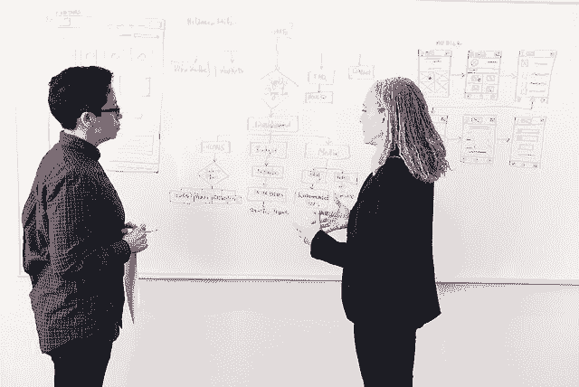
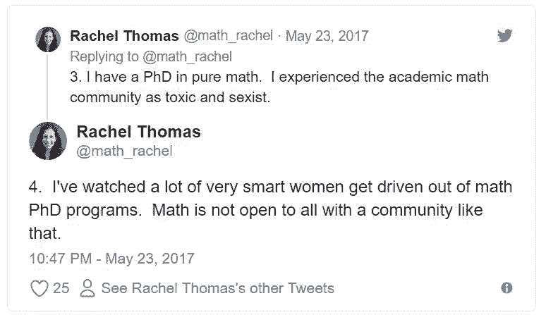

# 观点 | 读博有风险，入坑需谨慎

选自 fast.ai

**作者****：Rachel Thomas**

 ****机器之心编译**

**参与：高璇、晓坤**

> 人工智能界的特殊性令人难以分清其在学术界和产业界之间的界限。[AI 学术界的「排外」现象到底是由于开放性还是有先来者在守门](https://mp.weixin.qq.com/s?__biz=MzA3MzI4MjgzMw==&mid=2650747753&idx=1&sn=c99c6a754087244f6081aa3578eb21ce&scene=21#wechat_redirect)，近日在 Reddit 上就出现了这样的讨论。但该话题仅聚焦于学术研究，读博其实是个人发展的一部分，学术研究也是整个 AI 行业的一部分，Rachel Thomas 在这里就向我们提供了更广的视角。

Rachel Thomas 是致力于 AI 开放教育的 fast.ai 联合创始人之一，她在本文讨论了在考虑读博之前，如何结合学术界和产业界的视角看待整个行业以及个人发展，并结合自身经验给出了中肯的建议。

我最新的帖子 Ask-A-Data-Scientist 对是否攻读博士学位的问题做出了解答。之前的 Ask-A-Data-Scientist 建议列表链接：http://www.fast.ai/topics/#advice。

问题：我是一名对机器学习充满热情的本科生，我对获得博士学位感到有点压力。进入这个行业几年后再考虑回到学校会更有意义吗？如果您有任何建议告知，我将不胜感激。

关于是否读博的对话经常会有选择性偏差的影响：考虑读博的人会向已拿到博士学位的人寻求建议。另一方面，有许多人在没有博士学位的情况下从事有趣且前沿的工作，他们不太会被问及这一问题。而其他例如极高的研究生抑郁率或读博的机会成本等重要因素，都很少被讨论。作为拥有数学博士学位的人，我很遗憾花了这么多年时间专注于一个狭窄的领域，同时忽略了许多其他的重要技能。我一参加工作，就发现自己一直在学习各类关键技能和经验！

**了解机会成本**

我严重低估了通过产业所能得到的收获。我曾经认为不断地学习的最好方法是留在学术界，并且我没有很好地把控读博的机会成本。我的本科经历挺传奇，我一直都很优秀并喜欢待在学校。在学校拿薪水的想法听起来就很美妙！

但我后来才意识到，我的传统学术成就反而成了我的弱点，因为我学会的只是如何解决别人给我的问题，而不是如何自己发现和解决问题。我认为对于许多优秀学生（包括以前的自己），读博是一张「安全牌」：这是一条光荣且意义明确的路。但这只是一种推迟人生重大节点到来的方式：学着去设定一个学术体系之外的目标，并与你的内在动机和价值观都更深刻地联系起来。

当时，我觉得我在博士期间学到了很多东西：学习高级课程、阅读论文、开展研究、定期演讲、在我的领域组织两次会议、协调研究生课程，在我的院系担任学生代表以及撰写论文。事后看来，所有这些都只是我意识到的技能的冰山一角，并且其中许多技能都难以迁移。例如由于结构和激励非常不同，学术写作与我通过博客（受众更广）写作就非常不同，学术策略与创业策略也有很大差异。

*你应该读博吗？照片来自 #WOCinTech Chat*

在我 27 岁时，我完成了博士学位，并开始了我的第一份全职工作（与我在研究所通过各种研究和教学奖学金获得的津贴不同）。我需要了解很多关于我从事的行业和实际技能的主要差异。尽管在高中学习了 2 年的 C ++，在大学辅修了 CS，并在数学博士期间做了一些编程项目，但我更专注于计算机科学的理论部分，缺乏许多实用的计算机技能。相反，我的 fast.ai 联合创始人 Jeremy Howard 在 18 岁就有了第一份全职工作，当时他是麦肯锡的一名顾问，并且在我刚进入社会时，Jeremy 从事全职工作已经几乎十年。期间他已经成立了两家目前仍在运营的初创公司。在我读博期间，我本可以学到很多其他的技术。

需要明确的是，生活不是一场赛跑。你可以在任何年龄进入科技行业，学习新技能。但科技行业是吃「青春饭」的，年轻创业者得到的赞美像是「罂粟」。然而，我再也没有 20 岁出头的精力了 (尽管我现在吃草撸铁泡枸杞，但我感觉还是不一样的)。我后悔太过于关注一个狭窄的领域和忽略了其他，这一项就浪费了我大量时间和精力。

**你不需要博士学位**

我想到了下面没有读博的人他们在深度学习中都从事有趣且前沿的工作（这个列表不完整，还有很多人）：

*   Chris Olah，distill.pub 的联合编辑，富有洞察力的可视化创建者，Google Brain 的研究员（没有大学学位）。

*   Jeremy Howard，fast.ai 的联合创始人，Enlitic 的创始人（第一个将深度学习应用于医学的初创公司），之前排名第一的 Kaggler 和 Kaggle 总裁，fastmail 和 Optimal Decisions Group 的创始人。

*   David Ha，Sketch-RNN 的创建者，Google Brain 的研究员。

*   Smerity，曾经 Salesforce / MetaMind 研究员，AWD-LSTM 的发明者，创业公司创始人。

*   Pete Warden，Google Brain 的研究工程师和 TensorFlow 移动端的技术负责人，JetPack 的创始人（被 Google 收购），O'Reilly ebook 中《使用 TensorFlow 构建移动应用程序》的作者。

*   Greg Brockman，CTO 和 OpenAI 的联合创始人，领导团队的 DOTA 工作（没有大学学位）。

*   Catherine Olsson，Google Brain 的研究工程师，曾帮助建立 OpenAI Gym。

*   Sara Hooker，Google Brain 研究员，致力于解释性和模型压缩，非营利性 Delta Analytics 数据的创始人。

*   Denny Britz，以前效力 Google Brain，现在在 Berkeley 的 Spark 工作，为 WildML 写博客。

*   Helena Sarin，深度学习研究人员，创造创新艺术作品。

*   Sylvain Gugger，fast.ai 的第一位研究员，对 AdamW 和超融合进行了研究。

*   Mariya Yao，Metamaven 的 CTO，TOPBOTS 的主编，应用人工智能的作者，Duke 团队的一员，在 DARPA 的大挑战中获得第二名。

*   Devaki Raj，创业公司 CrowdAI 的 CEO 兼联合创始人，将人工智能应用于卫星图像，之前曾在谷歌地图和 Android 工作过。

*   Choong Ng，Vertex.ai（被英特尔收购）的 CEO 兼联合创始人，创建了 PlaidML，可以快速轻松地在任何设备上进行深度学习。

*   Brian Brackeen，计算机视觉初创公司 Kairos 创始人兼 CEO，采取了令人钦佩的立场反对利用法律强行使用面部识别。

在我所有的工作中，包括在技术上「需要」博士学位的工作，我都有一些没有硕士学位的队友。而没有博士学位的队友通常比那些拥有博士学位的人办事更成效，给我更多帮助（也许是因为他们有更多的实践经验）。

当然，有很多有博士学位的人做过有趣且有价值的工作，比如 Arvind Narayanan、Latanya Sweeney 、Timnit Gebru、，Moustapha Cisse、Yann Dauphin、Shakir Mohamed、Leslie Smith、Elin LeDell、Andrea Frome 等等。我非常钦佩我列出的所有人，而且我绝不认为博士学位没有用或者不好。

**研究生的抑郁、孤独和心理健康问题**

> 67% 的研究生说他们在过去一年里至少有一次感到绝望；54% 的人情绪低落，无法正常工作；2004 年的一项调查发现，近 10% 的人曾考虑过自杀。相比之下，美国国家心理健康研究所（National Institute of Mental Health）对 UC Berkeley 学生的研究表明，估计有 9.5% 的美国成年人曾患有抑郁症。

*照片来自 #WOCinTech Chat*

> 对于许多人来说，读研究生并不是一种乐趣或个人的充实。它可能受很多因素影响，例如可怜的薪资、不确定的就业条件、主管的无理要求、无关的研究项目，以及教职员工和本科生（他们经常表现得像管理人员和顾客一样）的无礼对待。研究所每天都对鸡毛蒜皮的小事进行打击并扼杀学生自信心。所有这一切都因担心一切都是徒劳而加剧；一位教授在《Chronicle of Higher Education》上写道:「你是个有用的傻瓜」，他在一篇文章中特别提到了人文学科的学生，但这也适用于许多 STEM 学生。在过去的十年里，我几乎不知道有哪个研究生不痛苦。因为我会在这个网站上写专栏文章，所以一些人告诉我，他们的研究生生涯时刻伴随着自杀的念头。更常见的是，研究生会遭受诸如体重波动、疲劳、头痛、胃痛、焦虑和酗酒等未经治疗的慢性疾病的折磨。

虽然性别歧视和骚扰使我对读研有了负面感受，但我的许多男同学也很悲惨，因为他们遭到教授的孤立、欺凌或羞辱，还有一种剥削制度，由自大严苛的等级制度和对威望的迷信所组成。美国国家科学院的一名综合报告的作者说：「科学家们视严苛和批评为残忍。」

**学术界的性别歧视和种族歧视**

美国国家科学院的一份报告指出，在科学、工程和医学领域，20%-50% 的女学生和超过 50% 的女教师遭受过骚扰。在对从事 STEM 研究的 60 名有色人种女性的采访中，100% 的女性都遭到过歧视，她们所面对的负面刻板印象因种族而异。

由于潜意识的偏见（特别当他们是自学的时候），他们会受到更多的调查，因此文凭对弱势群体的人们可能更重要。不幸的是，由于高等教育中的性别歧视和种族歧视，弱势群体可能更需要文凭，但他们在争取这些文凭时也可能要面临更险恶的环境。对此我没有答案，但我想表明这种紧张关系。

在普林斯顿大学获得数学博士学位的黑人女性 Piper Harron，在她的论文中写道：

> 受尊重的研究数学由态度确定的男性主导。即使允许个体差异，现在仍然存在一种压抑的气氛，而那些利用它获得成功的人精心维护，甚至大力营造这种氛围。正如所有优秀的研究生做的那样，我试图在数学研究上去适应它。我去融入这种气氛并将我的态度隐藏于心。我很痛苦，也一度濒临失败。问题不在于个人，而是一种自我保护机制。从外部看，所有的背叛都是你自己造成的。

**恶劣的研究所比恶劣的工作更糟糕**

我认为我在研究所的时间是我最糟心的时期之一。虽然我给出的处理恶劣工作的大部分建议同样适用于恶劣的研究所，但有一个区别很关键：换研究生项目要比换工作难得多。这使学生和教授之间的权力差异远大于技术行业中员工和老板之间的权力差异（这意味着权利滥用或剥削的可能性更大）。

我知道有些人换了导师，甚至换了项目，这确实可以让你回到过去。然而留在糟糕的项目中的成本（身心健康方面，以及机会成本方面）会非常高，我知道有些人花了数年时间才恢复过来。如果你是学生签证的移民并且必须考虑签证/居留问题，那就更麻烦。对于糟心的研究所，没什么简单的解决方案。

**高等教育正在发生变化**

唯一需要博士学位的情况就是成为一名教授。然而，高等教育正在发生很大变化：向辅助化转变，博士学位过剩使美国研究经费预算大幅削减，越来越多的学校让终身教职员工下岗，为一些博士后采取一些重大举措，以及无法继续给本科生提供助学贷款。我不确定高等教育的未来是什么，但我认为它将与过去不同（这在我改变职业目标的过程中发挥了重要作用）。

当我听到本科生（包括年轻的我自己）说他们认定自己要成为教授时，我是持怀疑态度的。即使他们有过实习或兼职，本科生也很难深入且全面的了解职业选择。此外在本科期间，学生们的周围主要都是教授和其他学生。

如 Coursera 之类的编码训练营和 MOOC 都是直到我技术转型时才被发明的，但两者都很有用并且对教育产生了重大影响。我已经从许多在线课程中受益，如果编码训练营早存在 10 年或 15 年，我将获益更多。在过去的几年里，我既是一名训练营的讲师，也是建立 fast.ai 的 MOOC 的联合创始人，包括应用于编码的实用深度学习和计算线性代数。我已经看到这些如火如荼的新教育形式带来的强大作用。（除此之外，也有很多无用的或粗制滥造的训练营和 MOOCs，研究也一样。）

在考虑读博时，一定要仔细权衡机会成本和风险，并考虑各类人的经验：那些在没有博士学位的情况下取得成功的人、有许多负面研究生经历的人，以及那些在传统的学术道路上取得成功的人。**

*原文链接：http://www.fast.ai/2018/08/27/grad-school/*

****本文为机器之心编译，**转载请联系本公众号获得授权****。**

✄------------------------------------------------

**加入机器之心（全职记者 / 实习生）：hr@jiqizhixin.com**

**投稿或寻求报道：**content**@jiqizhixin.com**

**广告 & 商务合作：bd@jiqizhixin.com****