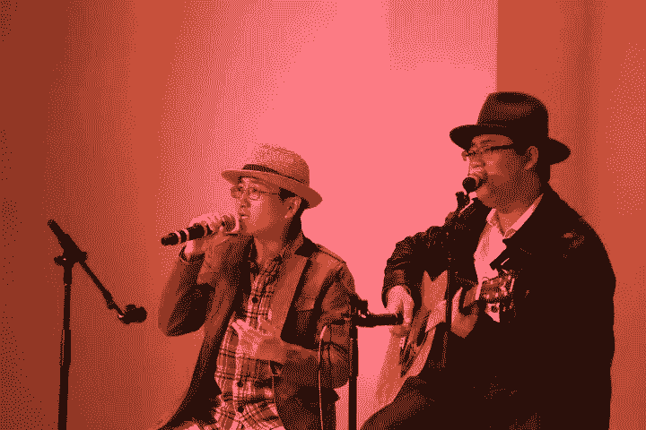
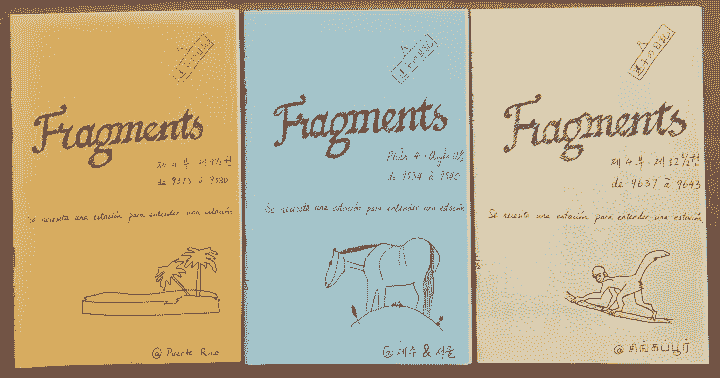
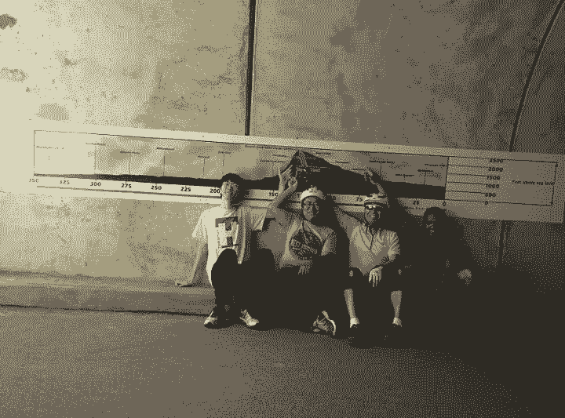
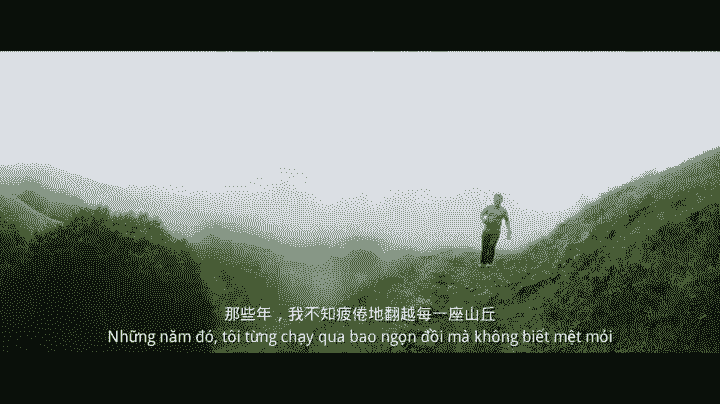

# 我的八年博士生涯——CMU 王赟写在入职 Facebook 之前

机器之心转载

**作者：****王赟 Maigo**

> CMU 王赟上个月博士毕业，在卡内基梅隆大学（CMU）语言技术研究所（LTI）经历了两年硕士、六年博士之后，他有话想说。

**学术篇**

下周一我就要开始在 Facebook 上班了。趁入职之前，我想写一写我博士生涯的感悟；再不写就要凉啦。

从 2010 年 8 月到 2018 年 10 月，我把我最好的青春年华都献给了卡内基梅隆大学（CMU）的语言技术研究所（LTI）。其中前两年是硕士，但由于 LTI 的硕士生活跟博士并没有太大区别，都要做研究，所以说是八年博士也并不过分吧。单从长度就能看出，我的博士生涯并不是一帆风顺的；之所以读了这么久，主要原因是换了两次研究项目。这三个研究项目，各自给了我不同的体验和感悟。

从入学到 2012 年春天，我跟随金琴教授研究说话人识别。在这将近两年的时间里，我用 Matlab 语言亲自实现了十几种语音特征的提取，以及基于 GMM、GMM-UBM、SVM、JFA 等技术的多种说话人识别系统。然而，我在这段时间里的研究进展十分缓慢，最终并没有追上当时的前沿；我的研究结果也并没能写成论文发表出来，而只是形成了一篇技术报告。这里面的原因，大概是因为我还没能从「学习者」的心态转换成「研究者」的心态。我总是想着把基础打扎实，从而在理解和复现已有的技术上花了太多的时间——2011 年的夏天，我曾经花了一个多星期来推导 JFA 里那些复杂的矩阵运算。在实验设计上，我也没能做到「抓大放小」，而是曾经拘泥于一些小细节，比如训练数据和测试数据的划分。这些原因，导致我还没来得及走到「创新」这一步，研究项目就结束了。

<mp-miniprogram class="miniprogram_element" data-miniprogram-appid="wxf424e2f3e2f94500" data-miniprogram-path="pages/technology/technology?id=5b4fcd3d-d8d2-451f-9793-c2aac880bb6b&amp;from=weapp" data-miniprogram-nickname="机器之心 Synced" data-miniprogram-avatar="http://mmbiz.qpic.cn/mmbiz_png/f3g058loLBj0Pib4UhuCFagffSB1RHImwskFzvic6mSp2LDhuerbXxeqqv0b63wSt2Pas7MicNWIcia358rlnhiaVag/640?wx_fmt=png&amp;wxfrom=200" data-miniprogram-title="说话人识别" data-miniprogram-imageurl="http://mmbiz.qpic.cn/mmbiz_jpg/KmXPKA19gWicIiaDNSktzJ9lNn22cqKlibXlbK5CueKWjyyZUf0uLibG9DS5oP6aoL9a7xq2SvtMSJyZUXep5sSQmQ/0?wx_fmt=jpeg"></mp-miniprogram>

金琴教授于 2012 年春天调到了中国人民大学，于是我就转到了同一个实验室的 Florian Metze 教授名下读博士。Florian 是一位高高胖胖的德国教授，在中文语境里，我通常称他为「花哥」。我在花哥手下做的第一个项目叫 Babel，其任务是在多种小语种语音里检索关键词。与之前的我一个人做的说话人识别项目不同，Babel 项目是由全美国乃至全世界许多大学和公司共同参与的。若干个大学或公司通过合作关系结成队伍，而队伍与队伍之间则是竞争关系。我在这个项目中的体验，与其说是像科研，不如说是像工作，因为项目前期的主要任务，是要先搭建出一个还能用的系统，之后才能在此基础上慢慢地创新。一个关键词检索系统通常由两个模块组成：前端模块是语音识别，负责给出多种可能的识别结果；后端模块是检索，负责在识别结果中搜索关键词并对其可靠性打分。我在这个项目中承担了很多工程性的工作：整个后端模块基本上都由我来维护；我还开发了一些可视化工具，用来分析系统犯的错误。但是，从科研的角度来讲，我的工作的科技含量并不高：检索模块使用的技术，说白了只是一个倒排索引而已。直到 2014 年，我们实验室才脱离纯工程性的开发，开始研究一些有科研价值的问题，比如如何更准确地给检索到的每个关键词的可靠性打分，以尽量减少漏报和误报；比如如何检索像专有名词这样词典里并没有的关键词。然而，2014 年 6 月，当我在韩国临津阁的观光队伍中排队的时候，我从 Facebook 上收到了实验室的同学发来的噩耗：由于 CMU 所在的队伍开发的系统在年度测评中表现不佳，我们的队伍被淘汰了。到此时为止，我只发出了一篇一作论文；另一篇一作论文在此后经历了五次拒稿，终于被我尘封。知乎上有一个这样的问题：博士第三年还没有发论文是一种怎样的体验？我想我是适合回答的，但终究没有勇气回答。

2014 年的下半年，算是我博士生涯的一段过渡期，这段时间我没有什么科研产出，而是把精力用在了给自己充电上。凭借着唯一的一篇一作论文，我参加了 2014 年 9 月在新加坡举行的 Interspeech 会议。在会上，我嗅到了深度学习正在崛起的信号。整个秋季学期，我阅读了会议上的近百篇论文，还在 Coursera 上学习了 Geoffrey Hinton 的深度学习课程。这让我的博士生涯柳暗花明又一村。

关于博士生涯最终的研究课题，花哥当时给了我三个选择。我已经不记得另外两个选择是什么了；我选择了「事件检测」，只是因为它有去 Facebook 实习的机会。我在 2015 年 1 月至 4 月在 Facebook 进行了一次实习，这也是我唯一一次实习。由于版权的限制，我在 Facebook 并没能使用 CMU 的数据真正进行「事件检测」的研究，而只是改进了 Facebook 原有的语音/噪音分辨系统。从科研上来说，这次实习只是我对深度学习的一次练手；但它让我在湾区交到了好多朋友，让我觉得湾区是个好地方，从而产生了去 Facebook 工作的理想。这个理想，现在就要实现了。

回到 CMU 以后，我才真正开始研究「事件检测」。在研究的初期，我对「事件」还没有明确的定义，既想检测比较底层的事件，比如猫叫、狗叫、开门、关门，又想检测比较高层的事件，比如球赛、婚礼、聚会等等。这些高层事件的检测，是当时 CMU 正在参与的另一个研究项目 Aladdin 的目标；直到 2016 年 Aladdin 项目渐渐收尾，我才把研究的焦点集中到底层事件的检测上来。之所以选择研究底层事件，是因为它们是检测高层事件的基础，在还检测不了底层事件时就去检测高层事件，步子就迈得有点儿太大了。而随着深度学习用于语音识别的最后一滴水渐渐被榨干，人们自然会开始尝试把深度学习用于别的东西的识别，底层事件检测的研究条件已经成熟了：在 2016 年 3 月的 ICASSP 会议上，芬兰 Tempere 理工大学的研究组与我同时发表了用深度学习做底层事件检测的论文。

2016 年，我的研究一直被一个困难所困扰，就是数据太少。我使用的数据，是实验室里的工作人员手工标注的，总共只有十几个小时，根本无法用于深度学习。2017 年 3 月，Google 发布了 Audio Set 数据集，它拯救了我的研究，让我毕业的事情终于有了眉目。Audio Set 这个数据集的特点首先就是「大」。它含有 200 万条长度为 10 秒的 YouTube 视频选段，我光是下载这些数据就用了整整一个月。这样的大数据，正适合深度学习。但 Audio Set 还有一个重要的特点，就是「弱标注」：它没有标注每一个事件的起止时间，而只标注了每段音频中的事件种类。这种标注，直接带火了一个研究领域——「弱标注下的音频事件检测」，这也几乎就是我的博士论文标题。从此，我的博士论文课题就明确了：争取在已有的、利用弱标注做事件检测的方法的基础上进行创新，做到比已有方法更好。

剩下的事情，就是与预期的博士毕业时间争分夺秒了。这段时间过得十分刺激。我原定于 2017 年 9 月博士开题，实际开题时间是 10 月 9 日，还算勉强赶上。今年 2、3 月的时候，我又一次钻进了一个细节的牛角尖（PyTorch 与 Theano 的性能差距），浪费了两个月的时间。到了 4 月份，我注意到英国 Surrey 大学的孔秋强同学已经做出了一种基于注意力机制的、利用弱标注做事件检测的新方法。这让我幡然醒悟，跳出牛角尖，回到研究的主线上来。我的论文中最重要的两章之一，就是比较了若干种利用弱标注做事件检测的方法的优劣，并深入剖析性能差距产生的原因。这一章是 2018 年 6 月底完成的，与计划的时间完全一致；而另一章的核心问题，则是 8 月 16 号在散步时才想出解决办法的。9 月，我一边继续跑着一点儿本该在 8 月就跑完的实验，一边撰写毕业论文的文本；而 10 月 5 号答辩用的幻灯片，则是 9 月 30 号才做完初稿的。这场赛跑，直到 10 月 26 日晚上，我把毕业论文最终定稿、把代码整理好才结束。而此时，距离我爸妈来美国看我已经只剩 5 天了。

纵览八年的博士生涯，不难发现，我由于自身及外界的各种因素，走了不少弯路。在三个研究项目中，只有最后一个，才有博士研究的样子。偶尔，我也会想：如果从一开始就做第三个项目就好了，这样我就可以在四年之内毕业了。但我不会沉浸在这种情绪中。正如吃完第三个包子饱了不代表前两个包子就白吃了一样，我并不觉得我在 CMU 的前四年是荒废了的。整整八年的学习，让我对语音识别、深度学习等各个领域的理论基础有了扎实的掌握。花哥开了一门语音识别课，其中说话人识别那一讲固定由我来讲，学生们纷纷反馈说我讲得比花哥清楚多了。同时，正是因为我涉猎过多个研究项目，我对与语音相关的多个研究领域都有了解并抱有兴趣。开学术会议的时候，我总能挑出许多想听的报告，马不停蹄地辗转于各个会场之间。而这种深度与广度，则是不付出时间不可兼得的。

**娱乐篇**

CMU LTI 网站上的学生名单，曾经列出了每个博士生的年级。有一届「CMU 好声音」的一张非官方宣传海报，就把一二年级新生和七八年级老博士的名单并列在一起，并配上了这样一句广告词：「Sing while you can」。一说起我博士读了八年，可能大多数人心里想到的第一个字就是「苦」。在漫长的博士生涯中，总会有实验不顺利、论文被拒等遭受挫折的时候；到了后期，也会常常为毕业而发愁。不过，认识我的人大概会知道，我的身上似乎从来没有散发出一种「苦」的气息，而是整天乐呵呵的。八年下来，我身边的朋友们换了一拨又一拨，有人戏称为「流水的 CMU，铁打的 Maigo」。我跟朋友们把匹兹堡以及美国东北地区玩得有滋有味，跟他们在一起，我很少感到寂寞。这些朋友又以硕士生居多，他们身上的朝气，让我保持了心理上的年轻。

我在匹兹堡的第一年，就加入了三个组织。第一个，是 CMU 的中国学生学者联谊会（CSSA）。CSSA 每年中秋的时候会举办一场才艺比赛，随着「中国好声音」的开播，这个比赛也改名为「CMU 好声音」；每年春节的时候，还会举办一场春节晚会。第一年的中秋，我就默默无闻地当了一个吃瓜观众。春晚征集节目的时候，我带着吉他去打了一次酱油，没想到我弹唱的《老男孩》获得了一致好评。我在春晚现场与韩吉鹏同学一同弹唱了这首《老男孩》，这让我一炮走红。我也顺势加入了 CSSA，担任网管；不过我更重要的角色，就是每年春晚的固定演员了。我也参加过几届 CMU 好声音，其中跟 @Gus 夏 合作的《The Sound of Silence》受到了最多的欢迎。

*《The Sound of Silence》表演现场*

第二个组织，叫做 Pittsburgh pLayboycLub。这是 CMU 和隔壁匹大的几个学生组建的，最初就是打打狼人杀之类的桌游。那时候狼人杀还没有发展出那么多术语和套路，一群小白在一起玩还是挺有意思的。除了狼人杀，我们后来还在一起做饭、滑冰、逛博物馆，还坐灰狗巴士去华盛顿看了樱花。我的知乎头像，就是在华盛顿看樱花时拍的。后来，组织中的男生和女生两两结成了对，活动就渐渐减少了；而我因为当时在国内还有一个女朋友，就成了剩下的那一个。

第三个组织，是 Carnegie Library of Pittsburgh（我一般称这个图书馆为「恐龙图书馆」，因为馆门口有一架恐龙雕塑）的日语角。日语角每两周活动一次，参加者有日本人，也有像我这样学习日语的外国人。我在这里找回了在清华参加日语角的感觉。恐龙图书馆有英、西、法、德、意、俄、日、汉等多种语言角（对，还有汉语角！）。除了日语角以外，我还曾在西语角和法语角跟外国人谈笑风生。

2012 年「世界末日」的时候，我在一位小伙伴的号召下，跟他一起去欧洲旅了一次游。这是我到当时为止少有的纯粹的（即没有比赛或者学术会议等目的的）出国旅游。我们在西班牙和意大利各呆了一周时间，玩了巴塞罗那、马德里、罗马、佛罗伦萨四个城市。这次旅游点燃了我出国旅游的兴趣。在后来的几年里，我跟小伙伴们一起或者独自访问了波多黎各、韩国、新加坡、夏威夷、坎昆、阿根廷等地（嘛，虽然有些并不算出国）。最初几次旅游，我都给世界各地的朋友们寄了明信片，最多的一次是在韩国寄了 38 张。起初，我还坚持每天（用当地语言）写日记，到最后终于坚持不下去了。想到写出来的日记也没有人看，我转而开始写游记，这篇坎昆游记我觉得写得还是不错哒。

*我在波多黎各、韩国、新加坡写的日记*

2013 年夏天，我认识了我在美国最神奇的一位朋友——韩国大叔 Jason。Jason 大约应该是个 65 后，然而至今未婚；他的职业是码农，但跟我一样爱好广泛。我跟 Jason 相识就是在恐龙图书馆的日语角，除了日语以外，他还喜欢骑车、保龄球、网球、滑雪等多种运动，以及做饭、唱歌和旅游。这些项目，除了网球以外，也都是我喜欢甚至擅长的，我俩很快就打成了一片。Jason 还有很广的朋友圈。他在来匹兹堡之前，还曾经在德州的奥斯汀和弗吉尼亚州北部华盛顿附近住过。不管在哪里，只要他一在 meetup.com 上组织活动，总能一呼百应。这些朋友来自世界各地，年龄也从 20 岁到 70 岁不等，单是跟他们聊天，都很长见识。我在 CMU 的中国学生中，可以算是跟非中国人交往较多的了；其中很大一部分，都来自 Jason 的朋友圈。

我从 2013 年秋天起，跟 Jason 和朋友们一起在匹兹堡的多条自行车小路上骑车。此前，我在匹兹堡骑过的最远距离是 34 英里，这是从松鼠山往返北公园（那里也有樱花）的距离。跟 Jason 在一起，我开始挑战更远的距离，用了一年多的时间，达到了一天之内骑 80 英里的水平。2015 年 5 月，我跟 Jason、室友 @ 钟音 和一个印度小哥挑战了从华盛顿到匹兹堡的整条自行车道，全长约 335 英里，我们用了四天时间挑战成功。骑这条自行车道，成了我一年一度的保留项目；而 Jason 则可能一年骑多次，甚至在 2016 年用 9 天时间骑了一次往返。

*初次挑战全程，在「山顶洞」合影留念*

Jason 在 2017 年初因为工作变动，又搬回了弗吉尼亚州。不过他的各种活动，依然在匹兹堡延续。我跟朋友们在匹兹堡依然每周打一次保龄球；我还曾经带着许多 CMU 的小伙伴去弗吉尼亚州北部的韩国城大快朵颐。这个月初，我带爸妈在美国东北部旅游的时候，请 Jason 吃了一顿晚饭。我爸妈说，很感谢 Jason 带我探索了许多新玩法，大大开阔了我的眼界。

我跟我的妹子 @ 机器熊 的缘分，就开始于 2017 年 4 月一同去韩国城游玩。她跟我一样享受「读万卷书，行万里路」的体验。我们一起坐灰狗巴士去过纽约，还曾驾车穿越过死亡谷的沙漠；更厉害的是，她在仅仅训练了一个多月之后，就跟我一起骑车从匹兹堡到了华盛顿。我在匹兹堡的最后两年，我们常常跟一群以数学系博士生为主的小伙伴们一起玩。这群小伙伴里有一位野营达人，我们跟着他又开发了不少新去处。

我现在搬到湾区来了，在这里我永远不会缺朋友。跟我同时期入学 CMU 的硕士生们，有许多都在这里工作了，甚至还有许多清华校友也在这里。2015 年春天，我在 Facebook 实习的时候，还参加了一个「周日早起登山」群，又认识了不少人。等到 12 月，我在湾区这边安顿下来之后，就又可以约起来啦！

*周日早起登山*

我在跟妹子交流人生的时候，曾经说出过这样一段「名言」。我说，博士生涯（乃至整个人生），就像是在波涛汹涌的大海上航行。大海的基调是悲苦的，但我们却是在一条游轮上。我们的角色，既是掌舵人，又是乘客。固然，在关键的时刻，我们需要掌控游轮的航向，直面汹涌的波涛；但在平时，我们不妨就做一名乘客，在平稳的甲板上悠闲地晒晒太阳，不必担心船底下的海浪。正是这样的一种乐观的心态，支撑着我度过了精彩的八年博士时光。********

*原文链接：*

*https://zhuanlan.zhihu.com/p/50597445*

*https://zhuanlan.zhihu.com/p/50667670*

点击阅读原文，进入大赛官网报名参与 JDD-2018 京东数字科技全球探索者大赛。

