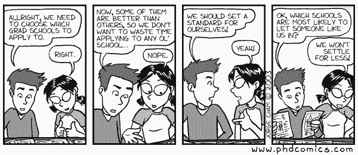

# 我收到了斯坦福、UCL、CMU、NYU、UW 的博士 offer，这是我的经验

选自 timdettmers.com

**机器之心编译**

**作者：****Tim Dettmers**

**机器之心编辑部** 

> Tim Dettmers 曾经花了很长时间研究如何申请读博，好在努力收到了回报：他收到了斯坦福大学、华盛顿大学、伦敦大学学院、卡内基梅隆大学以及纽约大学的录取通知，他目前已经在华盛顿大学读博。这篇博客总结了如何一步一步进行博士申请，告诉你哪些重要、哪些不重要。文中讨论了目的陈述（SoP）等申请材料以及如何让这些申请材料发挥应有的作用。

本文主要讨论深度学习及自然语言处理、计算机视觉、强化学习及其他深度学习子领域的博士申请。作者默认你已经具备较强的学术背景，即可能已有一篇或多篇论文发表，与多位研究人员合作过等。本博文旨在帮助你提升申请名校博士项目的机会。

本博文将首先指出 PhD 申请中重要的东西，然后介绍申请材料以及如何看待这些材料，然后简要谈谈申请过程。主体的最后一部分围绕择校展开——哪些学校对于我来说太好或太不好？结尾处选摘 Twitter 的问答。这份 Twitter 问答将定期更新，读者可前去提问。

Twitter 问答地址：https://twitter.com/Tim_Dettmers/status/1064258559918002176

*PhD Comics，图源：http://phdcomics.com/comics/archive.php?comicid=368*

**一份优秀的 PhD 申请包括哪些内容？** 

研究型大学录取学生最看重科研潜力：你有多大几率成为一名优秀的研究人员？

这方面的主要直接因素按重要顺序排列如下：

1.  推荐信：德高望重的教授对你评价很高。人脉非常重要。

2.  研究经历：之前做过成功的研究。这方面的指标包括发表的论文、是否为一作、发表论文的会议知名度。

其他间接因素如果非常突出也会有所帮助，但通常情况下，只有前两个因素——推荐信和研究经历可以帮到你。其他因素按重要程度排序如下：

1.  本科学校：有些学校非常看重这个，其他学校不是很 care。

2.  工作经历：有些学生之前可能在金融行业工作或受雇于谷歌、Facebook 等公司。

3.  聪明才智：完美的 GPA、GRE 等或多或少与智力挂钩（或者至少可以说明你学习、理解速度快）。

4.  毅力：你在遭受连续挫折、拒绝时也能振作起来。如果你曾经面临或克服过困难，可以将你的故事写进目的陈述中。

5.  成就：在数学或 CS 比赛中拿过奖。

6.  认可：拿过有分量的奖学金/担任有声望的组织的会员。

7.  擅长数学或工程：开发或贡献过开源项目。写过研究代码。

8.  家族传承：父母是教授。

**关于申请材料**

**推荐信**

推荐信可以分为四个类别：强（Strong）、好（Good）、弱（Weak）和坏（Bad）。请注意，录取委员会在推荐信中寻找的主要内容是研究潜力的指标。本部分的主要目的是让你了解什么是好或强的推荐信，根据这些信息，或许能更容易选择推荐信作者。

*   **坏推荐信的特征**

*   推荐者了解你，并写下关于你的坏事。

*   推荐者不了解你（你学过 Ta 的课程，但 Ta 对你没印象）。

*   推荐信太短，仅仅说了你在课堂上表现良好。

*   **弱推荐信的特征**

*   推荐者仅通过课堂了解你。

*   推荐者较合适，但仅能写关于你课程成绩方面的事情：在课堂上做了很好的项目工作；在课堂上讨论活跃。

*   推荐者并没有对你的研究作出评论。

*   推荐者不为录取委员会所知，也不为潜在导师所知。

*   **好推荐信的特征**

*   录取委员会中有人知道推荐信作者。

*   目的陈述中提到的导师中至少有一位知道推荐者的名字和工作。

*   推荐者和你共同合作过研究项目。

*   推荐者在具体事例中赞扬你杰出的研究能力，展示你的创造力、责任心、意志力和研究技能。

*   推荐者写了你如何发表研究的过程。

*   推荐者对你不在其实验室做的研究做了评论。

*   **强推荐信的特征**

*   美式推荐信：成就渗透在论文中。

*   推荐者的英语水平很好。

*   目的陈述中提到的导师中至少有一位知道推荐者。

*   推荐者曾经做过很好的推荐（以前推荐过很优秀的学生）。

*   推荐者在轶事中赞扬你的杰出研究能力，展示你的创造力、责任心、意志力和研究技能。

*   推荐者提及你间接帮助研究的能力（工程技能、陈述技能、人际能力）并写在轶事中。

*   推荐者对你不在其实验室做的研究做了评论。

请注意以下几点：

*   轶事很重要，因为这表明推荐者真的很了解你。它们的可读性也更强，故事比清单更有趣。

*   推荐信不需要包含这里列出的所有项，推荐信是很复杂的。

*   选择推荐信的时候，选择强调不同优点的推荐信是有意义的。一篇关于研究技巧的强推荐信，关于工程技能的好推荐信（实习），以及关于课堂/项目工作表现的好推荐信是很棒的组合。这样的组合优于一封关于研究的强推荐信、一封关于研究的好推荐信，以及一篇关于研究的弱推荐信。

*   请参阅以下有关请求推荐信的过程，了解更多详细信息。

**关于论文发表** 

*   **论文作者的位置**

发表的论文是研究经验和研究技能的直接证据。如果你以一作发表论文，人们将知道你做了大部分工作。如果你以二作发表论文，人们将知道你做了较多的工作（25%-50%）。如果你的名字是第三个或之后，你的贡献将大打折扣，但你可能经历了整个研究过程，并获得了大量的研究经验。如果你发表了多篇一作论文、一篇三作论文也很不错：这意味着你具备团队合作能力。

*   **论文发表平台的知名度**

如果你在知名的学术会议上发表了论文，人们将知道：（1）你的研究质量高；（2）你的研究是可信的；（3）你目前的研究技能足够在重要学术会议上发表论文；（4）你是有竞争力的，你可以在发表顶会论文的压力下保持生产力。

从潜在导师的角度考虑会有帮助：如果你有两个学生，一个已经发表了 NeurIPS 论文（A 类），一个发表了 B 类会议的论文。你将知道第一个学生可能已经在准备明年发表到 NeurIPS 的研究项目。第二个学生可能需要更多的准备，例如在发表 NeurIPS 论文前，先在一个 workshop 或至少是有竞争力的 A 类会议上发表论文。他/她有可能需要超过一年的时间来获取在 A 类会议发表论文的必要研究技能。

将学生推向 NeurIPS 可能会给导师带来很大压力，并且与已具备必要研究技能的人合作更容易。如果导师和学生之间的压力较小，那么就更容易建立强大的专业关系，这使得彼此间的合作变得更容易、更有趣。因此，潜在导师有充分的理由根据你发布论文的会议知名度进行选择。

*   **创造力、论文被引用次数等**

其它指标对申请影响不大。你的工作可能异常富有创意，但如果没有成就记录可以证明你是一名富有创造力的研究人员，那么别人可能会觉得你只是很幸运。

发表论文的重要性通常要几年后才会显现。如果你在博士申请之前不久发表论文，这意味着你的论文被引用次数不会太高。如果你的论文在短时间内被引用多次，这可能有所帮助，但这也许是运气使然，又或者是你擅长标记（marking）。通常，过去 1-3 年的论文被引用次数不能作为衡量你研究潜力的可靠指标，因此不予考虑。如果你有过去 5 年论文被引用次数的记录，这可能很不一样，但这并不适用于大部分申请人。

**关于目的陈述（SoP）**

对于大多数学校和机构而言，目的陈述主要用于刷掉那些不花时间打磨它的人。写作可以展示你的思考方式、你如何推荐自己的工作、如何解释事物，但它也可以显示出你懒惰、不注重细节。它还能说明你不会通过搜索范例来编写正式的文档。对于某些机构来说，SoP 很重要（例如 CMU），但 SoP 的内容对这些机构来说并没有多重要。

除了正式性之外，SoP 也是唯一可以陈述你在某些情况下表现不佳的理由的文件。例如，你可以解释读研究生过程中遇到的任何艰难困苦，或者解释为什么你在大学的某个学期/季度做得不太好。SoP 的结构应如下：

1.  用引人注目的一段话介绍研究兴趣，使读者想要继续阅读。这是最重要的一点：如果你无法在这一段勾起读者兴趣，他们不太可能继续读下去。

2.  你在研究生学习期间的研究经历（大约一页）。

3.  确定将来要做什么研究。

4.  确定你想合作的人以及原因。

5.  （可选）在适当的情况下解释情有可原的情况。

在某些情况下，SoP 非常重要。比如你表现出「自己有良好的学术潜力（不强不弱刚刚好），但必须克服巨大的困难才能做研究」。如果你认为自己的学术潜力很强并且写下了你的困难，读你申请的人可能不会选你（privileged prick）；如果你的学术潜力很弱，读你申请的人也可能不会选你（爱抱怨的 loser）。如果你表述中认为自己的学术潜力适度，那就比较合适了（一个能够克服困难的聪明人）。例如，你的某项条件非常特殊，与入学条件不符，这时 SoP 对于解释你在这些情况下遇到的困难非常重要。

然而，披露苦难和弱点（如学习障碍和精神疾病）也可能是一把双刃剑：读你申请的人可能不会选你，也可能因为这些克服困难的经历而对你抱以同情和钦佩。如果你披露此类事实，则你的 SoP 需要非常精细化。如果你没有专业作者的反馈，请不要尝试这样做。对于一些社会上可以接受的故事，就不需要专业的反馈：从极度贫困到上大学，现在你想通过博士学位来发挥自己的潜力，这样就很容易写出一个令人信服的故事；讲述在患精神分裂症或躁郁症时遇到的困难就很难令人信服。

然而，如果你没有遇到任何困境，不要编造无关痛痒或做作的故事：「作为一名上流社会的白人男性美国公民，我从很小的时候就被我的特权所困扰，并且在这个过程中我的学业表现受到了影响。」你应该集中表述你的研究经验。

**关于 GRE、TOEFL、GPA**

GRE、托福考试和 GPA 通常作为筛选标准。很高的 GPA 是「智力」的良好证明，可以在推荐信和发表论文与别人相似的情况下锦上添花。但是如果 GPA 4.0，但没有发表过论文且没有好的推荐信，那么绩点再高也帮不了你，因为别人会觉得你只顾着上无用的课而不专注于科研。GRE 和托福成绩就只是筛选条件：分数可以就不会被筛掉。如果你 GRE 成绩特别好，那么它也会有点帮助，但作用远远小于漂亮的 GPA 成绩。GRE 成绩很好并没有太大影响：我被美国 top 5 计算机科学专业中的三个录取，我的 GRE 成绩 verbal 159（81％）、quantitative 163（86％）、写作 5.0（93％），托福 120/120 和 GPA 8.1/10。GPA 高于 3.5 很好，但高出多少没多大影响。不过 GPA 4.0 可能会有所帮助。

**关于 CV**

CV 应该列举你做过的事情，通常没有什么惊喜。履历的内容很重要，不过这取决于你之前做过什么，是无法改变的。不要试图用润色词藻或表达方式来修改 CV，这是浪费时间。只需列出你做过什么即可。

**申请流程**

*   **如何让教授给你写推荐信？**

你需要写两封邮件：（1）询问对方是否可以给你写一封不错的推荐信。有经验的人可能会拒绝你的请求，如果他们觉得自己无法提供好的推荐信。如果被拒了，那么问一下别人。（2）如果对方同意了，Ta 会问你推荐信要包含哪些信息。你需要向对方提供一份清单，列出你所做过的事情，写的时候尽量按照容易包装成事例的方式去写。

建议写：「在一次会议上您告诉我，再做一些工作我们就可以向 NeurIPS 投稿。接下来两周，我改进了深度网络架构，并开始写研究成果。然后 Jane 扩展了我的代码去执行了额外的任务。然后我们就有了足够的实验结果可以把研究成果提交给 NeurIPS 大会。」

不要写：「我和 Jane 在 NeurIPS 会议上发表了我们的研究。」

事例也可以来自与博士和博士后的互动：

「我和 Tom 一起开发了这个研究库，作为我们在 NeurIPS 会议上发表研究的主要框架。这个库我做了一个星期，之后 Tom 告诉我，库设计得不错，执行效果也很好。」

之后你的导师会向那个学生了解更多信息，然后按下面的方式写这件事：

「我的博士生 Tom 是一个工程能力很强的学生，他曾和 Jane 合作一个研究项目，在开始研究之前我们需要先开发一个语言建模代码库。Tom 把这个任务交给了 Jane，预计三周内完成，但是 Jane 一周就完成了。Tom 告诉我，他检查了代码后发现 Jane 的工程能力与他齐平甚至超过他，代码质量非常高，且执行速度快。Jane 的工程技能帮助该研究快速进行，因此该研究项目的进展非常顺利。Jane 将研究成果发表在了 NeurIPS 2020 大会上……」

如果你有三封推荐信都在「好」这一级甚至之上，你应该考虑让这些推荐信更多样化。拿我自己举例，我用了一篇学界推荐信、一篇工业实验室推荐信，还有一篇推荐信来自了解我的研究的老师。

*   **目的陈述**

早点开始，咨询有经验的人。如果你按照上述方法行事你应该是安全的。如果你想展示研究生时期的困难，你需要在 SoP 上花很多时间，可能 SoP 会是所有申请材料里需要花费时间最多的。

尝试在给不同大学的 SoP 中使用类似的内容。如果给每一所申请学校都「定制」SoP，会花费很多时间。我给不同学校的 SoP 中只有一章有变化，就是关于我想跟的导师那部分。

*   **在线申请**

尽早开始填写在线申请表。有的申请表非常恐怖，填写需要很多时间。尽早完成这些，你就可以集中精力对付推荐信、择校和 SoP 了。准备好钱。整个流程需要花多达 1000 美元。如果没有这么多钱，可以向亲戚朋友寻求帮助。

**如何选择合适的学校？** 

*   **怎么才能进名校？** 

许多读者可能都梦想能进斯坦福、MIT、伯克利、CMU 等名校，但这条路很难走。一些项目的竞争非常激烈。以下是我被录取的一所名校的录取统计数据，以及符合特定要求的申请者比例：

*   本科学校排名 Top 2：38%

*   Top 4：52%

*   Top 20: 73%

*   各个国家的顶级学府：84%

*   来自 top 3 学校的硕士：89%

*   至少 4 篇顶会论文：93%

*   至少 3 篇顶会论文+最佳教师/年轻科学家奖：98%

数据解读：每一个要求后面的百分数指符合该要求的申请者的比例。如 84% 的申请者本科阶段就读于某个国家的顶级学府/排名前 20/排名前 4/排名前 2 的学校。注意，本科就读于名校的申请者通常都会有论文发表，也有很有分量的推荐信。因此，如果你的本科学校不在前 20，即不是你们国家最好的学校，而你的顶会论文又少于 3 篇，那么你被这所学校录取的概率只有 2% 左右。

*   **如何被名校录取？**

这些统计数据并不代表你就不会被这些学校录取，而是说如果你的资历不够，就需要再花一年来巩固自己的实力。以我个人为例，我在硕士阶段延期一年去当研究实习生。如果没有这一年，我不可能被这些学校录取。如果你的梦想是被这些学校录取，那么这么做是最好的选择。即使你不想进入名校，做研究实习生的经历也是很有帮助的，比如：

*   科研能力提高，开始读博时会轻松一些。

*   检验某个 PhD 项目或研究方向（NLP vs 计算机视觉 vs 系统）是否适合你。

*   一份良好甚至突出的推荐信（实习时间越长越好）。

*   可能会发表论文。

*   **择校**

你应该申请大约 10-15 所学校。再多的话，你可能没有足够的时间打磨申请书。过少的话，可能出现没有被任何一所申请学校接收的风险。

你应该有一两所保底学校（被接收的概率大于 75%）。通常你就读过的学校可以作为不错的保底学校，因为给你写推荐信的人在这所学校应该是比较出名的。申请你被接收的概率大于 10% 的所有顶级学校。其他的学校选择那些录取率较好的学校（25-33%），你应该至少申请 3 所此类学校。这类学校通常是给你写推荐信的人与你想学习的导师有个人关系的学校。

注意，最好的导师通常不在顶级学校。在 top 20 以外的学校也能得到很好的 PhD 训练。但是，如果你考虑在学界工作，那么学校排名非常重要，你应该尽量找顶级学校的导师。

择校主要依据潜在导师。确保每所大学都有不止一个你想一起工作的导师。不要申请那些只有一个好导师的学校。如果你的导师列表很短，那么扩展自己的兴趣。例如，如果你想做深度学习和 NLP，但没有太多合适的导师，可以考虑计算机视觉或其他领域的导师。

**常见 Q&A** 

**4 年的英国 PhD VS 6 年的美国 PhD**

美国的 PhD 头两年要上很多课，因为美国的 PhD 主要是为本科毕业生开设的；相反，英国的 PhD 是为已经读了一年硕士的人开设的，所以读博以后课不多。因此如果在英国念 PhD，你可以立即做研究。这算是一个不错的优势。

<美国 PhD>

*   为本科生开设；

*   需要上 1-2 年的课，课程会分散研究注意力；

*   获得入学资助是有保证的，即，通常能获得研究助理或助教的职位。

<英国 PhD>

*   为硕士生开设；

*   上 3-6 个月的课，从始至终都可以把注意力放在研究上；

*   资助可能是一个问题，通常要取决于导师。因此申请博士之前就联系潜在导师非常重要；

*   （多数情况下）声望较低，因此毕业后获得学术职位更难。由于明显的偏见，更难获得 oral 论文展示的机会或最佳论文奖项；

*   与美国的研究可能会有点脱节。美国人可能会忽略你的研究，即使你做的不错。

**拥有硕士学位是不是申请博士学位的前提？**

在欧洲，读本科通常需要花三年时间，你需要获得硕士学位才能开始攻读博士。而在美国和英国，读本科通常需要花四年，你可以在读完本科后马上读博。

**工作经验重要吗？**

如果你曾在某些知名机构（如谷歌、Facebook、麦肯锡、高盛等）工作，工作经验会比较有帮助。其他与软件工程相关的工作经验也有用，但研究经验（研究实习）更加重要。如果只有不错的工作经验而没有研究经验，那工作经验对你的申请并没有什么帮助。

**如何选择导师？**

查看最近的论文，寻找研究领域与自己的兴趣重合的人。不要选那些近期没有发表论文的人当导师。你不需要重复当前的研究，但你应该对导师正在做的研究感兴趣。

查一查潜在导师手下的毕业学生清单，看看这些人现在在哪。如果找不到其带出来的毕业生，那这是一个危险的信号（也可能这是一个新老师）。这是一个不错的指标，可以用来衡量你将来可能获得的指导与训练究竟有没有含金量。

导师名下是否有创业公司？带了多少学生？综合这些指标可以估计导师能在你身上花多少时间。然后根据你的研究经验判断自己需要的是一个时间较多还是较少的导师。

同一个系里是否有后备选项？有时候你和导师关系不太好的话，需要第二个导师作为备选来保护自己。

**到底该不该读博？**

如果以后想在学界工作，你就需要读博。

而在业界，一切由供求来调节。AI 研究员的供应将在未来几年急剧增加。如果 AI 炒作降温，需求将会减少。这种情况可能与数据科学家 2018 年面对的境况非常相似：公司只接收合格的申请者，因为供远远大于求。在这种情况下，如果你想换工作或者升职，有没有 PhD 学位差别会很大。现在可能没有 PhD 也会被雇佣，但如果你想转到另一个研究实验室可能就困难重重了，因为技能娴熟的博士很多，需求却很少。

如果 AI 炒作没有降温（不太可能），那你就算没有 PhD 也可以轻易地找工作、换工作。但需要注意的是，升职可能对你来说还是会更困难一点；而且，相比研究，你可能需要做更多的「研究工程工作」。如果你对研究工程师的职位很满意，那 PhD 对你来说可能没用。

不要仅仅为了上述理由去读博。如果你不想做研究，就不要读博。

**是否要在申请之前联系导师？**

对于美国的教授，不要这么做。如果申请欧洲的学校，有时候要在申请之前联系潜在导师。如果需要，最好由一个与你导师有私交的人引荐，比如你的本科或硕士论文导师。如果你不认识这种中间人，可以给导师写邮件，内容包括：

*   现任导师

*   一句话概括你过去的工作（比如，在哪里发表过研究）

*   你和导师可以一起做的潜在研究的四个要点，最好以「要点：一句话解释要点」的形式。

如果没有私人联系，你的潜在导师不太可能会查看或者回复你的邮件。如果没有私人联系且申请的是欧洲的大学，那你可以考虑换地方了。

**如何为你的研究计划选择一个主题？**

其实，研究的主题无关紧要。没有人会一板一眼地要求你去做研究计划中描述的工作。你可以根据研究主题的难易程度在不同的申请中重复使用研究主题。如果不需要在不同的申请中重写这部分内容，你就可以节省大量时间。注意：你对一个方向越熟悉，越容易想出好的研究主题。

如果想了解关于 PhD 录取的更多信息，推荐阅读：

*   Academia StackExchange 的热门问答。

*   地址：https://academia.stackexchange.com/questions?sort=votes。

*   《Applying to Ph.D. Programs in Computer Science》，这份材料详细讲述了博士录取的整个过程，由 CMU 的教师进行审阅。

*   地址：http://www.cs.cmu.edu/~harchol/gradschooltalk.pdf

*   《Reflecting on CS Graduate Admissions》，优秀但不是特别突出的申请者可以参考这份简洁的博文，也是由 CMU 的教师审阅过的。

*   地址：https://da-data.blogspot.com/2015/03/reflecting-on-cs-graduate-admissions.html

*   《How to Write a Bad Statement for a Computer Science Ph.D. Admissions Application》，这篇没那么有用，但可以快速浏览一下。

*   地址：http://www.cs.cmu.edu/~pavlo/blog/2015/10/how-to-write-a-bad-statement-for-a-computer-science-phd-admissions-application.html ********

*原文链接：http://timdettmers.com/2018/11/26/phd-applications/*

