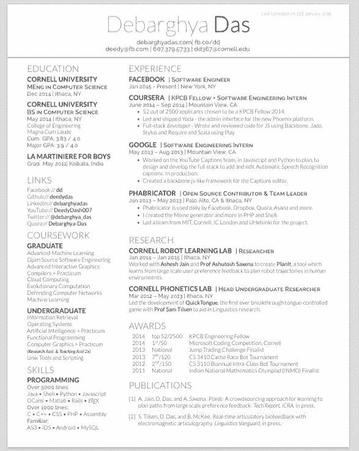
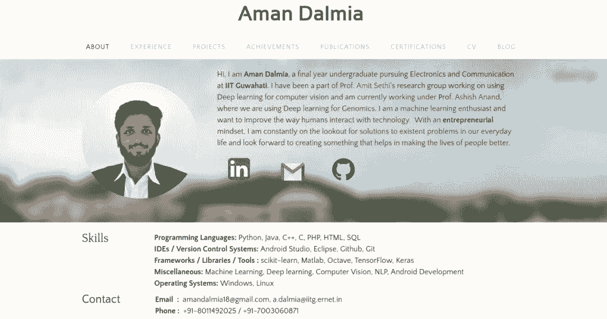

# 从构建关系网到面试最后一问，这是一份 AI 公司应聘全面指南

选自 Medium

**作者：****Aman Dalmia**

**机器之心编译**

> 对于毕业生来说，面试是进入社会的一个重要历程。本文中，Aman Dalmia 介绍了面向广大 AI 公司应聘的各种注意事项，包括如何制作简历、GitHub 和领英资料、构建人际关系网、面试细节以及背景知识等等。机器之心对此文进行了编译介绍。

过去 8 个月里，我参加了谷歌 DeepMind、Wadhwani 人工智能研究所、微软、Ola、Fractal Analytics 等多家公司的面试，应聘数据科学家、软件工程师和研究工程师等职位。在这个过程中，我不仅有机会与许多厉害的人物打交道，还能审视自己，了解面试官在面试过程中真正想要什么。我相信，如果我以前有这方面的知识，就可以避免许多错误，并以更好的方式做好准备，这也是我撰写此文的动机，希望本文能够帮助别人找到理想的工作。

> 毕竟，如果人生（至少）三分之二的时间都在工作，那么最好找一份值得的吧。

本文的灵感源于我和一个三年级学生的讨论，他认为从事 AI 的人很难通过校园招聘找到满意的工作机会。此外，我在为面试做准备的时候，发现人们使用了大量资源，但根据过去几个月的经验，我认为对于大多数 AI 从业人员，很多基本资源都是不必要的，文末列出了所需资源的最简清单。本文首先介绍如何在面试中引起注意，然后我提供了一份可以申请的企业和初创公司名单，接着是如何在面试中取得成功。我根据个人经验，增加了一个我们应该为何努力工作的部分。最后是准备工作所需的最少资源。

注意：对于那些在等校园招聘的人，我想补充两点。首先，我要说的大部分内容（可能除了最后一点）都与你无关。但是，第二点是，正如我之前提到过的，校园招聘的工作机会大多是软件工程岗，与人工智能没有交集。所以，这篇文章是专门为那些想利用人工智能解决有趣问题的人写的。此外，我还想补充一点，我并没有通过所有面试，但我想这就是失败的意义——它是最伟大的老师！本文提到的事情可能并非全都有用，但这些都是我的经验，我不知道还有什么办法能让它变得更有说服力。

**1\. 如何在面试中引起注意**

老实说，这一步最重要。让社会招聘变得如此艰难和疲惫的原因是如何让招聘人员在收到的众多申请中仔细查看你的个人资料。与公司内部人员建立联系可以让你很容易地获得推荐，但一般而言，这一步可细分为三个关键步骤：

1）做好监管准备：即准备好领英档案、Github 档案、个人网站以及一份精心打造的简历等材料。首先，你的简历应该非常整洁和精炼。可以根据 Resume Revamp（https://career-resource-center.udacity.com/resume/resume-revamp）来规划简历，它包含我想说的所有有关简历的内容，我自己也一直用它作为参考。至于简历模板，Overleaf 上提供的一些格式很不错。我个人使用 deedy-resume（https://www.overleaf.com/），以下是预览：

如上图所示，一页可以有很多内容。但是，如果你要写的内容不止于此，那么上述格式的直接效果不会太好。你可以在这里找到多页格式：https://latexresu.me/。下一个要点是你的 GitHub 资料。很多人仅仅因为它不像 LinkedIn 那样具备「谁看过你的资料」选项，而低估了它的重要性。人们真的会看你的 GitHub，因为这是验证你 CV 中提及项目的唯一方式，鉴于人们现在在自己的职业资料中添加了很多与各种流行词相关的噪声。尤其是对于数据科学来说，开源意味着把使用的很多工具、实现的不同算法、各种学习资源都开放出来了。我在之前的文章里（https://medium.com/@amandalmia18/the-world-of-open-source-8f516c674647）谈过开源的益处和如何从头开始创建自己的 GitHub。最低要求是：

*   创建一个 GitHub 账号；

*   为自己做过的项目创建一个 repo；

*   添加关于如何运行代码的清晰文档说明；

*   为每个提及函数作用、参数意义、格式和脚本的单个文件添加说明文档。

第三步是大部分人缺少的，即在招聘网站上展示自己的经历和个人项目。制作个人职业资料表示你非常严肃地考虑进入某领域，在真实性上加了很多分。此外，履历（CV）通常会有空间限制，可能会缺失一些重要细节。你可以在个人职业资料中深入介绍这些细节，推荐对项目／思路进行某种形式的可视化或其他展示。创建一份职业资料非常简单，有很多免费平台，通过拖放功能就可以实现这一过程。我个人使用 Weebly，这是个广泛使用的工具。开头有 reference 更好。有很多不错的例子，不过我参考了 Deshraj Yadav 的个人网站，制作了我自己的（http://amandalmia.weebly.com/）：

最后，很多招聘者和创业公司开始使用领英作为招聘平台。领英上有大量好工作。除了招聘者之外，担任有影响力职务的人在领英上也很活跃。因此，如果你可以吸引他们的注意力，你就有机会进入面试。此外，维护个人资料也是必要的，这样人们更有意愿与你联系。领英的一个重要部分是搜索工具，如果你想被看到，那么你的资料中必须有相关关键词。我更改了很多次，进行了多次评估，才有了一份不错的个人资料。你还应该请同事或领导为你的技能背书、写推荐语。所有这些都会提高你被注意到的几率。领英和 Github 个人资料指南，可参考：https://career-resource-center.udacity.com/linkedin-github-profiles。

这看起来太多了，但是记住，你不必要一天内或者一周、一个月内完成。这是一个过程，一个不会结束的过程。起初设置好一切肯定需要你付出精力和时间，但是一旦完成，你就只需要定期更新条目就可以了，这种方法不仅容易，而且还可以随时随地谈论自己，不用刻意准备，因为你对自己已经有了清晰的认知。

b）确保真实性：我见过很多人犯下这样的错误，他们的个人资料出现在多个不同的职位之外。我认为，更好的做法是先确定自己真正感兴趣、乐意做的事情，再寻找相关机会，而不是反过来。AI 人才供不应求的现状给你提供了机会。花一些时间按上述做法定期更新资料能够使你对自己有一个全面的认知，帮助你及早确定方向。此外，你无需对面试中可能被问的不同问题准备答案。大部分答案在你谈论自己真正热爱的事情时会自然而然地出现。

c）人际关系网：完成 a 和 b 之后，人际关系网将真正帮助你达到目的。如果你不和别人沟通，那么你可能错过很多好机会。每天联系新的人是很重要的，如果不能面见，那就在领英上沟通，这样过些时候，你就拥有了强大的大型人际网络。

人际关系不是联系别人为你写推荐信。我最初经常犯这个错误，直到读了 Mark Meloon《Climbing the Relationship Ladder to Get a Data Science Job》一文（https://www.markmeloon.com/climbing-relationship-ladder-get-data-science-job/），他在这篇文章中谈论了通过率先提供帮助来构建真实联系的重要性。构建人际关系过程中另一个重要的步骤是展示自己。比如，如果你擅长某事，在博客中写出来，然后在 Facebook 和 LinkedIn 上分享这篇博客。这样不仅能够帮助到别人，还能帮助到自己。一旦你拥有了足够强大的人际关系网，那么你被人看到的几率将大大提升。你不会知道你关系网中的一个人是否喜欢、如何评价你的博客，这或许可以帮助你接触到更广泛的受众，包括寻找像你这样具备某方面专业知识的人才。

**2\. 可以申请的企业及初创公司名单**

我将按字母顺序呈现该列表，避免带来优先性方面的误解。但是，我会在我个人推荐的那些公司上面加上「*」。本推荐列表基于以下因素：使命陈述、人员、人际互动、学习范围。多于一个的「*」是完全基于第 2 和第 3 个因素而加的。

*   Adobe Research

*   *AllinCall（由印度理工学院孟买分校校友会创建）

*   *Amazon

*   Arya.ai

*   *Facebook AI Research: AI Residency Program 

*   *Fractal Analytics（以及 Cuddle.ai、**Qure.ai）

*   **谷歌（Brain/DeepMind/X）：AI Residency Program 

*   高盛

*   Haptik.ai

*   **HyperVerge——由印度理工学院马德拉斯分校校友会创建，他们正在与世界各地的客户合作，为现实问题开发人工智能解决方案。创始人包括在该校创立著名计算机视觉小组的人。

*   IBM Research

*   *Intel AI labs（强化学习）

*   **Jasmine.ai——由在密歇根大学获得博士学位的印度理工学院马德拉斯分校校友会创办，他们致力于会话智能研究。而且他们的资金很充足。他们正在寻找能尽快加入班加罗尔办事处的人：https://docsend.com/view/xff9hwr。

*   摩根大通

*   *Microsoft Research:

*   ——印度实验室 1 到 2 年研究员职位（https://www.microsoft.com/en-us/research/lab/microsoft-research-india/#research-fellow-program_tab）；

*   ——AI Residency Program（https://www.microsoft.com/en-us/research/academic-program/microsoft-ai-residency-program/）

*   MuSigma

*   Next Education

*   niki.ai

*   *Niramai——由之前在施乐研究公司的员工组成，致力于使用热成像技术进行乳腺癌早期筛查。

*   Ola

*   *OpenAI

*   *PathAI

*   Predible Health

*   Qualcomm

*   *SalesForce

*   Samsung Research

*   *SigTuple

*   *Suki—为医生设计的 AI 语音助手。近期，它筹集到大量资金，可能很快会在印度开设办事处。

*   *Swayatt Robotics—开发适应印度交通条件的自动驾驶汽车。

*   **Wadhwani AI——由亿万富翁 Romesh Wadhwani 和 Sunil Wadhwani 资助，他们的目标是成为 AI 领域的第一个社会公益组织。

*   *Uber AI Labs & Advanced Technologies Group：AI Residency Program（https://eng.uber.com/uber-ai-residency/）

*   *Umbo CV——使用计算机视觉的安全性

*   Uncanny Vision

*   Zendrive

**3\. 如何赢得面试**

从你走进房间的那一刻起，面试就已经开始了。从那一刻到进行自我介绍之前可能会发生很多事——你的肢体语言及微笑问候起着很大的作用，尤其是当你去一家初创公司面试时，他们非常关心这一点。你要知道，尽管对于你来说面试官是陌生人，但对于他/她来说你也是陌生人。所以他们可能和你一样紧张。

把面试看作是你和面试官之间的对话，这点非常重要。你们俩都在寻找对双方都有利的结果（mutual fit）——你在寻找一个优秀的工作场所，而面试官在寻找一个优秀的共事者（比如你）。所以，确保你对自己感觉良好，同时保证对话的开场令人愉悦。要做到这一点，最简单的方法就是微笑。

面试主要有两种类型——一种是面试官带着准备好的问题来面试，不管你的个人资料如何，他/她都会问你这些问题；另一种面试基于你的简历。我从第二种面试开始解释。

第二种面试的开场白通常是「可以简单介绍下自己吗？」。关于这个问题的回答有两个大忌——谈论你在大学的 GPA 或详细介绍自己的项目。理想的回答应该控制在一两分钟左右，简要说明你做过些什么，内容并不局限于学术。可以谈谈你的爱好，比如读书、运动、冥想等，也就是谈论任何有助于定义你的东西。然后面试官会把你在自我介绍里谈到的一些东西作为他下一个问题的引子，开启面试的技术部分。这种面试的目的是为了检验你写在简历上的内容是否真实：

> 任何一个真正解决了某个问题的人都能够从多个层面来回答它。他们能够进入黄铜轨道，不然就会卡住——Elon Musk

这个过程中会出现很多问题，比如可以采取什么不同的做法，是否可以用「X」代替「Y」，会发生什么情况等。此时，了解在实现过程中通常做出的权衡很重要，例如，如果面试官说使用更复杂的模型会取得更好的结果，那么你可以说实际上需要处理的数据较少，这会导致过拟合。在一次面试中，面试官给了我一个案例研究，涉及为一个真实用例设计算法。我注意到，面试官非常喜欢我以下面的流程来展开讨论：

问题 > 1 至 2 个之前的解决方案 > 我的解决方案 > 结果 > 直觉

另一种面试其实只是为了测试你的基本知识。不要担心问题太难。但它们肯定会涉及你应该掌握的所有基本知识，主要基于线性代数、概率、统计、优化、机器学习和/或深度学习。「你需要准备的背景知识」一节中提到的资源应该够用了，但请确保不要遗漏其中的任何一点。这里的关键是你回答这些问题所花的时间。因为它们涵盖了基础知识，所以面试官希望你最好能够立即作答。所以，请做好相应的准备。

在整个过程中，对你知道和不知道的事保持自信和诚实是很重要的一点。如果某个问题你确定不知道，直接说不知道，而不是发出「啊」、「嗯」的声音。如果某个概念真的很重要，但你觉得很难回答，面试官通常会很乐意给你提示或指导你找到正确的解决方案（这取决于你在面试开始阶段表现如何）。正确理解面试官的提示并据此找到合适的解决方案是一个很大的加分项。尽量不要紧张，避免紧张的最佳方法就是微笑。

现在我们来到面试结尾，即面试者问你是否有什么问题。人们很容易认为面试结束了，并回答没有问题要问。我知道很多人被拒绝，就是因为这最后一个问题。如前所述，被面试者不只你自己。你也在探索你与这家公司双方是否都适合。因此很明显，如果你真的想加入一家公司，你肯定对公司文化或他们对你的期望角色等有疑问，甚至只是简单地对面试者感到好奇。你总是能从身边的事物中学习到东西，你要确保给面试者留下你对他们团队真的感兴趣的印象。我对面试者提出的问题是他们对我的反馈。这给了我很大帮助，我仍然记得每一个反馈，并真的融入到日常生活中。

以上。基于我的经验，如果你坦诚、具备相应能力、真正关心面试的公司，并具备合适的思维模式，那么你应该适合所有要求，很快拿到 offer。😄

**4\. 我们应该为什么而努力工作**

我们处于一个充满机会的时代，可以做自己喜欢的事情。你只需要努力成为该领域最优秀的人，就会找到一种实现它的方法。正如 Gary Vaynerchuk 所说：

对 AI 研究来说，这是一个伟大的时代。如果你真的对此充满激情，那么你可以做的事情有很多很多。你可以赋予那些被忽略的人力量。我们一直抱怨身边的问题，而从来没有一个时代像现在这样普通人也可以做为此做些什么，而不是仅仅抱怨。Jeffrey Hammerbacher 有一句名言：

> 我们这一代最杰出的头脑都在拼命思考如何吸引人点击广告。

利用 AI 能做的事情远超我们的想象。有很多非常棘手的问题，需要像你这样极其聪明的人来解决。你可以让很多人的生活变得更美好。是时候放弃「酷」的事情，或「看起来不错」的事情了，认真思考，做出明智的选择。

**5\. 你需要准备的背景知识**

所有数据科学面试中会出现的问题基本上都包含在四个大类中：计算机科学、数学、统计学和机器学习。

**计算机科学**

*   算法和数据结构：

*   InterviewBit：https://www.interviewbit.com/

*   NPTEL IIT Delhi 的课程 https://www.youtube.com/playlist?list=PLBF3763AF2E1C572F

*   操作系统：

*   https://medium.com/the-aspiring-programmer-journal/the-10-operating-system-concepts-software-developers-need-to-remember-480d0734d710

*   《Operating System Concepts》的三、四五、七章 http://203.187.160.133:9011/materias.fi.uba.ar/c3pr90ntc0td/7508/OSC9/Abraham%20Silberschatz-Operating%20System%20Concepts%20%289th,2012.12%29.pdf

*   GeekForGeeks 上的操作系统：https://www.geeksforgeeks.org/operating-systems/

*   面向对象编程：你会被问及如何设计一个系统，例如一个铁路售票系统。此时你需要和面试者讨论他们的需求，需要创建多少个类，每个类包含哪些变量与方法，如何使用继承（如 Engineer 和 Scientist 类都是 Employee 类派生的）等等。这些知识来源于实践。你可以在这里找到一些基本术语的解释：https://medium.com/dot-net-tutorial/oops-interview-questions-with-answers-for-freshers-b2a568ed364b (https://medium.com/dot-net-tutorial/oops-interview-questions-with-answers-for-freshers-b2a568ed364b%E3%80%82)

**数学和统计**

如果你不了解深度学习背后的数学知识，你要找一些学习资源。

参考内容：

*   [谷歌与 MIT 联袂巨著：《计算机科学的数学》开放下载](http://mp.weixin.qq.com/s?__biz=MzA3MzI4MjgzMw==&mid=2650723940&idx=4&sn=b92b544d1a797649c86b77e7bf123e0b&chksm=871b121ab06c9b0c739bc97ebbfd2347af67a312c7ca45ec63730ced935ba13d7953d2e043c2&scene=21#wechat_redirect)

*   [从入门到高阶，读懂机器学习需要哪些数学知识（附网盘）](http://mp.weixin.qq.com/s?__biz=MzA3MzI4MjgzMw==&mid=2650740767&idx=2&sn=2efbe9f28646974138385e1c582a6024&chksm=871adc61b06d557711d18510dbd496bfd9bf1b6c9e82a90580e1e1e46106b2f44d9c08da2a8c&scene=21#wechat_redirect)

*   [这是一份文科生都能看懂的线性代数简介](http://mp.weixin.qq.com/s?__biz=MzA3MzI4MjgzMw==&mid=2650740185&idx=2&sn=1da15ae38b8338dcc1ca296d3fa26995&chksm=871ad1a7b06d58b1c14fe9edc6fbf28b9cfed99d893fffb47cb00a8eecb52d63b541e5d9f6d3&scene=21#wechat_redirect)

当然，Ian Goodfellow 等人的《深度学习》中第二、三和四章的数学已经足以应对面试中这类理论问题了。如果你没有时间，我也对其中的一些章节概念进行了总结：https://github.com/dalmia/Deep-Learning-Book-Chapter-Summaries

如果你已经学习了有关概率的课程，数学问题应该不在话下了。有关统计学的问题可以参考：https://www.quora.com/How-should-I-prepare-for-statistics-questions-for-a-data-science-interview-What-topics-should-I-brush-up-on/answer/Dima-Korolev?share=ac534713&srid=oEqx

**机器学习**

在这里，问题的种类完全取决于你面试的岗位。如果你遇到了传统型的机器学习面试。那么有关机器学习的基础知识就必不可少，下面的一些课程可能对你有所帮助：

吴恩达的 CS229 课程 http://cs229.stanford.edu/

加州理工教授 Yaser Abu-Mostafa 的机器学习课程：https://work.caltech.edu/telecourse.html

重要的话题包括：监督学习（分类、回归、支持向量机、决策树、随机森林、逻辑回归、多层感知机、参数估计、贝叶斯决策规则），无监督学习（K-means 聚类、高斯混合模型），降维（PCA）。

如果你申请的职位更加高级，那很可能会被问到有关深度学习的问题。在这种情况下，你需要非常了解卷积神经网络（CNN）和循环神经网络（RNN）及其变体。想要明白这些，你需要对深度学习的基础知识有所了解，CNN/RNN 是如何工作的，目前存在哪些架构，以及这些架构改进背后的动机都是什么。在这一方面，我们没有捷径——必须花时间了解它们。对于 CNN，我推荐斯坦福大学的 CS231N 课程，RNN 推荐 CS224N 课程。

Hugo Larochelle 的神经网络课程也很有意思，适合快速上手：https://www.youtube.com/watch?v=SGZ6BttHMPw&list=PL6Xpj9I5qXYEcOhn7TqghAJ6NAPrNmUBH

Udacity 也有于此相关课程：https://blog.udacity.com/2016/05/prepare-machine-learning-interview.html (https://blog.udacity.com/2016/05/prepare-machine-learning-interview.html%E3%80%82)

**结论**

走出校门后，你的职业生涯将是一个自我实现的漫长过程。希望这篇文章能给你带来一些启发，并帮助你以更好的方式为下一次数据科学面试做好准备。

*原文链接：https://medium.com/@amandalmia18/https-medium-com-amandalmia18-what-i-learned-from-interviewing-at-multiple-ai-companies-and-start-ups-a9620415e4cc*

 **在 INTERFACE 第七期中，我们邀请到了 GeekPwn 黑客大赛创办人、碁震公司创始人兼 CEO 王琦与清华大学计算机系长聘副教授朱军来一起讨论 AI 安全的攻与防。点击「阅读原文」参与报名。

**