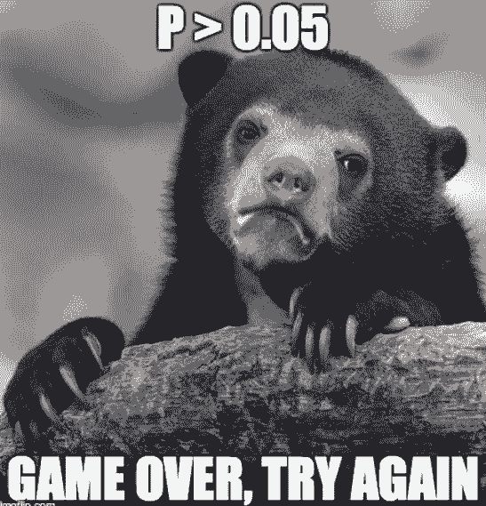
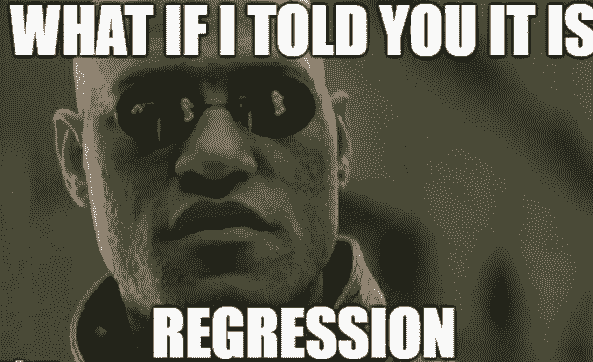

# 资源 | 25 个机器学习面试题，期待你来解答

选自 Medium

**机器之心编译**

**参与：Geek AI、王淑婷、思源**

> 机器学习有非常多令人困惑及不解的地方，很多问题都没有明确的答案。但在面试中，如何探查到面试官想要提问的知识点就显得非常重要了。在本文中，作者给出了 25 个非常有意思的机器学习面试问题，这些问题都没有给出明确的答案，但都有一定的提示。读者也可以在留言中尝试。

许多数据科学家主要是从一个数据从业者的角度来研究机器学习（ML）。因此，关于机器学习，我们应该尽可能多地把注意力放在新的程序包、框架、技术等方面，而不是关于核心理论的深入研究。在本文中，我所定义的机器学习包含所有的统计机器学习方法，因此不仅仅指深度学习。

然而，经过一番努力的探究和思考后，我们可以提出很多不错的机器学习问题，而当我们试图回答和分析这些问题时，就可以很好地揭示问题更深层次的内涵。基本上，这些问题可能有助于我们摆脱上面所说的那堆问题。我们并非只想一直对数据集进行操作，我们想更加深入地研究机器学习技术的特性、奇怪的地方以及复杂的细节，并最终能够很好地接受它们。

事实上，网络上有很多关于「机器学习面试问题」的文章，本文希望能稍微用不一样的、有趣的方式来讨论这些问题。

**声明：**我将这些问题列举出来只是为了启发大家的思考，促进相关的讨论。这个问题并没有现成的答案。我们会对某些问题给出提示，而这只是为了引发进一步的讨论，而不是给出了一个确切的答案。每个问题都值得被更详细地讨论，因此也就没有固定答案。有些问题是经过设计特意提出的，而有些只是为了逗大家开心。

**问题**

****

1\. 我在 95% 的置信区间下构建了一个线性回归模型。这是否意味着我的模型参数对于试图近似的函数有 95% 的概率是真实的估计值？（提示：这实际上意味着在 95% 的试验情况下...）

2\. Hadoop 文件系统和 KNN（k 最近邻）算法有什么相似之处呢？（提示：都很「懒」）

3\. 哪个模型结构的表示能力更强大？（例如，它可以精确地表示一个给定的布尔函数），是一个单层感知机还是一个两层的决策树？（提示：以异或函数为例）

4\. 对于一个两层决策树和一个不带有任何激活函数的两层神经网络，谁更加强大？（提示：考虑一下非线性函数的情况？）

5\. 神经网络可以作为降维的工具吗？请详细解释一下。（提示：自编码器）

6\. 似乎很多人都忽视了截距项在线性回归模型中的作用，请告诉我一个截距项的功能。（提示：噪声（「垃圾」）收集器）

7\. Lasso 正则化可以将系数降低到正好为零。岭回归可以将系数降低到非常小的非零值。你能从两个简单的函数「|x| 和 x²」的图像中直观地解释他们的不同之处吗？（提示：请注意 |x| 函数图像中的尖点）

8\. 假设你对数据集（连续值）的分布一无所知，你不能假设它是高斯分布。请用最简单的论证来说明：无论真是的分布是什么，你都能保证有大约 89% 的数据会落在均值附近 +/- 3 个标准差的范围内。（提示：马尔可夫的博士导师是谁？）

9\. 大多数机器学习算法涉及到一些对矩阵的操作，例如矩阵乘法和求逆矩阵。请给出一个简单的数学证明，说明为什么这种机器学习算法的 mini-batch 版本可能比在整个数据集上进行训练的计算效率更高？（提示：矩阵乘法的时间复杂度...）

10\. 难道你不认为时间序列是一个非常简单的线性回归问题，它仅仅有一个因变量和一个自变量（时间）？在使用时序数据时，线性回归拟合（可能是多项式回归）的方法有什么问题？（提示：过去的信息预示着未来...）

11\. 请给出一个简单的数学证明，说明在所有可能的树结构中找到适用于分类问题的最优决策树是一个复杂度为指数级的问题。（提示：森林中究竟会有多少棵树？）

12\. 决策树和神经网络都是非线性分类器，也就是说，通过复杂的决策边界来分割解空间。那么，直观地看，为什么我们认为使用决策树模型比深度神经网络要容易得多呢？

13\. 反向传播是深度学习的关键算法。请列举一些可能替代反向传播算法来训练神经网络的技术。（提示：随机搜索...）

14\. 假设你现在有两个问题（线性回归和 logistic 回归）。其中哪一个更有可能从超快大型矩阵乘法算法中获益？为什么？（提示：哪个算法更可能使用矩阵操作？）

15\. 自变量之间的相关性对主成分分析有何影响？你将如何对其进行处理？

16\. 你需要建立一个关于陨石撞地球的分类模型（这是对于人类文明很重要的项目）。经过初步分析后，你得到了 99% 的准确率。你应该感到高兴吗？为什么？你能为此做些什么？（提示：小概率事件...）

17\. 是否有可能捕获连续变量和类别变量之间的关系？如果以的话，需要怎么做？

18\. 如果你正在研究基因表达数据，通常会有数百万个自变量，而只有几百个样本。请给出简单的数学证明，说明为什么在这种情况下，使用最小二乘法构建一个回归模型并不是一个好的选择。（提示：从矩阵代数的角度思考...）

19\. 请解释，为什么 k 折交叉验证对于时序模型效果并不好。你能做些什么来改善这种情况？（提示：刚刚过去的信息对于未来有较强的指导作用...）

20\. 对于回归问题来说，从训练数据中通过简单随机抽样得到训练集和验证集是很有效的。但是对于一个分类问题来说，这种方法会存在什么问题？为此我们能做些什么？（提示：所有类别的样本是否能被公平地抽取出来？）

21\. 模型的准确率和性能，哪一个对你来说更重要？

22\. 如果你可以利用多个 CPU 内核，你会更喜欢提升树算法而不是随机森林吗？为什么？（提示：如果你有 10 只手去完成一项任务，你会如何利用它）

23\. 假设已知数据集是线性可分的，而你需要保证算法能够收敛并且具有最大的迭代次数/训练步数（由于计算资源有限）。在这种情况下你会使用梯度下降法吗？你会选择什么方法呢？（提示：哪种简单的算法能够保证找到解？）

24\. 假设你拥有的内存/存储空间非常小。你会更喜欢 logistic 回归还是 KNN 算法？为什么？（提示：空间复杂度）

25\. 为了构建一个机器学习模型，你准备了 100 个数据点和 5 种特征。为了减少偏差，你又引入了 5 个特征变量，并且又收集了 100 个数据点。请解释这种方法是否正确。（提示：机器学习会遇到的（维度）灾难，你听说过吗？）

*原文链接：https://medium.com/analytics-vidhya/25-fun-questions-for-a-machine-learning-interview-373b744a4faa*

****本文为机器之心编译，**转载请联系本公众号获得授权****。**

✄------------------------------------------------

**加入机器之心（全职记者 / 实习生）：hr@jiqizhixin.com**

**投稿或寻求报道：**content**@jiqizhixin.com**

**广告 & 商务合作：bd@jiqizhixin.com**