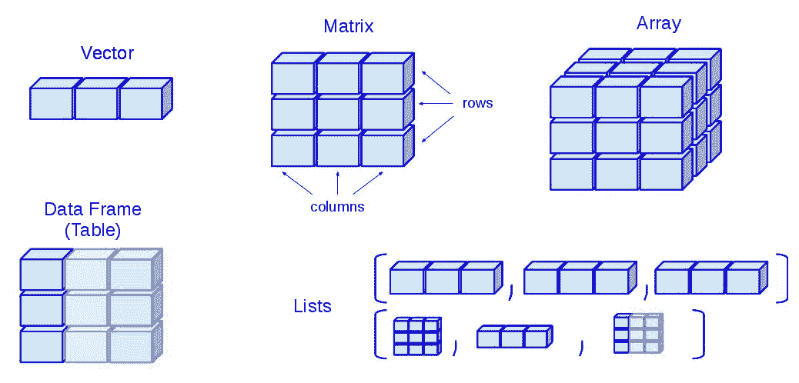
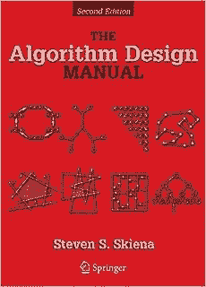
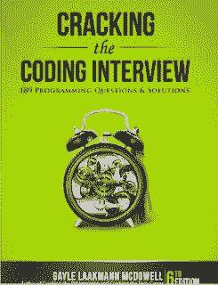

# 手写二叉树？程序员面试最常见问题 TOP 48

选自 hackernoon

**作者：javinpaul**

**机器之心编译**

**机器之心编辑部**

> 同学，你会手写二叉树吗？近来正值秋招季节，很多编程面试都要求手写数据结构手推机器学习算法。各位同学为了面试也会刷各种编程题，其中数据结构与排序搜索算法又是最为基础的内容。在本文中，我们为各位读者准备了 48 道基础面试题，它可以帮助我们更深地理解数据结构。本文所有面试题都提供了 Java 解决方案，并介绍了比较流行的 GitHub 面试题项目。

很多计算机科学专业毕业生和程序员都会去 Uber、今日头条这样的独角兽公司，或者亚马逊、微软和谷歌这样的科技巨头申请编程和软件开发职位。你在申请这些工作时，肯定很想知道面试官会问到哪些问题。

在本文中，作者会分享一些常见的编程面试问题，这些问题来自于针对不同经验层次的程序员的面试——从应届毕业生到具有一两年经验的程序员。

编程面试题通常包含数据结构和基于算法的问题，以及一些逻辑问题，例如：如何在不使用临时变量的情况下交换两个整数？

为了清晰，编程面试题需要划分为不同主题。我们在面试中经常看到的领域是数组、链表、字符串、二叉树以及有关算法的问题（例如字符串算法、快速排序或基数排序等排序算法），本文将介绍这些内容。

虽然本文无法覆盖你在面试中将要面临的所有问题，但是它可以给你提供足够的思路，让你在面试时对于各种挑战有所准备。

一旦解决了这些问题，你就可以有信心面对任何电话面试或现场面试了。

当然，如果你对于基本数据结构和算法没有足够的知识储备，那么直接接触以下问题将对你没有帮助。

**算法和编程面试题 TOP 48**

废话少说，这里有一份「编程面试最常见的问题列表」：

**1\. 数组编程面试问题**

数组是最基本的数据结构，它将元素储存在连续的内存空间中。数组也是面试官最喜欢问的主题之一，在任何编程面试中都能听到非常多关于数组的问题，例如反转数组、排序数组或搜索数组元素等。

数组这种数据结构的主要优点在于如果给定索引，那么它会提供 O(1) 复杂度的搜索，这种搜索速度非常迅速。但是从数组中添加或移除元素会比较慢，因为一旦创建了数组，我们就很难再更改它的大小。如果需要更长或更短的数组，我们就需要重新创建新数组，并将老数组的所有元素复制到新数组中。

解决数组问题的关键是对数组数据结构有比较深的理解，同时还需要了解循环、递归和基本运算子等常见的编程结构。以下是一些常见的数组编程面试问题：

1\. 在一个元素为 1 到 100 的整数数组中，如何搜索缺失元素？

*   解决方案：http://javarevisited.blogspot.com/2014/11/how-to-find-missing-number-on-integer-array-java.html

2\. 给定一个数组，如何搜索重复元素？

*   解决方案：http://javarevisited.blogspot.com/2014/01/how-to-remove-duplicates-from-array-java-without-collection-API.html

3\. 给定一个乱序数组，如何搜索最大和最小元素？

*   解决方案：http://java67.blogspot.com/2014/02/how-to-find-largest-and-smallest-number-array-in-java.html

4\. 给定一个数值，如何搜索整数数组中加和为该数值的成对元素？

*   解决方案：http://javarevisited.blogspot.com/2014/08/how-to-find-all-pairs-in-array-of-integers-whose-sum-equal-given-number-java.html

5\. 如果数组包含多个重复值，如何搜索所有重复值？

*   解决方案：http://javarevisited.blogspot.com/2014/03/3-ways-to-find-first-non-repeated-character-String-programming-problem.html

6\. 给定一个数组，如何用 Java 删除重复元素？如何在不使用库的情况下移除数组中的重复元素？

*   解决方案：http://javarevisited.blogspot.com/2014/01/how-to-remove-duplicates-from-array-java-without-collection-API.html

7\. 如何使用快速排序算法对整数数组进行排序？

*   解决方案：http://javarevisited.blogspot.com/2014/08/quicksort-sorting-algorithm-in-java-in-place-example.html

8\. 如何使用 Java 反转一个数组？

*   解决方案：http://javarevisited.blogspot.com/2013/03/how-to-reverse-array-in-java-int-String-array-example.html

这些问题不仅能帮助我们提高解决问题的能力，同时也能提升我们关于数组数据结构的理解。

如果你需要了解更多基于数组的深度问题，你可以在 GitHub 或 Coursera 上多找找关于数据结构的课程与资料，例如在 GitHub 中，就有非常多关于数组的学习资料，下面我们介绍了一份中文版的谷歌的面试资料，它在 GitHub 上有 6 万多的收藏量。

项目地址：https://github.com/jwasham/coding-interview-university/blob/master/translations/README-cn.md

**2\. 链表编程面试问题**

链表是补充数组数据结构的另一种常见数据结构。与数组类似，它也是线性数据结构，以线性方式存储元素。

然而，与数组不同的是，它不会将元素存储在连续的位置；相反，它会将其分散存储在内存中，彼此通过节点相互连接。链表是节点列表，其中每个节点包含存储的值和下一个节点的地址。

由于这种结构，在链表中添加或删除元素变得很简单，因为你只需要改变链接而不是创建数组，但是这样会使搜索变得困难，并且经常需要 O(n) 的时间复杂度才能在单个链表中找到某个元素。

这篇文章（https://javarevisited.blogspot.com/2013/07/difference-between-array-and-linked-list-java.html）提供了更多关于数组和链表数据结构之间差异的信息。

链表还有多种变体，如单链表，即允许在一个方向（正向或反向）上遍历；双链表则允许你在两个方向（向前或向后）遍历；最后是循环链表，它形成一个循环。

要解决关于链表的问题，掌握递归知识很重要，因为链表是递归数据结构。

如果你从链表中取出一个节点，剩下的数据结构仍然是链表，因此，许多链表问题的递归解比迭代解更简单。

以下是关于链表的一些常见问题和解决方案：

9\. 如何在一次传递中找到单链表的中间元素？

*   解决方案：http://javarevisited.blogspot.sg/2012/12/how-to-find-middle-element-of-linked-list-one-pass.html

10\. 如何检查给定的链表是否包含循环？如何找到循环的起始节点？

*   解决方案：http://javarevisited.blogspot.sg/2013/05/find-if-linked-list-contains-loops-cycle-cyclic-circular-check.html

11\. 如何反转链表？

*   解决方案：http://www.java67.com/2016/07/how-to-reverse-singly-linked-list-in-java-example.html

12\. 在没有递归的情况下如何反转单链表？

*   解决方案：http://javarevisited.blogspot.sg/2017/03/how-to-reverse-linked-list-in-java-using-iteration-and-recursion.html

13\. 如何删除乱序链表中的重复节点？

*   解决方案：https://www.geeksforgeeks.org/remove-duplicates-from-an-unsorted-linked-list/

14\. 如何测量单链表的长度？

*   解决方案：http://javarevisited.blogspot.sg/2016/05/how-do-you-find-length-of-singly-linked.html

15\. 如何从单链表的末端找出第三个节点？

*   解决方案：http://javarevisited.blogspot.sg/2016/07/how-to-find-3rd-element-from-end-in-linked-list-java.html

16\. 如何使用堆栈算出两个链表的总和？

*   解决方案：https://www.geeksforgeeks.org/sum-of-two-linked-lists/

这些问题有助于你发展解决问题的技能，并提升你对链表数据结构的了解。目前有非常多的资源可以帮助我们理解链表，例如在 GitHub 上一个交互式的编码实践中，它使用 Jupyter Notebook 提供了数据结构与算法的各种练习，其中就包括了很多链表问题及实践。

项目地址：https://github.com/donnemartin/interactive-coding-challenges

**3\. 字符串编码面试问题**

除了数组和链表数据结构，字符串也是编程工作面试中的另一热点话题。我参加过的编码面试基本都问过关于字符串的问题。

如果你了解数组，那么你就能轻易地解决基于字符串的问题，因为字符串就是字符数组。因此，你通过解决数组编程问题学到的所有技巧，也能用来解决字符串编程问题。

以下是编程工作面试中常问的字符串编程问题列表：

17\. 如何打印字符串中重复的字符？

*   解决方案：http://java67.blogspot.sg/2014/03/how-to-find-duplicate-characters-in-String-Java-program.html

18\. 如何检查两个字符串是否互为逆序？

*   解决方案：http://javarevisited.blogspot.sg/2013/03/Anagram-how-to-check-if-two-string-are-anagrams-example-tutorial.html

19\. 如何打印字符串中首个非重复字符？

*   解决方案：http://javarevisited.blogspot.sg/2014/03/3-ways-to-find-first-non-repeated-character-String-programming-problem.html

20\. 如何使用递归反转给定字符串？

*   解决方案：http://javarevisited.blogspot.sg/2012/01/how-to-reverse-string-in-java-using.html

21\. 如何检查一个字符串是否仅包含数字？

*   解决方案：http://javarevisited.blogspot.sg/2012/10/regular-expression-example-in-java-to-check-String-number.html

22\. 如何搜索字符串中的重复字符？

*   解决方案：http://java67.blogspot.sg/2014/03/how-to-find-duplicate-characters-in-String-Java-program.html

23\. 给定一个字符串，如何统计元音数和辅音数？

*   解决方案：http://java67.blogspot.sg/2013/11/how-to-count-vowels-and-consonants-in-Java-String-word.html

24\. 给定一个字符，如同计算它在字符串中出现的次数？

*   解决方案：http://javarevisited.blogspot.sg/2012/12/how-to-count-occurrence-of-character-in-String.html

25\. 如何搜索一个字符串的所有排列情况？

*   解决方案：http://javarevisited.blogspot.com/2015/08/how-to-find-all-permutations-of-string-java-example.html

26\. 在不使用任何库的情况下，如何反转给定句子中的单词？

*   解决方案：http://java67.blogspot.com/2015/06/how-to-reverse-words-in-string-java.html

27\. 如何检查两个字符串是不是互为旋转（rotation）？

*   解决方案：http://www.java67.com/2017/07/string-rotation-in-java-write-program.html

28\. 给定一个字符串，如何检查它是不是回文结构？

*   解决方案：http://java67.blogspot.com/2015/06/how-to-check-is-string-is-palindrome-in.html

这些问题可以提升你对字符串数据结构的了解。如果你能独立解决所有这些字符串问题，说明你的状态很好。

如果想深入了解一些更复杂的问题，我推荐你去看 Steven Skiena 的《The Algorithm Design Manual》，这本书里有最难的算法问题。

网上也有该书的 PDF 版，下载地址：http://citeseerx.ist.psu.edu/viewdoc/download?doi=10.1.1.471.4772&rep=rep1&type=pdf

如果你需要更多的练习，这里还有另外 20 个关于字符串编程的问题：

http://javarevisited.blogspot.sg/2015/01/top-20-string-coding-interview-question-programming-interview.html

**4\. 二叉树编程面试问题**

现在我们只了解了线性数据结构方面的问题，但是真实世界中的所有信息不可能全是线性的，这就需要树数据结构了。

树数据结构允许以层级形式存储数据。根据存储数据的方式，有多种树类型，如二叉树。

和它的近亲二叉搜索树一样，它也是最流行的树数据结构之一。因此，你会看到很多相关的有趣问题。例如，如何遍历树、计算节点数量、找出深度，以及检查是否平衡。

解决二叉树问题的关键在于深厚的理论知识，如二叉树的大小或深度、什么是叶节点、什么是节点，以及了解流行的遍历算法。

以下是软件工程师或开发工作面试中常见的二叉树相关编程问题：

29\. 如何实现二叉搜索树？

*   解决方案：http://javarevisited.blogspot.sg/2015/10/how-to-implement-binary-search-tree-in-java-example.html#axzz4wnEtnNB3

30\. 如何对给定二叉树执行前序遍历？

*   解决方案：http://javarevisited.blogspot.sg/2016/07/binary-tree-preorder-traversal-in-java-using-recursion-iteration-example.html#axzz5ArdIFI7y

31\. 如何在没有递归的情况下对给定二叉树执行前序遍历？

*   解决方案：http://www.java67.com/2016/07/binary-tree-preorder-traversal-in-java-without-recursion.html

32\. 如何对给定二叉树执行中序遍历？

*   解决方案：http://www.java67.com/2016/08/binary-tree-inorder-traversal-in-java.html

33\. 如何在没有递归的情况下通过对给定二叉树执行中序遍历来打印所有节点？

*   解决方案：http://www.java67.com/2016/08/binary-tree-inorder-traversal-in-java.html

34\. 如何实现后序遍历算法？

*   解决方案：http://www.java67.com/2016/10/binary-tree-post-order-traversal-in.html

35\. 如何在没有递归的情况下对给定二叉树执行后序遍历？

*   解决方案：http://www.java67.com/2017/05/binary-tree-post-order-traversal-in-java-without-recursion.html

36\. 如何打印二叉搜索树的所有叶节点？

*   解决方案：http://www.java67.com/2016/09/how-to-print-all-leaf-nodes-of-binary-tree-in-java.html

37\. 如何计算给定二叉树中叶节点的数量？

*   解决方案：http://javarevisited.blogspot.sg/2016/12/how-to-count-number-of-leaf-nodes-in-java-recursive-iterative-algorithm.html

38\. 如何在给定数组中执行二元搜索？

*   解决方案：http://javarevisited.blogspot.sg/2015/10/how-to-implement-binary-search-tree-in-java-example.html#axzz4wnEtnNB3

如果你认为自己对二叉树编程的了解不足，无法解决这些问题，我建议你先熟练掌握数据结构和算法知识，比如你可以上这门课《From 0 to 1: Data Structures & Algorithms in Java》。同样，你也可以查阅准备 Google 面试的一套完整手册，这套 GitHub 手册前面已经介绍了，但它在二叉树等数据结构上真的有非常多的案例与教程。

项目地址：https://github.com/jwasham/coding-interview-university

如果你需要更多推荐，可以参考：

*   http://javarevisited.blogspot.sg/2015/07/5-data-structure-and-algorithm-books-best-must-read.html

*   http://javarevisited.blogspot.sg/2018/01/top-5-free-data-structure-and-algorithm-courses-java—c-programmers.html

**5\. 其它编程面试问题**

除了数据结构方面的问题，大部分编程工作面试也会问关于算法、设计、位运算和通用的逻辑问题。

针对性练习很重要，因为有时在实际面试中它们会有点难解。事先练习不仅能够让你熟悉这些问题，还能让你在向面试官解释答案时更加自信。

39\. 如何实现冒泡排序算法（bubble sort algorithm）？

*   解决方案：http://javarevisited.blogspot.sg/2014/08/bubble-sort-algorithm-in-java-with.html#axzz5ArdIFI7y

40\. 如何实现迭代快速排序算法（iterative quicksort algorithm）？

*   解决方案：http://javarevisited.blogspot.sg/2016/09/iterative-quicksort-example-in-java-without-recursion.html#axzz5ArdIFI7y

41\. 如何实现插入排序算法（insertion sort algorithm）？

*   解决方案：http://www.java67.com/2014/09/insertion-sort-in-java-with-example.html

42\. 如何实现归并排序算法（merge sort algorithm）？

*   解决方案：http://www.java67.com/2018/03/mergesort-in-java-algorithm-example-and.html

43\. 如何实现桶排序算法（bucket sort algorithm）？

*   解决方案：http://javarevisited.blogspot.sg/2017/01/bucket-sort-in-java-with-example.html

44\. 如何实现计数排序算法（counting sort algorithm）？

*   解决方案：http://www.java67.com/2017/06/counting-sort-in-java-example.html

45\. 如何实现基数排序算法（radix sort algorithm）？

*   解决方案：http://www.java67.com/2018/03/how-to-implement-radix-sort-in-java.html

46\. 如何在不使用第三个变量的前提下交换两个数字？

*   解决方案：http://www.java67.com/2015/08/how-to-swap-two-integers-without-using.html

47\. 如何确认两个矩形是否重叠？

*   解决方案：http://javarevisited.blogspot.sg/2016/10/how-to-check-if-two-rectangle-overlap-in-java-algorithm.html

48\. 如何设计自动贩卖机？

*   解决方案：http://javarevisited.blogspot.sg/2016/06/design-vending-machine-in-java.html

如果你想查看更多此类编程问题，可以阅读这本书《Cracking the Coding Interview: 189 Programming Questions and Solutions》，适合短时间内准备编程工作面试。

下载地址：http://lib1.org/_ads/fcb49f53d5e943ce8acdc4469f63dc5d

你练习的问题越多，准备就越充分。因此，如果你认为 48 道题不够的话，可以查看：

*   https://javarevisited.blogspot.com/2015/02/50-programmer-phone-interview-questions-answers.html

*   http://javarevisited.blogspot.sg/2016/06/top-5-books-for-programming-coding-interviews-best.html

*   http://javarevisited.blogspot.sg/2018/02/10-courses-to-prepare-for-programming-job-interviews.html

**现在你已经准备好面试了**

这部分将介绍一些数据结构和算法之外的常见问题，可以帮助你在面试中取得更好的表现。

我的博客中还有很多此类问题，详见：http://www.java67.com/

这些常见的编程、数据结构和算法问题是你去任何一家公司面试都必须知道的，不管是大公司还是小公司，不管面试的职位高或低。

如果你正在寻找编程或软件开发工作，那么你可以先使用这些编程问题开始准备。该列表提供了一些不错的面试准备话题，能够帮助你评估自己的面试准备工作是否充分。

熟练掌握数据结构和算法知识是编程工作面试成功的关键，你应该更多地关注这些问题。

**扩展阅读：**

*   **Data Structures and Algorithms: Deep Dive Using Java：**https://click.linksynergy.com/fs-bin/click?id=JVFxdTr9V80&subid=0&offerid=323058.1&type=10&tmpid=14538&RD_PARM1=https%3A%2F%2Fwww.udemy.com%2Fdata-structures-and-algorithms-deep-dive-using-java%2F

*   **10 Books to Prepare Technical Programming/Coding Job Interviews：**http://www.java67.com/2017/06/10-books-to-prepare-technical-coding-job-interviews.html

*   **10 Algorithm Books Every Programmer Should Read：**http://www.java67.com/2015/09/top-10-algorithm-books-every-programmer-read-learn.html

*   **Top 5 Data Structure and Algorithm Books for Java Developers：**http://javarevisited.blogspot.sg/2016/05/5-free-data-structure-and-algorithm-books-in-java.html#axzz4uXETWjmV

*   **From 0 to 1: Data Structures & Algorithms in Java：**https://click.linksynergy.com/fs-bin/click?id=JVFxdTr9V80&subid=0&offerid=323058.1&type=10&tmpid=14538&RD_PARM1=https%3A%2F%2Fwww.udemy.com%2Ffrom-0-to-1-data-structures%2F

*   **Data Structure and Algorithms Analysis—Job Interview：**https://click.linksynergy.com/fs-bin/click?id=JVFxdTr9V80&subid=0&offerid=323058.1&type=10&tmpid=14538&RD_PARM1=https%3A%2F%2Fwww.udemy.com%2Fdata-structure-and-algorithms-analysis%2F

*原文链接：https://hackernoon.com/50-data-structure-and-algorithms-interview-questions-for-programmers-b4b1ac61f5b0*

 ****机器之心《全球 500 强上市公司人工智能战略适应性报告》重磅发布。17 个行业，140 家上市公司，纵览 500 强落地人工智能的成与败。**

点击阅读原文，申请获取报告 PDF，我们将在审核后统一发送。**