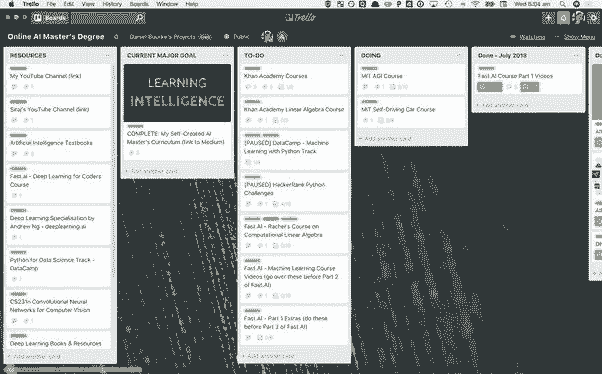
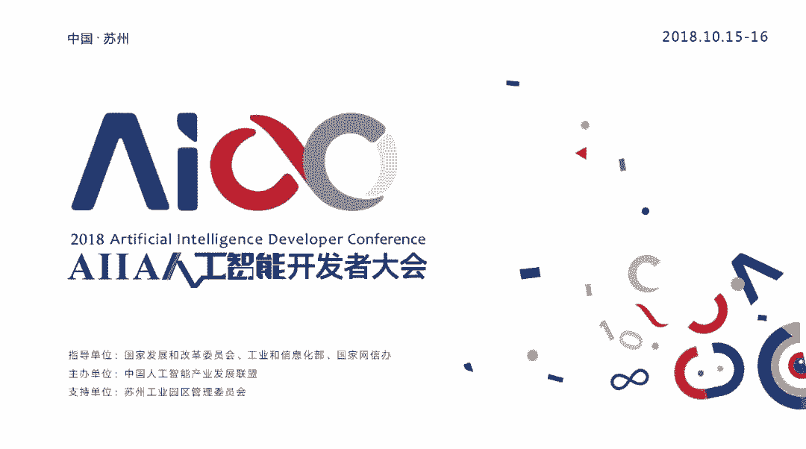

# 从苹果店员到机器学习工程师：学习 AI，我是这样起步的

选自 HackerNoon

**作者****：****Daniel Bourke **

**机器之心编译**

**参与：路****、张倩、王淑婷**

> 机器学习工程师的职位并不只是为 AI 博士准备的：通过网络上公开的课程和视频，人们可以学习人工智能领域的基础知识、培养写代码的能力，最终找到 AI 领域的相关工作——只要你不轻言放弃。本文中，这位名为 Daniel Bourke 的小哥介绍了自己从零开始的心路历程。

我曾经在苹果商店工作，我想要改变，那么就从自己服务的技术入手吧。我开始学习机器学习和人工智能——这个领域非常热门，每一周，谷歌、Facebook 这样的科技公司都在推出新的 AI 技术，不断改善我们的体验。

现在也有数不清的自动驾驶汽车公司，虽然这项技术很好，但我并不喜欢驾驶，而且道路很危险。

即使看到了今天正在发生的一切，我们仍然无法给出「人工智能」一词的明确定义。一些人认为深度学习可以被称为 AI；另一些人则认为除非完全通过图灵测试，否则就不算 AI。缺乏定义这一问题确实给我入门人工智能前期造成了很多麻烦，如果你在学的东西有很多种不同的定义，那么学习它真的很难起步。

所以我们先抛开定义。

**我是如何起步的？**

我和朋友想创建一家互联网创业公司，结果失败了。我们觉得做这件事没有意义，所以就放弃了。但在这个过程中，我对 ML 和 AI 的了解越来越多。

「计算机可以为人类学习？」我觉得不可思议。

我偶然发现了优达学城（Udacity）的深度学习纳米学位。宣传片里有一个名叫 Siraj Raval 的有趣角色。他活力四射，非常具有感染力。尽管没有达到基本要求（我一行 Python 代码都没写过），我还是选择了注册。

距开课还有三周时间时，我给优达学城发了邮件，询问退款相关事宜，因为我担心自己无法完成课程。

我没有拿到退款，因为我在指定时间内完成了整个课程。课很难，有时非常难。我的前两个项目迟了四天才交上。但涉猎世界上最重要的技术带来的兴奋驱使我继续走下去。

拿到深度学习纳米学位之后，我就能继续攻读优达学城的 AI、自动驾驶汽车或机器人学纳米学位。这些都是很好的选择。

我感觉有点迷茫。「接下来要做什么呢？」

我需要一个课程表。深度学习纳米学位为我打下了一点基础，现在是时候构思下一步了。

**我自己创建的 AI 硕士学位**

我不打算回大学继续读书，毕竟我没有 10 万美元读完硕士课程。所以我和以前一样，向我的「导师」——谷歌求助。

我在事先对该领域没有任何先验知识的情况下，开始钻研深度学习。我不是奋力攀爬至 AI 这座冰山的顶上的，而是乘坐直升机飞上去的。

在研究了一系列课程之后，我在 Trello 上列出了最感兴趣的课程。

*Trello 是我的个人助理/课程协调员*

我知道在线课程的辍学率很高，我不想成为其中的一份子。我有一个使命。

为此，我开始在网上分享学习经历。这样我能在网上找到其他志同道合的人，并与之交流。当我进行 AI 冒险之旅时，我的朋友们都认为我疯了。

我公开了我的 Trello board，并写了一篇关于自己奋斗历程的博客。

自从我第一次写了自己的经历以后，课程略有变化，但仍然相关。我每周会查看几次 Trello board，以跟踪自己的进度。

**找份工作**

我买了一张去美国的单程机票。我已经学习了一年，现在是时候学以致用了。

我的计划是飞到美国并找份工作。

然后 Ashlee 在领英上给我发消息说，「你好，我看过你的博客了，非常好，我觉得你应该去见见 Mike。」

于是我见了 Mike。

我告诉他我在线自学的经历、我有多热爱医疗技术，以及我计划去美国。

「你最好在这里待上一年左右，看看自己能找到什么，你可以去见 Cameron。」

我见到了 Cameron。

我和他的对话与和 Mike 的差不多，关于医疗、技术、在线学习、美国。

「我们正在研究一些医疗问题，你可以周四过来看看。」

周四到了，我有点紧张。但有人曾告诉过我，紧张和兴奋是一样的，然后我开始变得兴奋。

那天我见到了 Max Kelsen 团队，了解了他们正在研究的问题。

两周后，首席执行官 Nick、首席机器学习工程师 Athon 和我去喝咖啡。

Nick 问我：「你要不要加入我们团队？」

我说：「好啊」。

然后我的美国之旅推迟了几个月，现在我还有了返程票。

**分享你的工作**

我知道在线学习是非常规的。我申请的所有职位都有硕士或某种技术学位的要求。

而我什么都没有。但我确实从许多在线课程中学到了同样的技能。

其间我在网上分享自己的工作。我的 GitHub 里存了我做过的所有项目，我的领英资料非常丰富。此外，我还练习了在 YouTube 和 Medium 上学到的沟通技巧。

我从没有向 Max Kelsen 投过简历。「我们在领英上发现了你。」

我存的那些工作就是我的简历。

无论你是在线学习还是去读硕士学位，将你做过的工作打包呈现给别人都是一种在游戏中创建皮肤的良好方式。

ML 和 AI 技能很抢手，但这不表示你不需要将它们展示出来。如果没有货架空间，再好的产品也卖不出去。

这个「货架」可以是 GitHub、Kaggle、领英或博客，要找一个别人可以发现你的地方。再者，在互联网上拥有一个自己的角落也很有意思。

**如何开始？**

去哪儿学习这些技能？哪些课程最好？

没有最佳答案。每个人要走的路都不同。有些人通过书本学习效果很好，而有些人通过视频学习会更好。

比如何开始更重要的是你为什么要开始？

先问问自己为什么。

*   为什么你想学习这些技能？

*   你是想通过这些来赚钱吗？

*   还是想构建一些东西？

*   还是想有所作为？

仍然没有最佳答案。每个人的答案对自己来说都很重要。

先问清楚为什么，因为它比怎么做更重要。弄清楚为什么意味着，当你学习遇到困难时（一定会遇到的），这些答案能帮你撑过去。它们会提醒你为什么走上这条路。

了解了「为什么」？很好，现在学习一些比较难的技能吧。

我只能推荐一些自己尝试过的东西。

我按顺序完成了以下课程：

*   Treehouse：Python 介绍

*   Udacity：深度学习&AI 纳米学位

*   Coursera：吴恩达的深度学习课程

*   fast.ai：目前还在 part1，很快进入 part2

这些课程都是世界级的。我是视频学习者，通过看这些东西的出现过程和解说，我能学得更好。所有这些课程都是这样的。

如果你完全是一个新手，可以从介绍 Python 的课程开始看，当你有了更多信心之后，可以向数据科学、机器学习和 AI 进军了。

**需要多少数学知识？**

我最多只学到高中数学。其它知识都是通过可汗学院学习的。

投身机器学习和人工智能需要多少数学知识因人而异，下面是我的选择。

如果你想应用机器学习和 AI 技术来解决某个问题，那么你不必深入了解数学也能取得好的结果。TensorFlow 和 PyTorch 等库使仅具备一点 Python 经验的人也能构建当前最优的模型，而数学知识藏在幕后。

如果你想通过博士项目或者其它类似的项目来深入机器学习和 AI 研究，那么你需要具备深厚的数学知识。

就我本人而言，我不打算深入学习数学，留给比我聪明的人学吧～使用 TensorFlow 和 PyTorch 等库来解决问题，我觉得更开心～

**机器学习工程师做什么？**

机器学习工程师真正做的事情可能和你想的并不相同。

尽管很多在线文章的封面照片中有红眼睛的机器人，但这不代表你会研究机器人。

以下是机器学习工程师每天都要问自己的一些问题：

*   语境：如何利用机器学习帮助自己了解问题？

*   数据：是否需要更多数据？数据应该是什么格式？如果数据丢失，你要怎么做？

*   建模：应该使用哪个模型？该模型是否过于适应数据（过拟合）？或者为什么模型无法很好地适应数据（欠拟合）？

*   生产：如何将模型投入生产？它应该是在线模型还是隔一段时间不断更新？

*   Ongoing：模型崩溃了会发生什么？如何利用更多数据改进模型？是否存在更好的方式？

这些问题来自 fast.ai 联合创始人 Rachel Thomas 的一篇文章（http://www.fast.ai/2018/07/12/auto-ml-1/）。

想了解更多，可以查看下面的视频：

[`v.qq.com/iframe/preview.html?width=500&height=375&auto=0&vid=x073547sk78`](https://v.qq.com/iframe/preview.html?width=500&height=375&auto=0&vid=x073547sk78)

**没有既定道路**

进入机器学习或 AI 领域的路没有对错之分。

该领域的美妙之处在于我们可以接触到世界上最棒的技术，我们只需要去学习如何使用它们。

首先，你应该学习 Python、研究微积分和统计学、学习决策的哲学。

机器学习和 AI 是上述领域的交叉地带，这使我非常着迷。我对此了解得越多，越意识到还需要学习更多。这让我充满动力。

有时代码无法运行或者我不理解某个概念时也会觉得挫败。这种时候我会暂时放下这个问题，休息一下或出去走走。再回来看这个问题时我好像换了一个角度，激情又回来了！

该领域每时每刻都在发生很多事情，开始本身令人畏惧。太多选择导致没有选择。请忽略它。

从你感兴趣的地方开始，然后沿着这条路继续前进。如果它把你带到了死胡同，很棒，你会发现自己对哪些事物不感兴趣。重新找一条路！

计算机很智能，但是它们仍然无法自行学习。它们需要你的帮助。**

*原文链接：https://hackernoon.com/i-want-to-learn-artificial-intelligence-and-machine-learning-where-can-i-start-7a392a3086ec*

2018AIIA 人工智能开发者大会将于 2018 年 10 月 15 日到 16 日在苏州国际博览中心举办。点击阅读原文链接报名。

