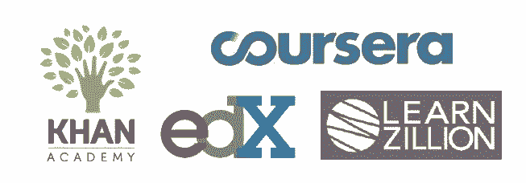
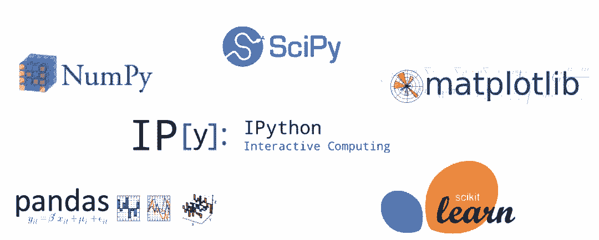
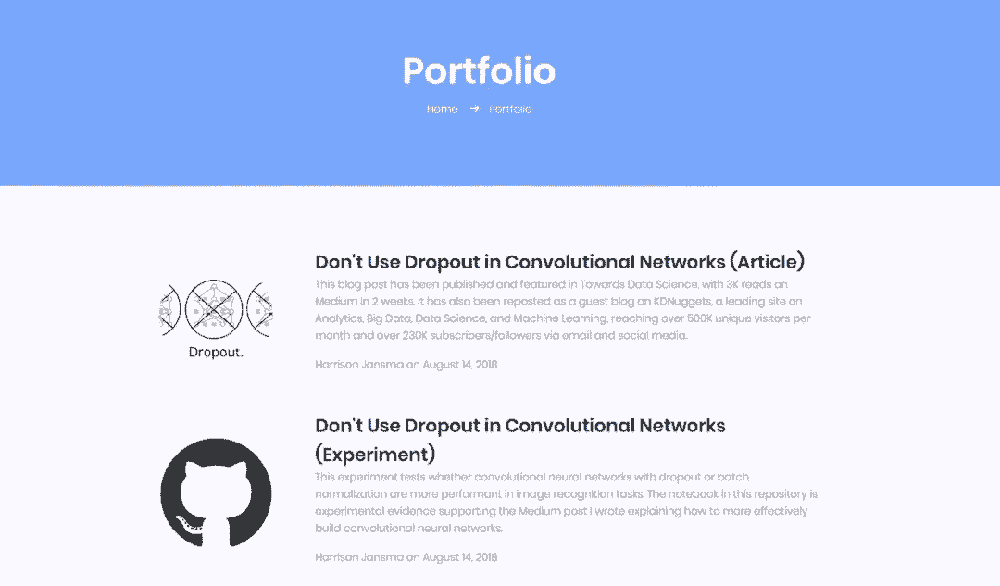

# 入门 | 如果是个穷光蛋：如何从零开始学习成为一个数据科学家？

选自 Medium

**作者：Harrison Jansma**

**机器之心编译**

**参与：李诗萌、Chita**

> 当你干着一份并不喜欢且薪资又低的工作时，是否想要做出改变？本文作者曾在日托中心上班，却从零开始自学了数据科学，并已经小有成就。本文是他关于自学数据科学的一些参考建议，有志者不妨一读？

去年，我自学了数据科学，搜集了几百个在线资源，每天学 6～8 个小时。与此同时，我白天还在日托中心上班，拿着最低的薪资水平。

尽管我资金不足，但我的目标是从事自己热爱的职业。

因此，我在过去几个月中取得了一些成就。我发布了自己的网站，主流的在线数据科学网站 KDnuggets 也对我进行了报道，我还在极具竞争力的计算机科学研究生课程中获得了奖学金。

网站地址：https://harrisonjansma.com/

我在本文中提供了一些指导和建议，以便你自行学习数据科学课程。我还提供了一些参考工具，希望能给想要学习的人一些帮助，让他们可以在数据科学领域中从事更有激情的职业。

> 快速说明：
> 
> 我说的「数据科学」，指的是将数据转化为现实行为的工具集合，包括机器学习、数据库技术、统计、编程以及特定领域的技术。

**开启学习之旅的一些资源**

互联网上乱七八糟混乱一片。要从中学习就像是从消防水带的末端喝水一样。

有一些更简单的替代方法可以为你从中理出头绪。

像 Dataquest、DataCamp 和 Udacity 这样的网站会教你一些数据科学的技巧。这些网站每一个都创建了一个教育计划，以便你按主题学习，而你几乎不用做什么课程计划。

问题在于这些网站都付费不低，而且它们无法教你如何在工作环境中应用这些概念，而且它们也会妨碍你继续探索自己的兴趣和激情所在。

而像 edX 和 coursera 这样的替代品则无需付费，它们会提供关于某个特定话题的一次性课程。如果你可以在视频环境或课堂环境中好好学习的话，这些都是学习数据科学的绝佳方法。

你可以从第一个网址中获得一些数据科学课程，也可以从 David Venturi 的博客或 Open Source DS Master 上找到一些免费的课程。

*   地址：https://www.class-central.com/subject/data-science 

*   David Venturi：https://medium.com/@davidventuri/i-dropped-out-of-school-to-create-my-own-data-science-master-s-here-s-my-curriculum-1b400dcee412

*   Open Source DS Master：http://datasciencemasters.org/

如果你只需要阅读就可以学得不错的话，推荐你看《Data Science From Scratch》。这本书是一个完整的学习方案，可以作为在线资源的补充。你可以在线免费获取这本书的 pdf 版，也可以在 Amazon 上买到纸质版。

在线 PDF：http://math.ecnu.edu.cn/~lfzhou/seminar/[Joel_Grus]_Data_Science_from_Scratch_First_Princ.pdf

这只是一小部分学习数据科学的免费资源，还有更多。为了更好地理解你在学习中需要获取的技能，我将在下文详细叙述更广泛的学习指南。这些内容不仅仅是课程列表或者书单，而是一些更加高级的内容。

**课程指南**

*数据科学课程指南*

**Python 编程**

编程是数据科学的基本技能。熟悉 Python 的语法，了解如何用不同的方式（Jupyter botebook、命令行以及 IDE）运行 Python 程序。

我花了大概一个月的时间复习 Python 文档、Hitchhiker 的 Python 指南以及 CodeSignal 上的代码问题。

*   Python 文档：https://docs.python.org/3/tutorial/

*   Hitchhiker 的 Python 指南：https://docs.python-guide.org/intro/learning/

*   CodeSignal：https://codesignal.com/

提示：留意程序员解决问题的常用技巧（即「算法」）。

**统计&线性代数**

这是机器学习和数据分析的先决条件。如果你已经对此有了充分的了解，那么请用一到两周复习一下重点概念。

尤其要注意描述性统计。理解统计数据是一项非常重要的技能。

**Numpy、Pandas&Matplotlib**

学习如何加载、操作和可视化数据。掌握这些库对你的个人项目而言至关重要。

快速提示：你无需记住每种方法或每个函数的名字，记住这些东西需要实践。忘了的话 Google 一下好了。

浏览以下三个文档：

*   Pandas 文档：http://pandas.pydata.org/pandas-docs/stable/

*   Numpy 文档：https://docs.scipy.org/doc/numpy/user/index.html

*   Matplotlib 教程：https://matplotlib.org/tutorials/index.html

记住，实践出真知！

**机器学习**

学习机器学习算法的理论和应用。然后将所学的概念用到现实世界中你关心的数据上。

大多数初学者是从处理 UCI ML Repository 中的小数据集开始的。他们对这些数据进行处理，并在这些数据上实践 ML 教程。

Scikit-learn 文档中有一些关于常用算法应用的优秀教程。我还发现一个不错的 podcast 教学资源，是关于 ML 背后的理论。你可以在锻炼的时候或者上下班途中收听。

地址：http://ocdevel.com/mlg

**生产系统**

工作意味着能够获取真实世界的数据并对其进行分析。为此你需要学习如何使用商业计算资源，来获取、转化以及处理数据。

*AWS、Google Cloud 以及 Microsoft Azure*

这是数据科学课程中教的最少的部分，因为你要用的特定工具主要取决于你日后要进入的行业。但数据库操作是一项必需的技能。你可以在 ModeAnalytics 或 Codecademy 上学会用代码操作数据库。你还可以在 DigitalOcean 上实现你自己的数据库。

另一个常用技能是版本控制。你可以创建 GitHub 账户，每天使用命令行提交代码，轻松获取这项技能。在学习其它技能时，一定要考虑到自己的兴趣和激情。举个例子，如果你对 web 开发感兴趣，那么就要看一下这个行业中的公司所使用的工具。

**执行课程的建议**

**1\. 你获取概念的速度要比你学习概念的速度更快**

事实上，有成千上万的网页和论坛在解释常用数据科学工具的用法。因此在线学习时很容易转移注意力。当你开始研究某个主题时，要将自己的目的牢记于心。如果你没有记住的话，你可能会被任何抓人眼球的内容吸引过去。

解决方案：建一个收藏夹把你感兴趣的网页资源都存起来。这样你可以晚点再看保存好的材料，先将注意力集中在你现在关心的主题上。

如果你这么做了，你就会得到一个有序的学习路径，它会告诉你你应该关注什么内容。注意，当你探索感兴趣的新主题时，你的阅读列表会很快增长到数百个之多。别急，请看第二条建议。

**2\. 别担心，这是一场马拉松，而不是一段冲刺**

如果你想在数据科学领域取得成功，就要把学习视为一个贯穿整个生命的过程。

要记住，学习的过程就是你所获得的奖励。

在整个学习过程中，你将探索自己的兴趣点，并发现更多驱动你学习的东西。学得越多，你从中获得的愉悦感就更多。

**3\. 学习->应用->重复**

不要只是学习一个概念，然后就转向下一件事。学习过程直到你将其应用到真实世界中才停止。

不是每个概念都要在你的研究中占有一席之地。重要的是要坚持下去，要记得你在学习，这样你才会对这个世界产生影响。

**4\. 建一个作品集，它可以告诉别人你值得信任。**

谈到作品集，怀疑主义是你在学习数据科学时面临的最大困境之一。这种怀疑可能来自于他人，也可能来自你自己。你的作品集是向世界表示你有能力并对自己的能力充满信心的一种方式。

因此，在研究数据科学时，建一个作品集是你要做的最重要的事。一个好的作品集可以带给你一份不错的工作，并让你成为更自信的数据科学家。

你从零开始构建了自己的 web 应用程序吗？建立了自己的 IMDB 数据库吗？撰写过有趣的医疗保健数据分析吗？将它们放到你的作品集中去吧。

注意，写入的东西要可读性强、很好地记录了代码，作品集本身也要看起来不错。

这是我的作品集。公开作品集的简便方法是创建一个 GitHub 库，这个库中要有很好的 ReadMe（总结页）以及相关的项目文件。

GitHub 作品集要既美观又简单。想要更高级的作品集的话，请查看 GitHub-IO 来托管你的免费网站（示例：https://alexisbcook.github.io/#blog）

**5\. 数据科学 + _______ = 富有激情的职业**

数据科学是旨在改变世界的工具集合。有一些数据科学家构建了计算机可视化系统来诊断医学图像，还有一些数据科学家遍历了数十亿的数据来找到网站用户偏好的行为模式。

数据科学的应用是永无止境的，这也是为什么找到自己感兴趣的应用领域很重要。如果你找到感兴趣的主题，就会更投入地做出很好的项目。所以，学习的时候，要注意那些让你感到兴奋的项目或想法。

一旦你花时间学习了，试着将点连接起来。找出令你着迷的项目之间的相似之处，然后花一些时间研究一下涉及到这类项目的行业。一旦找到了感兴趣的行业，可以把获得该行业所需的技能和专业知识作为你的目标。

如果你能做到这一点，你就已经准备好将在学习上的辛勤努力转变为充满激情和成功的事业了。

**总结**

如果你喜欢发现世界，如果你为人工智能着迷不已，无论你现在的处境如何，你都可以投身于数据科学行业。

为了激励你的学习之旅，你要坚持不懈，还要自律。如果你是那种可以促进自己提升的人，你就可以自己掌握这些技能。毕竟，这就是数据科学家的意义所在。好奇、自我推动、并热衷于寻找答案。

*原文地址：https://towardsdatascience.com/how-to-learn-data-science-if-youre-broke-7ecc408b53c7*

****本文为机器之心编译，**转载请联系本公众号获得授权****。**

✄------------------------------------------------

**加入机器之心（全职记者 / 实习生）：hr@jiqizhixin.com**

**投稿或寻求报道：**content**@jiqizhixin.com**

**广告 & 商务合作：bd@jiqizhixin.com**