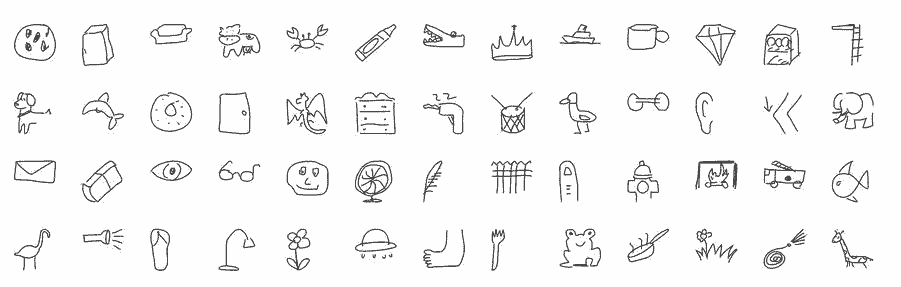

# 教程 | 如何利用 TensorFlow.js 部署简单的 AI 版「你画我猜」图像识别应用

选自 Medium

**作者****：Zaid Alyafeai**

**机器之心编译**

**参与：**Geek AI、路****

> 本文创建了一个简单的工具来识别手绘图像，并且输出当前图像的名称。该应用无需安装任何额外的插件，可直接在浏览器上运行。作者使用谷歌 Colab 来训练模型，并使用 TensorFlow.js 将它部署到浏览器上。


**代码和 demo**

*   demo 地址：https://zaidalyafeai.github.io/sketcher/ 

*   代码地址：https://github.com/zaidalyafeai/zaidalyafeai.github.io/tree/master/sketcher

*   请通过以下链接在谷歌 Colab 上测试自己的 notebook：https://colab.research.google.com/github/zaidalyafeai/zaidalyafeai.github.io/blob/master/sketcher/Sketcher.ipynb

**数据集**

我们将使用卷积神经网络（CNN）来识别不同类型的手绘图像。这个卷积神经网络将在 Quick Draw 数据集（https://github.com/googlecreativelab/quickdraw-dataset）上接受训练。该数据集包含 345 个类别的大约 5 千万张手绘图像。



*部分图像类别*

**流程**

我们将使用 Keras 框架在谷歌 Colab 免费提供的 GPU 上训练模型，然后使用 TensorFlow.js 直接在浏览器上运行模型。我在 TensorFlow.js 上创建了一个教程（https://medium.com/tensorflow/a-gentle-introduction-to-tensorflow-js-dba2e5257702）。在继续下面的工作之前，请务必先阅读一下这个教程。下图为该项目的处理流程：


*流程*

**在 Colab 上进行训练**

谷歌 Colab 为我们提供了免费的 GPU 处理能力。你可以阅读下面的教程（https://medium.com/deep-learning-turkey/google-colab-free-gpu-tutorial-e113627b9f5d）了解如何创建 notebook 和开始进行 GPU 编程。

**导入**

我们将使用以 TensorFlow 作为后端、Keras 作为前端的编程框架

```py
import os
import glob
import numpy as np
from tensorflow.keras import layers
from tensorflow import keras 
import tensorflow as tf 
```

**加载数据**

由于内存容量有限，我们不会使用所有类别的图像进行训练。我们仅使用数据集中的 100 个类别（https://raw.githubusercontent.com/zaidalyafeai/zaidalyafeai.github.io/master/sketcher/mini_classes.txt）。每个类别的数据可以在谷歌 Colab（https://console.cloud.google.com/storage/browser/quickdrawdataset/full/numpybitmap?pli=1）上以 NumPy 数组的形式获得，数组的大小为 [N, 784]，其中 N 为某类图像的数量。我们首先下载这个数据集：

```py
import urllib.request
def download():

  base = 'https://storage.googleapis.com/quickdraw_dataset/full/numpy_bitmap/'
  for c in classes:
    cls_url = c.replace('_', '%20')
    path = base+cls_url+'.npy'
    print(path)
    urllib.request.urlretrieve(path, 'data/'+c+'.npy') 
```

由于内存限制，我们在这里将每类图像仅仅加载 5000 张。我们还将留出其中的 20% 作为测试数据。

```py
def load_data(root, vfold_ratio=0.2, max_items_per_class= 5000 ):
    all_files = glob.glob(os.path.join(root, '*.npy'))

    #initialize variables 
    x = np.empty([0, 784])
    y = np.empty([0])
    class_names = []

    #load a subset of the data to memory 
    for idx, file in enumerate(all_files):
        data = np.load(file)
        data = data[0: max_items_per_class, :]
        labels = np.full(data.shape[0], idx)

        x = np.concatenate((x, data), axis=0)
        y = np.append(y, labels)

        class_name, ext = os.path.splitext(os.path.basename(file))
        class_names.append(class_name)

    data = None
    labels = None

    #separate into training and testing 
    permutation = np.random.permutation(y.shape[0])
    x = x[permutation, :]
    y = y[permutation]

    vfold_size = int(x.shape[0]/100*(vfold_ratio*100))

    x_test = x[0:vfold_size, :]
    y_test = y[0:vfold_size]

    x_train = x[vfold_size:x.shape[0], :]
    y_train = y[vfold_size:y.shape[0]]
    return x_train, y_train, x_test, y_test, class_names 
```

**数据预处理**

我们对数据进行预处理操作，为训练模型做准备。该模型将使用规模为 [N, 28, 28, 1] 的批处理，并且输出规模为 [N, 100] 的概率。

```py
# Reshape and normalize
x_train = x_train.reshape(x_train.shape[0], image_size, image_size, 1).astype('float32')
x_test = x_test.reshape(x_test.shape[0], image_size, image_size, 1).astype('float32')

x_train /= 255.0
x_test /= 255.0

# Convert class vectors to class matrices
y_train = keras.utils.to_categorical(y_train, num_classes)
y_test = keras.utils.to_categorical(y_test, num_classes) 
```

**创建模型**

我们将创建一个简单的卷积神经网络。请注意，模型越简单、参数越少越好。实际上，我们将把模型转换到浏览器上然后再运行，并希望模型能在预测任务中快速运行。下面的模型包含 3 个卷积层和 2 个全连接层：

```py
# Define model
model = keras.Sequential()
model.add(layers.Convolution2D(16, (3, 3),
                        padding='same',
                        input_shape=x_train.shape[1:], activation='relu'))
model.add(layers.MaxPooling2D(pool_size=(2, 2)))
model.add(layers.Convolution2D(32, (3, 3), padding='same', activation= 'relu'))
model.add(layers.MaxPooling2D(pool_size=(2, 2)))
model.add(layers.Convolution2D(64, (3, 3), padding='same', activation= 'relu'))
model.add(layers.MaxPooling2D(pool_size =(2,2)))
model.add(layers.Flatten())
model.add(layers.Dense(128, activation='relu'))
model.add(layers.Dense(100, activation='softmax')) 
# Train model
adam = tf.train.AdamOptimizer()
model.compile(loss='categorical_crossentropy',
              optimizer=adam,
              metrics=['top_k_categorical_accuracy'])
print(model.summary()) 
```

**拟合、验证及测试**

在这之后我们对模型进行了 5 轮训练，将训练数据分成了 256 批输入模型，并且分离出 10% 作为验证集。

```py
#fit the model 
model.fit(x = x_train, y = y_train, validation_split=0.1, batch_size = 256, verbose=2, epochs=5)

#evaluate on unseen data
score = model.evaluate(x_test, y_test, verbose=0)
print('Test accuarcy: {:0.2f}%'.format(score[1] * 100)) 
```

训练结果如下图所示：


测试准确率达到了 92.20% 的 top 5 准确率。

**准备 WEB 格式的模型**

在我们得到满意的模型准确率后，我们将模型保存下来，以便进行下一步的转换。

```py
model.save('keras.h5') 
```

为转换安装 tensorflow.js：

```py
!pip install tensorflowjs 
```

接着我们对模型进行转换：

```py
!mkdir model
!tensorflowjs_converter --input_format keras keras.h5 model/ 
```

这个步骤将创建一些权重文件和包含模型架构的 json 文件。

通过 zip 将模型进行压缩，以便将其下载到本地机器上：

```py
!zip -r model.zip model 
```

最后下载模型：

```py
from google.colab import files
files.download('model.zip') 
```

**在浏览器上进行推断**

本节中，我们将展示如何加载模型并且进行推断。假设我们有一个尺寸为 300*300 的画布。在这里，我们不会详细介绍函数接口，而是将重点放在 TensorFlow.js 的部分。

**加载模型**

为了使用 TensorFlow.js，我们首先使用下面的脚本：

```py
<script src="https://cdn.jsdelivr.net/npm/@tensorflow/tfjs@latest"> </script> 
```

你的本地机器上需要有一台运行中的服务器来托管权重文件。你可以在 GitHub 上创建一个 apache 服务器或者托管网页，就像我在我的项目中所做的那样（https://github.com/zaidalyafeai/zaidalyafeai.github.io/tree/master/sketcher）。

接着，通过下面的代码将模型加载到浏览器：

```py
model = await tf.loadModel('model/model.json') 
```

关键字 await 的意思是等待模型被浏览器加载。

**预处理**

在进行预测前，我们需要对数据进行预处理。首先从画布中获取图像数据：

```py
//the minimum boudning box around the current drawing
const mbb = getMinBox()
//cacluate the dpi of the current window 
const dpi = window.devicePixelRatio
//extract the image data 
const imgData = canvas.contextContainer.getImageData(mbb.min.x * dpi, mbb.min.y * dpi,
                               (mbb.max.x - mbb.min.x) * dpi, (mbb.max.y - mbb.min.y) * dpi); 
```

文章稍后将介绍 getMinBox()。dpi 变量被用于根据屏幕像素的密度对裁剪出的画布进行拉伸。

我们将画布当前的图像数据转化为一个张量，调整大小并进行归一化处理：

```py
function preprocess(imgData)
{
return tf.tidy(()=>{
    //convert the image data to a tensor 
    let tensor = tf.fromPixels(imgData, numChannels= 1)
    //resize to 28 x 28 
    const resized = tf.image.resizeBilinear(tensor, [28, 28]).toFloat()
    // Normalize the image 
    const offset = tf.scalar(255.0);
    const normalized = tf.scalar(1.0).sub(resized.div(offset));
    //We add a dimension to get a batch shape 
    const batched = normalized.expandDims(0)
    return batched
})
} 
```

我们使用 model.predict 进行预测，这将返回一个规模为「N, 100」的概率。

```py
const pred = model.predict(preprocess(imgData)).dataSync() 
```

我们可以使用简单的函数找到 top 5 概率。

**提升准确率**

请记住，我们的模型接受的输入数据是规模为 [N, 28, 28, 1] 的张量。我们绘图画布的尺寸为 300*300，这可能是两个手绘图像的大小，或者用户可以在上面绘制一个小图像。最好只裁剪包含当前手绘图像的方框。为了做到这一点，我们通过找到左上方和右下方的点来提取围绕图像的最小边界框。

```py
//record the current drawing coordinates       
function recordCoor(event)
{
  //get current mouse coordinate 
  var pointer = canvas.getPointer(event.e);
  var posX = pointer.x;
  var posY = pointer.y;

  //record the point if withing the canvas and the mouse is pressed 
  if(posX >=0 && posY >= 0 && mousePressed)  
  {      
    coords.push(pointer) 
  } 
}

//get the best bounding box by finding the top left and bottom right cornders    
function getMinBox(){

   var coorX = coords.map(function(p) {return p.x});
   var coorY = coords.map(function(p) {return p.y});
   //find top left corner 
   var min_coords = {
    x : Math.min.apply(null, coorX),
    y : Math.min.apply(null, coorY)
   }
   //find right bottom corner 
   var max_coords = {
    x : Math.max.apply(null, coorX),
    y : Math.max.apply(null, coorY)
   }
   return {
    min : min_coords,
    max : max_coords
   }
} 
```

**用手绘图像进行测试**

下图显示了一些第一次绘制的图像以及准确率最高的类别。所有的手绘图像都是我用鼠标画的，用笔绘制的话应该会得到更高的准确率。 **


*原文链接：https://medium.com/tensorflow/train-on-google-colab-and-run-on-the-browser-a-case-study-8a45f9b1474e*

****本文为机器之心编译，**转载请联系本公众号获得授权****。**

✄------------------------------------------------

**加入机器之心（全职记者 / 实习生）：hr@jiqizhixin.com**

**投稿或寻求报道：**content**@jiqizhixin.com**

**广告 & 商务合作：bd@jiqizhixin.com**