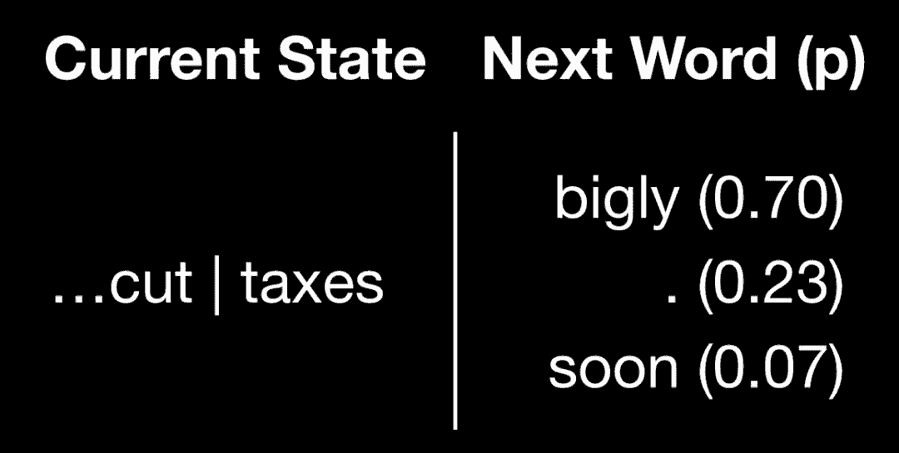

# 教程 |「川言川语」：用神经网络 RNN 模仿特朗普的语言风格

选自 TowardsDataScience

****作者：Leon Zhou****

****机器之心编译****

**参与：Pedro、路**

> 为了获得更多民众的支持，美国总统演讲/发推时使用的语言通常都很「接地气」，而现任总统唐纳德·特朗普则更以「口无遮拦」著称。由于「推特狂魔」已经为我们准备了大量训练数据，现在，我们可以尝试一下如何使用循环神经网络来模仿总统特朗普的语言风格。

*谁了解最好的词汇？*

> I know words. I have the best words.

在 2015 年 12 月 30 日举行的南卡罗来纳州竞选会上，川普说出了上面这些话。这些「川普主义」的言论使得特朗普的粉丝更加喜欢他，但也使他成为其他人的笑柄。

无论每个人对他的看法如何，川普的说话方式毋庸置疑是十分独特的：他的言语十分随意且无视传统句子结构约束。这类特点使他的讲话十分具有辨识度。

正是这种独特的风格吸引了我，我尝试用机器学习来模仿它：生成看起来或听起来像川普会说的文本。

**数据收集与处理**

要学习川普的说话风格，首先要获取足够多的语言样本。我主要关注两个主要的数据来源。

**Twitter**

*非常规句子结构的例子。*

川普的推特是收集其语言样本最好的地方。川普的独特之处在于他利用推特直接与美国百姓进行交流。此外，作为一名「明星人物」，他的言论已经被收集组织了起来（http://www.trumptwitterarchive.com/），这帮我省去了不少麻烦。一共大约有接近 31000 份推文可供使用。

**总统致辞和演讲**

然而，除了他在网络上表现出的一面，我还想更多地了解他作为总统更加正式的一面。为此，我收集了白宫简报档案提供的相关数据。借助 Python 工具我快速汇总了大约 420 份川普的演讲稿以及评论讲话。文本内容涵盖了各类活动，如与外国政要会面、与国会议员进行会议以及颁奖典礼。

与推特不同的是，虽然每一个字都是由特朗普本人所写或口述的，但这些文本还包含其他政治家或者记者所说的话。将川普所说的话与其他人的区分开来似乎是一项艰巨的任务。

*正则表达式很强大。相信我。*

输入正则表达式，虽然名字听起来很无聊但是功能绝对强大。

正则表达式允许你指定要搜索的模式；此模式可以包含任意数量的特定约束、通配符或其他限制，以保证返回的数据能够满足你的要求。

经过一些试验和调整，我生成了一个复杂的正则表达式，它只返回总统的言论，而不会返回其他的词或注释。

**处理文本还是不处理？这是个问题**

通常处理文本的第一步是对其进行归一化。归一化的程度和复杂度根据需求而变，从简单地删除标点符号或大写字母，到将单词的所有变体规范化为基本形式。工作流示例见：https://towardsdatascience.com/into-a-textual-heart-of-darkness-39b3895ce21e。

然而，对我而言，归一化过程中会丢失的具体特质和模式正是我需要保留的。所以，为了让我生成的文本更加可信和真实，我选择绕过大部分标准归一化工作流程。

**文本生成**

**马尔可夫链**

在深入研究深度学习模型之前，我们先来了解另一种常用的文本生成方法——马尔可夫链。马尔可夫链之前用作生成笑话文本的捷径：比如使用马尔可夫链基于星际迷航（https://twitter.com/captain_markov?lang=en）、辛普森一家（https://github.com/cshenton/simpsons_markov）剧本生成文本等实例。

马尔可夫链是快速且粗糙的，它只关注当前的词，以确定接下来的词是什么。这种算法每次只关注当前的词以及接下来可能会出现的词。下一个词是随机选择的，其概率与频率成正比。下面用一个简单的例子来说明：

*简化的马尔可夫链例子，其中接着「taxes」出现的可以是「bigly」、「soon」或者句号。*

现实生活中，如果川普说「taxes」一词，70％ 的情况下他会在说完「taxes」后接着说「bigly」，而马尔可夫链 70% 的情况下会选择「bigly」作为下一个词。但有时候，他不会说「bigly」。有时他会结束句子，或者选择另一个词接在后面。马尔可夫链很可能会选择「bigly」，但它也有可能选择其他可选的选项，这为生成的文本引入了一些不确定因素。

之后马尔可夫链可能会不断的生成下去，或者直到句子结束才停止。

对于快速且随机的应用场景，马尔可夫链可能非常适用，但是它一旦出错也很容易看出来。由于马尔可夫链只关心当前的单词，因此它生成的句子很容易跑偏。一个一开始讨论国内经济的句子可能结束的时候在讨论《谁是接班人》。

使用我有限的文本数据集，马尔可夫链的大部分输出是无意义的。但偶尔也会有「灵光一现」：

*用推文训练马尔可夫链所生成的句子（种子词为「FBI」）。*

**循环神经网络**

然而如果要训练得到更加真实的文本，需要一些更复杂的算法。循环神经网络（RNN）已经成为许多文本或基于序列的应用的首选架构。RNN 的详细内部工作原理不在本文的讨论范围之内。

这些神经元的显著特征是它们具有各种内部「记忆」。单词的选择和语法很大程度上依赖于上下文，而这些「记忆」能够跟踪时态、主语和宾语等，这对生成连贯的句子是非常有用的。

这类网络的缺点是它们的计算量非常大，在笔记本电脑上用模型将我的文本数据训练一次要一个多小时，考虑到要这样训练大约 200 次，这类网络不是很友好。

这里就需要云计算大展身手了。许多成熟的科技公司提供云服务，其中最大的是亚马逊、谷歌和微软。在需要大量 GPU 计算的实例中，之前需要一个小时的过程缩减为九十秒，时间减少大约四十倍！

**评估**

你能判断这个句子是川普说的还是 RNN 生成的吗？

> California finally deserves a great Government to Make America Great Again! #Trump2016

这是从「特朗普对共和党州长候选人的支持」推文（https://twitter.com/realDonaldTrump/status/997597940444221440）中生成的文本，但它可能会被当作特朗普在 2016 年大选前发布的推文。

我所实现的复杂版本的神经网络（在循环层之前和之后有隐藏的全连接层）能够在种子为 40 个或小于 40 个字符的情况下生成内部连贯的文本。

> I want them all to get together and I want people that can look at the farms.
> 
> China has agreed to buy massive amounts of the world—and stop what a massive American deal.

而简化版本的网络在连贯性方面有所欠缺，但仍然能够捕捉到特朗普总统讲话的语言风格：

> Obama. We'll have a lot of people that do we—okay? I'll tell you they were a little bit of it.

**结语**

虽然没能一直产生足以欺骗你我的文本，但这种尝试让我看到了 RNN 的力量。简而言之，这些网络学习了拼写、语法的某些方面，以及在特定情况下如何使用井号标签和超链接。 

该项目的 GitHub 链接：https://github.com/tetrahydrofuran/presidential-rnn

*参考原文：https://towardsdatascience.com/the-best-words-cf6fc2333c31*

****本文为机器之心编译，**转载请联系本公众号获得授权****。**

✄------------------------------------------------

**加入机器之心（全职记者 / 实习生）：hr@jiqizhixin.com**

**投稿或寻求报道：**content**@jiqizhixin.com**

**广告 & 商务合作：bd@jiqizhixin.com**