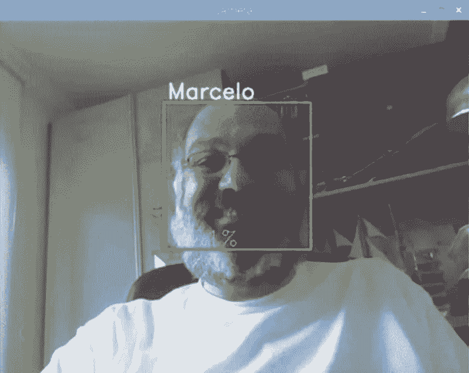

# 超有趣！手把手教你使用树莓派实现实时人脸检测

选自 hackster

**作者：MJRoBot**

**机器之心编译**

> 本文介绍了如何在树莓派上，使用 OpenCV 和 Python 完成人脸检测项目。该项目不仅描述了识别人脸所需要的具体步骤，同时还提供了很多扩展知识。此外，该项目并不需要读者了解详细的人脸识别理论知识，因此初学者也能轻松跟着步骤实现。

**项目所需设备**

硬件：

*   树莓派 3 Model B；

*   树莓派摄像头模块（PiCam）。

语言和库：

*   OpenCV

*   Python 3

**步骤**

本文主要讲述如何使用 PiCam 实现实时人脸识别，如下图所示：



*本教程使用 OpenCV 完成，一个神奇的「开源计算机视觉库」，并主要关注树莓派（因此，操作系统是树莓派系统）和 Python，但是我也在 Mac 电脑上测试了代码，同样运行很好。OpenCV 具备很强的计算效率，且专门用于实时应用。因此，它非常适合使用摄像头的实时人脸识别。要创建完整的人脸识别项目，我们必须完成 3 个阶段：*

1）人脸检测和数据收集；

2）训练识别器；

3）人脸识别。

如下图所示：


**第 1 步：材料清单**

主件：

*   树莓派 V3：283 RMB（淘宝）

*   500 万像素 1080p 传感器 OV5647 迷你摄像头模块：83 RMB（淘宝）

### 

**第 2 步：安装 OpenCV 3 包** 
我使用的是更新了最新版树莓派系统（Stretch）的树莓派 V3，因此安装 OpenCV 的最佳方式是按照 Adrian Rosebrock 写的教程来进行：《Raspbian Stretch: Install OpenCV 3 + Python on your Raspberry Pi》。经过几次尝试后，我觉得 Adrian 的教程最好，建议按照该教程一步步来安装。

完成上述教程之后，你应该安装好了 OpenCV 虚拟环境，可用于在树莓派设备上运行本次实验。

我们来到虚拟环境，确认 OpenCV 3 已经正确安装。

Adrian 推荐在每次打开新的终端时都运行命令行「source」，以确保系统变量都得到正确设置。

```py
source ~/.profile

```

然后，我们进入虚拟环境：

```py
workon cv

```

如果你看到 (cv) 出现在提示符之前，那么你就进入了 cv 虚拟环境：

```py
(cv) pi@raspberry:~$

```

> Adrian 希望大家注意 cv Python 虚拟环境是完全独立的，且与 Raspbian Stretch 中包含的默认 Python 版本彼此隔绝。因此，全局站点包目录中的任意 Python 包对于 cv 虚拟环境而言都是不可用的。类似地，cv 站点包中的任意 Python 包对于全局 Python 包安装也都是不可用的。

现在，进入 Python 解释器：

```py
python

```

确认你正在运行 3.5（或以上）版本。

在解释器内部（将出现>>>），导入 OpenCV 库：

```py
import cv2

```

如果没有错误信息，则 OpenCV 已在你的 Python 虚拟环境中正确安装。

你还可以检查已安装的 OpenCV 版本：

```py
cv2.__version__

```

将会出现 3.3.0（或未来有可能发布更高版本）。


上面的终端截图显示了以上步骤。

### 

**第 3 步：测试摄像头**

在树莓派上安装 OpenCV 之后，我们测试一下，以确认摄像头正常运转。假设你已经在树莓派上安装了 PiCam。

在 IDE 中输入下列 Python 代码：

```py
import numpy as np
import cv2
cap = cv2.VideoCapture(0)
cap.set(3,640) # set Width
cap.set(4,480) # set Height
while(True):
    ret, frame = cap.read()
    frame = cv2.flip(frame, -1) # Flip camera vertically
    gray = cv2.cvtColor(frame, cv2.COLOR_BGR2GRAY)

    cv2.imshow('frame', frame)
    cv2.imshow('gray', gray)

    k = cv2.waitKey(30) & 0xff
    if k == 27: # press 'ESC' to quit
        break
cap.release()
cv2.destroyAllWindows()

```

上面的代码可捕捉 PiCam 生成的视频流，用 BGR 颜色和灰色模式展示。

> 注意：我按照组装方式垂直旋转了摄像头。如果你的情况并非如此，那么注释或删除「flip」命令行。

你还可以从我的 GitHub 下载代码：https://github.com/Mjrovai/OpenCV-Object-Face-Tracking/blob/master/simpleCamTest.py

输入下面的命令行，开始执行：

```py
python simpleCamTest.py

```

要完成该程序，你必须在键盘上按 [ESC] 键。在按 [ESC] 键之前，先鼠标点击视频窗口。


上图展示了结果。

想更多地了解 OpenCV，请查看该教程：https://pythonprogramming.net/loading-video-python-opencv-tutorial/

**第 4 步：人脸检测**

人脸识别的最基础任务是「人脸检测」。你必须首先「捕捉」人脸（第 1 阶段）才能在未来与捕捉到的新人脸对比时（第 3 阶段）识别它。

最常见的人脸检测方式是使用「Haar 级联分类器」。使用基于 Haar 特征的级联分类器的目标检测是 Paul Viola 和 Michael Jones 2001 年在论文《Rapid Object Detection using a Boosted Cascade of Simple Features》中提出的一种高效目标检测方法。这种机器学习方法基于大量正面、负面图像训练级联函数，然后用于检测其他图像中的对象。这里，我们将用它进行人脸识别。最初，该算法需要大量正类图像（人脸图像）和负类图像（不带人脸的图像）来训练分类器。然后我们需要从中提取特征。好消息是 OpenCV 具备训练器和检测器。如果你想要训练自己的对象分类器，如汽车、飞机等，你可以使用 OpenCV 创建一个。

详情参见：https://docs.opencv.org/3.3.0/dc/d88/tutorial_traincascade.html。

如果不想创建自己的分类器，OpenCV 也包含很多预训练分类器，可用于人脸、眼睛、笑容等的检测。相关的 XML 文件可从该目录下载：https://github.com/Itseez/opencv/tree/master/data/haarcascades。

下面，我们就开始用 OpenCV 创建人脸检测器吧！

从我的 GitHub 下载文件 faceDetection.py：https://github.com/Mjrovai/OpenCV-Face-Recognition/blob/master/FaceDetection/faceDetection.py。

```py
import numpy as np
import cv2
faceCascade = cv2.CascadeClassifier('Cascades/haarcascade_frontalface_default.xml')
cap = cv2.VideoCapture(0)
cap.set(3,640) # set Width
cap.set(4,480) # set Height
while True:
    ret, img = cap.read()
    img = cv2.flip(img, -1)
    gray = cv2.cvtColor(img, cv2.COLOR_BGR2GRAY)
    faces = faceCascade.detectMultiScale(
        gray,     
        scaleFactor=1.2,
        minNeighbors=5,     
        minSize=(20, 20)
    )
    for (x,y,w,h) in faces:
        cv2.rectangle(img,(x,y),(x+w,y+h),(255,0,0),2)
        roi_gray = gray[y:y+h, x:x+w]
        roi_color = img[y:y+h, x:x+w]  
    cv2.imshow('video',img)
    k = cv2.waitKey(30) & 0xff
    if k == 27: # press 'ESC' to quit
        break
cap.release()
cv2.destroyAllWindows()

```

使用 Python 和 OpenCV 执行人脸检测，上面的几行代码就足够了。注意下面的代码：

```py
faceCascade = cv2.CascadeClassifier('Cascades/haarcascade_frontalface_default.xml')

```

这行代码可以加载「分类器」（必须在项目文件夹下面的 Cascades/目录中）。然后，我们在在循环内部调用摄像头，并以 grayscale 模式加载我们的输入视频。现在，我们必须调用分类器函数，向其输入一些非常重要的参数，如比例因子、邻近数和人脸检测的最小尺寸。

```py
faces = faceCascade.detectMultiScale(
        gray,     
        scaleFactor=1.2,
        minNeighbors=5,     
        minSize=(20, 20)
    )

```

其中：

*   gray 表示输入 grayscale 图像。

*   scaleFactor 表示每个图像缩减的比例大小。

*   minNeighbors 表示每个备选矩形框具备的邻近数量。数字越大，假正类越少。

*   minSize 表示人脸识别的最小矩形大小。

该函数将检测图像中的人脸。接下来，我们必须「标记」图像中的人脸，比如，用蓝色矩形。使用下列代码完成这一步：

```py
for (x,y,w,h) in faces:
    cv2.rectangle(img,(x,y),(x+w,y+h),(255,0,0),2)
    roi_gray = gray[y:y+h, x:x+w]
    roi_color = img[y:y+h, x:x+w] 

```

如果已经标记好人脸，则函数将检测到的人脸的位置返回为一个矩形，左上角 (x,y)，w 表示宽度，h 表示高度 ==> (x,y,w,h)。详见下图。


得到这些位置信息后，我们可以为人脸创建一个「感兴趣区域」（绘制矩形），用 imshow() 函数呈现结果。使用树莓派终端，在你的 Python 环境中运行上面的 Python 脚本：

```py
python faceDetection.py

```

结果如下：


你也可以加入诸如「眼睛检测」甚至「微笑检测」这样的检测器。在那些用例中，你需要把分类器函数和矩形框内加入原有的面部识别区域中，因为在区域外进行识别没有意义。

> 注意，在树莓派上，分类方法（HaarCascades）会消耗大量算力，所以在同一代码中使用多个分类器将会显著减慢处理速度。在台式机上运行这些算法则非常容易。

在我的 GitHub 上你可以看到另外的例子：

*   faceEyeDetection.py

*   faceSmileDetection.py

*   faceSmileEyeDetection.py

在下图中，你可以看到我们的结果：


要想深入理解面部识别，可以参考这一教程：https://pythonprogramming.net/haar-cascade-face-eye-detection-python-opencv-tutorial/

**第 5 步：收集数据**

我推荐各位读者可以查看以下两个关于人脸识别的教程：

*   使用 OpenCV 和 Python 从头实现人脸识别：https://www.superdatascience.com/opencv-face-recognition/

*   理解人脸识别：https://thecodacus.com/category/opencv/face-recognition/

现在，我们项目的第一步是创建一个简单的数据集，该数据集将储存每张人脸的 ID 和一组用于人脸检测的灰度图。


因此，以下命令行将为我们的项目创建一个目录，目录名可以如以下为 FacialRecognitionProject 或其它：

```py
mkdir FacialRecognitionProject

```

在该目录中，除了我们为项目创建的 3 个 Python 脚本外，我们还需要储存人脸分类器。我们可以从 GitHub 中下载：haarcascade_frontalface_default.xml。

下一步需要创建一个子目录「dtatset」，并用它来储存人脸样本：

```py
mkdir dataset

```

然后从我的 GitHub 中下载代码 01_face_dataset.py。

```py
import cv2
import os
cam = cv2.VideoCapture(0)
cam.set(3, 640) # set video width
cam.set(4, 480) # set video height
face_detector = cv2.CascadeClassifier('haarcascade_frontalface_default.xml')
# For each person, enter one numeric face id
face_id = input('\n enter user id end press <return> ==>  ')
print("\n [INFO] Initializing face capture. Look the camera and wait ...")
# Initialize individual sampling face count
count = 0
while(True):
    ret, img = cam.read()
    img = cv2.flip(img, -1) # flip video image vertically
    gray = cv2.cvtColor(img, cv2.COLOR_BGR2GRAY)
    faces = face_detector.detectMultiScale(gray, 1.3, 5)
    for (x,y,w,h) in faces:
        cv2.rectangle(img, (x,y), (x+w,y+h), (255,0,0), 2)     
        count += 1
        # Save the captured image into the datasets folder
        cv2.imwrite("dataset/User." + str(face_id) + '.' + str(count) + "-fs8.png", gray[y:y+h,x:x+w])
        cv2.imshow('image', img)
    k = cv2.waitKey(100) & 0xff # Press 'ESC' for exiting video
    if k == 27:
        break
    elif count >= 30: # Take 30 face sample and stop video
         break
# Do a bit of cleanup
print("\n [INFO] Exiting Program and cleanup stuff")
cam.release()
cv2.destroyAllWindows()

```

上述的代码和人脸识别的代码非常像，我们只是添加了一个「input command」来捕捉用户 ID（整数）。

```py
face_id = input('\n enter user id end press  ==>  ')

```

对于每一个捕捉的帧，我们应该在「dataset」目录中保存为文档：

```py
cv2.imwrite("dataset/User." + str(face_id) + '.' + str(count) + "-fs8.png", gray[y:y+h,x:x+w])

```

对于保存上述文件，我们需要导入「os」库，每一个文件的名字都服从以下结构：

```py
User.face_id.count-fs8.png

```

例如，对于 face_id = 1 的用户，dataset/ 目录下的第四个样本文件名可能为：

```py
User.1.4-fs8.png

```

在我的树莓派中，该图像可以打开为：


在我的代码中，我从每一个 ID 捕捉 30 个样本，我们能在最后一个条件语句中修改抽取的样本数。如果我们希望识别新的用户或修改已存在用户的相片，我们就必须以上脚本。

**第六步：训练**

在第二阶段中，我们需要从数据集中抽取所有的用户数据，并训练 OpenCV 识别器，这一过程可由特定的 OpenCV 函数直接完成。这一步将在「trainer/」目录中保存为.yml 文件。


所以，下面开始创建子目录以储存训练数据：

```py
mkdir trainer

```

从我的 GitHub 中下载第二个 Python 脚本：02_face_training.py。

```py
import cv2
import numpy as np
from PIL import Image
import os
# Path for face image database
path = 'dataset'
recognizer = cv2.face.LBPHFaceRecognizer_create()
detector = cv2.CascadeClassifier("haarcascade_frontalface_default.xml");
# function to get the images and label data
def getImagesAndLabels(path):
    imagePaths = [os.path.join(path,f) for f in os.listdir(path)]     
    faceSamples=[]
    ids = []
    for imagePath in imagePaths:
        PIL_img = Image.open(imagePath).convert('L') # convert it to grayscale
        img_numpy = np.array(PIL_img,'uint8')
        id = int(os.path.split(imagePath)[-1].split(".")[1])
        faces = detector.detectMultiScale(img_numpy)
        for (x,y,w,h) in faces:
            faceSamples.append(img_numpy[y:y+h,x:x+w])
            ids.append(id)
    return faceSamples,ids
print ("\n [INFO] Training faces. It will take a few seconds. Wait ...")
faces,ids = getImagesAndLabels(path)
recognizer.train(faces, np.array(ids))
# Save the model into trainer/trainer.yml
recognizer.write('trainer/trainer.yml') # recognizer.save() worked on Mac, but not on Pi
# Print the numer of faces trained and end program
print("\n [INFO] {0} faces trained. Exiting Program".format(len(np.unique(ids))))
```

确定在 Rpi 中已经安装了 PIL 库，如果没有的话，在终端运行以下命令：

```py
pip install pillow

```

我们将使用 LBPH（LOCAL BINARY PATTERNS HISTOGRAMS）人脸识别器，它由 OpenCV 提供：

```py
recognizer = cv2.face.LBPHFaceRecognizer_create()

```

函数「getImagesAndLabels (path)」将抽取所有在目录「dataset/」中的照片，并返回 2 个数组：「Ids」和「faces」。通过将这些数组作为输入，我们就可以训练识别器。

```py
recognizer.train(faces, ids)

```

在训练过后，文件「trainer.yml」将保存在我们前面定义的 trainer 目录下。此外，我们还在最后使用了 print 函数以确认已经训练的用户面部数量。

**第 7 步：识别器**

这是该项目的最后阶段。这里，我们将通过摄像头捕捉一个新人脸，如果这个人的面孔之前被捕捉和训练过，我们的识别器将会返回其预测的 id 和索引，并展示识别器对于该判断有多大的信心。


让我们从 GitHub 03_face_recognition.py 上下载第三阶段的 python 脚本。

```py
import cv2
import numpy as np
import os 
recognizer = cv2.face.LBPHFaceRecognizer_create()
recognizer.read('trainer/trainer.yml')
cascadePath = "haarcascade_frontalface_default.xml"
faceCascade = cv2.CascadeClassifier(cascadePath);
font = cv2.FONT_HERSHEY_SIMPLEX
#iniciate id counter
id = 0
# names related to ids: example ==> Marcelo: id=1,  etc
names = ['None', 'Marcelo', 'Paula', 'Ilza', 'Z', 'W'] 
# Initialize and start realtime video capture
cam = cv2.VideoCapture(0)
cam.set(3, 640) # set video widht
cam.set(4, 480) # set video height
# Define min window size to be recognized as a face
minW = 0.1*cam.get(3)
minH = 0.1*cam.get(4)
while True:
    ret, img =cam.read()
    img = cv2.flip(img, -1) # Flip vertically
    gray = cv2.cvtColor(img,cv2.COLOR_BGR2GRAY)

    faces = faceCascade.detectMultiScale( 
        gray,
        scaleFactor = 1.2,
        minNeighbors = 5,
        minSize = (int(minW), int(minH)),
       )
    for(x,y,w,h) in faces:
        cv2.rectangle(img, (x,y), (x+w,y+h), (0,255,0), 2)
        id, confidence = recognizer.predict(gray[y:y+h,x:x+w])
        # Check if confidence is less them 100 ==> "0" is perfect match 
        if (confidence < 100):
            id = names[id]
            confidence = "  {0}%".format(round(100 - confidence))
        else:
            id = "unknown"
            confidence = "  {0}%".format(round(100 - confidence))

        cv2.putText(img, str(id), (x+5,y-5), font, 1, (255,255,255), 2)
        cv2.putText(img, str(confidence), (x+5,y+h-5), font, 1, (255,255,0), 1)  

    cv2.imshow('camera',img) 
    k = cv2.waitKey(10) & 0xff # Press 'ESC' for exiting video
    if k == 27:
        break
# Do a bit of cleanup
print("\n [INFO] Exiting Program and cleanup stuff")
cam.release()
cv2.destroyAllWindows()

```

这里我们包含了一个新数组，因此我们将会展示「名称」，而不是编号的 id：

```py
names = ['None', 'Marcelo', 'Paula', 'Ilza', 'Z', 'W']

```

所以，如上所示的列表，Marcelo 的 ID 或索引为 1，Paula 的 ID 等于 2。

下一步，我们将检测一张人脸，正如我们在之前的 haasCascade 分类器中所做的那样。

```py
id, confidence = recognizer.predict(gray portion of the face)

```

recognizer.predict () 将把待分析人脸的已捕捉部分作为一个参数，并返回其可能的所有者，指示其 id 以及识别器与这一匹配相关的置信度。

> 注意，如果匹配是完美的，置信度指数将返回「零」。

最后，如果识别器可以预测人脸，我们将在图像上放置一个文本，带有可能的 id，以及匹配是否正确的概率（概率=100 - 置信度指数）。如果没有，则把「未知」的标签放在人脸上。

下面是这一结果的图片：


在这张图像上，我展示了一些由该项目完成的测试，其中我也使用图像验证识别器是否有效。


**第 8 步：结语**


我希望该项目能帮助其他人发现更好玩的项目，也希望有助于各位读者实现自己的人脸识别应用。

更多详细的代码请查看 GitHub 地址：https://github.com/Mjrovai/OpenCV-Face-Recognition

参考阅读：

[机器之心实操 | 亚马逊详解如何使用 MXNet 在树莓派上搭建实时目标识别系统](https://mp.weixin.qq.com/s?__biz=MzA3MzI4MjgzMw==&mid=2650728605&idx=1&sn=38451fe201d44bef51684ac7ab5a7173&scene=21#wechat_redirect)

[教程 | BerryNet：如何在树莓派上实现深度学习智能网关](https://mp.weixin.qq.com/s?__biz=MzA3MzI4MjgzMw==&mid=2650726048&idx=3&sn=bd73de47cd65a1772c2df027cabd6a5c&scene=21#wechat_redirect)

*原文链接：https://www.hackster.io/mjrobot/real-time-face-recognition-an-end-to-end-project-a10826*

****本文为机器之心编译，**转载请联系本公众号获得授权****。**

✄------------------------------------------------

**加入机器之心（全职记者/实习生）：hr@jiqizhixin.com**

**投稿或寻求报道：editor@jiqizhixin.com**

**广告&商务合作：bd@jiqizhixin.com**