# 教程 | 用 Python 实现类 FaceID 的人脸识别？一文告诉你该怎么做

选自 Medium

**作者：Norman Di Palo**

**机器之心编译**

**参与：路雪**

> 本文介绍了如何使用 Python 在 Keras 框架上实现 FaceID，对 iPhone X 这一新解锁机制进行了反向工程和概念验证。想知道 FaceID 背后人脸识别模块的原理，想自己动手实现带人脸深度特征的网络，不妨阅读此文。

GitHub 地址：https://github.com/normandipalo/faceID_beta

人们对 iPhone X 讨论最多的一个功能就是最新的解锁方式，TouchID 的接替者：FaceID。

随着苹果手机边框面积的减少，苹果公司必须开发一种更便捷、快速的新型解锁方式。尽管一些竞争者继续使用指纹传感器，但是苹果决定创新，革新手机解锁方式：即只需要看一眼它。借助于改进（虽然微小）的前置深度相机，iPhone X 为用户面部创建了一个 3D 映射图。此外，用户人脸照片会通过红外摄像机捕捉，该摄像机对环境的光线、颜色变化具备更强的鲁棒性。使用深度学习，智能手机可以非常细致地了解用户面部，从而能在用户每次拿起手机时快速识别用户。令人惊讶的是，苹果称此方法比 TouchID 更安全，误差率低至 1:1,000,000。

我对苹果实现 FaceID 的技术非常感兴趣，尤其是它在移动设备端完美运行的原理。FaceID 只需要对用户面部进行稍微的初始训练，即可在用户每次拿起手机时流畅运行。我使用深度学习研究了该流程以及如何优化每一步。本文将展示如何使用 Keras 实现一个类似 FaceID 的算法。我将对采用的多个架构决策作出解释，并展示一些最终实验（实验使用 Kinect 完成，Kinect 是一个流行的 RGB + 深度相机），实验输出与 iPhone X 前置摄像头类似，不过实验使用的设备比 iPhone X 大一些。下面我们开始对苹果这一变革性功能进行反向工程吧。

**了解 FaceID**

> 「主导 FaceID 的神经网络不只执行分类任务。」

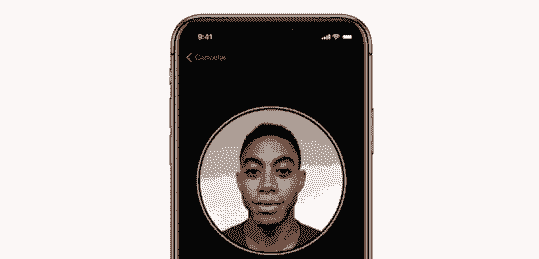

*FaceID 设置流程*

第一步：仔细分析 FaceID 在 iPhone X 上的运行原理。苹果的 FaceID 白皮书（https://images.apple.com/business/docs/FaceID_Security_Guide.pdf）可以帮助我们理解 FaceID 的基本机制。使用 TouchID 时，用户必须先通过多次按压指纹传感器来注册自己的指纹。在大约 15–20 次按压之后，手机完成指纹注册，TouchID 可以使用。类似地，使用 FaceID 时，用户必须先注册自己的脸。注册过程很简单：用户只需正常看着手机，缓慢转动头部一圈，这样可以注册面部的不同姿势。这样注册过程就结束了，用户可以使用 FaceID 解锁手机。快速的注册过程向我们提示了很多底层学习算法。例如主导 FaceID 的神经网络不只执行分类任务，我会在下文中解释原因。

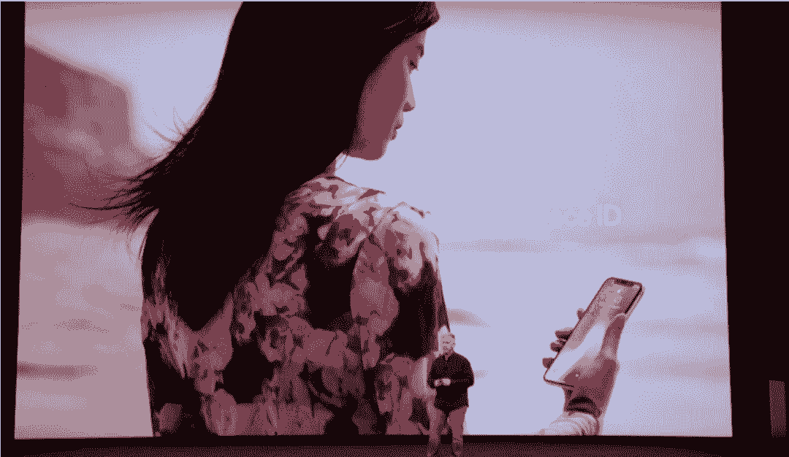

*苹果介绍 iPhone X 和 FaceID 的 Keynote。*

执行分类任务对神经网络而言意味着学习预测它看到的人脸是否属于用户。因此，它应该使用一些训练数据来预测「正类」「负类」。但是与大量深度学习应用案例不同，该方法不适用于人脸识别。如果将该方法应用于人脸识别，那么首先神经网络应该使用新获取的用户面部数据从头开始重新训练，这要求大量时间、能耗，以及获取不同人脸的训练数据作为负样本（而这是不切实际的），迁移学习和对训练好的模型进行精细调整也都需要这些。此外，该方法无法利用这一优势：即苹果公司可以「离线」训练更复杂的网络，即在实验室训练好，然后部署到手机上，即装即用。我认为 FaceID 主要使用是一种类似孪生神经网络的架构，苹果公司「离线」训练该网络，然后将人脸映射至低维潜在空间，以最大化不同人面部之间的差距，该网络使用对比损失（contrastive loss）。正如苹果在 Keynote 中展示的那样，这样你就获得了一个可执行一次学习的架构。

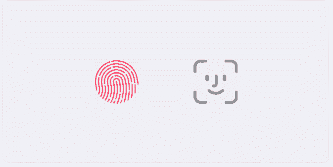

*FaceID 似乎是 TouchID 之后的新标准。苹果会将这一功能应用到所有新设备中吗？*

**使用神经网络将面部数值化**

孪生神经网络基本上由两个一样的神经网络构成，二者共享所有权重。该架构可以学习计算特定数据类型之间的距离，如图像。即你将成对数据输入孪生神经网络中（或者在同一个网络中在两个不同的步中输入数据），该网络将数据映射至低维特征空间（类似 n 维数组），然后训练该网络使不同类别的数据点距离尽可能地远，同一类别的数据点尽可能地近。在长时间运行中，该网络将学习提取数据中最有意义的特征，并将其压缩成数组，创建一个有意义的映射。为了对该过程有一个直观的理解，你可以想象一下使用小向量描述犬种使类似的犬具备更接近的向量。你可能使用一个数字来编码皮毛颜色，一个数字表示大小，另一个数字表示毛皮长度等等。很聪明，对吧？孪生神经网络可以学会这么做，类似自编码器。

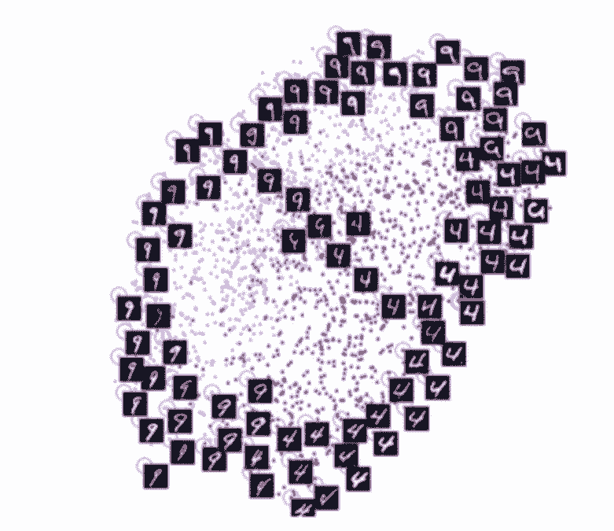

*图源：论文《Dimensionality Reduction by Learning an Invariant Mapping》（Hadsell、Chopra、LeCun）。注意该架构如何学习手写数字图像之间的相似性，如何自动将其进行二维分组。类似的技术可应用于人脸。*

使用该技术，我们可以使用大量人脸数据训练类似架构，来识别相似度最高的人脸。有足够的预算和算力（像苹果那样），你也可以使用更难的样本训练对对抗攻击（掩码）等具备鲁棒性的网络。那么使用该方法的最终优势在哪里呢？你将拥有一个即插即用的模型，无需训练即可识别不同的用户，只需在初始设置时拍一些照片来计算用户面部在潜在人脸映射空间中的位置。（想象一下，就像写下一只新的狗的犬种向量，然后将它存储在某个地方。）此外，FaceID 能够适应用户的改变：不管是突然的改变（如眼镜、帽子、化妆）还是缓慢的变化（胡须）。这是通过在映射空间中添加参考人脸向量（基于新外表计算得出）来完成的。

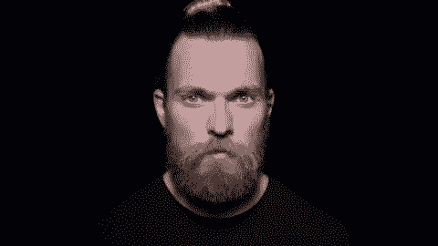

*FaceID 可以在用户面部发生改变时随之进行调整。*

最后，我们来看一下如何在 Keras 中用 Python 实现该网络。

**在 Keras 中实现 FaceID**

所有机器学习项目首先需要的都是数据。创建自己的数据集需要时间和多人写作，难度较大。因此，我在网上找了一个看起来比较合适的 RGB-D 人脸数据集（http://www.vap.aau.dk/rgb-d-face-database/），它由一系列人朝着不同方向、带有不同面部表情的 RGB-D 图像构成，非常适合 iPhone X 的应用场景。

*   最终实现的 GitHub 版本库地址：https://github.com/normandipalo/faceID_beta

*   使用 Colab Notebook 的实验：https://colab.research.google.com/drive/1OynWNoWF6POTcRGFG4V7KW_EGIkUmLYI

我基于 SqueezeNet 架构创建了一个卷积神经网络，将成对的面部 RGB-D 图像（即 4 通道图像）输入网络，输出两个嵌入之间的距离。使用对比损失训练该网络，以最小化同一个人不同图像之间的距离，最大化不同人图像之间的距离。

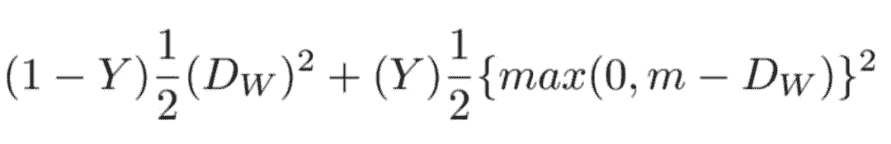

*对比损失*

经过一段时间的训练，该网络能够将人脸映射至 128 维数组，这样同一个人的图像被聚类为一组，而不同人的图像距离较远。这意味着要解锁你的设备，该网络只需计算解锁时输入的图像与注册阶段存储图像之间的距离。如果距离在特定阈值以下（阈值越小，安全性越高），则设备解锁成功。

我使用 t-SNE 算法对 128 维嵌入空间进行二维可视化。每个颜色对应不同的人：如下图所示，该网络学会把同一颜色的图像分到很接近的区域（使用 t-SNE 时，不同簇之间的距离是无意义的）。使用 PCA 降维算法时，可视化图也很有意思。

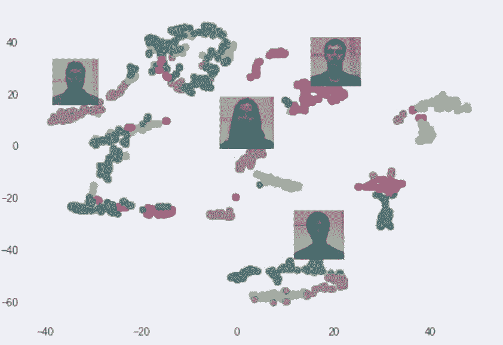

*使用 t-SNE 在嵌入空间中创建的人脸集群。每个颜色代表不同的人脸（不过颜色有重复使用）。*

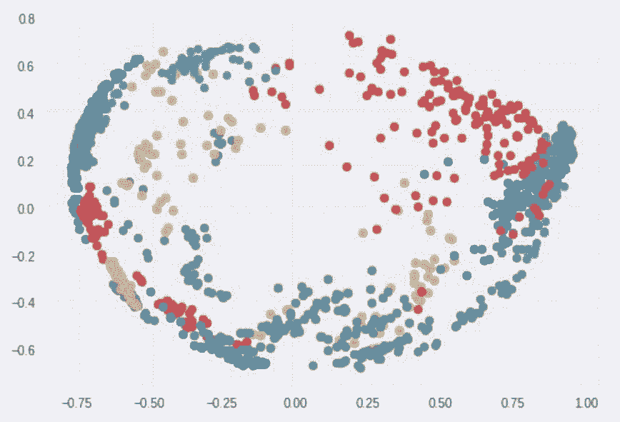

*使用 PCA 在嵌入空间创建的人脸集群。每个颜色代表不同的人脸（不过颜色有重复使用）。*

**实验**

现在我们可以看看该模型的运行效果，使其模拟通常的 FaceID 过程：首先，进行用户面部注册。然后是解锁阶段，从用户解锁（应该会成功）到其他人解锁（不会成功）。如前所述，重点在于该网络计算解锁手机的人脸与注册人脸之间的距离，及其是否低于特定阈值。

首先开始注册：我从数据集中抽取了同一个人的一组照片来模拟注册阶段。设备正在计算每个姿势的嵌入，并存储在本地。

*新用户注册阶段，受 FaceID 注册过程启发。*

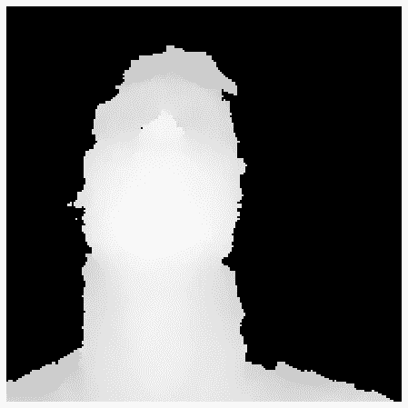

*深度相机看到的注册阶段。*

现在我们来看如果用户尝试解锁设备会发生什么。同一用户的不同姿势和面部表情都达到了极低的距离，平均距离在 0.30 左右。

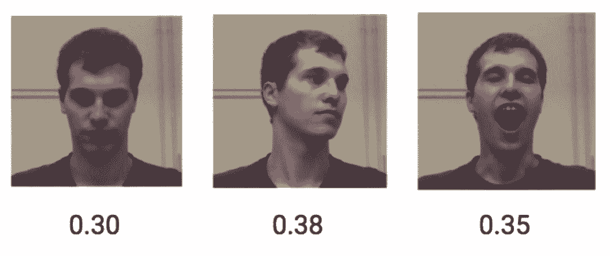

*同一用户在嵌入空间中的人脸距离。*

而不同人的 RGB-D 图像的距离平均值为 1.1。

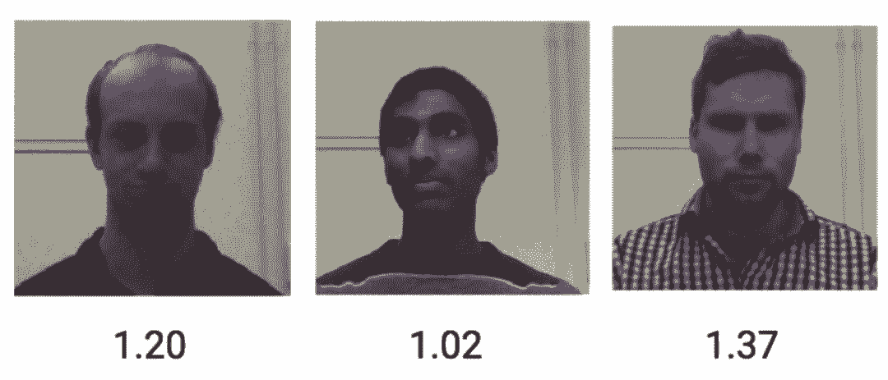

*不同用户在嵌入空间中的人脸距离。*

因此，将阈值设置为 0.4，可以防止陌生人解锁你的设备。

**结论**

本文介绍了如何基于人脸嵌入和孪生卷积网络实现 FaceID 解锁机制的概念验证。希望对大家有所帮助。

*原文地址：https://towardsdatascience.com/how-i-implemented-iphone-xs-faceid-using-deep-learning-in-python-d5dbaa128e1d*

****本文为机器之心编译，**转载请联系本公众号获得授权****。**

✄------------------------------------------------

**加入机器之心（全职记者/实习生）：hr@jiqizhixin.com**

**投稿或寻求报道：editor@jiqizhixin.com**

**广告&商务合作：bd@jiqizhixin.com**