# 教程 | 如何使用 DeepFake 实现视频换脸

机器之心发布

**作者：冯沁原**

> > 不久之前，AV 视频换脸明星的 DeepFake 火了。这篇文章将一步步教你如何实现换脸。
> 
> [`v.qq.com/iframe/preview.html?vid=q0642apt86a&width=500&height=375&auto=0`](https://v.qq.com/iframe/preview.html?vid=q0642apt86a&width=500&height=375&auto=0)
> 
> 如果你是第一次听说 DeepFake，一定要点击上面的视频，亲自感受一下尼古拉斯的脸是如何占据全世界的每一个影片。
> 
> **项目实战**
> 
> 我们要如何实现视频里的变脸呢?
> 
> 因为视频是连续的图片，那么我们只需要把每一张图片中的脸切换了，就能得到变脸的新视频了。那么如何切换一个视频中的图片呢? 这需要我们 首先找到视频中的脸，然后把脸进行切换。我们会发现，变脸这个难题可以拆解成如下的流程。
> 
> 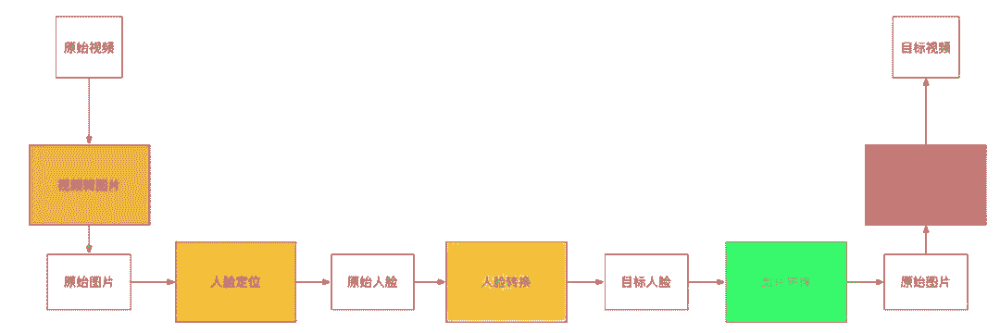
> 
> 于是，在我们会在后续按照这五个步骤进行介绍。
> 
> **视频转图像**
> 
> **FFmpeg**
> 
> FFmpeg 提供了处理音频、视频、字幕和相关源数据的工具库。核心的库包括:
> 
> *   libavcodec 提供了处理编码的能力
>     
>     
> *   libavformat 实现了流协议、容器类型、基本的 I/O 访问 
>     
>     
> *   libavutil 包括哈希、解压缩等多样的功能 
>     
>     
> *   libavfilter 提供了链式修改音频和视频的能力 
>     
>     
> *   libavdevice 提供了对设备访问的抽象 
>     
>     
> *   libswresample 实现了混音等能力 
>     
>     
> *   libswscale 实现了颜色和尺度变换的能力
>     
>     
> 
> 对外主要提供了三个工具:
> 
> *   ffmpeg 用来处理多媒体内容 
>     
>     
> *   ffplay 是一个极简的播放器 
>     
>     
> *   ffprobe 是多媒体内容的分析工具
>     
>     
> 
> 于是，我们的视频转图片的功能，可以通过以下命令来实现，
> 
> ```py
> ffmpeg -i clipname -vf fps=framerate -qscale:v 2 "imagename%04d-fs8.png"
> 
> ```
> 
> 具体来说，上面的指令可以把一个视频，按照固定的频率生成图片。
> 
> **人脸定位 **
> 
> **基本算法**
> 
> 人脸定位是一个相对成熟的领域，主要应用 dlib 库的相关功能。我们虽然可以定制一个人脸识别的算法，但是我们也可以使用已有的通用的人脸识别 的函数库。
> 
> 有两类算法，一类是 HOG 的脸部标记算法。
> 
> 
> 
> *(来源: Facial landmarks with dlib, OpenCV, and Python) *
> 
> 该算法的效果如上图。它将人脸分成了如下的区域:
> 
> *   眼睛 (左/右)
>     
>     
> *   眉毛 (左/右)
>     
>     
> *   鼻子
>     
>     
>     
> *   嘴
>     
>     
> *   下巴 
>     
>     
> 
> 基于这些标记，我们不仅能够进行后续的换脸，也能检测脸的具体形态，眨眼状态等。例如，我们可以把这些点连在一起，得到更多的特征。
> 
> 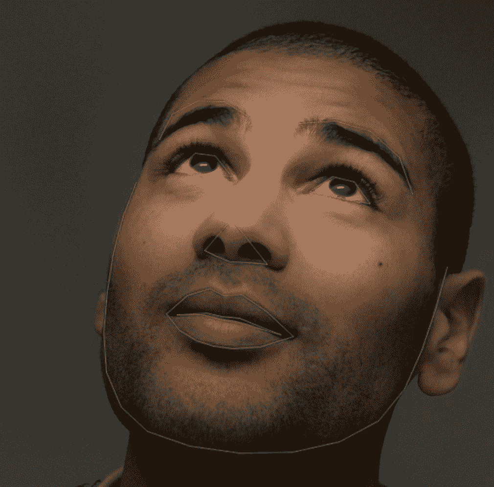
> 
> *(来源: Real-Time Face Pose Estimation ) *
> 
> 寻找脸部标记是一个预测问题，输入是一张图片和兴趣区域，输出是兴趣区域的关键点。
> 
> HOG 是如何找到人脸的呢? 这是一个通用的检测算法:
> 
> *   从数据集中找到正样本，并且计算 HOG 描述 
>     
>     
> *   从数据集中找到负样本，并且计算 HOG 描述 
>     
>     
> *   基于 HOG 的描述使用分类算法 
>     
>     
> *   在负样本上在不同的起点和尺度进行分类，并且找到误判的 HOG 
>     
>     
> *   基于上一步的负样本，对模型进行重新的训练
>     
>     
> 
> 这里有个问题，如何计算 HOG 的描述呢? 我们可以计算每个点的亮度，然后把每个点表示为指向更黑的方向的向量。如下图所示:
> 
> 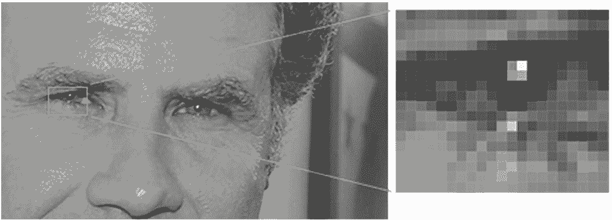
> 
> * (来源: Machine Learning is Fun! Part 4: Modern Face Recognition with Deep Learning )*
> 
> 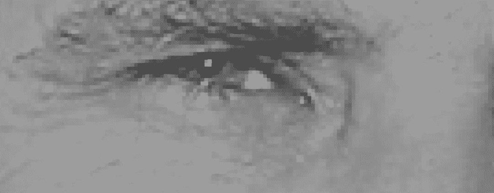
> 
> * (来源: Machine Learning is Fun! Part 4: Modern Face Recognition with Deep Learning )*
> 
>  我们为什么要这么做呢? 因为每个点的绝对值会受到环境的影响，但是相对值则比较稳定。因此，我们通过梯度变化的表示，能够准备出高质量的数据。当然，我们也可以进一步的把相邻的点聚合在一起，从而产生更有代表性的数据。
> 
> 现在可以进行检测了
> 
> *   首先在新的图片上基于不同的起点和尺度寻找可行的区间；
>     
>     
> *   基于非极大抑制的方法来减少冗余和重复的，下图就是一个有冗余和去除冗余的情况，这个方法说白了就是找一个最大概率的矩阵去覆盖掉和它过于重合的矩阵，并且不断重复这个过程。
>     
>     
> 
> 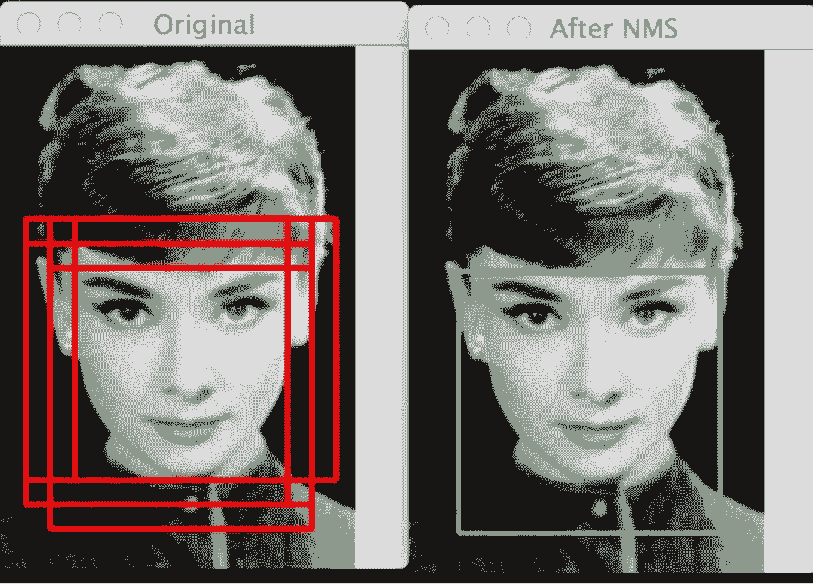
> 
> *  (来源: Histogram of Oriented Gradients and Object Detection)*
> 
> 有了轮廓之后，我们可以找到脸部标记。寻找脸部标记的算法是基于《One Millisecond Face Alignment with an Ensemble of Regression Trees》的论文。简单来说，它利用了已经标记好的训练集来训练一个回归树的组合，从而用来预测。
> 
> 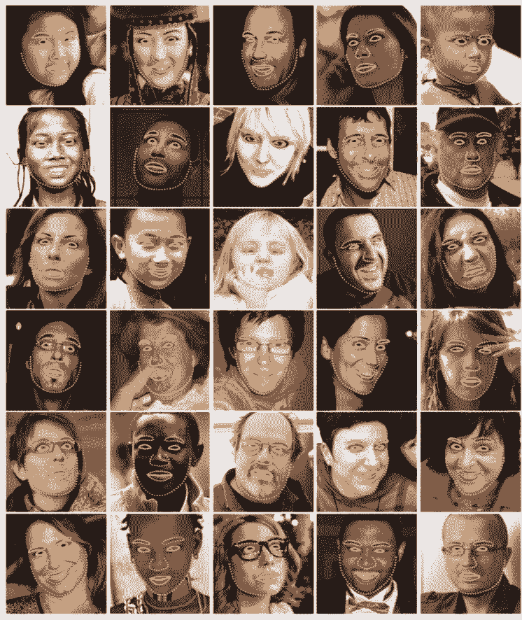
> 
> * (来源: One Millisecond Face Alignment with an Ensemble of Regression Trees) *
> 
> 在这个基础上，就能够标记出这 68 个点。
> 
> 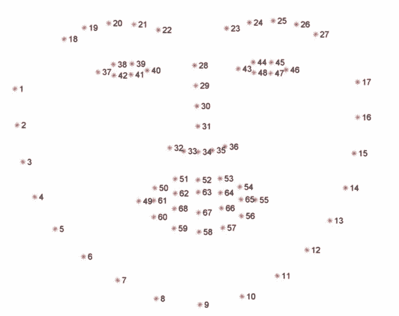
> 
> * (来源: Facial landmarks with dlib, OpenCV, and Python ) *
> 
> 基于人脸的 68 个标记的坐标，可以计算人脸的⻆度，从而抠出摆正后的人脸。但是 dlib 要求识别的必须是全脸，因此会减少我们的样本集以及一些特定的样本场景。同时，因为人脸是 64*64 像素的尺寸，因此也要处理清晰度的问题。
> 
> 另一种方法是用 CNN 训练一个识别脸部的模型。CNN 能够检测更多的⻆度，但是需要更多的资源，并且可能在大文件上失效。
> 
> **数据准备**
> 
> 我们的目标是把原始人脸转换为目标人脸，因此我们需要收集原始人脸的图片和目标人脸的图片。如果你选择的是一个名人，那么可以直接用 Google image 得到你想要的图片。虽然视频中的图片也能用，但是也可以收集一些多样的数据。当然，我用的是我和我老婆的图片，因此直接从我 们的 Photo 中导出即可。当人脸数据生成后，最好仔细检查一下，避免不应该的脸或者其它的东东出现在你的训练集中。
> 
> **extract.py**
> 
> Deepfake 用于定位人脸的算法如下:
> 
> ```py
> import cv2 # 开源的计算机视觉库
> 
> from pathlib import Path # 提供面向对象方式的文件访问
> from tqdm import tqdm # 提供进度条显示功能
> import os # 提供操作系统相关的访问
> import numpy as np # 提供科学计算相关的功能
> 
> from lib.cli import DirectoryProcessor, rotate_image # 处理一个目录的文件，然后保存到新的目录中；旋转图片，其实是在 utils 中
> from lib.utils import get_folder # 获得一个 folder，不存在则创建
> from lib.multithreading import pool_process # 多进程并发计算
> from lib.detect_blur import is_blurry # 判断图片是否模糊
> from plugins.PluginLoader import PluginLoader # 加载对应的算法
> 
> class ExtractTrainingData(DirectoryProcessor): # 从训练集提取头像
>     def create_parser(self, subparser, command, description):
>         self.optional_arguments = self.get_optional_arguments()
>         self.parser = subparser.add_parser(
>             command,
>             help="Extract the faces from a pictures.",
>             description=description,
>             epilog="Questions and feedback: \
>             https://github.com/deepfakes/faceswap-playground"
>             )
> 
>  # 参数配置部分省略
> 
>     def process(self):
>         extractor_name = "Align" # 对应的是 Extract_Align.py
>         self.extractor = PluginLoader.get_extractor(extractor_name)()
>         processes = self.arguments.processes
>         try:
>             if processes != 1: # 多进程处理图片
>                 files = list(self.read_directory())
>                 for filename, faces in tqdm(pool_process(self.processFiles, files, processes=processes), total = len(files)):
>                     self.num_faces_detected += 1
>                     self.faces_detected[os.path.basename(filename)] = faces
>             else: # 单进程处理图片
>                 for filename in tqdm(self.read_directory()):
>                     try:
>                         image = cv2.imread(filename)
>                         self.faces_detected[os.path.basename(filename)] = self.handleImage(image, filename)
>                     except Exception as e:
>                         if self.arguments.verbose:
>                             print('Failed to extract from image: {}. Reason: {}'.format(filename, e))
>                         pass
>         finally:
>             self.write_alignments()
> 
>     def processFiles(self, filename): # 处理一个单独的图片的函数
>         try:
>             image = cv2.imread(filename)
>             return filename, self.handleImage(image, filename)
>         except Exception as e:
>             if self.arguments.verbose:
>                 print('Failed to extract from image: {}. Reason: {}'.format(filename, e))
>             pass
>         return filename, []
> 
>     def getRotatedImageFaces(self, image, angle): # 得到固定角度旋转后的图片的人脸
>         rotated_image = rotate_image(image, angle)
>         faces = self.get_faces(rotated_image, rotation=angle)
>         rotated_faces = [(idx, face) for idx, face in faces]
>         return rotated_faces, rotated_image
> 
>     def imageRotator(self, image): # 得到一系列旋转后的人脸
>         ''' rotates the image through rotation_angles to try to find a face '''
>         for angle in self.rotation_angles:
>             rotated_faces, rotated_image = self.getRotatedImageFaces(image, angle)
>             if len(rotated_faces) > 0:
>                 if self.arguments.verbose:
>                     print('found face(s) by rotating image {} degrees'.format(angle))
>                 break
>         return rotated_faces, rotated_image
> 
>     def handleImage(self, image, filename):
>         faces = self.get_faces(image)
>         process_faces = [(idx, face) for idx, face in faces]
> 
>         # 没有找到人脸，尝试旋转图片
>         if self.rotation_angles is not None and len(process_faces) == 0:
>             process_faces, image = self.imageRotator(image)
> 
>         rvals = []
>         for idx, face in process_faces:
>             # 画出人脸的标记
>             if self.arguments.debug_landmarks:
>                 for (x, y) in face.landmarksAsXY():
>                     cv2.circle(image, (x, y), 2, (0, 0, 255), -1)
> 
>             resized_image, t_mat = self.extractor.extract(image, face, 256, self.arguments.align_eyes)
>             output_file = get_folder(self.output_dir) / Path(filename).stem
> 
>             # 检测图片是否模糊
>             if self.arguments.blur_thresh is not None:
>                 aligned_landmarks = self.extractor.transform_points(face.landmarksAsXY(), t_mat, 256, 48)
>                 feature_mask = self.extractor.get_feature_mask(aligned_landmarks / 256, 256, 48)
>                 feature_mask = cv2.blur(feature_mask, (10, 10))
>                 isolated_face = cv2.multiply(feature_mask, resized_image.astype(float)).astype(np.uint8)
>                 blurry, focus_measure = is_blurry(isolated_face, self.arguments.blur_thresh)
>                 # print("{} focus measure: {}".format(Path(filename).stem, focus_measure))
>                 # cv2.imshow("Isolated Face", isolated_face)
>                 # cv2.waitKey(0)
>                 # cv2.destroyAllWindows()
>                 if blurry:
>                     print("{}'s focus measure of {} was below the blur threshold, moving to \"blurry\"".format(Path(filename).stem, focus_measure))
>                     output_file = get_folder(Path(self.output_dir) / Path("blurry")) / Path(filename).stem
> 
>             cv2.imwrite('{}_{}{}'.format(str(output_file), str(idx), Path(filename).suffix), resized_image) # 生成新图片
>             f = {
>                 "r": face.r,
>                 "x": face.x,
>                 "w": face.w,
>                 "y": face.y,
>                 "h": face.h,
>                 "landmarksXY": face.landmarksAsXY()
>             }
>             rvals.append(f)
>         return rvals
> ```
> 
> 注意，基于特征标记的算法对于倾斜的脸效果不好，也可以引入 CNN。
> 
> **人脸转换**
> 
> 人脸转换的基本原理是什么? 假设让你盯着一个人的视频连续看上 100 个小时，接着又给你看一眼另外一个人的照片，接着让你凭着记忆画出来刚才 的照片，你一定画的会很像第一个人的。
> 
> 我们使用的模型是 Autoencoder。有趣的是，这个模型所做的是基于原始的图片再次生成原始的图片。Autoencoder 的编码器把图片进行压缩，而解 码器把图片进行还原，一个示例如下图:
> 
> 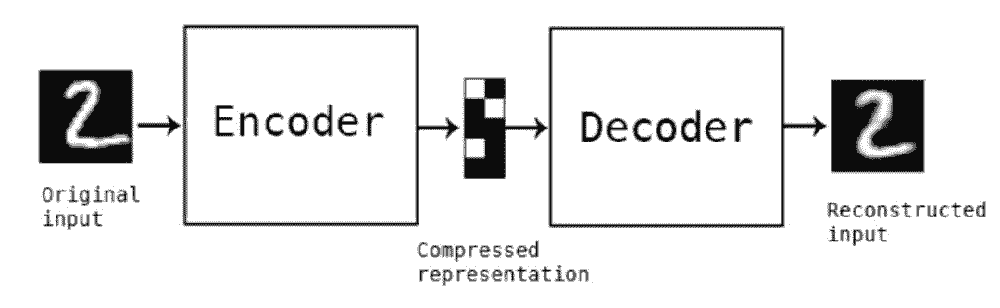
> 
> *(来源: Building Autoencoders in Keras ) *
> 
> 在这个基础上，即使我们输入的是另外一个人脸，也会被 Autoencoder 编码成为一个类似原来的脸。
> 
> 为了提升我们最终的效果，我们还需要把人脸共性相关的属性和人脸特性相关的属性进行学习。因此，我们对所有的脸都用一个统一的编码器，这 个编码器的目的是学习人脸共性的地方;然后，我们对每个脸有一个单独的解码器，这个解码器是为了学习人脸个性的地方。这样当你用 B 的脸通过 编码器，再使用 A 的解码器的话，你会得到一个与 B 的表情一致，但是 A 的脸。
> 
> 这个过程用公式表示如下:
> 
> ```py
> X' = Decoder(Encoder(Shuffle(X)))
> Loss = L1Loss(X'-X)
> 
> A' = Decoder_A(Encoder(Shuffle(A)))
> Loss_A = L1Loss(A'-A)
> 
> B' = Decoder_B(Encoder(Shuffle(B)))
> Loss_B = L1Loss(B'-B)
> 
> ```
> 
> 具体来说，在训练过程中，我们输入 A 的图片，通过编码器和解码器还原 A 的脸;然后我们输入 B 的图片，通过相同的编码器但是不同的解码器还原 B 的脸。不断迭代这个过程，直到 loss 降低到一个阈值。在模型训练的时候，我建议把 loss 降低到 0.02，这样的效果会比较好。
> 
> 这里用的是比较标准的建模方式。值得注意的是，作者通过加入 PixelShuffler() 的函数把图像进行了一定的扭曲，而这个扭曲增加了学习的难度，反 而让模型能够实现最终的效果。仔细想想这背后的道理，如果你一直在做简单的题目，那么必然不会有什么解决难题的能力。但是，我只要把题目 做一些变体，就足以让你成⻓。
> 
> 因为在建模中使用的是原图 A 的扭曲来还原 A，应用中是用 B 来还原 A，所以扭曲的方式会极大的影响到最终的结果。因此，如何选择更好的扭曲方 式，也是一个重要的问题。
> 
> 当我们图片融合的时候，会有一个难题，如何又保证效果又防止图片抖动。于是我们还要引入相关的算法处理这些情况。于是我们可以知道，一个 看似直接的人脸转换算法在实际操作中需要考虑各种各样的特殊情况，这才是真真的接地气。
> 
> **train.py**
> 
> 以下是进行训练的算法逻辑：
> 
> ```py
> import cv2 # 开源的计算机视觉库
> import numpy # 提供科学计算相关的功能
> import time # 提供时间相关的功能
> 
> import threading # 提供多线程相关的功能
> from lib.utils import get_image_paths, get_folder # 得到一个目录下的图片；获得一个 folder，不存在则创建
> from lib.cli import FullPaths, argparse, os, sys
> from plugins.PluginLoader import PluginLoader # 加载对应的算法
> 
> tf = None
> set_session = None
> def import_tensorflow_keras(): # 在需要的时候载入 TensorFlow 和 keras 模块
>     ''' Import the TensorFlow and keras set_session modules only when they are required '''
>     global tf
>     global set_session
>     if tf is None or set_session is None:
>         import tensorflow
>         import keras.backend.tensorflow_backend # keras 依赖底层的 tensorflow 实现具体的运算
>         tf = tensorflow
>         set_session = keras.backend.tensorflow_backend.set_session
> 
> class TrainingProcessor(object): # 训练器
>     arguments = None
> 
>     def __init__(self, subparser, command, description='default'): # 初始化训练器
>         self.argument_list = self.get_argument_list()
>         self.optional_arguments = self.get_optional_arguments()
>         self.parse_arguments(description, subparser, command)
>         self.lock = threading.Lock()
> 
>     def process_arguments(self, arguments):
>         self.arguments = arguments
>         print("Model A Directory: {}".format(self.arguments.input_A))
>         print("Model B Directory: {}".format(self.arguments.input_B))
>         print("Training data directory: {}".format(self.arguments.model_dir))
> 
>         self.process()
> 
>  # 参数配置部分省略
> 
>     @staticmethod
>     def get_optional_arguments(): # 创建一个存放参数的数组
>         ''' Put the arguments in a list so that they are accessible from both argparse and gui '''
>         # Override this for custom arguments
>         argument_list = []
>         return argument_list
> 
>     def parse_arguments(self, description, subparser, command):
>         parser = subparser.add_parser(
>             command,
>             help="This command trains the model for the two faces A and B.",
>             description=description,
>             epilog="Questions and feedback: \
>             https://github.com/deepfakes/faceswap-playground")
> 
>         for option in self.argument_list:
>             args = option['opts']
>             kwargs = {key: option[key] for key in option.keys() if key != 'opts'}
>             parser.add_argument(*args, **kwargs)
> 
>         parser = self.add_optional_arguments(parser)
>         parser.set_defaults(func=self.process_arguments)
> 
>     def add_optional_arguments(self, parser):
>         for option in self.optional_arguments:
>             args = option['opts']
>             kwargs = {key: option[key] for key in option.keys() if key != 'opts'}
>             parser.add_argument(*args, **kwargs)
>         return parser
> 
>     def process(self): # 具体的执行
>         self.stop = False
>         self.save_now = False
> 
>         thr = threading.Thread(target=self.processThread, args=(), kwargs={}) # 线程执行
>         thr.start()
> 
>         if self.arguments.preview:
>             print('Using live preview')
>             while True:
>                 try:
>                     with self.lock:
>                         for name, image in self.preview_buffer.items():
>                             cv2.imshow(name, image)
> 
>                     key = cv2.waitKey(1000)
>                     if key == ord('\n') or key == ord('\r'):
>                         break
>                     if key == ord('s'):
>                         self.save_now = True
>                 except KeyboardInterrupt:
>                     break
>         else:
>             try:
>                 input() # TODO how to catch a specific key instead of Enter?
>                 # there isnt a good multiplatform solution: https://stackoverflow.com/questions/3523174/raw-input-in-python-without-pressing-enter
>             except KeyboardInterrupt:
>                 pass
> 
>         print("Exit requested! The trainer will complete its current cycle, save the models and quit (it can take up a couple of seconds depending on your training speed). If you want to kill it now, press Ctrl + c")
>         self.stop = True
>         thr.join() # waits until thread finishes
> 
>     def processThread(self):
>         try:
>             if self.arguments.allow_growth:
>                 self.set_tf_allow_growth()
> 
>             print('Loading data, this may take a while...') # 加载数据
>             # this is so that you can enter case insensitive values for trainer
>             trainer = self.arguments.trainer
>             trainer = "LowMem" if trainer.lower() == "lowmem" else trainer
>             model = PluginLoader.get_model(trainer)(get_folder(self.arguments.model_dir), self.arguments.gpus) # 读取模型
>             model.load(swapped=False)
> 
>             images_A = get_image_paths(self.arguments.input_A) # 图片 A
>             images_B = get_image_paths(self.arguments.input_B) # 图片 B
>             trainer = PluginLoader.get_trainer(trainer) # 创建训练器
>             trainer = trainer(model, images_A, images_B, self.arguments.batch_size, self.arguments.perceptual_loss) # 设置训练器参数
> 
>             print('Starting. Press "Enter" to stop training and save model')
> 
>             for epoch in range(0, self.arguments.epochs):
> 
>                 save_iteration = epoch % self.arguments.save_interval == 0
> 
>                 trainer.train_one_step(epoch, self.show if (save_iteration or self.save_now) else None) # 进行一步训练
> 
>                 if save_iteration:
>                     model.save_weights()
> 
>                 if self.stop:
>                     break
> 
>                 if self.save_now:
>                     model.save_weights()
>                     self.save_now = False
> 
>             model.save_weights()
>             exit(0)
>         except KeyboardInterrupt:
>             try:
>                 model.save_weights()
>             except KeyboardInterrupt:
>                 print('Saving model weights has been cancelled!')
>             exit(0)
>         except Exception as e:
>             raise e
>             exit(1)
> 
>     def set_tf_allow_growth(self):
>         import_tensorflow_keras()
>         config = tf.ConfigProto()
>         config.gpu_options.allow_growth = True
>         config.gpu_options.visible_device_list="0"
>         set_session(tf.Session(config=config))
> 
>     preview_buffer = {}
> 
>     def show(self, image, name=''): # 提供预览
>         try:
>             if self.arguments.redirect_gui:
>                 scriptpath = os.path.realpath(os.path.dirname(sys.argv[0]))
>                 img = '.gui_preview.png'
>                 imgfile = os.path.join(scriptpath, img)
>                 cv2.imwrite(imgfile, image)
>             elif self.arguments.preview:
>                 with self.lock:
>                     self.preview_buffer[name] = image
>             elif self.arguments.write_image:
>                 cv2.imwrite('_sample_{}-fs8.png'.format(name), image)
>         except Exception as e:
>             print("could not preview sample")
>             raise e
> 
> ```
> 
> **Trainer.py**
> 
> 以下实现了一次具体的训练：
> 
> ```py
> import time
> import numpy
> from lib.training_data import TrainingDataGenerator, stack_images
> 
> class Trainer():
>     random_transform_args = { # 初始化参数
>         'rotation_range': 10,
>         'zoom_range': 0.05,
>         'shift_range': 0.05,
>         'random_flip': 0.4,
>     }
> 
>     def __init__(self, model, fn_A, fn_B, batch_size, *args):
>         self.batch_size = batch_size
>         self.model = model
> 
>         generator = TrainingDataGenerator(self.random_transform_args, 160) # 读取需要的数据
>         self.images_A = generator.minibatchAB(fn_A, self.batch_size)
>         self.images_B = generator.minibatchAB(fn_B, self.batch_size)
> 
>     def train_one_step(self, iter, viewer): # 训练一步
>         epoch, warped_A, target_A = next(self.images_A)
>         epoch, warped_B, target_B = next(self.images_B)
> 
>         loss_A = self.model.autoencoder_A.train_on_batch(warped_A, target_A) # 计算损失
>         loss_B = self.model.autoencoder_B.train_on_batch(warped_B, target_B)
>         print("[{0}] [#{1:05d}] loss_A: {2:.5f}, loss_B: {3:.5f}".format(time.strftime("%H:%M:%S"), iter, loss_A, loss_B),
>             end='\r')
> 
>         if viewer is not None:
>             viewer(self.show_sample(target_A[0:14], target_B[0:14]), "training")
> 
>     def show_sample(self, test_A, test_B):
>         figure_A = numpy.stack([
>             test_A,
>             self.model.autoencoder_A.predict(test_A),
>             self.model.autoencoder_B.predict(test_A),
>         ], axis=1)
>         figure_B = numpy.stack([
>             test_B,
>             self.model.autoencoder_B.predict(test_B),
>             self.model.autoencoder_A.predict(test_B),
>         ], axis=1)
> 
>         if test_A.shape[0] % 2 == 1:
>             figure_A = numpy.concatenate ([figure_A, numpy.expand_dims(figure_A[0],0) ])
>             figure_B = numpy.concatenate ([figure_B, numpy.expand_dims(figure_B[0],0) ])
> 
>         figure = numpy.concatenate([figure_A, figure_B], axis=0)
>         w = 4
>         h = int( figure.shape[0] / w)
>         figure = figure.reshape((w, h) + figure.shape[1:])
>         figure = stack_images(figure)
> 
>         return numpy.clip(figure * 255, 0, 255).astype('uint8')
> 
> ```
> 
> #### **AutoEncoder.py**
> 
> 以下是我们使用的 AutoEncoder 的算法逻辑：
> 
> ```py
> # AutoEncoder 的基础类
> 
> import os, shutil
> 
> encoderH5 = 'encoder.h5'
> decoder_AH5 = 'decoder_A.h5'
> decoder_BH5 = 'decoder_B.h5'
> 
> class AutoEncoder:
>     def __init__(self, model_dir, gpus):
>         self.model_dir = model_dir
>         self.gpus = gpus
> 
>         self.encoder = self.Encoder()
>         self.decoder_A = self.Decoder()
>         self.decoder_B = self.Decoder()
> 
>         self.initModel()
> 
>     def load(self, swapped):
>         (face_A,face_B) = (decoder_AH5, decoder_BH5) if not swapped else (decoder_BH5, decoder_AH5)
> 
>         try: # 加载权重
>             self.encoder.load_weights(str(self.model_dir / encoderH5))
>             self.decoder_A.load_weights(str(self.model_dir / face_A))
>             self.decoder_B.load_weights(str(self.model_dir / face_B))
>             print('loaded model weights')
>             return True
>         except Exception as e:
>             print('Failed loading existing training data.')
>             print(e)
>             return False
> 
>     def save_weights(self): # 存储权重
>         model_dir = str(self.model_dir)
>         if os.path.isdir(model_dir + "_bk"):
>             shutil.rmtree(model_dir + "_bk")
>         shutil.move(model_dir,  model_dir + "_bk")
>         os.mkdir(model_dir)
>         self.encoder.save_weights(str(self.model_dir / encoderH5))
>         self.decoder_A.save_weights(str(self.model_dir / decoder_AH5))
>         self.decoder_B.save_weights(str(self.model_dir / decoder_BH5))
>         print('saved model weights')
> 
> ```
> 
> **Model.py**
> 
> 以下是我们的具体模型：
> 
> ```py
> # Based on the original https://www.reddit.com/r/deepfakes/ code sample + contribs
> 
> from keras.models import Model as KerasModel
> from keras.layers import Input, Dense, Flatten, Reshape
> from keras.layers.advanced_activations import LeakyReLU
> from keras.layers.convolutional import Conv2D
> from keras.optimizers import Adam
> 
> from .AutoEncoder import AutoEncoder
> from lib.PixelShuffler import PixelShuffler
> 
> from keras.utils import multi_gpu_model
> 
> IMAGE_SHAPE = (64, 64, 3)
> ENCODER_DIM = 1024
> 
> class Model(AutoEncoder):
>     def initModel(self):
>         optimizer = Adam(lr=5e-5, beta_1=0.5, beta_2=0.999)  # 深入理解 Adam 的优化
>         x = Input(shape=IMAGE_SHAPE)
> 
>         self.autoencoder_A = KerasModel(x, self.decoder_A(self.encoder(x)))
>         self.autoencoder_B = KerasModel(x, self.decoder_B(self.encoder(x)))
> 
>         if self.gpus > 1:
>             self.autoencoder_A = multi_gpu_model( self.autoencoder_A , self.gpus)
>             self.autoencoder_B = multi_gpu_model( self.autoencoder_B , self.gpus)
> 
>         self.autoencoder_A.compile(optimizer=optimizer, loss='mean_absolute_error')
>         self.autoencoder_B.compile(optimizer=optimizer, loss='mean_absolute_error')
> 
>     def converter(self, swap):
>         autoencoder = self.autoencoder_B if not swap else self.autoencoder_A
>         return lambda img: autoencoder.predict(img)
> 
>     def conv(self, filters):
>         def block(x):
>             x = Conv2D(filters, kernel_size=5, strides=2, padding='same')(x)
>             x = LeakyReLU(0.1)(x)
>             return x
>         return block
> 
>     def upscale(self, filters):
>         def block(x):
>             x = Conv2D(filters * 4, kernel_size=3, padding='same')(x)
>             x = LeakyReLU(0.1)(x) # 使用 LeakyReLU 激活函数
>             x = PixelShuffler()(x) # 将 filter 的大小变为原来的 1/4，让高和宽变为原来的两倍
>             return x
>         return block
> 
>     def Encoder(self):
>         input_ = Input(shape=IMAGE_SHAPE)
>         x = input_
>         x = self.conv(128)(x)
>         x = self.conv(256)(x)
>         x = self.conv(512)(x)
>         x = self.conv(1024)(x)
>         x = Dense(ENCODER_DIM)(Flatten()(x))
>         x = Dense(4 * 4 * 1024)(x)
>         x = Reshape((4, 4, 1024))(x)
>         x = self.upscale(512)(x)
>         return KerasModel(input_, x)
> 
>     def Decoder(self):
>         input_ = Input(shape=(8, 8, 512))
>         x = input_
>         x = self.upscale(256)(x)
>         x = self.upscale(128)(x)
>         x = self.upscale(64)(x)
>         x = Conv2D(3, kernel_size=5, padding='same', activation='sigmoid')(x)
>         return KerasModel(input_, x)
> 
> ```
> 
> 整个网络的结构如下：
> 
> 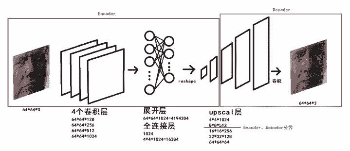
> 
>  来源: 刷爆朋友圈的视频人物换脸是怎样炼成的?
> 
> 我们可以看出来，经历了四个卷积层、展开层、全连接层，我们开始 upscale 整个模型。在我们 upscale 一半的时候，我们把 encoder 和 decoder 进行
> 
> 了切割，从而保证了共性和个性的分离。
> 
> **convert.py**
> 
> 在训练的基础上，我们现在可以进行图片的转换了。
> 
> ```py
> import cv2
> import re
> import os
> 
> from pathlib import Path
> from tqdm import tqdm
> 
> from lib.cli import DirectoryProcessor, FullPaths
> from lib.utils import BackgroundGenerator, get_folder, get_image_paths, rotate_image
> 
> from plugins.PluginLoader import PluginLoader
> 
> class ConvertImage(DirectoryProcessor):
>     filename = ''
>     def create_parser(self, subparser, command, description):
>         self.optional_arguments = self.get_optional_arguments()
>         self.parser = subparser.add_parser(
>             command,
>             help="Convert a source image to a new one with the face swapped.",
>             description=description,
>             epilog="Questions and feedback: \
>             https://github.com/deepfakes/faceswap-playground"
>         )
>  
>  # 参数配置部分省略
> 
>     def process(self): # 进行模型的转换和拼接
>         # Original & LowMem models go with Adjust or Masked converter
>         # Note: GAN prediction outputs a mask + an image, while other predicts only an image
>         model_name = self.arguments.trainer
>         conv_name = self.arguments.converter
>         self.input_aligned_dir = None
> 
>         model = PluginLoader.get_model(model_name)(get_folder(self.arguments.model_dir), self.arguments.gpus)
>         if not model.load(self.arguments.swap_model):
>             print('Model Not Found! A valid model must be provided to continue!')
>             exit(1)
> 
>         input_aligned_dir = Path(self.arguments.input_dir)/Path('aligned')
>         if self.arguments.input_aligned_dir is not None:
>             input_aligned_dir = self.arguments.input_aligned_dir
>         try:
>             self.input_aligned_dir = [Path(path) for path in get_image_paths(input_aligned_dir)]
>             if len(self.input_aligned_dir) == 0:
>                 print('Aligned directory is empty, no faces will be converted!')
>             elif len(self.input_aligned_dir) <= len(self.input_dir)/3:
>                 print('Aligned directory contains an amount of images much less than the input, are you sure this is the right directory?')
>         except:
>             print('Aligned directory not found. All faces listed in the alignments file will be converted.')
> 
>         converter = PluginLoader.get_converter(conv_name)(model.converter(False),
>             trainer=self.arguments.trainer,
>             blur_size=self.arguments.blur_size,
>             seamless_clone=self.arguments.seamless_clone,
>             sharpen_image=self.arguments.sharpen_image,
>             mask_type=self.arguments.mask_type,
>             erosion_kernel_size=self.arguments.erosion_kernel_size,
>             match_histogram=self.arguments.match_histogram,
>             smooth_mask=self.arguments.smooth_mask,
>             avg_color_adjust=self.arguments.avg_color_adjust
>         )
> 
>         batch = BackgroundGenerator(self.prepare_images(), 1)
> 
>         # frame ranges stuff...
>         self.frame_ranges = None
> 
>         # split out the frame ranges and parse out "min" and "max" values
>         minmax = {
>             "min": 0, # never any frames less than 0
>             "max": float("inf")
>         }
> 
>         if self.arguments.frame_ranges:
>             self.frame_ranges = [tuple(map(lambda q: minmax[q] if q in minmax.keys() else int(q), v.split("-"))) for v in self.arguments.frame_ranges]
> 
>         # last number regex. I know regex is hacky, but its reliablyhacky(tm).
>         self.imageidxre = re.compile(r'(\d+)(?!.*\d)')
> 
>         for item in batch.iterator():
>             self.convert(converter, item)
> 
>     def check_skipframe(self, filename):
>         try:
>             idx = int(self.imageidxre.findall(filename)[0])
>             return not any(map(lambda b: b[0]<=idx<=b[1], self.frame_ranges))
>         except:
>             return False
> 
>     def check_skipface(self, filename, face_idx):
>         aligned_face_name = '{}_{}{}'.format(Path(filename).stem, face_idx, Path(filename).suffix)
>         aligned_face_file = Path(self.arguments.input_aligned_dir) / Path(aligned_face_name)
>         # TODO: Remove this temporary fix for backwards compatibility of filenames
>         bk_compat_aligned_face_name = '{}{}{}'.format(Path(filename).stem, face_idx, Path(filename).suffix)
>         bk_compat_aligned_face_file = Path(self.arguments.input_aligned_dir) / Path(bk_compat_aligned_face_name)
>         return aligned_face_file not in self.input_aligned_dir and bk_compat_aligned_face_file not in self.input_aligned_dir
> 
>     def convert(self, converter, item):
>         try:
>             (filename, image, faces) = item
> 
>             skip = self.check_skipframe(filename)
>             if self.arguments.discard_frames and skip:
>                 return
> 
>             if not skip: # process frame as normal
>                 for idx, face in faces:
>                     if self.input_aligned_dir is not None and self.check_skipface(filename, idx):
>                         print ('face {} for frame {} was deleted, skipping'.format(idx, os.path.basename(filename)))
>                         continue
>                     # Check for image rotations and rotate before mapping face
>                     if face.r != 0:
>                         height, width = image.shape[:2]
>                         image = rotate_image(image, face.r)
>                         image = converter.patch_image(image, face, 64 if "128" not in self.arguments.trainer else 128)
>                         # TODO: This switch between 64 and 128 is a hack for now. We should have a separate cli option for size
>                         image = rotate_image(image, face.r * -1, rotated_width=width, rotated_height=height)
>                     else:
>                         image = converter.patch_image(image, face, 64 if "128" not in self.arguments.trainer else 128)
>                         # TODO: This switch between 64 and 128 is a hack for now. We should have a separate cli option for size
> 
>             output_file = get_folder(self.output_dir) / Path(filename).name
>             cv2.imwrite(str(output_file), image)
>         except Exception as e:
>             print('Failed to convert image: {}. Reason: {}'.format(filename, e))
> 
>     def prepare_images(self):
>         self.read_alignments()
>         is_have_alignments = self.have_alignments()
>         for filename in tqdm(self.read_directory()):
>             image = cv2.imread(filename)
> 
>             if is_have_alignments:
>                 if self.have_face(filename):
>                     faces = self.get_faces_alignments(filename, image)
>                 else:
>                     tqdm.write ('no alignment found for {}, skipping'.format(os.path.basename(filename)))
>                     continue
>             else:
>                 faces = self.get_faces(image)
>             yield filename, image, faces
> 
> ```
> 
>  当然我们也可以用 GAN 算法进行优化，那么让我们看一下使用 GAN 的模型。
> 
> 
> 
> * (来源: shaoanlu/faceswap-GAN) *
> 
> 如上图所示，我们首先扣取 A 的人脸，然后进行变形，之后经历编码和解码生成了重建的脸和 Mask。以下是我们的学习目标。
> 
> 
> 
> * (来源: shaoanlu/faceswap-GAN) *
> 
> **从图片到视频**
> 
> 基于我们 FFmpeg 的讲解，可以使用以下命令将一批图片合并为一个视频：
> 
> ```py
> ffmpeg  -f image2 -i imagename%04d-fs8.png -vcodec libx264 -crf 15 -pix_fmt yuv420p output_filename.mp4
> 
> ```
> 
> 如果你希望新生成的视频有声音，那就可以在最后把有声音的视频中的声音拼接到你最后产生的目标视频上即可。
> 
> **云平台部署**
> 
>  我们可以在 Google Cloud 中部署云平台。具体请看视频展示，我在这里展示几个关键步骤：
> 
> 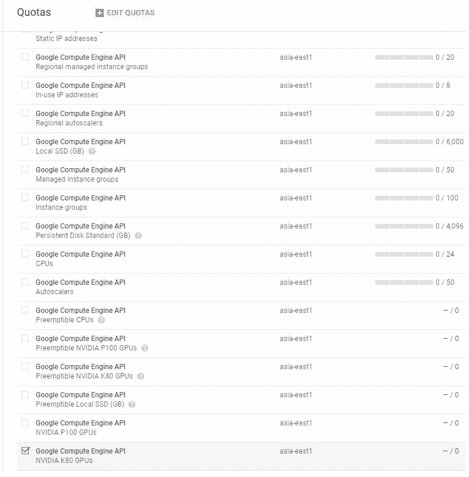
> 
> * (来源: How to Create DeepFakes with Google Cloud GPU Services)*
> 
> 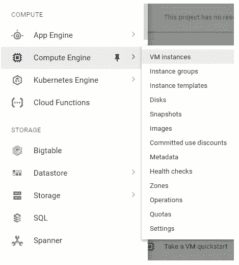
> 
> * (来源: How to Create DeepFakes with Google Cloud GPU Services)*
> 
> 
> 
> * (来源: How to Create DeepFakes with Google Cloud GPU Services)*
> 
> 
> 
> * (来源: How to Create DeepFakes with Google Cloud GPU Services) *
> 
> 最后是我在 Google Cloud 上进行 Training 的一个截图。
> 
> 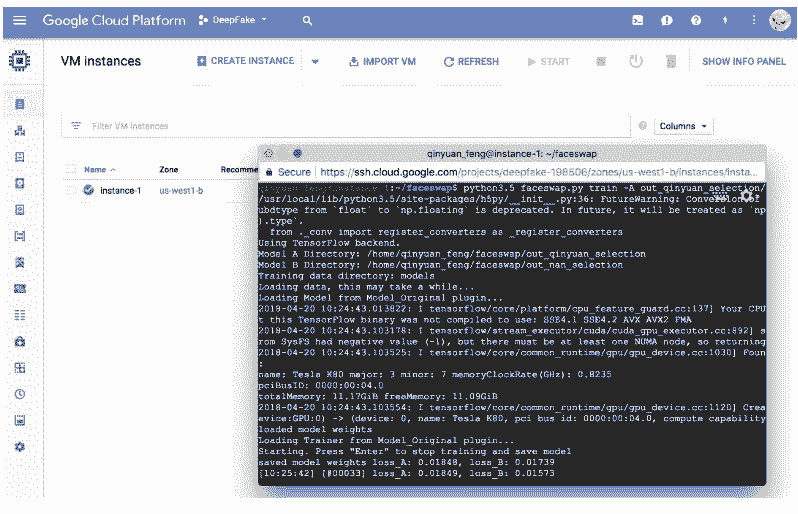
> 
> **项目架构**
> 
> 最后让我们从高层理解一下整个 DeepFake 项目的架构。
> 
> 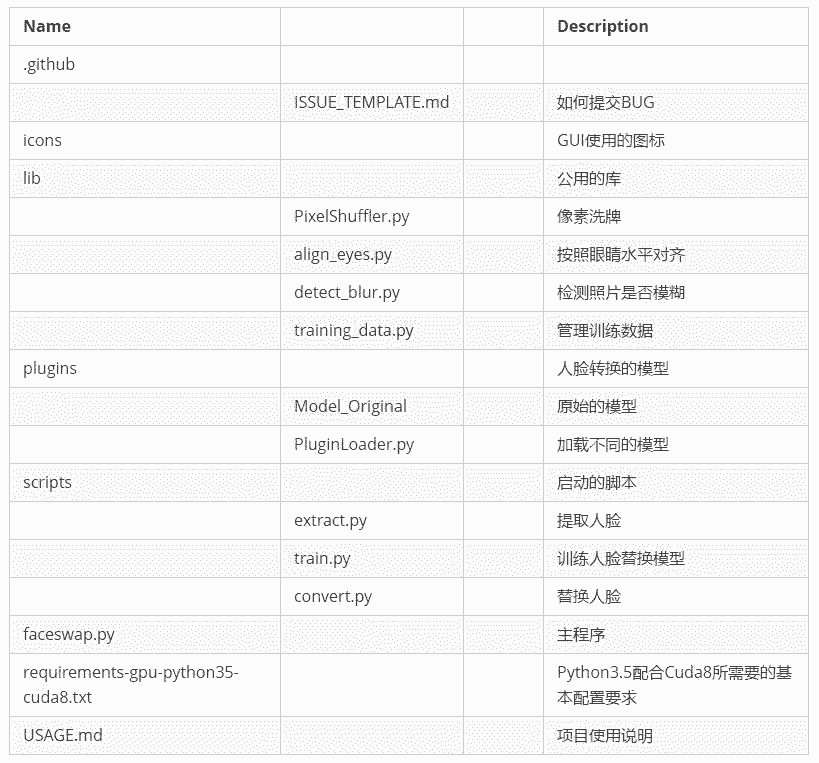
> 
> **社会影响**
> 
> 我们已经聊了 Deepfake 的原理，那么它到底有哪些真正的社会价值呢? 我们可以用任何人来拍摄一个电影，然后变成我们想要的任何人。我们可以 创建更加真实的虚拟人物。穿衣购物可以更加真人模拟。
> 
> **总结**
> 
> 我们用到了如下的技术栈、框架、平台：
> 
> *   Dlib：基于 C++的机器学习算法库 OpenCV:计算机视觉算法库 Keras:在底层机器学习框架之上的高级 API 架构 TensorFlow:Google 开源的机器学习算法框架 CUDA:Nvidia 提供的针对 GPU 加速的开发环境
>     
>     
> *   Google Cloud Platform:Google 提供的云计算服务平台 Virtualenv:创建独立的 Python 环境 FFmpeg:多媒体音视频处理开源库
>     
>     
> *   现在就来上手，把你心爱的另一半的人脸搬上好莱坞吧。
>     
>     
> 
> ****本文为机器之心发布，**转载请联系本公众号获得授权****。**
> 
> ✄------------------------------------------------
> 
> **加入机器之心（全职记者/实习生）：hr@jiqizhixin.com**
> 
> **投稿或寻求报道：editor@jiqizhixin.com**
> 
> **广告&商务合作：bd@jiqizhixin.com**