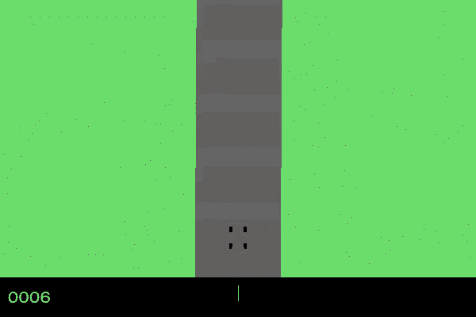
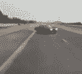
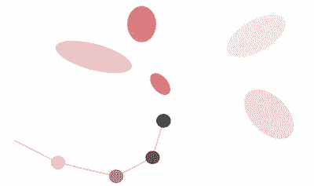
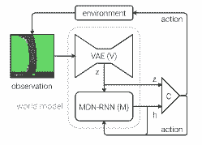
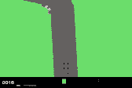

# 教程 |「世界模型」实现，一步步让机器掌握赛车和躲避火球的技能

选自 Medium

**作者：****David Foster**

**机器之心编译**

**参与：李诗萌、刘晓坤** 

> > 前段时间，由谷歌大脑研究科学家 David Ha 与瑞士 AI 实验室 IDSIA 负责人 Jürgen Schmidhuber（他也是 LSTM 的提出者）共同提出的「[世界模型](http://mp.weixin.qq.com/s?__biz=MzA3MzI4MjgzMw==&mid=2650740072&idx=1&sn=9c7a1fb39de042c3488ed06f1dae896a&chksm=871ad116b06d58005ade4798c9fee43b8d514d9149f1c47bdd951b016c01f6910b7097681d2d&scene=21#wechat_redirect)」让人工智能在「梦境」中训练的论文吸引了人们的热烈讨论。本文将带你一步步实现论文中研究的赛车和躲避火球智能体。
> 
> 简言之，该论文被称为杰作的原因有三：
> 
> 1\. 它结合了多种深度/强化学习技术以得到惊人的结果——已知第一个解决当下流行的「赛车」强化学习环境的智能体；
> 
> 2\. 模型编写方式易于理解，所以对任何对尖端 AI 技术感兴趣的人而言，这都是很好的学习资源；
> 
> 3\. 你可以自己写该解决方案的代码。
> 
> **这篇文章是一份分步指南。**
> 
> 本文涵盖的内容有模型的技术细节，以及该如何得到一个可以在自己的机器上运行的版本。
> 
> 正如我在 AlphaZero（https://medium.com/applied-data-science/how-to-build-your-own-alphazero-ai-using-python-and-keras-7f664945c188）一文中所说的，我与文章作者没有任何关系，我只是想分享一些关于他们杰出工作的见解。
> 
> **第 1 步：问题**
> 
> 我们将建立一个强化学习算法（一个「智能体」），该算法可以很好地在 2D 的赛道上驱动车辆。可以通过 OpenAI Gym（https://gym.openai.com/）得到这个（赛车）环境。
> 
> 在每一个时间步（time step）中，该算法都会被馈送一个观察（一张像素为 64 * 64 的车辆和即时环境的彩色图像），还需要返回接下来采取的一系列行为参数——也就是转向的方向（-1 到 1）、加速度（0 到 1）以及刹车（0 到 1）。
> 
> 然后将这一行为传递到环境中，返回下一个观察，再开始下一次循环。
> 
> 对要访问的 N 个追踪块而言，每一个智能体能得 1000/N 分，而每经过一个时间步会减去 0.1 分。例如，如果一个智能体要通过 732 帧才能完成追踪，那么得分就是 1000–0.1*732 = 926.8 分。
> 
> 
> 
> 这是一个智能体的例子：在前 200 时间步中选择行为 [0,1,0]，然后其他随机……显然这不是很好的行驶策略。
> 
> 该项目的目标是要训练智能体，使其理解可以利用周围环境的信息在下一步采取最佳行动。
> 
> **第 2 步：解决办法**
> 
> World Models 的作者写了一个关于其方法的在线的交互解释（https://worldmodels.github.io/），所以在此不再赘述同样的细节，而是要聚焦于这些片段该如何组装在一起的高层次问题上，与真实的驾驶过程进行类比，来直观说明为什么这样的解决方案有意义。
> 
> 解决方案由三部分组成，会对这三部分分别进行训练：
> 
> **变分自编码器（VAE）**
> 
> 当你在开车过程中做决策时，你不会对视野中的每一个「像素」进行分析——相反，你的大脑会将这些视觉信息浓缩成少量的「潜在」实体，例如道路的平直度、即将到来的弯道以及你相对于道路的位置，你会通过这些信息来决定下一个行为。
> 
> 这也是训练后的 VAE 要做的事——将 64*64*3（RPG）的输入图像浓缩为服从高斯分布的 32 维潜在向量（z）。
> 
> 这是很有用的，因为智能体可以用更小的环境表征工作，从而使学习过程更加高效。
> 
> **具有混合密度网络输出层的循环神经网络（MDN-RNN）**
> 
> 
> 
> 如果在决策时没有 MDN-RNN 组件，你的驾驶过程看起来可能像这样。
> 
> 当你驾驶时，视野中出现的每一个观察都不会让你特别惊讶。你知道如果当前的观察结果说明路前方有左转弯，你就会左转，在你预期中的下一次观察会显示你仍沿着路在前进。
> 
> 这种前瞻性思维就是 RNN 要起到的作用——具体地说就是一个有着 256 个隐藏单元的 LSTM。h 表示隐藏状态的向量。
> 
> 和 VAE 类似，RNN 试图捕获环境中车辆当前状态的潜在理解，但这一次是要以之前的「z」和行为为基础，预测下一个「z」可能是什么样的。
> 
> 事实上，MDN 输出层允许从几个高斯分布中的任意一个得到下一个「z」。
> 
> 
> 
> *生成手写体的 MDN*
> 
> 在这篇同一作者写的文章中用同样的技术生成手写体（http://blog.otoro.net/2015/12/28/recurrent-net-dreams-up-fake-chinese-characters-in-vector-format-with-tensorflow/），说明笔的下一点可以落在不同的红色区域的任意一点。
> 
> 相似的是，在 World Models 这篇文章中，可以从五个高斯分布的任意一个中得出下一个观察的潜在状态。
> 
> **控制器**
> 
> 到目前为止，我们还没有提到任何有关行为选择的问题，该任务由控制器执行。
> 
> 简单地说，控制器就是一个密集连接的神经网络，这个网络的输入是级联的 z（从 VAE 得到的潜在状态——长度为 32）和 h（RNN 的隐藏状态——长度是 256）。这三个输出神经元对应三个行为，且被缩放至适合的范围。
> 
> 一段对白
> 
> 为了理解这三个组件所扮演的不同角色以及它们是如何运作的，我们可以想象一段在它们中间发生的对白：
> 
> 
> 
> *World Model 架构的图示（来源：https://arxiv.org/pdf/1803.10122.pdf）*
> 
> > VAE（看着最新的 64*64*3 的观察）：汽车前进方向（z）的道路像是一条平直、有轻微左转弯的道路。
> > 
> > RNN：根据描述（z）和控制器选择在最后的时间步加速（行为）的事实，我会更新我的隐藏状态（h），这样下一个观察才能预测为笔直的道路，但是在视野中有轻微的左转。
> > 
> > 控制器：基于来自 VAE 的描述（z）和来自 RNN 的当前的隐藏状态（h），我的神经网络下一行为的输出会是 [0.34, 0.8, 0]。
> 
> 然后将这一行为传送至环境中去，这会返回一个更新的观察，然后开始下一循环。
> 
> 现在我们要看一下要如何设置一个让你训练自己赛车智能体的环境。
> 
> 接下来我们来写代码吧！
> 
> **第 3 步：设置你自己的环境**
> 
> 如果你使用的是高配置笔记本，你可以在本地运行，但我建议使用 Google 云计算（https://cloud.google.com/compute/），这允许你在短时间内使用强大的计算机。
> 
> 以下代码已经在 Linux（Ubuntu 16.04）进行过测试了——如果你在 Mac 或 Windows 上运行只需改变相关安装包的命令即可。
> 
> **1\. 复制 github 项目（https://github.com/AppliedDataSciencePartners/WorldModels）**
> 
> 下面的命令行可以帮你导航到项目位置并进入该项目：
> 
> ```py
> git clone https://github.com/AppliedDataSciencePartners/WorldModels.git
> ```
> 
> 该项目是通过 World Models 文章第一作者 David Ha 开发的很有用的 estool 库（https://github.com/hardmaru/estool）改写而成的。
> 
> 在训练神经网络的过程中，使用了带有 TensorFlow 后端的 Keras，但是在原文中，作者使用的是原始的 TensorFlow。
> 
> **2\. 设置一个虚拟环境**
> 
> 创建一个 Python3 虚拟环境（我用的是 virutalenv 和 virtualenvwrapper）。
> 
> ```py
> sudo apt-get install python-pip
> sudo pip install virtualenv
> sudo pip install virtualenvwrapper
> export WORKON_HOME=~/.virtualenvs
> source /usr/local/bin/virtualenvwrapper.sh
> mkvirtualenv --python=/usr/bin/python3 worldmodels
> ```
> 
> **3\. 安装依赖包**
> 
> ```py
> sudo apt-get install cmake swig python3-dev zlib1g-dev python-opengl mpich xvfb xserver-xephyr vnc4server
> ```
> 
> **4\. 安装要求.txt**
> 
> ```py
> cd WorldModels
> pip install -r requirements.txt
> ```
> 
> 与赛车例子中要求的相比，这里有更多依赖包，建议你把每一个包都装好，以备在 Open AI Gym 中进行其他测试，这些测试可能需要额外的依赖包。
> 
> **第 4 步：生成随机事件**
> 
> 对赛车环境而言，VAE 和 RNN 都可以在随机事件数据上训练——也就是在每一个时间步随机采取的行为产生的观察数据。事实上，我们用了伪随机的行为，这样可以迫使车辆在初始时加速，使其脱离起跑线。
> 
> 因为 VAE 和 RNN 是独立于做出决策行为的控制器的，我们需要保证遇到不同观察后选择不同行为，并将其存储为训练数据。
> 
> 为了产生随机事件，运行下面的命令行：
> 
> ```py
> python 01_generate_data.py car_racing --total_episodes 2000 --start_batch 0 --time_steps 300
> ```
> 
> 如果你在没有显示的服务器上操作，运行下面的命令行：
> 
> ```py
> xvfb-run -a -s "-screen 0 1400x900x24" python 01_generate_data.py car_racing --total_episodes 2000 --start_batch 0 --time_steps 300
> ```
> 
> 这会产生 2000 个事件（保存在 10 个批次中），批次从 0 开始。每一个事件最长为 300 个时间步。
> 
> *   两部分文件存在 ./data 中（* 是批次号）
>     
>     
> *   obs_data_*.npy（将 64*64*3 的图存为 numpy 数组）
>     
>     
>     
> *   action_data_*.npy（存储三维行为）
>     
>     
>     
> 
> **第 5 步：训练 VAE**
> 
> 训练 VAE 只需要 obs_data_*.npy 文件。确保已经完成了第 4 步，这样这些文件才会在./data 文件夹中。
> 
> 运行：
> 
> ```py
> python 02_train_vae.py --start_batch 0 --max_batch 9 --new_model
> ```
> 
> 这会在 0~9 的每一个批次上都训练一个新的 VAE 。
> 
> 模型权重会存在 ./vae/weights.h5 中，--new_model 标记告诉脚本要从头训练模型。
> 
> 如果该文件夹中已经存在 weights.h5，并且没有 --new_model 标记，脚本将从这个文件中加载权重再训练已经存在的模型。这样你就可以按批次反复训练 VAE。
> 
> VAE 架构设置在 ./vae/arch.py 文件中。
> 
> **第 6 步：生成 RNN 数据**
> 
> 既然我们已经训练了 VAE，我们就可以用 VAE 产生 RNN 的训练集。
> 
> RNN 需要编码来自 VAE 的图像数据（z）和行为（a）作为输入，将编码下一时间步的 VAE 的图像数据作为输出。
> 
> 运行命令行生成数据：
> 
> ```py
> python 03_generate_rnn_data.py --start_batch 0 --max_batch 9
> ```
> 
> 从批次 0 到批次 9，会用 obs_data_*.npy 和 obs_data_*.npy 文件，并将这两个文件转换为训练 RNN 需要的正确格式。
> 
> *   两部分文件将保存在 ./data 中（* 是批次号码）
>     
>     
> *   rnn_input_*.npy(存储了级联向量 [z,a])
>     
>     
> *   rnn_output_*.npy（存储了下一时间步的向量 z）
>     
>     
> 
> **第 7 步：训练 RNN**
> 
> 训练 RNN 只需要 rnn_input_*.npy 和 rnn_output_*.npy 文件。确保已经完成了第 6 步，这样才能在 ./data 文件夹中找到这些文件。
> 
> 运行命令行：
> 
> ```py
> python 04_train_rnn.py --start_batch 0 --max_batch 9 --new_model
> ```
> 
> 这可以在 0~9 每一个批次的数据上训练新的 RNN。
> 
> 模型权重将存储在 ./rnn/weights.h5 中。——new_model 标记告诉脚本要从头训练模型。
> 
> 与 VAE 相似，如果文件夹中没有 weights.h5，--new_model 标记也没有特别说明的话，脚本将从文件中加载权重并继续训练现存模型。这样，你就可以反复训练 RNN。
> 
> RNN 架构设置存为./rnn/arch.py 文件。
> 
> **第 8 步：训练控制器**
> 
> 现在进行到有趣的部分了！
> 
> 迄今为止，我们只用深度学习方法建立了可以将高维图像压缩成低维潜在空间的 VAE，而 RNN 可以预测潜在空间是怎样随着时间变化而变化的。我们可以通过随机事件数据创建一个同时适用于 VAE 和 RNN 的训练集。
> 
> 为了训练控制器，我们可以使用强化学习，利用一种被称为 CMA-ES（协方差矩阵适应—进化策略）的算法。
> 
> 由于输入是维度为 288（=32+256）的向量，输出是维度为 3 的向量，我们有 288*3+1=867 个参数要训练。
> 
> CMA-ES 的工作原理是：先创建这 867 个参数的多个随机初始化副本（即「群体」）。然后在环境中测试群体中的每一个元素并记录其平均成绩。事实上，这与自然选择的原理一样，允许产生最高得分的权重「复制」，并允许产生下一次迭代。
> 
> 为了在你的机器上开始这一进程，取适当的参数运行下述命令：
> 
> ```py
> python 05_train_controller.py car_racing --num_worker 16 --num_worker_trial 4 --num_episode 16 --max_length 1000 --eval_steps 25
> ```
> 
> 若在没有显示的服务器上操作，则运行下述命令：
> 
> ```py
> xvfb-run -s "-screen 0 1400x900x24" python 05_train_controller.py car_racing --num_worker 16 --num_worker_trial 2 --num_episode 4 --max_length 1000 --eval_steps 25
> ```
> 
> *   --num_worker 16：将该参数设置为不超过最大可用核数目
>     
>     
> *   --num_work_trial 2 ：每个核中待测群体中元素的数目（num_worker * num_work_trial 得出每一次迭代后群体大小）
>     
>     
> *   --num_episode 4：给群体中每个元素打分的 episode 的数量（这个成绩是 episode 数量的平均奖励）
>     
>     
> *   --max_length 1000：一个 episode 中时间步的最大数量
>     
>     
> *   --eval_steps 25：在 100 个 episode 中，最佳权重集合的评估之间的迭代数
>     
>     
> *   --init_opt ./controller/car_racing.cma.4.32.es.pk 默认情况下，控制器将从头开始运行脚本，并将进程的当前状态存在控制器目录的 pickle 文件中。该参数通过指向相关文件，允许用户从最后一个存储点继续训练。
>     
>     
> 
> 在每一次迭代之后，算法的当前状态和最佳权重集将会作为输出存储在 ./controller 文件夹中。
> 
> **第 9 步：可视化智能体**
> 
> 在这篇文章的写作期间，我成功训练了该智能体，并在训练了 200 代之后得到了 833.13 的平均分。使用 Ubuntu 16.04、18 vCPU、67.5GB RAM 的机器在 Google Cloud 上训练了本文提到的步骤和参数。
> 
> 论文的作者在训练 2000 代之后得到了 906 的平均分，这是迄今为止该环境下最高的分数，但他们用的配置要更高一点（例如，对数据训练了 10,000 个 episode，群体数量达到 64，64 核的机器，每次试验有 16 个 episode 等）。
> 
> 为了可视化你的控制器的当前状态，运行：
> 
> ```py
> python model.py car_racing --filename ./controller/car_racing.cma.4.32.best.json --render_mode --record_video
> ```
> 
> *   --filename：您想附加到控制器的权重的 json 的路径
>     
>     
> *   --render_mode ：在屏幕上渲染环境
>     
>     
> *   --record_video：将 mp4 文件输出到 ./video 文件夹，每个 episode 展示一次
>     
>     
> *   --final_mode：控制器运行 100 个 episode 测试输出的平均成绩
>     
>     
> 
> 演示如下！
> 
> 
> 
> **第 10 步：梦境学习**
> 
> 这已经很酷了——但这篇文章的下一个部分令人印象深刻，而我认为对人工智能而言这意义重大。
> 
> 在另一个环境，DoomTakeCove（https://github.com/ppaquette/gym-doom）中，这篇文章展现了惊人的结果。在这里，目标是移动智能体躲避火球，活得越久越好。
> 
> 作者展示了智能体如何不在真实环境的情况下，而在 VAE/RNN 的启发下的梦境（虚拟环境）中学会玩游戏。
> 
> 额外需要的只有 RNN 也要被训练得可以预测在下一个时间步死亡的可能性。这样，VAE/RNN 联合体可以作为环境独立分装，并用于训练控制器。这是「世界模型」的核心概念。
> 
> 我们可以将梦境学习归纳如下：
> 
> > 智能体的初始训练数据只不过是与真实环境的随机互动。通过这种方式，智能体建立了这个世界是如何「运作」的潜在理解——这个世界的自然分组、物理以及智能体的行为会对这个世界产生怎样的影响。
> > 
> > 给定一个任务，智能体会用这种潜在理解，在无需在真实世界对任务进行测试的情况下，建立最佳策略。因为它会将自己理解的环境的模型作为「场地」，试着解决问题。
> 
> 这也可以简单解释为婴儿学习走路。两者间有惊人的相似之处，但或许比单纯的类比要更加深刻，这一点使它成为真正迷人的研究领域。
> 
> *原文链接：https://medium.com/applied-data-science/how-to-build-your-own-world-model-using-python-and-keras-64fb388ba459*
> 
> ****本文为机器之心编译，**转载请联系本公众号获得授权****。**
> 
> ✄------------------------------------------------
> 
> **加入机器之心（全职记者/实习生）：hr@jiqizhixin.com**
> 
> **投稿或寻求报道：**content**@jiqizhixin.com**
> 
> **广告&商务合作：bd@jiqizhixin.com**