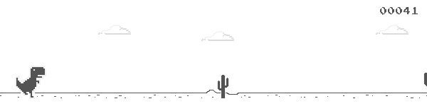

# 教程 | 强化学习训练 Chrome 小恐龙 Dino Run：最高超过 4000 分

选自 Paperspace

**作者：Ravi Munde**

**机器之心编译**

**参与：Panda**

> 强化学习是当前人工智能领域内一个非常热门的研究方向，在游戏智能体方面的进展尤其耀眼。美国东北大学在读硕士 Ravi Munde 近日发文介绍了其构建《小恐龙快跑（Dino Run）》强化学习智能体的过程。《小恐龙快跑》是 Chrome 浏览器上的一款隐藏小游戏，当你的浏览器断开网络时，你的屏幕上就会出现这只小恐龙，此时只需点击方向键 ↑ 即可开启游戏。

DeepMind 2013 年发表的论文《使用深度强化学习玩 Atari 游戏（Playing Atari with Deep Reinforcement Learning）》为强化学习引入了一种新的深度学习模型，并展现了其仅使用原始像素作为输入就能掌握 Atari 2600 电脑游戏的不同控制策略的能力。在本教程中，我将使用 Keras 实现这篇论文。我首先会介绍强化学习的基础知识，然后深入代码以获得实践性的理解。


*AI 玩《小恐龙快跑》*

我在 2018 年 3 月初开始了这个项目并得到了一些优良的结果。但是，这个只有 CPU 的系统没法学习更多功能。强大的 GPU 能显著提升其性能表现。

在我们得到一个可运行的模型之前，有很多步骤和概念需要我们理解。

步骤：

*   构建一个浏览器（JavaScript）和模型（Python）之间的双向接口

*   获取和预处理图像

*   训练模型

*   评估

源代码：https://github.com/Paperspace/DinoRunTutorial.git

**开始**

要这样完成训练和玩游戏，你可以在设置好环境后克隆这个 GitHub 库：

```py
1.  `git clone https://github.com/Paperspace/DinoRunTutorial.git`

```

然后在 Jupyter Notebook 上操作

```py
1.  `Reinforcement Learning Dino Run.ipynb`

```

要确保你首先运行了 init_cache() 来初始化文件系统结构。

**强化学习**

> 一个学习走路的孩子

对很多人来说，这可能是一个新词汇，但我们每个人都使用强化学习（RL）的概念学习过走路，而且我们的大脑现在依然这样运作。奖励系统是任何强化学习算法的基础。如果我们回到小孩走路的比喻，正面奖励可能是父母的掌声或拿到糖果；负面奖励就是没有糖果。然后，孩子在开始走路之前首先要学会站立。就人工智能而言，智能体（我们这里就是小恐龙 Dino）的主要目标是通过在环境中执行一个特定的动作序列来最大化特定的数值奖励。强化学习中最大的难题是没有监督（有标注数据）来引导智能体。它必须进行探索，靠自己学习。智能体首先会随机执行动作，然后观察每个动作所产生的奖励，再学习预测面临相似的环境状态时可能最好的动作。


*最简单纯粹的强化学习框架*

**Q 学习（Q-learning）**

Q 学习是一种强化学习技术，在这种技术中，我们试图近似一个特定函数，使其能为任意环境状态序列得到动作-选择策略。Q 学习是强化学习的一种无模型的实现，其中维护着一个相对每个状态、所采取的动作和所得到的奖励的 Q 值表。一个样本 Q 值表应该能让我们了解数据的结构。在我们的案例中，状态即是游戏截屏，动作则是什么也不做和跳 [0,1]


*一个样本 Q 值表*

我们使用深度神经网络，通过回归方法来解决这一问题，然后选择有最高预测 Q 值的动作。若想详细了解 Q 学习，可参看 Tambet Matiisen 的这篇出色文章：https://ai.intel.com/demystifying-deep-reinforcement-learning/。你也可以参看我之前的文章，了解 Q 学习的所有超参数：https://medium.com/acing-ai/how-i-build-an-ai-to-play-dino-run-e37f37bdf153

**设置**

首先设置训练过程所需的环境。

1\. 选择虚拟机（VM）：我们需要一个完整的桌面环境，让我们可以在其中获取截屏并将其用于训练。我选择了一个 Paperspace ML-in-a-box (MLIAB) Ubuntu 镜像。MLIAB 的优势在于预装了 Anaconda 和很多其它的机器学习库。


*ML-in-a-box (MLIAB)*

2\. 配置和安装 Keras 并使用 GPU

我们需要安装 Keras 和 TensorFlow 的 GPU 版本。Paperspace 的虚拟机预装了这些，但如果没有安装，可以执行下列操作来安装：

```py
1.  `pip install keras`

2.  `pip install tensorflow`

```

另外，要确保 GPU 能被识别出来。执行下列 Python 代码，你应该能看到可用的 GPU 设备：

```py
1.  `from keras import backend as K`

2.  `K.tensorflow_backend._get_available_gpus()`

```

3\. 安装依赖包

*   Selenium： pip install selenium

*   OpenCV： pip install opencv-python

*   下载 Chromedriver：http://chromedriver.chromium.org

**游戏框架**

你可以将你的浏览器指向 chrome://dino 或直接拔下网络插口来启动游戏。另一种方法是从 Chromium 的开源库提取这个游戏——如果我们想要修改游戏代码的话。

我们的模型是用 Python 写的，而游戏是用 JavaScript 构建的。要让它们之间能进行通信，我们需要一些接口工具。

Selenium 是一种常用的浏览器自动化工具，可用于向浏览器发送动作和获取当前分数等不同的游戏参数。

现在我们有可以向游戏发送动作的接口了，我们还需要一个获取游戏画面的机制。

Selenium 和 OpenCV 能分别为截屏和图像预处理提供最佳的表现，能实现 6-7 FPS 的帧率。

我们只需要 4 FPS 的帧率，所以足够了。

**游戏模块**

我们使用这个模块实现了 Python 和 JavaScript 之间的接口。下面的代码片段应该能让你一窥该模块所执行的功能。

```py
1.  `class Game:`

2.  `def __init__(self):`

3.  `self._driver = webdriver.Chrome(executable_path = chrome_driver_path)`

4.  `self._driver.set_window_position(x=-10,y=0)`

5.  `self._driver.get(game_url)`

6.  `def restart(self):`

7.  `self._driver.execute_script("Runner.instance_.restart()")`

8.  `def press_up(self):`

9.  `self._driver.find_element_by_tag_name("body").send_keys(Keys.ARROW_UP)`

10.  `def get_score(self):`

11.  `score_array = self._driver.execute_script("return Runner.instance_.distanceMeter.digits")`

12.  `score = ''.join(score_array).`

13.  `return int(score)`

```

**智能体模块**

我们使用智能体模块封装了所有接口。我们使用这一模块控制小恐龙 Dino 以及获取智能体在环境中的状态。

```py
1.  `class DinoAgent:`

2.  `def __init__(self,game): #takes game as input for taking actions`

3.  `self._game = game;` 

4.  `self.jump(); #to start the game, we need to jump once`

5.  `def is_crashed(self):`

6.  `return self._game.get_crashed()`

7.  `def jump(self):`

8.  `self._game.press_up()`

```

**游戏状态模块**

为了将动作发送给模块并得到由该动作导致的环境转换的结果状态，我们使用了游戏-状态模块。通过接收&执行动作、确定奖励和返回经历元组，其简化了这一过程。

```py
1.  `class Game_sate:`

2.  `def __init__(self,agent,game):`

3.  `self._agent = agent`

4.  `self._game = game`

5.  `def get_state(self,actions):`

6.  `score = self._game.get_score()` 

7.  `reward = 0.1 #survival reward`

8.  `is_over = False #game over`

9.  `if actions[1] == 1: #else do nothing`

10.  `self._agent.jump()`

11.  `image = grab_screen(self._game._driver)` 

 `*   `if self._agent.is_crashed():`

*   `self._game.restart()`

*   `reward = -1`

*   `is_over = True`

*   `return image, reward, is_over #return the Experience tuple`` 
```

 `**图像处理流程**

**获取图像**

获取游戏画面的方法有很多，比如使用 PIL 和 MSS Python 库来获取整个屏幕的截屏然后裁剪相关区域。但是，其最大的缺点是对屏幕分辨率和窗口位置的敏感度。幸运的是，该游戏使用了 HTML Canvas。我们可以使用 JavaScript 轻松获取 base64 格式的图像。我们使用 Selenium 运行这个脚本。

```py
1.  `#javascript code to get the image data from canvas`

2.  `var canvas = document.getElementsByClassName('runner-canvas')[0];`

3.  `var img_data = canvas.toDataURL()`

4.  `return img_data`

```



*从 Canvas 提取出的图像*

```py
1.  `def grab_screen(_driver = None):`

2.  `image_b64 = _driver.execute_script(getbase64Script)`

3.  `screen = np.array(Image.open(BytesIO(base64.b64decode(image_b64))))`

4.  `image = process_img(screen)#processing image as required`

5.  `return image`

```

**处理图像**

获取得到的原始图像的分辨率大约是 600×150，有 3 个通道（RGB）。我们打算使用 4 个连续截屏作为该模型的单个输入。这会使得我们的单个输入的维度高达 600×150×3×4。这样的计算成本很高，而且并非所有特征都对玩游戏有用。所以我们使用 OpenCV 库对图像进行尺寸调整、裁剪和处理操作。处理后得到的最终输入图像尺寸只有 80×80 像素，且只有单个通道（灰度）。

```py
1.  `def process_img(image):`

2.  `image = cv2.cvtColor(image, cv2.COLOR_BGR2GRAY)`

3.  `image = image[:300, :500]`

4.  `return image`

```


*图像处理*

**模型架构**

所以我们得到了输入，并且能使用该模型的输出来玩游戏了，现在我们来看看模型的架构。

我们使用了按顺序连接的三个卷积层，之后再将它们展平成密集层和输出层。这个只使用 CPU 的模型不包含池化层，因为我去除了很多特征，添加池化层会导致已经很稀疏的特征出现显著损失。但借助 GPU，我们可以容纳更多特征，而无需降低帧率。

最大池化层能显著提升密集特征集的处理结果。


*模型架构*

我们的输出层由两个神经元组成，每一个都表示每个动作的最大预测奖励。然后我们选择有最大奖励（Q 值）的动作。

```py
1.  `def buildmodel():`

2.  `print("Now we build the model")`

3.  `model = Sequential()`

4.  `model.add(Conv2D(32, (8, 8), padding='same',strides=(4, 4),input_shape=(img_cols,img_rows,img_channels)))  #80*80*4`

5.  `model.add(MaxPooling2D(pool_size=(2,2)))`

6.  `model.add(Activation('relu'))`

7.  `model.add(Conv2D(64, (4, 4),strides=(2, 2),  padding='same'))`

8.  `model.add(MaxPooling2D(pool_size=(2,2)))`

9.  `model.add(Activation('relu'))`

10.  `model.add(Conv2D(64, (3, 3),strides=(1, 1),  padding='same'))`

11.  `model.add(MaxPooling2D(pool_size=(2,2)))`

12.  `model.add(Activation('relu'))`

13.  `model.add(Flatten())`

14.  `model.add(Dense(512))`

15.  `model.add(Activation('relu'))`

16.  `model.add(Dense(ACTIONS))`

17.  `adam = Adam(lr=LEARNING_RATE)`

18.  `model.compile(loss='mse',optimizer=adam)`

19.  `print("We finish building the model")`

20.  `return model`

```

**训练**

训练阶段发生的事情有这些：

*   从无动作开始，得到初始状态（s_t）

*   观察 OBSERVATION 步数的玩游戏过程

*   预测和执行一个动作

*   将经历存储在重放记忆（Replay Memory）中

*   从重放记忆随机选取一批，然后在其上训练模型

*   如果游戏结束，则重新开始

这部分的代码有点长，但理解起来相当简单。

```py
1.  `def trainNetwork(model,game_state):`

2.  `# store the previous observations in replay memory`

3.  `D = deque() #experience replay memory`

4.  `# get the first state by doing nothing`

5.  `do_nothing = np.zeros(ACTIONS)`

6.  `do_nothing[0] =1 #0 => do nothing,`

7.  `#1=> jump`

 `*   `x_t, r_0, terminal = game_state.get_state(do_nothing) # get next step after performing the action`

*   `s_t = np.stack((x_t, x_t, x_t, x_t), axis=2).reshape(1,20,40,4) # stack 4 images to create placeholder input reshaped 1*20*40*4` 

 `*   `OBSERVE = OBSERVATION`

*   `epsilon = INITIAL_EPSILON`

*   `t = 0`

*   `while (True): #endless running`

 `*   `loss = 0`

*   `Q_sa = 0`

*   `action_index = 0`

*   `r_t = 0 #reward at t`

*   `a_t = np.zeros([ACTIONS]) # action at t`

 `*   `q = model.predict(s_t)       #input a stack of 4 images, get the prediction`

*   `max_Q = np.argmax(q)         # chosing index with maximum q value`

*   `action_index = max_Q` 

*   `a_t[action_index] = 1        # o=> do nothing, 1=> jump`

 `*   `#run the selected action and observed next state and reward`

*   `x_t1, r_t, terminal = game_state.get_state(a_t)`

*   `x_t1 = x_t1.reshape(1, x_t1.shape[0], x_t1.shape[1], 1) #1x20x40x1`

*   `s_t1 = np.append(x_t1, s_t[:, :, :, :3], axis=3) # append the new image to input stack and remove the first one`

 `*   `D.append((s_t, action_index, r_t, s_t1, terminal))# store the transition` 

 `*   `#only train if done observing; sample a minibatch to train on`

*   `trainBatch(random.sample(D, BATCH)) if t > OBSERVE else 0`

*   `s_t = s_t1` 

*   `t += 1``````py`` 
```

 ``注意，我们会从重放记忆采样 32 段随机经历，并使用批量方法进行训练。这么做的原因是游戏结构的动作分布不平衡以及为了避免过拟合。

```py
1.  `def trainBatch(minibatch):`

2.  `for i in range(0, len(minibatch)):`

3.  `loss = 0`

4.  `inputs = np.zeros((BATCH, s_t.shape[1], s_t.shape[2], s_t.shape[3]))   #32, 20, 40, 4`

5.  `targets = np.zeros((inputs.shape[0], ACTIONS))                         #32, 2`

6.  `state_t = minibatch[i][0]    # 4D stack of images`

7.  `action_t = minibatch[i][1]   #This is action index`

8.  `reward_t = minibatch[i][2]   #reward at state_t due to action_t`

9.  `state_t1 = minibatch[i][3]   #next state`

10.  `terminal = minibatch[i][4]   #wheather the agent died or survided due the action`

11.  `inputs[i:i + 1] = state_t`

12.  `targets[i] = model.predict(state_t)  # predicted q values`

13.  `Q_sa = model.predict(state_t1)      #predict q values for next step`

 `*   `if terminal:`

*   `targets[i, action_t] = reward_t # if terminated, only equals reward`

*   `else:`

*   `targets[i, action_t] = reward_t + GAMMA * np.max(Q_sa)`

 `*   `loss += model.train_on_batch(inputs, targets)``` 
```py

 ``**结果**

使用这个架构，我们应该能得到很好的结果。GPU 能显著提升结果，这能通过平均分数的提升来验证。下图展示了自训练开始以来的平均分数。在训练结束时，每 10 局游戏的平均分数能很好地保持在 1000 以上。


*每 10 局游戏的平均分数*

最高分记录超过 4000，远远超过之前模型的 250（也远远超过了大多数人类的水平！）。下图给出了训练阶段游戏最高分的变化（每 10 局游戏选取一个最高分）。


*每 10 局游戏的最高分*

小恐龙 Dino 的奔跑速度与分数成正比，这使得更高速度下的检测和动作确定更加困难。因此整个游戏都是在恒定速度下训练的。本文中给出的代码片段仅供参考。

带有更多设置的可工作代码请访问：http://https/github.com/Paperspace/DinoRunTutorial 

*原文链接：https://blog.paperspace.com/dino-run/*

****本文为机器之心编译，**转载请联系本公众号获得授权****。**

✄------------------------------------------------

**加入机器之心（全职记者/实习生）：hr@jiqizhixin.com**

**投稿或寻求报道：**content**@jiqizhixin.com**

**广告&商务合作：bd@jiqizhixin.com**`````