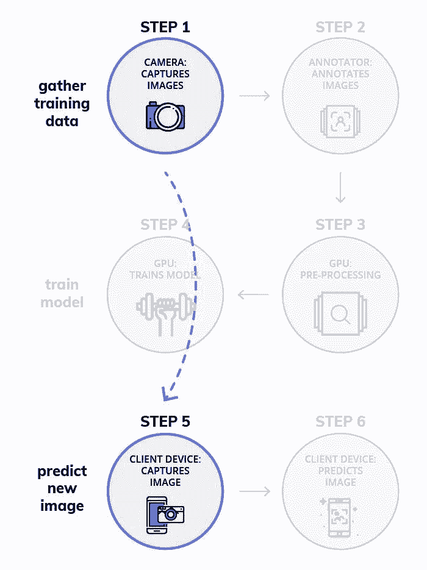

# 教程 | 用深度学习 DIY 自动化监控系统

选自 Medium

**作者：Bharath Raj**

 ****机器之心编译**

**参与：****Huiyuan Zhuo****、张倩**

> 监控在安保和巡查中发挥着重要作用，但也是一项非常乏味的任务，深度学习的出现在一定程度上将人类从这一任务中解放出来。本文介绍了如何使用基于深度学习的目标检测去搭建一个简单但有效的监控系统，还比较了使用 GPU 多处理进行推断的不同目标检测模型在行人检测方面的性能。

监控是安保和巡查一个不可或缺的组成部分。在大多数情况下，这项工作需要长时间去查找一些你不期望发生的事。我们做的这件事很重要，但也是一项非常乏味的任务。

如果有什么东西可以代替我们做「观察和等待」的工作，生活不就简单多了吗？嗯，你很幸运。凭借过去几年的技术进步，我们可以编写一些脚本来自动执行上述任务—而且也很容易实现。但在我们深入探讨之前，让我们自问：机器的表现和人类一样好吗？

任何熟悉深度学习的人都知道图像分类器的准确率已经超出了人类水平。


*传统计算机视觉（CV）和深度学习相比于人类，在 ImageNet 数据集上随时间变化的错误率。（图源：https://www.dsiac.org/resources/journals/dsiac/winter-2017-volume-4-number-1/real-time-situ-intelligent-video-analytics）*

与人类相比，机器可以以相同（或更好）的标准保持对物体的监控。因此使用技术去进行监控要高效得多。

*   监控是一项重复且乏味的任务，可能会导致人类表现的下降。但使用技术进行监控，我们就可以在出现问题时专注于采取行动。

*   为了去调查一大片区域，你会需要大量人力。而固定摄像机的视野范围是有限的。通过使用移动监控机器人（比如微型无人机）可以减轻这些问题。

此外，同样的技术还有除了安保以外的各种应用，比如婴儿监视器或自动化产品交付。

**好极了！但是我们如何实现自动化呢？**

在设计复杂的理论之前，让我们考虑一下监控的正常运作方式。如果看一段视频时发现了异常，我们就会采取行动。所以从本质上说，我们的技术应该细读视频的每一帧，希望可以发现一些异常的东西。这个过程是不是很耳熟？

正如你可能已经猜到的那样，这就是使用带有定位的目标检测的本质。它和分类略有不同，就是我们需要知道目标的确切位置。此外，我们可能在单张图像中有多个目标。


为了找到目标的确切位置，我们的算法应该检查图像的每一部分以找到一个类的存在。这比听起来更难。但自 2014 年以来，深度学习领域不断更新的研究已经引入了可以实时检测目标的复杂神经网络。


*看，仅在 2 年时间内，性能就增加了那么多！*

有几种在内部使用不同方法的深度学习架构来实现相同的任务。最流行的变种是 Faster RCNN、YOLO 和 SSD 网络。


*速度和准确率的权衡。更高的 mAP 和 更少的 GPU 运行时间是最优的。*

每个模型都依赖于一个基础分类器，该分类器对最终的准确率和模型大小有很大影响。此外，目标检测器的选择会极大影响计算复杂度和最终准确率。

> 选择目标检测算法的过程通常是速度、准确率和模型大小之间的权衡。

在本博文中，我们将学习如何使用目标检测搭建一个简单但有效的监控系统。让我们先讨论一下由于监控任务的性质而受限制的约束。

**深度学习在监控领域的限制因素**

我们经常想持续关注一大片区域的情况。在实现自动化监控前，我们需要考虑一些因素。

**1\. 视频输入**

一般来说，为了监控一大片区域，我们需要多个摄像机。此外，这些摄像机需要在某个地方存储数据；要么在本地，要么在某个远程存储。


*典型的监控摄像机。（图片来自 Unsplash 的 Scott Webb）*

较高质量的视频将比较低质量的视频占用更多的内存。此外，RGB 输入流比 BW 输入流大 3 倍。由于我们只能存储有限数量的输入流，因此通常会降低质量以最大化存储。

因此，可扩展的监控系统应该能够解析低质量的图像。因此，我们的深度学习算法也必须在低质量的图像上进行训练。

**2\. 处理能力**

现在已经解决了输入约束，我们可以去回答一个更大的问题。我们在哪里处理从摄像机中获得的数据？有两种方法可以做到这一点。

*   在中央服务器上处理：

来自摄像机的视频流在远程服务器或集群上逐帧处理。这个方法非常稳健，同时让我们得以利用高准确率的复杂模型的优势。显而易见的问题是延迟；所以你需要一个快速的网络连接来解决延迟。此外，如果你没有使用商用 API，那么服务器设置和维护的成本会很高。


*内存消耗与 GPU 推断时间（毫秒）。大多数高性能模型都会消耗大量内存。（图源：https://arxiv.org/pdf/1611.10012.pdf）*

*   边缘处理

通过连接小型微控制器，我们可以在摄像机上进行实时推断。这就没有传输延迟，同时相比之前的方法，可以更快地报告异常。此外，对于移动机器人来说，这是一个很好的补充，因此它们不需要再受到可用的 WiFi / Bluetooth 范围的限制。（比如微型无人机。）


*不同目标检测器的 FPS 性能。（图源：https://medium.com/@jonathan_hui/object-detection-speed-and-accuracy-comparison-faster-r-cnn-r-fcn-ssd-and-yolo-5425656ae359）*

缺点是，微控制器没有 GPU 那么强大，因此你可能被迫使用较低准确率的模型。使用板载的 GPU 可以避免这个问题，但代价高昂。一个有趣的解决方案是使用像 TensorRT 这样的软件，此类软件可以优化程序的推理过程。

**训练监控系统**

在本节中，我们将使用目标检测来检测一下如何识别行人。我们将使用 TensorFlow 目标检测 API 来构建我们的模块。我们会简要探讨如何设置 API，并训练其完成监控任务。详细解释见另一篇博文（https://medium.freecodecamp.org/how-to-play-quidditch-using-the-tensorflow-object-detection-api-b0742b99065d）。

整个过程可以被归纳为 3 个阶段：

1\. 数据准备

2\. 训练模型

3\. 推断


*涉及训练目标检测模型的工作流程。*

如果你想看到那些能激励你进行更多尝试的结果，请向下滚动到第 3 阶段！

**阶段 1：数据准备**

步骤 1：获取数据集

过去拍摄的监控录像可能是你可以获得的最准确的数据集。但是，大部分情况下，通常很难获得这样的监控录像。在这种情况下，我们可以训练自己的目标检测器，以便从正常图像中识别我们的目标。


*从我们的数据集中提取带注释的图像。*

如前所述，摄像机中的图像质量可能较低。因此你必须训练你的模型适应这样的工作条件。一种巧妙的方法是使用数据扩充，在此有详细解释（https://medium.com/nanonets/how-to-use-deep-learning-when-you-have-limited-data-part-2-data-augmentation-c26971dc8ced）。本质上说，我们必须添加一些噪音来降低数据集中图片的质量。我们还可以尝试模糊和侵蚀效果。

为了目标检测任务，我们将使用 TownCentre 数据集。我们将使用视频的前 3600 帧进行训练和验证，剩下的 900 帧用来测试。你可以使用我 github repo 中的脚本来提取数据集。GitHub repo：https://github.com/thatbrguy/Pedestrian-Detector。

步骤 2：注释数据集

你可以使用像 LabelImg 这样的工具来进行注释。这是一项乏味的任务，但同样重要。注释存储为 XML 文件。

幸运的是，TownCentre 数据集的所有者提供了 csv 格式的注释。我写了一个快速脚本去将注释转化为需要的 XML 格式，同样可以在上述 github repo 中找到。

步骤 3：克隆存储库

克隆存储库（https://github.com/thatbrguy/Pedestrian-Detector）。运行以下命令去安装需求包，编译一些 Protobuf 库并设置路径变量。

```py
pip install -r requirements.txt
sudo apt-get install protobuf-compiler
protoc object_detection/protos/*.proto --python_out=.
export PYTHONPATH=$PYTHONPATH:`pwd`:`pwd`/slim
```

步骤 4：准备支持的输入

我们需要给我们的目标分配一个 ID。我们在名为 label_map.pbtxt 的文件中定义 ID，如下所示：

```py
item {
 id: 1
 name: ‘target’
}
```

接着，你必须创建一个包含 XML 和图片文件名的文本文件。例如，如果你的数据集中有图像 img1-fs8.png、img2-fs8.png 以及 img1.xml、img2.xml，你的 trainval.txt 应如下所示：

```py
img1
img2
```

将你的数据集分成两个文件夹，即 images 和 annotations。将 label_map.pbtxt 和 trainval.txt 放到 annotations 文件夹中。在 annotations 文件夹中创建一个名为 xmls 的文件夹，并将所有 XML 文件放入其中。你的目录层次结构应如下所示：

```py
-base_directory
|-images
|-annotations
||-xmls
||-label_map.pbtxt
||-trainval.txt
```

步骤 5：创建 TF Records

API 接受 TFRecords 文件格式的输入。使用我的 repo 中提供的 create_tf_records.py 文件去将你的数据集转换为 TFRecords。你应该在你的基本目录执行以下命令：

```py
python create_tf_record.py \
    --data_dir=`pwd` \
    --output_dir=`pwd`
```

在程序执行完后，你会发现两个文件：train.record 和 val.record。

**阶段 2：训练模型**

步骤 1：模型选择

如前所述，这是速度和准确率之间的权衡。同时，从头开始创建并训练一个目标检测器是十分耗时的。因此，TensorFlow 目标检测 API 提供了一堆预训练模型，你可以在你的任务中对它们进行微调。这个过程被称为迁移学习，可以大幅加快你的训练过程。


*一堆在 MS COCO 数据集上的预训练模型*

下载其中一个模型，并将内容解压到你的基础目录下。你将得到模型的 checkpoint、一个冻结推理图 和一个 pipeline.config 文件。

步骤 2：定义训练任务

你必须在 pipeline.config 文件中定义「训练任务」。将文件放在基础目录下。真正重要的是文件的最后几行—你只需要将突出高亮的值分别设置为自己的文件位置。

```py
gradient_clipping_by_norm: 10.0
  fine_tune_checkpoint: "model.ckpt"
  from_detection_checkpoint: true
  num_steps: 200000
}
train_input_reader {
  label_map_path: "annotations/label_map.pbtxt"
  tf_record_input_reader {
    input_path: "train.record"
  }
}
eval_config {
  num_examples: 8000
  max_evals: 10
  use_moving_averages: false
}
eval_input_reader {
  label_map_path: "annotations/label_map.pbtxt"
  shuffle: false
  num_epochs: 1
  num_readers: 1
  tf_record_input_reader {
    input_path: "val.record"
  }
}
```

步骤 3：开始训练

执行以下命令以开始训练。建议使用 GPU 足够大的机器（假设你安装了 TensorFlow 的 GPU 版本）以加速训练过程。

```py
python object_detection/train.py \
--logtostderr \
--pipeline_config_path=pipeline.config \
--train_dir=train
```

**阶段 3：推断**

步骤 1：导出训练模型

在使用模型之前，你需要将训练好的 checkpoint 文件导出到一个冻结的推理图中。其实做比说起来容易——只需执行以下代码（用 checkpoint 数字替换「xxxxx」）：

```py
python object_detection/export_inference_graph.py \
--input_type=image_tensor \
--pipeline_config_path=pipeline.config \
--trained_checkpoint_prefix=train/model.ckpt-xxxxx \
--output_directory=output
```

你将得到一个名为 frozen_inference_graph.pb 的文件，以及一堆 checkpoint 文件。

步骤 2：在视频流上使用它

我们需要从视频源中提取单帧。可以通过使用 OpenCV 的 VideoCapture 方法完成，如下所示：

```py
cap = cv2.VideoCapture()
flag = True
while(flag):
    flag, frame = cap.read()
    ## -- Object Detection Code --
```

阶段 1 中使用的数据提取代码会自动创建一个包含测试集图像的文件夹「test_images」。我们可以通过执行以下命令在测试集上运行我们的模型：

```py
python object_detection/inference.py \
--input_dir={PATH} \
--output_dir={PATH} \
--label_map={PATH} \
--frozen_graph={PATH} \
--num_output_classes=1 \
--n_jobs=1 \
--delay=0
```

**实验**

如前所述，在选择目标检测模型时，是在速度和准确度之间进行权衡。我进行了一些实验，测量了使用三种不同模型检测到的人的 FPS 和计数准确率。此外，实验是在不同的资源约束（GPU 并行约束）上运行的。这些实验的结果可以在选择目标检测模型时，为你提供一些有价值的见解。

**设置**

我们的实验选择了以下模型。这些可在 TensorFlow 目标检测 API 的 Model Zoo 中找到。

*   带有 ResNet 50 的 Faster RCNN

*   带有 MobileNet v1 的 SSD

*   带有 InceptionNet v2 的 SSD

所有模型都在 Google Colab 上训练 10 k 步（或直到它们的损失不再下降）。推理使用了 AWS p2.8xlarge 实例。通过比较模型检测到的人数和真实结果来测量计数准确率。在以下约束条件下测试推理速度的每秒帧数（FPS）：

*   1 块 GPU

*   2 块并行 GPU

*   4 块并行 GPU

*   8 块并行 GPU

**结果**

下图是在我们的测试集上使用 FasterRCNN 生成的输出的部分结果。更多结果将在下文的视频中呈现。


**训练时间**

下图展示了训练每个模型 10 k 步（以小时为单位）所需的时间。这不包括超参数搜索所需的时间。


当你的应用程序与用于迁移学习的预训练模型大相径庭时，你可能需要大幅调整超参数。但是，当你的应用程序与之类似时，你不需要进行大量搜索。尽管如此，你可能仍需要尝试不同的训练参数，例如学习率和优化器的选择。

**速度（每秒帧数）**

这是我们实验中最有趣的部分。如前所述，我们测量了三种模型在五种不同资源约束下的 FPS 性能。结果如下所示：


当我们使用单块 GPU 时，SSD 的速度极快，能轻松超越 Faster RCNN 的速度。但是，当我们增加（并行）GPU 的数量时，Faster RCNN 会迅速赶上 SSD 的速度。毋庸置疑，在一个低 GPU 环境下，采用带有 MobileNet 的 SSD 比使用带有 InceptionNet 的 SSD 要快得多。

上图中的一个显著特征是，当我们为带有 MobileNet 的 SSD 增加 GPU 数量时，FPS 略有下降。这个明显的悖论实际上有一个简单的解释。事实证明，我们处理图像的设置比图像读取函数提供的速度快！

> 视频处理系统的速度不能快于图像输入系统的速度。

为了证明我的假设，我先启动图像读取函数。下图显示了添加延迟时带有 MobileNet 的 SSD 的 FPS 提升情况。早期图表中，FPS 的轻微下降是由于多块 GPU 请求输入所涉及的开销。


毋庸置疑，我们发现如果引入延迟，FPS 会急剧增加。最重要的是，我们需要一个优化的图像传输管道，以防止速度瓶颈的出现。但想将其应用在监控上还有一个瓶颈。监控摄像机的 FPS 设定了我们系统 FPS 的上限。

**计算准确率**

我们将计数准确率定义为我们的目标检测系统正确识别的人的百分比。我觉得该定义用在监控方面更合适。以下是我们每个模型的表现：


毋庸置疑，Faster RCNN 是最准确的模型。同样令人惊讶的是，MobileNet 的性能优于 InceptionNet。

速度与准确率之间的权衡在实验中显而易见。但是，如果有足够的资源，我们就可以以良好的 FPS 率使用高精度的模型。我们发现，使用 ResNet-50 的 Faster RCNN 准确率最高，并且当并行部署在 4+ 块 GPU 上时，具有非常高的 FPS 率。

**这有一大堆步骤！**

这里的步骤非常多。此外，为此模型设置一个实时工作的云实例将是繁重且昂贵的。

一个更好的解决方案是使用已部署在服务器上的 API 服务，这样你就只需考虑产品的开发了。这就是 Nanonets 的用武之地。他们将 API 部署在带有 GPU 的高质量硬件上，这样你就可以在没有任何麻烦的情况下获得意想不到的性能！

我将现有的 XML 注释转换为 JSON 格式并将其提供给 Nanonets API。事实上，如果你不想手动注释数据集，可以请求它们为你添加注释。以下是 Nanonets 负责繁重的工作时的简化工作流程。



*使用 Nanonets 简化工作流程*

早些时候，我曾提到像微型无人机这样的移动监控设备如何大大提高效率。我们可以使用类似 Raspberry Pi 的微控制器轻松地建造这样的无人机，同时我们可以使用 API 调用来执行推断。

开始使用 Nanonets API 进行目标检测是非常简单的，但若想要一篇讲解清楚的指南，你可以查看这篇博文（https://medium.com/nanonets/how-to-easily-detect-objects-with-deep-learning-on-raspberrypi-225f29635c74）。

**使用 Nanonets 的结果**

Nanonets 花了大约 2 个小时才完成训练。这包括超参数搜索所需的时间。就所费的训练时间而言，Nanonets 是当仁不让的赢家。Nanonets 在计数准确率方面也击败了 FasterRCNN。

```py
FasterRCNN Count Accuracy = 88.77%
Nanonets Count Accuracy = 89.66%
```

以下是在我们的测试数据集上，所有 4 个模型的性能。很明显，两种 SSD 模型都有点不稳定并且准确率较低。此外，尽管 FasterRCNN 和 Nanonets 具有相当的精度，但后者具有更稳定的边界框。

[`v.qq.com/iframe/preview.html?vid=k0771ddbo0r&width=500&height=375&auto=0`](https://v.qq.com/iframe/preview.html?vid=k0771ddbo0r&width=500&height=375&auto=0)

**自动化监控可靠吗？**

深度学习是一种令人惊叹的工具，可以轻松提供典型的结果。但是，我们能在多大程度上信任我们的监控系统并放任其自动运行？在一些情况下，自动化是令人怀疑的。

> 更新：鉴于 GDPR 和下述原因，我们有必要思考监控自动化的合法性和道德问题。此博文仅用于教育目的，文中使用了一个公开的数据集。你有责任确保你的自动化系统符合你所在地区的法律。

**1\. 不太可靠的结论**

我们不知道深度学习算法如何得出结论。即使数据输入过程无可挑剔，也可能存在大量的虚假数据。例如，英国警察使用的 AI 鉴黄过滤器不断将沙丘图像误判为裸体图像而将其删除。有引导的反向传播等技术可以在一定程度上解释决策，但我们还有很长的路要走。

**2\. 对抗性攻击**

深度学习系统非常脆弱。对抗性攻击类似于图像分类器的光学错觉。但可怕的是，一个计算出的不明显的扰动会迫使深度学习模型进行错误分类。依据相同的原理，研究人员能够通过使用「对抗眼镜」（adversarial glasses）来避免基于深度学习的监控系统出现错误。

**3\. 假正类**

另一个问题是，如果出现假正类，我们该怎么做。问题的严重程度取决于应用程序本身。例如，边境巡逻系统的假正类可能比花园监控系统更重要。应该有一些人为干预以避免意外。

**4\. 相似的面孔**

可悲的是，你的外观并不像你的指纹那么独一无二。两个人（或更多人）看起来非常相似是可能的。同卵双胞胎是最好的例子之一。据报道，苹果的 Face ID 无法区分两个无亲属关系的中国员工。这会使监控和识别人变得更难。

**5\. 数据集缺乏多样性**

你提供多好的数据，深度学习算法就有多好。最受欢迎的人脸数据集只有白人样本。对于孩子来说，人类存在各种肤色似乎是显而易见的，但深度学习算法却有点傻。谷歌就曾因为将一个黑人错误地归类为大猩猩而陷入麻烦。

原文链接：https://medium.com/nanonets/how-to-automate-surveillance-easily-with-deep-learning-4eb4fa0cd68d

****本文为机器之心编译，**转载请联系本公众号获得授权****。**

✄------------------------------------------------

**加入机器之心（全职记者 / 实习生）：hr@jiqizhixin.com**

**投稿或寻求报道：**content**@jiqizhixin.com**

**广告 & 商务合作：bd@jiqizhixin.com****