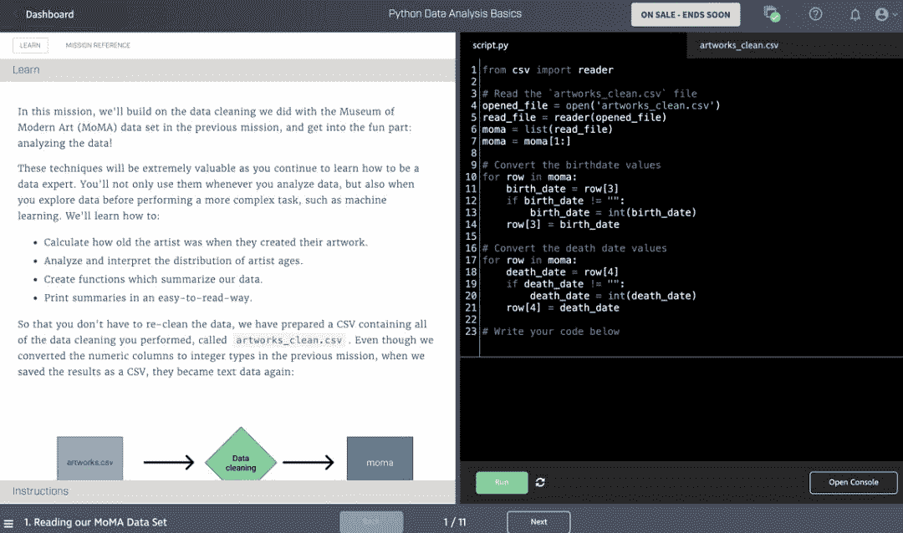

# 不交学费也能成为数据科学家，这里有一条免费学习路径

> 原文：[`mp.weixin.qq.com/s?__biz=MzA3MzI4MjgzMw==&mid=2650772155&idx=1&sn=b0d3c08189479e26916736ca09e30c5b&chksm=871a56c5b06ddfd3f6ffe702ff91f26137d152942f4e874142608aba1019c5305f49266fcc6e&scene=21#wechat_redirect`](http://mp.weixin.qq.com/s?__biz=MzA3MzI4MjgzMw==&mid=2650772155&idx=1&sn=b0d3c08189479e26916736ca09e30c5b&chksm=871a56c5b06ddfd3f6ffe702ff91f26137d152942f4e874142608aba1019c5305f49266fcc6e&scene=21#wechat_redirect)

选自 towardsdatascience

**作者：Rebecca Vickery**

**机器之心编译**

**参与：魔王**

> 如何通过免费方式学习数据科学？数据科学家 Rebecca Vickery 从技术能力、理论和实践经验三个方面入手介绍了自己的经验。

在传统教育机构中读硕士学位的平均成本差不多在 3 万到 12 万美元之间。在线数据科学学位课程也不便宜，最低成本为 9000 美元。如果你想学数据科学，但支付不起这笔费用，应该怎么办呢？我在成为数据科学家之前没有经历过任何正式的专业教育。本文将分享我的个人课程表，无需支付数千美元也能学习数据科学。该课程包含 3 个主要部分：技术能力、理论和实践经验。文中包含该学习路径中每个元素的免费资源链接，以及一些「低成本」资源的链接。如果你想花一点钱加速学习过程，你可以把这些资源添加到课程中。本文会说明每项资源的预计成本。**技术能力**本课程的第一部分为技术能力。推荐大家先学习这部分内容，这样你就可以采取实践优先的学习方式，而不是以数学理论为先。目前，Python 是数据科学领域使用最广泛的编程语言。根据 Kaggle 2018 机器学习及数据科学调查报告，83% 的受访者在日常工作中使用 Python。因此，我推荐大家学习 Python 语言，同时也推荐大家花一点时间学习其他语言，比如 R 语言。**Python 基础**使用 Python 执行数据科学任务之前，你需要先掌握 Python 背后的基础知识。你需要一门 Python 入门课程。网上有很多免费教程，我最喜欢的是 Codeacademy 的教程，因为它们允许在浏览器内进行动手编程实践。我推荐大家学习这个 Python 入门课程，该课程涵盖 Python 基础语法、函数、控制流、循环、模块和类。课程地址：https://www.codecademy.com/learn/learn-python**使用 Python 做数据分析**接下来，你需要充分了解如何使用 Python 做数据分析，这方面有很多不错的资源。首先，我推荐大家至少学完 dataquest.io 上数据分析师学习路径的免费部分。Dataquest 提供完整的数据分析师、数据科学家和数据工程师学习路径。其中大量内容，尤其是数据分析师学习路径的内容可以免费获取。如果你资金充足，我强烈建议你付费订阅并学习这些内容。我学了这个课程，从中了解到数据科学的基础知识。数据科学家路径课程花费了我 6 个月时间。每个月的价格从 24.5 美元到 49 美元不等，这取决于你是否购买年费会员。资金充足的话，购买年费会员更划算（https://www.dataquest.io/subscribe/）。

*Dataquest 平台（https://app.dataquest.io/dashboard）***使用 Python 做机器学习**如果你已经学完了 Dataquest 上的数据科学课程，那么你应该对使用 Python 执行机器学习的基础知识有了充分了解。如果还没有，这方面也有很多免费资源。我推荐首先从 scikit-learn 开始学起，因为 scikit-learn 是目前最常用的机器学习 Python 库。我很幸运，在学习过程中参加了 scikit-learn 核心开发者之一 Andreas Mueller 举办的为期两天的 workshop。他发布了该课程的所有材料，包含幻灯片、课程笔记和 notebook。推荐大家先学习这份资料。课程资料地址：https://github.com/amueller 接下来，我推荐大家学习 scikit-learn 官方文档中的一些教程。之后，大家就可以构建一些实际机器学习应用，学习模型运行背后的理论了。scikit-learn 文档地址：https://scikit-learn.org/stable/tutorial/basic/tutorial.html**SQL**想成为数据科学家，SQL 是必不可少的一项技能，因为抽取数据是数据建模的基础流程之一。这通常需要对数据库运行 SQL query。如果你没有学完上述 Dataquest 数据科学课程，那么这里有一些免费资源可供选择。Codeacamdemy 有一门 SQL 入门课程，这门课实践性很强，学习过程中你可以在浏览器内进行编程。课程地址：https://www.codecademy.com/learn/learn-sql 如果你还想了解基于云的数据库查询，那么 Google Cloud BigQuery 是不错的选择。它有免费试用方案，你可以免费尝试 query、大量公共数据集，以及阅读官方文档（https://cloud.google.com/bigquery/docs/tutorials）。

*Codeacademy SQL 课程***R 语言**要想成为全面的数据科学家，只学 Python 还不够。我推荐大家学习一门 R 语言入门课程。Codeacademy 就有一门免费入门课程。课程地址：https://www.codecademy.com/learn/learn-r。值得注意的是，Codeacademy 的 pro 版本也提供完整的数据科学学习计划（升级 pro 账户需要每月支付 31.99 到 15.99 美元不等，具体费用取决于预先支付多少个月）。我个人觉得 Dataquest 的课程更加全面，但 Codeacademy 的这门课程要便宜一些。**软件工程**掌握软件工程技能和最佳实践是明智的做法，这会使代码更具可读性和可扩展性。此外，当你开始将模型投入生产过程时，你需要写出高质量、测试良好的代码，并熟练使用版本控制等工具。这里有两个不错的免费资源。「Python Like You Mean It」涵盖 PEP8 风格指南、文档，以及面向对象的编程。地址：https://www.pythonlikeyoumeanit.com/intro.html（有中文版）scikit-learn 贡献指南旨在促进开发者对 scikit-learn 库的贡献，但它实际上也涉及最佳实践。它包括 GitHub、单元测试、debug 等话题，而且其写作背景是数据科学应用。scikit-learn 贡献指南地址：https://scikit-learn.org/stable/developers/contributing.html**深度学习**要想对深度学习有一个全面的了解，我觉得 fast.ai 是最好的选择，它完全免费且没有广告。该课程包含机器学习导论、深度学习实践、计算线性代数和自然语言处理导论（代码优先）。所有课程都以实践为先，强烈推荐大家学习这些课。课程地址：https://www.fast.ai/

*fast.ai 平台***理论**你在学习技术能力部分时，一定会遇到一些代码背后的理论知识。我推荐大家在学习实践能力的同时学习理论知识。我自己采取的方式是：学习能够实现某项技术的代码（比如 KMeans），在代码运行后深入了解其概念，如惯性（inertia）。scikit-learn 文档包含 KMeans 算法背后的所有数学概念，地址：https://scikit-learn.org/stable/modules/clustering.html#k-means。这部分将介绍重要的基础理论知识。可汗学院几乎涵盖以下列举的所有概念，且可免费学习。你可以在注册可汗学院时选择想要学习的主题，这样就可以得到量身定做的理论学习路径了。查看下图中的所有复选框，提前了解下文将要列举的大部分理论元素。

*可汗学院***数学**微积分微积分的维基百科定义是「一门研究变化的学问」。换句话说，微积分能够找出函数之间的模式，比如导数可以帮助你理解函数随着时间的变化。很多机器学习算法利用微积分优化模型性能。如果你稍微了解机器学习，就一定听说过梯度下降。梯度下降就是：迭代地调整模型参数值，以找出能够最小化成本函数的局部极小值。梯度下降是微积分在机器学习中的应用的绝佳案例。你需要了解以下知识：导数

*   几何定义

*   计算函数的导数

*   非线性函数

链式法则

*   复合函数

*   复合函数的导数

*   多个函数

梯度

*   偏导数

*   方向导数

*   积分（Integrals）

线性代数很多流行的机器学习方法（包括 XGBoost）使用矩阵来存储输入和处理数据。矩阵和向量空间、线性方程构成了线性代数。要想了解机器学习方法的工作原理，你需要首先掌握线性代数知识。你需要学习：向量和空间

*   向量

*   线性组合

*   线性相关和线性无关

*   向量点积和叉积

矩阵变换

*   函数和线性变换

*   矩阵相乘

*   反函数

*   转置矩阵

**统计学**以下是你需要了解的重要概念：描述性统计

*   如何总结数据样本

*   不同分布类型

*   偏斜度、峭度和集中趋势（如均值、中位数、众数）

*   依赖性度量，以及变量之间的关系（如相关性和协方差）

实验设计

*   假设检验

*   采样

*   显著性检验

*   随机性

*   概率

*   置信区间和双总体推断（two-sample inference）

机器学习

*   坡度推断

*   线性和非线性回归

*   分类

**实践经验**第三部分是实践。要想真正掌握上述概念，你需要在类似现实应用的项目中使用这些技能。实践过程中，你会遇到一些问题，如数据丢失、数据出错，并逐渐发展出该领域的深层专业能力。这部分将列举一些可供免费获取实践经验的地方。

> 「实践的目的不仅是实现潜能，还在于开发潜能，使之前不可能的事变为可能。这要求你勇于挑战：走出舒适区，强制大脑或身体不停适应。」Anders Ericsson，《Peak: Secrets from the New Science of Expertise》

**Kaggle 等竞赛**机器学习竞赛是获取构建机器学习模型实践经验的好去处。它们提供大量数据集、待解决问题和排行榜。排行榜是衡量现有知识能否开发出优秀模型的重要方式，还能帮助你发现哪些地方需要改进。除了 Kaggle，还有很多机器学习竞赛平台，如 Analytics Vidhya 和 DrivenData。

*DrivenData 竞赛页***UCI 机器学习库**UCI 机器学习库包含大量公共数据集。你可以使用这些数据集创建自己的数据项目，包括数据分析和机器学习模型。你甚至可以尝试使用 web 前端构建一个部署模型。将自己的项目存储在公共平台是个好办法，比如 GitHub，这可以帮你创建作品集，展示个人技能，为未来的求职打下基础。

*UCI 机器学习库***开源贡献**另一个选择是为开源项目做贡献。很多 Python 库依赖社区进行维护，黑客马拉松活动常常会在社区聚会和会议时举办，新手也可以参加这类聚会。参加这些活动可以帮你积攒实践经验，并提供一个向他人学习同时反馈他人的环境。Numfocus 就是一个例子。本文介绍了数据科学学习路径和免费学习在线课程与教程。在个人作品集中展示技能是未来求职的重要工具。我相信教育应该惠及每一个人，至少互联网为数据科学学习者提供了这样的机会。除了以上列举的资源，我之前还写过一份数据科学推荐阅读清单，包含 10 本在线免费书籍，可以作为本文的补充。阅读清单地址：https://medium.com/vickdata/10-free-data-science-books-you-must-read-in-2019-2d4f32793a51 华为云近期推出精编实战公开课，涵盖机器学习、大数据、运维实战等多项系列课程，由华为云资深工程师倾情讲授，完成理论学习+实践内容还有精美礼品相赠。点击阅读原文，选择课程，免费报名。

