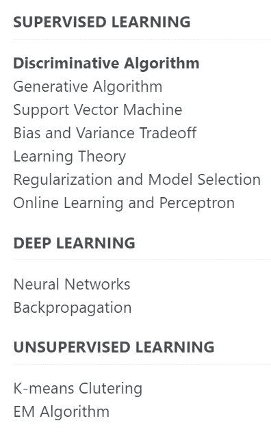

# 入门机器学习，照这个课程清单按顺序学就对了

> 原文：[`mp.weixin.qq.com/s?__biz=MzA3MzI4MjgzMw==&mid=2650767325&idx=2&sn=40fbe6cd7076bbc49eed34252066e6d7&chksm=871abba3b06d32b5903ea0689a1b9c7606a689e3003a8b8f1398a1f9dc2f976ec9adebbcb645&scene=21#wechat_redirect`](http://mp.weixin.qq.com/s?__biz=MzA3MzI4MjgzMw==&mid=2650767325&idx=2&sn=40fbe6cd7076bbc49eed34252066e6d7&chksm=871abba3b06d32b5903ea0689a1b9c7606a689e3003a8b8f1398a1f9dc2f976ec9adebbcb645&scene=21#wechat_redirect)

机器之心整理

**参与：张倩、杜伟**

> 入门机器学习是一个循序渐进的过程，优质的学习资源和科学的学习路线缺一不可。在本文中，来自英伟达人工智能应用团队的计算机科学家 Chip Huyen 不仅列出了十大优质的免费机器学习课程资源，还将其串成了一条高效的学习路线。

Chip Huyen 是一位来自越南的作家和计算机科学家，现居于美国硅谷，就职于英伟达人工智能应用团队。*Chip Huyen*她本科和硕士均就读于斯坦福大学计算机科学专业，曾开设和讲授课程《TensorFlow for Deep Learning Research》。该课程链接：http://web.stanford.edu/class/cs20si/她还曾协助推出越南第二受欢迎的网络浏览器 Coc Coc，每月活跃用户数量达 2000 万以上。她目前正在进行的一些项目包括 SOTAWHAT（查询和总结 SOTA 人工智能研究成果）、OpenSeq2Seq（利用语音识别、Text2Speech 和 NLP 进行高效实验的工具包）以及 Free Hugs Vietnam（为越南青少年提供软技能的非盈利项目）等。以下是她给出的《机器学习》资源清单和路线：**1\. 斯坦福《概率与统计（Probability and Statistics）》**链接：https://online.stanford.edu/courses/gse-yprobstat-probability-and-statistics 简介：这门课程涵盖了概率和统计学的基本概念，涉及机器学习的四个基本方面：探索性数据分析、生产数据、概率和推理。**2.MIT《线性代数（Linear Algebra）》**链接：https://ocw.mit.edu/courses/mathematics/18-06-linear-algebra-spring-2010/简介：这门课程的授课教师为《线性代数导论》、《[线性代数与数据学习](http://mp.weixin.qq.com/s?__biz=MzA3MzI4MjgzMw==&mid=2650755329&idx=5&sn=b8c8d842e3ffc16adf00edbdb55203eb&chksm=871a957fb06d1c695a83776f48cec6af0cbb740dd55225444b8d87fbf49b99ad2b652cce237e&scene=21#wechat_redirect)》的作者 Gilbert Strang。该课程与《线性代数导论》中的理论和应用知识相辅相成，挑选了书中四个关键的应用：图和网络；微分方程组；最小二乘与投影；傅里叶级数和快速傅里叶变换。作者表示，这是自己见过的最好的线性代数课程。*Gilbert Strang***3\. 斯坦福 CS231N《用于视觉识别的卷积神经网络（Convolutional Neural Networks for Visual Recognition）》**链接：https://www.youtube.com/playlist?list=PLzUTmXVwsnXod6WNdg57Yc3zFx_f-RYsq 简介：这门课程的特点是理论与实践并重。课程 PPT 用了可视化的方式解释反向传播、损失、正则化、dropout、batchnorm 等比较难以理解的概念。**4.fastai《程序员深度学习实战（Practical Deep Learning for Coders）》**链接：https://course.fast.ai/简介：这门实践课程是面向新手的，不要求参与者拥有大学水平的数学知识，也不要求参与者有很多的数据，但需要一年的编程经验，还需要配备一块 GPU。此外，该课程还有一个论坛，专门用来讨论 ML 的最佳实践。**5\. [斯坦福 CS224N](http://mp.weixin.qq.com/s?__biz=MzA3MzI4MjgzMw==&mid=2650758563&idx=3&sn=91db157f614f29b1d5bbcfcd94c7da34&chksm=871a99ddb06d10cbfedf8d01c4413d189772bcfb479d41bbf4576274be4534891a52616b500b&scene=21#wechat_redirect)《深度学习自然语言处理（Natural Language Processing with Deep Learning）》**链接：https://www.youtube.com/playlist?list=PLU40WL8Ol94IJzQtileLTqGZuXtGlLMP_简介：对于对 NLP 感兴趣的同学来说，这是一门不容错过的课程，被称为入门自然语言处理（NLP）的「标配」公开课。它和计算机视觉方面的课程 CS231n 堪称绝配。该课程组织严密、教法得当、紧跟前沿研究趋势。这门课的授课者是斯坦福 AI 实验室负责人 Christopher Manning。**6.[Coursera 上的斯坦福《机器学习》](http://mp.weixin.qq.com/s?__biz=MzA3MzI4MjgzMw==&mid=2650752922&idx=2&sn=7ee3962b266b695e330a409325dcbe43&chksm=871a83e4b06d0af257d89e302ee09aaf7a985e7b33e89830d87f5f42ad6f50bae8fbbb920237&scene=21#wechat_redirect)。**链接：https://www.coursera.org/learn/machine-learning

简介：这门课授课者是吴恩达，在 Coursera 上的注册人数已达到 244 万。它广泛介绍了机器学习、数据挖掘、统计模式识别等方面的内容，包含监督学习、无监督学习、机器学习最佳实践等主题。此外，课程中还包含大量的应用案例。**7\. 斯坦福《概率图模型专项课程（Probabilistic Graphical Models Specialization）》**链接：https://www.coursera.org/specializations/probabilistic-graphical-models 简介：概率图模型是一个丰富的框架，用于编码复杂领域的概率分布。本课程包含三部分内容：《概率图模型 1：表征》、《概率图模型 2：推理》和《概率图模型 3：学习》。授课者为斯坦福大学工程学院讲师 Daphne Koller。**8\. DeepMind《强化学习入门课程（Introduction to Reinforcement Learning）》**链接：https://www.youtube.com/watch?v=2pWv7GOvuf0&list=PLqYmG7hTraZDM-OYHWgPebj2MfCFzFObQ 简介：本课程借助于一些生动直观的解读和有趣易懂的示例，为学生提供了有关强化学习（RL）的全面介绍。授课者为世界顶级专家 David Silver。**9\. Full Stack Deep Learning《全栈深度学习训练营（Full Stack Deep Learning Bootcamp）》**链接：https://fullstackdeeplearning.com/march2019 简介：这是为熟悉深度学习基础的开发人员提供的实践项目。除了学习训练和调整模型之外，学生还可以学习到如何制定问题和预估项目成本、选择正确框架和计算基础结构以及训练中的故障排查和确保复现性等其他技能。**10\. Coursera《如何赢得数据科学竞赛：向顶尖 Kaggler 学习（How to Win a Data Science Competition: Learn from Top Kagglers）》**链接：https://www.coursera.org/learn/competitive-data-science 简介：如果你想要参加竞争激烈的数据科学竞赛并希望在竞赛中取得好成绩，本课程不失为最好的选择。你将会学习到如何在数据科学竞赛中分析和解决预测建模任务。

********本****文为机器之心整理，**转载请联系本公众号获得授权****。**

✄------------------------------------------------

**加入机器之心（全职记者 / 实习生）：hr@jiqizhixin.com**

**投稿或寻求报道：**content**@jiqizhixin.com**

**广告 & 商务合作：bd@jiqizhixin.com**