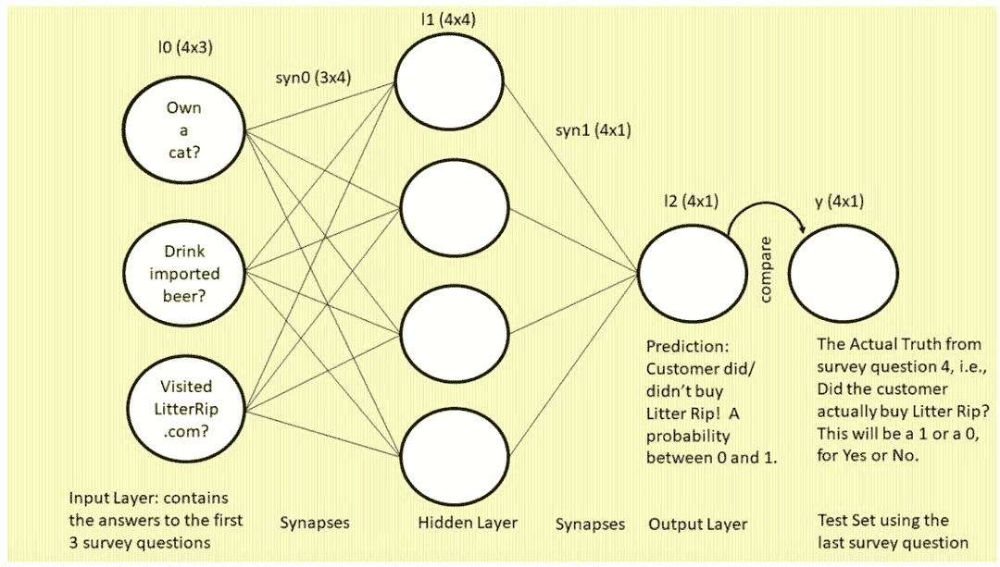

# 十八、个月自学 AI，2 年写就三万字长文，过来人教你如何掌握这几个 AI 基础概念

> 原文：[`mp.weixin.qq.com/s?__biz=MzA3MzI4MjgzMw==&mid=2650767895&idx=1&sn=1cad73020b8e1b76650171bbb0483e86&chksm=871a4669b06dcf7f8373cc53ee4d431f02c388d814ee4b8135f01e82e4ac7fa781358e580476&scene=21#wechat_redirect`](http://mp.weixin.qq.com/s?__biz=MzA3MzI4MjgzMw==&mid=2650767895&idx=1&sn=1cad73020b8e1b76650171bbb0483e86&chksm=871a4669b06dcf7f8373cc53ee4d431f02c388d814ee4b8135f01e82e4ac7fa781358e580476&scene=21#wechat_redirect)

选自 colab.research

**作者：****David Code****机器之心编译****参与：魔王、思、张倩**

> David Code 有多个身份：他是旅行作家，通晓多国语言，他还是一名「AI 教师」。没有数学和软件背景的 David 用 18 个月的时间通过在线课程和博客自学 AI，并花费两年时间撰写了一篇长文。为了使和他一样没有数学基础的人也能入门人工智能，他在这篇文章中运用了大量类比、例子、故事、图示，将重要的知识点或步骤反复强调。这是一篇真正针对初学者的 AI 教程，不只讲概念，还讲概念的底层原理。

由于原文过长，机器之心在编译过程中进行了少量删节。想了解更多细节，请查看原文链接：https://colab.research.google.com/drive/1VdwQq8JJsonfT4SV0pfXKZ1vsoNvvxcH#scrollTo=C810qURdm3hZ。想学 AI 又担心没有数学背景或软件背景？没关系，这篇博客非常适合你。我曾经花费一年半的时间自学各种在线课程和博客，过程中有太多专家、太多信息，而且他们的很多观点还有冲突。我在学习过程中经常充满自我怀疑。我不想要很多专家帮我学习，我只想要一个老师。我希望有人能够拉着我的手说：「Dave，这就是你需要学的东西，请按照这个顺序学。现在我将用图画、有趣的故事、现实示例和浅显易懂的语言教你学习 AI。」而现在，我就是那个老师。为什么是我？和网上的专家不同，我没有数学或编程背景，不过我曾就读于耶鲁大学和普林斯顿大学，环游过 100 多个国家，是一名旅行作家，我曾在《周六夜现场》工作，我的作品得过奖。也就是说，我知道如何通过写作来传达复杂的概念，知道如何讲故事。我热爱教学，也善于发现好的老师。在学习深度学习过程中我遇到了四位优秀的老师，他们是 Andrew Trask、Grant Sanderson、Kalid Azad 和我的导师 Adam Koenig。最重要的是，我理解你正在经历的痛苦。你听说过「专家盲区」（expert blindness）吗？专家向新手讲授某个学科时，由于他成为专家的时间太久，会忘了初学者对教材的感受。因此专家会快速介绍一些复杂的概念，而这些概念需要分解成小块才能方便初学者掌握。或者他们不使用类比、图画或示例来帮助初学者掌握概念，导致初学者非常受挫。每一个初学者都想要专家来教他们 AI。而事实上，你需要的不是专家，而是一名老师。最好的教师就是那个刚刚学过这些知识的人，因为他仍然记得自己挣扎过的地方以及克服方法，并且他可以向你传授捷径。而我就是这个人。我不是专家，但我是个好老师，而且富有激情。**本文使用指南**本文的阅读过程和小说不同，只读一次是无法理解和掌握所有内容的。我学数学的朋友告诉我，他们常常需要读至少 7 遍数学文本才能开始理解。这不是开玩笑……为方便讲授，我使用了类比、图画、示例和几何表示。但是请放心，本文在数学层面上是准确而严谨的。请做好阅读本文五遍的准备，无法立刻领会也不要着急。我在学习复杂材料的时候，通常会设置计时器，每五分钟响一次，不断地提醒自己不要在绝望中沉沦，要微笑、耐心并坚持下去。这真的有效，相信我。以下是一些宏观要点：

*   神经网络是深度学习中非常流行的前沿技术；

*   深度学习是机器学习的分支；

*   机器学习是人工智能的分支。

深度学习包括四个主要概念。本文的目标是让读者掌握这四个深度学习基础概念：

*   前馈

*   梯度下降

*   全局最小值

*   反向传播

之前对这四个概念一无所知？没关系，首先我会使用类比和图示尽量简单地讲授这些知识，然后不断地回到这四个概念，探讨其中的细节。你应该将本文看作一个「螺旋上升」的学习过程，每一次回到这些概念时你都会收获更多见解。本文共有五个部分：1\. 深度学习概览：示例、类比、图示、玩笑 2\. 28 行代码创建神经网络：神经元和突触 3\. 前馈：做出有根据的猜测，60000 次迭代 4\. 从试错中学习：梯度下降和全局最小值 5\. 反向传播：链式法则**1\. 深度学习概览****1.1 示例**想象你是一家宠物店的老板，事业经营得很成功，而这成功很大程度上是因为你善用 AI 技术。你构建了一个深度神经网络，来选择潜在新顾客，并向他们发送广告。一个月前，你上线了一款新猫砂「Litter Rip!」。你试图找到愿意给自己的猫使用这款猫砂的顾客。而你的秘密武器是数据集。新猫砂上线一个月后，你对宠物店顾客进行了调查并收集了一些数据。调查包括以下问题：

*   您有猫吗？

*   您喝进口啤酒吗？

*   过去一个月，您是否访问过我们的网站 LitterRip.com？

*   过去一个月，您是否购买过 Litter Rip! 猫砂？

这四个问题的答案即之前顾客的「特征」（feature）。那么问题来了：什么使得 AI 网络如此强大？答案是：它使用调查结果进行训练，从而准确地预测未来顾客的购买行为。首先，你需要将之前顾客的调查数据和他们对前三个问题的回答输入到网络中，进行训练。该网络使用这些数据预测某位顾客是否确实购买了新款猫砂。然后网络再将预测结果与顾客第四个问题的答案进行对比。第四个问题的答案就是标签，作为事实供网络进行对比。例如，如果网络预测结果是「是的，我认为这位顾客买过 Litter Rip! 猫砂」，而这位顾客第四个问题的答案确实是「Yes」，那么你就拥有了一个成功的神经网络。神经网络通过试错进行自我训练：网络先预测，然后对比预测结果与第四个问题的真正答案，再从错误中学习，并在多次迭代中不断改进。神经网络通常在一个数据集上训练，在另一个数据集上执行预测，理解这一点很重要。一旦你的神经网络很擅长根据之前顾客的调查数据预测新款猫砂的购买情况，那么你就可以换一个新的数据集，该数据集包含潜在新顾客的名单。你从兽医那里得到了新的数据集，这些被调查者回答了前三个问题。现在，如果让你用训练好了的网络在潜在新顾客中预测广告投放的最佳对象，你该怎么做呢？我们来看下一节。**1.2 类比：神经元和突触**下图是我们将要构建的 3 层神经网络，图中使用的是常见的「神经元和突触」格式：我们先来看这张图，图中是一个三层的前馈神经网络。左侧为输入层：三个圆圈表示神经元（即节点或特征，该网络将使用前三个调查问题作为特征）。现在，你看着这一列圆圈，想象它们分别代表一位顾客的答案。左上的圆圈包含问题 1「你有猫吗？」的答案，左中圆圈包含问题 2「你喝进口啤酒吗？」的答案，左下圆圈表示问题 3「你是否访问过我们的网站 LitterRip.com？」的答案。那么，如果顾客 1 对这三个问题的答案是「Yes/No/Yes」，则左上圆圈包含 1，左中圆圈包含 0，左下圆圈包含 1。突触（连接这些圆圈和隐藏层的所有线）是神经网络用来「思考」的部位。右侧的单个圆圈（它依然和四个突触相连）是网络的预测结果，即「基于输入到网络的特征组合，此处展示了这位顾客购买新款猫砂的概率。」最右侧标注「y」的单个圆圈表示真值，即每个顾客对第四个调查问题「你是否购买过 Litter Rip! 猫砂？」的回答。这个圆圈有两个选择：0 表示没买过，1 表示买过。神经网络将输出一个预测概率，并将其与 y 进行对比，查看准确率，然后在下一次迭代中吸取教训。神经网络在数秒时间内可以完成数万次试错。上图是神经网络的典型图示。本质上，它描述的是前馈，即我们要介绍的第一个主要概念。你可能以为神经元是该过程中最重要的部分，但是这里的类比似乎存在一些误导性。事实上，本文要介绍的四个深度学习主要概念的共同驱动力是突触。因此，目前这部分最重要的知识点是：突触使得预测发生。下面一节我会把这一概念类比为落进碗里的乒乓球。在进行下一个类比之前，我想首先详细解释一下神经网络之所以强大的原因。**1.3 类比：碗与球****重点来了！人工智能如此强大的原因是：神经网络使用概率对下一次预测进行渐进式的改进。该过程将试错学习提升到一个全新的层次。**我们先来看一下人类是如何预测的：假设你的桌子上有一些之前顾客的调查结果，旁边还有一叠潜在新顾客的调查结果（即兽医提供给你的调查数据）。人类如何使用之前顾客的调查结果预测未来顾客的购买行为呢？你可能会想：「我的模糊逻辑告诉我，喝进口啤酒的顾客和买新款猫砂的顾客没有关联。我查看了顾客调查结果，试图寻找出一种模式，我认为拥有猫和访问过 LitterRip.com 网站的顾客购买过 Litter Rip! 猫砂。」在只有三个调查问题、四名被调查顾客时，这是可行的。但是如果有 40 个问题、4000 名顾客呢？人类如何决定哪一个问题作为执行准确预测的核心因素？人类大脑能够容纳的数量是有限的，我们很难量化 40000 名顾客中的某一位购买新款猫砂的概率。这个数字是 67% 还是 68%？谁知道呢！现在我们来看神经网络如何执行预测：神经网络不会将预测局限于直截了当的「是」或「否」，相反，它会预测出一个 0 和 1 之间的数字——概率。例如，0.67 表示「该顾客有 67% 的可能购买新款猫砂」，0.13 表示「该顾客有 13% 的可能购买新款猫砂，可能性较小。」这就说明了为什么给出一个 0 到 1 之间的概率数字是明智的：就算计算机的第一次预测结果与实际情况大相径庭也没有关系。真正重要的是，网络会将概率 0.13 与真值进行对比（假设真值是 1，即该顾客购买了新款猫砂），网络会注意到它的预测结果偏离真值 0.87，这是一个比较大的误差，因此网络会进行调整。网络将保持数字清晰展现，同时调整数字，增加一些值降低另一些值，以找到更好的问题组合，从而使下一次预测能够得到更加准确的预测结果。将该步骤重复数万次，直到计算机最终能够自信地说：「我很高兴地宣布，现在我的预测结果可以媲美真值了，误差几近于零。现在我可以准确预测了。」现在，你知道了深度神经网络的强大原因，它使用概率和试错学习方法，渐进式地改进下一次预测的结果。我可以用一幅简单清晰的图画描述试错学习过程：网络的试错学习就像顺着碗边滚落的乒乓球，最终将落在碗底。前面我解释了神经网络如何执行预测：计算误差，改善下一次的预测结果，直到误差减少到几乎为零。执行预测的神经网络就像顺着碗侧滚落的乒乓球。我们假设碗底就是「乌托邦」——准确的预测结果，那么网络的第一次预测就是该「预测球」（乒乓球）的起始位置；第二次预测时，乒乓球沿着碗侧向底部前进一点距离；第三次预测时，球又向碗底前进一点……如下图所示，网络的每一次预测就是乒乓球向碗底前进时的新位置。预测球滚落以及在到达完美位置（碗底）之前的准确率改进过程包括四步：

*   前馈：想象一下 1960 年的 IBM 计算机，大到填满整个房间，穿孔卡片从一端输入，答案从另一端输出。上文提到的神经网络以前三个调查问题的数据作为输入，得出预测结果；

*   全局最小值：想象一下桌子上有一个黄色的碗（如上图所示）。桌子表面表示几乎零误差的完美预测结果，那么很显然碗底是最接近完美预测结果的位置，具备最小的误差。与碗整个表面（即「全局表面」（global surface））相比，碗底最接近完美，它具备全局最小误差值。

网络每次进行更好的预测时，粉色的预测球沿着碗侧向底部全局最小误差值前进。每一次预测后，网络将预测结果与第四个问题的答案进行对比，这类似于在特定时刻衡量预测球与碗底的距离。衡量预测结果与真值的距离叫做「找出误差」。网络每次预测的目标都是持续地缩短与全局最小值之间的误差。

*   反向传播：想象一位杂技表演者，他能向空中抛接 16 个不同大小和重量的保龄球瓶，并使它们同时悬在空中，甚至可以神奇地调整保龄球瓶的大小和重量。网络在执行预测后，会返回到上一次预测的过程中，查看是否可以做一些调整，以便在下一次预测中缩小误差，推动小球向碗底前进。

*   梯度下降：想象粉色乒乓球沿着碗侧向碗底滚落，碗底即全局最小值（见上图）。网络就像那个球，碗的表面由网络的每一次预测构成。梯度下降就是球沿着碗侧滚落向碗底（即具备全局最小误差的预测）的过程。

换句话说：

*   梯度下降是网络在达到准确预测（即全局最小误差）前的试错过程，就像乒乓球滚落碗底的过程；

*   前馈即执行预测。预测就像给定时刻球停留在碗表面某个位置的定格图像；

*   全局最小值即预测几乎没有误差的完美位置（碗底）。我们的目标是到达碗底。网络将预测结果与真值进行对比，来衡量球目前位置与碗底的距离（误差）；

*   反向传播即返回到上一次预测，找出错误并修正。反向传播衡量球现在位置到其下桌面的距离（即误差），并找出推动球向碗底前进的方法。

记住：我们现在只是粗略了解，所以即便有些地方没有掌握也不要担心。在详细解释这些概念之前，我想把「碗和球」的类比再推进一步。上图展示了神经网络训练过程中的四个主要步骤，但过于简化。它准确地表示了只有一个调查问题的网络，该网络也仅基于这一个问题做出预测。但是，我们想做的是结合三个调查问题找出最佳预测。因此，如果网络在试错迭代过程中使用不同问题组合进行试验，碗会是什么样子呢？答案是：一只凹凸不平的碗。如下图所示：

*图源：**https://www.youtube.com/watch?v=IHZwWFHWa-w&t=2s&index=3&list=PLZHQObOWTQDNU6R1_67000Dx_ZCJB-3pi*

上图中红色的碗有一些凸起和凹陷，为什么会这样呢？首先，我们必须理解红色碗由什么构成。从图中看它似乎是塑料做的……不过并不是，想象它由数百万个红点构成，每个红点都是 3D 网格中的一个点。每个点表示一个可能的调查问题组合，以及该组合中哪个问题对于网络执行预测的等级更高。这个凹凸不平的碗让我们看到了所有可能组合的凹凸不平的表面。记住这幅图：红色碗是「所有排列组合的表面」，它像山脉一样有高峰、深谷、山岭、河床。网络无法穷尽浩瀚宇宙中每一个可能的排列组合，这会花费太多计算时间。因此，它从你随机「抛掷预测球」的位置出发，一路向下走向谷底（即全局最小值）。网络不需要管它从哪里开始出发，它只需要在意从随机的起始点到达碗底即可。在解释红色的凹凸不平处之前，我们先来看从红碗右上角开始的白色虚线。这条线的顶端就是网络的第一次预测。还记得上文介绍的红色乒乓球吗？假设乒乓球就在白线顶端处，白色虚线表示网络预测结果从起始点到全局最小值的路径。也就是说乒乓球沿着这条白色虚线走到误差最小、预测准确率最高的地方。但是为什么这条白色虚线路径如此弯曲呢？原因在于，网络的常规试验需要考虑组合哪些问题、每个问题的权重多大，才能得到误差最小的最佳预测结果。网络的常规目标是尽可能降低误差，即让乒乓球尽快到达红碗底部。因此网络通常采用虚线上球所在点的坡度，来确定哪个方向具备最陡峭的坡度，能够实现最快的向下路径。由于坡度不断改变，这条路径就很曲折。我们来看一个简单的例子：人类第一眼就会判断这两个问题（「你有猫吗？」和「你访问过我们网站吗？」）是做出预测的基础问题。但是哪个问题对预测准确度影响最大呢？第一个问题影响更大，还是二者五五分？网络想用这两个问题的不同权重组合进行试验，从而找出实现准确预测的最佳组合。上图红色碗中的每个凸起都表示「走在错误道路上」的问题组合和问题权重，因为每个凸起都使网络的「预测球」愈发偏离底部的全局最小值。而碗中的每个凹陷都表示「走在正确道路上」的问题组合，因为它使预测球离碗底更近。但是，如果网络找出了三个调查问题的完美权重组合，但预测准确率仍然只有 60% 左右，该怎么办？不要怕，网络还有另一个技巧：推断问题（inferred question）。下面我们用一个简单示例讲述这个重要概念：我们回过头看关于进口啤酒的那个问题。神经网络不停尝试不同的问题组合。那么举例来说，或许只有富人才有钱买进口喜力啤酒，而我们都知道养猫的人很可能是富人。（本猫奴的内心：不，我不是，我没有……）那么也许当「你喝进口啤酒吗？」和「你有猫吗？」这两个问题在网络计算过程中是组合问题且权重较高时，预测结果会得到改进。这里的推断问题就是「富人更有可能购买 Litter Rip 猫砂吗？」。不过我们刚才做了一个（愚蠢的）推断：喝进口喜力啤酒和养猫的人可能比较富有。但是，随着粉色预测球在红色碗中兜兜转转，它到了凸起处，而原因在于网络使用了这个推断问题进行试验。也就是说该推断问题对于改善预测准确率并没有帮助。（可能是因为猫砂不是奢侈品而是养猫者的必需品。）在接下来的迭代中，预测球离开凸起处，不再使用这个无用的推断问题。但是它也有可能因为有用的推断问题掉进凹陷处，从而帮助它更快地到达碗底。上文的示例展示了如何测试推断问题能否有效帮助实现更准确的预测结果。人类使用模糊逻辑探索推断问题，而神经网络尝试穷尽每一种排列组合。如果试验获得了较好的预测结果，它会保留该问题。如果试验得到了更糟的预测结果，网络将抛弃该问题。总之，红色碗表面上每一个红点表示网络使用特定问题组合和权重组合进行的一次试验。每一个凹陷表示「这一步走在了正确的道路上」，网络注意到这一点并将继续保持。每一个凸起处表示「这一步走错了方向」，网络也会注意到并摒弃它。预测球的路径（白色虚线）歪歪扭扭，是因为预测球在通往碗底的路上不断寻找凹陷处、避免凸起处。你可以说白色虚线是预测球通往碗底的最高效路径。现在我们转回来，更详细地了解一下「前馈」、「全局最小值」、「反向传播」和「梯度下降」。1.3.1 前馈：将穿孔卡片输入到 1960 年的 IBM 计算机前馈的目标是创建预测。假设每一次预测是预测球向碗底前进过程中的一个新位置。在上图红色碗中，网络做的第一次预测由白色虚线右上角的点表示，我们假设预测球就在这个点上。前馈是创建第一次预测的过程。白色虚线上的下一个点即是第二次预测，这样预测球移动到下一个点，之后再进行第三次预测。大部分 AI 课程和博客不会提及，预测球所在的每个位置由红色碗底部白色网格的两个坐标轴决定。红色碗并非在空间中漂移，它位于白色网格之上，该网格具备 X 轴和 Y 轴。还记得上图介绍全局最小值时所用的图像吗？黄色碗位于桌面上。同理，红色碗位于白色网格上。白色网格即「桌面」，「完美、无误差的预测位置」即红色碗实际位于的点。注意，碗与桌面唯一的连接点是碗底，即白色虚线结束的点（全局最小值）。预测球在红色碗中的每次停顿，即每次预测点，都由 3 个坐标轴决定：X 轴和 Y 轴表示网格位置，Z 轴表示预测球到网格的距离。现在让我们跳出抽象描述。3D 空间中这三个坐标轴在现实生活中表示什么？回忆一下，红色碗表面上每一个红点表示网络使用特定问题组合和权重组合进行的一次试验，那么网络如何执行试验呢？它使用 X 轴和 Y 轴在白色网格上定一个位置，表示特定的问题组合。X 轴和 Y 轴必然会问：「嗨，Z 轴你好，这个组合怎么样？」Z 轴将告诉我们该组合的效果——Z 轴负责衡量误差。我们之前提到，碗底，即碗与白色网格相连接的位置，是完美的预测。那么碗中每一个红点都表示误差，离白色网格越远，误差就越大。这点非常重要：白色网格表示网络可以尝试的问题及权重组合。对于白色网格上的每一个点，其上方的红点表示该组合的误差值。也就是说，红色碗上的每个红点表示其下方预测的误差。红色碗就是「误差组成的碗」。只有碗底，红点接触白色网格的地方，二者之间没有距离，也因此没有误差。参见下图：上图中的锥形黄色箭头表示 Z 轴，用于衡量误差。它很有用，你可以从中了解误差值并学习，以便下次得到更加准确的预测结果。想象一下，粉色的预测球在白色虚线上移动，黄色箭头总是在预测球下方，并随之移动。粉色球表示网络做出的每次预测，黄色箭头衡量预测球到白色网格的距离，即衡量每次预测的误差。它的运行原理是什么？你可能会想到前馈——以前三个调查问题作为输入并用不同方式进行问题组合，再执行预测，预测结果为 0 到 1 之间的数字，即概率。想象预测球所在的点表示在白色虚线上的数字。我们知道第四个问题的答案是「1」，因此真值是该顾客买过新款猫砂。真值即是全局最小值，是我们改进预测结果的目标，也是红色碗和白色网格的接触点。因此，网络用 1 减去预测概率。举例来说，如果网络的第一次预测为 0.5，即该顾客有 50% 的可能性购买过这款猫砂，1 减去 50% 所得的数字表示误差，黄色箭头就用于衡量该误差。某种程度上可以说，「真值数字 - 预测球数字 = 黄色箭头数字」。在该示例中，即 1 - 0.5 = 0.5。误差（黄色箭头的长度）为 0.5（误差通常用绝对值表示，不能为负值）。没有第四个调查问题的话，你无法训练网络，因为你需要真值来测试预测结果。黄色箭头衡量网络预测与真值的距离，即误差，这个例子中真值为 1。我们的第一次预测（0.5）准确率并不高，0.99 的预测才可以说比较准确。1.3.2 找到全局最小值我们的目标是训练神经网络找出减少预测误差的最快方式，也就是说让黄色箭头变短，这意味着我们需要预测球从起始点到碗底的最高效路径。碗底即「乌托邦」，在那里黄色箭头（预测误差）的长度几乎为 0（全局最小值），即我们的预测具备最小误差，网络达到非常高的准确率。而预测球到达碗底的最高效路径是那条白色虚线。一旦我们使用第一个数据集完成训练，网络就可以准确预测另一拨潜在新客户购买新款猫砂的概率。现在想象这个场景：预测球从白色虚线顶端开始，此时黄色箭头（即第一次预测的误差值）等于 0.5。我们如何让球到达碗底呢？也就是说，我们如何调整网络，使预测球（目前 X,Y 坐标为 (3,3)）在白色网格上移动到碗底（碗底点的坐标大致为 (3,0)）。目前，我们仅能基于顾客 1 的答案执行预测。那么，我们如何基于每个顾客的回答改进之后每一次预测的结果，直到预测误差几乎为 0？也就是预测球到达碗底，网络训练得足够好，可以利用新数据集做出预测。找到从不那么准确的预测结果 0.5 到最终第 6 万次预测结果 0.9999 的每一步路径，这就是梯度下降过程。1.3.3 梯度下降和反向传播梯度下降表示网络的试错学习过程。对于数学 nerd 来说，它可定义为一个总体规划：改变突触权重、在每次迭代时最大程度上降低误差。对于普通人来说，这里有一个更好的解释：将小球沿着最陡峭的坡度滚下，尽快地到达碗底。反向传播是一种计算梯度的方法，梯度其实就是坡度（slope）。反向传播告诉你预测球所在位置的坡度。坡度在这里非常重要。所有专家都会使用术语「梯度下降」，而梯度的意思就是「坡度」。找到预测球在碗表面位置点的坡度，可以指示出球尽快到达碗底应该移动的方向。但是，为什么是坡度呢？请考虑梯度下降的过程：首先，计算机执行前馈预测。用真值（全局最小值所在位置，即碗底）减去预测得到误差（黄色箭头长度），然后使用反向传播计算误差的坡度。坡度决定了预测球滚动的方向和速度（即网络应该在数字方面做出多大的调整）。找出坡度是反向传播的重要工具。如果说梯度下降是总体规划，那么反向传播就是达成规划的主要工具。**2\. 28 行代码创建神经网络**现在我们来看代码。我将首先展示今天要学习的全部代码，然后再进行详细的步骤讲解。建议在两个窗口中打开本文，一个窗口显示代码，另一个继续往下阅读。从下文代码注释中可以看到，我将构建神经网络的过程分解成了 13 个步骤。现在准备好观看计算机从它所犯的错误中学习并最终识别出模式了吗？**不过，首先我们先来了解矩阵和线性代数的概念。**在下文的代码中，你会看到单词「matrix」或「matrices」（矩阵）。它非常重要：矩阵是这辆汽车的引擎。没有矩阵，神经网络哪儿都去不了。矩阵是多行数字的集合。你将遇到的第一个矩阵如下所示，它容纳了宠物店顾客调查的数据。

```py
[1,0,1],
[0,1,1],
[0,0,1],
[1,1,1]
```

将每一行想象为一名顾客，那么以上矩阵中共有 4 位顾客，每一行的方括号中包含三个数字（1 和 0 分别表示「是」和「否」）。在 1.2 节中，我们看到顾客 1 对前三个调查问题的答案是「Yes/No/Yes」，因此该矩阵的第一行为 1, 0 ,1。第一列是四位顾客对第一个问题「你有猫吗？」的回答。为了更详细地介绍矩阵这一概念，请看下图。图中表示的矩阵与上面的矩阵相同，不过它多了一些标签和颜色，用于强调顾客的回复是一行，特征/问题是一列：上图厘清了一个最初使我非常困惑的点：行与列之间的关系。在该矩阵中，每一位顾客的数据被表示为一行中的三个数字。在神经网络图示中（神经元和突触格式），输入层是一个包含三个圆形神经元的列。你需要注意到，每个神经元并不表示一位顾客，即矩阵中的一行数据。相反，每个神经元表示一个特征，即矩阵中的一列数据。因此，一个神经元内包含所有顾客对同一个问题/特征的答案。拿第一个问题「你有猫吗？」举例，我们只选取了四位顾客的数据，因此上图中该问题的回复中只有四个数字（两个 0、两个 1），而如果我们选取了一百万名顾客的数据，则上图中该神经元内会包含一百万个数字，表示这些顾客对该问题的回复。到这里，我希望大家能够理解我们为什么需要矩阵：因为我们有不止一位顾客。在下面的神经网络示例中，我们描述了四位顾客，所以我们需要四行数字。该网络包括不止一个问题。每个问题需要一列，因此我们有三列，分别表示对前三个调查问题的回答（第四个问题将出现在后面的另一个矩阵中）。因此我们的矩阵很小，4 行 X 3 列（4 by 3）。不过真实神经网络的矩阵可能拥有数百万位顾客和数百个调查问题。做图像识别的神经网络可能具备数十亿个「顾客」行和特征列。总结一下，我们需要矩阵使所有数据清晰展现，方便我们在其上进行计算，这样矩阵就把数据组织成美观、整洁的行与列。下面我们来看代码，代码选取自 Andrew Trask 的博客，不过注释是我写的。**代码**

```py
#This is the "3 Layer Network" near the bottom of: 
#http://iamtrask.github.io/2015/07/12/basic-python-network/

#First, housekeeping: import numpy, a powerful library of math tools.
5 import numpy as np

#1 Sigmoid Function: changes numbers to probabilities and computes confidence to use in gradient descent
8 def nonlin(x,deriv=False):
9   if(deriv==True):
10    return x*(1-x)
11  
12  return 1/(1+np.exp(-x))

#2 The X Matrix: This is the responses to our survey from 4 of our customers, 
#in language the computer understands.  Row 1 is the first customer's set of 
#Yes/No answers to the first 3 of our survey questions: 
#"1" means Yes to, "Have cat who poops?" The "0" means No to "Drink imported beer?"
#The 1 for "Visited the LitterRip.com website?" means Yes.  There are 3 more rows
#(i.e., 3 more customers and their responses) below that.  
#Got it?  That's 4 customers and their Yes/No responses 
#to the first 3 questions (the 4th question is used in the next step below).  
#These are the set of inputs that we will use to train our network.
23 X = np.array([[1,0,1],
24               [0,1,1],
25               [0,0,1],
26               [1,1,1]])
#3The y Vector: Our testing set of 4 target values. These are our 4 customers' Yes/No answers 
#to question four of the survey, "Actually purchased Litter Rip?"  When our neural network
#outputs a prediction, we test it against their answer to this question 4, which 
#is what really happened.  When our network's
#predictions compare well with these 4 target values, that means the network is 
#accurate and ready to take on our second dataset, i.e., predicting whether our 
#hot prospects from the (hot) veterinarian will buy Litter Rip!
34 y = np.array([[1],
35               [1],
36               [0],
37               [0]])
#4 SEED: This is housekeeping. One has to seed the random numbers we will generate
#in the synapses during the training process, to make debugging easier.
40 np.random.seed(1)
#5 SYNAPSES: aka "Weights." These 2 matrices are the "brain" which predicts, learns
#from trial-and-error, then improves in the next iteration.  If you remember the 
#diagram of the curvy red bowl above, syn0 and syn1 are the 
#X and Y axes on the white grid under the red bowl, so each time we tweak these 
#values, we march the grid coordinates of Point A (think, "moving the yellow arrow")
#towards the red bowl's bottom, where error is near zero.
47 syn0 = 2*np.random.random((3,4)) - 1 # Synapse 0 has 12 weights, and connects l0 to l1.
48 syn1 = 2*np.random.random((4,1)) - 1 # Synapse 1 has 4 weights, and connects l1 to l2.

#6 FOR LOOP: this iterator takes our network through 60,000 predictions, 
#tests, and improvements.
52 for j in range(60000):

  #7 FEED FORWARD: Think of l0, l1 and l2 as 3 matrix layers of "neurons" 
  #that combine with the "synapses" matrices in #5 to predict, compare and improve.
  # l0, or X, is the 3 features/questions of our survey, recorded for 4 customers.
57  l0=X
58  l1=nonlin(np.dot(l0,syn0))
59  l2=nonlin(np.dot(l1,syn1))

  #8 The TARGET values against which we test our prediction, l2, to see how much 
  #we missed it by. y is a 4x1 vector containing our 4 customer responses to question
  #four, "Did you buy Litter Rip?" When we subtract the l2 vector (our first 4 predictions)
  #from y (the Actual Truth about who bought), we get l2_error, which is how much 
  #our predictions missed the target by, on this particular iteration.
66  l2_error = y - l2

  #9 PRINT ERROR--a parlor trick: in 60,000 iterations, j divided by 10,000 leaves 
  #a remainder of 0 only 6 times. We're going to check our data every 10,000 iterations
  #to see if the l2_error (the yellow arrow of height under the white ball, Point A)
  #is reducing, and whether we're missing our target y by less with each prediction.
72  if (j% 10000)==0:
73    print("Avg l2_error after 10,000 more iterations: "+str(np.mean(np.abs(l2_error))))

#10 This is the beginning of back propagation.  All following steps share the goal of 
  # adjusting the weights in syn0 and syn1 to improve our prediction.  To make our 
  # adjustments as efficient as possible, we want to address the biggest errors in our weights.  
  # To do this, we first calculate confidence levels of each l2 prediction by
  # taking the slope of each l2 guess, and then multiplying it by the l2_error.  
  # In other words, we compute l2_delta by multiplying each error by the slope 
  # of the sigmoid at that value.  Why?  Well, the values of l2_error that correspond 
  # to high-confidence predictions (i.e., close to 0 or 1) should be multiplied by a 
  # small number (which represents low slope and high confidence) so they change little.
  # This ensures that the network prioritizes changing our worst predictions first, 
  # (i.e., low-confidence predictions close to 0.5, therefore having steep slope). 
88  l2_delta = l2_error*nonlin(l2,deriv=True)

  #11 BACK PROPAGATION, continued: In Step 7, we fed forward our input, l0, through 
  #l1 into l2, our prediction. Now we work backwards to find what errors l1 had when
  #we fed through it.  l1_error is the difference between the most recent computed l1 
  #and the ideal l1 that would provide the ideal l2 we want.  To find l1_error, we 
  #have to multiply l2_delta (i.e., what we want our l2 to be in the next iteration) 
  #by our last iteration of what we *thought* were the optimal weights (syn1). 
  # In other words, to update syn0, we need to account for the effects of 
  # syn1 (at current values) on the network's prediction.  We do this by taking the 
  # product of the newly computed l2_delta and the current values of syn1 to give 
  # l1_error, which corresponds to the amount our update to syn0 should change l1 next time.
100  l1_error = l2_delta.dot(syn1.T)
  #12 Similar to #10 above, we want to tweak this 
  #middle layer, l1, so it sends a better prediction to l2, so l2 will better 
  #predict target y.  In other words, tweak the weights in order to produce large 
  #changes in low confidence values and small changes in high confidence values.

  #To do this, just like in #10 we multiply l1_error by the slope of the 
  #sigmoid at the value of l1 to ensure that the network applies larger changes 
  #to synapse weights that affect low-confidence (e.g., close to 0.5) predictions for l1.
109  l1_delta = l1_error * nonlin(l1,deriv=True)

  #13 UPDATE SYNAPSES: aka Gradient Descent. This step is where the synapses, the true
  #"brain" of our network, learn from their mistakes, remember, and improve--learning!
  # We multiply each delta by their corresponding layers to update each weight in both of our 
  #synapses so that our next prediction will be even better.
115  syn1 += l1.T.dot(l2_delta)
116  syn0 += l0.T.dot(l1_delta)

#Print results!
119 print("Our y-l2 error value after all 60,000 iterations of training: ")
120 print(l2)
```

**2.1 Sigmoid 函数：行 8-12**sigmoid 函数在网络学习过程中起到非常重要的作用。「nonlin()」是一种 sigmoid 函数类型，叫做 logistic 函数。logistic 函数在科学、统计学和概率论中非常常见。此处该函数的表达有些复杂，因为这里它作为两个函数使用：第一个函数是将矩阵（此处表示为 x）放入括号内，将每个值转换为 0 到 1 之间的数字（即统计概率）。转换过程通过代码行 12 实现：return 1/(1+np.exp(-x))。那么为什么需要统计概率呢？神经网络不会预测 0 或 1，它不会直接吼「哇，顾客 1 绝对会买这款猫砂！」，而是预测概率：「顾客 1 有 74% 的可能购买这款猫砂」。这里的区别很大，如果你直接预测 0 和 1，那么网络就没有改进空间了。要么对要么错。但是使用概率的话就有改进空间。你可以调整系统，每一次使概率增加或减少几个点，从而提升网络的准确率。这是一个受控的增量过程，而不是盲猜。将数字转换成 0 到 1 之间的数字这一过程非常重要，它带给我们四大优势。下文将详细讨论这些优势，现在我们先来看 sigmoid 函数如何将其括号内每个矩阵的每个数字转换成 0 到 1 之间的数字，并使其落在下图的 S 曲线上：


*图源：**https://iamtrask.github.io/2015/07/12/basic-python-network/*sigmoid 的第一个函数将矩阵中的每个值转换为统计概率，而它的第二个函数如代码行 9 和 10 所示：

```py
' if(deriv==True):
return x*(1-x)'
```

该函数将给定矩阵中的每个值转换成 sigmoid 函数 S 曲线上特定点处的坡度。该坡度值也叫做置信度（confidence measure）。也就是说，该数值回答了这个问题：我们对该数值能够准确预测结果的自信程度如何？你可能会想：这又能怎么样呢？我们的目标是神经网络可靠地做出准这是我们的标签确的预测。而实现这一目标的最快方式就是修复置信度低、准确率低的预测，不改变置信度高、准确率高的预测。「置信度」这一概念非常重要，下文我们将深入解读它。接下来我们看第 2 步：**2.2 创建输入 X：行 23-26**代码行 23-26 创建了一个输入值的 4x3 矩阵，可用于训练网络。X 将成为网络的 layer 0（或 l0），现在开始创建神经网络吧！以下是我们从顾客调查中获得的特征集，只不过用计算机能理解的语言表达出来：

```py
Line 23 creates the X input (which becomes l0, layer 0, in line 57)
X: 
[1,0,1],
[0,1,1],
[0,0,1],
[1,1,1]
```

我们有四个顾客，他们分别回答了三个问题。前面我们讨论过第一行 1,0,1 是顾客 1 的答案。将这个矩阵的每一行看作即将输入网络的训练样本，每一列就是输入的一个特征。因此矩阵 X 可被描述为下图，该矩阵即为图中的 l0：你可能会想：矩阵 X 是怎么变成图中的 layer 0 的？稍后我会解释这一点。接下来，我们将创建正确答案列表。**2.3 创建输出 y：行 34-37**这是我们的标签，即第四个调查问题「你是否购买过新款猫砂？」的答案。看下面这列数字，顾客 1 回答的是「Yes」，顾客 2 回答的是「Yes」，顾客 3 和 4 回答的是「No」。


如果把 y 看作「目标」值的话，我将画一个箭靶。随着网络的改进，它射出的箭离靶心越来越近。一旦网络可以根据矩阵 X 提供的输入准确预测 4 个目标值，则网络准备就绪，可以在其他数据集上执行预测了。**2.4 生成随机数：行 40**这一步是「做家务」。我们必须生成随机数（随机数将在训练过程的下一步生成突触/权重），以使 debug 过程更加简单。你不必理解这行代码的工作原理，只需要使用它就好了。生成随机数的原因是，你必须从某个地方开始。因此我们从一组捏造数字开始，然后在 6 万次迭代中慢慢改变每一个数字，直到它们输出具备最小误差值的预测。这一步使得测试可重复（即使用同样的输入测试多次，结果仍然相同）。**2.5 创建突触（即权重）：行 47-48**第一次看到下图时，你可能会认为神经网络的「大脑」是那些圆圈（神经元）。而事实上，神经大脑的真正核心是那些能够学习和改进的部分——突触，也就是图中那些连接圆圈的线。这两个矩阵——syn0 和 syn1 才是网络的真正大脑。它们是网络用来试错学习、执行预测、对比目标值和预测，进而改善下一次预测结果的部分。注意代码 syn0 = 2np.random.random((3,4)) - 1 创建了 3x4 矩阵，并为它生成随机数。这将是突触（或权重）的第一层 Synapse 0，它连接 l0 和 l1。该矩阵如下所示：


我曾经在这里犯了一个错：我无法理解为什么 syn0 应该是 3x4 矩阵。我认为它应该是 4x3 矩阵，因为 syn0 必须与 l0 相乘，而后者是 4x3 矩阵，我们为什么不让两个矩阵的数字按行与列排列整齐呢？而这就是我的错误：4x3 乘 4x3 能够使数字排列整齐？这是错的。事实上，如果我们想要数字排列整齐，我们就应该让 4x3 乘 3x4。这是矩阵乘法里的一项基础且重要的规则。仔细查看下图中的第一个神经元，该神经元内是每位顾客对「你有猫吗？」这个问题的回复。以下是 4x3 layer0 矩阵的第一列：

```py
[1]
[0]
[0]
[1]
```

现在注意，有四条线（突触）将 l0 中「你有猫吗？」这个神经元与 l1 的四个神经元连接起来。这意味着上述列 1,0,0,1 中的每个数字都要与四个不同权重相乘，因此得到 16 个值。l1 确实是一个 4x4 矩阵。注意，现在我们要对第二个神经元内的四个数字执行同样的操作，也得到 16 个值。我们将这 16 个值中的每个值与刚才创建的值中的对应值相加。重复这个步骤，直到将第三个神经元中的四个数字也处理完毕。这样 4x4 l1 矩阵就有 16 个值，每个值是三次乘法所得值的对应相加结果。也就是说，3 个调查问题 x 4 位顾客 = 3 个神经元 x 4 个突触 = 3 个特征 x 4 个权重 = 3x4 矩阵。看起来很复杂？习惯就好了。而且计算机会替你执行乘法操作。我只是想帮助大家理解其下的底层操作。当你看到下图时，这些线不会说谎。也许你会疑惑，代码行 47 中的「2」和「-1」是哪儿来的。np.random.random 函数生成均匀分布于 0 到 1 之间的随机数（对应的平均值为 0.5），而我们想让随机数初始值的平均值为 0。这样该矩阵中的初始权重不会存在偏向于 1 或 0 的先验偏置（在最开始的时候，网络不知道接下来会发生什么，因此它对其预测结果是没有信心的，直到我们在每个迭代后更新它）。那么，我们如何将一组平均值为 0.5 的数字转变为平均值为 0 的数字呢？首先，将所有随机数乘 2（这样所有数字分布在 0 到 2 之间，平均值为 1），然后减去 1（这样所有数字分布在-1 到 1 之间，平均值为 0）。这就是「2」和「-1」出现的原因。接下来看下一行代码：syn1 = 2np.random.random((4,1)) - 1 创建了一个 4x1 向量，并为它生成随机数。这就是网络第二层的权重 Synapse 1，它连接 l1 和 l2。


for loop 使网络执行 6 万次迭代。每次迭代中，网络使用顾客调查数据 X 作为输入，基于该数据得出对顾客购买新款猫砂概率的最佳预测。然后将预测与真值进行对比，再从错误中学习，在下次迭代中做出更好的预测。该过程持续 6 万次，直到网络通过试错学会如何准确预测。然后这个网络可以使用任意输入数据，并准确预测可能购买新款猫砂的顾客。**2.6 For Loop：行 52**for loop 使网络执行 6 万次迭代。每次迭代中，网络使用顾客调查数据 X 作为输入，基于该数据得出对顾客购买新款猫砂概率的最佳预测。然后将预测与真值进行对比，再从错误中学习，在下次迭代中做出更好的预测。该过程持续 6 万次，直到网络通过试错学会如何准确预测。然后这个网络可以使用任意输入数据，并准确预测可能购买新款猫砂的顾客。**3\. 前馈：做出有根据的猜测，60000 次迭代**网络在这一步骤开始执行预测。这是深度学习过程中最令人兴奋的部分，所以我打算从三个不同角度介绍这个概念：

*   关于前馈的迷人童话

*   关于前馈的美丽画作

*   为什么矩阵乘法是前馈的引擎

**3.1 城堡和生命的意义：前馈网络**想象你自己是一个神经网络。恰好你是一个有驾照的神经网络，而且喜欢开快车和神秘的心灵之旅。你迫切想找到生命的意义。奇妙的是，你刚好发现只要驱车前往某个城堡，神秘先知将告诉你生命的意义。天啊！不用说，你肯定特别想找到先知的城堡。先知就代表真值，也就是神秘问题「你买过新款猫砂吗？」的答案。也就是说，如果你的预测与真值匹配，那么你就到达先知城堡，即 l2 误差为 0、黄色箭头的长度为 0、粉色乒乓球到达碗底。不过，找到先知城堡需要一些耐心和坚持，你需要尝试数千次，迷路数千次。（小提示：数千次旅程 = 迭代，不断迷路 = l2 预测存在误差，误差使得你离先知城堡 y 还有距离。）但是也有好消息：你知道随着时间的流逝，每一次旅程并不是没有意义，你会越来越靠近先知（先知城堡 y 正在闪耀……）。而坏消息是每一次当你无法到达城堡时，第二天醒来你又回到了原点（即 Layer 0，输入特征，3 个调查问题），必须从那里重新出发（新的迭代）。这个过程有点像下图：幸运的是，这个故事有一个完美的结局，你不停尝试、不断修改路径，在进行了 58000 次试验后终于到达了目标。这很值得。我们来看一下从你的房子 X 到先知城堡 y 的其中一次旅程（迭代）：每一次旅程都是代码行 57-59 所执行的前馈，每天你都到达一个新地方，但是它们都不是你的目的地。你当然想知道如何在下一次旅程中更接近城堡，我会在这个故事的后续篇中解释。接下来，我们来看一个更简单的示例。**3.2 关于前馈的美丽画作**接下来我们来看 16 个权重中的其中一个。这个权重是 syn0，12 条线中最上方那条，连接 l0 和 l1 最上方的神经元。出于简洁性考虑，我们称其为 syn0,1（syn0(1,1) 的简化，表示矩阵 syn0 的行 1 列 1）。如下图所示：为什么表示 l2 和 l1 神经元的圆圈被从中间分割开了？圆圈的左半边（带有 LH 字样）是 sigmoid 函数的输入值，右半边是 sigmoid 函数的输出：l1 或 l2。在这个语境下，sigmoid 函数只是将前一层与前一个突触相乘，并转换为 0 到 1 之间的值。代码如下：

```py
return 1/(1+np.exp(-x))
```

这里的前馈使用了我们的一个训练样本，l0 的第 1 行，即「顾客 1 对 3 个调查问题的回复」：[1,0,1]。因此，我们首先将 l0 的第一个值与 syn0 的第一个值相乘。假设 syn0 矩阵已经过多次训练迭代（我们在 2.4 节已经进行过初始化了），现在该矩阵如下所示：

```py
syn0: 
[ 3.66 -2.88   3.26 -1.53]
[-4.84  3.54   2.52 -2.55]      
[ 0.16 -0.66  -2.82  1.87]
```

到这里，或许你会疑惑：为什么 syn0 的值与 2.4 节创建的 syn0 如此不同？好问题。前面介绍的很多矩阵有逼真的初始值，就好像它们刚被计算机通过随机种子创建出来一样。而这里和下面的矩阵并非初始值。它们是经过多次训练迭代的，因此它们的值已经在学习过程中经过了更新和改变。现在，我们用 l0 的第一个值 1 与 syn0 的第一个值 3.66 相乘，看看会得到什么：下面是前馈的伪代码，你可以借助上图（从左至右的顺序）帮助理解。下面，我们再从另一个角度看前馈过程的底层数学原理。**3.3 前馈的数学原理**l0 x syn0 = l1LH，在这个示例中即 1 x 3.66 = 3.66，不要忘记还要加上另外两个 l0 值和 syn0 对应权重的乘积。在该示例中，l0,2 x syn0,2= 0 x something = 0，l0,3 x syn0,3 中 l0,3=1，从上一节中我们知道 syn0,3 = 0.16，因此 l0,3 x syn0,3 = 1 x 0.16 = 0.16。因此 l0,1 x syn0,1 + l0,3 x syn0,3 = 3.66 + 0.16 = 3.82，即 l1_LH = 3.82。接下来，我们将 l1_LH 输入 nonlin() 函数，将该数字转换为 0 到 1 之间的概率。Nonlin(l1_LH) 使用代码 return 1/(1+np.exp(-x))，因此该示例中，1/(1+(2.718^-3.82))=0.98，l1 = 0.98。那么，在公式 1/(1+np.exp(-x)) = [1/(1+2.718^-3.82))] = 0.98 中发生了什么呢？计算机使用代码 return 1/(1+np.exp(-x)) 代替了我们的人工计算，我们可以通过下图看到在 sigmoid 曲线上 x = 3.82 所对应的 y 值：


*图源：https://iamtrask.github.io/2015/07/12/basic-python-network/*注意，X 轴上 3.82 在蓝色曲线上对应点的对应 y 值是 0.98，而代码将 3.82 转换为 0 到 1 之间的概率。上图有助于大家了解该计算并不神秘，也不抽象，计算机只不过做了和我们一样的事：它使用数学查看上图中 X 轴上 3.82 对应的 y 值，仅此而已。同理，我们重复以上步骤，计算出 l2_LH 和 l2 的值。至此，我们就完成了第一次前馈。现在，为了简洁起见，我们把所有变量放在一起，如下所示：

```py
l0=1
syn0,1=3.66
l1_LH=3.82
l1=0.98
syn1,1=12.21
l2_LH=0
l2=~0.5
y=1 (this is a "Yes" answer to survey Question 4, "Actually bought Litter Rip?")
l2_error = y-l2 = 1-0.5 = 0.5
```

现在，我们来看让这一切实现的矩阵乘法（对矩阵乘法和线性代数陌生的朋友，可以先学习 Grant Sanderson 的课程：https://www.youtube.com/playlist?list=PLZHQObOWTQDPD3MizzM2xVFitgF8hE_ab）。首先，在代码行 58，我们将 4x3 l0 和 3x4 Syn0 相乘，创建（隐藏层）l1，它是一个 4x4 矩阵：在第 58 行代码中，我们将 l1 输入 nonlin() 函数，得到一个 0 到 1 之间的概率值：

```py
1/(1 + 2.781281^-x)

This creates layer 1, the hidden layer of our neural network:
l1:  
[0.98 0.03 0.61 0.58]
[0.01 0.95 0.43 0.34]
[0.54 0.34 0.06 0.87]
[0.27 0.50 0.95 0.10]
```

看不懂也没关系，我们来看一个简单的训练示例。第一行（顾客 1 的调查数据）[1,0,1] 是一个 1x3 矩阵。我们将其乘以 syn0（3x4 矩阵），得到的 l1 是 1x4 矩阵。过程如下所示：


注意，在代码第 58 行 l1=nonlin(np.dot(l0,syn0))，我们将 l1 输入 sigmoid 函数，因为我们需要一个 0 到 1 的数值。从这行代码中，我们可以看到 sigmoid 函数的第一大优势。当我们将 l0 和 syn0 的点乘矩阵输入到 nonlin() 函数时，sigmoid 函数将矩阵中的每个值转换成 0 到 1 之间的概率。**3.4 核心重点：隐藏层中的推断问题**我们为什么要关心统计概率呢？我认为原因在于，统计概率是让一堆沉默矩阵焕发生机并像小孩一样学习的主要因素！在第一层中，当我们将 l0 乘以 syn0 时，为什么要尝试给 syn0 的权重赋不同的值呢？因为我们想尝试不同的特征问题组合，发现对预测结果帮助最大的问题组合。上文举过一些拙劣的例子，推断出有猫且喝进口啤酒的人更有可能购买新款猫砂，从而利用权重强化这两个特征组合。另一个例子：如果一些顾客没有养猫，但他们喝进口啤酒且访问过 Litter Rip.com (http://rip.com/) 网站，我们可以推断出这些顾客热衷技术：他们喝进口啤酒因为他们欣赏其供应链物流，他们访问网站，各种各样的网站，说明他们很显然热衷技术。因此我们可以推断出，这些顾客可能会出于对这款猫砂先进技术的欣赏而购买它，尽管他们可能实际上并没有养猫。所以我们或许需要调整 syn0 的权重，强化这些特征之间的连接。现在你明白了吗？当我们将调查问题的回复 l0 与 syn0 中的权重（每个权重表示我们对一个推断问题对预测结果的重要程度的最佳猜测）相乘时，我们是在尝试不同的答案组合，以查看哪些组合对预测结果最有帮助。很明显，在 6 万次迭代中，访问过猫砂网站的猫主人更有可能购买这款猫砂，因此在迭代的过程中它们对应的权重会增加，即其统计概率更接近 1 而不是 0。而喝进口啤酒却没有猫的人购买这款猫砂的可能性较低，因此对应的权重较小，即其统计概率更接近 0 而不是 1。是不是很奇妙？这就像数字谱写的诗歌，这些是会推理和思考的矩阵！这也是我为什么大费周章介绍这个的原因。你是否经历过，一些傲慢的软件工程师或制造恐慌的记者告诉你，神经网络隐藏层是潘多拉的魔盒？而事实上它的底层并没有什么「神奇魔法」。这些数学知识清晰、优雅而美丽。你可以掌握它，只要有耐心肯坚持。接下来我们继续看矩阵乘法。**3.5 用神经元和突触的形式可视化矩阵乘法**我们用神经元和突触的形式可视化 l0 和 syn0，如下图所示：


上图展示了输入 l0 的行 1 如何完成在网络中的第一步。第一行代表顾客 1 对三个调查问题的答案。这三个数字需要乘以 syn0 的 12 个值，然后网络还要对其他三位顾客的答案进行同样的处理，那么如何清晰地展现这些数字并进行计算呢？这里的关键在于，将四位顾客看作一个「batch」（批次），他们在其中堆叠在一起，即一共 4 个 stack。那么，最上面的那个 stack 就是第一行（顾客 1），依此类推。如上图所示，你将第一行的三个数字和 syn0 的 12 个值相乘，再相加，最后得到 l1 最上面 stack 的四个值。接着是 batch 中的第二个 stack——顾客 2 的回答是 0,1,1。将这三个数字和 syn0 的 12 个值相乘，再相加，最后得到 l1 第二个 stack 的四个值。依此类推。其核心在于一次计算一个 stack，这样不管 batch 中有多少个 stack，四个还是四百万个，你都可以很好地处理。你可能会说每个特征都有一个 batch，在猫砂这个示例中，每个调查问题（特征）的 batch 为 4，因为只有四位顾客的答案。但它也可能是四百万。「full batch configuration」的概念是非常常见的模型，接下来我将解释这一点。其实认为给定特征具备一个 batch 的值是最容易理解的。当你看到一个特征时，你知道它底下有一个 batch 的值。就像代码行 59 所示，我们把 4x4 l1 和 4x1 syn1 相乘，然后输入 sigmoid 函数得出 4x1 l2，其每个值都是 0 到 1 的统计概率。

```py
l1 (4x4):  
[0.98 0.03 0.61 0.58]               [ 12.21]
[0.01 0.95 0.43 0.34]       X       [ 10.24]     =
[0.54 0.34 0.06 0.87]               [ -6.31]
[0.27 0.50 0.95 0.10]               [-14.52]

Then pass the above 4x1 product through "nonlin()" and you get l2, our prediction:
l2: 
 [ 0.50]
 [ 0.90]
 [ 0.05]
 [ 0.70]
```

那么这四个预测结果告诉我们什么呢？预测值距离 1 越近，则该顾客购买这款猫砂的可能性越高；预测值距离 0 越近，则该顾客购买这款猫砂的可能性越低。现在我们完成了前馈部分。接下来我们将看 6 万次迭代过程中如何调整网络权重，使预测结果越来越好。**4\. 从试错中学习：梯度下降****4.1 梯度下降概览**梯度下降的目的是什么？是为了更好地调整网络权重，从而在下次迭代中获得更好的预测结果。也就是说，网络的突触矩阵中的某些值要被增减。为了调整这些值，我们必须回答以下两个重要问题：我应该按什么方向调整数字？应该增加还是减少数值？正方向还是负方向？……数值应该增减多少？下面我们将详细解释这两个基础问题。还记得上文的红色碗吗？「梯度」就是「坡度」，「梯度下降」即计算出使小球从碗表面上的某个点尽快下降到碗底的最优坡度。梯度下降的第一步即，计算当前的预测结果与真值 y（1/yes 或 0/no）之间的差距。**4.2 预测结果与调查问题 4 的答案相比有多大差距？**代码行 66：

```py
l2_error = y - l2
```

第一次预测结果距离目标值「Yes/1」（顾客 1 对第四个调查问题的回答真值是「购买过」）有多远距离呢？我们需要将 l2 预测值与 y 值（1）进行对比，即 y 值减去 l2 得到的就是 l2_error——「预测值距离目标值 y 的距离」。因此，我们可以想象这幅图景：网络使用每位顾客的回复作为输入，并操作这些数据，以得到顾客是否购买猫砂的预测结果。我们有四位顾客，网络就做了四次预测。因此 l2_error 是四次误差的向量（每个误差针对一次预测）。接下来我们将打印出该误差：打印误差：行 72-73

```py
72 if (j% 10000)==0:
73 print("Avg l2_error after 10,000 more iterations: "+str(np.mean(np.abs(l2_error))))
```

行 72 使计算机每隔一万次迭代打印一次 l2_error。这有助于我们每隔一万次查看网络的学习效果和进展。if (j% 10000)==0: 表示「如果你的迭代器所处的迭代次数除以 10000 后没有余数，则……」。j%10000 共有六次没有余数的情况：迭代数为 10000、20000、30000、40000、50000、60000 时。该打印输出会帮助我们很好地了解网络的学习进展。代码 + str(np.mean(np.abs(l2_error)))) 取误差的绝对值，然后求平均数并打印出来，从而简化了打印过程。现在我们已经知道预测结果（l2）距离真值（y）的距离，并打印了出来。但是，我们和城堡的距离实在太远，我们要如何降低目前令人失望的预测误差 0.5，最终到达目的地呢？一步步来。接下来，我们将了解调整网络的哪一部分才能改进下一次预测的结果，之后会讨论如何调整网络。**4.3 我们需要调整网络的哪一部分？**先看下图，神经网络真正用来学习和记忆的核心部分是突触，而不是神经元。我们的网络中有 16 个变量：3x4 矩阵 syn0 中的 12 个变量和 4x1 向量 syn1 中的 4 个变量。查看下图，你会发现每一条线（「边」或「突触」）表示一个变量，它包含一个数值，这就是权重。我们可以控制这 16 个权重。输入 l0 是固定的，不能改变。l1 由 syn0 中的权重决定（l1 = syn0 x l0），l2 由 syn1 中的权重决定（l2 = syn1 x l1）。上图中的 16 条线（突触、权重）是神经网络达到目标过程中唯一能够调整的数字。现在我们知道了预测值与真值的距离，知道了 l2_error。那么我们如何利用这些数值调整两个矩阵中的 16 个权重呢？这个答案就是 AI 最神奇的属性之一：这是一个统计学和概率概念，叫做置信度。**4.4 置信度：使冷冰冰的数字像人类一样思考**代码行 88：

```py
 l2_delta = l2_error*nonlin(l2,deriv=True)
```

「置信度」这个术语可能比较抽象，但是它实际上就是我们每天都在用的东西。我用一个有趣的故事来提醒你：**先知城堡 2：你必须明白你其实一直在使用置信度！**在先知城堡的故事中，你执行前馈，驱使 l2 向最佳预测 y（城堡）前进，但是当你到达 l2 后却发现你虽然距离城堡更近了，却仍未到达。第二天早上你发现自己在家中醒来（回到 l0），然后开始再一次的旅程（新的迭代）。你该如何改进驾驶方向，才能做有用功呢？首先，在你今天的旅程结束时，你急切地询问当地的骑士这个地方距离城堡还有多远，骑士告诉你答案（即 l2_error）。每天的旅程结束时，你都要计算如何改变权重才能使明天的 l2 预测比今天更好，并最终使你抵达城堡。这就是 l2_delta（参见下图），即要想使明天的 l2 抵达城堡，今天你需要对权重做出的改变。重点来了：注意 l2_delta 与 l2_error 不同，l2_error 仅告诉你与城堡的距离，而 l2_delta 则影响你对方向的信心。你在衡量信心。这些置信度数字就是导数（不过，这里暂且忘记微积分吧，我们暂时使用这个词「坡度」），即 l2 每个值的坡度。这些坡度就是你对今天旅程中每一次转向的自信程度。有些方向你非常确定且自信，而有些则不然。使用置信度这一概念来计算明天能到哪里似乎有点抽象？实际上，你每时每刻都在使用置信度导航，只不过你没意识到而已。接下来我们就让你「恢复」这一意识。回忆一下你的迷路经历。一开始，你按照自己以为正确的道路前进，你非常自信。但是慢慢地你发现旅途似乎比预期更加漫长，你开始怀疑是否忘记拐弯。你没最初那么自信了。随着时间的流逝，你原本应该已经到达目的地了，然而你还在路上，此时你更加确定错过了一次拐弯。这时候你的自信度很低。你知道自己没有到达目的地，但你不确定如何从现在的位置到达目的地。于是你决定停下来问路，但是被问路的女士告诉你的拐弯和路标太多，你没记全，你沿着她指的方向走到一半又不知道怎么走了。这时你会再次问路，不过这一次你离目的地更近，前进的方向也更加简单，你沿着方向前进最终抵达目的地。在这段讲述中，你需要注意以下几件事：首先，你通过试错进行学习，你的信心在不停变化。稍后我会解释为什么置信度使得网络试错学习，以及 sigmoid 函数如何提供重要的置信度。其次，注意你的旅程分为两部分：第一部分从你启程到第一次问路（l1），第二部分是从第一次问路到 l2（你以为已经到达目的地了）。但是后来你意识到这里并不是终点，不得不询问离真正的终点还有多远。你看到置信度在旅程中的角色了吗？一开始，你确定自己走在正确的路上，然后你怀疑自己少拐了个弯，之后你确定自己少拐了个弯，决定停下来问路。图中这两个分割的部分就像狗腿一样弯，但随着每日旅程的改进，狗腿将一点点变直。这和你前往城堡的过程一样：每天，你（3 层神经网络）沿着一组方向（syn0）前往城堡。结束时你发现自己停在了 l1，就询问接下来的方向（syn1）。这些方向使得你到达当天的终点（预测结果），你以为那里就是目的地城堡。但事实上你面前并没有城堡。于是你询问骑士：「我离城堡还有多远？」（l2_error 的值是多少？）你是一个天才，于是你将 l2_error 与你对每一次转向的置信度（l2 的坡度）相乘，得出了明天可以到达的地方（l2_delta）。注意：这个比喻有一点不恰当，即当你停在 l1 问路时，女士告诉你新的方向。而事实上，你的方向（syn1 值）是你准备更新上一次迭代时就已经选择好的。因此准确来说，那位女士并没有和你说话，只是举起了你昨天在那里消失之前给她的路牌，因为你知道今天会再次路过她身旁。在继续之前，你需要厘清 3 项事实：

*   你到达的地方，即当前位置（l2）；

*   你距离城堡的距离 (l2_error)；

*   要想提高对明天旅程更接近城堡的信心，你需要做出的方向改变 (l2_delta)。

了解这三项事实后，你可以计算前进方向（即突触权重）需要做的改变。接下来，我们来看如何使用 sigmoid 函数获得置信度，并利用置信度计算 l2_delta。**4.5 如何利用 Sigmoid 函数的曲线特征得出置信度**sigmoid 函数的四步魔鬼操作将让你见识到她的魅力。对我而言，神经网络的学习能力很大程度上基于这四步操作。2.5 节解释了 nonlin() 函数可以将 l2_LH 的值转换成统计概率（l2），这是 sigmoid 函数四大优势中的第一点。而 sigmoid 函数的第二部分 nonlin(l2,deriv=True) 可以将 l2 中的 4 个值转换成置信度。这就是 sigmoid 函数的第二大优势。如果网络每个预测（l2 中的 4 个值）都具备高准确率、高置信度，则这是一次不错的预测。我们不会改变带来如此优秀预测结果的 syn0、syn1 权重，只想改变那些不 work 的权重。接下来，我将介绍 nonlin(l2,deriv=True) 如何告诉我们哪些权重需要格外注意。置信度帮助我们首先确定哪些权重需要改变。如果 nonlin(l2) 生成的置信度为 0.999，则该网络「很确定该顾客购买了这款猫砂」，而置信度 0.001 则等同于「我很确定该顾客没有购买这款猫砂」。但是处于中间的数字怎么办呢？低置信度数字通常在 0.5 左右。例如，置信度 0.6 意思是「该顾客可能会买这款猫砂，不过我不确定。」置信度 0.5 表示「两条路都可行，而我站在中间犹豫不决……」也因此我们需要关注中间的数字：0.5 周围的数字都不坚决，都缺乏信心。那么，我们应该如何改变网络才能使 l2 的四个值都具备高准确率和高置信度呢？关键在于权重。上文已经提到，syn0 和 syn1 是神经网络的绝对核心。我们将对 l2_error 的四个值执行数学计算，得到 l2_delta。l2_delta 即「要使网络输出 (l2) 更接近 y（真值），我们想看到的 l2 改变。」也就是说，l2_delta 即你想在下次迭代中看到的 l2 变化。这就是 Sigmoid 函数四大优势的第三点：l2 的四个概率值都是位于 sigmoid 函数 S 曲线图上的某个点（见下图）。例如，l2 的第一个值为 0.9，我们在下图中找 0.9 所对应的 Y 轴位置，会发现它对应下图中的绿色点：


*图源：**https://iamtrask.github.io/2015/07/12/basic-python-network/*除了绿色点，你注意到穿过该点的绿色线吗？这条线表示该点的坡度（正切值）。计算一个点的坡度不需要你懂微积分，计算机会帮你做这些。但是你需要注意，S 曲线上上限（接近 1）和下限（接近 0）的位置的坡度很浅。sigmoid 函数曲线上的浅坡度正好对应预测结果的高置信度！你还需要了解 S 曲线上的浅坡度意味着坡度值较小，这是一个好消息！因为，当我们更新突触（权重）时，我们并不想改变能带来高置信度、高准确率的权重，它们已经足够好了。所以我们只想对其引入微小的改变。事实上，这些权重的改变（l2_delta）是由原数值乘以特别小的数字（坡度）来进行的，这恰好符合我们的期望。这就是 Sigmoid 函数四大优势中的最后一项。高置信度对应 S 曲线上的浅坡度，浅坡度对应一个很小的数字。从而使得 syn0 和 syn1 的值乘以这些小数字后能够满足我们的期望，即突触中有用的权重值基本上变化不大，这样就能够保持 l2 的置信度和准确率。同理，低准确率的 l2 值（对应 S 曲线的中间点）即是 S 曲线上坡度最大的数字。即上图 Y 轴 0.5 左右的值对应 S 曲线的中间点，这里坡度最陡，因而坡度值也最大。这些大数值意味着当我们将它们与 l2 中的低准确率值相乘时，这些值会发生很大改变。具体来讲，我们应该如何计算 l2_delta 呢？我们已经找到了 l2_error，即第一次预测 l2 与目标值 y 的距离。而我们尤其关心「大误差」（Big Miss）。在代码行 88 中，我们要做的第一件事就是使用 sigmoid 函数的第二部分 nonlin(l2,deriv=True) 找出 l2 预测中 4 个值各自的坡度。坡度将告诉我们哪些预测可信度高，哪些比较牵强。这就是我们找出并修复神经网络中最弱环节（低置信度预测）的方式。接下来，将这 4 个坡度（置信度）与 l2_error 中的四个误差值相乘，得到的就是 l2_delta。这一步非常重要。你注意到我们将大误差与低准确率、高坡度值的 l2 预测相乘吗？这是最重要的部分，稍后我将给大家解释。现在，我们先看这部分的可视化展示，如下所示：

```py
y:        l2:        l2_error:    
[1]      [0.50]      [ 0.50]
[1]  _   [0.90]   =  [ 0.10]
[0]      [0.05]      [-0.05]
[0]      [0.70]      [-0.70]
```

下面的公式是理解神经网络学习原理的重点：

```py
l2 slopes after nonlin():    l2_error:                l2_delta: 
[0.25] Not Confident        [ 0.50] Big Miss         [ 0.125] Big change
[0.09] Fairly Confident  X  [ 0.10] Small Miss    =  [ 0.009] Small-ish Change
[0.05] Confident            [-0.05] Tiny miss        [-0.003] Tiny change
[0.21] Not Confident        [-0.70] Very Big Miss    [-0.150] Huge Change
```

注意，大误差即 l2_error 中值较大的数字，而低准确率的 l2 值的坡度也最陡，即它们在 nonlin(l2,deriv=True) 中的数字最大。因此，当我们用大误差乘以低准确率 l2 值时，就是大数字与大数字相乘，因此也将得到 l2_delta 向量中最大的数字。l2_delta 即「下一次迭代中我们希望看到的 l2 改变」。较大的 l2_delta 值意味着下一次迭代中 l2 预测会有很大的改变，而这正是通过大幅改变对应的 syn1 和 syn0 值来实现的。将这些大数值与 syn1 中已有的值相加，得到的更新权重将在下一次迭代中带来更好的 l2 预测结果。为什么要使用 l2 的坡度呢？此举的目的是为了更快地修复 16 个权重中最不合适的那些。上文我们提到 sigmoid 函数的 S 曲线图时说过，l2 坡度与置信度相关。也就是说，大坡度值等于低置信度，最小坡度值等于最高置信度。因此，将小数字与 l2_error 中的对应值相乘不会给 l2_delta 带来大的变化，而我们也恰好不想改变那些权重，它们已经做得很好了。但是置信度最低的 l2 预测具备最陡的坡度，坡度值也最大。当我们将这个大数字乘以 l2_error 时，l2_delta 的数字也会很大。之后当我们更新 syn1 时，大的乘数意味着大的积、大的改变或调整。正该如此，因为我们想最大程度地改变置信度最低的权重，这也是调整权重大小时使我们获得最大收益的地方。总之，l2 坡度指示了每个 l2 预测值的置信度，从而允许我们决定哪些数字最需要调整，以及如何最快地调整它们。但是精彩的部分还未结束，回到关于推断问题这一重点上。在 3.4 节我们讨论了，改变 syn0 的权重类似于改变对预测最有用的推断问题。例如，访问过猫砂网站的养猫人更有可能购买这款猫砂，而喝进口啤酒但不养猫的人购买猫砂的几率相对较低。这就是 l2_delta 的用武之地。l2_delta 增加最有用推断问题的重要性（权重），降低不那么有用推断问题的重要性。接下来，我们将了解如何确定隐藏层 1 中每个推断问题的效用。不过，首先我们先确定自己是否完全了解 l2 置信度如何修改 syn1 中的权重。sigmoid 函数随机选取矩阵中的任一数字，

*   将它转换为统计概率；

*   将概率转换为置信度；

*   对突触进行或大或小的调整；

*   该调整（几乎）总是朝着提升置信度和准确率的方向，从而降低 l2_error。

sigmoid 函数是一个奇迹，它让矩阵中的数字可以根据置信度进行学习，数学多么神秘！接下来，我们来看置信度如何告诉我们要对 syn0 做怎样的改变才能实现更加准确的层 1，然后实现更加准确的层 2。**4.6 将「大误差/小误差」置信度应用于层 1**代码行 100：

```py
 l1_error = = l2_delta.dot(syn1.T)
```

城堡的故事非常有用：在那幅图中，我们可以看到 l2_error 代表 l2 预测与城堡的距离，也可以了解到 l2_delta 是目前的预测与下一次迭代中预测结果之间的距离。刚刚介绍的「学习大误差/小误差」的方法可以帮助我们理解，如何调整当前的 syn1（见代码行 115）。现在你已经准备好用来更新 syn1 的 l2_delta 了，那么为什么不也更新一下 syn0 呢？怎么做？回到 4.2 节，我们找到了 l2_error，知道 l2，也知道我们要追寻的「完美 l2」——y。但是，在 l1_error 这里，情况变了，我们不知道「完美 l1」是什么。如何找到「完美 l1」呢？让我们再次回到推断问题。回到 3.4 和 4.5 节，关于推断问题（特征）的概念，以及特征问题组合。当我们改变 syn1 中的权重时，我们真正在做的其实是用我们想赋予该问题或问题组合的重要性进行试验。对于 syn0 也是一样，我们想找出能够帮助确定 l1_error 的数学方法，因为 l1_error 将告诉我们哪些问题的优先级被错误分配了或者哪些问题被错误地组合在了一起。当我们接着计算 l1_delta 时，l1_delta 将告诉我们下一次迭代中更好的问题优先级和问题组合。例如，syn0 最初的权重提示推断问题「这个人富有吗？」是重要的问题。然而，随着训练的开展，网络意识到猫砂并非奢侈品，是否富有并不重要，因此网络决定调整 syn0 的值，以降低推断问题「这个人富有吗」的重要性。如何降低呢？将 syn0 中该问题的对应值乘以较大的 l1_delta 值，不过该值前面带有一个负号。然后网络将更新新的推断问题「这个人对猫屎过敏吗？」。更新方法是将该问题对应的 syn0 值乘以较大的 l1_delta 值（正值）。这两个推断问题的优先级不断变化。但是另一个推断问题「这个人知道如何网络购物吗」一直都很重要，因为目标受众是喜欢在线购物的人。因此网络将该问题对应的 syn0 值乘以较小的 l1_delta 值。这样，其优先级就会保持不变。另一个谜题是你需要多少推断问题？在这个网络中，我们一次只能容纳四个推断问题。这是由 syn0 的大小决定的。如果你没有足够的推断问题，那网络可能就无法做出准确的预测。而问题太多则会浪费过多精力。现在，我们知道改变 syn0 的值会改变某个推断问题对于 l1 的贡献，进而影响 l1 对 l2 准确预测的贡献程度。syn1 使用特征问题组合，并进一步优化从而取得更加准确的 l2。我在这个阶段提出的问题是：为什么要使用 l2 的坡度？上文提到，我们使用 l2 坡度来更快地调整权重：l2 坡度告诉我们每个 l2 预测的置信度，从而允许我们决定哪些数字最需要调整，以及如何最快地调整它们。我们来看数学部分。现在我们知道下一次迭代中 l2 预测要做的改变是 l2_delta，也知道到达目前预测结果的 syn1 值。那么重要的问题来了：如果我们用 l2_delta 乘以这次迭代的 syn1 值会怎么样？这就像好莱坞编剧一样：你写了一个悲伤结局的电影，主角被龙喷出的火焰灼伤然后被吃掉，所以未能到达城堡。导演看了剧本满屋咆哮：「我要 happy ending，我要主角打败恶龙，发现生命的意义，然后转身离开！」你同意按老板的意思修改剧本。你知道了要达到的结局，就转回去寻找哪个动作出了错。哪个情节使得你没有成为英雄反而被龙吃掉？数学就是在做这样的事情：如果你把 l2_delta（期望的完美结局）乘以 syn1（导致错误结局的情节），那么你将收获 l1_error。改变造成错误结局的情节，下一版剧本将变得更好。再次提醒：如果你将下一次想去的地方（l2_delta）与旅程第二部分的错误方向（现在的 syn1）相乘，则乘积将是「旅程第一部分出错的地方」，即 l1_error。知道了 l1_error，你就可以计算在下次迭代中将 l1 改变多少才能得到更好的 l2 预测，而这就是 l1_delta。代码行 109：

```py
l1_delta = l1_error * nonlin(l1,deriv=True)
```

l1_delta 的计算方法和 l2_delta 一样，此处不再赘述。**4.7 更新突触**代码行 115-116：

```py
 115  syn1 += l1.T.dot(l2_delta)
  116  syn0 += l0.T.dot(l1_delta)
```

代码的最后部分是高光时刻：所有的工作完成了，我们恭敬地将 l1_delta 和 l2_delta 搬到神圣的领导者「突触国王」面前，他才是所有操作的真正核心。计算 syn0 更新的第一步是 l1_delta 乘输入 l0，然后将乘积与目前的 syn0 相加。这就使得 syn0 的构成部分发生很大改变，从而对 l1 产生更强影响。也就是说，我们降低了这次迭代中误认为重要的问题或问题组合的重要性。它们并没有我们想象的那么重要，因此用 l1_delta 在正确的方向上修正错误，从而使我们在下一次迭代中距离城堡更近。「试错学习」，这就是网络所做的事情。以下介绍了网络如何利用试错来学习：

*   尝试：网络执行 6 万次前馈，即尝试 6 万次不同的特征问题组合，只为输出最佳的预测结果；

*   错误：网络将目前的预测与真值进行对比，找出误差；

*   学习：网络使用置信度（梯度下降）找出下一次迭代需要在正确的方向上做出多少改变，即 delta。然后网络使用新的 delta，并将它乘以旧的 l1 或 l2，然后将乘积加在旧的 syn0 或 syn1 上。你明白为什么说突触是神经网络的大脑了吗？它们在试错中学习，和人类一样。

你可能会说：「神经元将一切聚集在一起！」（对准确预测贡献最多的特征组合在网络中的最终优先级最高）。是突触权重将一切特征串联起来，从而做出最后的预测。**4.8 置信度的坡度与红色碗表面的坡度相同！**回忆一下 1.3 提到的红色碗，我们在本文中介绍的所有技巧都呈现在这个碗中。当我们使用旧层和新 delta 的乘积更新突触时，它推动突触在正确的方向上前进，去往置信度高、准确率高的预测结果。「在正确的方向上推动」意味着：l2_delta 的一些值可能是负的。l2_delta 为负值意味着下一个迭代中的 l2 接近 0，这会以多种方式在突触中呈现。因此找出给予我们「方向感」的坡度非常重要。方向感，或者说坡度，是推动球到达碗底的关键。网络的工作是增加权重，使得下一个 l2 被 l2_delta 撼动。上面这幅简单的二维图展示了梯度下降的小球。代码行 88 计算出 l2 每个值的坡度值。在上图的 3 个凹陷中（或者说「碗」），很明显真正的全局最小值是最左侧最深的碗。出于简洁考虑，我们假装中间的碗是全局最小值。那么，向右下的陡峭坡度（即负坡度值，如上图绿色线所示）意味着小球会在这个方向上滚动很大幅度，导致 syn1 中的对应权重出现较大的负值调整，而该权重将用于在下一次迭代中预测 l2。也就是说，四个 l2 值中有一些会接近 0，则预测结果就是该顾客不购买这款猫砂。但是，如果左下有一个浅坡度，这意味着预测值已经具备高准确率和置信度，所以坡度值是小的正数，球只会向左稍微挪动一点，syn1 中的对应权重也只会有些微调整，这样下一次迭代中该值的预测结果不会有太大改动。这奏效的原因是，随着网络预测的准确率越来越高，小球的来回移动幅度将越来越小，直到它到达全局最小值——碗底，不需要再移动为止。现在第四部分「从试错中学习：梯度下降」即将结束。是时候坦白一个事实了：你实际上已经在做微积分了，只不过我们没有指明它是微积分！这个朴素的真相就是：l2 每个值的置信度 = l2 的坡度 = l2 的导数但置信度只是冰山一角，接下来我们将介绍可用于更复杂神经网络（具备更多层和特征）的策略——反向传播。**5\. 反向传播****5.1 打破反向传播的迷思**反向传播是执行梯度下降的核心工具，但它以难学而著称……不过反向传播是为了帮助我们，它只有好的意图。关于反向传播有两个迷思，接下来我们就来一一打破。迷思 1：反向传播非常难错。反向传播只是需要耐心和坚持罢了。如果你只读过一次关于反向传播的文本就举手投降，那你就完了！但是如果你把 Grant Sanderson 关于反向传播的视频 3 慢速看 5 遍，再把关于反向传播数学知识的视频 4 看 5 遍，你会觉得很顺利。（视频地址：https://www.youtube.com/playlist?list=PLZHQObOWTQDNU6R1_67000Dx_ZCJB-3pi）迷思 2：理解反向传播，必须会微积分很多在线文章称，你需要了解多变量微积分才能理解 AI。这种说法并不对。深度学习大牛 Andrew Trask 表示，如果你上过三个学期的大学微积分课，其中只有一小部分材料对学习反向传播有用：链式法则。然而，即使你学了 3 学期大学微积分课程，反向传播中的链式法则与你在大学课堂上见到的并不一样。你最好把 Kalid Azad 关于链式法则的书读五遍。我之前一看到「导数」这个词就发慌，还没怎么着自己就先认输了。大家不要重蹈我的覆辙。你必须用这样的内心声音告诫自己：「我不需要任何背景也能掌握这个概念。」**5.2 反向传播的定义**5.2.1 反向传播之于梯度下降，相当于链式法则之于反向传播第四章介绍的梯度下降过程是理解梯度下降的重要步骤，不过第五章将从不同的角度理解梯度下降，它可应用于大部分神经网络。反向传播是理解神经网络的必要环节。其优雅的数学运算允许我们同时调整每一个权重，而这是通过链式法则实现的。什么是链式法则？我先介绍数学定义，再用类比的方式帮助你理解它。数学定义：链式法则的本质是，嵌套函数的导数是构成嵌套函数的每个函数的导数乘积。即，最终导数等于构成函数的导数乘积。类比：把链式法则看作马戏团的杂耍人。神经网络有 16 个权重，因此我们把这些权重想象为 16 个保龄球瓶，杂耍人需要使它们同时停留在空中。假设这些球瓶大小不一，则杂耍人必须足够娴熟才能用合适的力道在恰当的时间点抛出每个球瓶，同时确保其他 15 个球瓶停留在空中。现在我们假设这位杂耍人很厉害，当一个球瓶在空中突然体积改变时，他能够立刻调整其他 15 个球瓶，来弥补这一变化。他可以适应球瓶的任意变化并进行调整，使全部 16 个球瓶都停留在空中！简直是天才，对吧？链式法则也是如此：从一个权重到最终预测有很多路径，链式法则调整这些路径，使它们全都是相对较直的路。我们示例中的神经网络比较小，事实上链式法则同样适用于包含数百万甚至数十亿权重的大型神经网络。5.2.2 我们想要解决的问题：如何调整 16 个权重难点在于：每次你调整 16 个权重中的其中一个时，整个神经网络都会受到影响。如何既考虑到权重调整对预测误差的影响，还能计算出每个权重的最佳调整值呢？这听起来很复杂。事实也的确如此。我们刚刚已经使用 Python 代码和置信度进行了必要的计算，但是为了掌握这个要点，我们需要从另一个角度再做一次：链式法则。我们将利用坡度使 16 个球瓶同时待在空中。而找出坡度的秘诀就是导数。5.2.3 链式法则和变化率这一次，我们使用链式法则找出变化率的坡度。变化率是一个重要概念。3.2 节提到 syn0,1 为 3.66，那么关键问题来了：当我们增加或减小 syn0,1 的值时，这对 l2_error 的增减有多大影响？也就是说，将 l2_error 对 syn0,1 变化的反应看作「敏感度」，或者变化率：即调整 syn0,1 的值后，l2_error 值的变化会与之成比例。这个比例是多大呢？l2_error 对 syn0,1 的敏感度如何呢？记住：反向传播的目标是找出每个权重需要调整的量，从而在下一次迭代中尽可能地降低 l2_error。但是挑战在于每个权重都会对其他 15 个权重产生影响，因此权重 1 调整的量依赖于权重 2 调整的量，权重 2 的调整量依赖于权重 3 调整的量，依此类推。如何调整 16 个不断变化的保龄球瓶取决于某个瓶子有多大变化。不过我有一个更好的类比：蝴蝶。**5.3 定义链式法则：它像蝴蝶效应**还记得我们试图解决的问题吗？「如何调整 16 个权重，使每个瓶子都能与其他 15 个球瓶完美搭配，同时停留在空中，并且最小化 l2_error，帮助我到达城堡，找到生命的意义。」我们将这个大问题分解一下。我们先看其中的一个权重 syn0 (1,1)（本文将其简写为 syn0,1）。我如何以有序、依存的方式调整 syn0,1，才能使 16 个球瓶正常运转，同时还能尽可能多地降低 l2_error？答案就是链式法则，它和蝴蝶效应很像（一只新墨西哥州的蝴蝶扇动翅膀，引发了一系列连锁事件，引起中国飓风）。我们来看这个类比如何应用到反向传播中必须计算的变化率上：而当我们将 syn0,1 的值进行增减时，新墨西哥州的蝴蝶开始扇动翅膀。出于简洁性考虑，我们将 syn0,1 的值增加到 3.66，这一举动引发了一系列连锁反应——其他权重合力组成的「完美风暴」，从而降低 l2_error。接下来，我们将蝴蝶效应和另一个类比——连锁反应结合起来。**5.4 蝴蝶效应遇见 5 个变化率：连锁反应**蝴蝶效应只是更宽泛概念——连锁反应的一个实例。下图将蝴蝶效应和变化率改变带来的连锁反应结合了起来，图看起来很复杂，但它其实由以下三项组成：

*   和前文图一样的白色圆圈，从左至右表示蝴蝶效应；

*   图下方方框中是反向传播链式法则中的变化率。这些方框从右至左反向移动，即最右方的变化率改变会通过其他变化率最终影响到最左侧的变化率。

*   彩色箭头起连接作用。

Ripple 1，即对 syn0,1 进行调整后的第一个连锁反应，将导致 l1_LH 上升一定比率，这个比率就是变化率。这就是「内华达州的大风」（见下图灰色箭头）。由于 l1_LH 是 sigmoid 函数的输入，那么计算 l1_LH 和 L1 之间的变化率就需要衡量 Ripple 2，即「洛杉矶的狂风」（见下图紫色箭头）。很显然，l2_LH 会受到 l1 变化及 l1 乘以 syn1,1 的影响（为了简化示例，syn1,1 及其他 14 个权重的值并未改变），因此 l2_LH 和 l2 之间的变化率带来了 Ripple 3——「夏威夷的雷暴」（见下图黄色箭头）。l2 的变化与 l2_LH 的变化成比例，因此 l2_LH 的坡度将带来 Ripple 4——「太平洋的暴风雨」（见下图绿色箭头）。最后，y 值减去新的 l2 得到的余数——l2_error 将会改变，即 Ripple Effect #5——「中国的飓风」（见下图蓝色箭头）。我们的目标是计算每次连锁反应带来的变化率，找出 syn0,1 需要增减的量，以便在下一次迭代中最小化 l2_error。当我们说神经网络「学习」的时候，我们其实表达的是在每一次迭代中降低 l2_error，使得每一次迭代中网络的预测结果准确率都有提升。倒过来看，我们可以说「飓风 l2_error 的变化取决于 l2 的变化，l2 的变化取决于 l2_LH 的变化，l2_LH 的变化取决于 l1 的变化，l1 的变化取决于 l1_LH 的变化，而 l1_LH 的变化取决于蝴蝶 syn0,1 的变化」。该示例中所用的规则即步长等于坡度。此外，我还想让大家了解 Python 代码和这些是如何同步的。接下来，我们就来看看哪些代码行对应链式法则函数中的变化率。**5.5 代码与链式法则的同步******5.5.1 移除中间变量上图中出现了代码行 66 到 115 中的代码，红色线连接代码与变化率。如果你觉得这些连线不太对，这是因为原始代码将反向传播过程分解成了多个中间步和多个额外的中间变量。下面我们将从代码中移除以下四个中间变量：l2_error、l2_delta、l1_error 和 l1_delta。先从红色箭头连接的代码片段开始。假设四个中间变量已经移除，还剩下什么呢？我们来看下图的最底下一行。将中间变量从代码中移除后，这行代码并没有改变。现在这三行完美同步了。**5.6 实战演示**下面，我们看看改变 syn0 中一个权重的数学背景。出于简便，这里的变量和第 3 节相同：

```py
l0= 1
syn0,1= 3.66
l1_LH= 3.82
l1= 0.98
syn1,1= 12.21
l2_LH= 0.00
l2= 0.50
y= 1 (This is a "Yes" answer to survey question 4, "Ever bought Litter Rip?" which corresponds to training example #1, i.e., row 1 of l0)
l2_error = y-l2 = 1-0.5 = 0.5
```

5.6.1 不要重蹈我的覆辙在解决变化率时，千万不要和我犯同样的错误。我最初是这么计算变化率的（错误示范）：那么上图有什么问题呢？5.6.2 不是为了计算变化率，而是为了计算变化率的变化：坡度在上图中，我忘记了此时的目标是计算相对变化。看到上图中每个变量前面的 d 了吗？我忽略了它们，只写下了每个变量的当前值。而那些 d 表示 delta，delta 非常重要，不能忽略。我们想预测未来。我们想知道 syn0,1 改变多少会最终导致下一次迭代中 l2_error 减小。也就是说，我们不是要对比 syn0,1 中单个数值 3.66 对 l2_error（0.5）的影响，而是想知道 syn0,1 中 3.66 应该如何变化才能影响到 5 个连锁变化率，从而最终产生更好的 l2_error。我们不想要一堆变化率，我们想要的是能改变 delta 的变化率。5.6.3 计算变化率的公式：x_current 和 x_nearby「current」表示每个变量的当前值，「nearby」表示我们想提供的与当前数字接近的数字。nearby 数字减去 current 数字，会得到一个很小的数字。如果两个点在一条曲线上，这方便计算出更准确的坡度值。接下来我们过一遍上述 5 个变化率，练习如何寻找每个变化率的 nearby 数字。下图展示了完整的反向传播：5.6.4 示例从后往前，我们要先计算的 Ratio 1 是 Ripple 5：d l2_error / d l2。那么「current」和「nearby」从哪里来呢？

*   x_current 是前馈计算出的 l2——0.5；

*   y_current 是 y-l2 = 1-0.5 = 0.5，即 l2_error；

*   x_nearby 是我们举的一个简单例子。如果 l2 为 0.6，距离 x_current（0.5）较近，则 y-0.6 = 0.4；

*   也就是 x_nearby = 0.6，y_nearby = 0.4；

*   知道这四个变量后，计算就很简单了，坡度即敏感度= -1；

*   这意味着 l2 每增加 0.1，l2_error 就减 0.1。

其他几步的计算过程此处不再赘述，想了解更多，请阅读原文。**总结**课程到这里已接近尾声，现在你们已经掌握了梯度下降的核心工具——反向传播。最后，我将送给大家一份离别礼物：Andrew Trask 教会我：记住这些 Python 代码才能精通。出于以下两点原因我认同这个观点：

*   当你试着根据记忆写出代码时，你发现你忘记的地方恰好是不理解的地方。全部理解后，所有代码会永远存在你的大脑中；

*   这些代码是构建所有深度学习网络的基础。掌握了这些代码，你以后学习每一个网络、每一篇论文都会更加清晰和简单。

牢记这些代码帮助我编了一个把所有概念串在一起的荒诞故事，你也可以编造自己的故事。希望你能享受深度学习旅程！*原文链接：https://colab.research.google.com/drive/1VdwQq8JJsonfT4SV0pfXKZ1vsoNvvxcH*在机器之心承办的世界人工智能大会黑客马拉松上，软银机器人、微众银行、第四范式发布三大赛题，点击阅读原文了解详情并参与报名。

