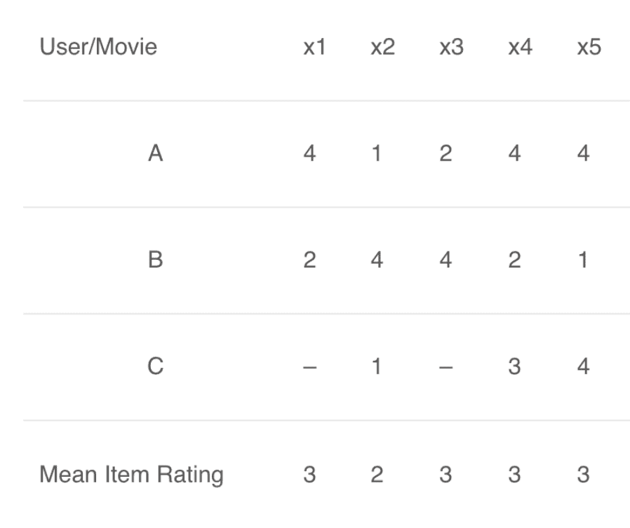

# 机器学习基础：相似度和距离度量究竟是什么

> 原文：[`mp.weixin.qq.com/s?__biz=MzA3MzI4MjgzMw==&mid=2650771461&idx=5&sn=52b64440885d71fa23911cb6499198e7&chksm=871a547bb06ddd6d4531fba1a820df42ae6526f75cd854283020805df6d0e4c1cbfb3032d294&scene=21#wechat_redirect`](http://mp.weixin.qq.com/s?__biz=MzA3MzI4MjgzMw==&mid=2650771461&idx=5&sn=52b64440885d71fa23911cb6499198e7&chksm=871a547bb06ddd6d4531fba1a820df42ae6526f75cd854283020805df6d0e4c1cbfb3032d294&scene=21#wechat_redirect)

选自 Medium

**作者：Gonzalo Ferreiro Volpi**

**机器之心编译** 

**参与：Panda**

> 相似度度量和距离度量在整个机器学习领域都是非常基础的概念，数据科学家 Gonzalo Ferreiro Volpi 近日通过浅显易懂的推荐系统示例介绍了这些概念以及它们的计算方式。

在推荐系统中，我们经常谈到「相似度度量」这一概念。为什么？因为在推荐系统中，基于内容的过滤算法和协同过滤算法都使用了某种特定的相似度度量来确定两个用户或商品的向量之间的相等程度。所以总的来说，相似度度量不仅仅是向量之间的距离。注：我的所有工作都可在我的 GitHub 页面查看：https://github.com/gonzaferreiro，其中当然也包括本文内容的代码库以及有关推荐系统的更多内容。在任意类型的算法中，最常见的相似度度量是向量之间夹角的余弦，即余弦相似度。设 A 为用户的电影评分 A 列表，B 为用户的电影评分 B 列表，那么它们之间的相似度可以这样计算：

从数学上看，余弦相似度衡量的是投射到一个多维空间中的两个向量之间的夹角的余弦。当在多维空间中绘制余弦相似度时，余弦相似度体现的是每个向量的方向关系（角度），而非幅度。如果你想要幅度，则应计算欧几里德距离。

余弦相似度很有优势，因为即使两个相似的文件由于大小而在欧几里德距离上相距甚远（比如文档中出现很多次的某个词或多次观看过同一部电影的某用户），它们之间也可能具有更小的夹角。夹角越小，则相似度越高。如下例所示，来自 www.machinelearningplus.com


上图统计了 sachin、dhoni、cricket 这三个词在所示的三个文档中的出现次数。据此，我们可以绘出这三个向量的图，从而轻松地看出衡量这些文档的余弦和欧几里德距离的差异：


按照定义，常规余弦相似度反映了方向的差异，而不是位置的差异。因此，使用余弦相似度指标无法考虑到用户评分这样的差异。调整后余弦相似度可以缓解这一问题，具体做法是从每对共同评分的配对减去各自用户的平均评分，其定义如下：


我们看看下面这个来自 Stack Overflow 的例子，这能更好地解释余弦相似度和调整过的余弦相似度之间的差异：假设一位用户为两部电影分别给出了 0～5 的评分。

直观而言，我们可以看到用户 b 和 c 的品味相近，而 a 则颇为不同。但常规的余弦相似度却给出了不一样的结果。在这样的案例中，计算调整后余弦相似度能让我们更好地理解用户之间的相近程度。


顺便一提，在上一篇有关推荐系统的文章中，我们给出了以下用于计算调整后余弦相似度的函数：

```py
from scipy import spatial
def adjusted_cos_distance_matrix(size, matrix, row_column):
    distances = np.zeros((size,size))
    if row_column == 0:
        M_u = matrix.mean(axis=1)
        m_sub = matrix - M_u[:,None]
    if row_column == 1:
        M_u = matrix.T.mean(axis=1)
        m_sub = matrix.T - M_u[:,None]
    for first in range(0,size):
        for sec in range(0,size):
            distance = spatial.distance.cosine(m_sub[first],m_sub[sec])
            distances[first,sec] = distance
    return distances 
```

使用这个函数的方式非常简单，只需输入：

1.  matrix：这就是用户之间的评分或观点等你衡量的东西或你的业务商品的原始矩阵。

2.  row_columns：如果你衡量的是列之间的距离，则设为 1；如果你衡量的是行之间的距离，则设为 0；

3.  size：所得矩阵的所需大小。也就是说，当寻找用户或商品相似度时，这就是用户或商品的数量。所以如果有 500 个不同用户，则距离矩阵的大小就为 500×500。

下面给出了一个参考示例：

*   user_similarity = adjusted_cos_distance_matrix(n_users,data_matrix,0)

*   item_similarity = adjusted_cos_distance_matrix(n_items,data_matrix,1)

最后，我们简要回顾一些可用在推荐系统中计算相似度的其它方法，但也可用于机器学习中其它任何基于距离的算法：

1\. 欧几里德距离：如果绘制在 n 维空间中，相似的项取决于彼此之间的相近程度。


2\. 皮尔森相关性或相关相似度：告诉了我们两个项之间的相关程度。相关性越高，则相似度越高。


3\. 均方差：在于计算用户评分之间的平均平方差。MSE 更侧重于惩罚更大的错误。

然后：

其中 |𝐼𝑢𝑣| 是用户 𝑢 和 𝑣 都评价过的商品的数量。

**用户-用户以及商品-商品相似度示例**我们借助之前介绍推荐系统的文章来简要回顾一下协同过滤的工作方式：假设我喜欢《盲刺客》和《莫斯科绅士》这两本书；我的朋友 Matias 也喜欢《盲刺客》和《莫斯科绅士》，但也还喜欢《Where the crawdads sing》。看起来我与 Matias 有一样的兴趣。所以你可能会想我也会喜欢《Where the crawdads sing》，即使我还没读过它。协同过滤也正是基于这一逻辑，只是你不仅可以比较用户，也可以比较商品。我们可视化地比较看看推荐系统的用户-用户相似度与商品-商品相似度之间的差异：**用户-用户相似度**

 

**商品-商品相似度**


现在，理解了这一点，我们用下面的示例解释说明一些度量，我认为这清楚辨明了用户-用户以及商品-商品相似度：**用户-用户相似度详解**


这里给出了一个用户电影评分矩阵。为了以更加实用的方式理解这一点，我们先根据上表计算一下用户 (A, C) 和 (B, C) 的相似度。用户 A 和 C 共同评分的电影是 x2 和 x4，B 和 C 共同评分的电影是 x2、x4、x5。知道了这些信息后，我们计算皮尔森相关性或相关相似度：


A 和 C 之间的相关性比 B 和 C 之间的相关性大。因此，A 和 C 更相似，A 喜欢的电影会被推荐给 C，C 喜欢的也会被推荐给 A。**商品-商品相似度详解**



这里的平均商品评分（mean item rating）是给定商品的所有评分的平均（比较看看我们在用户-用户过滤中看到的表格）。这里要计算的不是用户-用户相似度，而是商品-商品相似度。要做到这一点，我们首先需要找到给这些商品评分过的用户，然后再基于这些评分来计算这些商品之间的相似度。我们计算一下电影 (x1, x4) 和 (x1, x5) 之间的相似度。给电影 x1 和 x4 评过分的用户是 A 和 B，而给电影 x1 和 x5 评过分的用户也是 A 和 B。

x1 和 x4 的相似度大于 x1 和 x5 的相似度。基于这些相似度值，如果有任何用户搜索电影 x1，他们将被推荐 x4；反之亦然。

关于推荐系统的内容就到此为止了。但是，请记住相似度度量和距离度量在整个机器学习领域都是非常基础的概念，理解它们对进一步的学习至关重要。*原文地址：**https://medium.com/dataseries/similarity-and-distance-metrics-for-data-science-and-machine-learning-e5121b3956f8*********本****文为机器之心编译，**转载请联系本公众号获得授权****。**
✄------------------------------------------------**加入机器之心（全职记者 / 实习生）：hr@jiqizhixin.com****投稿或寻求报道：**content**@jiqizhixin.com****广告 & 商务合作：bd@jiqizhixin.com**