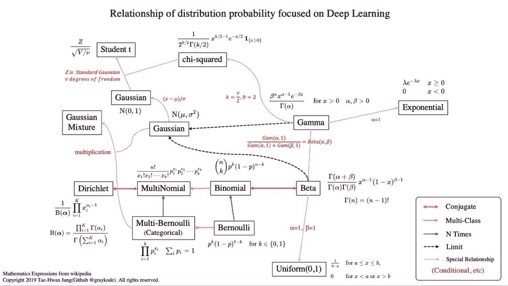
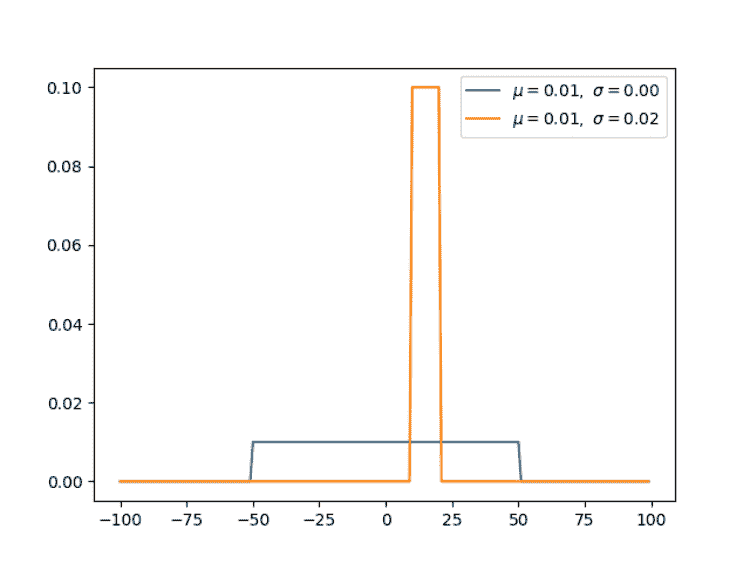
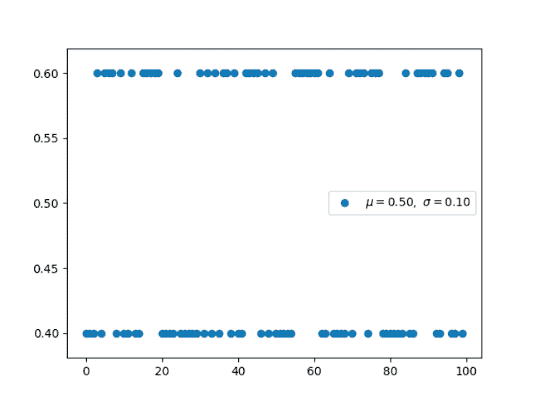
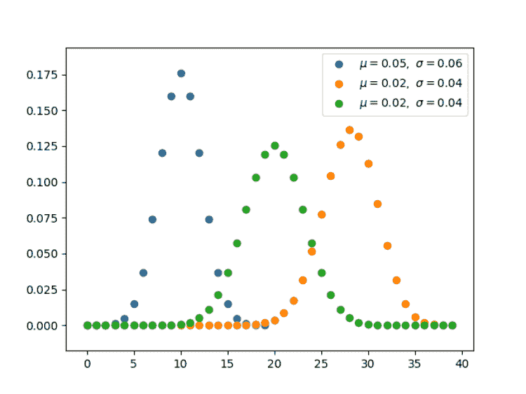
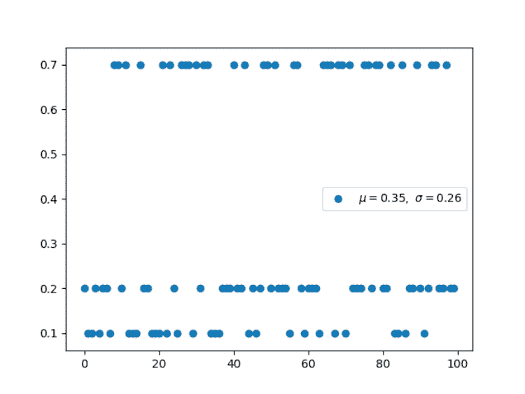
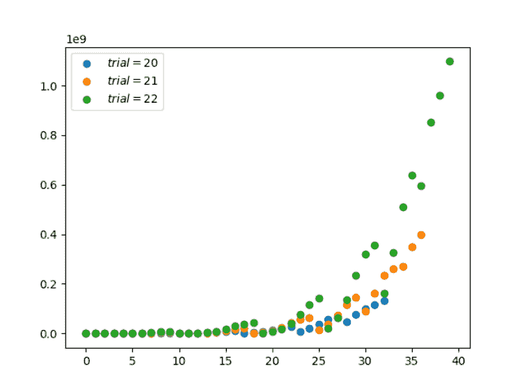
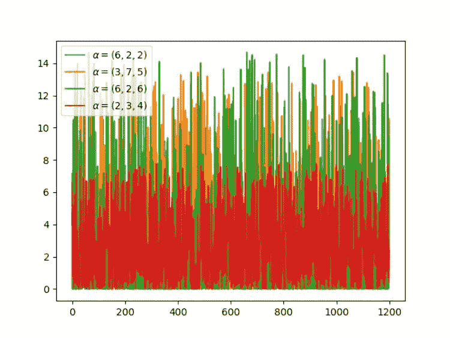
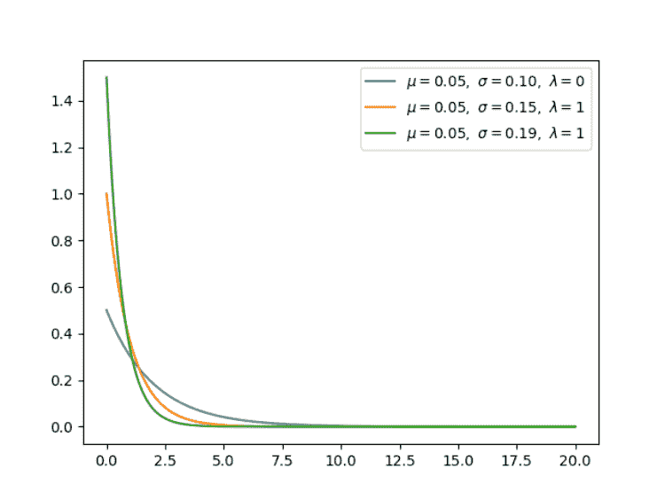
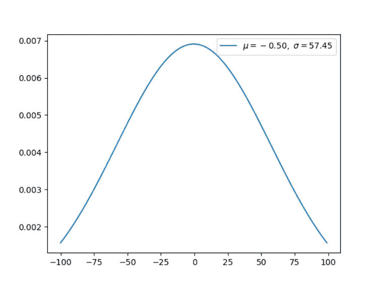

# Distribution is all you need：这里有 12 种做 ML 不可不知的分布

> 原文：[`mp.weixin.qq.com/s?__biz=MzA3MzI4MjgzMw==&mid=2650770528&idx=4&sn=5ece1d49995b419a114017d26af8cc5b&chksm=871a481eb06dc108f0f680faf849a7a36013680ad465ac54b57c0f448eb45fcdae4fa2fb0f1c&scene=21#wechat_redirect`](http://mp.weixin.qq.com/s?__biz=MzA3MzI4MjgzMw==&mid=2650770528&idx=4&sn=5ece1d49995b419a114017d26af8cc5b&chksm=871a481eb06dc108f0f680faf849a7a36013680ad465ac54b57c0f448eb45fcdae4fa2fb0f1c&scene=21#wechat_redirect)

选自 github

**作者****：****graykode****机器之心编译****参与：思**

> 机器学习开发者需要了解的 12 种概率分布，这些你都了解吗？

机器学习有其独特的数学基础，我们用微积分来处理变化无限小的函数，并计算它们的变化；我们使用线性代数来处理计算过程；我们还用概率论与统计学建模不确定性。在这其中，概率论有其独特的地位，模型的预测结果、学习过程、学习目标都可以通过概率的角度来理解。与此同时，从更细的角度来说，随机变量的概率分布也是我们必须理解的内容。在这篇文章中，项目作者介绍了所有你需要了解的统计分布，他还提供了每一种分布的实现代码。项目地址：https://github.com/graykode/distribution-is-all-you-need下面让我们先看看总体上概率分布都有什么吧：非常有意思的是，上图每一种分布都是有联系的。比如说伯努利分布，它重复几次就是二项分布，如果再扩展到多类别，就成为了多项式分布。注意，其中共轭（conjugate）表示的是互为共轭的概率分布；Multi-Class 表示随机变量多于 2 个；N Times 表示我们还会考虑先验分布 P(X)。在贝叶斯概念理论中，如果后验分布 p(θ | x) 与先验分布 p(θ) 是相同的概率分布族，那么后验分布可以称为共轭分布，先验分布可以称为似然函数的共轭先验。为了学习概率分布，项目作者建议我们查看 Bishop 的模式识别与机器学习。当然，你要是准备再过一遍《概率论与数理统计》，那也是极好的。**概率分布与特性****1\. 均匀分布（连续型）**均匀分布是指闭区间 [a, b] 内的随机变量，且每一个变量出现的概率是相同的。**2\. 伯努利分布（离散型）**伯努利分布并不考虑先验概率 P(X)，它是单个二值随机变量的分布。它由单个参数φ∈ [0, 1] 控制，φ 给出了随机变量等于 1 的概率。我们使用二元交叉熵函数实现二元分类，它的形式与对伯努利分布取负对数是一致的。**3\. 二项分布（离散型）**二项分布是由伯努利提出的概念，指的是重复 n 次独立的伯努利试验。在每次试验中只有两种可能的结果，而且两种结果发生与否互相对立。**4.Multi-Bernoulli 分布（离散型）**Multi-Bernoulli 分布又称为范畴分布（Categorical distribution），它的类别超过 2，交叉熵的形式与该分布的负对数形式是一致的。**5\. 多项式分布（离散型）**范畴分布是多项式分布（Multinomial distribution）的一个特例，它与范畴分布的关系就像伯努利分布与二项分布之间的关系。**6.Beta 分布（连续型）**贝塔分布（Beta Distribution) 是一个作为伯努利分布和二项式分布的共轭先验分布的密度函数，它指一组定义在 (0,1) 区间的连续概率分布。均匀分布是 Beta 分布的一个特例，即在 alpha=1、 beta=1 的分布。**7\. 狄利克雷分布（连续型）**狄利克雷分布（Dirichlet distribution）是一类在实数域以正单纯形（standard simplex）为支撑集（support）的高维连续概率分布，是 Beta 分布在高维情形的推广。在贝叶斯推断中，狄利克雷分布作为多项式分布的共轭先验得到应用，在机器学习中被用于构建狄利克雷混合模型。**8.Gamma 分布（连续型）**Gamma 分布是统计学中的常见连续型分布，指数分布、卡方分布和 Erlang 分布都是它的特例。如果 Gamma(a,1) / Gamma(a,1) + Gamma(b,1)，那么 Gamma 分布就等价于 Beta(a, b) 分布。**9\. 指数分布（连续型）**指数分布可以用来表示独立随机事件发生的时间间隔，比如旅客进入机场的时间间隔、打进客服中心电话的时间间隔等等。当 alpha 等于 1 时，指数分布就是 Gamma 分布的特例。**10\. 高斯分布（连续型）**高斯分布或正态分布是最为重要的分布之一，它广泛应用于整个机器学习的模型中。例如，我们的权重用高斯分布初始化、我们的隐藏向量用高斯分布进行归一化等等。当正态分布的均值为 0、方差为 1 的时候，它就是标准正态分布，这也是我们最常用的分布。**11\. 卡方分布（连续型）**简单而言，卡方分布（Chi-squared）可以理解为，k 个独立的标准正态分布变量的平方和服从自由度为 k 的卡方分布。卡方分布是一种特殊的伽玛分布，是统计推断中应用最为广泛的概率分布之一，例如假设检验和置信区间的计算。**12\. 学生 t-分布**学生 t-分布（Student t-distribution）用于根据小样本来估计呈正态分布且变异数未知的总体，其平均值是多少。t 分布也是对称的倒钟型分布，就如同正态分布一样，但它的长尾占比更多，这意味着 t 分布更容易产生远离均值的样本。**分布的代码实现**上面多种分布的 NumPy 构建方式以及制图方式都提供了对应的代码，读者可在原项目中查阅。如下所示展示了指数分布的构建的制图方式，我们可以直接定义概率密度函数，再打印出来就好了。

```py
import numpy as np
from matplotlib import pyplot as plt

def exponential(x, lamb):
    y = lamb * np.exp(-lamb * x)
    return x, y, np.mean(y), np.std(y)

for lamb in [0.5, 1, 1.5]:

    x = np.arange(0, 20, 0.01, dtype=np.float)
    x, y, u, s = exponential(x, lamb=lamb)
    plt.plot(x, y, label=r'$\mu=%.2f,\ \sigma=%.2f,'
                         r'\ \lambda=%d$' % (u, s, lamb))
plt.legend()
plt.savefig('graph/exponential.png')
plt.show()
```

********本****文为机器之心编译，**转载请联系本公众号获得授权****。**
✄------------------------------------------------**加入机器之心（全职记者 / 实习生）：hr@jiqizhixin.com****投稿或寻求报道：**content**@jiqizhixin.com****广告 & 商务合作：bd@jiqizhixin.com**