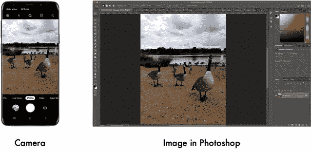
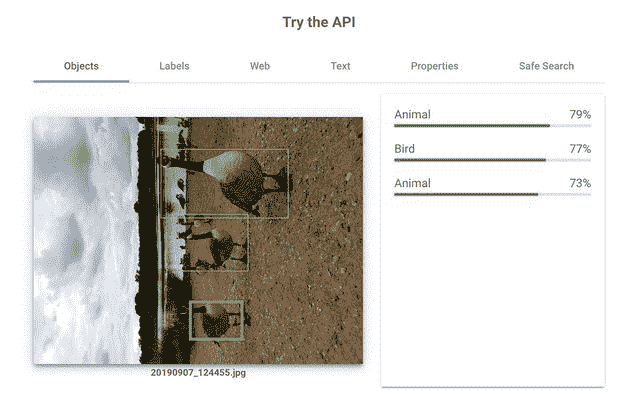
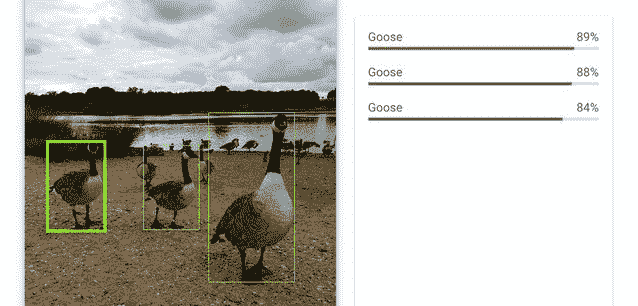
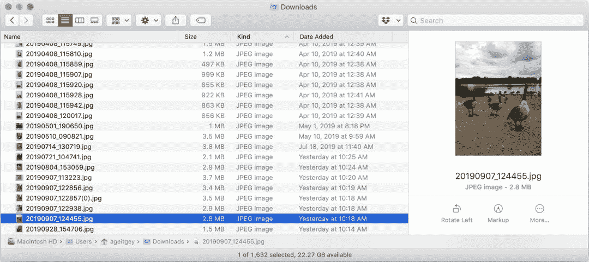

# 为什么我的 CV 模型不好用？没想到原因竟如此简单……

> 原文：[`mp.weixin.qq.com/s?__biz=MzA3MzI4MjgzMw==&mid=2650771706&idx=4&sn=f06e3cf489c693737f9ba5c687308c0a&chksm=871a5484b06ddd922420a303585786ac2c1c6184999f260dde784b18f40e37dcda706bb82459&scene=21#wechat_redirect`](http://mp.weixin.qq.com/s?__biz=MzA3MzI4MjgzMw==&mid=2650771706&idx=4&sn=f06e3cf489c693737f9ba5c687308c0a&chksm=871a5484b06ddd922420a303585786ac2c1c6184999f260dde784b18f40e37dcda706bb82459&scene=21#wechat_redirect)

选自 Medium

**作者：Adam Geitgey**

**机器之心编译**

**参与：Panda**

> 计算机视觉模型表现不佳的原因有很多，比如架构设计缺陷、数据集代表性不足、超参数选择失误等。但有一个很简单的原因却常常被人们忽略：图像的方向。机器学习专家 Adam Geitgey 近日发布了一篇文章探讨了这一简单却又让很多人头痛的问题，并分享了他为解决这一问题编写的自动图像旋转程序。

我写过很多有关计算机视觉和机器学习项目的内容，比如目标识别系统和人脸识别项目。我有一个开源的 Python 人脸识别软件库，算得上是 GitHub 上最受欢迎的十大机器学习库之一。这也意味着我常常收到关于 Python 和计算机视觉方面的新人提问。


以我的经验，有一个技术问题比其它任何问题都更容易让人受挫——倒不是复杂的理论问题或昂贵 GPU 的问题。人们基本上没意识到，几乎所有人都是以侧向方式将图像载入内存的，而计算机在检测侧向图像中的目标或人脸时的能力可没那么出色。**数码相机如何自动旋转图像**当你在拍摄照片时，相机会感知你向哪边倾斜。当你在另一个程序中查看照片时，它们会以正确的方向显示。



但棘手的问题在于, 你的相机实际上并没有在保存到磁盘中的文件中旋转图像数据。因为数码相机中的图像传感器是逐行读取的，最终汇集成连续的像素信息流。这能让相机更轻松地保存像素数据，因为不管相机的姿势如何，像素数据总是以同样的顺序保存的。


实际上，照片能否以正确的方向显示完全取决于图像查看器应用。相机在保存图像数据的同时还会保存有关每张图片的元数据——相机设置、位置数据以及理所应当的相机的旋转角度。图像查看器应当使用这种信息来正确地显示图像。图像元数据最常见的格式是 Exif（Exchangeable image file forma「可交换图像文件格式」的缩写）。Exif 格式的元数据放在相机保存的 jpeg 文件中。你不能直接从图像本身读到这种 Exif 数据，但可以使用任何知道如何读取这一数据的程序进行读取。下面是使用 Exiftool 读取的上面的鹅照片的 Exif 元数据：


注意 Orientation（方向）这个数据元素。它能指示图像查看器程序，在屏幕上显示图像之前将图顺时针旋转 90 度。如果程序忘记这么做，图像就会侧向显示。


**为什么这让很多 Python 计算机视觉应用表现不佳？**Exif 元数据并非 jpeg 文件格式的原生部分。在 TIFF 文件格式使用了这种元数据之后，jpeg 文件格式才加入这种元数据。其保持了与老一代图像查看器的后向兼容性，但这也意味着某些程序根本没有费心去解析 Exif 数据。numpy、scipy、TensorFlow、Keras 等大多数用于处理图像数据的 Python 库都将自己视为研究通用数据数组的人的科学工具。所以它们不在乎消费者层面的问题，比如「图像自动旋转」——即使现在的所有相机拍照需要这种操作。这差不多意味着，你用任意 Python 库加载图像时，都会得到未经旋转的原始图像数据。现在猜猜看，当你将侧向的或倒向的图像输入人脸识别或目标检测模型会怎样？因为你提供了错误的数据，检测器会提示失败。你可能认为这个问题仅限于新手或学生写的 Python 脚本，但事实并非如此。即使谷歌的旗舰级 Vision API 演示也没能正确地处理 Exif 方向：



*谷歌的 Vision API 演示无法旋转标准的手机拍摄的纵向图像。*尽管谷歌的视觉技术能成功地检测出侧向图像中存在一些动物，但它仅提供了一个不具体的「Animal（动物）」标签。这是因为模型检测侧向的鹅要比检测正向的鹅要困难得多。如果在输入之前先正确地旋转一下，则谷歌 Vision API 会得到如下的结果：



当图像方向正确时，谷歌的检测结果要具体得多——不仅能正确给出「Goose（鹅）」标签，而且置信度分数要高得多，这就好多了。如果你能如本演示中的那样看到图像是侧向的，那么这个问题要明显得多。但问题就在于你一般看不到。如今计算机上的一般程序都会以正确旋转后的形式显示图像，而不是按照它实际在磁盘上存储的侧向数据的形式。所以当你想了解你的模型不能起效的原因而查看图像时，图像查看器会以正确的方向显示，让你无从了解你的模型效果差的原因。



Mac 上的 Finder 总是显示应用了 Exif 旋转后的图像，这样就没法看到文件中的图像数据实际上是侧向的。这不可避免地导致人们在 GitHub 上报告问题，说他们使用的开源项目根本不行或模型不够准确。但事情的本质非常简单——他们输入了侧向甚至颠倒的图像！**解决这个问题**解决方案是，每当你用 Python 程序加载图像时，都执行一次 Exif 方向元数据检查，并在有需要时进行旋转。做起来很简单，不过在网上很难找到能为所有方向正确执行旋转的示例代码。下面是为任意图像应用正确的方向后再将其载入 numpy 数组的代码：

```py
import PIL.Image
import PIL.ImageOps
import numpy as np

def exif_transpose(img):
    if not img:
        return img

    exif_orientation_tag = 274

    # Check for EXIF data (only present on some files)
    if hasattr(img, "_getexif") and isinstance(img._getexif(), dict) and exif_orientation_tag in img._getexif():
        exif_data = img._getexif()
        orientation = exif_data[exif_orientation_tag]

        # Handle EXIF Orientation
        if orientation == 1:
            # Normal image - nothing to do!
            pass
        elif orientation == 2:
            # Mirrored left to right
            img = img.transpose(PIL.Image.FLIP_LEFT_RIGHT)
        elif orientation == 3:
            # Rotated 180 degrees
            img = img.rotate(180)
        elif orientation == 4:
            # Mirrored top to bottom
            img = img.rotate(180).transpose(PIL.Image.FLIP_LEFT_RIGHT)
        elif orientation == 5:
            # Mirrored along top-left diagonal
            img = img.rotate(-90, expand=True).transpose(PIL.Image.FLIP_LEFT_RIGHT)
        elif orientation == 6:
            # Rotated 90 degrees
            img = img.rotate(-90, expand=True)
        elif orientation == 7:
            # Mirrored along top-right diagonal
            img = img.rotate(90, expand=True).transpose(PIL.Image.FLIP_LEFT_RIGHT)
        elif orientation == 8:
            # Rotated 270 degrees
            img = img.rotate(90, expand=True)

    return img

def load_image_file(file, mode='RGB'):
    # Load the image with PIL
    img = PIL.Image.open(file)

    if hasattr(PIL.ImageOps, 'exif_transpose'):
        # Very recent versions of PIL can do exit transpose internally
        img = PIL.ImageOps.exif_transpose(img)
    else:
        # Otherwise, do the exif transpose ourselves
        img = exif_transpose(img)

    img = img.convert(mode)

    return np.array(img) 
```

之后，你可以将这个图像数据数组传递给需要的所有标准 Python 机器学习库，比如 Keras 和 TensorFlow。因为这个问题很常见，所以我将其制作成了一个 pip 库，名为 image_to_numpy，你可以这样安装它：

```py
pip3 install image_to_numpy 
```

你可以在任何 Python 程序中使用它来实现正确的图像加载，比如：

```py
import matplotlib.pyplot as plt
import image_to_numpy# Load your image file
img = image_to_numpy.load_image_file("my_file.jpg")# Show it on the screen (or whatever you want to do)
plt.imshow(img)
plt.show()
```

更多信息可查看自述文件。

*原文链接：**https://medium.com/@ageitgey/the-dumb-reason-your-fancy-computer-vision-app-isnt-working-exif-orientation-73166c7d39da*

********本****文为机器之心编译，**转载请联系本公众号获得授权****。**
✄------------------------------------------------**加入机器之心（全职记者 / 实习生）：hr@jiqizhixin.com****投稿或寻求报道：**content**@jiqizhixin.com****广告 & 商务合作：bd@jiqizhixin.com**