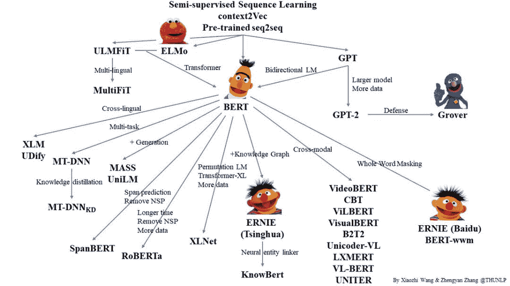
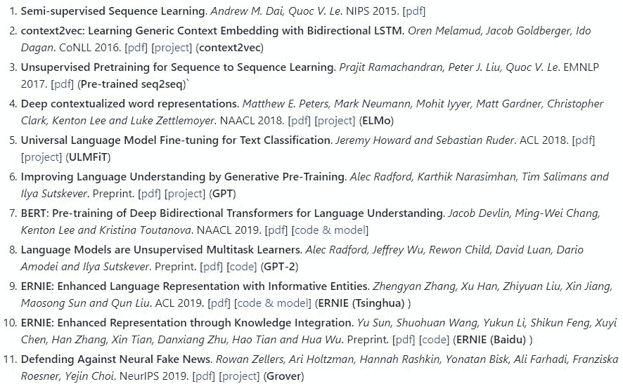
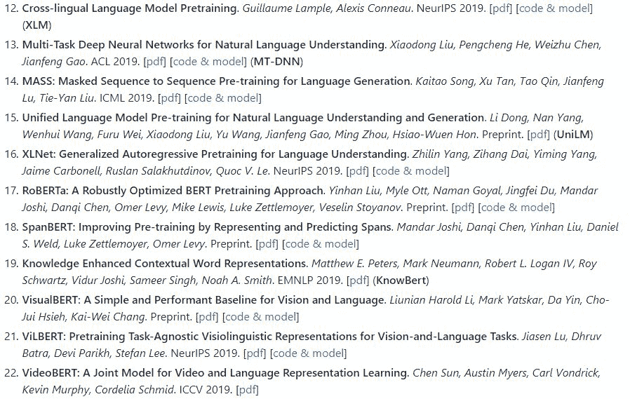
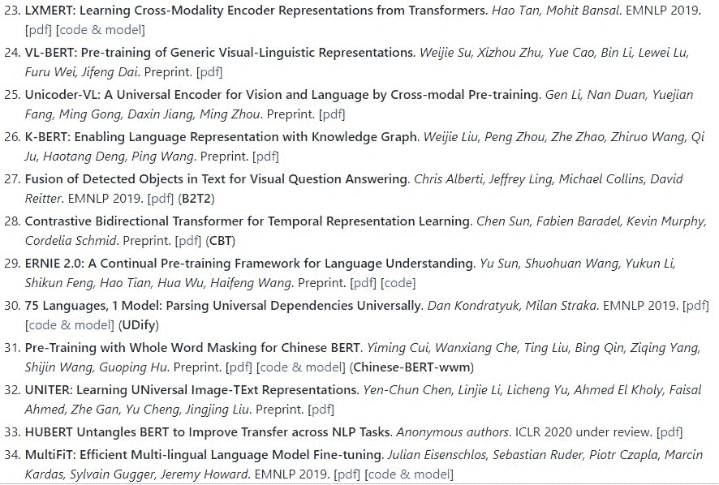
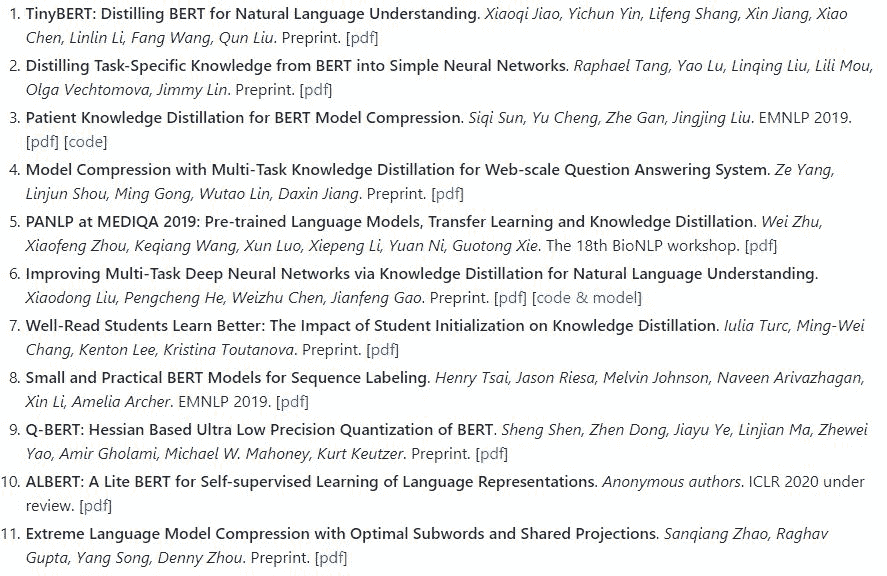
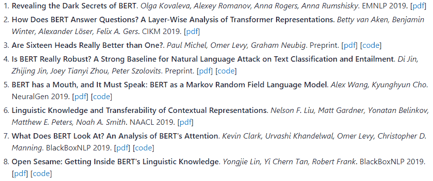
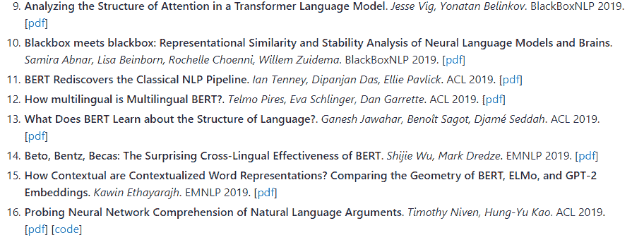

# 预训练语言模型关系图+必读论文列表，清华荣誉出品

> 原文：[`mp.weixin.qq.com/s?__biz=MzA3MzI4MjgzMw==&mid=2650771603&idx=3&sn=d7616e643b7bfda5cb0f22b928f99775&chksm=871a54edb06dddfb28b31e8dd0ca20d650553d1624a370f1496d3ca7af5a7cd1b9307d26ee08&scene=21#wechat_redirect`](http://mp.weixin.qq.com/s?__biz=MzA3MzI4MjgzMw==&mid=2650771603&idx=3&sn=d7616e643b7bfda5cb0f22b928f99775&chksm=871a54edb06dddfb28b31e8dd0ca20d650553d1624a370f1496d3ca7af5a7cd1b9307d26ee08&scene=21#wechat_redirect)

机器之心整理

**项目作者：王晓智、张正彦****参与：张倩、杜伟**

> 预训练语言模型（PLM）是 NLP 领域的一大热门话题。从 BERT 到 GPT2 再到 XLNet，各种预训练模型层出不穷，不少同学感叹，「大佬慢点，跟不上了……」那么，这么多预训练模型要怎么学？它们之间有什么关联？为了理清这些问题，来自清华大学的两位本科同学整理了一份预训练语言模型必读论文列表，还用图的形式整理出了这些模型之间的复杂关系。

Github 项目：https://github.com/thunlp/PLMpapers 项目的两位作者——王晓智和张正彦都是清华大学的在读本科生。其中，王晓智师从清华大学计算机系教授李涓子和副教授刘知远，研究方向为 NLP 和知识图谱中的深度学习技术，于今年 4 月份入选 2019 年清华大学「未来学者」计划第二批名单；张正彦则参与过孙茂松教授指导的很多工作，如之前发布的「[图神经网络必读论文列表](http://mp.weixin.qq.com/s?__biz=MzA3MzI4MjgzMw==&mid=2650754602&idx=2&sn=7d55e6c20bbf4d85d19d62fc67045b85&chksm=871a8a54b06d03429b5fb811c7ef7f22d368c3c2db2ebb71b3abd3d6a9737088e54a402c5ac2&scene=21#wechat_redirect)」。此外，他还是增强版语言表征模型 ERNIE 的第一作者，并参与了多领域中文预训练模型仓库 [OpenCLaP](http://mp.weixin.qq.com/s?__biz=MzA3MzI4MjgzMw==&mid=2650765181&idx=1&sn=0c72689903b678192688ff1d4c11b099&chksm=871ab303b06d3a155ffca8fecf2226afe5daf9dc29fc63673acfa0cf898aff05f1a3cf3de166&scene=21#wechat_redirect) 的创建。在这个预训练模型论文列表项目中，两位同学首先给出了一份预训练语言模型的关系图：图中列出了 BERT、GPT、XLNet、ERNIE 等大家熟知的模型以及它们之间的关系。以 BERT 和清华大学提出的 ERNIE 为例，张正彦等人曾在[论文](http://mp.weixin.qq.com/s?__biz=MzA3MzI4MjgzMw==&mid=2650762696&idx=4&sn=70c25ea24d15ed53880f45c511938813&chksm=871aa9b6b06d20a0536c7602a5757e28f995600bdffdd52ccb791927ba17aaaa10bfc15a209d&scene=21#wechat_redirect)中指出，BERT 等预训练语言模型只能学习语言相关的信息，学习不到「知识」相关的信息。因此他们提出用知识图谱增强 BERT 的预训练效果，让预训练语言模型也能变得「有文化」。在这张图中我们可以清楚地看到论文中阐述的这种关系，即 BERT+知识图谱→ERNIE（清华版）。这种简化版的展示对于初学者理清思路非常有帮助。除了这张关系图，两位同学还给出了一份预训练语言模型必读论文列表。列表分为三个部分：模型、知识蒸馏与模型压缩以及相关分析论文。机器之心曾经介绍过其中的一些论文，读者可以根据链接找到相关论文中文介绍。**模型部分包含 34 篇论文，列表如下：**

其中，机器之心介绍过的论文如下：

*   [NAACL 2018 | 最佳论文：艾伦人工智能研究所提出新型深度语境化词表征](http://mp.weixin.qq.com/s?__biz=MzA3MzI4MjgzMw==&mid=2650743315&idx=5&sn=3e5c361150d26507cf99a87e11a4e301&chksm=871ae66db06d6f7bf784061b50a747a04db2cf82e603f9f25c9b878b44e643858d76a6dc4eea&scene=21#wechat_redirect)

*   [迄今最大模型？OpenAI 发布参数量高达 15 亿的通用语言模型 GPT-2](http://mp.weixin.qq.com/s?__biz=MzA3MzI4MjgzMw==&mid=2650757118&idx=1&sn=a777dabb78f055fbfb451f2e75d5a7d5&chksm=871a9380b06d1a9639351bc4352a897104dcca16883c02aa5301e61da149845fdc09ac4bbfb3&scene=21#wechat_redirect)

*   [ACL 2019 | 清华等提出 ERNIE：知识图谱结合 BERT 才是「有文化」的语言模型](http://mp.weixin.qq.com/s?__biz=MzA3MzI4MjgzMw==&mid=2650762696&idx=4&sn=70c25ea24d15ed53880f45c511938813&chksm=871aa9b6b06d20a0536c7602a5757e28f995600bdffdd52ccb791927ba17aaaa10bfc15a209d&scene=21#wechat_redirect)

*   [NLP 前沿研究成果大开源，百度 PaddleNLP-研究版发布](http://mp.weixin.qq.com/s?__biz=MzA3MzI4MjgzMw==&mid=2650766054&idx=2&sn=489b7a1a22d0eca211705ae9d631641a&chksm=871abe98b06d378ec1be729f83c7d2d9a3798490990b94fcc2afe4ecc98c7aec3bafcbb392d2&scene=21#wechat_redirect)

*   [7 Papers | 清华天机芯片；非侵入式脑机接口；ACL 2019 论文](http://mp.weixin.qq.com/s?__biz=MzA3MzI4MjgzMw==&mid=2650767026&idx=1&sn=47a2d1aa938775ca8e7b021c318b331e&chksm=871abaccb06d33da2e8c71e4f1c6bf4f577f232104b51df7a2c127bb55e76598dfc018487e81&scene=21#wechat_redirect)

「知识蒸馏与模型压缩」部分包含 11 篇论文，列表如下：

其中，机器之心介绍过的论文如下：

*   [TinyBERT：模型小 7 倍，速度快 8 倍，华中科大、华为出品](http://mp.weixin.qq.com/s?__biz=MzA3MzI4MjgzMw==&mid=2650771134&idx=2&sn=012082a897dbf125000e38b73520c51d&chksm=871a4ac0b06dc3d65b84d985647b77bde3fe2bf96077be2980ec704490350e97ec873b96cced&scene=21#wechat_redirect)

*   [预训练小模型也能拿下 13 项 NLP 任务，谷歌 ALBERT 三大改造登顶 GLUE 基准](http://mp.weixin.qq.com/s?__biz=MzA3MzI4MjgzMw==&mid=2650770834&idx=1&sn=00afa700f63b8418de2d9ba61d01cb9d&chksm=871a49ecb06dc0fa0643a6554e32bfe195603dc8fd4ec3e515840e7f51f80829e50dbd88c417&scene=21#wechat_redirect)

分析部分包含 26 篇论文，列表如下：

其中，机器之心介绍过的论文如下：

*   [7 papers | 华为、MIT 韩松论文；DeepMind 开源 OpenSpiel；目标检测算法全面综述](http://mp.weixin.qq.com/s?__biz=MzA3MzI4MjgzMw==&mid=2650769131&idx=4&sn=8d566ef504af1d38f21e92160d1e062f&chksm=871a4295b06dcb834eaf6c5de87362834cc2afb5764e08e2dc3f4eb5917c0f95fc72336d91d3&scene=21#wechat_redirect)

*   [红楼梦、法律，BERT 已有如此多的神奇应用](http://mp.weixin.qq.com/s?__biz=MzA3MzI4MjgzMw==&mid=2650766113&idx=4&sn=cab79840f9e133e032246db5be8d977a&chksm=871abf5fb06d364930145dff9b4c18c4ad4e4da475d5bf305e158c615af5e6435e72a0536ce3&scene=21#wechat_redirect)

*   [如何可视化 BERT？你需要先理解神经网络的语言、树和几何性质](http://mp.weixin.qq.com/s?__biz=MzA3MzI4MjgzMw==&mid=2650763945&idx=5&sn=11334eafe1a1cab2e0258a69a107dd52&chksm=871ab6d7b06d3fc15f493bcee5b0bad8f6b12f2bb7e9cc1c8fc7244560ce88534b3d9fb2934e&scene=21#wechat_redirect)

*   [ACL 2019 提前看：预训练语言模型的最新探索](http://mp.weixin.qq.com/s?__biz=MzA3MzI4MjgzMw==&mid=2650766791&idx=4&sn=c2e2088877e0ec88fe67e68ed7db5f65&chksm=871ab9b9b06d30afaeb21aefff562d6d3eab86f82b0b0a86315e6c75f54171e2d6ddaf2d0199&scene=21#wechat_redirect)

*   [技惊四座的 BERT 全靠数据集？大模型霸榜或许是学界的灾难](http://mp.weixin.qq.com/s?__biz=MzA3MzI4MjgzMw==&mid=2650766323&idx=1&sn=62b6f468a4543b5e4b0155a699400660&chksm=871abf8db06d369bbc34c139d3e5989b959a8d8ac72865e2a69a6de9ce2ee4c96e2c0e9ae7fa&scene=21#wechat_redirect)

*   [嵌入向量能否理解数字？BERT 竟不如 ELMo？](http://mp.weixin.qq.com/s?__biz=MzA3MzI4MjgzMw==&mid=2650771264&idx=3&sn=97d1651e62d74ec9c0a077325379dad6&chksm=871a4b3eb06dc228eb8802173e3dd0d431cf92a3b7f8403ec9b7d3d5e587eaacf85eef455512&scene=21#wechat_redirect)

*   [如何可视化 BERT？你需要先理解神经网络的语言、树和几何性质](http://mp.weixin.qq.com/s?__biz=MzA3MzI4MjgzMw==&mid=2650763945&idx=5&sn=11334eafe1a1cab2e0258a69a107dd52&chksm=871ab6d7b06d3fc15f493bcee5b0bad8f6b12f2bb7e9cc1c8fc7244560ce88534b3d9fb2934e&scene=21#wechat_redirect)

*   [7 Papers | 谷歌量子霸权论文；13 项 NLP 任务夺冠的小模型 ALBERT](http://mp.weixin.qq.com/s?__biz=MzA3MzI4MjgzMw==&mid=2650771009&idx=4&sn=842ebf521fa3ef53649d7cc346f562f3&chksm=871a4a3fb06dc329b66c6c7c920f6aca30497772af71d4f187051720abc3cca5bac174e28e9a&scene=21#wechat_redirect)

*参考链接：*

*https://github.com/thunlp/PLMpapers*

华为云近期推出精编实战公开课，涵盖机器学习、大数据、运维实战等多项系列课程，由华为云资深工程师倾情讲授，完成理论学习+实践内容还有精美礼品相赠。点击阅读原文，选择课程，免费报名。

