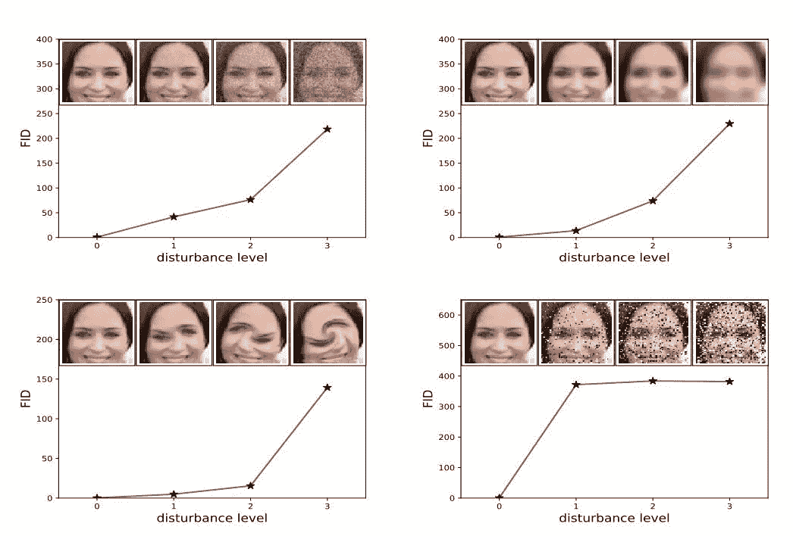

# 学习 GAN 模型量化评价，先从掌握 FID 开始吧

> 原文：[`mp.weixin.qq.com/s?__biz=MzA3MzI4MjgzMw==&mid=2650771706&idx=5&sn=5a726570caab46c33b91a4c0a669c2d2&chksm=871a5484b06ddd92259cd790232a83619fa9d503d5d5ff4e6da84fe9347d51c0e4b648303abb&scene=21#wechat_redirect`](http://mp.weixin.qq.com/s?__biz=MzA3MzI4MjgzMw==&mid=2650771706&idx=5&sn=5a726570caab46c33b91a4c0a669c2d2&chksm=871a5484b06ddd92259cd790232a83619fa9d503d5d5ff4e6da84fe9347d51c0e4b648303abb&scene=21#wechat_redirect)

选自 machinelearningmastery

**作者****：****Jason Brownlee**

**机器之心编译**

**编译：****高璇，Geek AI**

> 要说谁是当下最火的生成模型，GAN 当之无愧！然而，模式坍塌、训练不稳定等问题严重制约着 GAN 家族的发展。为了提图像质量、样本多样性的角度量化评价 GAN 模型的性能，研究者们提出了一系列度量指标，其中 FID 就是近年来备受关注的明星技术，本文将详细介绍如何在 python 环境下实现 Frechet Inception 距离（FID）。

Frechet Inception 距离得分（Frechet Inception Distance score，FID）是计算真实图像和生成图像的特征向量之间距离的一种度量。

FID 从原始图像的计算机视觉特征的统计方面的相似度来衡量两组图像的相似度，这种视觉特征是使用 Inception v3 图像分类模型计算的得到的。分数越低代表两组图像越相似，或者说二者的统计量越相似，FID 在最佳情况下的得分为 0.0，表示两组图像相同。FID 分数被用于评估由生成性对抗网络生成的图像的质量，较低的分数与较高质量的图像有很高的相关性。在本教程中，你将了解如何通过 FID 评估生成的图像。同时你还将了解：

*   FID 综合表征了相同的域中真实图像和生成图像的 Inception 特征向量之间的距离。

*   如何计算 FID 分数并在 NumPy 环境下实现 FID。

*   如何使用 Keras 深度学习库实现 FID 分数并使用真实图像进行计算。

在本文作者有关 GAN 的新书中，读者可以了解到如何使用 Keras 开发 DCGAN、条件 GAN、Pix2Pix、CycleGAN 等对抗生成网络，书中还提供 29 个详细教程和完整源代码。下面进入正文部分：**教程概述**本教程分为五个部分，分别是：

1.  何为 FID？

2.  如何计算 FID？

3.  如何通过 NumPy 实现 FID？

4.  如何通过 Keras 实现 FID？

5.  如何计算真实图像的 FID？

机器之心整理了前三部分的代码，感兴趣的读者可以在原文中查看 Keras 的 FID 实现和计算真实图像 FID 的方法。**何为 FID？**Frechet Inception 距离（FID）是评估生成图像质量的度量标准，专门用于评估生成对抗网络的性能。FID 分数由 Martin Heusel 等人于 2017 年在论文「GANs Trained by a Two Time-Scale Update Rule Converge to a Local Nash Equilibrium」（https://arxiv.org/abs/1706.08500017）中提出并使用。该分数作为对现有的 Inception 分数（IS）的改进而被提出。

> 为了评估 GAN 在图像生成任务中的性能，我们引入了「Frechet Inception Distance」（FID），它能比 Inception 分数更好地计算生成图像与真实图像的相似性。——「GANs Trained by a Two Time-Scale Update Rule Converge to a Local Nash Equilibrium」（https://arxiv.org/abs/1706.08500）, 2017.

Inception 分数基于目前性能最佳的图像分类模型 Inception v3 对一组合成图像的分类情况（将其分类为 1,000 类对象中的一种）来评估图像的质量。该分数结合了每个合成图像的条件类预测的置信度（质量）和预测类别的边缘概率积分（多样性）。Inception 分数缺少合成图像与真实图像的比较。研发 FID 分数的目的是基于一组合成图像的统计量与来自目标域的真实图像的统计量进行的比较，实现对合成图像的评估。

> Inception 分数的缺点是没有使用现实世界样本的统计量，并将其与合成样本的统计量进行比较。——「GANs Trained by a Two Time-Scale Update Rule Converge to a Local Nash Equilibrium 」（https://arxiv.org/abs/1706.08500）, 2017.

与 Inception 分数一样，FID 分数也使用了 Inception v3 模型。具体而言，模型的编码层（图像的分类输出之前的最后池化层）被用来抽取输入图像的用计算机视觉技术指定的特征。这些激活函数是针对一组真实图像和生成图像计算的。通过计算图像的均值和协方差，将激活函数的输出归纳为一个多变量高斯分布。然后将这些统计量用于计算真实图像和生成图像集合中的激活函数。然后使用 Frechet 距离（又称 Wasserstein-2 距离）计算这两个分布之间的距离。

> 两个高斯分布（合成图像和真实图像）的差异由 Frechet 距离（又称 Wasserstein-2 距离）测量。——「GANs Trained by a Two Time-Scale Update Rule Converge to a Local Nash Equilibrium」（https://arxiv.org/abs/1706.08500）, 2017.

使用来自 Inception v3 模型的激活函数输出来归纳每个图像，得分即为「Frechet Inception Distance」。FID 越低，图像质量越好；反之，得分越高，质量越差，两者关系应该是线性的。该分数的提出者表明，当应用系统失真（如加入随机噪声和模糊）时，FID 越低，图像质量越好。



*图像失真程度的提高与高 FID 分数之间的关系。***如何计算 Frechet Inception 距离？**首先，通过加载经过预训练的 Inception v3 模型来计算 FID 分数。删除模型原本的输出层，将输出层换为最后一个池化层（即全局空间池化层）的激活函数输出值。此输出层有 2,048 维的激活向量，因此，每个图像被预测为 2,048 个激活特征。该向量被称为图像的编码向量或特征向量。针对一组来自问题域的真实图像，预测 2,048 维的特征向量，用来提供真实图像表征的参考。然后可以计算合成图像的特征向量。结果就是真实图像和生成图像各自的 2,048 维特征向量的集合。然后使用以下公式计算 FID 分数：


该分数被记为 d²，表示它是一个有平方项的距离。「mu_1」和「mu_2」指的是真实图像和生成图像的特征均值（例如，2,048 维的元素向量，其中每个元素都是在图像中观察到的平均特征）。C_1 和 C_2 是真实图像的和生成图像的特征向量的协方差矩阵，通常被称为 sigma。|| mu_1-mu_2 ||² 代表两个平均向量差的平方和。Tr 指的是被称为「迹」的线性代数运算（即方阵主对角线上的元素之和）。sqrt 是方阵的平方根，由两个协方差矩阵之间的乘积给出。矩阵的平方根通常也被写作 M^（1/2），即矩阵的 1/2 次方。此运算可能会失败，由于该运算是使用数值方法求解的，是否成功取决于矩阵中的值。通常，所得矩阵中的一些元素可能是虚数，它们通常可以被检测出来并删除。**如何用 NumPy 实现 Frechet Inception 距离？**使用 NumPy 数组在 Python 中实现 FID 分数的计算非常简单。首先，让我们定义一个函数，它将为真实图像和生成图像获得一组激活函数值，并返回 FID 分数。下面列出的「calculate_fid()」函数实现了该过程。通过该函数，我们几乎直接实现了 FID 分数的计算。值得注意的是，TensorFlow 中的官方实现计算元素的顺序稍有不同（可能是为了提高效率），并在加入了矩阵平方根附近的额外检查，以处理可能的数值不稳定性。如果在自己的数据集上计算 FID 时遇到问题，我建议你查看官方教程并扩展下面的实现，以添加这些检查。

```py
def calculate_fid(act1, act2):
    # calculate mean and covariance statistics
    mu1, sigma1 = act1.mean(axis=0), cov(act1, rowvar=False)
    mu2, sigma2 = act2.mean(axis=0), cov(act2, rowvar=False)
    # calculate sum squared difference between means
    ssdiff = numpy.sum((mu1 - mu2)*2.0)
    # calculate sqrt of product between cov
    covmean = sqrtm(sigma1.dot(sigma2))
    # check and correct imaginary numbers from sqrt
    if iscomplexobj(covmean):
        covmean = covmean.real
    # calculate score
    fid = ssdiff + trace(sigma1 + sigma2 - 2.0  covmean)
    return fid 
```

接下来，我们可以测试这个函数来计算一些人造特征向量的 Inception 分数。特征向量可能包含小的正值，长度为 2,048 个元素。我们可以用包含小随机数的特征向量构建两组图像（每组 10 幅），如下所示：

```py
act1 = random(102048)
act1 = act1.reshape((10,2048))
act2 = random(102048)
act2 = act2.reshape((10,2048)) 
```

一个测试是计算一组激活与其自身之间的 FID，我们期望分数为 0.0。然后计算两组随机激活之间的距离，我们期望它们是一个很大的数字。

```py
fid = calculate_fid(act1, act1)
print('FID (same): %.3f' % fid)

fid = calculate_fid(act1, act2)
print('FID (different): %.3f' % fid) 
```

将所有这些结合在一起，完整的示例如下：

```py
import numpy
from numpy import cov
from numpy import trace
from numpy import iscomplexobj
from numpy.random import random
from scipy.linalg import sqrtm

def calculate_fid(act1, act2):
    # calculate mean and covariance statistics
    mu1, sigma1 = act1.mean(axis=0), cov(act1, rowvar=False)
    mu2, sigma2 = act2.mean(axis=0), cov(act2, rowvar=False)
    # calculate sum squared difference between means
    ssdiff = numpy.sum((mu1 - mu2)*2.0)
    # calculate sqrt of product between cov
    covmean = sqrtm(sigma1.dot(sigma2))
    # check and correct imaginary numbers from sqrt
    if iscomplexobj(covmean):
        covmean = covmean.real
    # calculate score
    fid = ssdiff + trace(sigma1 + sigma2 - 2.0  covmean)
    return fid

act1 = random(102048)
act1 = act1.reshape((10,2048))
act2 = random(102048)
act2 = act2.reshape((10,2048))
fid = calculate_fid(act1, act1)
print('FID (same): %.3f' % fid)
fid = calculate_fid(act1, act2)
print('FID (different): %.3f' % fid) 
```

运行这段代码示例，首先会显示出激活函数值「act1」和它自己之间的 FID 分数，正如我们所预想的那样，该值为 0.0（注：该分数的符号可以忽略）同样，正如我们所预料的，两组随机激活函数值之间的距离是一个很大的数字，在本例中为 358

```py
FID (same): -0.000

FID (different): 358.927 
```

*原文链接：**https://machinelearningmastery.com/how-to-implement-the-frechet-inception-distance-fid-from-scratch/*********本****文为机器之心编译，**转载请联系本公众号获得授权****。**
✄------------------------------------------------**加入机器之心（全职记者 / 实习生）：hr@jiqizhixin.com****投稿或寻求报道：**content**@jiqizhixin.com****广告 & 商务合作：bd@jiqizhixin.com**