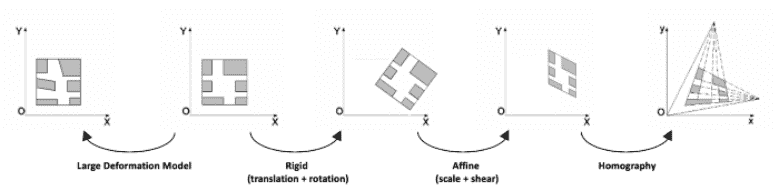

# 图像配准的前世今生：从人工设计特征到深度学习

> 原文：[`mp.weixin.qq.com/s?__biz=MzA3MzI4MjgzMw==&mid=2650767419&idx=5&sn=3d9e3576804e30439cb8a99798ef30cc&chksm=871a4445b06dcd53a0aa9bdf2eb9f652e665678b62c939660a9b354bfe83e010d88b574ff5c6&scene=21#wechat_redirect`](http://mp.weixin.qq.com/s?__biz=MzA3MzI4MjgzMw==&mid=2650767419&idx=5&sn=3d9e3576804e30439cb8a99798ef30cc&chksm=871a4445b06dcd53a0aa9bdf2eb9f652e665678b62c939660a9b354bfe83e010d88b574ff5c6&scene=21#wechat_redirect)

选自 Medium

**作者：Emma Kamoun****机器之心编译****参与：****Nurhachu Null，Geek AI**

> 作为计算机视觉的重要研究课题，图像配准经历了从传统方法走向深度学习的重要革命。本文将回顾图像配准技术的前世今生，为读者提供一个该领域的宏观视野。

图像配准是计算机视觉领域的一个基础步骤。在本文深入探讨深度学习之前，我们先展示一下 OpenCV 中基于特征的方法。**什么是图像配准？**图像配准就是将同一个场景的不同图像转换到同样的坐标系统中的过程。这些图像可以是不同时间拍摄的（多时间配准），可以是不同传感器拍摄的（多模配准），可以是不同视角拍摄的。这些图像之间的空间关系可能是刚体的（平移和旋转）、仿射的（例如错切），也有可能是单应性的，或者是复杂的大型形变模型。图像配准有很广泛的应用：只要我们面对的任务需要比较相同场景的多张图片，它就是必不可少的。它在医学影像、卫星图像分析以及光流领域都是很常用的。*经过配准后的 CT 扫描和核磁共振图像*在本文中，我们会重点关注在一张参考图像和一张待配准图像之间进行图像配准的不同方法。我们不会选择迭代式的/基于强度的方法，因为它们并不像本文中提到的方法这样常用。**传统的基于特征的方法**自本世纪初以来，图像配准主要使用传统的基于特征的方法。这些方法基于三个步骤：关键点检测和特征描述，特征匹配，图像变形。简而言之，我们在两幅图像中选择兴趣点，将参考图像中的每个兴趣点和它在待配准图像中的对应点关联起来，然后对待批准图像进行变换，这样两幅图像就得以对齐。*对一个图像对通过单应性变换进行关联的基于特征的方法***关键点检测和特征描述**关键点就是感兴趣的点。它定义了一幅图像中重要并且有特点的地方（如角，边等）。每个关键点都由一个描述子（包含关键点本质特点的特征向量）表征。描述子应该对图像变换（如位置变换、缩放变换、亮度变换等）是鲁棒的。很多算法都要执行关键点检测和特征描述：

*   SIFT（Scale-invariant feature transform，尺度不变的特征变换）是用于关键点检测的原始算法，但是它并不能免费地被用于商业用途。SIFT 特征描述子对均衡的缩放，方向、亮度变化是保持不变的，对仿射形变也是部分不变的。

*   SURF（Speeded Up Robust Features，加速鲁棒特征）是受到 SIFT 深刻启发设计的检测器和描述子。与 SIFT 相比，它的运行速度要快好几倍。当然，它也是受专利保护的。

*   ORB（定向的 FAST 和旋转的 BRIEF）是基于 FAST（Features from Accelerated Segment Test）关键点检测器和 BRIEF（Binary robust independent elementary features）描述子的组合的快速二值描述子，具有旋转不变性和对噪声的鲁棒性。它是由 OpenCV Lab 开发的高效、免费的 SIFT 替代方案。

*   AKAZE(Accelerated-KAZE) 是 KAZE 的加速版本。它为非线性尺度空间提出了一种快速多尺度的特征检测和描述方法。它对于缩放和旋转也是具有不变性的，可以免费使用。

这些算法在 OenCV 中都得到了实现，易于使用。在下面的例子中，我们使用了 AKAZE 的 OpenCV 实现。其它算法的代码大致也是一样的：只需修改一下算法的名字即可。

```py
import numpy as npimport cv2 as cvimg = cv.imread('image.jpg')gray= cv.cvtColor(img, cv.COLOR_BGR2GRAY)akaze = cv.AKAZE_create()kp, descriptor = akaze.detectAndCompute(gray, None)img=cv.drawKeypoints(gray, kp, img)cv.imwrite('keypoints.jpg', img)
```

*图像的关键点*更多关于特征检测和描述的细节，请参阅下面的 OpenCV 教程：https://docs.opencv.org/3.4/d7/d66/tutorial_feature_detection.html**特征匹配**当组成一个图像对的两张图的关键点都被识别出来以后，我们需要将它们关联（或称「匹配」）起来，两张图像中对应的关键点在现实中是同一个点。一个可以实现该功能的函数是「BFMatcher.knnMatch()」。这个匹配器（matcher）会衡量每一对关键点的描述子之间的距离，然后返回与每个关键点距离最小的 k 个最佳匹配结果。接下来，我们应用比例滤波器来保持正确的匹配。事实上，为了实现可靠的匹配，配对的关键点应该比距离最近的错误匹配点更接近。

```py
import numpy as npimport cv2 as cvimport matplotlib.pyplot as pltimg1 = cv.imread('image1.jpg', cv.IMREAD_GRAYSCALE) # referenceImageimg2 = cv.imread('image2.jpg', cv.IMREAD_GRAYSCALE) # sensedImage# Initiate AKAZE detectorakaze = cv.AKAZE_create()# Find the keypoints and descriptors with SIFTkp1, des1 = akaze.detectAndCompute(img1, None)kp2, des2 = akaze.detectAndCompute(img2, None)# BFMatcher with default paramsbf = cv.BFMatcher()matches = bf.knnMatch(des1, des2, k=2)# Apply ratio testgood_matches = []for m,n in matches:   if m.distance < 0.75*n.distance:   good_matches.append([m])   # Draw matches img3 = cv.drawMatchesKnn(img1,kp1,img2,kp2,good_matches,None,flags=cv.DrawMatchesFlags_NOT_DRAW_SINGLE_POINTS) cv.imwrite('matches.jpg', img3)
```


*配对的关键点*请参阅下面的文档来了解 OpenCV 中实现的其他特征匹配方法：https://docs.opencv.org/trunk/dc/dc3/tutorial_py_matcher.html**图像变形**在匹配到至少 4 对关键点之后，我们就可以将一幅图像相对于另一幅图像进行转换。这个过程被称作图像变形（image warping）。空间中同一平面的任意两幅图像都是通过单应性变换关联起来的。单应性变换是具有 8 个参数的几何变换，通过一个 3×3 的矩阵表征。它们代表着对一幅图像整体所做的任何变形（与局部形变不同）。因此，为了得到变换后的待配准图像，我们计算了单应矩阵，并将它应用在了待配准图像上。为了保证最优的变形，我们使用了 RANSAC 算法来检测轮廓，并且在进行最终的单应性变换之前将轮廓删除。该过程直接内置于 OpenCV 的「findHomography()」函数中。目前也有一些 RANSAC 的替代方案，例如 LMED（Least-Median robust method，最小中值鲁棒方法）。

```py
ref_matched_kpts = np.float32([kp1[m[0].queryIdx].pt for m in good_matches]).reshape(-1,1,2)sensed_matched_kpts = np.float32([kp2[m[0].trainIdx].pt for m in good_matches]).reshape(-1,1,2)# Compute homographyH, status = cv.findHomography(ref_matched_kpts, sensed_matched_kpts, cv.RANSAC,5.0)# Warp imagewarped_image = cv.warpPerspective(img1, H, (img1.shape[1]+img2.shape[1], img1.shape[0])) cv.imwrite('warped.jpg', warped_image)
```

.


*变形后的待配准图像*关于以上三个步骤的更多细节，请参阅 OpenCV 官方发布的系列教程（https://docs.opencv.org/3.1.0/db/d27/tutorial_py_table_of_contents_feature2d.html）。**深度学习方法**
目前大多数的图像配准研究都涉及到深度学习的使用。过去几年里，深度学习方案在计算机视觉任务中（如图像分类、目标检测和分割）达到了最先进的性能。当然，图像配准也没有理由拒绝深度学习。（二级）特征提取深度学习在图像配准中使用的第一种方式就是将其用于特征提取。在卷积神经网络（CNN）中，连续的层能够成功地捕获到越来越复杂的图像特征，学习到特定任务的特征。自 2014 年以来，研究者们就开始将这些神经网络应用于特征提取步骤，代替使用 SIFT 或者其它类似的算法。

*   2014 年，Dosovitskiy 等人提出了通用特征学习方法「Discriminative Unsupervised Feature Learning with Exemplar Convolutional Neural Networks」（https://arxiv.org/abs/1406.6909），仅使用无标签的数据来训练卷积神经网络。这些特征的泛化属性使得它们对变换是鲁棒的。这些特征（或称描述子），在匹配任务中要优于 SIFT 描述子。

*   2018 年，Yang 等人基于同样的思想研发了一种非刚性配准方法「Multi-temporal Remote Sensing Image Registration Using Deep Convolutional Features」（https://ieeexplore.ieee.org/document/8404075）。他们使用预训练的 VGG 网络层来生成能够同时保持卷积信息和定位能力的特征描述子。这些描述子似乎也要优于和 SIFT 类的描述子，尤其是在 SIFT 包含很多轮廓或者不能匹配到足够数目的特征点的情况下。


*SIFT 和基于深度学习的非刚性配准方法描述子的实验结果*论文「Multi-temporal Remote Sensing Image Registration Using Deep Convolutional Features」的代码链接如下：https://github.com/yzhq97/cnn-registration。尽管我们在 15 分钟内就在自己的图像上完成了对这个配准算法的测试，但是它几乎要比我们在本文前面在 SIFT 类的方法上的实现慢了近 70 倍。**单应性学习**研究者们并没有局限于神经网络在特征提取上的使用，而是尝试使用神经网络来直接学习几何变换，从而对齐两张图像。1\. 监督学习 2016 年，DeTone 等人发表了论文「深度单应性估计」（https://arxiv.org/pdf/1606.03798.pdf），提出了「Regression HomographyNet」网络，这是一个类似于 VGG 的网络，能够学习到将两幅图像关联起来的单应性变换。这个算法彰显了以端到端的方式，同时学习单应性变换以及卷积神经网络参数的好处：不再需要之前的两个步骤了！*Regression HomographyNet 示意图*这个网络产生了 8 个实数作为输出。它是以有监督的方式进行训练的，以输出和真实的单应之间的欧氏距离作为损失函数。*有监督的深度单应性估计*与所有的监督方法类似，这个单应性估计方法需要带标签的数据对。尽管在人工生成的图像对上得到这样的单应变换矩阵是很容易的，但是在真实的数据上却需要付出高昂的代价。2\. 监督学习考虑到这一点，Nguyen 等人提出了一种无监督的深度图像单应估计方法（https://arxiv.org/pdf/1709.03966.pdf）。他们保持了原来的  CNN，但是使用了新的、适应于无监督方法的损失函数：他们选择了不需要真实标签的光度损失（photometric loss）。此外，它还计算了参考图像和待配准变换图像之间的相似度。


*L1 光度损失函数*这个方法引入了两个新的网络结构：张量直接线性变换（Tensor Direct Linear Transform）和空间变换层。我们在本文中不会详述这些组成部分的细节，我们只要知道这些是被用来使用 CNN 模型的单应性参数输出获得变换后的待配准图像就行了，我们会用它计算光度损失函数。


*无监督深度单应性估计*这篇文章的作者称，与传统的基于特征的方法相比，这种无监督方法以更快的推理速度得到了相当的或者更高的准确率，以及关于光照变化的鲁棒性。此外，与监督方法相比，它还具有更高的适应能力和性能。**其它方法**1\. 强化学习作为医疗应用中的配准方法，深度强化学习正日益受到关注。与预定义的优化算法不同，在该方法中，我们使用训练过的智能体（agent）来进行配准。*基于强化学习的配准流程示意图*

*   2016 年，Liao 等人首次在图像配准中使用强化学习。他们的方法（https://arxiv.org/pdf/1611.10336.pdf）是以用于端到端训练的贪婪监督算法为基础的。其目标是通过找到最佳的动作序列来对齐图像。虽然这种方法优于一些目前最先进的模型，但是它仅仅被用于刚性变换。

*   强化学习也被用在更加复杂的变换中。在论文「Robust non-rigid registration through agent-based action learning」（https://hal.inria.fr/hal-01569447/document）中，Krebs 等人使用了人工智能体来优化形变模型的参数。这个方法在前列腺核磁共振图像的受试者间配准上进行了测试，在 2D 和 3D 图像上都展现出了良好的效果。

2\. 复杂变换目前有很大一部分关于图像配准的研究关注于医疗图像领域。通常，由于受试者的局部形变（如呼吸变化、解剖学变化等），两幅医疗图像之间的变换不能简单地通过单应矩阵来描述。所以需要更复杂的变换模型，例如可以用位移矢量场表示的微分同胚。*心脏核磁共振图像上的变形网格和位移矢量场的示例*研究者们已试图使用神经网络来估计这些拥有很多参数的大规模形变模型。

*   第一个例子就是上文提及的 Krebs 等人的强化学习方法。

*   2017 年，De Vos 等人提出了 DIRNet。这是一个使用 CNN 来预测控制点的网格的神经网络，这些控制点能够被用来生成根据参考图像来对待配准图像进行变形的位移矢量场。

*DIRNet 示意图（使用 MNIST 数据集中的两张图像作为输入）*Quicksilver 配准解决了一个类似的问题。Quicksilver 使用深度「编码器-解码器」网络直接在图像外观上预测图块级（patch-wise）的形变。*原文地址：**https://medium.com/m/global-identity?redirectUrl=https%3A%2F%2Fblog.sicara.com%2Fimage-registration-sift-deep-learning-3c794d794b7a*

********本****文为机器之心编译，**转载请联系本公众号获得授权****。**

✄------------------------------------------------

**加入机器之心（全职记者 / 实习生）：hr@jiqizhixin.com**

**投稿或寻求报道：**content**@jiqizhixin.com**

**广告 & 商务合作：bd@jiqizhixin.com**