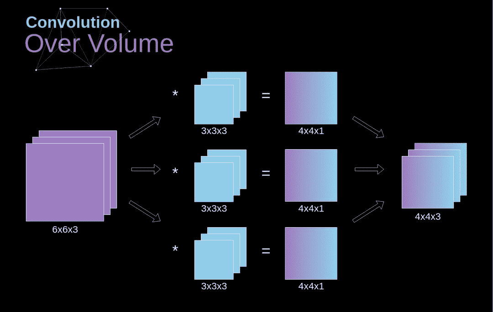

# 刷脸背后，卷积神经网络的数学原理原来是这样的

> 原文：[`mp.weixin.qq.com/s?__biz=MzA3MzI4MjgzMw==&mid=2650760794&idx=2&sn=046c50e418bfeae323cb8c30b795317d&chksm=871aa224b06d2b3240a79b904033ae2c971caed461a6d0653d8da20fca9c09f3407d72091c12&scene=21#wechat_redirect`](http://mp.weixin.qq.com/s?__biz=MzA3MzI4MjgzMw==&mid=2650760794&idx=2&sn=046c50e418bfeae323cb8c30b795317d&chksm=871aa224b06d2b3240a79b904033ae2c971caed461a6d0653d8da20fca9c09f3407d72091c12&scene=21#wechat_redirect)

选自 towardsdatascience

**作者：****Piotr Skalski**

**机器之心编译** 

**参与：****Nurhachu Null、张倩**

> 计算机视觉技术在日常生活中有着非常普遍的应用：发朋友圈之前自动修图、网上购物时刷脸支付……在这一系列成功的应用背后，卷积神经网络功不可没。本文将介绍卷积神经网络背后的数学原理。

在自动驾驶、医疗以及零售这些领域，计算机视觉让我们完成了一些直到最近都被认为是不可能的事情。今天，自动驾驶汽车和无人商店听起来不再那么梦幻。事实上，我们每天都在使用计算机视觉技术——我们用自己的面孔解锁手机，将图片上传到社交网络之前进行自动修图……卷积神经网络可能是这一巨大成功背后的关键组成模块。这次，我们将要使用卷积神经网络的思想来拓宽我们对神经网络工作原理的理解。打个预防针，本文包含相当复杂的数学方程，但是，你也不必为自己不喜欢线性代数和微积分而沮丧。我的目标并不是让你记住这些公式，而是为你提供一些关于底层原理的直觉认知。

**简介**

过去我们接触到了密集连接的神经网络。那些神经网络中，所有的神经元被分成了若干组，形成了连续的层。每个这样的单元都与相邻层的每一个单独的神经元相连接。下图所示的是这样一个架构。

*图 1：**密集连接的神经网络架构*

当我们基于一个有限的固定特征集合解决分类问题的时候，这种方法是很奏效的——例如，我们根据足球运动员在比赛中记录的统计数据来预测他的位置。但是，当处理照片的时候，问题变得更加复杂。当然，我们可以把每个像素的亮度视作一个单独的特征，然后将它作为密集网络的输入传递进去。不幸的是，为了让它能够应付一张典型的智能手机照片，我们的网络必须包含数千万甚至上亿的神经元。另一方面，虽然我们可以将照片缩小，但是我们也会在这个过程中损失有价值的信息。所以我们马上就会发现，传统的策略是没有用的——我们需要一种新的聪明的方法，来尽可能多的利用数据，但同时还要减少必需的计算量和参数。这就是 CNN 发挥作用的时候了。

**数字照片的数据结构**

让我们先花少许时间解释一下数字图像的存储方式。大多数人可能意识到了，图像实际上就是巨大的数字矩阵。每个数字代表的是一个单独像素的亮度。在 RGB 模型中，彩色图片是由 3 个这样的矩阵组成的，每个矩阵对应着 3 个颜色通道（红、绿、蓝）中的一个。在黑白图像中，我们仅使用一个矩阵。每个矩阵都存储着 0 到 255 的数值。这个数值范围是图像存储信息的效率（256 个数值刚好对应一个字节）和人眼敏感度之间的折中（我们仅能区分同种颜色的几种有限色度）。

*图 2\. 数字图像的数据结构*

**卷积**

核卷积并不仅仅用在卷积神经经网络中，它也是很多其他计算机视觉算法的关键元素。这个过程是这样的：我们有一个小的数字矩阵（称作卷积核或滤波器），我们将它传递到我们的图像上，然后基于滤波器的数值进行变换。后续的特征图的值要通过下面的公式计算，其中输入图像被记作 f，我们的卷积核为 h。计算结果的行列索引分别记为 m 和 n。

*图 3\. 核卷积的例子*

在将我们的滤波器放在选中的像素上之后，我们将卷积核中的每一个数值和图像中对应的数值成对相乘。最后将乘积的结果相加，然后把结果放在输出特征图的正确位置上。我们在上边的动画中可以以一个微观的形式看到这个运算的过程，但是更有趣的是我们在整幅图像上执行这个运算得到的结果。图 4 展示了用数个滤波器做卷积的结果。

*图 4\. 用卷积核寻找边缘*

**Valid 和 Same 的卷积**

如图 3 所示，当我们在用 3x3 的卷积核在 6x6 的图像上执行卷积时，我们得到了 4x4 的特征图。这是因为在我们的图像里面，只有 16 个独特的位置来放置卷积核。由于我们的图像的尺寸在每次卷积的时候都会收缩，在图像完全消失之前，我们只能做有限次的卷积。此外，如果我们注意一下卷积核是如何在图像上移动的，我们会发现，边缘的像素会比中央的像素影响更小。这样的话我们会损失图片中包含的一些信息，你可以在下图看到，像素的位置是如何改变它对特征图的影响的。

*图 5\. 像素位置的影响*

为了解决这两个问题，我们可以使用一个额外的边界来填充图像。例如，如果我们使用 1 像素的填充，我们将图像的尺寸增大到了 8x8，这样，3x3 的滤波器的输出将会成为 6x6。通常在实际中我们用 0 来做额外的填充。根据我们是否使用填充，我们会进行两种类型的卷积——Valid 和 Same。命名相当令人费解，所以在这里解释一下：valid 代表我们使用的是原始图像，same 代表我们在图像周围使用了边界，因此输入和输出的图像大小相同。在第二种情况下，扩充的宽度应该满足下面的方程，其中 p 是 padding（填充），f 是滤波器的维度（通常是奇数）。

**跨步卷积**

*图 6\. 跨步卷积的例子*

在之前的例子中，我们总是将卷积核移动一个像素。但是，步长也可以看做是卷积层的一个参数。在图 6 中，我们可以看到，如果我们使用更大的步长，卷积会成为什么样子。在设计 CNN 结构时，如果我们想让接受域有更少的重叠或者想让特征图有更小的空间维度，那么我们可以决定增大步长。考虑到扩充和跨步，输出矩阵的维度可以使用下面的公式计算：

**转换到第三个维度**

立体卷积是一个非常重要的概念，它不仅让我们能够处理彩色图像，而且更重要的是，可以在一个单独的层上使用多个滤波器。最重要的规则是，滤波器和你想在其上应用滤波器的图像必须拥有相同的通道数。基本上，我们继续使用和图 3 类似的示例，尽管我们这次从第三个维度让矩阵中的数值对相乘。如果我们想在同一张图像上应用多个滤波器，我们会为每个滤波器独立地计算卷积，然后将计算结果逐个堆叠，最后将他们组合成一个整体。得到的张量（3D 矩阵可以被称作张量）满足下面的方程，其中：n 是图像的大小，f 是滤波器的大小，n_c 是图像中的通道数，p 是所用的填充，s 是所用的步长，n_f 是滤波器的数量。

*图 7\. 立体卷积*

**卷积层**

使用我们今天所学内容构造一个卷积层的时间到了。我们的方法几乎与用在密集连接神经网络上的方法相同，唯一的差别就是不使用简单的矩阵相乘，这一次我们将会使用卷积。前向传播包含两个步骤。第一步是计算中间结果 Z，它是由前一层的输入数据与张量 W（包含滤波器）的卷积结果，加上偏置项 b 得到的。第二步是给我们的中间结果应用一个非线性的激活函数（我们的激活函数记作 g）。矩阵方程的爱好者将在下面找到合适的数学公式。在下面的插图中，你可以看见一个小型的可视化，它描述了我们方程中用到的张量的维度。

*图 8\. 张量维度*

**连接剪切和参数共享**

在本文开始，由于需要学习的参数数量巨大，我提到密集连接神经网络在处理图像方面是很弱的。既然我们已经了解了关于卷积的所有内容，让我们来考虑一下它是如何优化计算的吧。在下图中，2D 卷积以一种稍微不同的方式进行了可视化——用数字 1-9 标记的神经元组成接收后续像素亮度的输入层，A-D 这 4 个单元代表的是计算得到的特征图元素。最后但同等重要的是，I-IV 是卷积核中的数值——它们必须被学习到。

*图 9\. 连接剪切和参数共享*

现在，让我们聚焦于卷积层的两个重要属性。第一，你可以看到，连续两层中，并不是所有的神经元都是彼此相连的。例如，单元 1 仅仅会影响到 A 的值。第二，我们发现，一些神经元会共享相同的权重。这两个属性都意味着我们要学习的参数数量要少很多。顺便说一下，值得注意的是，滤波器中的每个值都会影响到特征图中的每个元素——这在反向传播中是特别重要的。

**卷积层反向传播**

任何一个曾经试图从零编写自己的神经网络的人都知道，前向传播远远不到成功的一半。真正有趣的是当你开始反向传播的时候。现在，我们不必在反向传播上花心思——深度学习框架都为我们做好了，但是我认为，了解背后发生的东西是很值得的。就像在密集连接神经网络中一样，我们的目标是在一个叫做梯度下降的过程中计算导数，然后使用它们来更新参数值。

在计算中我们会使用链式法则——这个我在之前的文章中提到过。我们想要评估参数的变化对结果特征图的影响，然后评估它对最终结果的影响。在开始进入细节之前，让我们来统一一下将会用到的数学符号——为了让事情变得容易一些，我会放弃偏导数的完整符号，而会使用下面的简写符号。但是请记住，这个符号始终代表代价函数的偏导数。

*图 10\. 一个卷积层在前向和反向传播中的输入和输出数据*

我们的任务是计算 dW^[l] 和 db^[l]——它们是与当前层的参数相关的导数，还要计算 dA^[ l -1]，它们会被传递到之前的层。如图 10 所示，我们以 dA^[ l ] 为输入。当然，这些对应张量的维度都是相同的，dW 和 W，db 和 b，以及 dA 和 A。第一步就是通过在我们的输入张量上应用我们的激活函数的导数，得到中间值 dZ^[l]。根据链式法则，这个运算的结果在后面会被用到。

现在，我们需要处理卷积神经网络自身的反向传播，为了达到这个目的，我们会使用一个叫做全卷积的矩阵运算——见下图。请注意，我们在这里使用的卷积核会提前旋转 180°。这个运算可以通过下面的公式描述，其中的滤波器记作 W，dZ[m,n] 是一个标量，它属于从前一层得到的偏导数。

*图 11\. 全卷积*

**池化层**

除了卷积层，CNN 通常会用到所谓的池化层。它们最早被用来减小张量的大小以及加速运算。这些层是比较简单的——我们需要将我们的图像分成不同的区域，然后在每一个部分上执行一些运算。例如，对 Max Pool 层而言，我们会选择每个区域的最大值，并将它放到对应的输出区域。与卷积层的情况一样，我们有两个可用的超参数——滤波器大小和步长。最后但同样重要的一点是，如果你对一个多通道的图像执行池化操作，那么每一个通道的池化应该单独完成。

*图 12\. 最大池化（max pooling）的例子*

**池化层反向传播**

我们在这篇文章中只讨论最大池化反向传播，但是我们学到的规则是适用于所有类型的池化层的——只需要做微小的调整即可。因为在这种层中，我们没有任何必须更新的参数，所以我们的任务就是合适地分配梯度。我们记得，在最大池化的前向传播中，我们选择的是每个区域的最大值，并将它传递到了下一层。所以在反向传播中也是很清晰的，梯度不应该影响前向传播中不包含的矩阵的元素。实际上，这是通过创建一个掩膜来完成的，这个掩膜记住了前一阶段数值的位置，我们可以在后面转移梯度的时候用到。**

*图 13\. 最大池化反向传播*

*原文链接：https://towardsdatascience.com/gentle-dive-into-math-behind-convolutional-neural-networks-79a07dd44cf9*

****本文为机器之心编译，**转载请联系本公众号获得授权****。**

✄------------------------------------------------

**加入机器之心（全职记者 / 实习生）：hr@jiqizhixin.com**

**投稿或寻求报道：**content**@jiqizhixin.com**

**广告 & 商务合作：bd@jiqizhixin.com**