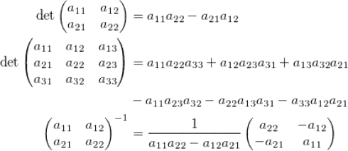
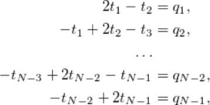
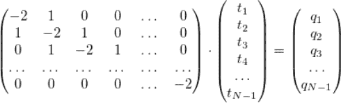
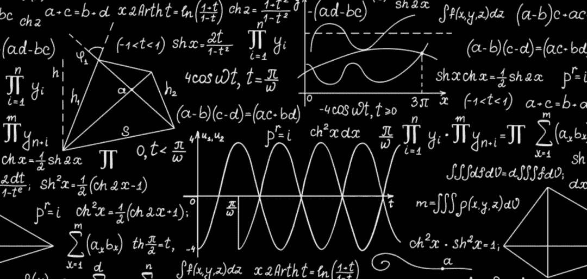
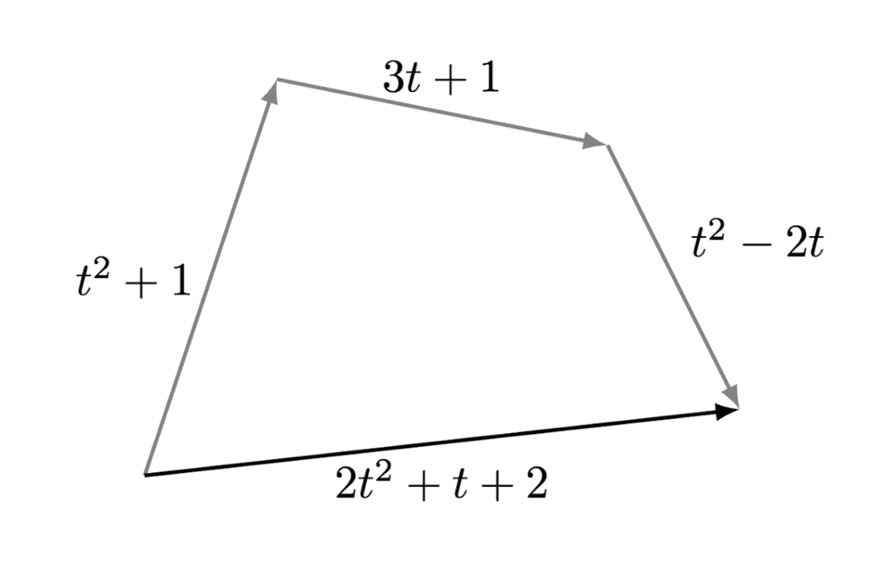

# 人工智能中的线性代数：如何理解并更好地应用它

> 原文：[`mp.weixin.qq.com/s?__biz=MzA3MzI4MjgzMw==&mid=2650773223&idx=4&sn=1aea072679f1a89a9843590ad746fee7&chksm=871a5299b06ddb8f57df78aed94ef8b4005a06cc96c7fbd3f5f05b665925a59a45be0e1db1c0&scene=21#wechat_redirect`](http://mp.weixin.qq.com/s?__biz=MzA3MzI4MjgzMw==&mid=2650773223&idx=4&sn=1aea072679f1a89a9843590ad746fee7&chksm=871a5299b06ddb8f57df78aed94ef8b4005a06cc96c7fbd3f5f05b665925a59a45be0e1db1c0&scene=21#wechat_redirect)

选自 TowardsDataScience

**作者：Oleksii Kharkovyna****机器之心编译****参与：高璇、蛋酱**

> 线性代数是 AI 专家必须掌握的知识，这已不再是个秘密。如果不掌握应用数学这个领域，你永远就只能是「门外汉」。当然，学习线性代数道阻且长。数学，尤其是线性代数常与枯燥、复杂和毫无意义的事物联系起来。不过你还可以另辟蹊径。

阅读完本文后，你将了解到：

*   线性代数的本质；

*   线性代数的真实应用场景；

*   线性代数可用于 AI、ML 和数据科学的原因；

*   学习线性代数最有效的方法。

**给初学者的解释：****线性代数的本质**第一次接触线性代数的人，通常会觉得线性代数长这样：看起来就让人头大？你的脑海随即会浮现出两个问题：它们都是从哪儿来的？为什么需要这些运算？让我们做个简单的练习。线性代数是计算数学的「主力军」。我举个简单的例子来说明。假设我们有一根两端固定的极细金属棒，其温度恒等于零。我们开始使用分布式热源对棒进行加热，该热源在点 x 的附近，每单位长度每秒产生 q (x) 焦耳热量。温度 t = t (x) 公式该怎么建立？先粗略建模：热量平衡后，设点 x 的分段为 [x-h, x + h]，来自热源的热流入应等于分段两端的热通量之和。如果 h 足够小，那么热通量可以看作常量（包含 h），该等式可以写成如下形式：其中 Q_x-h 是通过左边界的热通量，Q_x + h 是通过右边界的热通量。根据傅立叶定律，热通量与温度差成正比（毕竟，你刚跳进水里时感觉最冷）。因此：令 h = 1 /N。假设 xi = i · h，其中 i =0, 1, 2, …, N，它们被称为网格。变量 ti = t (xi) 将满足方程式：基于边界条件且 qi = q (xi)，得到线性方程组：具体来说，这个系统可以通过扫描法「正面」解决，但是在实际模型中，系统变得更加复杂。线性代数正好发挥了作用：用 A · y = b 的简短形式描述系统（这是矩阵乘法的由来！）；了解是否有解决方案，以及解决方案是否唯一；（在本例中）使用简单公式 y = A-1 b 来建模，将 A 看做一个数字；（引入计算数学）建立用于求解线性方程组的有效数值方法。这只是从数学建模的角度看线性代数，还有量子力学、统计学等多个角度。再以著名问题为例，即某网站（或整个互联网）的「网页引用排名」问题。假设有 N 个页面，每页可能包含到其他页面的链接。我们的任务是确定哪些页面最重要。如何准确地衡量「重要性」是任务的一部分。我们将以非负数（权重）来定量表示。先假设：此页面的链接越多，其权重就越大。这种方法有个缺点：我们没有考虑链接页面的权重。一个链接权重越大，其意义也越大，这是合乎逻辑的。考虑到这些因素，我们选择以下模型：其中 a_ij 是第 i 页到第 j 页的链接数，除以第 j 页的链接总数。该公式可以理解为：第 i 页的权重等于第 j 页的权重与从第 j 页到第 i 页的链接之比的乘积之和。因此，我们将问题简化为线性方程组。此外，权重向量 p 是矩阵 A 的特征向量，对应特征值为 1：p = ApFrobenius-Perron 定理保证了该向量的存在（严格来说，矩阵 A 略有修改），通过简单的迭代即可找到。因此，线性代数是一套非常通用的思想和工具，可以应用于各个领域。但是「天下没有免费的午餐」，通用性的代价是：某些定义和定理有着毫无必要的复杂度。不过事实并非如此：实际上，许多抽象目的是简化而非复杂化。「如果它看起来像鸭子，像鸭子一样游泳，像鸭子一样嘎嘎叫，那么它可能就是鸭子」这实际上就是一种抽象，如果你习惯了这种抽象概念，将会非常方便。线性代数也是一样。为了更具体地说明这一点，让我们简短讨论下内部来补充一下「外部检查」。**一些你需要知道的线性代数理论**线性代数研究的是向量空间以及将一个向量空间映射到另一个向量空间的函数。我们主要考虑线性函数（对于任何常数α和β以及向量 x 和 y，满足关系 f (α · x + β · y) = α · f (x) + β · f (y)。也有非线性的函数（例如二次方程），不过首先你需要知道什么是向量（以及向量空间），这不像看上去那么简单。教材和课程中通常只是给出一个抽象的定义，这一定义又常常由 8 点构成。有时一个矢量空间被视作一个使用加号的阿贝尔群，该阿贝尔群满足四大群公理，并定义了标量乘法。但是对于刚开始研究线性代数的人来说，理解这些着实困难，学习一些具体示例并进行类比要容易得多。8 条的定义仅仅是这种类比的形式。所以我们举个例子吧：向量，是我们每个人都熟悉的有向线段，多个有向线段可以组成一个向量空间。回忆一下多项式，它们可以进行通项相加以及系数相乘。请注意：从代数的角度来看，这些多项式的加法运算以及多项式与系数的乘法运算，与有向线段运算规则是完全一致的。例如，等式 x + y = y + x（加法交换性）对有向线段和多项式均成立。因此，多项式的集合是向量空间，而多项式就是向量。

既然多项式类似于有向线段，那么它们也肯定有坐标。但是如何获知多项式的坐标以及多项式有多少个坐标呢？众所周知，每个向量在平面上都有两个坐标，在空间中则是三个。为什么会这样呢？维度又是什么？线性代数给出了一个答案：维度就是线性无关向量的最大数量。线性无关是什么意思？如果存在数字α1, α2, …, αn，其中至少一个非零，则向量 x1, x2, …, xn 被称为线性相关。

如果向量不线性相关，则称它们为线性独立。（线性相关性的概念概括了平行向量和共面向量的概念：两个向量在当且仅当它们平行时才线性相关。三个向量在当且仅当它们共面时才线性相关。）空间的维数可以是有限的（维数不大于 N 的多项式空间），也可以是无限的（所有多项式空间）。这两种情况在实际中都会出现，但现在我们限制其为有限维的。令向量 x1, x2, …, xn 线性无关，n 为空间维数。任何其他向量 x 都可以唯一地写为 x1, x2, …, xn 的线性组合，相应的线性组合的系数称为坐标。现在，我们对坐标有了严格的定义，但重点不只是这个：在此过程中，我们遇到了更基本（更易忽略）的线性组合和线性相关性的概念。而且我们还了解到，在 n 维线性空间中，最多只能有 n 个线性无关向量。这是线性代数的基础之一。我们知道的仍只是「冰山一角」。但是现在我们可以解决那些显然与线性代数无关的问题了。例如：给定多项式 p 和 q；是否在两个变量 R = R (x, y) 中存在多项式，使得对于所有 t 都有 R (p (t), q (t)) = 0？「示例」基本结束了，但仍然有必要讲讲研究线性代数的各种方法。我简短回顾一下自己的经历，提出几点建议。**最重要的问题：****AI 真的需要线性代数吗？**这取决于你的目的。如果你只想把人工智能和机器学习的工具当作一个黑匣子，那么你只需要足够的数学计算就可以确定你的问题是否符合模型使用。如果你想提出新想法，线性代数则是你必须要学习的东西。并不是说你需要学习有关数学的所有知识，这样会耽搁于此，失去研究其他更重要的东西（如微积分/统计）的动力。你的目标应该是使用线性代数来找到点与点之间的最短路径。以下是你所需要掌握的知识列表：标量、向量、张量：求模（大小）、向量夹角（点积或内积）、一个向量在另一向量上的投影以及依据自定义的轴向量对向量的描述和表示矩阵：矩阵可以将向量的描述从一组基（一组坐标轴）转换为另一组基。例如，找出如何将映射应用到图像上并处理图像。矩阵中的长度平方采样、奇异值分解、低秩逼近是数据处理中广泛采用的几种方法。SVD 通常用于主成分分析（PCA）中，而主成分分析又被广泛用于特征提取以及了解特征或属性之间的关系对于结果的重要性上。**线性代数在机器学习中的应用实例**以下是线性代数的一些具体示例：**数据集和数据文件**例如在机器学习中，将模型拟合到一组由数字组成的类似表格的数据集上，其中每一行代表一个观测结果，每一列代表该观测值的特征。你发现相似之处了么？这些数据实际上是一个矩阵：是线性代数中的一种关键的数据结构。**图像和照片**你处理的每个图像本身就是一个表结构，对于黑白图像，每个单元格中有一个宽度和高度以及一个像素值，而彩色图像每个单元格中有三个像素值。照片是线性代数矩阵的另一个例子。**独热编码**独热编码是分类变量中的一种很流行的编码。独热编码是创建表来表示变量，其中每一列表示一个类别，每一行表示数据集中的一个样本。**线性回归**线性回归是统计学中描述变量之间关系的一种旧方法。在机器学习中，它通常用于预测简单回归问题中的数值。**深度学习**线性代数是描述深度学习方法的核心，通过矩阵表示法来实现深度学习方法，例如谷歌的 TensorFlow Python 库，其名称中就有「tensor」一词。

**结论**

下面是我在学习这些并不简单的数学内容时总结的技巧：

*   在解决有趣的问题时，是最容易理解线性代数思想和方法的，趣味问题有助于理解抽象概念；

*   记得要与其他人（朋友，或论坛）一起学习；

*   如果你喜欢按日程表学习，请使用在线课程和其他方法。但在将矩阵转换为 Wolfram Alpha 之前，你应该学会「手撕矩阵」；

*   注意多读书，这可以促使你深度思考。

线性代数的基本概念和定理并非从零开始。努力理解本质、内部逻辑对拓宽你在这个主题上的视角很有用。克莱默（Cramer）、高斯（Gauss）、皮亚诺（Peano）等等许多人肯定从中发现了乐趣（他们首先取悦了自己），所以学习线性代数的人怎么会感到无聊呢？*原文地址：*

*https://towardsdatascience.com/mathematics-for-ai-linear-algebra-and-how-to-understand-it-better-63b430999069*

********本****文为机器之心编译，**转载请联系本公众号获得授权****。**
✄------------------------------------------------**加入机器之心（全职记者 / 实习生）：****hr@jiqizhixin.com****投稿或寻求报道：content****@jiqizhixin.com****广告 & 商务合作：****bd@jiqizhixin.com**