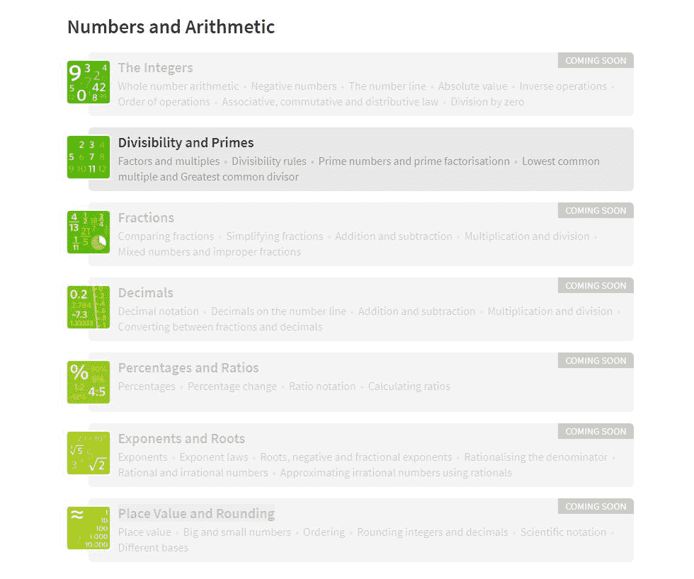
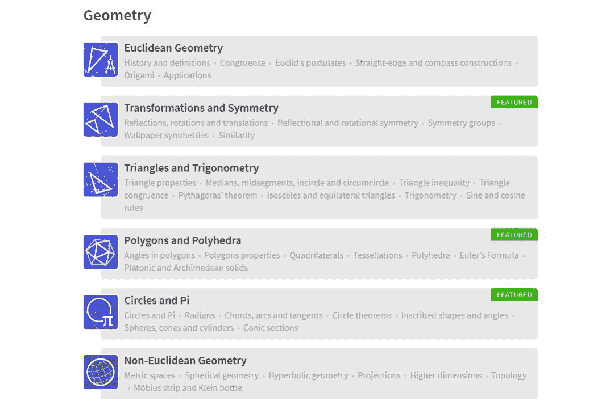

# 数学还能这么学？高中要有这个网站我早就及格了

> 原文：[`mp.weixin.qq.com/s?__biz=MzA3MzI4MjgzMw==&mid=2650760037&idx=2&sn=7fc17623f78dd99ad4e302e33f94433c&chksm=871aa71bb06d2e0d0baf15891befd2fcd7b272ab02365bbda33a27b52616720dff41c77d06d1&scene=21#wechat_redirect`](http://mp.weixin.qq.com/s?__biz=MzA3MzI4MjgzMw==&mid=2650760037&idx=2&sn=7fc17623f78dd99ad4e302e33f94433c&chksm=871aa71bb06d2e0d0baf15891befd2fcd7b272ab02365bbda33a27b52616720dff41c77d06d1&scene=21#wechat_redirect)

机器之心报道

**机器之心编辑部**

> 高中数学经常考不及格的我发现了一个有趣的可视化数学学习网站！恨不能回到十年前（emmm... 一不小心暴露年龄了……

之前我们介绍过全交互的[线性代数书](http://mp.weixin.qq.com/s?__biz=MzA3MzI4MjgzMw==&mid=2650757879&idx=3&sn=9f314715be35e1137fecaf8d40ef3edf&chksm=871a9e89b06d179ff0528d6b16a713567649c16216bce3758810f9dc4eb84f64b67c7ede5972&scene=21#wechat_redirect)和[可视化的统计概率入门书](http://mp.weixin.qq.com/s?__biz=MzA3MzI4MjgzMw==&mid=2650754777&idx=3&sn=9d66227fbb7860a0563aa89009f6da36&chksm=871a8aa7b06d03b103ed2d98f817ac11dd3e20a9b30d26b9800ab3f5cabb0364ecdb99458608&scene=21#wechat_redirect)，今天我们就来看一看「这本有趣的基础数学书」：Mathigon。Mathigon 提供交互式学习方式、个性化学习服务和故事化的教学内容，试图改变原本枯燥的数学学习方式，为数学学习过程注入活力，保护和提升学习者的好奇心、创造力和想象力。

该网站的创始人 Philipp Legner 曾在剑桥大学学习数学，在伦敦大学学院教育研究院学习数学教育，曾供职于谷歌、彭博、沃尔夫勒姆研究公司和高盛。此外，他还为 MoMath 和 Imaginary 等教育组织提供咨询。

该网站的顾问委员会成员包括：MoMath CEO Cindy Lawrence、沃尔夫勒姆研究公司欧洲分部联合创始人和 CEO Conrad Wolfram、Global Math Week 创始人 James Tanton、Android 公司创始人 Rich Miner，以及《Fermat』s Last Theorem》、《The Code Book》等畅销书的作者 Simon Singh。

网站地址：https://mathigon.org/

**课程**

Mathigon 网站涵盖大量课程，目前包括基础（Foundations）、Intermediate（中级）、Advanced（高级）和 Recreational（娱乐）四个模块，其中基础课程适用于 6-8 年级学生，中级和高级适合高中生。

**基础课程**

基础课程包括：数字和算术、方程和函数、几何学、概率和统计。

「数字和算术」这部分内容中，目前只有「Divisibility and Prime」（整除和素数）是开放的，其它内容正在设计当中。

小编点进去发现，该主题下又分为了好几节：从约数和倍数、整除规则、素数、素数分布、最小公倍数、最大公约数到最后的现实应用，内容丰富详尽、应有尽有。

每节内容中都包含彩色插图，有些图片还是互动式的，以「最大约倍数」为例：

现实应用的讲解看起来也很有趣：

看完这些，小编酸了。如果以前学数学的时候这么好玩，小编的数学成绩肯定会好看多了！

**中级课程**

中级课程包括几何、代数、概率和离散数学三大类。其中几何内容基本已经完备，都可以点进去学习：

代数课程目前只有序列和模式、二次方程是开放的，其余尚在准备阶段：

概率和离散数学中，有一半内容已经筹备完毕：

**高级课程**

高级课程分为五部分：数学语言，代数与分析，几何学、三角学和矩阵，微积分，概率和统计。

数学语言部分皆已开放：

代数分析都还在筹备中：

第三部分中只有分形是开放的，其它内容尚在准备中：

微积分与概率统计部分都还在路上：

**娱乐**

这部分主要包括一些好玩的活动，如「数学在日常生活中的应用」、「折纸中的数学」、「爱丽丝漫游数学仙境」、「寻宝游戏」，寓教于乐，帮助学习者在游戏中学习数学。

*OH MY GOD! 兔子洞中惊现数学题……*

此外，该网站还计划为教师提供服务，所有资源均可免费使用。

**教学特点**

**互动式的学习方式**

该网站的创新内容格式使数学变得极具互动性。学生在每一步都要积极参与，探索和发现新思想。

这种学习方式与视频教学和课本教学不同，学生不仅仅消化信息，他们还参与解决问题、推理，因此变得更具创造力。

**个性化的学习服务**

该网站提供虚拟个人教师来引导学生学习新的主题，并给予实时提示和鼓励。这种导师-学生的比例几乎是 1:1 的。

随着对学生的了解加深，该网站的算法会无缝调整和个性化学习内容，使每个学生都能掌握课程内容。

**故事化的教学内容**

每门课程都有各种彩色插图、谜语、动画和真实应用。迷人的叙事方式让教学内容变得更易理解和记忆。

通过这种教学方式，你会发现数学不仅仅是抽象的方程和程序，它还非常美丽和实用。

话不多说，小编要去学习了～

****本文为机器之心报道，**转载请联系本公众号获得授权****。**

✄------------------------------------------------

**加入机器之心（全职记者 / 实习生）：hr@jiqizhixin.com**

**投稿或寻求报道：**content**@jiqizhixin.com**

**广告 & 商务合作：bd@jiqizhixin.com**