# 浅显易懂！「高中数学」读懂梯度下降的数学原理

> 原文：[`mp.weixin.qq.com/s?__biz=MzA3MzI4MjgzMw==&mid=2650759989&idx=1&sn=9f35384251ef8295fbc7caf2d9c2dc8d&chksm=871aa74bb06d2e5da1baa92867f5e95deb4ead632502abd437ede6a5553d5c23650e8a765e50&scene=21#wechat_redirect`](http://mp.weixin.qq.com/s?__biz=MzA3MzI4MjgzMw==&mid=2650759989&idx=1&sn=9f35384251ef8295fbc7caf2d9c2dc8d&chksm=871aa74bb06d2e5da1baa92867f5e95deb4ead632502abd437ede6a5553d5c23650e8a765e50&scene=21#wechat_redirect)

选自 towardsdatascience

**作****者：****Parul Pandey**

**机器之心编译**

**参与：Panda**

> 梯度下降是最常用的机器学习优化算法之一，Towards Data Science 近日发布了一篇文章，浅显易懂地解释了梯度下降的原理和工作过程。

「过早优化是罪恶之源。」

——计算机科学家和数学家 Donald Ervin Knuth

敏捷（agile）是软件开发过程中的一个广为人知的术语。其背后的基本思想很简单：快速构建出来→发布它→获得反馈→基于反馈进行修改→重复这一过程。这种做法的目标是让产品亲近用户，并让用户通过反馈引导你，以实现错误最少的可能最优的产品。另外，改进的步骤也需要很小，并且也应该让用户能持续地参与进来。在某种程度上讲，敏捷软件开发过程涉及到快速迭代。而梯度下降的基本过程也差不多就是如此——尽快从一个解开始，尽可能频繁地测量和迭代。

## **目标**

梯度下降算法是一个迭代过程，能让我们得到一个函数的最小值（这里先不提一些额外的注意事项）。下面的公式将整个梯度下降算法汇总成为了一行：

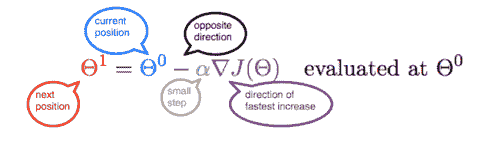

但我们是怎么得到这个公式的？实际上很简单，而且仅包含一些高中数学知识（小编：海外高中数学？捂脸）。我们希望能通过这篇文章在线性回归模型的背景中理解和再现这一公式。

## **一个机器学习模型**

设有一些在一个 2D 空间中的数据点。假设这些数据与一组学生的身高和体重有关。我们希望预测这些量之间的某种关系，以使我们可以预测未来某个新学生的体重。这本质上是监督式机器学习技术的一个简单案例。

现在，让我们在空间中画一条任意的线，并使其穿过某些数据点。那么这条线的方程即为 Y = mX + b，其中 m 是斜率，b 是这条线在 Y 轴上的截距。

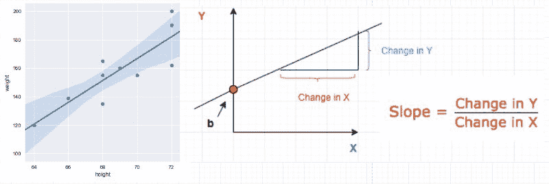

**预测**

给定一组已知的输入和它们对应的输出。机器学习模型会尝试基于这些数据预测新输入的输出结果。

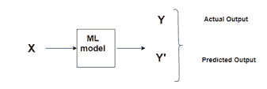*机器学习过程*

误差（Error）即为两个预测结果之间的差异。

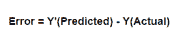

与其相关的概念是成本函数或损失函数。

## **成本函数**

成本函数/损失函数评估的是我们的机器学习算法的性能表现。损失函数计算的是单个训练样本的误差，成本函数则是损失函数在整个训练集上的平均。因此，我会交替地使用这两个术语。

基本上而言，成本函数能告诉我们在给定了 m 和 b 的值时模型在预测方面的表现「有多好」。

比如说，如果数据集中共有 N 个点，而对于所有这 N 个数据点，我们希望最小化其误差。因此成本函数就将是总平方误差，即：

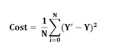*N 个数据点的成本函数*

为什么我们要用平方差而不直接使用绝对差呢？因为平方差能让我们更轻松地推导出一条回归线。实际上，为了找到那条线，我们需要计算成本函数的一阶导数，而计算绝对值的倒数比计算平方值的导数要难得多。

**最小化成本函数** 

> 任何机器学习算法的目标都是最小化成本函数。

这是因为实际值和预测值之间的误差越低，就说明算法在学习上的表现就越好。因为我们希望得到最低的误差值，所以我们希望这些 m 和 b 值所得到的误差尽可能最小。

**我们究竟如何最小化任意函数？**

仔细观察，我们的成本函数是 Y=X² 的形式。在笛卡尔坐标系中，这是一个抛物线方程，可以画成下图形式：

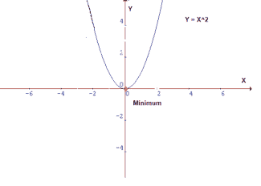*抛物线*

要最小化上述函数，我们需要找到能得到最低 Y 值的 X 值，即红点位置。因为这是一张 2D 图，所以定位其最小值很容易，但在更高维度上情况却非如此。在这些情况下，我们需要设计一个能定位最小值的算法，这个算法就是梯度下降。

## **梯度下降**

梯度下降是最常用的优化算法之一，也是目前最常用的优化神经网络的方式。这是一种用于寻找函数最小值的迭代式优化算法。

**直观理解**

假设你正沿着下面的图行走，而且目前正位于绿点位置。你的目标是到达最小值，即红点位置；但在你的位置处，你无法看到最小值在哪里。

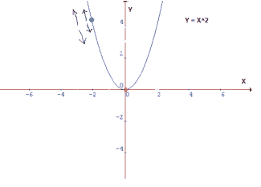

可能的动作会是这样：

*   你可能向上或向下

*   如果你决定了要走的方向，为了到达目的地，你可能跨一大步，也可能走一小步。

本质上讲，为了到达最小值，你应该知道两件事：走哪条路和步子迈多大。

梯度下降算法可使用导数帮助我们有效且高效地做这些决定。导数是源自微积分的一个术语，可作为图在特定点的斜率而进行计算。所以，如果我们有能力计算这条切线，我们可能就能够算出为到达最小值所应选择的方向。我们将在后文更详细地介绍这一点。

**最小值**

在上图中，我们可以在绿点画一条切线，我们知道，如果我们向上移动，我们就将远离最小值或者反过来。另外，这条切线也能让我们了解斜率的陡峭程度。

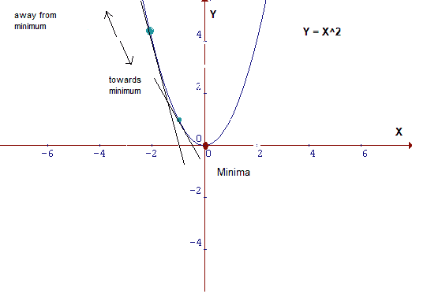

蓝点处的斜率没有绿点处陡，这意味着从蓝点到达最小值所需的步幅比在绿点处要小得多。

## **成本函数的数学解释**

现在，让我们将上面介绍的一切写成数学公式。在等式 y = mX+b 中，m 和 b 是其参数。在训练过程中，它们的值会进行较小的变化。我们将这个小变化表示成δ。参数的值将分别以 m=m-δm 和 b=b-δb 的方式更新。这里我们的目标是找到 y=mx+b 中能使误差最小的 m 和 b 值，即最小化成本函数的值。

重写成本函数：

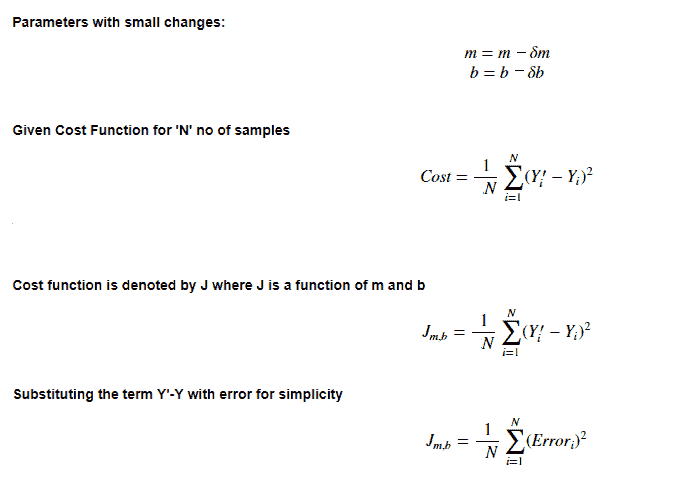

其思想是，通过计算函数的导数和斜率，我们可以找到该函数的导数/斜率。

## **学习率**

到达最小值或底部的步幅大小被称为学习率。更大的步幅/更高的学习率可以覆盖更大区域，但却有越过最小值的风险。另一方面，更小的步幅/更低的学习率到达最低点需要消耗大量时间。

下面的图片展示了学习率的概念。在第三张图中，我们用最少的步骤到达了最小值。这是这一问题的最佳学习率。

可以看到，当学习率过低时，需要很多步骤才能收敛。而当学习率过高时，梯度下降将无法到达最小值，如下图所示。

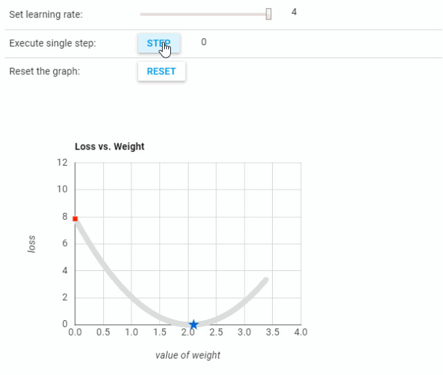 

不同学习率的实验结果可参考：https://developers.google.com/machine-learning/crash-course/fitter/graph。

## **导数**

机器学习在优化问题中使用导数。梯度下降等优化算法使用导数来实际决定是增大还是减小权重，以增大或减小目标函数。

如果我们可以计算出一个函数的导数，我们就会知道要继续的方向就是最小化该函数的方向。我们主要是处理两个来自微积分的概念：

**幂规则**

幂规则计算的是提升成幂的变量的导数。

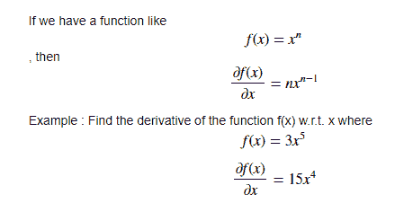

**链式法则**

链式法则用于计算复合函数的导数。链式法则可以使用莱布尼兹符号表示如下：

如果变量 z 依赖于变量 y，而变量 y 又依赖于变量 x，则 y 和 z 是因变量，而且 z 也通过中间变量依赖于 x。这被称为链式法则，用数学式可写成：

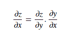

让我们通过一个例子来理解：

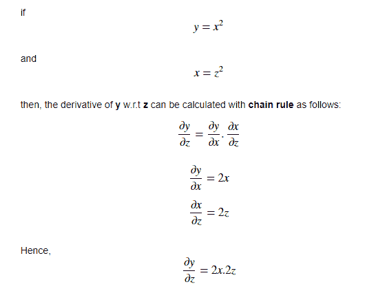

将幂规则和链式法则用于导数，我们可以计算成本函数相对于 m 和 b 的变化方式。这涉及到偏导数的概念，即如果一个函数有两个变量，则寻找该函数相对于一个变量的偏导数的方法是将另一个变量视为常量。用例子解释会更清楚：

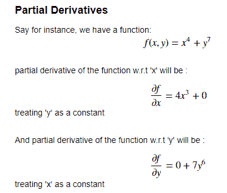

**计算梯度下降**

现在我们将这些微积分规则应用于我们原来的等式，并找到成本函数相对于 m 和 b 的导数。重访成本函数：

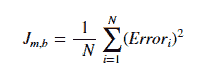

为了简单，让我们摆脱其中的求和符号。这个求和部分很重要，尤其是涉及到随机梯度下降（SGD）与批梯度下降的概念时。在批梯度下降的过程中，我们一次性检查所有训练样本的误差；而在 SGD 过程中，我们每次检查每个误差。但是，为了简单起见，我们假设我们每次检查每个误差。

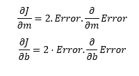 

现在，我们来计算与 m 和 b 相关的误差的梯度：

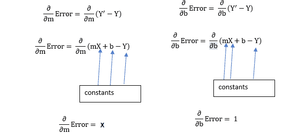

将这些值放回成本函数，并将其与学习率相乘：

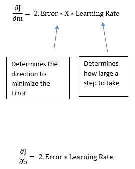

现在，这个等式中的 2 并不是那么重要，因为它只是表示我们的学习率有两倍或一半那么大。所以我们直接丢掉它。因此，最终这整篇文章都浓缩成了两个表示梯度下降的简单等式。

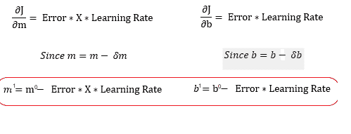

m¹,b¹ = 下个位置参数；m⁰,b⁰ = 当前位置参数。

因此，为了求解梯度，我们使用新的 m 和 b 值迭代我们的数据点并计算偏导数。这个新梯度能指出成本函数在当前位置的斜率以及我们应该移动的方向，以便更新我们的参数。我们的更新的大小受学习率控制。

## **总结**

这篇文章的目的是展示梯度下降的概念。我们使用了梯度下降作为线性回归的优化策略。通过绘制最佳拟合线来测量学生身高和体重之间的关系。但是，需要重点指出，这个线性回归示例是为了演示简单而选择的，梯度下降也可用于其它机器学习技术。****

*原文链接：https://towardsdatascience.com/understanding-the-mathematics-behind-gradient-descent-dde5dc9be06e*

****本文为机器之心编译，**转载请联系本公众号获得授权****。**

✄------------------------------------------------

**加入机器之心（全职记者 / 实习生）：hr@jiqizhixin.com**

**投稿或寻求报道：**content**@jiqizhixin.com**

**广告 & 商务合作：bd@jiqizhixin.com**