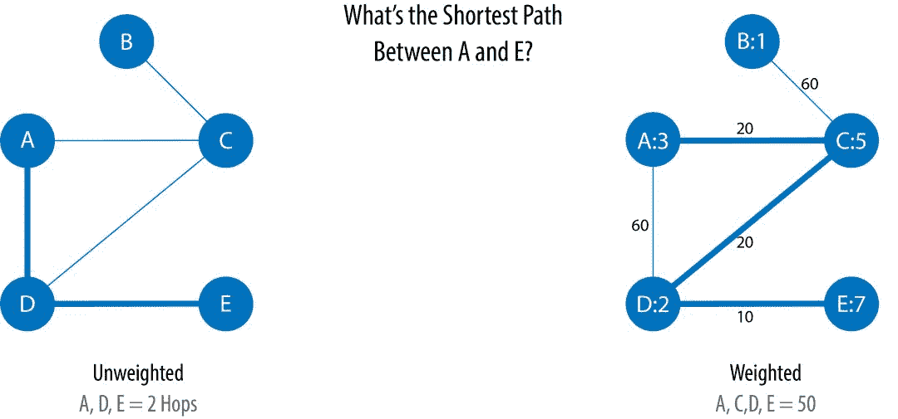
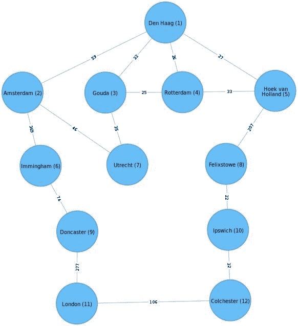
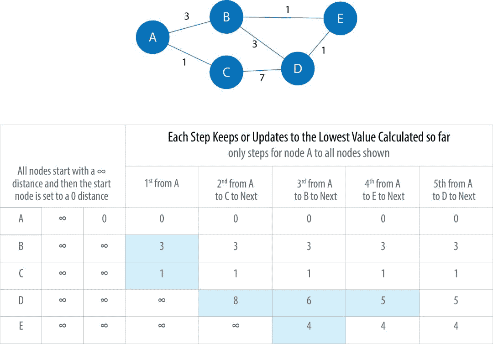
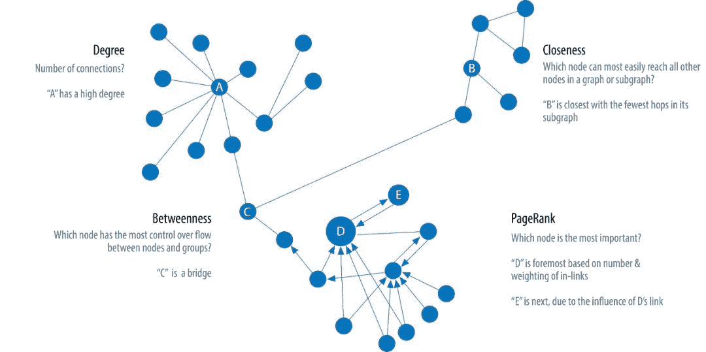
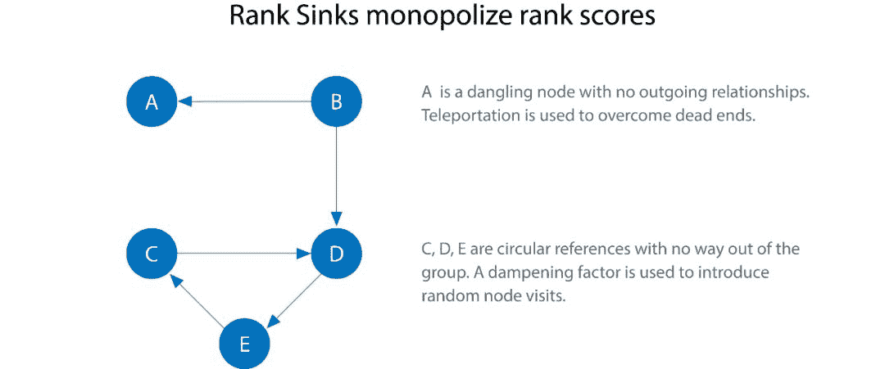
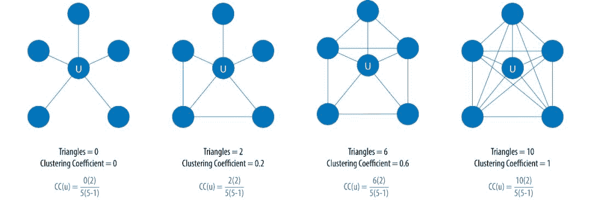
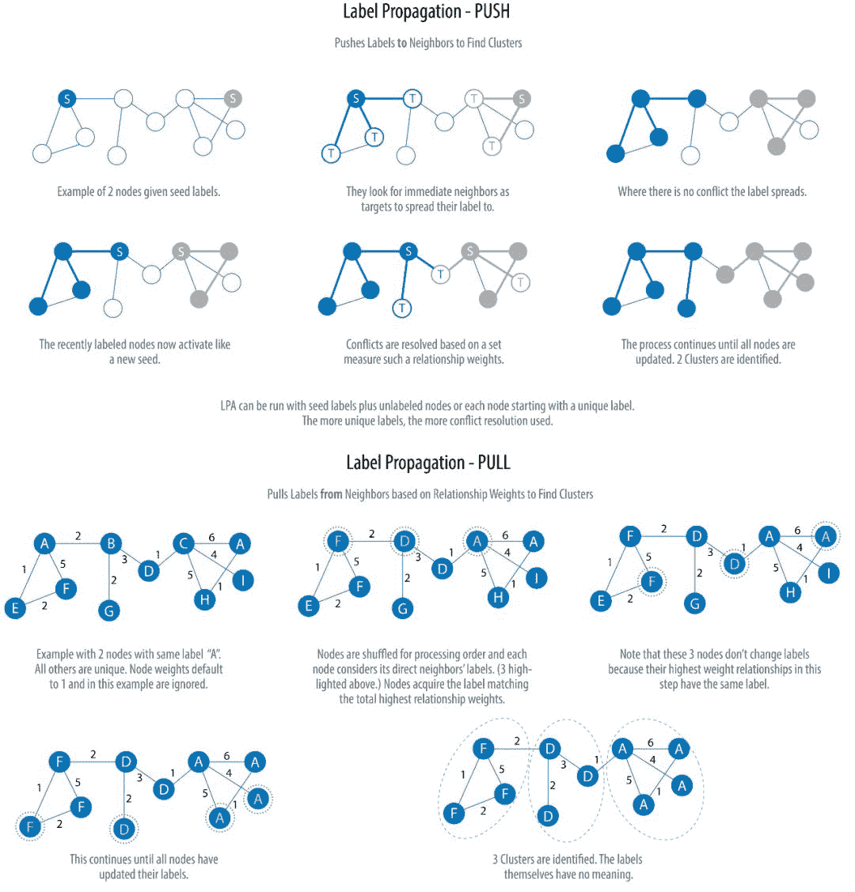

# 关于图算法 & 图分析的基础知识概览

> 原文：[`mp.weixin.qq.com/s?__biz=MzA3MzI4MjgzMw==&mid=2650762211&idx=5&sn=1eb340d03de958d0d157d65374248cc5&chksm=871aaf9db06d268b67cb468acd64fbf2f46d1efc2e5484cecb5592401bd44b9bed893de77199&scene=21#wechat_redirect`](http://mp.weixin.qq.com/s?__biz=MzA3MzI4MjgzMw==&mid=2650762211&idx=5&sn=1eb340d03de958d0d157d65374248cc5&chksm=871aaf9db06d268b67cb468acd64fbf2f46d1efc2e5484cecb5592401bd44b9bed893de77199&scene=21#wechat_redirect)

机器之心转载

**来源：数据科学一线 DSFrontier**

> 本篇博文的主要内容来源于 O’Reilly 系列的《GraphAlgorithms》，对图算法进行了综述介绍，作者为 Amy E. Hodler & Mark Needham。

网址：https://learning.oreilly.com/library/view/graph-algorithms-/9781492060116/

你肯定没有读过这本书，因为这本书的发布日期是 2019 年 5 月。本文会覆盖该书的大部分内容，读完这篇，你能够了解图算法的基本概念。关于此书，作为市面上为数不多的面向数据科学应用的图算法书籍，写的比较全面系统和易懂。当然，书在细节上的提高空间还有很多。今天内容很多，坐稳~

目录

图算法 & 图分析

图基础知识

       连通图与非连通图

       未加权图与加权图

       有向图与无向图

       非循环图和循环图

图算法

       路径搜索算法

              DFS & BFS

              最短路径

              最小生成树

              随机游走

       中心性算法

              DegreeCentrality

              ClosenessCentrality

              BetweennessCentrality

              PageRank

       社群发现算法

              MeasuringAlgorithm

              ComponentsAlgorithm

              LabelPropagation Algorithm

              LouvainModularity Algorithm

结论

# **图算法 & 图分析**

**图分析**使用基于图的方法来分析连接的数据。我们可以：查询图数据，使用基本统计信息，可视化地探索图、展示图，或者将图信息预处理后合并到机器学习任务中。图的查询通常用于局部数据分析，而图计算通常涉及整张图和迭代分析。

**图算法**是图分析的工具之一。图算法提供了一种最有效的分析连接数据的方法，它们描述了如何处理图以发现一些定性或者定量的结论。图算法基于图论，利用节点之间的关系来推断复杂系统的结构和变化。我们可以使用这些算法来发现隐藏的信息，验证业务假设，并对行为进行预测。

图分析和图算法具有广泛的应用潜力：从防止欺诈，优化呼叫路由，到预测流感的传播。下图是 Martin Grandjean 创建的航线网络图，这幅图清楚地展示了航空运输集群高度连接的结构，帮助我们了解航空运力如何流动。航线网络采用典型的辐射式结构（hub-and-spoke structure），这样的结构在有限运力的前提下，增大了航线的网络的始发-到达对（OD Pair），然而却也带来了系统级联延迟的可能。

# **图基础知识**

我们已经在前一篇博文中介绍了属性图的概念。我们已经知道了节点、关系、属性（Property）、标签等概念。

**子图（Subgraph）**是一张图的一部分。当我们需要对图中的特定节点，特定关系，或者特定标签或者属性进行特定分析时，子图就会很有用。

**路径（Path）**是一组节点及他们的关系的集合。以上图为例，“Dan” 开过型号为 “Volvo V70” 的车，这辆车是属于 “Ann” 的。那么节点 “Dan” “Ann” “Car”和关系 “Drives” “Owns” 组成了一个简单的路径。

我们在介绍图算法前，先梳理一下图的不同属性（Attribute）。

## **连通图与非连通图**

**连通图**（Connected Graphs）指图内任意两个节点间，总能找到一条路径连接它们，否则，为**非连通图**（Disconnected Graphs）。也就是说，如果图中包含岛（Island）,则是非连通图。如果岛内的节点都是连通的，这些岛就被成为一个部件（Component，有时也叫 Cluster）。

有些图算法在非连通图上可能产生无法预见的错误。如果我们发现了未预见的结果，可以首先检查图的结构是否连通。

## **未加权图与加权图**

未加权图（Unweighted Graphs）的节点和边上均没有权重。对于加权图（Weighted Graphs），所加权重可以代表：成本、时间、距离、容量、甚至是指定域的优先级。下图给出了示意图。

基本的图算法可以通过处理权重来代表关系的强度。许多算法通过计算指标，用作后续算法的权重。也有些算法通过更新权重值，来查找累计总数、最小值或最优化结果。

关于加权图的一个典型用途是路径寻找算法。这些算法支持我们手机上的地图应用程序，并计算位置之间最短/最便宜/最快的运输路线。例如，下图使用了两种不同的方法来计算最短路线。

如果没有权重，计算最短路径时，实则在计算关系（Relation，也称 Hop）的数量。那么在上图左边，我们找到 A 和 E 之间的最短距离为 2，经过 D 点。如果像上图右边所示，边被赋予了权重，用以代表节点之间的物理距离（单位：KM）。那么我们可以找到 A 和 E 之间的最短距离是 50 KM，需要经过 C 和 D 两个点。而此时，在未加权图中计算的最短路径 A-D-E 距离为 70 KM，比我们找到的路径 A-C-D-E 距离远。

## **有向图与无向图**

在无向图（Undirected Graphs）中，节点的关系被认为是双向的（bi-directional），例如朋友关系。而在有向图（Directed Graphs）中，节点的关系可以指定方向。边如果指向了一个节点，我们称为 in-link，边如果从一个节点出发，我们称为 out-link。

边的方向加入了更多维度的信息，同样关系的边，却包含不同的方向，则代表了不同的语义信息。如下图所示，有向图绘制了一个简单的同学网络，边的方向代表着 “喜欢”。那么从图中，我们可以知道，同学中 “最受欢迎的” 的人是 “A” 和 “C”。

我们还可以用道路网络帮我们理解为什么需要有向图和无向图。例如，高速公路一般都是双向的，我们使用无向图即可。但是，在城市内部，经常会有单向车道，我们必须使用有向图。

## **非循环图和循环图**

图论中，循环指一些特殊的路径，它们的起点和终点是同一个节点。在非循环图（Acyclic Graph）中，不存在循环路径，相反则为循环图（Cyclic Graphs）。如下图所示，有向图和无向图都可能包含循环，所不同的是，有向图的路径必须遵循边的方向。图中的 Graph 1 是一个典型的 DAG（Directed Acyclic Graph，有向无循环图），并且 DAG 通常有叶子节点（leaf node，也称 dead node）。

Graph 1 和 Graph 2 是无循环的，因为我们在不重复任何一条边的情况下，无法从任何一个点出发，再回到它。Graph 3 中有一个简单的循环 A-D-C-A。而 Graph 4 中，我们可以发现多个循环：B-F-C-D-A-C-B，C-B-F-C 等等。

循环在图中非常常见。有时，我们为了提高处理效率，会将循环图转化为非循环图（通过剪除一些关系）。DAG 在调度、版本控制等问题中十分常见。实际上，我们在数学或者计算机科学中经常遇见的树（Tree）就是一个典型的 DAG，只是对于树来说，只能拥有一个 Parent，而 DAG 没有这个限制。

# **图算法**

我们关注三类核心的图算法：路径搜索（Pathfinding and Search）、中心性计算（Centrality Computation）和社群发现（Community Detection）。

## **路径搜索算法**

图搜索算法（Pathfinding and Search Algorithms）探索一个图，用于一般发现或显式搜索。这些算法通过从图中找到很多路径，但并不期望这些路径是计算最优的（例如最短的，或者拥有最小的权重和）。图搜索算法包括广度优先搜索和深度优先搜索，它们是遍历图的基础，并且通常是许多其他类型分析的第一步。

路径搜索（Pathfinding）算法建立在图搜索算法的基础上，并探索节点之间的路径。这些路径从一个节点开始，遍历关系，直到到达目的地。路径搜索算法识别最优路径，用于物流规划，最低成本呼叫或者叫 IP 路由问题，以及游戏模拟等。

下图是路径搜索类算法的分类：

### **DFS & BFS**

图算法中最基础的两个遍历算法：广度优先搜索（Breadth First Search，简称 BFS）和深度优先搜索（Depth First Search，简称 DFS）。BFS 从选定的节点出发，优先访问所有一度关系的节点之后再继续访问二度关系节点，以此类推。DFS 从选定的节点出发，选择任一邻居之后，尽可能的沿着边遍历下去，知道不能前进之后再回溯。

下面是两张同样的图，分别采用 BFS 和 DFS 进行图的遍历，图上节点的数字标识这遍历顺序。

*BFS*

*DFS*

对于我们数据科学的角色来说，我们很少真正需要使用 BFS 和 DFS。这两个图搜索算法更多地作为底层算法支持其他图算法。例如，最短路径问题和 Closeness Centrality （在后文会有介绍）都使用了 BFS 算法；而 DFS 可以用于模拟场景中的可能路径，因为按照 DFS 访问节点的顺序，我们总能在两个节点之间找到相应的路径。感兴趣的话，可以猜一猜，后文介绍的算法是否使用了图搜索算法，并且分别使用了 DFS 还是 BFS。

**最短路径** 

最短路径（Shortest Paths）算法计算给定的两个节点之间最短（最小权重和）的路径。算法能够实时地交互和给出结果，可以给出关系传播的度数（degree），可以快速给出两点之间的最短距离，可以计算两点之间成本最低的路线等等。例如：

*   社交网络关系：当我们在 LinkedIn、人人（暴露年龄了）等社交平台上查看某人的简介时，平台会展示你们之间有多少共同好友，并列出你们之间的关系。

最常见的最短路径算法来自于 1956 年的 Edsger Dijkstra。Dijkstra 的算法首先选择与起点相连的最小权重的节点，也就是 “最临近的” 节点，然后比较 起点到第二临近的节点的权重 与 最临近节点的下一个最临近节点的累计权重和 从而决定下一步该如何行走。可以想象，算法记录的累计权重和 如同地理的 “等高线” 一样，在图上以 “波” 的形式传播，直到到达目的地节点。

最短路径算法有两个常用的变种：A （可以念作 A Star）algorithm 和 Yen’s K-Shortest Paths。A algorithm 通过提供的额外信息，优化算法下一步探索的方向。Yen’s K-Shortest Paths 不但给出最短路径结果，同时给出了最好的 K 条路径。

所有节点对最短路径（All Pairs Shortest Path）也是一个常用的最短路径算法，计算所有节点对的最短路径。相比较一个一个调用单个的最短路径算法，All Pairs Shortest Path 算法会更快。算法并行计算多个节点的信息，并且这些信息在计算中可以被重用。

本文不打算再深入了，下图是从 A 节点开始的计算过程，看懂这张图，你就明白了。

All Pairs Shortest Path 算法通常用于，当最短路径受限或者变成了非最优时，如何寻找替代线路。其实算法非常常用：

*   作为数据中心设计算法的一部分：查找具有最大带宽和最小延迟的网络。

### **最小生成树**

最小生成树（Minimum Spanning Tree）算法从一个给定的节点开始，查找其所有可到达的节点，以及将节点与最小可能权重连接在一起，行成的一组关系。它以最小的权重从访问过的节点遍历到下一个未访问的节点，避免了循环。

最常用的最小生成树算法来自于 1957 年的 Prim 算法。Prim 算法与 Dijkstra 的最短路径类似，所不同的是， Prim 算法每次寻找最小权重访问到下一个节点，而不是累计权重和。并且，Prim 算法允许边的权重为负。

上图是最小生成树算法的步骤分解，算法最终用最小的权重将图进行了遍历，并且在遍历的过程中，不产生环。

算法可以用于优化连接系统（如水管和电路设计）的路径。它还用于近似一些计算时间未知的问题，如旅行商问题。虽然该算法不一定总能找到绝对最优解，但它使得复杂度极高和计算密集度极大的分析变得更加可能。例如：

*   追踪流感传播的历史：有人使用最小生成树模型对丙型肝炎病毒感染的医院暴发进行分子流行病学调查

### **随机游走**

随机游走（Random Walk）算法从图上获得一条随机的路径。随机游走算法从一个节点开始，随机沿着一条边正向或者反向寻找到它的邻居，以此类推，直到达到设置的路径长度。这个过程有点像是一个醉汉在城市闲逛，他可能知道自己大致要去哪儿，但是路径可能极其“迂回”，毕竟，他也无法控制自己~

随机游走算法一般用于随机生成一组相关的节点数据，作为后续数据处理或者其他算法使用。例如：

*   作为 Walktrap 和 Infomap 算法的一部分，用于社群发现。如果随机游走总是返回同一组节点，表明这些节点可能在同一个社群；

*   其他机器学习模型的一部分，用于随机产生相关联的节点数据。

## **中心性算法**

中心性算法（Centrality Algorithms）用于识别图中特定节点的角色及其对网络的影响。中心性算法能够帮助我们识别最重要的节点，帮助我们了解组动态，例如可信度、可访问性、事物传播的速度以及组与组之间的连接。尽管这些算法中有许多是为社会网络分析而发明的，但它们已经在许多行业和领域中得到了应用。

下图罗列了我们所有需要了解的中心性算法指标。

### **Degree Centrality**

Degree Centrality （度中心性，以度作为标准的中心性指标）可能是整篇博文最简单的 “算法” 了。Degree 统计了一个节点直接相连的边的数量，包括出度和入度。Degree 可以简单理解为一个节点的访问机会的大小。例如，在一个社交网络中，一个拥有更多 degree 的人（节点）更容易与人发生直接接触，也更容易获得流感。

一个网络的平均度（average degree），是边的数量除以节点的数量。当然，平均度很容易被一些具有极大度的节点 “带跑偏” （skewed）。所以，度的分布（degree distribution）可能是表征网络特征的更好指标。

如果你希望通过出度入度来评价节点的中心性，就可以使用 degree centrality。度中心性在关注直接连通时具有很好的效果。应用场景例如，区分在线拍卖的合法用户和欺诈者，欺诈者由于尝尝人为太高拍卖价格，拥有更高的加权中心性（weighted centrality）。

### **Closeness Centrality**

Closeness Centrality（紧密性中心性）是一种检测能够通过子图有效传播信息的节点的方法。紧密性中心性计量一个节点到所有其他节点的紧密性（距离的倒数），一个拥有高紧密性中心性的节点拥有着到所有其他节点的距离最小值。

对于一个节点来说，紧密性中心性是节点到所有其他节点的最小距离和的倒数：

其中 u 是我们要计算紧密性中心性的节点，n 是网络中总的节点数，d(u,v) 代表节点 u 与节点 v 的最短路径距离。更常用的公式是归一化之后的中心性，即计算节点到其他节点的平均距离的倒数，你知道如何修改上面的公式吗？对了，将分子的 1 变成 n-1 即可。

理解公式我们就会发现，如果图是一个非连通图，那么我们将无法计算紧密性中心性。那么针对非连通图，调和中心性（Harmonic Centrality）被提了出来（当然它也有归一化的版本，你猜这次 n-1 应该加在哪里？）：

Wasserman and Faust 提出过另一种计算紧密性中心性的公式，专门用于包含多个子图并且子图间不相连接的非连通图：

其中，N 是图中总的节点数量，n 是一个部件（component）中的节点数量。

当我们希望关注网络中传播信息最快的节点，我们就可以使用紧密性中心性。

### **Betweenness Centrality**

中介中心性（Betweenness Centrality）是一种检测节点对图中信息或资源流的影响程度的方法。它通常用于寻找连接图的两个部分的桥梁节点。因为很多时候，一个系统最重要的 “齿轮” 不是那些状态最好的，而是一些看似不起眼的 “媒介”，它们掌握着资源或者信息的流动性。

中间中心性算法首先计算连接图中每对节点之间的最短（最小权重和）路径。每个节点都会根据这些通过节点的最短路径的数量得到一个分数。节点所在的路径越短，其得分越高。计算公式：

其中，p 是节点 s 与 t 之间最短路径的数量，p(u) 是其中经过节点 u 的数量。下图给出了对于节点 D 的计算过程：

当然，在一张大图上计算中介中心性是十分昂贵的。所以我们需要更快的，成本更小的，并且精度大致相同的算法来计算，例如 Randomized-Approximate Brandes。我们不会对这个算法继续深入，感兴趣的话，可以去了解一下，算法如何通过随机（Random）和度的筛选（Degree）达到近似的效果。

中介中心性在现实的网络中有广泛的应用，我们使用它来发现瓶颈、控制点和漏洞。例如，识别不同组织的影响者，他们往往是各个组织的媒介，例如寻找电网的关键点，提高整体鲁棒性。

### **PageRank**

在所有的中心性算法中，PageRank 是最著名的一个。它测量节点传递影响的能力。PageRank 不但节点的直接影响，也考虑 “邻居” 的影响力。例如，一个节点拥有一个有影响力的 “邻居”，可能比拥有很多不太有影响力的 “邻居” 更有影响力。PageRank 统计到节点的传入关系的数量和质量，从而决定该节点的重要性。

PageRank 算法以谷歌联合创始人拉里·佩奇的名字命名，他创建了这个算法来对谷歌搜索结果中的网站进行排名。不同的网页之间相互引用，网页作为节点，引用关系作为边，就可以组成一个网络。被更多网页引用的网页，应该拥有更高的权重；被更高权重引用的网页，也应该拥有更高权重。原始公式：

其中，u 是我们想要计算 PageRank 的网页，T1 到 Tn 是引用的网页。d 被称为阻尼系数（damping factor），代表一个用户继续点击网页的概率，一般被设置为 0.85，范围 0~1。C(T) 是节点 T 的出度。

从理解上来说，PageRank 算法假设一个用户在访问网页时，用户可能随机输入一个网址，也可能通过一些网页的链接访问到别的网页。那么阻尼系数代表用户对当前网页感到无聊，随机选择一个链接访问到新的网页的概率。那么 PageRank 的数值代表这个网页通过其他网页链接过来（入度，in-degree）的可能性。那你能如何解释 PageRank 方程中的 1-d 呢？实际，1-d 代表不通过链接访问，而是随机输入网址访问到网页的概率。

PageRank 算法采用迭代方式计算，直到结果收敛或者达到迭代上限。每次迭代都会分两步更新节点权重和边的权重，详细如下图：

当然，上图的计算并没有考虑阻尼系数，那为什么一定要阻尼系数呢？除了我们定义的链接访问概率，有没有别的意义呢？从上图的过程中，我们可能会发现一个问题，如果一个节点（或者一组节点），只有边进入，却没有边出去，会怎么样呢？按照上图的迭代，节点会不断抢占 PageRank 分数。这个现象被称为 Rank Sink，如下图：

解决 Rank Sink 的方法有两个。第一个，假设这些节点有隐形的边连向了所有的节点，遍历这些隐形的边的过程称为 teleportation。第二个，使用阻尼系数，如果我们设置 d 等于 0.85，我们仍然有 0.15 的概率从这些节点再跳跃出去。

尽管阻尼系数的建议值为 0.85，我们仍然可以根据实际需要进行修改。调低阻尼系数，意味着访问网页时，更不可能不断点击链接访问下去，而是更多地随机访问别的网页。那么一个网页的 PageRank 分数会更多地分给他的直接下游网页，而不是下游的下游网页。

PageRank 算法已经不仅限于网页排名。例如：

*   who to follow service at twitter：Twitter 使用个性化的 PageRank 算法（Personalized PageRank，简称 PPR）向用户推荐他们可能希望关注的其他帐户。该算法通过兴趣和其他的关系连接，为用户展示感兴趣的其他用户；

*   交通流量预测：使用 PageRank 算法计算人们在每条街道上停车或结束行程的可能性；

*   反欺诈：医疗或者保险行业存在异常或者欺诈行为，PageRank 可以作为后续机器学习算法的输入。

## **社群发现算法**

社群的形成在各种类型的网络中都很常见。识别社群对于评估群体行为或突发事件至关重要。对于一个社群来说，内部节点与内部节点的关系（边）比社群外部节点的关系更多。识别这些社群可以揭示节点的分群，找到孤立的社群，发现整体网络结构关系。社群发现算法（Community Detection Algorithms）有助于发现社群中群体行为或者偏好，寻找嵌套关系，或者成为其他分析的前序步骤。社群发现算法也常用于网络可视化。

下图是社群发现算法的分类。

**Measuring Algorithm**

三角计数（Triangle Count）和聚类系数（Clustering Coefficient）经常被一起使用。三角计数计算图中由节点组成的三角形的数量，要求任意两个节点间有边（关系）连接。聚类系数算法的目标是测量一个组的聚类紧密程度。该算法计算网络中三角形的数量，与可能的关系的比率。聚类系数为 1 表示这个组内任意两个节点之间有边相连。

有两种聚类系数：局部聚类系数（Local Clustering Coefficient）和全局聚类系数（Global Clustering Coefficient）。

局部聚类系数计算一个节点的邻居之间的紧密程度，计算时需要三角计数。计算公式：

其中，u 代表我们需要计算聚类系数的节点，R(u) 代表经过节点 u 和它的邻居的三角形个数，k(u) 代表节点 u 的度。下图是三三角计数聚类系数计算示意图：

全局聚类系数是局部聚类系数的归一化求和。

当需要计算一个组的稳定性或者聚类系数时，我们可以使用三角计数。三角计数在社交网络分析中有广泛的应用，通航被用来检测社区。聚类系数可以快速评估特定组或整个网络的内聚性。这些算法可以共同用于特定网络结构的寻找。例如，探索网页的主题结构，基于网页之间的相互联系，检测拥有共同主题的 “网页社群”。

### **Components Algorithm**

强关联部件（Strongly Connected Components，简称 SCC）算法寻找有向图内的一组一组节点，每组节点可以通过关系 互相 访问。在 “Community Detection Algorithms” 的图中，我们可以发现，每组节点内部不需要直接相连，只要通过路径访问即可。

关联部件（Connected Components）算法，不同于 SCC，组内的节点对只需通过一个方向访问即可。

关联类算法作为图分析的早期算法，用以了解图的结构，或确定可能需要独立调查的紧密集群十分有效。对于推荐引擎等应用程序，也可以用来描述组中的类似行为等等。许多时候，算法被用于查找集群并将其折叠成单个节点，以便进一步进行集群间分析。对于我们来说，先运行以下关联类算法查看图是否连通，是一个很好的习惯。

### **Label Propagation Algorithm**

标签传播算法（Label Propagation Algorithm，简称 LPA）是一个在图中快速发现社群的算法。在 LPA 算法中，节点的标签完全由它的直接邻居决定。算法非常适合于半监督学习，你可以使用已有标签的节点来种子化传播进程。

LPA 是一个较新的算法，由 Raghavan 等人于 2007 年提出。我们可以很形象地理解算法的传播过程，当标签在紧密联系的区域，传播非常快，但到了稀疏连接的区域，传播速度就会下降。当出现一个节点属于多个社群时，算法会使用该节点邻居的标签与权重，决定最终的标签。传播结束后，拥有同样标签的节点被视为在同一群组中。

下图展示了算法的两个变种：Push 和 Pull。其中 Pull 算法更为典型，并且可以很好地并行计算：

我们不再继续深入，看完上图，你应该已经理解了算法的大概过程。其实，做过图像处理的人很容易明白，所谓的标签传播算法，不过是图像分割算法的变种，Push 算法是区域生长法（Region Growing）的简化版，而 Pull 更像是分割和合并（divide-and-merge，也有人称 split-merge）算法。确实，图像（image）的像素和图（graph）的节点是十分类似的。

### **Louvain Modularity Algorithm**

Louvain Modularity 算法在给节点分配社群是，会比较社群的密度，而不仅仅是比较节点与社群的紧密程度。算法通过查看节点与社群内关系的密度与平均关系密度的比较，来量化地决定一个节点是否属于社群。算法不但可以发现社群，更可以给出不同尺度不同规模的社群层次，对于理解不同粒度界别的网络结构有极大的帮助。

算法在 2008 年被提出以后，迅速成为了最快的模块化算法之一。算法的细节很多，我们无法一一覆盖，下图给出了一个粗略的步骤，帮助我们理解算法如何能够多尺度地构建社群：

Louvain Modularity 算法非常适合庞大网络的社群发现，算法采用启发式方式从而能够克服传统 Modularity 类算法的局限。算法应用：

*   主题建模：从 Twitter 和 YouTube 等在线社交平台中提取主题，基于文档中共同出现的术语，作为主题建模过程的一部分。

# **结论**

本文更像是一篇综述，算法很干，我们会在后续继续分享图分析相关内容，敬请期待。****

> 公众号简介：数据科学一线（微信号：DSFrontier）。分享数据科学家的日常，关注能落地的技术，介绍数据科学在各个行业的应用。

****本文为机器之心经授权转载，**转载请联系原公众号获得授权****。**

✄------------------------------------------------

**加入机器之心（全职记者 / 实习生）：hr@jiqizhixin.com**

**投稿或寻求报道：**content**@jiqizhixin.com**

**广告 & 商务合作：bd@jiqizhixin.com**