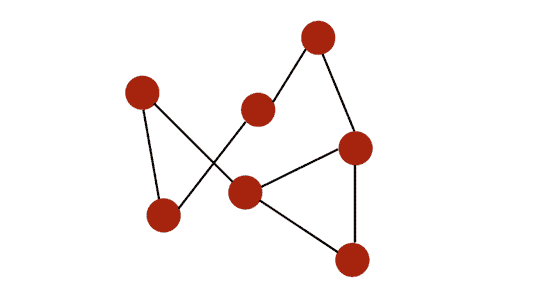
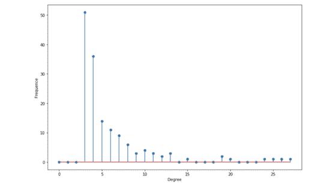

# 图论与图学习（一）：图的基本概念

> 原文：[`mp.weixin.qq.com/s?__biz=MzA3MzI4MjgzMw==&mid=2650766934&idx=5&sn=ce9064c4f720c81ee17bbc783bf4b615&chksm=871aba28b06d333e688954b4dfb0fb673da67689ec54d1271a21041e86d5a8d110db59bd7c44&scene=21#wechat_redirect`](http://mp.weixin.qq.com/s?__biz=MzA3MzI4MjgzMw==&mid=2650766934&idx=5&sn=ce9064c4f720c81ee17bbc783bf4b615&chksm=871aba28b06d333e688954b4dfb0fb673da67689ec54d1271a21041e86d5a8d110db59bd7c44&scene=21#wechat_redirect)

选自 towardsdatascience

**作者：****Maël Fabien**

**机器之心编译**

**参与：熊猫**

> 图（graph）近来正逐渐变成机器学习的一大核心领域，比如你可以通过预测潜在的连接来理解社交网络的结构、检测欺诈、理解汽车租赁服务的消费者行为或进行实时推荐。近日，数据科学家 Maël Fabien 在其博客上发布了涉及图论、图算法和图学习的系列文章《图论与图学习》。

本文是其中第一篇，介绍了图的一些基础知识并给出了 Python 示例。更多文章和对应代码可访问：https://github.com/maelfabien/Machine_Learning_Tutorials。

本文涵盖以下主题：

*   图是什么？

*   如何存储图？

*   图的类型和性质

*   Python 示例

首先进行一些准备工作，打开 Jupyter Notebook，导入以下软件包：

后面的文章会使用 networkx 最新的 2.0 版本。networkx 是一个用于复杂网络的结构、动态和功能的创建、操作和研究的 Python 软件包。

```py
import numpy as np
import random
import networkx as nx
from IPython.display import Image
import matplotlib.pyplot as plt
```

我会尽量以实用为目标，努力阐释每个概念。

**图是什么？**

> 图是互连节点的集合。

举个例子，一个简单的图可能是这样：



节点（node）用红色标出，通过黑色的边（edge）连接。

图可用于表示：

*   社交网络

*   网页

*   生物网络

*   …

我们可以在图上执行怎样的分析？

*   研究拓扑结构和连接性

*   群体检测

*   识别中心节点

*   预测缺失的节点

*   预测缺失的边

*   …

过几分钟你就能明白所有这些概念。

我们首先在我们的笔记本中导入第一个预构建的图：

```py
# Load the graph
G_karate = nx.karate_club_graph()
# Find key-values for the graph
pos = nx.spring_layout(G_karate)
# Plot the graph
nx.draw(G_karate, cmap = plt.get_cmap('rainbow'), with_labels=True, pos=pos)
```

*空手道图*

这个「空手道」图表示什么？Wayne W. Zachary 在 1970 到 1972 年这三年中研究的一个空手道俱乐部的社交网络。该网络包含了这个空手道俱乐部的 34 个成员，成员对之间的连接表示他们在俱乐部之外也有联系。在研究期间，管理员 JohnA 与教练 Mr.Hi（化名）之间出现了冲突，导致俱乐部一分为二。一半成员围绕 Mr.Hi 形成了一个新的俱乐部，另一半则找了一个新教练或放弃了空手道。基于收集到的数据，除了其中一个成员，Zachary 正确分配了所有成员在分裂之后所进入的分组。

**图的基本表示方法**

图 G=(V, E) 由下列要素构成：

*   一组节点（也称为 verticle）V=1,…,n

*   一组边 E⊆V×V

*   边 (i,j) ∈ E 连接了节点 i 和 j

*   i 和 j 被称为相邻节点（neighbor）

*   节点的度（degree）是指相邻节点的数量

*节点、边和度的示意图*

*   如果一个图的所有节点都有 n-1 个相邻节点，则该图是完备的（complete）。也就是说所有节点都具备所有可能的连接方式。

*   从 i 到 j 的路径（path）是指从 i 到达 j 的边的序列。该路径的长度（length）等于所经过的边的数量。

*   图的直径（diameter）是指连接任意两个节点的所有最短路径中最长路径的长度。

举个例子，在这个案例中，我们可以计算出一些连接任意两个节点的最短路径。该图的直径为 3，因为没有任意两个节点之间的最短路径的长度超过 3。

*一个直径为 3 的图*

*   测地路径（geodesic path）是指两个节点之间的最短路径。

*   如果所有节点都可通过某个路径连接到彼此，则它们构成一个连通分支（connected component）。如果一个图仅有一个连通分支，则该图是连通的（connected）。

举个例子，下面是一个有两个不同连通分支的图：

*一个有两个连通分支的图*

*   如果一个图的边是有顺序的配对，则该图是有向的（directed）。i 的入度（in-degree）是指向 i 的边的数量，出度（out-degree）是远离 i 的边的数量。

*有向图*

*   如果可以回到一个给定节点，则该图是有环的（cyclic）。相对地，如果至少有一个节点无法回到，则该图就是无环的（acyclic）。

*   图可以被加权（weighted），即在节点或关系上施加权重。

*   如果一个图的边数量相比于节点数量较小，则该图是稀疏的（sparse）。相对地，如果节点之间的边非常多，则该图是密集的（dense）。

Neo4J 的关于图算法的书给出了清晰明了的总结：

*总结（来自 Neo4J Graph Book）*

我们看看如何用 Python 检索一个图的这些信息：

```py
n=34
G_karate.degree()
```

.degree() 属性会返回该图的每个节点的度（相邻节点的数量）的列表：

```py
DegreeView({0: 16, 1: 9, 2: 10, 3: 6, 4: 3, 5: 4, 6: 4, 7: 4, 8: 5, 9: 2, 10: 3, 11: 1, 12: 2, 13: 5, 14: 2, 15: 2, 16: 2, 17: 2, 18: 2, 19: 3, 20: 2, 21: 2, 22: 2, 23: 5, 24: 3, 25: 3, 26: 2, 27: 4, 28: 3, 29: 4, 30: 4, 31: 6, 32: 12, 33: 17})
```

然后，隔离度的值：

```py
# Isolate the sequence of degrees
degree_sequence = list(G_karate.degree())
```

计算边的数量，但也计算度序列的度量：

```py
nb_nodes = n
nb_arr = len(G_karate.edges())
avg_degree = np.mean(np.array(degree_sequence)[:,1])
med_degree = np.median(np.array(degree_sequence)[:,1])
max_degree = max(np.array(degree_sequence)[:,1])
min_degree = np.min(np.array(degree_sequence)[:,1])
```

最后，打印所有信息：

```py
print("Number of nodes : " + str(nb_nodes))
print("Number of edges : " + str(nb_arr))
print("Maximum degree : " + str(max_degree))
print("Minimum degree : " + str(min_degree))
print("Average degree : " + str(avg_degree))
print("Median degree : " + str(med_degree))
```

得到：

```py
Number of nodes : 34
Number of edges : 78
Maximum degree : 17
Minimum degree : 1
Average degree : 4.588235294117647
Median degree : 3.0
```

平均而言，该图中的每个人都连接了 4.6 个人。

我们可以绘出这些度的直方图：

```py
degree_freq = np.array(nx.degree_histogram(G_karate)).astype('float')
plt.figure(figsize=(12, 8))
plt.stem(degree_freq)
plt.ylabel("Frequence")
plt.xlabel("Degre")
plt.show()
```

*度的直方图*

我们后面会看到，度的直方图相当重要，可用于确定我们看到的图的种类。

**如何存储图？**

你可能会好奇我们如何存储复杂的图结构？

存储图的方式有三种，取决于你想用它做什么：

*   存储为边列表：

```py
1   2
1   3
1   4
2   3
3   4
...
```

我们存储有边连接的每一对节点的 ID。

*   使用邻接矩阵，这通常是在内存中加载的方式：

*邻接矩阵*

对于图中的每一个可能的配对，如果两个节点有边相连，则设为 1。如果该图是无向图，则 A 是对称的。

*   使用邻接列表：

```py
1 : [2,3, 4]
2 : [1,3]
3:  [2, 4]
...
```

最好的表示方式取决于用法和可用的内存。图通常可存为 .txt 文件。

图可能包含一些扩展：

*   加权的边

*   节点/边上加标签

*   加上与节点/边相关的特征向量

**图的类型**

在这一节，我们将介绍两种主要的图类型：

*   Erdos-Rényi

*   Barabasi-Albert

**Erdos-Rényi 模型**

定义

> 在 Erdos-Rényi 模型中，我们构建一个带有 n 个节点的随机图模型。这个图是通过以概率 p 独立地在节点 (i,j) 对之间画边来生成的。因此，我们有两个参数：节点数量 n 和概率 p。

*Erdos-Rényi 图*

在 Python 中，networkx 软件包有用于生成 Erdos-Rényi 图的内置函数。

```py
# Generate the graph
n = 50
p = 0.2
G_erdos = nx.erdos_renyi_graph(n,p, seed =100)
# Plot the graph
plt.figure(figsize=(12,8))
nx.draw(G_erdos, node_size=10)
```

这会得到类似于下图的结果：

*生成的图*

度分布

令 pk 为随机选取的节点的度为 k 的概率。由于图构建所使用的随机方式，这种图的度的分布是二项式的：

*二项式节点度分布*

每个节点的度数量的分布应该非常接近于均值。观察到高数量节点的概率呈指数下降。

```py
degree_freq = np.array(nx.degree_histogram(G_erdos)).astype('float')
plt.figure(figsize=(12, 8))
plt.stem(degree_freq)
plt.ylabel("Frequence")
plt.xlabel("Degree")
plt.show()
```

为了可视化该分布，我将所生成的图中的 n 增大到了 200。

*度分布*

描述性统计

*   平均度由 n×p 给出。在 p=0.2 和 n=200 时，中心在 40 左右

*   度期望由 (n−1)×p 给出

*   平均值附近的度最多

我们用 Python 来检索这些值：

```py
# Get the list of the degrees
degree_sequence_erdos = list(G_erdos.degree())

nb_nodes = n
nb_arr = len(G_erdos.edges())

avg_degree = np.mean(np.array(degree_sequence_erdos)[:,1])
med_degree = np.median(np.array(degree_sequence_erdos)[:,1])

max_degree = max(np.array(degree_sequence_erdos)[:,1])
min_degree = np.min(np.array(degree_sequence_erdos)[:,1])

esp_degree = (n-1)*p

print("Number of nodes : " + str(nb_nodes))
print("Number of edges : " + str(nb_arr))

print("Maximum degree : " + str(max_degree))
print("Minimum degree : " + str(min_degree))

print("Average degree : " + str(avg_degree))
print("Expected degree : " + str(esp_degree))
print("Median degree : " + str(med_degree))
```

会得到类似这样的结果：

```py
Number of nodes : 200
Number of edges : 3949
Maximum degree : 56
Minimum degree : 25
Average degree : 39.49
Expected degree : 39.800000000000004
Median degree : 39.5
```

这里的平均度和期望度非常接近，因为两者之间只有很小的因子。

**Barabasi-Albert 模型**

定义

在 Barabasi-Albert 模型中，我们构建一个有 n 个节点的随机图模型，其有一个优先连接（preferential attachment）分量。这种图可通过以下算法生成：

*   步骤 1：以概率 p 执行步骤 2，否则执行步骤 3

*   步骤 2：将一个新节点连接到随机均匀选取的已有节点

*   步骤 3：以与 n 个已有节点成比例的概率将这个新节点连接到这 n 个已有节点

这个图的目标是建模优先连接（preferential attachment），真实世界网络中常会观察到这一点。（注：优先连接是指根据各个个体或对象已有的量来分配某个量，这通常会进一步加大优势个体的优势。）

在 Python 中，networkx 软件包有用于生成 Barabasi-Albert 图的内置函数。

```py
# Generate the graph
n = 150
m = 3
G_barabasi = nx.barabasi_albert_graph(n,m)
# Plot the graph
plt.figure(figsize=(12,8))
nx.draw(G_barabasi, node_size=10)
```

这会得到类似下图的结果：

*Barabasi-Albert 图*

可以看到，某些节点的度显然比其它节点多很多！

度分布

令 pk 为随机选取的节点的度为 k 的概率。则这个度分布遵循幂律：

*幂律度分布*

这个分布是重尾分布。其中有很多节点的度都很小，但也有相当数量的节点有较高的度。

```py
degree_freq = np.array(nx.degree_histogram(G_barabasi)).astype('float')
plt.figure(figsize=(12, 8))
plt.stem(degree_freq)
plt.ylabel("Frequence")
plt.xlabel("Degree")
plt.show()
```

*度分布*

据说这个分布是无标度的（scale-free），平均度不能提供什么信息。

描述性统计

*   如果 α≤2，平均度为一个常量，否则就会发散。

*   最大度遵照以下顺序：

`# Get the list of the degrees
degree_sequence_erdos = list(G_erdos.degree())

nb_nodes = n
nb_arr = len(G_erdos.edges())

avg_degree = np.mean(np.array(degree_sequence_erdos)[:,1])
med_degree = np.median(np.array(degree_sequence_erdos)[:,1])

max_degree = max(np.array(degree_sequence_erdos)[:,1])
min_degree = np.min(np.array(degree_sequence_erdos)[:,1])

esp_degree = (n-1)*p

print("Number of nodes : " + str(nb_nodes))
print("Number of edges : " + str(nb_arr))

print("Maximum degree : " + str(max_degree))
print("Minimum degree : " + str(min_degree))

print("Average degree : " + str(avg_degree))
print("Expected degree : " + str(esp_degree))
print("Median degree : " + str(med_degree))`

会得到类似以下的结果：

```py
Number of nodes : 200
Number of edges : 3949
Maximum degree : 56
Minimum degree : 25
Average degree : 39.49
Expected degree : 39.800000000000004
Median degree : 39.5
```

**总结**

我们介绍了主要的图类型以及用于描述图的最基本的属性。下一篇文章我们将深入图分析/算法以及用于分析图的不同方法。图可用于：

*   实时欺诈检测

*   实时推荐

*   精简法规遵从性

*   复杂网络的管理和监控

*   身份和访问管理

*   社交应用/功能

*   …

扩展阅读：

*   *Neo4j 的图算法全面指南，Mark Needham & Amy E. Hodler：**https://go.neo4j.com/rs/710-RRC-335/images/Comprehensive-Guide-to-Graph-Algorithms-in-Neo4j-ebook-EN-US.pdf*

*   *Networkx 文档：**https://networkx.github.io/documentation/stable/*

*原文链接：https://towardsdatascience.com/introduction-to-graphs-part-1-2de6cda8c5a5*

****本文为机器之心编译，**转载请联系本公众号获得授权****。**

✄------------------------------------------------

**加入机器之心（全职记者 / 实习生）：hr@jiqizhixin.com**

**投稿或寻求报道：**content**@jiqizhixin.com**

**广告 & 商务合作：bd@jiqizhixin.com**