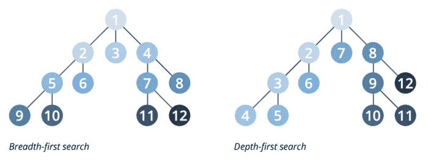
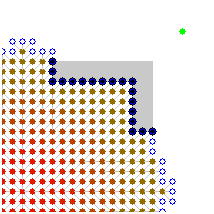
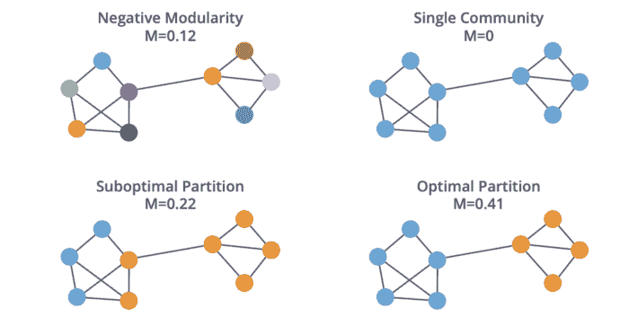
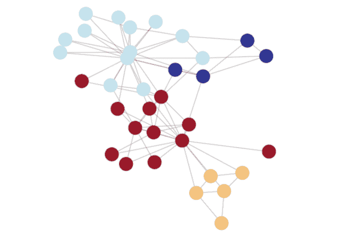
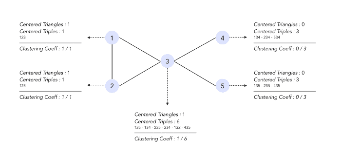
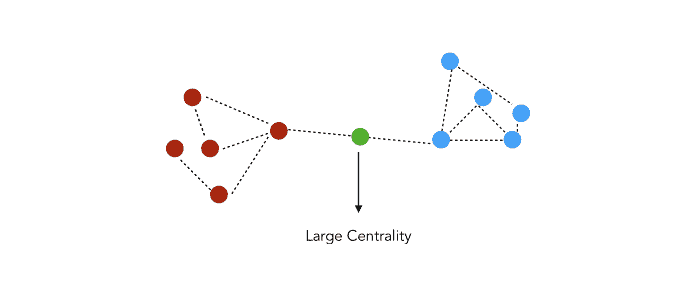
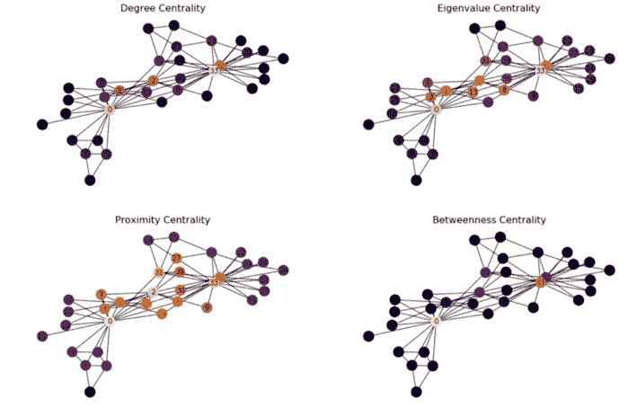

# 图论与图学习（二）：图算法

> 原文：[`mp.weixin.qq.com/s?__biz=MzA3MzI4MjgzMw==&mid=2650767177&idx=3&sn=87f938e5b04558da780d319655e3b9ce&chksm=871abb37b06d322153602abbf154666470891e9c693cda2621d805ab973b028c0359f9390de2&scene=21#wechat_redirect`](http://mp.weixin.qq.com/s?__biz=MzA3MzI4MjgzMw==&mid=2650767177&idx=3&sn=87f938e5b04558da780d319655e3b9ce&chksm=871abb37b06d322153602abbf154666470891e9c693cda2621d805ab973b028c0359f9390de2&scene=21#wechat_redirect)

选自 towardsdatascience

**作者：****Maël Fabien****机器之心编译****参与：熊猫**

> 图（graph）近来正逐渐变成机器学习的一大核心领域，比如你可以通过预测潜在的连接来理解社交网络的结构、检测欺诈、理解汽车租赁服务的消费者行为或进行实时推荐。近日，数据科学家 Maël Fabien 在其博客上发布了涉及图论、图算法和图学习的系列文章《[图论与图学习](http://mp.weixin.qq.com/s?__biz=MzA3MzI4MjgzMw==&mid=2650766934&idx=5&sn=ce9064c4f720c81ee17bbc783bf4b615&chksm=871aba28b06d333e688954b4dfb0fb673da67689ec54d1271a21041e86d5a8d110db59bd7c44&scene=21#wechat_redirect)》。

本文是其中第二篇，介绍了图算法。更多文章和对应代码可访问：https://github.com/maelfabien/Machine_Learning_Tutorials 本文涵盖以下主题：

*   主要的图算法

*   示意图和用例

*   Python 示例

首先进行一些准备工作，打开 Jupyter Notebook，导入以下软件包：

```py
import numpy as np
import random
import networkx as nx
from IPython.display import Image
import matplotlib.pyplot as plt
```

后文会使用 networkx 最新的 2.0 版本。networkx 是一个用于复杂网络的结构、动态和功能的创建、操作和研究的 Python 软件包。我会尽量以实用为目标，努力阐释每个概念。前一篇文章介绍了图的主要种类以及描述一个图的基本特性。现在我们更加详细地介绍图分析/算法以及分析图的不同方式。为了理解上下文，这里给出一些图算法的用例：

*   实时欺诈检测

*   实时推荐

*   精简法规遵从性

*   复杂网络的管理和监控

*   身份和访问管理

*   社交应用/功能

*   …

目前大多数框架（比如 Python 的 networkx 或 Neo4J）支持的图算法类别主要有三个：

*   Pathfinding（寻路）：根据可用性和质量等条件确定最优路径。我们也将搜索算法包含在这一类别中。这可用于确定最快路由或流量路由。

*   Centrality（中心性）：确定网络中节点的重要性。这可用于识别社交网络中有影响力的人或识别网络中潜在的攻击目标。

*   Community detection（社群检测）：评估群体聚类的方式。这可用于划分客户或检测欺诈等。

我们将在第三篇文章中介绍图中的机器学习和图学习。networkx 中的所有算法都可在这里找到：https://networkx.github.io/documentation/stable/reference/algorithms/index.html 我们只会介绍 networkx 中实现的最常见的基本算法。**一 寻路和图搜索算法**

*   寻路算法是通过最小化跳（hop）的数量来寻找两个节点之间的最短路径。

*   搜索算法不是给出最短路径，而是根据图的相邻情况或深度来探索图。这可用于信息检索。

**1\. 搜索算法**图搜索算法主要有两种：

*   宽度优先搜索（BFS）：首先探索每个节点的相邻节点，然后探索相邻节点的相邻节点……

*   深度优先搜索（DFS）：会尝试尽可能地深入一条路径，如有可能便访问新的相邻节点。

*搜索算法*

**2\. 寻路算法**a. 最短路径

> 最短路径计算的是一对节点之间的最短的加权（如果图有加权的话）路径。

这可用于确定最优的驾驶方向或社交网络上两个人之间的分离程度。计算图中的最短路径的方法有很多，包括 Dijkstra 算法，这是 networkx 中的默认算法。根据维基百科，该算法的伪代码如下：

*   将图中所有节点标记为未访问。创建一个所有未访问节点的集合，称为未访问集。

*   为每个节点分配一个暂定的距离值：将我们的初始节点的该值设置为零，将其它所有节点的该值设置为无穷。将初始起始节点设置为当前节点。

*   对于当前节点，考察其所有未被访问过的相邻节点并计算通过当前节点的暂定距离。比较新计算出的暂定距离与当前分配的值，配之以其中更小的值。举个例子，如果当前节点 A 标记的距离为 6，将其与相邻节点 B 连接的边的长度为 2，则通过 A 到达 B 的距离为 6+2=8。如果 B 之前被标记的距离大于 8，则将其改为 8。否则，保持其当前的值。

*   当我们考察完当前节点的所有未访问节点时，将当前节点标记为已访问，并将其移出未访问集。已访问节点不会再次进行检查。

*   如果目标节点已被标记为已访问（当规划两个特定节点之间的路由时）或未访问集中节点之间的最小暂定距离为无穷时（当规划一次完整的遍历时；当初始节点与剩余的未访问节点之间没有连接时才会出现这种情况），那么就停止操作。算法结束。

*   否则，选择标记有最小暂定距离的未访问节点，将其设置为新的「当前节点」，然后回到步骤 3。

更多有关最短路径问题的介绍请参阅：https://en.wikipedia.org/wiki/Shortest_path_problem

*维基百科上 Dijkstra 算法示意图*

该算法的 Python 实现简单直接：

```py
# Returns shortest path between each node
nx.shortest_path(G_karate)
```

这会返回图中每个节点之间的最小路径的列表：

```py
{0: {0: [0],
    1: [0, 1],
    2: [0, 2],
    ...
```

b. 单源最短路径

> 单源最短路径（Single Source Shortest Path/SSSP）是找到给定节点与图中其它所有节点之间的最短路径。

这常用于 IP 网络的路由协议。c. 所有配对最短路径

> 所有配对最短路径（All Pairs Shortest Path / APSP）算法是找到所有节点对之间的最短路径。

尽管能够提供相近的结果，但这比为每个节点对调用单源最短路径算法更快。该算法通常可用于确定交通网格的不同分区的流量负载。

```py
# Returns shortest path length between each node
list(nx.all_pairs_shortest_path_length(G_karate))
```

这会返回：

```py
(0,
    {0: 0,
    1: 1,
    2: 1,
    3: 1,
    4: 1,
    ...
```

d. 最小权重生成树

> 最小权重生成树（minimum spanning tree）是图（一个树）的一个子图，其用权重和最小的边连接了图中的所有节点。

最小生成树应该用于无向图。

```py
from networkx.algorithms import tree
mst = tree.minimum_spanning_edges(G_karate, algorithm='prim', data=False)
edgelist = list(mst)
sorted(edgelist)
```

这会返回：

```py
[(0, 1),
(0, 2),
(0, 3),
(0, 4),
(0, 5),
(0, 6),
...
```

**二 社群检测**

> 社群检测是根据给定的质量指标将节点划分为多个分组。

这通常可用于识别社交社群、客户行为或网页主题。社区是指一组相连节点的集合。但是，目前关于社群还没有广泛公认的定义，只是社群内的节点应该要密集地相连。

![*社群*

Girvan Newman 算法是一个用于发现社群的常用算法。其通过逐步移除网络内的边来定义社区。我们将居间性称为「边居间性（edge betweenness）」。这是一个正比于穿过该边的节点对之间最短路径的数量的值。该算法的步骤如下：

*   计算网络中所有已有边的居间性。

*   移除居间性最高的边。

*   移除该边后，重新计算所有边的居间性。

*   重复步骤 2 和 3，直到不再剩余边。

你可以通过 Python 使用以下代码实现它：

```py
from networkx.algorithms import communityk = 1
comp = community.girvan_newman(G_karate)for communities in itertools.islice(comp, k):
    print(tuple(sorted(c) for c in communities))
```

这会得到一个属于每个社群的节点的列表（k=1 的意思是我们期望得到 2 个社群）：

```py
([0, 1, 3, 4, 5, 6, 7, 10, 11, 12, 13, 16, 17, 19, 21], [2, 8, 9, 14, 15, 18, 20, 22, 23, 24, 25, 26, 27, 28, 29, 30, 31, 32, 33])
```

如上给出的那样，这个方法实在没法扩展。由于这个原因，Louvain 等方法已被开发出来。但是，如果要运行大规模的图，这些方法需要很长的时间。**3\. Louvain 模块性**在定义 Louvain 方法之前，需要介绍一下模块性（modularity）的概念。模块性是一个度量，衡量的是分组被划分为聚类的程度：

*模块性*

Louvain 方法的伪代码如下：

*   首先为每个节点分配一个社群

*   交替执行接下来的两个步骤，直到收敛

*   创建一个带有相邻节点的新社群，以最大化模块性

*   创建一个新的加权的图。之前步骤的社群变成图的节点。

这个现在可能看起来有些让人迷惑。事实上，我们现在唯一做的事情是将最近的节点划分为分组，以便我们优化模块性指标。

*Louvain 方法*

注意，Louvain 方法没有理论上的保证，但实践效果很好。Louvain 方法是 networkx 的一个子项目，参阅：https://python-louvain.readthedocs.io/en/latest/首先，安装软件包：

```py
pip install python-louvain
```

然后，计算最佳的划分方式（基于 Louvain 方法）：

```py
import community
partition = community.best_partition(G_karate)pos = nx.spring_layout(G_karate)
plt.figure(figsize=(8, 8))
plt.axis('off')
nx.draw_networkx_nodes(G_karate, pos, node_size=600, cmap=plt.cm.RdYlBu, node_color=list(partition.values()))
nx.draw_networkx_edges(G_karate, pos, alpha=0.3)
plt.show(G_karate)
```

*使用 Louvain 对空手道图执行的最佳划分*

**4\. 强互连的组分**

> 强互连的组分（Strongly Connected Components /SCC）算法能找到有向图中的互连节点的分组。注意，在同一个分组中，每个节点都必须从任意其它节点从两个方向都到达。

这通常用在图分析过程的早期阶段，能让我们了解图构建的方式。举个例子，这能让我们探索财务报表数据，了解谁拥有什么公司的股份。**5\. 弱互连的组分（并查集）**

> 弱互连的组分（Weakly Connected Components），也称为并查集（Union Find）算法，能找到有向图中的互连节点的集合，在同一个集合中，每个节点都可从任意其它节点到达。

这只需要节点对之间在一个方向上存在一条路径即可，而 SCC 则需要两个方向都存在路径。和 SCC 一样，并查集通常用在分析的早期阶段，以理解图的结构。并查集是一个预处理步骤，为了理解图的结构，在任何算法之前都是必需的。我们可以使用下面的方法测试相连的有向图：

```py
nx.is_weakly_connected(G)
nx.is_strongly_connected(G)
```

或使用下面的方法测试无向图：

```py
nx.is_connected(G_karate)
```

这会返回一个布尔值。一定要看看 networkx 文档中有关连接性实现的问题：https://networkx.github.io/documentation/stable/reference/algorithms/component.html**6\. 分层聚类**

> 在分层聚类（hierarchical clustering）中，我们构建聚类的层次结构。我们用树状图的形式表示聚类。

*树状图*

其思想是以不同的规模分析社群结构。我们通常自下而上构建树状图。我们从每个节点一个聚类开始，然后合并两个「最近」的节点。但我们如何衡量聚类是否相近呢？我们使用相似度距离。令 d(i,j) 为 i 和 j 之间的最短路径的长度。

*相似度距离*

要得到最大连接，在每个步骤，被最短距离分开的两个聚类被组合到一起。相似度距离可用以下示意图阐释：

*连接方式*

回到我们的空手道示例。在应用分层聚类之前，我们需要定义每个节点之间的距离矩阵。

```py
pcc_longueurs=list(nx.all_pairs_shortest_path_length(G_karate))
distances=np.zeros((n,n))# distances[i, j] is the length of the shortest path between i and j
for i in range(n):
    for j in range(n):
        distances[i, j] = pcc_longueurs[i][1][j]
```

现在，我们将使用 sklearn 的 AgglomerativeClustering 函数来确定分层聚类。

```py
from sklearn.cluster import AgglomerativeClusteringclustering = AgglomerativeClustering(n_clusters=2,linkage='average',affinity='precomputed').fit_predict(distances)
```

最后，根据聚类结果，用不同颜色绘出所得到的图：

```py
nx.draw(G_karate,  node_color = clustering)
```

*分层聚类*

**7\. 聚类系数**

> 聚类系数衡量的是两个节点倾向于聚类到一起的程度。

局部聚类系数是以节点 i 为中心的三角形的数量与以节点 i 为中心的三节点的数量的比。某种程度而言，这衡量的是节点 i 与其相邻节点接近完备图（complete graph）的程度。

*聚类系数*

我通过以下图演示了聚类系数的计算：

*聚类系数*

全局聚类系数衡量的是图中三角形（局部聚类）的密度：

*全局聚类系数*

上面的图的全局聚类系数为：


对于 Erdos-Rényi 随机图，E[Clustering Coefficient]=E[Ci]=p，其中 p 是前一篇文章中定义的概率。对于 Baràbasi-Albert 随机图，全局聚类系数根据节点的数量遵循幂律。度为 k 的节点的平均聚类系数正比于 k 的倒数：


度较低的节点连接的是它们社群中的其它节点。度较高的节点连接的是其它社群的节点。对于一个给定的图，在 networkx 中，聚类系数很容易算出。首先，我们来计算局部聚类系数：

```py
# List of local clustering coefficients
list(nx.clustering(G_barabasi).values())
```

这会得到类似下面的结果：

```py
0.13636363636363635,
0.2,
0.07602339181286549,
0.04843304843304843,
0.09,
0.055384615384615386,
0.07017543859649122,
...
```

然后平均这些结果，得到该图的全局聚类稀疏：

```py
# Global clustering coefficient
np.mean(list(nx.clustering(G_barabasi).values()))
```

这会得到：

```py
0.0965577637155059
```

**三 中心度算法**

> 中心度（Centrality）衡量的是节点的重要程度。这并非一个明晰的定义，但如果我们想要确定重要的网页、交通网络中的瓶颈……，那这就会很有用。

游走（walk）是可以多次经过同一个节点的路径。根据所考虑的游走类型和统计它们的方式，中心度度量也会各有不同。
**1\. PageRank 算法**PageRank 是根据所连接的相邻节点，然后再根据它们各自的相邻节点估计当前节点的重要性。尽管是谷歌让这种算法流行起来的，但这种方法能够用于检测任何网络中的高影响力节点。比如可用在社交网络上进行推荐。PageRank 要么是通过在相邻节点上迭代地分配节点的秩（原本是基于度）来计算，要么是通过随机遍历图并统计每次游走期间到达每个节点的频率来计算。

*Neo4J 对 PageRank 算法的总结*

PageRank 通常是在有向图上计算，但也可通过将有向图中的每条边转换成两条边而在无向图上执行。举个例子，空手道图的 PageRank 可以这样获得：

```py
nx.pagerank(G_karate, alpha=0.9)
```

其中 alpha 是阻尼参数（默认为 0.85）。这应该能返回一个排名列表：

```py
{0: 0.09923208031303203,
 1: 0.0543403155825792,
 2: 0.05919704684187155,
 3: 0.036612460562853694,
...
```

**2\. 度中心度**

> 度中心度（Degree Centrality）统计的是终止于节点 i 的长度为 1 的游走的数量。

这能够衡量传入和传出关系。这能通过 C(Xi)=di 给出。度中心度可用于识别社交网络中最有影响力的人。

```py
c_degree = nx.degree_centrality(G_karate)
c_degree = list(c_degree.values())
```

**3\. 特征向量中心度**

> 特征向量中心度（Eigenvector Centrality）是终止于节点 i 的长度为无穷的游走的数量。

这能让有很好连接相邻节点的节点有更高的重要度。

**

**特征向量中心度**

```py
*`c_eigenvector = nx.eigenvector_centrality(G_karate)
c_eigenvector = list(c_eigenvector.values())`*
```

***4\. 接近度中心度***

> *接近度中心度（Closeness Centrality）检测的是可以在图中有效传播信息的节点。*

*这可用于识别假新闻账户或恐怖分子，以便隔离能向图中其它部分传播信息的个体。*

**

*接近度中心度反比于到其它节点的最短路径长度的总和。*

```py
*`c_closeness = nx.closeness_centrality(G_karate)
c_closeness = list(c_closeness.values())`*
```

***5\. 居间性中心度***

> *居间性中心度（Betweenness Centrality）检测的是节点在图中的信息流上所具有的影响量。*

*这通常可用于发现用作从图的一部分到另一部分的桥的节点，比如用在电信网络的数据包传递处理器或假新闻传播分析中。*

** 

*其中：*

*   *σ_jk 是 j 和 k 之间的最短路径的数量*

*   *σ_jk(i) 是 j 和 k 之间的经过 i 的最短路径的数量*

*居间性中心度衡量的是一个节点用作两个节点之间的桥的次数，比如：*

**中心度度量**

```py
*`c_betweenness = nx.betweenness_centrality(G_karate)
c_betweenness = list(c_betweenness.values())`*
```

*Python 中实现依赖于 networkx 的内置函数：*

```py
*`# Plot the centrality of the nodes
plt.figure(figsize=(18, 12))# Degree Centrality
f, axarr = plt.subplots(2, 2, num=1)
plt.sca(axarr[0,0])
nx.draw(G_karate, cmap = plt.get_cmap('inferno'), node_color = c_degree, node_size=300, pos=pos, with_labels=True)
axarr[0,0].set_title('Degree Centrality', size=16)# Eigenvalue Centrality
plt.sca(axarr[0,1])
nx.draw(G_karate, cmap = plt.get_cmap('inferno'), node_color = c_eigenvector, node_size=300, pos=pos, with_labels=True)
axarr[0,1].set_title('Eigenvalue Centrality', size=16)# Proximity Centrality
plt.sca(axarr[1,0])
nx.draw(G_karate, cmap = plt.get_cmap('inferno'), node_color = c_closeness, node_size=300, pos=pos, with_labels=True)
axarr[1,0].set_title('Proximity Centrality', size=16)# Betweenness Centrality
plt.sca(axarr[1,1])
nx.draw(G_karate, cmap = plt.get_cmap('inferno'), node_color = c_betweenness, node_size=300, pos=pos, with_labels=True)
axarr[1,1].set_title('Betweenness Centrality', size=16)`*
```

**不同的中心度度量**

*可以观察到，不同的中心度度量关注的节点也不同。比如，居间性中心度得到的结果与其它方法的结果非常不同，因为它们衡量的不是同一个指标。****四 总结****现在我们已经介绍了图的基础知识、图的主要类型、不同的图算法和它们使用 networkx 的 Python 实现。**下一篇文章我们将介绍图学习，这能提供预测图中节点和边的方法，从而处理缺失值或预测新的关系。**扩展阅读：*

*   *Neo4j 的图算法全面指南，Mark Needham & Amy E. Hodler：https://go.neo4j.com/rs/710-RRC-335/images/Comprehensive-Guide-to-Graph-Algorithms-in-Neo4j-ebook-EN-US.pdf*

*   *Networkx 文档：https://networkx.github.io/documentation/stable/*

**原文链接：https://towardsdatascience.com/graph-algorithms-part-2-dce0b2734a1d**

*********本****文为机器之心编译，**转载请联系本公众号获得授权****。*** 

*✄------------------------------------------------*

***加入机器之心（全职记者 / 实习生）：hr@jiqizhixin.com***

***投稿或寻求报道：**content**@jiqizhixin.com***

***广告 & 商务合作：bd@jiqizhixin.com***