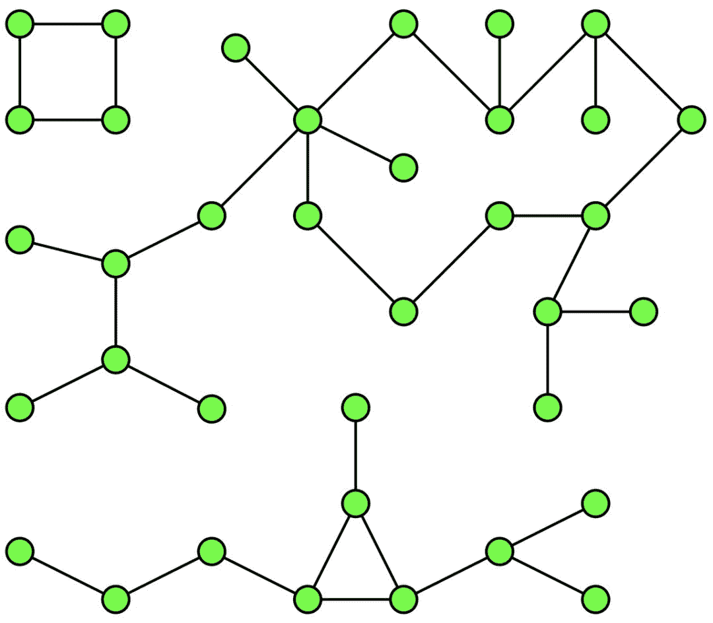
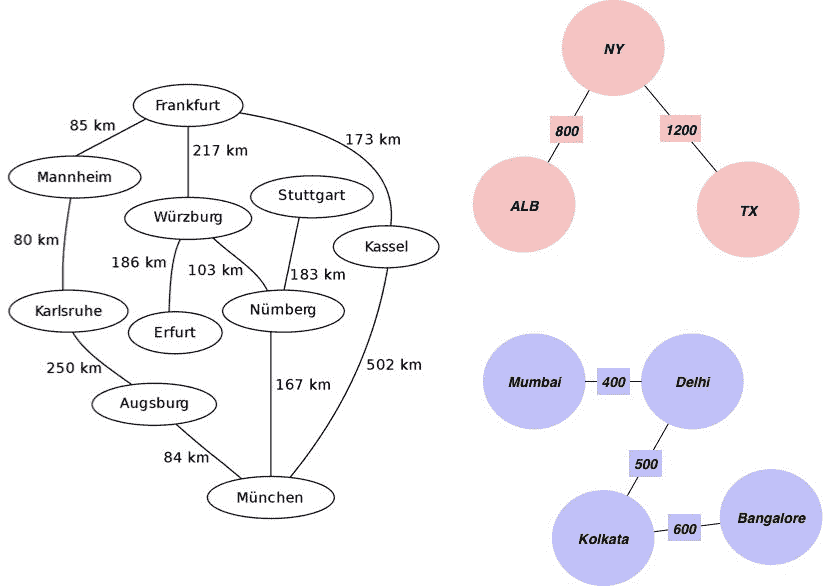
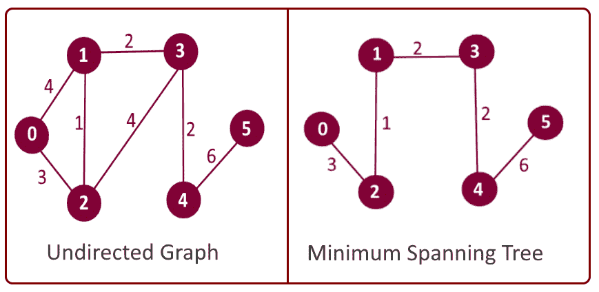
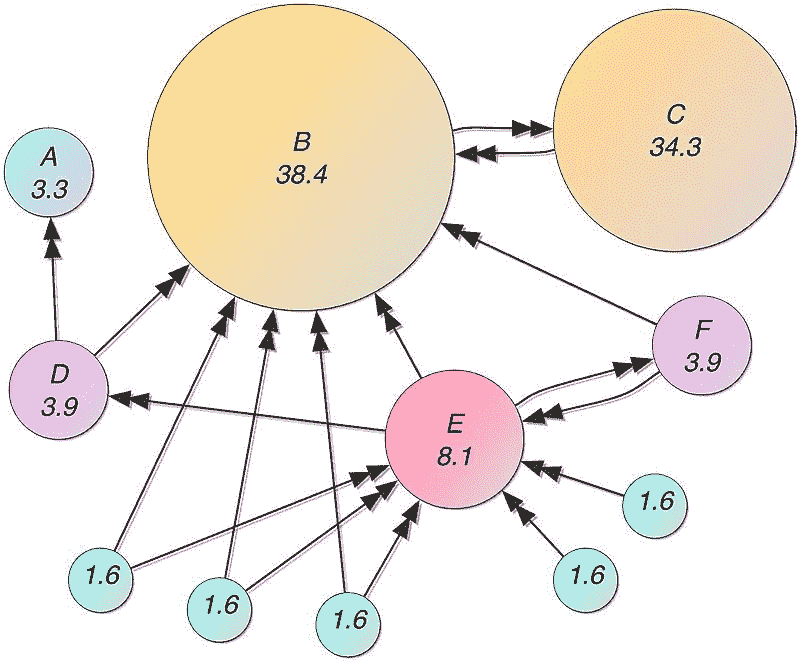
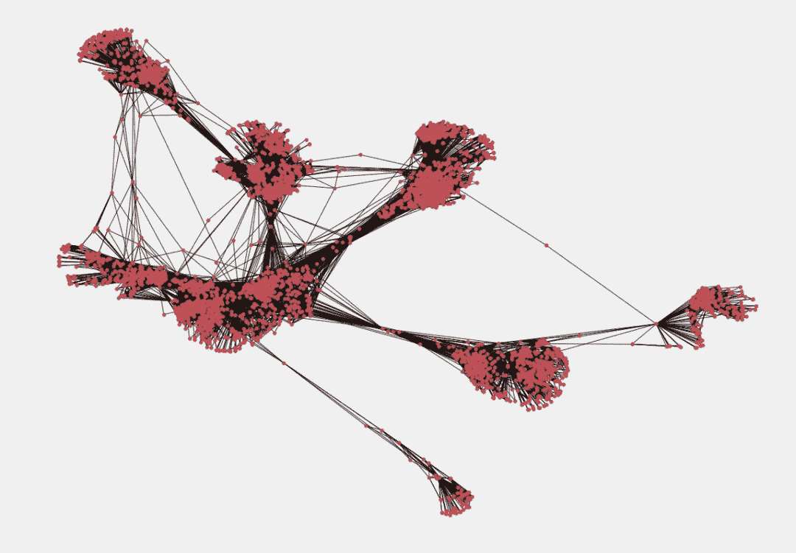
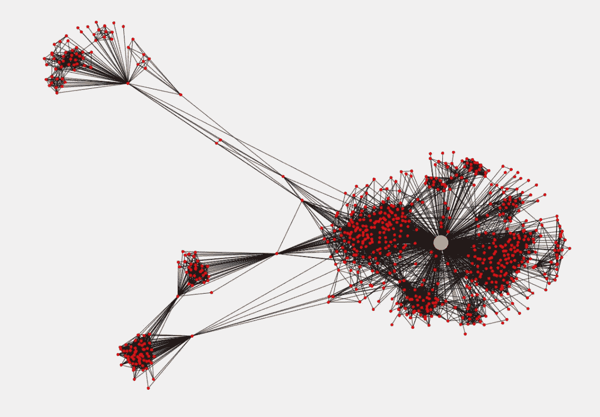
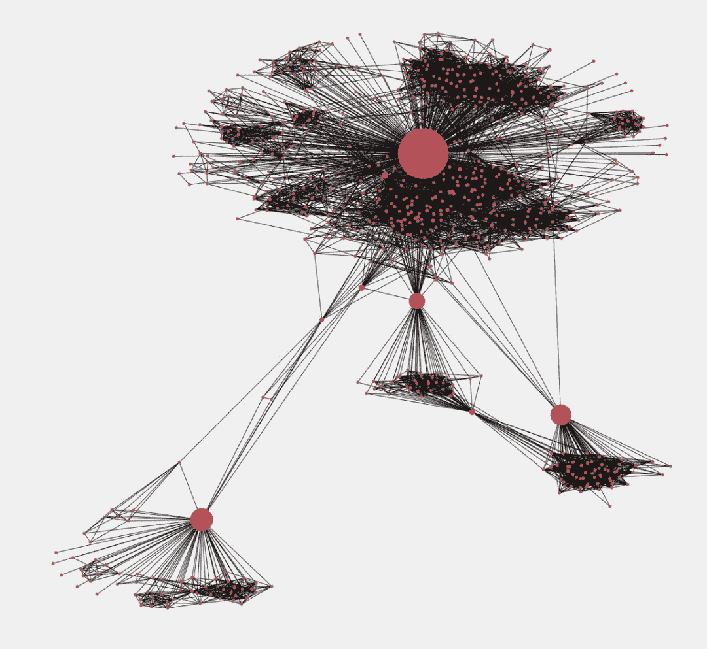

# PageRank、最小生成树：ML 开发者应该了解的五种图算法

> 原文：[`mp.weixin.qq.com/s?__biz=MzA3MzI4MjgzMw==&mid=2650769640&idx=3&sn=3f6729e3d073d319fa9ab3c6becad5a8&chksm=871a4c96b06dc58038ee5ccbbb50cc0cc0be0334736094456cf72389cfac269ccb27b73128ff&scene=21#wechat_redirect`](http://mp.weixin.qq.com/s?__biz=MzA3MzI4MjgzMw==&mid=2650769640&idx=3&sn=3f6729e3d073d319fa9ab3c6becad5a8&chksm=871a4c96b06dc58038ee5ccbbb50cc0cc0be0334736094456cf72389cfac269ccb27b73128ff&scene=21#wechat_redirect)

选自 Medium

**作者：****Rahul Agarwal**

**机器之心编译**

**参与：高璇、杜伟**

> 作为数据科学家，我们已经对 Pandas 或 SQL 等关系数据库非常熟悉了。我们习惯于将用户属性以列的形式展示在行中。但现实世界的数据果真如此吗？

在互联世界中，用户不能被视为独立的实体。他们之间存在一定的关系，我们有时希望在构建机器学习模型时考虑到这些关系。

在关系数据库中，我们无法在不同的行（用户）之间利用这种关系，但在图数据库中，这样做非常简单。

在这篇文章中，我们将讨论一些数据科学家应该了解的非常重要的图算法，以及如何使用 Python 实现它们。

**连接组件**



我们都知道聚类的工作机制，你可以将连接组件视为一种在关联/连接数据中查找集群/个体的硬聚类算法。

举个例子：假设你有连接世界上任何两个城市道路的数据。现在你需要找出世界上所有大洲以及它们所包含的城市。

你将如何实现这一目标呢？

我们采用的连接组件算法是基于广度优先搜索算法（Breadth First Search，BFS）/深度优先搜索算法（Depth First Search，DFS）的特殊情况。这里不再展开介绍工作原理，我们只看一下如何使用 Networkx 启动和运行此代码。

**应用**

从零售角度看：假设我们有很多客户使用大量账户。使用连接组件算法的一种方法是在这个数据集中找出不同的族。

我们可以根据相同的信用卡使用情况、相同地址、相同手机号码来建立某些客户 ID 之间的连接。一旦有这些连接，我们就可以运行连接组件算法为有连接的客户创建单个集群，然后为其分配一个家庭 ID。

然后，我们可以利用这些家庭 ID，根据家庭需求提供个性化推荐。我们还可以利用家庭 ID，通过创建基于家庭的分组功能来推进分类算法。

从金融角度：另一个用例是利用这些家庭 ID 抓捕诈骗犯。如果某个帐户有过被欺诈经历，那么关联帐户很容易再次受到欺诈。

实施的可能性仅仅受到自身想象力的限制。（想象力越丰富，算法的应用越广泛。）

**代码**

我们将使用 Python 中的 Networkx 模块来创建和分析图。下面以包含城市和城市间距离信息的图为例，实现我们的目的。



*带有随机距离的图*

首先创建一个带有城市名（边）和距离信息的列表，距离代表边的权重。

```py
edgelist = [['Mannheim', 'Frankfurt', 85], ['Mannheim', 'Karlsruhe', 80], ['Erfurt', 'Wurzburg', 186], ['Munchen', 'Numberg', 167], ['Munchen', 'Augsburg', 84], ['Munchen', 'Kassel', 502], ['Numberg', 'Stuttgart', 183], ['Numberg', 'Wurzburg', 103], ['Numberg', 'Munchen', 167], ['Stuttgart', 'Numberg', 183], ['Augsburg', 'Munchen', 84], ['Augsburg', 'Karlsruhe', 250], ['Kassel', 'Munchen', 502], ['Kassel', 'Frankfurt', 173], ['Frankfurt', 'Mannheim', 85], ['Frankfurt', 'Wurzburg', 217], ['Frankfurt', 'Kassel', 173], ['Wurzburg', 'Numberg', 103], ['Wurzburg', 'Erfurt', 186], ['Wurzburg', 'Frankfurt', 217], ['Karlsruhe', 'Mannheim', 80], ['Karlsruhe', 'Augsburg', 250],["Mumbai", "Delhi",400],["Delhi", "Kolkata",500],["Kolkata", "Bangalore",600],["TX", "NY",1200],["ALB", "NY",800]] 
```

让我们使用 Networkx 创建一个图:

```py
g = nx.Graph()
for edge in edgelist:
    g.add_edge(edge[0],edge[1], weight = edge[2]) 
```

现在我们想从这张图中找出不同的大洲及其城市，这可以使用连接组件算法来实现：

```py
for i, x in enumerate(nx.connected_components(g)):
    print("cc"+str(i)+":",x)
------------------------------------------------------------
cc0: {'Frankfurt', 'Kassel', 'Munchen', 'Numberg', 'Erfurt', 'Stuttgart', 'Karlsruhe', 'Wurzburg', 'Mannheim', 'Augsburg'}
cc1: {'Kolkata', 'Bangalore', 'Mumbai', 'Delhi'}
cc2: {'ALB', 'NY', 'TX'} 
```

如你所见，只需要利用顶点和边，我们就能够在数据中找到不同的组件。该算法可以在不同的数据上运行，从而满足上面提到的各种用例。

**最短路径**

继续使用上述示例，现在我们有德国城市及城市之间距离的图。如何找到从法兰克福（起始节点）到慕尼黑的最短距离？我们用来解决此问题的算法被称为 Dijkstra。用 Dijkstra 自己的话说：

> 从鹿特丹到格罗宁根旅行的最短路线是什么？这就是最短路径算法，我花了大约 20 分钟设计了它。一天早上，我和我的未婚妻在阿姆斯特丹购物，累了，我们便坐在咖啡馆的露台上喝咖啡，我只想着能否实现最短路径算法，然后我成功了。

> 正如我所说，这是一个二十分钟的发明。事实上，它发表于 1959 年，现在来看它的可读性也非常高。它之所以如此美妙，其中一个原因就是我没用笔纸就设计了它。后来我才知道，没有笔纸设计的有点之一是你不得不避免所有可避免的复杂问题。最终，令我惊讶的是，这个算法成为我的著名成果之一。

**应用**

Dijkstra 算法的变体在 Google 地图中有着广泛使用，用于寻找最短路线。

假设你有沃尔玛商店中各个过道位置和过道之间距离的数据。您希望为从 A 到 D 的顾客提供最短路径。


你已经看到 LinkedIn 显示一级连接和二级连接的方式。而这背后的机制是什么呢？


**代码**

```py
print(nx.shortest_path(g, 'Stuttgart','Frankfurt',weight='weight'))
print(nx.shortest_path_length(g, 'Stuttgart','Frankfurt',weight='weight'))
--------------------------------------------------------
['Stuttgart', 'Numberg', 'Wurzburg', 'Frankfurt']
503 
```

你也可以找到所有对之间的最短路径：

```py
for x in nx.all_pairs_dijkstra_path(g,weight='weight'):
    print(x)
--------------------------------------------------------
('Mannheim', {'Mannheim': ['Mannheim'], 'Frankfurt': ['Mannheim', 'Frankfurt'], 'Karlsruhe': ['Mannheim', 'Karlsruhe'], 'Augsburg': ['Mannheim', 'Karlsruhe', 'Augsburg'], 'Kassel': ['Mannheim', 'Frankfurt', 'Kassel'], 'Wurzburg': ['Mannheim', 'Frankfurt', 'Wurzburg'], 'Munchen': ['Mannheim', 'Karlsruhe', 'Augsburg', 'Munchen'], 'Erfurt': ['Mannheim', 'Frankfurt', 'Wurzburg', 'Erfurt'], 'Numberg': ['Mannheim', 'Frankfurt', 'Wurzburg', 'Numberg'], 'Stuttgart': ['Mannheim', 'Frankfurt', 'Wurzburg', 'Numberg', 'Stuttgart']})
('Frankfurt', {'Frankfurt': ['Frankfurt'], 'Mannheim': ['Frankfurt', 'Mannheim'], 'Kassel': ['Frankfurt', 'Kassel'], 'Wurzburg': ['Frankfurt', 'Wurzburg'], 'Karlsruhe': ['Frankfurt', 'Mannheim', 'Karlsruhe'], 'Augsburg': ['Frankfurt', 'Mannheim', 'Karlsruhe', 'Augsburg'], 'Munchen': ['Frankfurt', 'Wurzburg', 'Numberg', 'Munchen'], 'Erfurt': ['Frankfurt', 'Wurzburg', 'Erfurt'], 'Numberg': ['Frankfurt', 'Wurzburg', 'Numberg'], 'Stuttgart': ['Frankfurt', 'Wurzburg', 'Numberg', 'Stuttgart']})
.... 
```

**最小生成树（Minimum Spanning Tree，MST）**

现在我们面临另一个问题。假设我们在水管铺设公司或电线公司工作。我们需要使用最少的电线/管道来连接图中所有城市。我们如何做到这一点？



*左：**无向图；**右：**对应 MST*

**应用**

*   最小生成树在网络设计中有直接应用，包括计算机网络、电信网络、交通网络、供水网络和电网（最初是为它们发明的）。

*   MST 用于近似旅行商问题。

*   聚类：首先构建 MST，然后使用类间距离和类内距离确定阈值，用于打破 MST 中某些边。

*   图像分割：首先在图上构建 MST，其中像素是节点，像素之间的距离基于某种相似性度量（颜色、强度等）

**代码**

```py
# nx.minimum_spanning_tree(g) returns a instance of type graph
nx.draw_networkx(*nx.minimum_spanning_tree*(g)) 
```


*左：**无向图；**右：**对应 MST.*

**Pagerank**



上图为谷歌提供长期支持的页面排序算法（page sorting algorithm）。它根据输入和输出链接的数量和质量为页面打分。

**应用**

Pagerank 可用于任何我们想要估算网络节点重要性的地方。

*   它已被用于查找影响力最高的论文；

*   它已被 Google 用于网页排名；

*   它可用于将推文-用户和推文排序为节点。如果用户 A 跟帖用户 B，则在用户之间创建链接；如果用户发推/转推，则在用户和推文之间建立链接；

*   推荐引擎。

**代码**

在本次练习中，我们将使用 Facebook 数据。我们在 facebook 用户之间有一个边/链接文件。首先通过以下方法创建 Facebook 图：

```py
# reading the dataset
fb = nx.read_edgelist('../input/facebook-combined.txt', create_using = nx.Graph(), nodetype = int) 
```

它是这样的：

```py
pos = nx.spring_layout(fb)

import warnings

warnings.filterwarnings('ignore')
plt.style.use('fivethirtyeight')
plt.rcParams['figure.figsize'] = (20, 15)
plt.axis('off')
nx.draw_networkx(fb, pos, with_labels = False, node_size = 35)
plt.show() 
```



*Facebook 用户图*

现在我们想要找出具有高影响力的用户。直观地说，Pagerank 算法会给拥有很多朋友的用户打高分，而这些朋友又拥有很多 Facebook 朋友。

```py
pageranks = nx.pagerank(fb)
print(pageranks)
------------------------------------------------------
{0: 0.006289602618466542,
 1: 0.00023590202311540972,
 2: 0.00020310565091694562,
 3: 0.00022552359869430617,
 4: 0.00023849264701222462,
........} 
```

利用以下代码可以得到排序的 PageRank 或最具影响力的用户：

```py
import operator

sorted_pagerank = sorted(pagerank.items(), key=operator.itemgetter(1),reverse = True)
print(sorted_pagerank)
------------------------------------------------------
[(3437, 0.007614586844749603), (107, 0.006936420955866114), (1684, 0.0063671621383068295), (0, 0.006289602618466542), (1912, 0.0038769716008844974), (348, 0.0023480969727805783), (686, 0.0022193592598000193), (3980, 0.002170323579009993), (414, 0.0018002990470702262), (698, 0.0013171153138368807), (483, 0.0012974283300616082), (3830, 0.0011844348977671688), (376, 0.0009014073664792464), (2047, 0.000841029154597401), (56, 0.0008039024292749443), (25, 0.000800412660519768), (828, 0.0007886905420662135), (322, 0.0007867992190291396),......] 
```

以上 ID 即为最有影响力的用户。最具影响力用户的子图如下所示：

```py
first_degree_connected_nodes = list(fb.neighbors(3437))
second_degree_connected_nodes = []

for x in first_degree_connected_nodes:
    second_degree_connected_nodes+=list(fb.neighbors(x))

second_degree_connected_nodes.remove(3437)
second_degree_connected_nodes = list(set(second_degree_connected_nodes))
subgraph_3437 = nx.subgraph(fb,first_degree_connected_nodes+second_degree_connected_nodes)

pos = nx.spring_layout(subgraph_3437)
node_color = ['yellow' if v == 3437 else 'red' for v in subgraph_3437]
node_size =  [1000 if v == 3437 else 35 for v in subgraph_3437]

plt.style.use('fivethirtyeight')
plt.rcParams['figure.figsize'] = (20, 15)
plt.axis('off')
nx.draw_networkx(subgraph_3437, pos, with_labels = False, node_color=node_color,node_size=node_size )
plt.show() 
```



*黄色为最具影响力用户*

**中心性度量**

你可以将许多中心性度量用作机器学习模型的特征，这里只谈其中的两个。

其他度量链接：https://networkx.github.io/documentation/networkx-1.10/reference/algorithms.centrality.html#current-flow-closeness。

介数中心性：不仅拥有众多朋友的用户很重要，将一个地理位置连接到另一个位置的用户也很重要，因为这样可以让用户看到不同地点的内容。

介数中心性量化了一个特定节点在其他两个节点之间最短路径中出现的次数。

点度中心性：它只是节点的连接数。

**代码**

以下是查找子图介数中心性的代码：

```py
pos = nx.spring_layout(subgraph_3437)

betweennessCentrality = nx.betweenness_centrality(subgraph_3437,normalized=True, endpoints=True)
node_size =  [v * 10000 for v in betweennessCentrality.values()]

plt.figure(figsize=(20,20))
nx.draw_networkx(subgraph_3437, pos=pos, with_labels=False,
                 node_size=node_size )
plt.axis('off') 
```



你可以在此处查看按介数中心性值确定大小的节点。他们可以被认为是信息传递者。打破任何具有高介数中心性的节点将会将图形分成许多部分。

*原文地址：**https://towardsdatascience.com/data-scientists-the-five-graph-algorithms-that-you-should-know-30f454fa5513*

********本****文为机器之心编译，**转载请联系本公众号获得授权****。**
✄------------------------------------------------**加入机器之心（全职记者 / 实习生）：hr@jiqizhixin.com****投稿或寻求报道：**content**@jiqizhixin.com****广告 & 商务合作：bd@jiqizhixin.com**