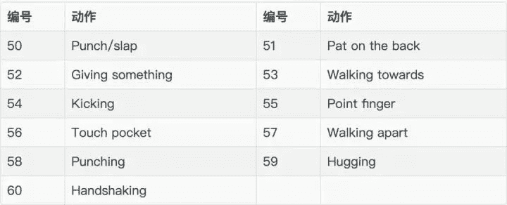
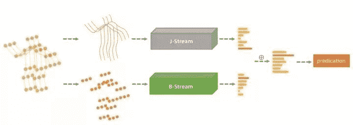

# 一文读懂：图卷积在基于骨架的动作识别中的应用

> 原文：[`mp.weixin.qq.com/s?__biz=MzA3MzI4MjgzMw==&mid=2650775733&idx=3&sn=8d0efda0dc4e3d479474676a3292046d&chksm=871a64cbb06deddd4e9d7047df2e5333291a31b52f82d17a092b97054dc2680eb1c67cb0941b&scene=21#wechat_redirect`](http://mp.weixin.qq.com/s?__biz=MzA3MzI4MjgzMw==&mid=2650775733&idx=3&sn=8d0efda0dc4e3d479474676a3292046d&chksm=871a64cbb06deddd4e9d7047df2e5333291a31b52f82d17a092b97054dc2680eb1c67cb0941b&scene=21#wechat_redirect)

机器之心发布
**作者：****张秉异**

> 基于骨架的动作识别（skeleton-based action recognition）一直是计算机视觉领域中的一个研究热点，在计算机视觉的各大顶会 AAAI、CVPR、NeurIPS 等会议中都能见到它的身影。本文将介绍图卷积在基于骨架的动作识别中的应用。

在进入正题之前，先介绍一下一些背景知识。

**什么是基于骨架的动作识别**人的骨架是什么？相信没有谁比我们自己更了解我们身体的构造了。通俗地说，人骨架框架包括六个部分——头部、左手、右手、躯干、左脚和右脚。在维基百科中有对人骨架更加精确的定义：人体骨架是人身体的内在框架。人刚出生时，体内约有 270 块骨头，成年之后体内骨头的数量减少为 206 块。

一副骨架可以抽象为两种元素组成——关节点（joint）和骨骼（bone）。关节点的作用是连接两根相邻的骨骼。因此，我们可以把骨架简化为一个由点和边所构成的图（graph）。点对应骨架中的关节点，边对应骨架中的骨骼。

把一副骨架放在三维欧几里得空间中，点的属性就是其对应的三维空间中的坐标（x,y,z），边就是三维空间中的一条线段。在动作识别中，还需要加入另一个维度——时间。人在一段时间内连续有语义的姿势（pose）变化被定义为动作。例如，招手、坐下、自拍等。在实际应用中，骨架的坐标点是通过传感器连续采样所得到的，在时间维度上是离散的。在计算机视觉领域内，基于骨架的动作识别的定义为：对一副骨架序列进行模式判别，识别这副骨架语义上所代表的执行者所表达的动作。

通常，获取骨架点的方式有两种：

1\. 一种方式是通过深度传感器，例如最有名的微软公司研发的 Kinect 传感器套件，配合 Kinect 开发的 SDK，能够每秒钟获取 30 帧骨架，同时支持采集 6 副骨架，每一副骨架采集 25 个关节点的 3D 坐标。2019 年，微软推出了新一代的 Microsoft Kinect Azure（microsoftstore.com.cn/v），首次官方支持了 Ubuntu 系统，这对开发者来说是一个好消息。此前的 kinect SDK 在 ubuntu 系统上运行需要使用开源的 libfreenect2。链接：https://github.com/OpenKinect/libfreenect22\. 第二种方式是通过图像配合骨架提取算法来从视频中获取骨架序列，但是提取到的骨架坐标是在图像中的 2 维坐标。从图像中提取骨架比较有名的开源库有 Deep pose：https://github.com/mitmul/deepposeopen pose：https://github.com/CMU-Perceptual-Computing-Lab/openpose**骨架序列的数据集**目前，在该领域内比较常用的数据集是 NTU RGB+D（rose1.ntu.edu.sg/datase）数据集。数据集用 3 个 Microsoft Kinect v2 传感器采集，含有 56880 动作序列的样本，一共包含 60 类动作，主要分为三个大类:

*   **日常动作（daily activity）**

*   医疗相关的动作

*   双人的交互行为

最近，NTU RGB+D 数据集的发布者 Rose 实验室又推出了 NTU RGB+D 数据集的增强版——NTU RGB+D 120。新的数据集中包含了 120 类动作，114480 个骨架序列的样本。而且最值得注意的是，为了增加数据的多样性，采集时摄像机的视角增加到了 155 个。想深入了解新数据集的作者可以参考文献 TPAMI 的最新文献《NTU RGB+D 120: A Large-Scale Benchmark for 3D Human Activity Understanding》。文中作者详细地介绍了新的数据集的各项特性。

地址：https://arxiv.org/abs/1905.04757

**基于骨架的动作识别中的应用****问题的数学建模**

spatial-temporal graph 中有两个维度，一个是时间（temporal）维度，一个是空间（spatial）维度。空间维度为一帧内的骨架图，时间维度的构造是将相邻帧中的图同一位置的结点连接起来，从而根据骨架序列构造出了一个 spatial-temporal graph。这种图的构造方式还在交通网络中用的比较多，来预测交通流量。构造出了骨架序列的 spatial-temporal graph（STG），很多论文中采用 graph Spatial-Temporal Networks 对骨架 STG 进行分类。下面来介绍几篇具有代表性的文章：**ST-GCN**《Spatial temporal graph convolutional networks for skeleton-based action recognition》这篇文章是发表在 AAAI 2018 会议上的一篇论文。文章中，作者首次运用 Spatial temporal graph convolutional networks 在基于骨架的动作识别的问题上。

在文章中，作者提出一种卷积的思路，首先确定一个卷积中心（也就是一个关节点）：1\. 在 spatial 维度上，取与之相邻的点，作为需要参与卷积的点；2\. 在 temporal 维度上，取前后帧在相同位置的点，作为需要参与卷积的点。确定了卷积中心和需要参与卷积的点，进行卷积，聚合时间维度和空间维度上的信息。作者在文章中给出了多种卷积的策略，有兴趣的读者可以参考原论文了解其数学模型。文章中的 ST-GCN 每一层的 ST-GCN 的特征图结构都一致，中间没有加入池化层，在最后一层卷积层之后采用了全局平均池化的策略，将每一个 channel 收缩为一个点，之后采用全连接层进行分类。作者在 github 上开源了文章的源代码：https://github.com/yysijie/st-gcn**DPRL+GCNN**

这是 CVPR 2018 中的一篇论文，作者提出了一种取关键帧的方法，类似于视频压缩中的取关键帧。因为在骨架序列中前后帧的信息可能会比较冗余，所以只需要选取序列中比较有代表性的关键帧，就可以进行动作的分类识别。所以在 GCNN 之前，作者加入了一个 FDNe t 用来提取关键帧。作者实验证明，运用了取关键帧的方法，能够增加识别的准确率。**GEGCN**在文章中，作者提出除了给图中的点做卷积之外，还可以给图中的边做卷积，这就是所说的 Graph edge convolution, 卷积方式如下图所示：

取一条边与之相邻的边作为参与卷积的边，边的属性为其在三维空间中的向量表示。据此，作者设计了一个双流的图卷积神经网络，一个是点的图卷积网络，另一个是边的图卷积神经网络：

作者通过实验证明，加入了 Graph edge convolution 能够有效增加识别的准确率。**SGR-GCN**在文章中，作者提出了一个 graph regression based GCN(GR-GCN) 网络。GR-GCN 的作用是用来学习骨架图中关节点联系的强弱程度, 如下图所示：

其中 Sparsified Spatio-Temporal Graph 为通过 graph regression 的过程所学习到的图中结点的联系，其中黑色的边代表具有生理意义上的强联系，红色的边代表非生理连接但是对于动作判断很重要的语言联系，绿色的边代表比较弱的联系。得到了 Sparsified Spatio-Temporal Graph 再进一步通过 GCN 对东西进行分类。作者在实验中证明了通过 graph regression 的过程能够很好地提高识别的准确率。

**2s-NLGCN**

最开始, 文章的标题叫做《Adaptive Spectral Graph Convolutional Networks for Skeleton-Based Action Recognition》，后来不知道什么原因，作者将文章的名字改为了《Non-Local Graph Convolutional Networks for Skeleton-Based Action Recognition》。笔者觉得可能用《Adaptive Spectral Graph Convolutional Networks for Skeleton-Based Action Recognition》这个标题会更好，因为文章中采用的是 spectral-based graph convolution networks，并且也使用了双流的网络结构，一个网络处理点（joint）的信息，另一个网络处理边 (bone) 的信息:

**总结**

总结前人的论文，我们会发现，在论文中作者往往都会思考一个问题——如何从骨架的序列图中提取信息？从维度上考虑，有时间维度和空间维度；从特征上考虑，有一次信息关节点的 3D 坐标（传感器+SDK 直接获取），有二次信息关节边的向量表示；从连接上考虑，可以学习关节点之间语义上连接的强弱（将连接设置为 learnable parameter），或者是提取骨架序列中的关键帧。笔者觉得可以从更多的角度来思考这个问题，或许能够发现新的想法，进行创新。例如：

1\. 利用新的特征

2\. GCN 中间加入 pooling 层

之前，图卷积已经将 NTU RGB+D 准确率刷得很高了，基本上算是屠榜了，准确率一点小的提升都很困难了。而新的 NTU RGB+D 120 数据集发布在即，预计一个新的分数榜将要出现，相信会有更多好的 idea 出现，将这一领域继续推进下去。如果读者有兴趣研究该领域，可以更多地关注南洋理工大学的 Rose Lab，他们是该领域数据集的发布者和算法研究的领头者。*参考文献：**1\. en.wikipedia.org/wiki/H**2\. Shahroudy A, Liu J, Ng T T, et al. NTU RGB+ D: A large scale dataset for 3D human activity analysis Proceedings of the IEEE conference on computer vision and pattern recognition. 2016: 1010-1019.**3\. Liu J, Shahroudy A, Perez M, et al. NTU RGB+ D 120: A Large-Scale Benchmark for 3D Human Activity Understanding. arXiv preprint arXiv:1905.04757, 2019.**4\. A Comprehensive Survey on Graph Neural NetworksYan**5\. S, Xiong Y, Lin D. Spatial temporal graph convolutional networks for skeleton-based action recognition Thirty-Second AAAI Conference on Artificial Intelligence. 2018.**6\. Tang Y, Tian Y, Lu J, et al. Deep progressive reinforcement learning for skeleton-based action recognition Proceedings of the IEEE Conference on Computer Vision and Pattern Recognition. 2018: 5323-5332.**7\. Zhang X, Xu C, Tian X, et al. Graph edge convolutional neural networks for skeleton based action recognition. arXiv preprint arXiv:1805.06184, 2018.**8\. Gao X, Hu W, Tang J, et al. Optimized Skeleton-based Action Recognition via Sparsified Graph Regression. arXiv preprint arXiv:1811.12013, 2018.**9\. Shi L, Zhang Y, Cheng J, et al. Non-Local Graph Convolutional Networks for Skeleton-Based Action Recognition. arXiv preprint arXiv:1805.07694, 2018.***[机器之心「SOTA 模型」](http://mp.weixin.qq.com/s?__biz=MzA3MzI4MjgzMw==&mid=2650770891&idx=1&sn=25bde35991047a997337c8dd25350089&chksm=871a49b5b06dc0a36fc3407e3643550ef97f72b007e67c4f4be250bfd60c9fdc5389624569c0&scene=21#wechat_redirect)****：****22****大领域、127 个任务，机器学习 SOTA 研究一网打尽。******

点击阅读原文，立即访问。