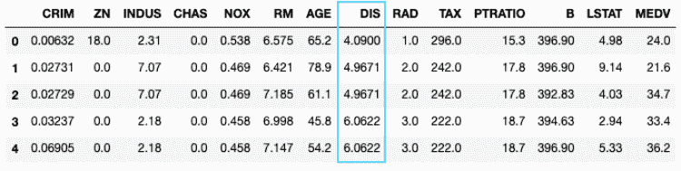
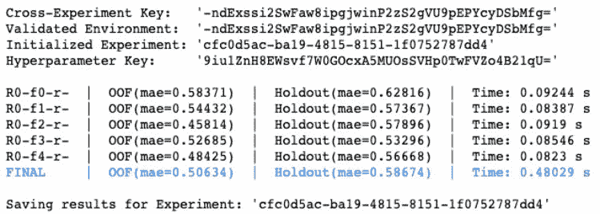
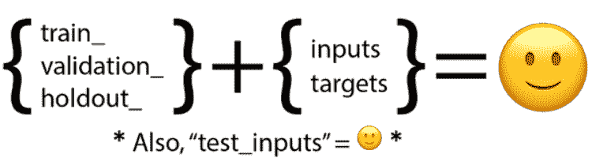
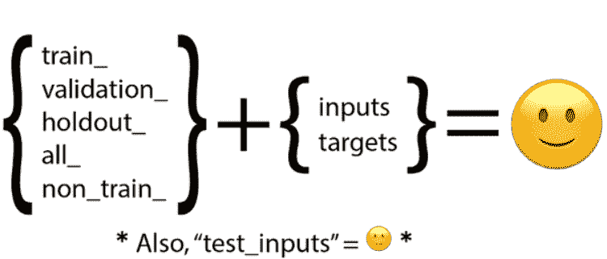
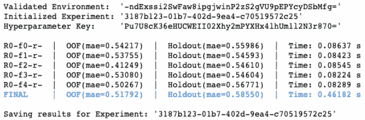
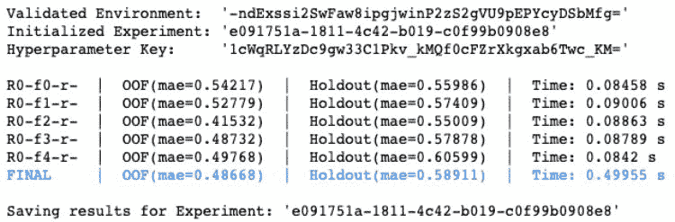
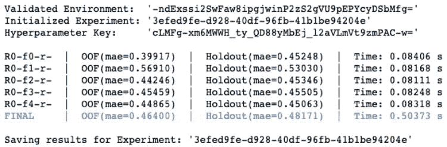
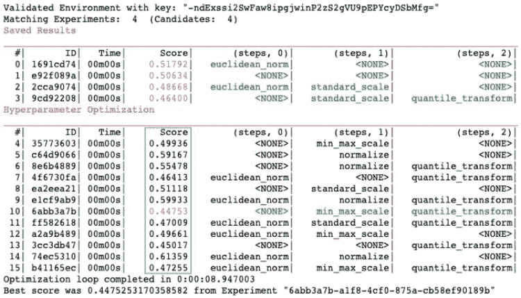
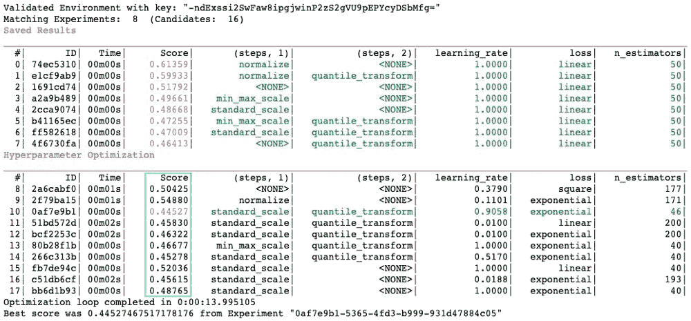
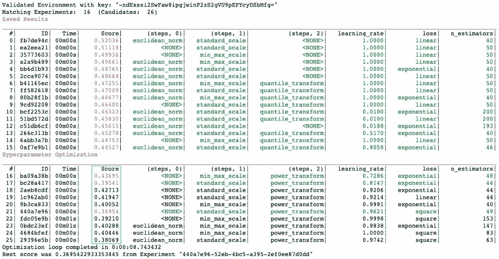

# HyperparameterHunter 3.0：一文教你学会自动化特征工程

> 原文：[`mp.weixin.qq.com/s?__biz=MzA3MzI4MjgzMw==&mid=2650768854&idx=4&sn=f5c6ba9f90e19352ededc43187014b0d&chksm=871a41a8b06dc8be6b049d8b80fae44b72de1b074da68b58b4a94cae9b79305ba3d957e889c0&scene=21#wechat_redirect`](http://mp.weixin.qq.com/s?__biz=MzA3MzI4MjgzMw==&mid=2650768854&idx=4&sn=f5c6ba9f90e19352ededc43187014b0d&chksm=871a41a8b06dc8be6b049d8b80fae44b72de1b074da68b58b4a94cae9b79305ba3d957e889c0&scene=21#wechat_redirect)

选自 TowardsDataScience

**作者：Hunter McGushion****机器之心编译****参与：**Nurhachu Null**、一鸣**

> 本文介绍了一个 GitHub 开源项目——HyperparameterHunter 3.0。开发者可以使用这一工具自动化地进行特征工程。

欢迎使用 HyperparameterHunter 3.0。Github 地址：https://github.com/HunterMcGushion/hyperparameter_hunter 这一工具可以自动保存和优化特征工程步骤以及超参数，让优化更加智能，并保证不浪费任何实验。

*把特征工程适应到超参数优化的 Pre-HyperparameterHunter demo*漫长的等待已经结束。HyperparameterHunter 3.0 (Artemis) 来了，它增加了对特征工程的支持，以下是一些新的特性。

*   使特征工程的语法清晰化、可定制的函数列表。

*   构建特征工程工作流的一致性框架，流程自动记录。

*   特征工程步骤优化，包括对过去实验的检测，以进行快速启动优化。

*   别再跟踪特征工程步骤的列表，以及它们与其他超参数一起工作的方式

**背景****什么是特征工程？**很多人对特征工程和预处理都有不同的定义，那么 HyperparameterHunter 是如何定义它的呢？「特征工程」是在模型训练之前对数据所做的任何修改——无论是在实验开始的时候所做的一次修改，还是在在每一轮交叉验证时所做的重复修改。从技术上讲，HyperparameterHunter 可以让用户自定义「特征工程」的细节。下面是「特征工程」定义下的一些可能的方法：

*   手动特征创建

*   缩放/归一化/标准化 

*   重采样 (参考我们的 imblearn 的例子)

*   目标数据转换

*   特征选择/消除

*   编码（one-hot，标签等等）

*   填补

*   二值化/合并/离散化

还有其他相关的数据操作。**为什么应该关心特征工程？******特征工程很少成为超参数优化中的一个话题。所以为什么要关系它呢？首先，特征工程是很重要的。

> 你几乎总是需要预处理你的数据。这是一个必须的步骤。

其次，特征工程和超参数调参是一样的，只不过超参数可以手动调整。在数据建模前，我们会遇到很多特征工程上的问题，比如说，应该使用 StandardScaler 还是 Normalizer？我们只能对这两者进行测试，尝试记住哪种对算法是最好的。相似的问题还有：应该使用 one-hot 来编码每周的日期吗？或者还是使用「是否是周末」的二值编码？需要考虑月份吗？年份呢？应该将十二个月转换成四季吗？闰年该怎么办？但是归根接地，开发者所用的众多特征工程中实际上只是另一种需要优化的超参数而已——但是并没有工具去优化这些「超参数』，为什么呢？这里有一个很好的理由：特征工程很难。它并不是在 0.1 到 0.7 之间挑一个数字，或者是选择使用 sigmoid 还是 ReLU 作为神经网络层的激活函数。这里讨论的是将数据处理的方式参数化，并优化一系列功能。这需要我们知道每个特征代表着什么，以及参数化后返回了什么结果——所有的这一切都是在转换宝贵的数据。现在的特征过程可能是这样的：拼凑一个脚本文件去进行所有的特征工程，然后将这个脚本拖拽到其他项目中去。对于每个不同的项目粗暴地删除或者修改需要的部分。如果这样做的话，在项目结束的时候不可能重新创建所有的实验，因为实验中应用的特征工程没有清晰的、自动的记录。此外，忽略特征工程会导致超参数优化结果不可信。确定地说，必须要有一个更好的方法，而现在，有了！**HyperparameterHunter 的方法**在介绍 HyperparameterHunter 如何自动化特征工程之前。我们首先看一下数据，然后提炼出特征工程的步骤。数据集是 SKLearn 的波士顿房价回归数据集。这个数据集具有可管理的 506 个样本，除了目标之外还有 13 个特征。数据集地址：https://scikit-learn.org/stable/datasets/index.html#boston-house-prices-dataset

**基线模型**

特征工程的目的是产生更好的模型，首先建立一个基线 CVExperiment，然后通过特征工程的方式逐渐提升模型的效果。和往常一样，首先设置环境来定义任务，以及评价结果的方法。基线 CVExperiment 地址：https://hyperparameter-hunter.readthedocs.io/en/latest/api_essentials.html#experiment-execution 我们对 5 份数据做 K 重的交叉验证，只关注在绝对误差的中间值上。此外，通过 SKLearn 的 train_test_split 函数可以从 train_dataset 提取出一个 holdout_dataset。然后使用 AdaBoostRegressor 和它的默认参数运行一个简单的 CVExperiment 模型，这样可以看到没有特征工程时的结果。**定义问题**现在已经建立了 0.51 的基线 MAE 用于 out-of-fold 预测，现在可以看一下用来超越这个基线的一些特征工程步骤。A. 创建人工特征因为人类是创造性的，我们喜欢使用特征工程做一些有趣的事情，所以可以把自定义的特征添加到输入数据中，首先，可以创建一个特征，它是由 13 个其他特征得到的欧几里得范数，或者我们可以定义ℓ2-norm！本着创新的精神，本文将欧几里得范数创新性地命名为 euclidean_normB. 输入缩放接下来要进行一下输入缩放。认真地讲，对数据进行缩放通常是一个好主意。别忘了对 train_inputs 做一下 fit_transform，但是只对的 non_train_inputs（validation/holdout data）做一下 transform，这样做是为了避免数据泄露（https://machinelearningmastery.com/data-leakage-machine-learning/）。C. 目标转换特征工程的最后一步是使用 SKLearn 的 QuantileTransformer 让目标输出均匀地分布，从而让最频繁出现的值分散开，并异常值的影响。与我们的输入缩放一样，仅仅对 train_targets 进行 fit_transform，然后只 transform 的 non_train_targets。**上手 HyperparameterHunter**好了，别再拖延。如何在 HyperparameterHunter 中完成这些吧。

> *但是，Hunter 中定义特征工程步骤的语法是如此的顺畅和合乎逻辑！我从来没想过 HyperparameterHunter 会以我早在使用的格式期待它们！真是太疯狂了！但是那又如何呢？？？**—你（也许你会这么说）*

好了，亲爱的读者，秘密的成分就是上面写到的那些函数，尤其是那些输入的参数命令。我么将这些函数叫做 EngineerStep 函数，因为每个函数都是一个工程步骤。一个 FeatureEngineer 在这里仅仅是一个 EngineerSteps 的列表或者函数。回到秘密成分上。一个 EngineerStep 函数仅仅是一个普通的函数，你可以在其中做任何你想做的数据处理。只需要在输入参数中告知想要处理的数据就行。精明的读者或许已经注意到了上面提到的 EngineerStep 函数的模式，但是为了记住合规的 EngineerStep 函数参数，这里有一个有效的公式。从第一个集合中拿一个字符串，将第二个集合中的一个字符串连接在它后面，然后你就得到了一个合规的 EngineerStep 函数参数。另一个重要的部分就是函数返回的结果。幸好这个更加容易记住。返回的是函数的新值。你还可以选择返回变换器来执行逆目标变换，就像我们上面的 quantile_transform 一样。还有两个别名来组合数据以便于处理，我们已在上面的函数中使用过这些别名了。让我们更新一下这个高度复杂和细致入微的公式，以添加额外的 EngineerStep 函数参数别名：正如新参数的名称所暗示的那样，「all_inputs」/「all_targets」为你提供了所有数据集输入/目标的大型 DataFrame。「non_train_inputs」和「non_train_targets」类似，只是它们省略了所有训练数据。每个公式下面的注释都提醒「test_inputs」没有目标对应参数，因为我们不按设计跟踪测试目标。**进一步了解**有了对如何创建特征工程步骤的新认识，现在开始在 CVExperiment 中使用特征工程吧。在 CVExperiment 中仅仅需要 feature_engineer kwarg，或者任何 OptPro 的 forge_experiment 方法。feature_engineer 可以是一个 FeatureEngineer 实例，或者是 EngineerSteps/函数的列表，就像我们上面定义过的那些一样。hyperparameter_hunter package 地址：https://hyperparameter-hunter.readthedocs.io/en/latest/source/hyperparameter_hunter.html#hyperparameter_hunter.EngineerStep**实验部分**还记得基线在 OOF 数据上达到了中位数为 0.51 的绝对误差中值吗。现在可以用一些 FeatureEngineer 增强的 CVExperiments 模型做一些测试，看看会发生什么...

让我们分析一下发生了什么。三个不同的 CVExperiment，每个都使用了不同的 FeatureEngineer，实验 #1 和基线实验的性能一样。实验 #2 稍微好一些。实验 #3 说明误差从 0.51 降到 0.46。或许现在可以说 quantile_transform 就是最好的特征工程步骤，然后就完事了。但是我们如何能够确定呢？**首先面对的是优化**在 CVExperiment 中使用 FeatureEngineer 是非常棒的。让 HyperparameterHunter 的 OptPros 来为测试特征工程步骤的不同组合甚至会有更好的效果。读者可能会担心，增加优化步骤必然会使特征工程复杂化。但是不必担心，因为仅仅需要使用 OptPros 的 forge_experiment 方法，这就像在初始化一个 CVExperiment。为了在不同 EngineerSteps 组成的空间内进行搜索，只需将这些步骤放在 Categorical 内部，像是标准的超参数优化一样。想尝试一个特别值得怀疑的 EngineerStep 时，Categorical 也有一个可选择的 kwarg。如果 optional = True（默认值= False），则搜索空间不仅包括显式给出的 Categorical，还包括完全省略当前的 EngineerStep。在做特征优化之前，需要更多的 EngineerStep 函数来做优化。也许读者希望尝试一些 standard_scale 之外的其他的缩放方法。我们可以先来先定义一下 min_max_scale 和 normalize 的相关方法。请注意，在经典的 HyperparameterHunter 中，我 OptPro 会自动发现上面的 4 个实验与我们的搜索空间是兼容的，并且将它们作为学习材料来实现快速启动优化。蓝色矩形中添加了通过 OptPro 实现的一些新实验的分数。每当 OptPros 发现一个实验具有比当前最好的结果更高的分数，它就会将这个得分标为粉红色，将它的超参数标为绿色。通过 16 次实验，OptPro 只是刚刚预热，但 quantile_transform 看起来很有希望。此外，似乎尝试一些不同的缩放器可能会得到更好的结果，毕竟我们新的最佳实验使用最近添加的 min_max_scale 方法，而不是 standard_scale。**回到源头**现在，让我们回到我们的根源。我们希望把我们新的特征优化技术和一些经典的超参数优化混合起来，因为没人愿意陷在局部最优里面。除了增加经典的超参数优化之外，让我们假装自信一些——euclidean_norm 是重要的 (尽管它实际上似乎并非如此)，通过删除包含它的 Categorical，让它变成一个必需的 EngineerStep。请注意，这个变化意味着我们的 OptPro 将会仅仅从 16 个候选实验中的 8 个已经保存的实验中学习，因为我们限制了搜索空间。quantile_transform 继续执行没有目标的转换，但是让我们在 power_transform 中添加一些真正的竞争。我们还可以通过把 BayesianOptPro 切换成 RandomForestOptPro（或者任何其他的 OptPro）来得到另一种观点。看一下我们上面的实验，貌似 normalize 并不是做得十分好，所以我们放弃它吧。实际上，让我们假设，确定想要的是 standard_scale 或者 min_max_scale，所以我们将会从这种混合中删除 normalize，并在我们的第二个 EngineerStep 中删除 optional=True 的部分。因为我们有些过于热情的决定 euclidean_norm 很重要的一件事，所以让我们再次选择第一个 EngineerStep 吧。当然，我们还需要添加 power_transform 作为我么最后一个 EngineerStep 的选择。总之，下面的 OptPro 将会修改上面的三个 EngineerSteps，作为一种改变，我们将会尝试 RandomForestOptPro。尽管改变了整个 FeatureEngineer 的空间，甚至需要一个新的 OptPro 来运行整个过程，我们还是能够从 26 个保存的候选者中识别出 16 个匹配的实验，这些实验可以用作跳跃式优化。可以说，这要比开始的时候好很多。更好的是，我们有一个新的最佳实验了，它将结果提升到了 0.37 的 MAE，没有做任何的特征工程，从基线的 0.51 上降了下来。**现在，你这只美丽的孔雀，起飞吧！**这些结果的神奇之处就是它们都会保存在你计算机本地，这意味着你可以持续使用好多天、好几星期、好几年，甚至好几代人。好了，也许这不是最后一部分。关键在于当你从这个小问题开始，朝着构建一个需要训练好多时间的模型开始的时候，你为何要满足于重新运行相同的模型呢？或者从过去的实验中攫取有价值的信息，或者手动地追踪所有这些荒谬的超参数和特征工程呢？展开你的翅膀，让 HyperparameterHunter 来处理这些烦人的琐事吧，这样你就可以不再去跟踪这一切了，可以将你的时间花在机器学习上了。*原文链接：**https://towardsdatascience.com/hyperparameter-hunter-feature-engineering-958966818b6e*********本****文为机器之心编译，**转载请联系本公众号获得授权****。**
✄------------------------------------------------**加入机器之心（全职记者 / 实习生）：hr@jiqizhixin.com****投稿或寻求报道：**content**@jiqizhixin.com****广告 & 商务合作：bd@jiqizhixin.com**