# 图解神经机器翻译中的注意力机制

> 原文：[`mp.weixin.qq.com/s?__biz=MzA3MzI4MjgzMw==&mid=2650757075&idx=4&sn=56c59e46ba4ca2c420119aadef72600f&chksm=871a93adb06d1abbf19e407c7aec5b2f342c7c788d3fee608324db456584972e32ce643c8ccc&scene=21#wechat_redirect`](http://mp.weixin.qq.com/s?__biz=MzA3MzI4MjgzMw==&mid=2650757075&idx=4&sn=56c59e46ba4ca2c420119aadef72600f&chksm=871a93adb06d1abbf19e407c7aec5b2f342c7c788d3fee608324db456584972e32ce643c8ccc&scene=21#wechat_redirect)

选自 TowardsDataScience

**作者：****Raimi Karim**

**参与：高璇、路**

> 本文用几张动图形象地解释了注意力机制，还分享了过去 5 年中出现的 4 个 NMT 架构，对文中出现的一些概念也进行了直观解释。

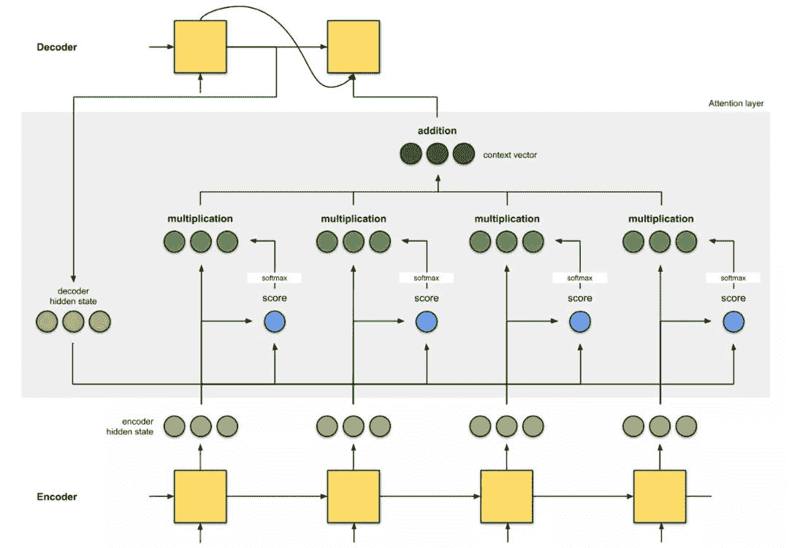

几十年来，统计机器翻译在翻译模型中一直占主导地位 [9]，直到神经机器翻译（NMT）出现。NMT 是一种新兴的机器翻译方法，它试图构建和训练单个大型神经网络，该网络读取输入文本并输出译文 [1]。

NMT 的最初开拓性研究来自 Kalchbrenner 和 Blunsom (2013)、Sutskever 等人 (2014) 和 Cho. 等人 (2014b) 这三篇论文，其中我们较为熟悉的框架是 Sutskever 等人论文提出的序列到序列（seq2seq）学习。本文基于 seq2seq 框架阐述如何构建注意力。

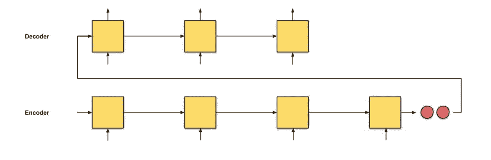

*图 0.1：seq2seq，输入序列长度为 4。*

在 seq2seq 中，初步设想是让两个循环神经网络（RNN）构成编码器-解码器架构：编码器逐个读取输入词，获得固定维度的向量表示，然后另一个 RNN（解码器）基于这些输入逐个提取输出词。

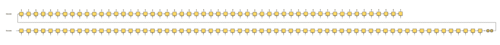*图 0.2：seq2seq，输入序列长度为 64。* 

seq2seq 的问题在于，解码器从编码器接收的唯一信息是「最后一个编码器隐藏状态」（图 0.1 中的两个红色节点），这是一种类似于输入序列数字总结的向量表示。因此，对于较长的输入文本（图 0.2），我们如果仍希望解码器仅使用这一个向量表示（希望它「充分概括输入序列」）来输出译文，那这是不合理的。这可能导致灾难性遗忘。这段话有 100 个单词，你能立刻把它翻译成另一种语言吗？

如果我们做不到，那么也不应该对解码器这么苛刻。如果向解码器提供每个编码器时间步的向量表示，而不是只有一个向量表示，是不是可以得到更优质的翻译结果？

 引入注意力机制。

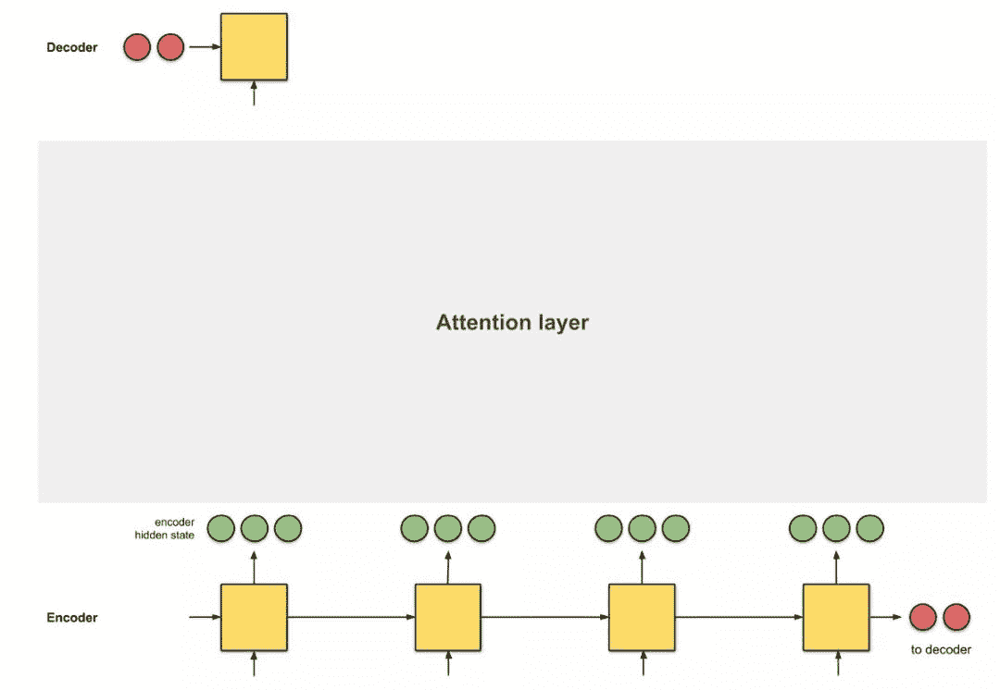

*图 0.3：引入注意力机制作为编码器和解码器之间的接口。这里，第一个解码器时间步是在给出第一个翻译单词之前从编码器接收的信息。* 

注意力是编码器和解码器之间的接口，它为解码器提供每个编码器隐藏状态的信息（图 0.3 中的红色隐藏状态除外）。通过此设置，模型能够有选择地侧重输入序列的有用部分，从而学习它们之间的 alignment。这有助于模型有效地处理输入长句 [9]。

alignment 定义：alignment 意为将原始文本片段与其对应的译文片段匹配。

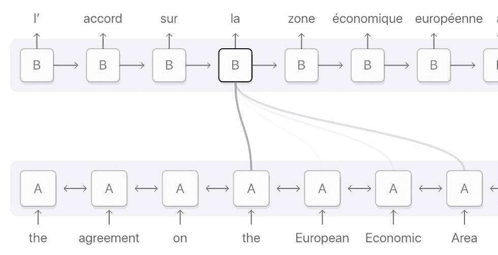*图 0.4：法语单词「la」的 alignment 分布在输入序列中，但主要分布在这四个词上：『the』、『European』、『Economic』 和 『Area』。深紫色表示注意力得分更高。（图源：https://distill.pub/2016/augmented-rnns/#attentional-interfaces）*

[2] 中有两种类型的注意力机制。使用所有编码器隐藏状态的注意力类型也称为全局注意力。而局部注意力仅使用编码器隐藏状态的子集。本文主要介绍全局注意力，因此本文中对「注意力」的任何引用都是指「全局注意力」。

本文阐述注意力机制时应用了动画形式，以便我们在不理解数学公式的情况下也能更好地理解它们。在案例中，作者将分享在过去 5 年中出现的 4 个 NMT 架构，也将对这篇文章中的一些概念做一些直观解释。

**1\. 注意力概述**

在了解注意力之前，请先了解使用 seq2seq 模型的翻译任务背后的原理。

> seq2seq 原理：翻译器从头到尾读取德语文本。读取完成后，开始逐词将文本译成英文。如果句子非常长，它可能已经忘记了前文的内容。

这是一个简单的 seq2seq 模型。下文即将介绍 seq2seq+attention 模型的注意层计算步骤。以下是该模型的直观原理。

> seq2seq+attention 原理：翻译器从头到尾读取德语文本并记录关键词，之后将文本译成英文。在翻译每个德语单词时，翻译器会使用记录的关键词。

通过为每个单词分配分值，注意力为不同单词分配不同的注意力。然后利用 softmax 对编码器隐藏状态进行加权求和，得到上下文向量（context vector）。注意力层的实现可以分为 4 个步骤。

第 0 步：准备隐藏状态。

首先准备第一个解码器隐藏状态（红色）和所有可用的编码器隐藏状态（绿色）。示例中有 4 个编码器隐藏状态和当前解码器隐藏状态。

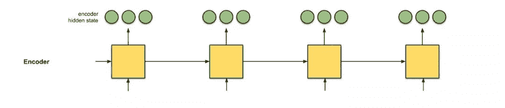

*图 1.0：为注意力做好准备。* 

第 1 步：获取每个编码器隐藏状态的分数。

分数（标量）通过评分函数（也称为 alignment 评分函数 [2] 或 alignment 模型 [1]）。在该示例中，评分函数是解码器和编码器隐藏状态之间的点积。

有关各种评分函数，请参阅附录 A。

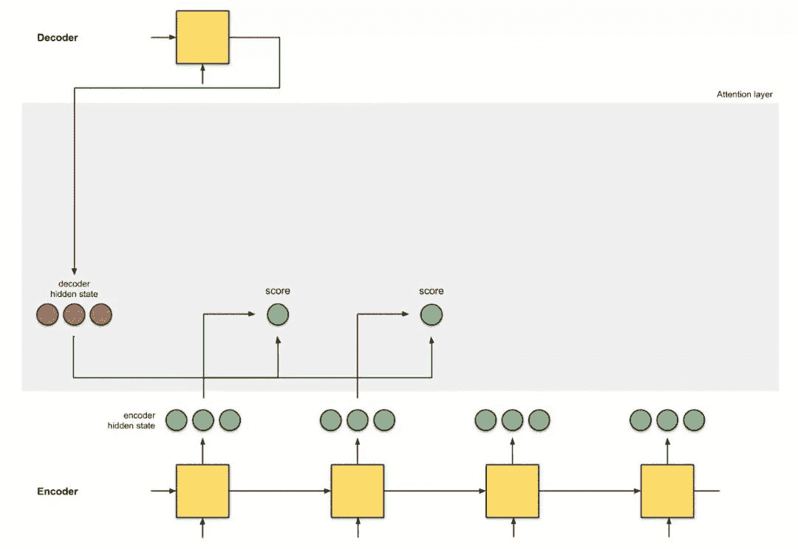

*图 1.1：获得分数。*

```py
*decoder_hidden *= [10, 5, 10]
*encoder_hidden  score*
---------------------
     [0, 1, 1]     15 (= 10×0 + 5×1 + 10×1, the dot product)
     [5, 0, 1]     60
     [1, 1, 0]     15
     [0, 5, 1]     35
```

在上面的示例中，我们获得了编码器隐藏状态 [5,0,1] 的高注意力分数 60。这意味着要翻译的下一个词将极大地受到此编码器隐藏状态的影响。

第 2 步：通过 softmax 层运行所有分数。

我们将得分放到 softmax 层，softmaxed 得分（标量）和为 1。这些 softmax 得分代表注意力分布 [3, 10]。

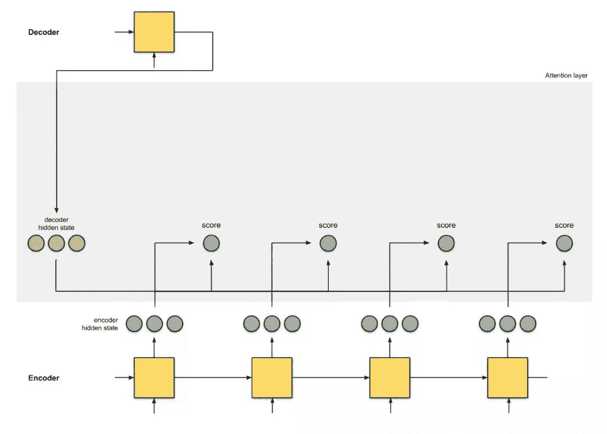

*图 1.2：获得 softmax 得分。*

```py
*encoder_hidden  score  score^*
-----------------------------
     [0, 1, 1]     15       0
     [5, 0, 1]     60       1
     [1, 1, 0]     15       0
     [0, 5, 1]     35       0
```

请注意，基于 softmax 得分 score^，注意力的分布按照预期应在 [5, 0, 1] 上。实际上，这些数字不是二进制的，而是 0 到 1 之间的浮点数。

第 3 步：通过 softmax 得分将每个编码器隐藏状态相乘。

通过将每个编码器隐藏状态与其 softmax 得分（标量）相乘，获得 alignment 向量 [2] 或标注向量 [1]。这正是 alignment 的发生机制。

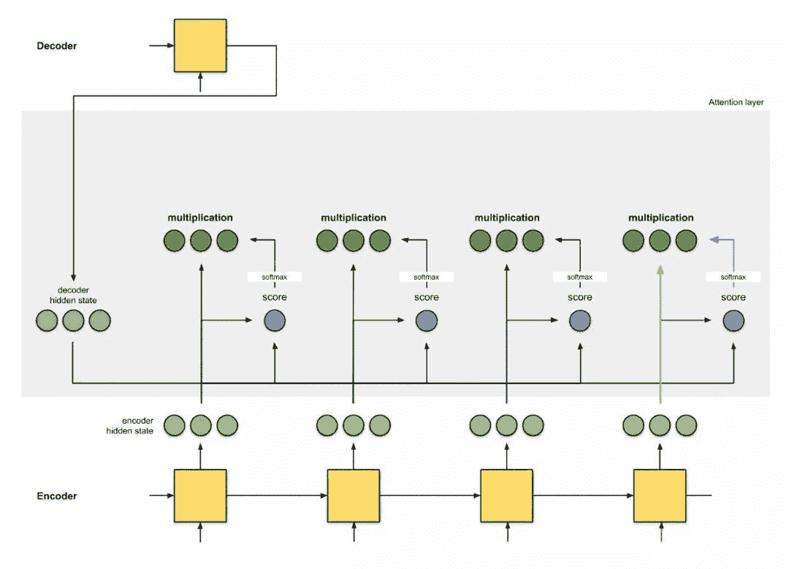

*图 1.3：获得 alignment 向量。*

```py
*encoder_hidden  score  score^  alignment*
----------------------------------------
     [0, 1, 1]     15       0  [0, 0, 0]
     [5, 0, 1]     60       1  [5, 0, 1]
     [1, 1, 0]     15       0  [0, 0, 0]
     [0, 5, 1]     35       0  [0, 0, 0]
```

这里，我们看到除了 [5, 0, 1] 之外的所有编码器隐藏状态的 alignment 由于注意力分数低而减少到 0。这意味着第一个翻译的单词应该与嵌入 [5, 0, 1] 的输入单词匹配。

第 4 步：对 alignment 向量求和。

将 alignment 向量相加，生成上下文向量 [1,2]。上下文向量是前一步 alignment 向量的集合信息。

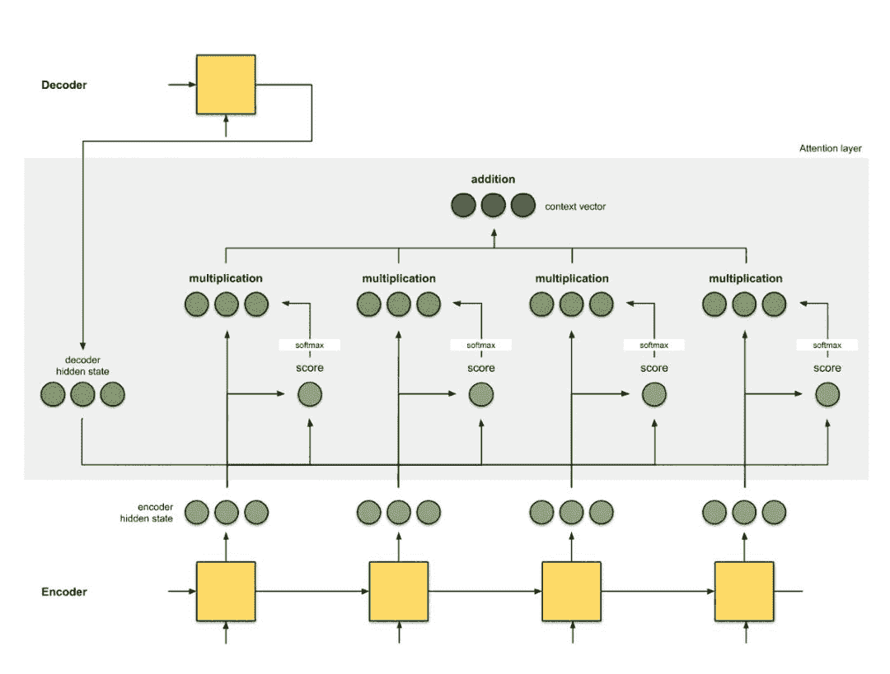*图 1.4：获得上下文向量。*

```py
*encoder_hidden  score  score^  alignment*
----------------------------------------
     [0, 1, 1]     15       0  [0, 0, 0]
     [5, 0, 1]     60       1  [5, 0, 1]
     [1, 1, 0]     15       0  [0, 0, 0]
     [0, 5, 1]     35       0  [0, 0, 0]
*context *= [0+5+0+0, 0+0+0+0, 0+1+0+0] = [5, 0, 1]
```

第 5 步：将上下文向量输入解码器

方式取决于架构设计。稍后将在 2a、2b 和 2c 节的示例中看到不同架构如何在解码器中利用上下文向量。

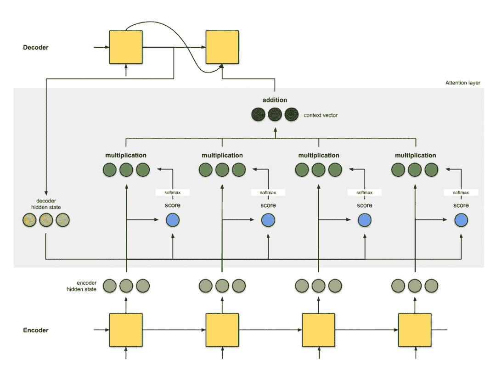*图 1.5：将上下文向量输入解码器。* 

至此，所有步骤结束。动画示例如图：

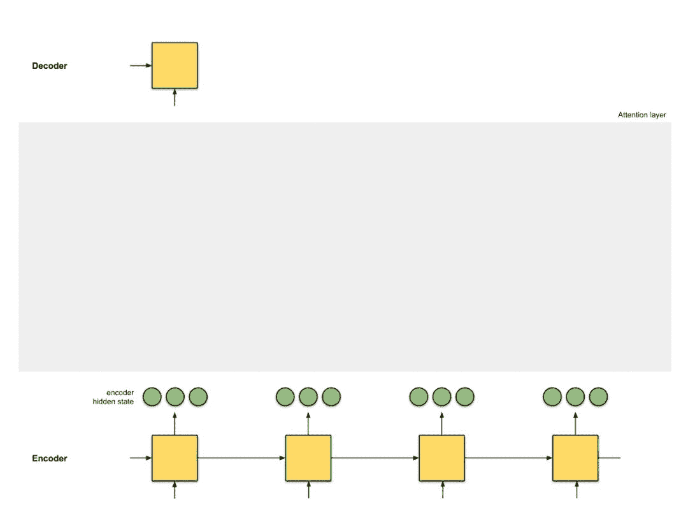*图 1.6：注意力机制*

> 注意力机制是如何运行的？

回答：反向传播，没错，就是反向传播！反向传播将尽一切努力确保输出与真值相同。这是通过改变 RNN 中的权重和评分函数（如果有的话）来实现的。这些权重将影响编码器隐藏状态和解码器隐藏状态，进而影响注意力得分。

**2\. 注意力示例**

在上一节中我们已经了解了 seq2seq 和 seq2seq +attention 架构。在接下来的小节中，我们将研究另外 3 个基于 seq2seq 的注意力 NMT 架构。为了完整起见，本文还附加了它们的 BLEU 值——一种评估生成句子到参考句子的评判标准。

2a. Bahdanau et.al(2015)[1]

这篇注意力实现的文章是注意力领域的开山之作。作者在《Neural Machine Translation by Learning to Jointly Align and Translate》这篇论文中使用了「align」一词，表示在训练模型时调整会直接影响得分的权重。以下是该架构的细节：

编码器是双向（前向+后向）门控循环单元（BiGRU）。解码器是 GRU，其初始隐藏状态是从反向编码器 GRU 的最后隐藏状态修正而来的向量（未在下图中示出）。

注意力层中的评分函数是 additive/concat。

下一个解码器步的输入是前一个解码器时间步（粉红色）的输出和当前时间步长（深绿色）的上下文向量间的级联。

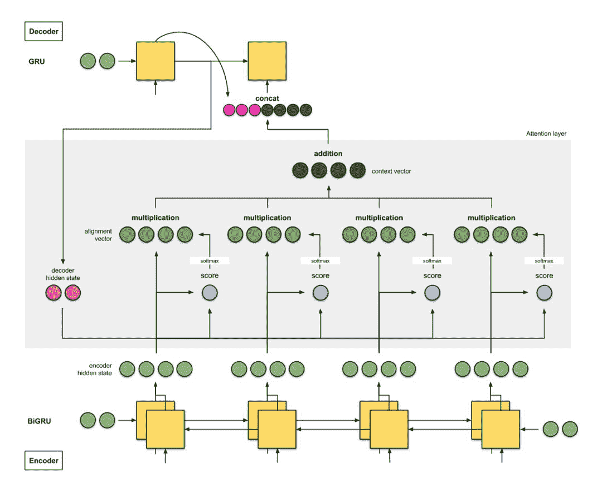*图 2a：Bahdanau et.al. 的 NMT。编码器是 BiGRU，解码器是 GRU。* 

该架构在 WMT'14 英译法数据集上获得了 26.75 的 BLEU 值。

> 带双向编码器的 seq2seq +注意力架构：

翻译器 A 在读取德语文本时记录关键词。翻译器 B（担任更高级角色，因为它能从后往前进行读取）从后往前读取相同的德语文本，同时记下关键词。两个翻译器会定时「交流」它们读取的每一个单词。在读完整篇德语文本后，翻译器 B 负责根据「交流结果」和它们共同选择的综合关键词，将德语句子逐词译成英文。

翻译器 A 是前向 RNN，翻译器 B 是后向 RNN。

2b. Luong et. al(2015)[2]

《Effective Approaches to Attention-based Neural Machine Translation》的作者简化并推广了 Bahdanau 的架构：

*   编码器是两层长短期记忆（LSTM）网络。解码器也具有相同的架构，其初始隐藏状态是最后的编码器隐藏状态。

*   他们实验所用评分函数是 (i) additive/concat，(ii) dot product，(iii) location-based 以及 (iv) 『general』。

*   将当前解码器时间步的输出与当前时间步的上下文向量之间的级联输入到前馈神经网络中，得到当前解码器时间步的最终输出（粉红色）。

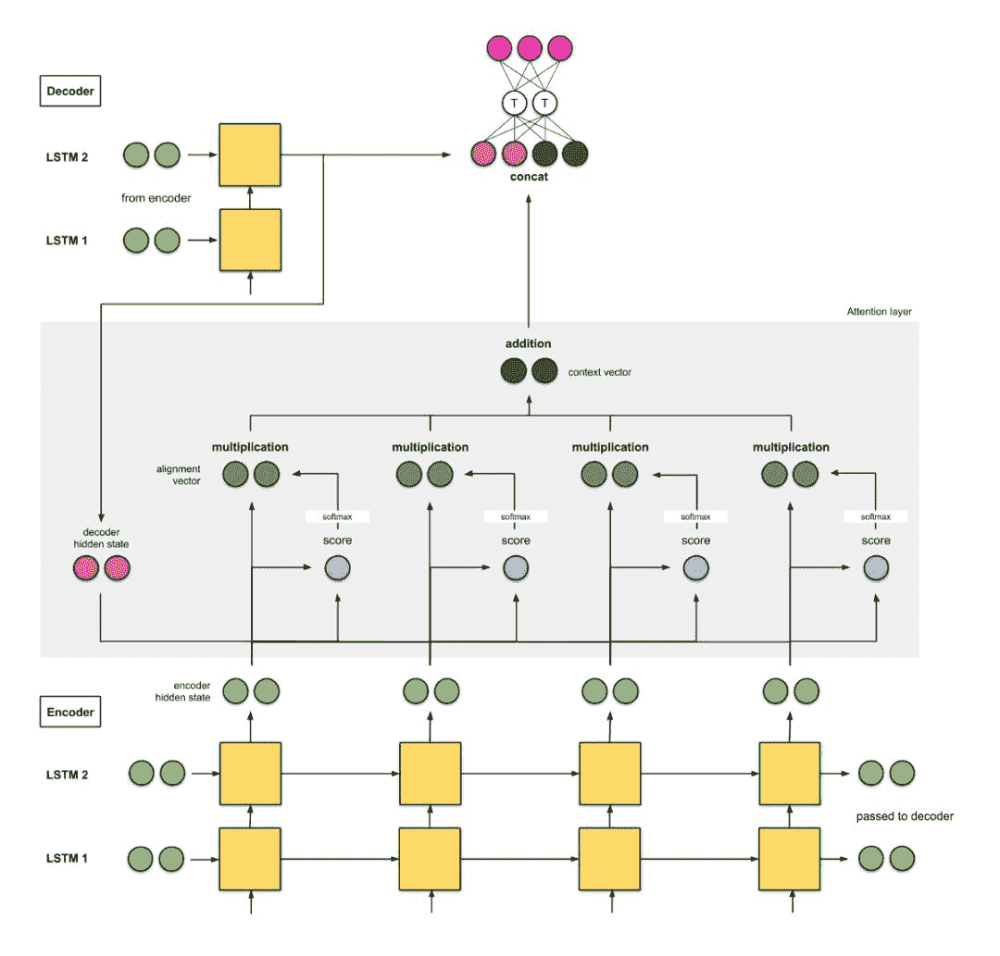*图 2b：Luong et.al. 的 NMT。编码器与解码器均为 2 层 LSTM。*

在 WMT'15 英语-德语数据集中，该模型获得了 25.9 的 BLEU 值。

> 具备 2 层堆叠编码器的 seq2seq+注意力架构：

翻译器 A 在读取德语文本时记录关键词。同样，翻译器 B（比 A 更高级）也会读取相同的德语文本，同时记下关键词。低级翻译器 A 读取每个单词时都要向翻译器 B 报告。完成阅读后，它们会根据共同选择的综合关键词，将句子逐词翻译成英文。

2c. 谷歌的神经机器翻译（GNMT）[9]

我们大多数人都或多或少使用过谷歌翻译，所以必须谈谈谷歌在 2016 年实现的 GNMT。GNMT 是前两个示例的组合（主要受到第一个示例 [1] 的启发）。

编码器由 8 个 LSTM 组成，其中第一个是双向的（其输出是级联的），连续层（从第 3 层开始）的输出之间存在残差连接。解码器是 8 个单向 LSTM 的独立堆栈。

使用的评分函数是 additive / concat，和 [1] 一样。

同样，和 [1] 一样，下一个解码器步的输入是前一个解码器时间步（粉红色）的输出和当前时间步的上下文向量（深绿色）之间的级联。

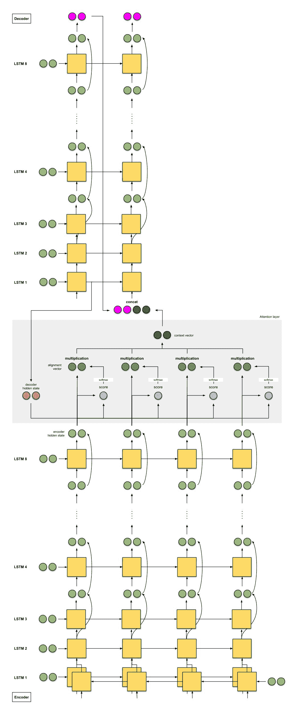*图 2c：谷歌翻译的 NMT。跳跃连接用弯曲箭头表示。注意：LSTM 单元只显示隐藏状态和输入，不显示单元状态输入。* 

该模型在 WMT'14 英语-法语数据集上达到 38.95 的 BLEU 值，在 WMT'14 英语-德语数据集上达到 24.17 的 BLEU 值。

> GNMT：带 8 个堆叠编码器（+ 双向 + 残差连接）的 seq2seq + 注意力

8 个翻译器从 A、B 到 H 从上到下依次排好。每个翻译器都读取相同的德语文本。针对每个单词，翻译器 A 与 B「分享」它们的发现，翻译器 B 将其改进并与 C「分享」——重复这个过程，直到到达翻译器 H。此外，在读取德语文本时，翻译器 H 会基于它的所知和收到的信息记录下相关的关键词。

每个翻译器都读取完德语文本后，翻译器 A 就会开始翻译第一个单词。首先，它回溯原记忆，然后与 B 共享答案，B 改进答案并与 C 共享——重复这一过程，直到到达翻译器 H。翻译器 H 根据他记录的关键词和得到的答案写出第一个翻译词。重复此操作，直到完成全部翻译。

**3\. 总结** 

本文介绍了以下架构：

*   seq2seq

*   seq2seq + 注意力

*   带双向编码器的 seq2seq + 注意力

*   带两层堆叠编码器的 seq2seq + 注意力

*   GNMT：带 8 个堆叠编码器（+双向+残差连接）的 seq2seq + 注意力

**附录：评分函数**

以下是 Lilian Weng 编写的一些评分函数。本文提到了 addictive/ concat 和 dot product。涉及点积运算（点积、余弦相似度等）的评分函数的思路是度量两个向量间的相似度。对于前馈神经网络评分函数，思路是让模型学习 alignment 权重和译文。

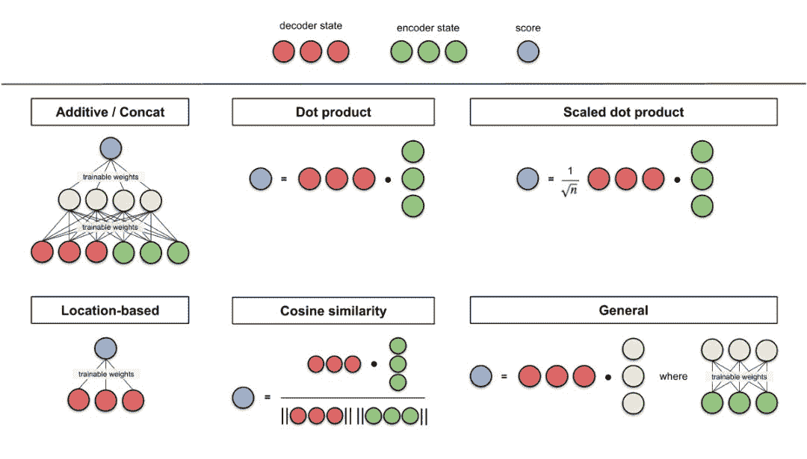*图 A0：评分函数图解汇总。*

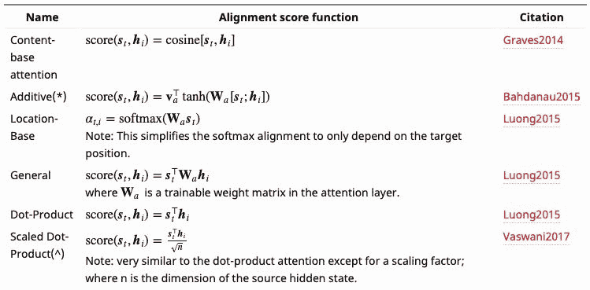*图 A1：评分函数公式汇总。***********

*原文链接：https://towardsdatascience.com/attn-illustrated-attention-5ec4ad276ee3*

****本文为机器之心编译，**转载请联系本公众号获得授权****。**

✄------------------------------------------------

**加入机器之心（全职记者 / 实习生）：hr@jiqizhixin.com**

**投稿或寻求报道：**content**@jiqizhixin.com**

**广告 & 商务合作：bd@jiqizhixin.com**