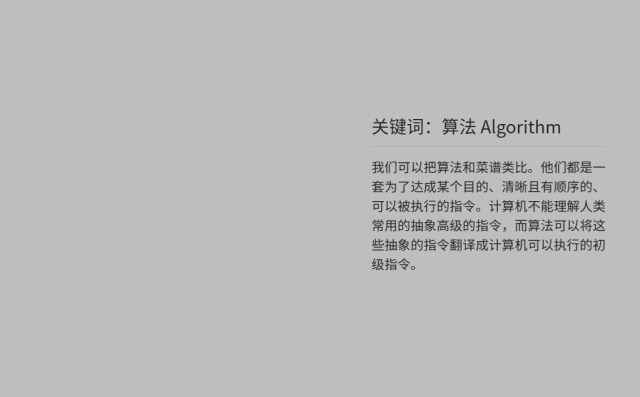
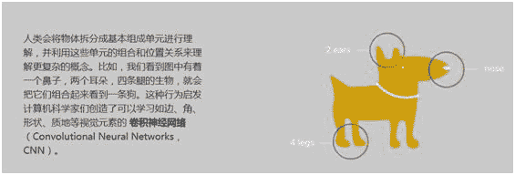
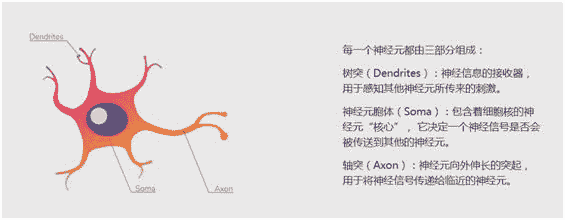
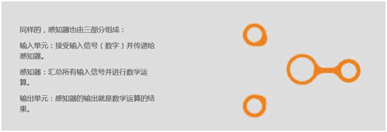
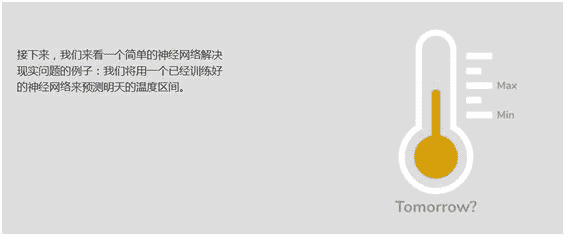
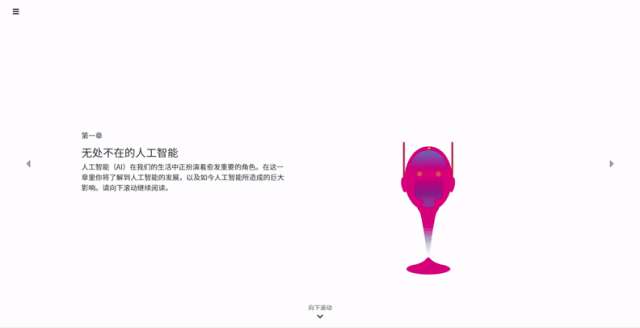

# 图解人工智能，这群大学生做了个有趣的交互项目（中文版）

> 原文：[`mp.weixin.qq.com/s?__biz=MzA3MzI4MjgzMw==&mid=2650761098&idx=5&sn=a587bc4135bd7e419e0d00aaf1e679b8&chksm=871aa3f4b06d2ae23277ebc78ced6ce9a83fa6895bf16b62aff00ffe8d997328c5c6364d396e&scene=21#wechat_redirect`](http://mp.weixin.qq.com/s?__biz=MzA3MzI4MjgzMw==&mid=2650761098&idx=5&sn=a587bc4135bd7e419e0d00aaf1e679b8&chksm=871aa3f4b06d2ae23277ebc78ced6ce9a83fa6895bf16b62aff00ffe8d997328c5c6364d396e&scene=21#wechat_redirect)

机器之心报道

**机器之心编辑部**

> AI 就是机器人吗？AI 会消灭人类、统治世界吗？从事 AI 的你肯定经常被问到这些问题。来自布朗大学与罗德岛艺术学院的学生马家驹、毛逸聪、和胡一玫一起做了一个交互动画网站——OKAI，旨在向没有数学和计算机基础的读者介绍 AI 和深度学习，希望能够借此降低了解 AI 的门槛，让更多的人了解 AI 和深度学习，并消除主流媒体报道带来的许多误解与恐惧。

网站链接：https://okai.brown.edu/zh/index.html

OKAI 的设想最初是由马家驹提出的。在布朗大学和罗德岛艺术学院读双学位的他，意识到 AI 如火如荼的发展给人们所带来的除了便利，也有一些恐惧和误解。而造成这个现象的根本原因是现有的 AI 相关的书籍和教程大都门槛很高，且有很多复杂的数学公式和代码，不便于科普 AI。于是，他就想通过一些轻松且简单易懂的方式向周围的人介绍 AI。他找了在布朗读计算机科学的毛逸聪和在罗德岛设计学院读工业设计的胡一玫，联合了两位教授，开始了 OKAI 的设计和开发。

OKAI 的网站以交互式滚动动画的形式介绍了深度学习的现状、发展以及前馈神经网络的一些简单概念，去除了难懂的数学公式，把深度学习概念形象化，简单化。

这是第一期内容，作者希望之后可以加入更多的内容，比如 CNN，RNN，最近新出现的 Transformer 和 GNN 之类，并提供简单深度学习应用等带编程的内容。

网站暂时提供中英两种语言，可以在主页进行切换。

该网站共分为以下 7 个章节

*   体验人工智能

*   无处不在的人工智能

*   深度学习简史

*   深度学习的基本元素

*   感知器学习

*   前馈神经网络简介

*   前馈神经网络实例

入门教材那么多，这个网站有什么特别的呢？下面让我们一起来解锁一下。

**可以上手体验**

第零节「体验人工智能」从最基础的视觉任务——识别手写数字开始，读者可以在下图中的白色方框区域写出任意形状的数字，然后点击「识别」查看识别结果。

为了测试网站识别技术能不能应对不好好写数字的同学，小编特地写了一个像「7」的「9」……

**小编的手写数字「9」**

结果，系统真的识别为了「7」……你也可以进网页「调戏」一下这个识别系统。

*识别结果。*

**知识门槛低**

「算法」、「深度学习」、「神经网络」是 AI 从业者每天都在接触的术语，但你是否想过如何向身边的人通俗地解释这些术语？这个网站提供了一些有趣的思路，如把「算法」比喻为菜谱，通过引入人类识别物体的过程解释「卷积神经网络」的基本原理等。

除了类比之外，创作者还很好地结合了读者的原有知识储备，用已知解释未知，充分降低理解门槛：

为了加深读者的印象，创作者还举了一些贴近生活的简单例子：

**澄清常识：****AI≠机器人，现阶段 AI≠AGI**

与多数人工智能入门材料不同的是，创作者对普通人容易混淆的一些概念进行了澄清，如 AI 就是机器人吗？现在的 AI 真的像「终结者」那么厉害吗？如果再有人问你这些问题，请把这个网站分享给 Ta。

网站的后半部分还详细介绍了感知器、前馈神经网络等内容，既包含基本原理，也有生动的实例，适合推荐给身边对 AI 感兴趣的小伙伴。********

****本文为机器之心报道，**转载请联系原公众号获得授权****。**

✄------------------------------------------------

**加入机器之心（全职记者 / 实习生）：hr@jiqizhixin.com**

**投稿或寻求报道：**content**@jiqizhixin.com**

**广告 & 商务合作：bd@jiqizhixin.com**