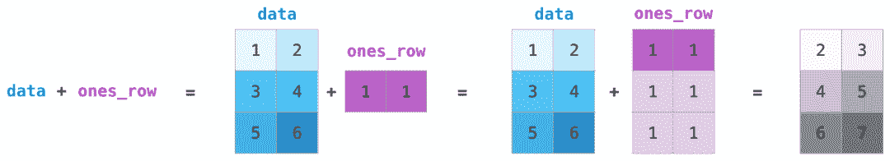
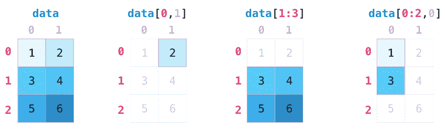
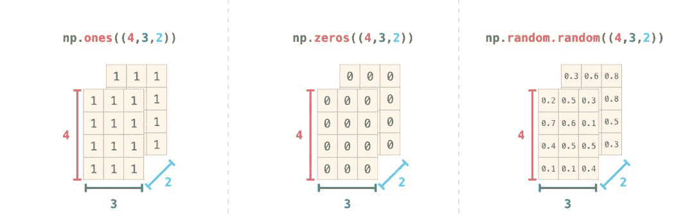

# 图解 NumPy，这是理解数组最形象的一份教程了

> 原文：[`mp.weixin.qq.com/s?__biz=MzA3MzI4MjgzMw==&mid=2650765768&idx=2&sn=6ef0dae4e7a7603c7fdb15d68d990c94&chksm=871abdb6b06d34a0c88a51c1e9c469b7dde2febd75c698a5b1cf5bc4ef231489f60d74889123&scene=21#wechat_redirect`](http://mp.weixin.qq.com/s?__biz=MzA3MzI4MjgzMw==&mid=2650765768&idx=2&sn=6ef0dae4e7a7603c7fdb15d68d990c94&chksm=871abdb6b06d34a0c88a51c1e9c469b7dde2febd75c698a5b1cf5bc4ef231489f60d74889123&scene=21#wechat_redirect)

选自 Jay Alammar Blog

**作者：Jay Alammar**

**机器之心编译**

**参与：高璇、路**

> 本文用可视化的方式介绍了 NumPy 的功能和使用示例。


NumPy 软件包是 Python 生态系统中数据分析、机器学习和科学计算的主力军。它极大地简化了向量和矩阵的操作处理。Python 的一些主要软件包（如 scikit-learn、SciPy、pandas 和 tensorflow）都以 NumPy 作为其架构的基础部分。除了能对数值数据进行切片（slice）和切块（dice）之外，使用 NumPy 还能为处理和调试上述库中的高级实例带来极大便利。

本文将介绍使用 NumPy 的一些主要方法，以及在将数据送入机器学习模型之前，它如何表示不同类型的数据（表格、图像、文本等）。

```py
import numpy as np
```

**创建数组**

我们可以通过传递一个 python 列表并使用 np.array（）来创建 NumPy 数组（极大可能是多维数组）。在本例中，python 创建的数组如下图右所示：


通常我们希望 NumPy 能初始化数组的值，为此 NumPy 提供了 ones()、zeros() 和 random.random() 等方法。我们只需传递希望 NumPy 生成的元素数量即可：


一旦创建了数组，我们就可以尽情对它们进行操作。

**数组运算**

让我们创建两个 NumPy 数组来展示数组运算功能。我们将下图两个数组称为 data 和 ones：


将它们按位置相加（即每行对应相加），直接输入 data + ones 即可：


当我开始学习这些工具时，我发现这样的抽象让我不必在循环中编写类似计算。此类抽象可以使我在更高层面上思考问题。

除了「加」，我们还可以进行如下操作：


通常情况下，我们希望数组和单个数字之间也可以进行运算操作（即向量和标量之间的运算）。比如说，我们的数组表示以英里为单位的距离，我们希望将其单位转换为千米。只需输入 data * 1.6 即可：


看到 NumPy 是如何理解这个运算的了吗？这个概念叫做广播机制（broadcasting），它非常有用。

**索引**

我们可以我们像对 python 列表进行切片一样，对 NumPy 数组进行任意的索引和切片：


**聚合**

NumPy 还提供聚合功能：


除了 min、max 和 sum 之外，你还可以使用 mean 得到平均值，使用 prod 得到所有元素的乘积，使用 std 得到标准差等等。

**更多维度**

上述的例子都在一个维度上处理向量。NumPy 之美的关键在于，它能够将上述所有方法应用到任意数量的维度。

**创建矩阵**

我们可以传递下列形状的 python 列表，使 NumPy 创建一个矩阵来表示它：

```py
np.array([[1,2],[3,4]])
```

我们也可以使用上面提到的方法（ones()、zeros() 和 random.random()），只要写入一个描述我们创建的矩阵维数的元组即可：


**矩阵运算**

如果两个矩阵大小相同，我们可以使用算术运算符（+-*/）对矩阵进行加和乘。NumPy 将它们视为 position-wise 运算：



我们也可以对不同大小的两个矩阵执行此类算术运算，但前提是某一个维度为 1（如矩阵只有一列或一行），在这种情况下，NumPy 使用广播规则执行算术运算：

**点乘**

算术运算和矩阵运算的一个关键区别是矩阵乘法使用点乘。NumPy 为每个矩阵赋予 dot() 方法，我们可以用它与其他矩阵执行点乘操作：


我在上图的右下角添加了矩阵维数，来强调这两个矩阵的临近边必须有相同的维数。你可以把上述运算视为：


**矩阵索引**

当我们处理矩阵时，索引和切片操作变得更加有用：



矩阵聚合

我们可以像聚合向量一样聚合矩阵：


我们不仅可以聚合矩阵中的所有值，还可以使用 axis 参数执行跨行或跨列聚合：


**转置和重塑**

处理矩阵时的一个常见需求是旋转矩阵。当需要对两个矩阵执行点乘运算并对齐它们共享的维度时，通常需要进行转置。NumPy 数组有一个方便的方法 T 来求得矩阵转置：


在更高级的实例中，你可能需要变换特定矩阵的维度。在机器学习应用中，经常会这样：某个模型对输入形状的要求与你的数据集不同。在这些情况下，NumPy 的 reshape() 方法就可以发挥作用了。只需将矩阵所需的新维度赋值给它即可。可以为维度赋值-1，NumPy 可以根据你的矩阵推断出正确的维度：


**再多维度**

NumPy 可以在任意维度实现上述提到的所有内容。其中心数据结构被叫作 ndarray（N 维数组）不是没道理的。


在很多情况下，处理一个新的维度只需在 NumPy 函数的参数中添加一个逗号：



**实际用法**

以下是 NumPy 可实现的有用功能的实例演示。

**公式**

实现可用于矩阵和向量的数学公式是 NumPy 的关键用例。这就是 NumPy 是 python 社区宠儿的原因。例如均方差公式，它是监督机器学习模型处理回归问题的核心：


在 NumPy 中实现该公式很容易：


这样做的好处在于，NumPy 并不关心 predictions 和 labels 包含一个值还是一千个值（只要它们大小相同）。我们可以通过一个示例依次执行上面代码行中的四个操作：


预测和标签向量都包含三个值，也就是说 n 的值为 3。减法后，得到的值如下：


然后将向量平方得到：


现在对这些值求和：


得到的结果即为该预测的误差值和模型质量评分。

**数据表示**

考虑所有需要处理和构建模型所需的数据类型（电子表格、图像、音频等），其中很多都适合在 n 维数组中表示：

表格和电子表格

电子表格或值表是二维矩阵。电子表格中的每个工作表都可以是它自己的变量。python 中最流行的抽象是 pandas 数据帧，它实际上使用了 NumPy 并在其之上构建。


音频和时间序列

音频文件是样本的一维数组。每个样本都是一个数字，代表音频信号的一小部分。CD 质量的音频每秒包含 44,100 个样本，每个样本是-65535 到 65536 之间的整数。这意味着如果你有一个 10 秒的 CD 质量 WAVE 文件，你可以将它加载到长度为 10 * 44,100 = 441,000 的 NumPy 数组中。如果想要提取音频的第一秒，只需将文件加载到 audio 的 NumPy 数组中，然后获取 audio[:44100]。

以下是一段音频文件：


时间序列数据也是如此（如股票价格随时间变化）。

图像

图像是尺寸（高度 x 宽度）的像素矩阵。

如果图像是黑白（即灰度）的，则每个像素都可以用单个数字表示（通常在 0（黑色）和 255（白色）之间）。想要裁剪图像左上角 10 x 10 的像素吗？在 NumPy 写入

即可。

下图是一个图像文件的片段：


如果图像是彩色的，则每个像素由三个数字表示——红色、绿色和蓝色。在这种情况下，我们需要一个三维数组（因为每个单元格只能包含一个数字）。因此彩色图像由尺寸为（高 x 宽 x3）的 ndarray 表示：


语言

如果我们处理文本，情况就不同了。文本的数字表示需要一个构建词汇表的步骤（模型知道的唯一字清单）和嵌入步骤。让我们看看用数字表示以下文字的步骤：

模型需要先查看大量文本，再用数字表示这位诗人的话语。我们可以让它处理一个小数据集，并用它来构建一个词汇表（71,290 个单词）：


这个句子可以被分成一个 token 数组（基于通用规则的单词或单词的一部分）：


然后我们用词汇表中的 ID 替换每个单词：


这些 ID 仍然没有为模型提供太多信息价值。因此，在将这一组单词输入到模型之前，我们需要用嵌入替换 token/单词（在本例中为 50 维 word2vec 嵌入）：


可以看到，该 NumPy 数组的维度为 [embedding_dimension x sequence_length]。出于性能原因，深度学习模型倾向于保留批大小的第一维（因为如果并行训练多个示例，模型训练速度会加快）。在这种情况下，reshape() 变得非常有用。如像 BERT 这样的模型期望的输入形式是：[batch_size，sequence_length，embedding_size]。


现在这是 numeric volume 形式，模型可以处理并执行相应操作。其他行虽然留空，但是它们会被填充其他示例以供模型训练（或预测）。************

*原文链接：**https://jalammar.github.io/visual-numpy/*

**深度****Pro**

**理论详解 | 工程实践 | 产业分析 | 行研报告**

机器之心最新上线深度内容栏目，汇总 AI 深度好文，详解理论、工程、产业与应用。这里的每一篇文章，都需要深度阅读 15 分钟。

**今日深度推荐**

万字综述，核心开发者全面解读 PyTorch 内部机制

CVPR 2019 提前看：少样本学习专题

专访院士张钹：AI 奇迹难再现，深度学习技术潜力已近天花板


点击图片，进入小程序深度 Pro 栏目

PC 点击阅读原文，访问官网

更适合深度阅读

www.jiqizhixin.com/insight

每日重要论文、教程、资讯、报告也不想错过？

[点击订阅每日精选](https://mp.weixin.qq.com/s?__biz=MzIyMjE2ODk5NQ==&mid=2247483701&idx=1&sn=f6f5c2f1ef750490595b03f8650aff72&scene=21#wechat_redirect)